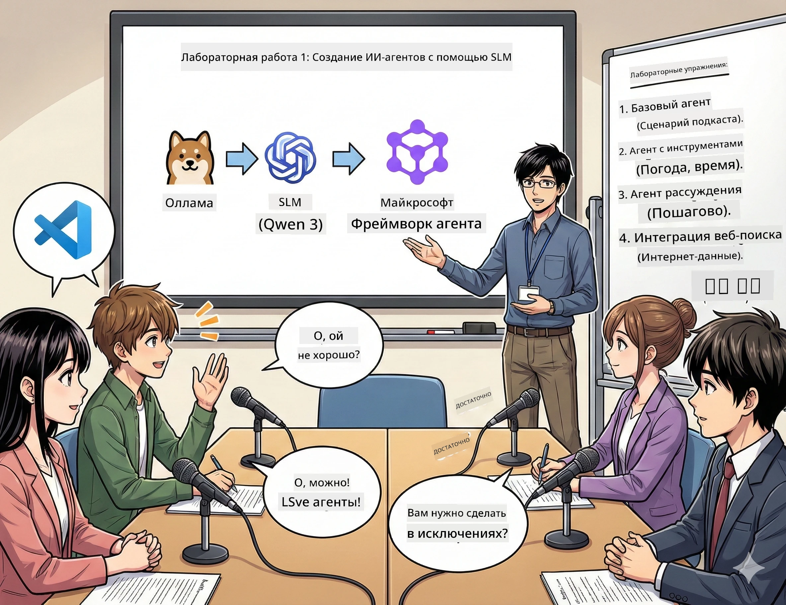

# Первая сцена: Познакомьтесь с вашим AI-ассистентом по исследованиям 🤖

## Вызов

Вы запускаете «Будущее байтов», ваш новый технологический подкаст. Первый эпизод посвящён последним достижениям AI, но у вас есть всего 24 часа, чтобы:
1. Исследовать тему
2. Найти надёжные источники
3. Написать захватывающий сценарий
4. Сделать его звучащим естественно

**Поворот сюжета**: вам не нужно делать это в одиночку. Вы собираетесь создать своего первого AI-ассистента, который поможет вам во всём этом. Назовём его Алекс — ваш неутомимый исследовательский партнёр, которому не нужен сон.

## Почему маленькие языковые модели? (спойлер: они классные)

Представьте себе маленькую языковую модель (SLM) как личного AI, который работает *на вашем* компьютере. Без облака, без ежемесячных платежей, без сомнительного обмена данными.

**Почему SLM такие 🔥:**
- **🏠 Работают на вашем устройстве**: ноутбук, настольный ПК или даже мощный Raspberry Pi
- **💸 Нет постоянных затрат**: никаких API-платежей, съедающих ваш карман
- **🔒 Конфиденциальность прежде всего**: ваши данные никогда не покидают ваше устройство
- **⚡ Молниеносная скорость**: без сетевых задержек — мгновенный отклик
- **🪦 Лёгкие**: от 1 до 10 миллиардов параметров в сравнении с большими моделями, у которых 100 миллиардов+

**Популярные SLM**: Qwen 3, Phi-4, Gemma 3 (в этом воркшопе используется Qwen)

## Ваш набор инструментов

### Ollama: ваш менеджер моделей AI

[Ollama](https://ollama.com/) — это как Steam для AI-моделей. С его помощью можно легко скачивать, запускать и управлять моделями с простыми командами.

**Что в нём классного:**
- Одной командой скачать и запустить любую модель
- Поддержка Mac, Windows и Linux
- Автоматическое использование GPU, если он есть
- Очень экономит память

### Microsoft Agent Framework: место, где происходит волшебство

[Microsoft Agent Framework](https://github.com/microsoft/agent-framework) — это игровая площадка для создания AI-агентов, которые могут:

- 💬 Общаться и помнить темы разговоров
- 🛠️ Использовать настраиваемые инструменты (например, поиск в интернете или проверку погоды)
- 🧠 Решать сложные задачи поэтапно
- 🤝 Работать в команде с другими агентами
- 🔌 Подключаться к разным AI-провайдерам (OpenAI, Ollama, Azure)

**Строительные блоки:**
- **Агенты**: AI-ассистенты с конкретными задачами
- **Инструменты**: специальные способности, которые вы им даёте
- **Память**: чтобы они не забывали ваши диалоги
- **Размышления**: учим их думать, а не просто отвечать

## Ваш тренировочный монтаж: 4 задания

### Задание 1: Создайте своего первого агента

📓 [Откройте блокнот](../../code/01.BasicAgent/00.BasicAgent-agent.ipynb)

**Задача**: Создать Алекса, вашего AI для написания сценариев подкастов. Алекс должен сгенерировать диалог двух ведущих, обсуждающих технологические темы.

**Вы научитесь:**
- Как активировать AI-агента (проще, чем вставать по понедельникам)
- Задавать личность и инструкции
- Генерировать реалистичные сценарии подкастов
- Понимать ответы Алекса

**Условие победы**: Алекс создаёт сценарий для пробного эпизода вашего подкаста «Будущее байтов» о AI! 🎯

### Задание 2: Дайте Алексу суперсилы (инструменты!)

📓 [Откройте блокнот](../../code/01.BasicAgent/01.BasicAgent-tools.ipynb)

**Задача**: Алекс умён, но не знает, какая сегодня погода и который час. Давайте исправим это, добавив инструменты!

**Вы научитесь:**
- Создавать настраиваемые Python-функции как "инструменты"
- Позволять Алексу самостоятельно решать, *когда* использовать какой инструмент
- Наблюдать, как он самостоятельно решает задачи
- Комбинировать несколько инструментов для сложных задач

**Условие победы**: спросите — «Какая погода в Токио?» — Алекс найдёт ответ сам! ☁️

### Задание 3: Научите Алекса думать

📓 [Откройте блокнот](../../code/01.BasicAgent/02.BasicAgent-reasoning.ipynb)

**Задача**: Позвольте Алексу демонстрировать процесс решения. Вы хотите видеть *как* он думает, а не только получить ответ.

**Вы научитесь:**
- Включать "режим рассуждений" (как показываете работу на уроке математики)
- Видеть пошаговый процесс мышления Алекса
- Понимать подсказки цепочек рассуждений
- Отлаживать, когда Алекс запутывается

**Условие победы**: спросите сложный математический вопрос и посмотрите, как Алекс его обдумывает! 🧠

### Задание 4: Подключите Алекса к Интернету

📓 [Откройте блокнот](../../code/01.BasicAgent/03.BasicAgent-websearch.ipynb)

**Задача**: Знания Алекса имеют срок давности. Подключим его к сети, чтобы получать актуальную информацию!

**Вы научитесь:**
- Создавать пользовательский инструмент для веб-поиска
- Интегрировать внешние API
- Умело обрабатывать сетевые ошибки
- Получать информацию вне тренировочных данных Алекса

**Условие победы**: спросите последние новости технологий и получите свежие результаты! 📰

## Перед началом 🚀

**Обязательное оборудование**:
- Установлен Python 3.10+
- Ollama запущена (проверьте с помощью `ollama --version`)
- VS Code с расширением Python
- Минимум 8 ГБ ОЗУ (для комфортной работы лучше 16 ГБ)

## Последовательность заданий

Выполняйте блокноты по порядку для полного погружения:

1. [00.BasicAgent-agent.ipynb](../../code/01.BasicAgent/00.BasicAgent-agent.ipynb) — знакомство с Алексом (вашим первым агентом)
2. [01.BasicAgent-tools.ipynb](../../code/01.BasicAgent/01.BasicAgent-tools.ipynb) — пора прокачаться!
3. [02.BasicAgent-reasoning.ipynb](../../code/01.BasicAgent/02.BasicAgent-reasoning.ipynb) — учим Алекса думать
4. [03.BasicAgent-websearch.ipynb](../../code/01.BasicAgent/03.BasicAgent-websearch.ipynb) — открываем доступ в Интернет!

## Что вы освоите

После первой сцены вы сможете:

- ✅ Запускать AI-модели на своём оборудовании (без облака!)
- ✅ Создавать агентов с индивидуальностью и навыками
- ✅ Давать агентам инструменты для решения реальных задач
- ✅ Позволять агентам показывать процесс рассуждений
- ✅ Подключать агентов к внешним источникам данных
- ✅ Отлаживать, когда что-то идёт не так

## Если что-то идёт не так (и как починить) 🔧

### «Алекс не загружается! Мало памяти!»
**Решение**: Ваш компьютер перегружен. Закройте другие приложения или переключитесь на меньшую модель. 8 ГБ — минимальное требование.

### «Алекс работает слишком медленно»
**Решение**: Включите аппаратное ускорение GPU в настройках Ollama. Или уменьшите размер окна контекста. Включаем режим скоростного демона! 🏎️

### «Инструменты не работают!»
**Решение**: Тщательно проверьте подписи функций. Алексу нужны правильные подсказки типов, чтобы понять назначение инструментов. Представьте, что даёте чёткие инструкции.

## Полезные ссылки 🔗

- [Документация Agent Framework](https://github.com/microsoft/agent-framework) — официальные руководства и примеры
- [Библиотека моделей Ollama](https://ollama.com/library) — просмотр всех доступных моделей
- [Модель Qwen](https://ollama.com/library/qwen3) — мозг вашего AI-ассистента
- [Примеры кода](https://github.com/microsoft/agent-framework/tree/main/python/samples) — вдохновение для ваших проектов

## Следующий шаг: Вторая сцена 🎬

У вас есть один агент. А если бы у вас была *команда* агентов, работающих вместе? Во второй сцене вы создадите полноценную команду для создания подкаста:
- **Исследовательский агент**: поиск лучших источников
- **Сценарист**: создание идеального сценария
- **Редактор (вы!)**: утверждение или запрос изменений

Давайте создадим немного AI-магии! → [Вторая сцена: создаём команду для производства](02.AIAgentOrchestrationAndWorkflows.md)

---

**Застряли?** Задавайте вопросы во время воркшопа. Учимся вместе! 🙌

---

<!-- CO-OP TRANSLATOR DISCLAIMER START -->
**Отказ от ответственности**:
Этот документ был переведен с использованием автоматического переводчика [Co-op Translator](https://github.com/Azure/co-op-translator). Несмотря на наши усилия обеспечить точность, просим учитывать, что автоматический перевод может содержать ошибки или неточности. Оригинальный документ на его родном языке следует считать официальным источником. Для критически важной информации рекомендуется профессиональный переводец. Мы не несем ответственности за любые недоразумения или неверные толкования, возникшие в результате использования данного перевода.
<!-- CO-OP TRANSLATOR DISCLAIMER END -->