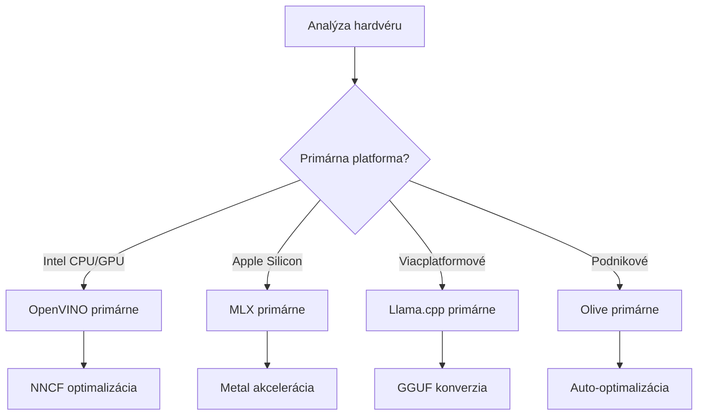
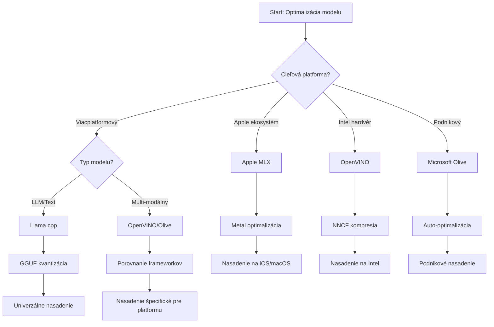
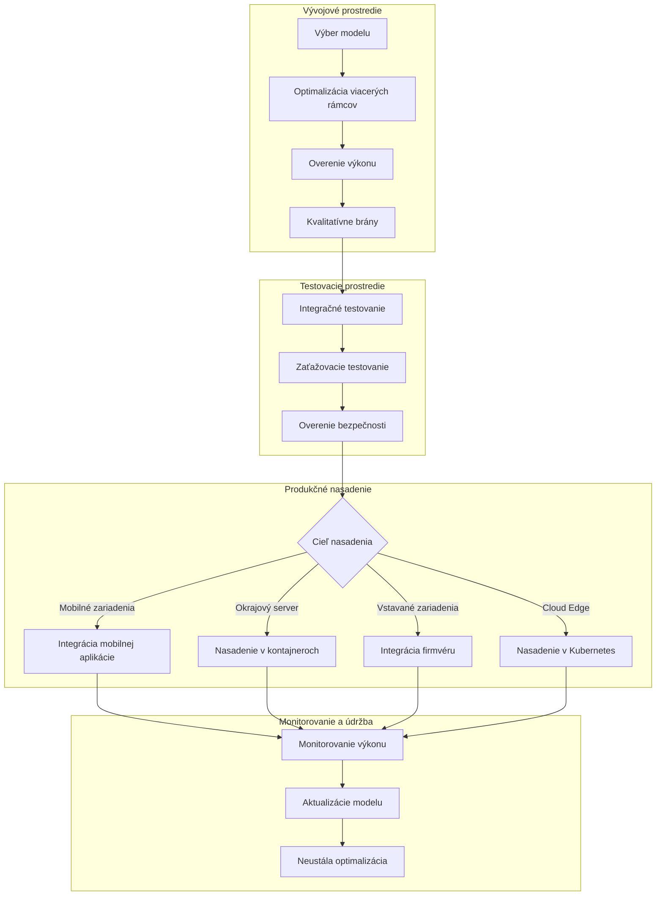

# Sekcia 6: Syntéza pracovného toku vývoja Edge AI

## Obsah
1. [Úvod](#úvod)
2. [Ciele učenia](#ciele-učenia)
3. [Prehľad jednotného pracovného toku](#prehľad-jednotného-pracovného-toku)
4. [Matica výberu frameworku](#matica-výberu-frameworku)
5. [Syntéza osvedčených postupov](#syntéza-osvedčených-postupov)
6. [Sprievodca stratégiou nasadenia](#sprievodca-stratégiou-nasadenia)
7. [Pracovný tok optimalizácie výkonu](#pracovný-tok-optimalizácie-výkonu)
8. [Kontrolný zoznam pripravenosti na produkciu](#kontrolný-zoznam-pripravenosti-na-produkciu)
9. [Riešenie problémov a monitorovanie](#riešenie-problémov-a-monitorovanie)
10. [Zabezpečenie budúcnosti vašej Edge AI pipeline](#zabezpečenie-budúcnosti-vašej-edge-ai-pipeline)

## Úvod

Vývoj Edge AI vyžaduje sofistikované pochopenie viacerých frameworkov na optimalizáciu, stratégií nasadenia a hardvérových aspektov. Táto komplexná syntéza spája poznatky z Llama.cpp, Microsoft Olive, OpenVINO a Apple MLX do jednotného pracovného toku, ktorý maximalizuje efektivitu, zachováva kvalitu a zabezpečuje úspešné nasadenie do produkcie.

Počas tohto kurzu sme preskúmali jednotlivé optimalizačné frameworky, z ktorých každý má unikátne silné stránky a špecializované prípady použitia. V praxi však projekty Edge AI často vyžadujú kombinovanie techník z viacerých frameworkov alebo strategické rozhodovanie o tom, ktorý prístup priniesie najlepšie výsledky pre konkrétne obmedzenia a požiadavky.

Táto sekcia syntetizuje kolektívnu múdrosť všetkých frameworkov do použiteľných pracovných tokov, rozhodovacích stromov a osvedčených postupov, ktoré vám umožnia efektívne a účinne budovať Edge AI riešenia pripravené na produkciu. Či už optimalizujete pre mobilné zariadenia, embedded systémy alebo edge servery, tento sprievodca poskytuje strategický rámec pre informované rozhodovanie počas celého vývojového cyklu.

## Ciele učenia

Na konci tejto sekcie budete schopní:

### Strategické rozhodovanie
- **Vyhodnotiť a vybrať** optimálny optimalizačný framework na základe požiadaviek projektu, hardvérových obmedzení a scénarov nasadenia
- **Navrhovať komplexné pracovné toky**, ktoré integrujú viacero optimalizačných techník pre maximálnu efektivitu
- **Zhodnotiť kompromisy** medzi presnosťou modelu, rýchlosťou inferencie, využitím pamäte a zložitosťou nasadenia v rôznych frameworkoch

### Integrácia pracovných tokov
- **Implementovať jednotné vývojové pipeline**, ktoré využívajú silné stránky viacerých optimalizačných frameworkov
- **Vytvárať reprodukovateľné pracovné toky** pre konzistentnú optimalizáciu modelov a nasadenie v rôznych prostrediach
- **Zaviesť kvalitatívne brány** a validačné procesy na zabezpečenie, že optimalizované modely spĺňajú produkčné požiadavky

### Optimalizácia výkonu
- **Použiť systematické stratégie optimalizácie** pomocou kvantizácie, prunanía a hardvérovo špecifických akceleračných techník
- **Monitorovať a benchmarkovať** výkon modelu v rôznych úrovniach optimalizácie a cieľových platformách nasadenia
- **Optimalizovať pre konkrétne hardvérové platformy** vrátane CPU, GPU, NPU a špecializovaných edge akcelerátorov

### Nasadenie do produkcie
- **Navrhovať škálovateľné architektúry nasadenia**, ktoré zvládnu viacero formátov modelov a inference engine-ov
- **Implementovať monitorovanie a zobraziteľnosť** pre Edge AI aplikácie v produkčných prostrediach
- **Zaviesť pracovné toky údržby** pre aktualizácie modelov, monitorovanie výkonu a systémovú optimalizáciu

### Vynikajúce naprieč platformami
- **Nasadzovať optimalizované modely** na rôzne hardvérové platformy pri zachovaní konzistentného výkonu
- **Riešiť platformovo špecifické optimalizácie** pre Windows, macOS, Linux, mobilné a embedded systémy
- **Vytvárať abstraktné vrstvy**, ktoré umožňujú bezproblémové nasadenie v rôznych edge prostrediach

## Prehľad jednotného pracovného toku

### Fáza 1: Analýza požiadaviek a výber frameworku

Základom úspešného nasadenia Edge AI je dôkladná analýza požiadaviek, ktorá ovplyvní výber frameworku a stratégiu optimalizácie.

#### 1.1 Hodnotenie hardvéru


**Kľúčové aspekty:**
- **Architektúra CPU**: x86, ARM, možnosti Apple Silicon
- **Dostupnosť akcelerátorov**: GPU, NPU, VPU, špecializované AI čipy
- **Pamäťové obmedzenia**: limity RAM, kapacita úložiska
- **Energetický rozpočet**: životnosť batérie, tepelné obmedzenia
- **Konektivita**: požiadavky offline, šírka pásma

#### 1.2 Matica požiadaviek aplikácie

| Požiadavka | Llama.cpp | Microsoft Olive | OpenVINO | Apple MLX |
|-------------|-----------|-----------------|----------|-----------|
| Viacplatformové | ✅ Výborné | ⚡ Dobré | ⚡ Dobré | ❌ Len pre Apple |
| Integrácia do podnikového prostredia | ⚡ Základné | ✅ Výborné | ✅ Výborné | ⚡ Obmedzené |
| Nasadenie na mobilné zariadenia | ✅ Výborné | ⚡ Dobré | ⚡ Dobré | ✅ Excelentné pre iOS |
| Inferencia v reálnom čase | ✅ Výborné | ✅ Výborné | ✅ Výborné | ✅ Výborné |
| Rôznorodosť modelov | ✅ Zameranie na LLM | ✅ Všetky modely | ✅ Všetky modely | ✅ Zameranie na LLM |
| Jednoduchosť použitia | ✅ Jednoduché | ✅ Automatizované | ⚡ Stredné | ✅ Jednoduché |

### Fáza 2: Príprava modelu a optimalizácia

#### 2.1 Univerzálny pipeline hodnotenia modelu

```python
# Univerzálny rámec hodnotenia modelu
class EdgeAIModelAssessment:
    def __init__(self, model_path, target_hardware):
        self.model_path = model_path
        self.target_hardware = target_hardware
        self.optimization_frameworks = []
        
    def assess_model_characteristics(self):
        """Analyze model size, architecture, and complexity"""
        return {
            'model_size': self.get_model_size(),
            'parameter_count': self.get_parameter_count(),
            'architecture_type': self.detect_architecture(),
            'quantization_compatibility': self.check_quantization_support()
        }
    
    def recommend_optimization_strategy(self):
        """Recommend optimal frameworks and techniques"""
        characteristics = self.assess_model_characteristics()
        
        if self.target_hardware.startswith('apple'):
            return self.mlx_optimization_strategy(characteristics)
        elif self.target_hardware.startswith('intel'):
            return self.openvino_optimization_strategy(characteristics)
        elif characteristics['model_size'] > 7_000_000_000:  # 7 miliárd+ parametrov
            return self.enterprise_optimization_strategy(characteristics)
        else:
            return self.lightweight_optimization_strategy(characteristics)
```

#### 2.2 Multi-frameworkový optimalizačný pipeline

**Sekvenčný prístup k optimalizácii:**
1. **Počiatočná konverzia**: prevod do medzifomátu (ONNX, ak je možné)
2. **Frameworkom špecifická optimalizácia**: aplikácia špecializovaných techník
3. **Krížová validácia**: overenie výkonu na cieľových platformách
4. **Konečné balenie**: príprava na nasadenie

```bash
# Skript na optimalizáciu viacerých rámcov
#!/bin/bash

MODEL_NAME="phi-3-mini"
BASE_MODEL="microsoft/Phi-3-mini-4k-instruct"

# Fáza 1: Konverzia ONNX (univerzálna)
python convert_to_onnx.py --model $BASE_MODEL --output models/onnx/

# Fáza 2: Platformovo špecifická optimalizácia
if [[ "$TARGET_PLATFORM" == "intel" ]]; then
    # Optimalizácia OpenVINO
    python optimize_openvino.py --input models/onnx/ --output models/openvino/
elif [[ "$TARGET_PLATFORM" == "apple" ]]; then
    # Optimalizácia MLX
    python optimize_mlx.py --input $BASE_MODEL --output models/mlx/
elif [[ "$TARGET_PLATFORM" == "cross" ]]; then
    # Optimalizácia Llama.cpp
    python convert_to_gguf.py --input models/onnx/ --output models/gguf/
fi

# Fáza 3: Overenie
python validate_optimization.py --original $BASE_MODEL --optimized models/$TARGET_PLATFORM/
```

### Fáza 3: Validácia výkonu a benchmarking

#### 3.1 Komplexný rámec na benchmarking

```python
class EdgeAIBenchmark:
    def __init__(self, optimized_models):
        self.models = optimized_models
        self.metrics = {
            'inference_time': [],
            'memory_usage': [],
            'accuracy_score': [],
            'throughput': [],
            'energy_consumption': []
        }
    
    def run_comprehensive_benchmark(self):
        """Execute standardized benchmarks across all optimized models"""
        test_inputs = self.generate_test_inputs()
        
        for model_framework, model_path in self.models.items():
            print(f"Benchmarking {model_framework}...")
            
            # Testovanie oneskorenia
            latency = self.measure_inference_latency(model_path, test_inputs)
            
            # Profilovanie pamäte
            memory = self.profile_memory_usage(model_path)
            
            # Overovanie presnosti
            accuracy = self.validate_model_accuracy(model_path, test_inputs)
            
            # Analýza priepustnosti
            throughput = self.measure_throughput(model_path)
            
            self.record_metrics(model_framework, latency, memory, accuracy, throughput)
    
    def generate_optimization_report(self):
        """Create comprehensive comparison report"""
        report = {
            'recommendations': self.analyze_performance_trade_offs(),
            'deployment_guidance': self.generate_deployment_recommendations(),
            'monitoring_requirements': self.define_monitoring_metrics()
        }
        return report
```

## Matica výberu frameworku

### Rozhodovací strom pre výber frameworku



### Komplexné kritériá výberu

#### 1. Zladenie s hlavným prípadom použitia

**Veľké jazykové modely (LLM):**
- **Llama.cpp**: najlepšie pre CPU-zamerané, viacplatformové nasadenie
- **Apple MLX**: optimálne pre Apple Silicon s jednotnou pamäťou
- **OpenVINO**: výborné pre Intel hardvér s NNCF optimalizáciou
- **Microsoft Olive**: ideálne pre podnikové workflow s automatizáciou

**Multimodálne modely:**
- **OpenVINO**: komplexná podpora pre videnie, zvuk a text
- **Microsoft Olive**: podniková optimalizácia pre komplexné pipeline
- **Llama.cpp**: limitované na textové modely
- **Apple MLX**: rastúca podpora pre multimodálne aplikácie

#### 2. Matica platformy hardvéru

| Platforma | Primárny framework | Sekundárna možnosť | Špecializované funkcie |
|----------|------------------|------------------|---------------------|
| Intel CPU/GPU | OpenVINO | Microsoft Olive | NNCF kompresia, Intel optimalizácia |
| NVIDIA GPU | Microsoft Olive | OpenVINO | CUDA akcelerácia, podnikové funkcie |
| Apple Silicon | Apple MLX | Llama.cpp | Metal shadery, jednotná pamäť |
| ARM Mobile | Llama.cpp | OpenVINO | Viacplatformové, minimálne závislosti |
| Edge TPU | OpenVINO | Microsoft Olive | Podpora špecializovaného akcelerátora |
| Embedded ARM | Llama.cpp | OpenVINO | Minimálna stopa, efektívna inferencia |

#### 3. Preferencie vývojového pracovného toku

**Rýchly prototyping:**
1. **Llama.cpp**: najrýchlejšie nastavenie, okamžité výsledky
2. **Apple MLX**: jednoduché Python API, rýchle iterácie
3. **Microsoft Olive**: automatizovaná optimalizácia, minimálna konfigurácia
4. **OpenVINO**: zložitejšie nastavenie, komplexné funkcie

**Podniková produkcia:**
1. **Microsoft Olive**: podnikové funkcie, integrácia s Azure
2. **OpenVINO**: Intel ekosystém, komplexné nástroje
3. **Apple MLX**: Apple-špecifické podnikové aplikácie
4. **Llama.cpp**: jednoduché nasadenie, obmedzené podnikové funkcie

## Syntéza osvedčených postupov

### Univerzálne princípy optimalizácie

#### 1. Progresívna stratégia optimalizácie

```python
class ProgressiveOptimization:
    def __init__(self, base_model):
        self.base_model = base_model
        self.optimization_stages = [
            'baseline_measurement',
            'format_conversion',
            'quantization_optimization',
            'hardware_acceleration',
            'production_validation'
        ]
    
    def execute_progressive_optimization(self):
        """Apply optimization techniques incrementally"""
        
        # Fáza 1: Základné meranie
        baseline_metrics = self.measure_baseline_performance()
        
        # Fáza 2: Konverzia formátu
        converted_model = self.convert_to_optimal_format()
        conversion_metrics = self.measure_performance(converted_model)
        
        # Fáza 3: Kvantizácia
        quantized_model = self.apply_quantization(converted_model)
        quantization_metrics = self.measure_performance(quantized_model)
        
        # Fáza 4: Hardvérové zrýchlenie
        accelerated_model = self.enable_hardware_acceleration(quantized_model)
        acceleration_metrics = self.measure_performance(accelerated_model)
        
        # Fáza 5: Overovanie
        production_ready = self.validate_for_production(accelerated_model)
        
        return self.compile_optimization_report(
            baseline_metrics, conversion_metrics, 
            quantization_metrics, acceleration_metrics
        )
```

#### 2. Implementácia kvalitatívnych brán

**Brány zachovania presnosti:**
- Zachovať >95 % pôvodnej presnosti modelu
- Validovať na reprezentatívnych testovacích dátach
- Implementovať A/B testovanie pre produkčnú validáciu

**Brány zlepšenia výkonu:**
- Dosiahnuť minimálne 2-násobné zrýchlenie
- Znížiť pamäťovú náročnosť aspoň o 50 %
- Overiť konzistenciu inferenčného času

**Brány pripravenosti na produkciu:**
- Prejsť záťažové testovanie pod zaťažením
- Preukázať stabilný výkon v čase
- Validovať požiadavky na bezpečnosť a súkromie

### Integrácia osvedčených postupov špecifických frameworkov

#### 1. Syntéza stratégie kvantizácie

```python
# Jednotný prístup ku kvantizácii
class UnifiedQuantizationStrategy:
    def __init__(self, model, target_platform):
        self.model = model
        self.platform = target_platform
        
    def select_optimal_quantization(self):
        """Choose best quantization based on platform and requirements"""
        
        if self.platform == 'apple_silicon':
            return self.mlx_quantization_strategy()
        elif self.platform == 'intel_hardware':
            return self.openvino_quantization_strategy()
        elif self.platform == 'cross_platform':
            return self.llamacpp_quantization_strategy()
        else:
            return self.olive_quantization_strategy()
    
    def mlx_quantization_strategy(self):
        """Apple MLX-specific quantization"""
        return {
            'method': 'mlx_quantize',
            'precision': 'int4',
            'group_size': 64,
            'optimization_target': 'unified_memory'
        }
    
    def openvino_quantization_strategy(self):
        """OpenVINO NNCF quantization"""
        return {
            'method': 'nncf_quantize',
            'precision': 'int8',
            'calibration_method': 'post_training',
            'optimization_target': 'intel_hardware'
        }
```

#### 2. Optimalizácia hardvérovej akcelerácie

**Syntéza optimalizácie CPU:**
- **SIMD inštrukcie**: využitie optimalizovaných kernelov naprieč frameworkmi
- **Pamäťová priepustnosť**: optimalizácia rozloženia dát pre efektívnosť cache
- **Správa vlákien**: vyvažovanie paralelizmu s obmedzeniami zdrojov

**Osvedčené postupy akcelerácie GPU:**
- **Batch processing**: maximalizácia priepustnosti vhodnými veľkosťami dávok
- **Správa pamäte**: optimalizácia alokácie a prenosov GPU pamäte
- **Presnosť**: použitie FP16, ak je podporované, pre lepší výkon

**Optimalizácia NPU/špecializovaných akcelerátorov:**
- **Architektúra modelu**: zabezpečiť kompatibilitu s možnosťami akcelerátora
- **Tok dát**: optimalizovať vstupno-výstupné pipeline pre efektívnosť akcelerátora
- **Stratégie zálohovania**: implementovať CPU fallback pre nepodporované operácie

## Sprievodca stratégiou nasadenia

### Univerzálna architektúra nasadenia



### Platformovo špecifické vzory nasadenia

#### 1. Stratégia nasadenia na mobilné zariadenia

```yaml
# Mobile Deployment Configuration
mobile_deployment:
  ios:
    framework: apple_mlx
    optimization:
      quantization: int4
      memory_mapping: true
      background_execution: limited
    packaging:
      format: mlx
      bundle_size: <50MB
      
  android:
    framework: llama_cpp
    optimization:
      quantization: q4_k_m
      threading: android_optimized
      memory_management: conservative
    packaging:
      format: gguf
      apk_size: <100MB
      
  cross_platform:
    framework: onnx_runtime
    optimization:
      quantization: int8
      execution_provider: cpu
    packaging:
      format: onnx
      shared_libraries: minimal
```

#### 2. Nasadenie na edge server

```yaml
# Edge Server Deployment Configuration
edge_server:
  intel_based:
    framework: openvino
    optimization:
      quantization: int8
      acceleration: cpu_gpu_auto
      batch_processing: dynamic
    deployment:
      container: openvino_runtime
      orchestration: kubernetes
      scaling: horizontal
      
  nvidia_based:
    framework: microsoft_olive
    optimization:
      quantization: int4
      acceleration: cuda
      tensor_parallelism: true
    deployment:
      container: nvidia_triton
      orchestration: kubernetes
      scaling: gpu_aware
```

### Osvedčené postupy kontajnerizácie

```dockerfile
# Multi-Framework Edge AI Container
FROM ubuntu:22.04 as base

# Install common dependencies
RUN apt-get update && apt-get install -y \
    python3 \
    python3-pip \
    build-essential \
    cmake \
    && rm -rf /var/lib/apt/lists/*

# Framework-specific stages
FROM base as openvino
RUN pip install openvino nncf optimum[intel]

FROM base as llamacpp
RUN git clone https://github.com/ggerganov/llama.cpp.git \
    && cd llama.cpp && make LLAMA_OPENBLAS=1

FROM base as olive
RUN pip install olive-ai[auto-opt] onnxruntime-genai

# Production stage with selected framework
FROM openvino as production
COPY models/ /app/models/
COPY src/ /app/src/
WORKDIR /app

EXPOSE 8080
CMD ["python3", "src/inference_server.py"]
```

## Pracovný tok optimalizácie výkonu

### Systematické ladenie výkonu

#### 1. Pipeline profilovania výkonu

```python
class EdgeAIPerformanceProfiler:
    def __init__(self, model_path, framework):
        self.model_path = model_path
        self.framework = framework
        self.profiling_results = {}
    
    def comprehensive_profiling(self):
        """Execute comprehensive performance analysis"""
        
        # Profilovanie CPU
        cpu_profile = self.profile_cpu_usage()
        
        # Profilovanie pamäte
        memory_profile = self.profile_memory_usage()
        
        # Latencia inferencie
        latency_profile = self.profile_inference_latency()
        
        # Analýza priepustnosti
        throughput_profile = self.profile_throughput()
        
        # Spotreba energie (ak je k dispozícii)
        energy_profile = self.profile_energy_consumption()
        
        return self.compile_performance_report(
            cpu_profile, memory_profile, latency_profile,
            throughput_profile, energy_profile
        )
    
    def identify_bottlenecks(self):
        """Automatically identify performance bottlenecks"""
        bottlenecks = []
        
        if self.profiling_results['cpu_utilization'] > 80:
            bottlenecks.append('cpu_bound')
        
        if self.profiling_results['memory_usage'] > 90:
            bottlenecks.append('memory_bound')
        
        if self.profiling_results['inference_variance'] > 20:
            bottlenecks.append('inconsistent_performance')
        
        return self.generate_optimization_recommendations(bottlenecks)
```

#### 2. Automatizovaný optimalizačný pipeline

```python
class AutomatedOptimizationPipeline:
    def __init__(self, base_model, target_constraints):
        self.base_model = base_model
        self.constraints = target_constraints
        self.optimization_history = []
    
    def execute_optimization_search(self):
        """Systematically search optimization space"""
        
        optimization_candidates = [
            {'quantization': 'int8', 'pruning': 0.1},
            {'quantization': 'int4', 'pruning': 0.2},
            {'quantization': 'int8', 'acceleration': 'gpu'},
            {'quantization': 'int4', 'acceleration': 'npu'}
        ]
        
        best_configuration = None
        best_score = 0
        
        for config in optimization_candidates:
            optimized_model = self.apply_optimization(config)
            score = self.evaluate_optimization(optimized_model)
            
            if score > best_score and self.meets_constraints(optimized_model):
                best_score = score
                best_configuration = config
            
            self.optimization_history.append({
                'config': config,
                'score': score,
                'model': optimized_model
            })
        
        return best_configuration, self.optimization_history
```

### Multi-cieľová optimalizácia

#### 1. Pareto optimalizácia pre Edge AI

```python
class ParetoOptimization:
    def __init__(self, objectives=['speed', 'accuracy', 'memory']):
        self.objectives = objectives
        self.pareto_frontier = []
    
    def find_pareto_optimal_solutions(self, optimization_results):
        """Identify Pareto-optimal configurations"""
        
        for result in optimization_results:
            is_dominated = False
            
            for frontier_point in self.pareto_frontier:
                if self.dominates(frontier_point, result):
                    is_dominated = True
                    break
            
            if not is_dominated:
                # Odstráňte dominované body z hranice
                self.pareto_frontier = [
                    point for point in self.pareto_frontier 
                    if not self.dominates(result, point)
                ]
                
                self.pareto_frontier.append(result)
        
        return self.pareto_frontier
    
    def recommend_configuration(self, user_preferences):
        """Recommend configuration based on user preferences"""
        
        weighted_scores = []
        for config in self.pareto_frontier:
            score = sum(
                user_preferences[obj] * config['metrics'][obj] 
                for obj in self.objectives
            )
            weighted_scores.append((score, config))
        
        return max(weighted_scores, key=lambda x: x[0])[1]
```

## Kontrolný zoznam pripravenosti na produkciu

### Komplexná produkčná validácia

#### 1. Zabezpečenie kvality modelu

```python
class ProductionReadinessValidator:
    def __init__(self, optimized_model, production_requirements):
        self.model = optimized_model
        self.requirements = production_requirements
        self.validation_results = {}
    
    def validate_model_quality(self):
        """Comprehensive model quality validation"""
        
        # Overenie presnosti
        accuracy_result = self.validate_accuracy()
        
        # Overenie výkonu
        performance_result = self.validate_performance()
        
        # Testovanie robustnosti
        robustness_result = self.validate_robustness()
        
        # Hodnotenie bezpečnosti
        security_result = self.validate_security()
        
        # Overenie súladu
        compliance_result = self.validate_compliance()
        
        return self.compile_validation_report(
            accuracy_result, performance_result, robustness_result,
            security_result, compliance_result
        )
    
    def generate_certification_report(self):
        """Generate production certification report"""
        return {
            'model_signature': self.generate_model_signature(),
            'validation_timestamp': datetime.now(),
            'validation_results': self.validation_results,
            'deployment_approval': self.check_deployment_approval(),
            'monitoring_requirements': self.define_monitoring_requirements()
        }
```

#### 2. Kontrolný zoznam nasadenia do produkcie

**Validácia pred nasadením:**
- [ ] Presnosť modelu spĺňa minimálne požiadavky (>95 % základnej hodnoty)
- [ ] Dosiahnuté výkonnostné ciele (latencia, priepustnosť, pamäť)
- [ ] Posúdenie a zmiernenie bezpečnostných zraniteľností
- [ ] Dokončené záťažové testy pri očakávanom zaťažení
- [ ] Otestované scenáre zlyhaní a overené postupy obnovy
- [ ] Konfigurované monitorovacie a výstražné systémy
- [ ] Otestované a zdokumentované postupy rollbacku

**Proces nasadenia:**
- [ ] Implementovaná stratégia blue-green nasadenia
- [ ] Konfigurované postupné zvyšovanie prevádzky
- [ ] Aktívne monitorovacie panely v reálnom čase
- [ ] Stanovené výkonnostné baseline
- [ ] Definované prahové hodnoty chybovosti
- [ ] Konfigurované spúšťače automatického rollbacku

**Monitorovanie po nasadení:**
- [ ] Aktívna detekcia driftu modelu
- [ ] Konfigurované výstrahy na degradáciu výkonu
- [ ] Aktivované monitorovanie využitia zdrojov
- [ ] Sledovanie metrík používateľskej skúsenosti
- [ ] Udržiavanie verziovania modelu a jeho pôvodu
- [ ] Plánované pravidelné revízie výkonu modelu

### Kontinuálna integrácia/kontinuálne nasadenie (CI/CD)

```yaml
# Edge AI CI/CD Pipeline Configuration
edge_ai_pipeline:
  stages:
    - model_validation
    - optimization
    - testing
    - staging_deployment
    - production_deployment
    - monitoring
  
  model_validation:
    accuracy_threshold: 0.95
    performance_baseline: required
    security_scan: enabled
    
  optimization:
    frameworks:
      - llama_cpp
      - openvino
      - microsoft_olive
    validation:
      cross_validation: enabled
      performance_comparison: required
      
  testing:
    unit_tests: comprehensive
    integration_tests: full_pipeline
    load_tests: production_scale
    security_tests: comprehensive
    
  deployment:
    strategy: blue_green
    traffic_ramping: gradual
    rollback: automatic
    monitoring: real_time
```

## Riešenie problémov a monitorovanie

### Univerzálny rámec riešenia problémov

#### 1. Bežné problémy a riešenia

**Problémy s výkonom:**
```python
class PerformanceTroubleshooter:
    def __init__(self, model_metrics):
        self.metrics = model_metrics
        
    def diagnose_performance_issues(self):
        """Systematic performance issue diagnosis"""
        
        issues = []
        
        # Diagnostika vysokej latencie
        if self.metrics['avg_latency'] > self.metrics['target_latency']:
            issues.append(self.diagnose_latency_issues())
        
        # Diagnostika využitia pamäte
        if self.metrics['memory_usage'] > self.metrics['memory_limit']:
            issues.append(self.diagnose_memory_issues())
        
        # Diagnostika priepustnosti
        if self.metrics['throughput'] < self.metrics['target_throughput']:
            issues.append(self.diagnose_throughput_issues())
        
        return self.generate_resolution_plan(issues)
    
    def diagnose_latency_issues(self):
        """Specific latency troubleshooting"""
        potential_causes = []
        
        if self.metrics['cpu_utilization'] > 80:
            potential_causes.append('cpu_bottleneck')
        
        if self.metrics['memory_bandwidth'] > 90:
            potential_causes.append('memory_bandwidth_limit')
        
        if self.metrics['model_size'] > self.metrics['optimal_size']:
            potential_causes.append('model_too_large')
        
        return {
            'issue': 'high_latency',
            'causes': potential_causes,
            'solutions': self.generate_latency_solutions(potential_causes)
        }
```

**Riešenie problémov špecifických frameworkov:**

| Problém | Llama.cpp | Microsoft Olive | OpenVINO | Apple MLX |
|-------|-----------|-----------------|----------|-----------|
| Problémy s pamäťou | Znížiť dĺžku kontextu | Znížiť veľkosť dávky | Povoliť cache | Použiť mapovanie pamäte |
| Pomalá inferencia | Povoliť SIMD | Skontrolovať kvantizáciu | Optimalizovať vlákna | Povoliť Metal |
| Strata presnosti | Vyššia kvantizácia | Preškolenie s QAT | Zvýšiť kalibráciu | Dolaďovanie po kvantizácii |
| Kompatibilita | Skontrolovať formát modelu | Overiť verziu frameworku | Aktualizovať ovládače | Skontrolovať verziu macOS |

#### 2. Stratégia monitorovania produkcie

```python
class EdgeAIMonitoring:
    def __init__(self, deployment_config):
        self.config = deployment_config
        self.metrics_collectors = []
        self.alerting_rules = []
    
    def setup_comprehensive_monitoring(self):
        """Configure comprehensive monitoring for Edge AI deployment"""
        
        # Monitorovanie výkonu modelu
        self.setup_model_performance_monitoring()
        
        # Monitorovanie infraštruktúry
        self.setup_infrastructure_monitoring()
        
        # Monitorovanie obchodných metrík
        self.setup_business_metrics_monitoring()
        
        # Monitorovanie bezpečnosti
        self.setup_security_monitoring()
    
    def setup_model_performance_monitoring(self):
        """Model-specific performance monitoring"""
        metrics = [
            'inference_latency_p50',
            'inference_latency_p95',
            'inference_latency_p99',
            'model_accuracy_drift',
            'prediction_confidence_distribution',
            'error_rate',
            'throughput_requests_per_second'
        ]
        
        for metric in metrics:
            self.add_metric_collector(metric)
            self.add_alerting_rule(metric)
    
    def detect_model_drift(self):
        """Automated model drift detection"""
        drift_indicators = [
            self.statistical_drift_detection(),
            self.performance_drift_detection(),
            self.data_distribution_shift_detection()
        ]
        
        return self.aggregate_drift_signals(drift_indicators)
```

### Automatizované riešenie problémov

```python
class AutomatedIssueResolution:
    def __init__(self, monitoring_system):
        self.monitoring = monitoring_system
        self.resolution_strategies = {}
    
    def handle_performance_degradation(self, alert):
        """Automated performance issue resolution"""
        
        if alert['type'] == 'high_latency':
            return self.resolve_latency_issue(alert)
        elif alert['type'] == 'high_memory_usage':
            return self.resolve_memory_issue(alert)
        elif alert['type'] == 'accuracy_drift':
            return self.resolve_accuracy_issue(alert)
        
    def resolve_latency_issue(self, alert):
        """Automated latency issue resolution"""
        resolution_steps = [
            'increase_cpu_allocation',
            'enable_model_caching',
            'reduce_batch_size',
            'switch_to_quantized_model'
        ]
        
        for step in resolution_steps:
            if self.apply_resolution_step(step):
                return f"Resolved latency issue with: {step}"
        
        return "Escalating to human operator"
```

## Zabezpečenie budúcnosti vašej Edge AI pipeline

### Integrácia vznikajúcich technológií

#### 1. Podpora hardvéru novej generácie

```python
class FutureHardwareIntegration:
    def __init__(self):
        self.supported_accelerators = [
            'npu_next_gen',
            'quantum_processors',
            'neuromorphic_chips',
            'optical_processors'
        ]
    
    def design_adaptive_pipeline(self):
        """Create hardware-agnostic optimization pipeline"""
        
        pipeline = {
            'model_preparation': self.universal_model_preparation(),
            'hardware_detection': self.dynamic_hardware_detection(),
            'optimization_selection': self.adaptive_optimization_selection(),
            'performance_validation': self.hardware_agnostic_validation()
        }
        
        return pipeline
    
    def adaptive_optimization_selection(self):
        """Dynamically select optimization based on available hardware"""
        
        def optimize_for_hardware(model, available_hardware):
            if 'npu' in available_hardware:
                return self.npu_optimization(model)
            elif 'quantum' in available_hardware:
                return self.quantum_optimization(model)
            elif 'neuromorphic' in available_hardware:
                return self.neuromorphic_optimization(model)
            else:
                return self.fallback_optimization(model)
        
        return optimize_for_hardware
```

#### 2. Evolúcia architektúry modelu

**Podpora vznikajúcich architektúr:**
- **Mixture of Experts (MoE)**: riedke architektúry modelov pre efektivitu
- **Retrieval-Augmented Generation**: hybridné systémy model + znalostná báza
- **Multimodálne modely**: integrácia videnia + jazyka + zvuku
- **Federated Learning**: distribuované školenie a optimalizácia

```python
class NextGenModelSupport:
    def __init__(self):
        self.architecture_handlers = {
            'moe': self.handle_mixture_of_experts,
            'rag': self.handle_retrieval_augmented,
            'multimodal': self.handle_multimodal,
            'federated': self.handle_federated_learning
        }
    
    def handle_mixture_of_experts(self, model):
        """Optimize Mixture of Experts models for edge deployment"""
        optimization_strategy = {
            'expert_pruning': True,
            'routing_optimization': True,
            'expert_quantization': 'per_expert',
            'load_balancing': 'dynamic'
        }
        return self.apply_moe_optimization(model, optimization_strategy)
```

### Neustále učenie a adaptácia

#### 1. Integrácia online učenia

```python
class EdgeOnlineLearning:
    def __init__(self, base_model, learning_rate=0.001):
        self.base_model = base_model
        self.learning_rate = learning_rate
        self.adaptation_buffer = []
    
    def continuous_adaptation(self, new_data, feedback):
        """Continuously adapt model based on edge data"""
        
        # Zachovanie súkromia pri lokálnej adaptácii
        local_updates = self.compute_local_gradients(new_data, feedback)
        
        # Použiť aktualizácie s obmedzeniami
        adapted_model = self.apply_constrained_updates(
            self.base_model, local_updates
        )
        
        # Overiť kvalitu adaptácie
        if self.validate_adaptation(adapted_model):
            self.base_model = adapted_model
            return True
        
        return False
    
    def federated_learning_participation(self):
        """Participate in federated learning while preserving privacy"""
        
        # Vypočítať lokálne aktualizácie modelu
        local_updates = self.compute_private_updates()
        
        # Ochrana diferenciálneho súkromia
        private_updates = self.apply_differential_privacy(local_updates)
        
        # Zdieľať s koordinátorom federovaného učenia
        return self.share_updates(private_updates)
```

#### 2. Udržateľnosť a zelené AI

```python
class GreenEdgeAI:
    def __init__(self, sustainability_targets):
        self.targets = sustainability_targets
        self.energy_monitor = EnergyMonitor()
    
    def optimize_for_sustainability(self, model):
        """Optimize model for minimal environmental impact"""
        
        optimization_objectives = [
            'minimize_energy_consumption',
            'maximize_hardware_utilization',
            'reduce_model_training_cost',
            'extend_device_lifetime'
        ]
        
        return self.multi_objective_green_optimization(
            model, optimization_objectives
        )
    
    def carbon_aware_deployment(self):
        """Deploy models considering carbon footprint"""
        
        deployment_strategy = {
            'prefer_renewable_energy_regions': True,
            'optimize_for_energy_efficiency': True,
            'minimize_data_transfer': True,
            'lifecycle_carbon_accounting': True
        }
        
        return deployment_strategy
```

## Záver

Táto komplexná syntéza pracovného toku predstavuje vyvrcholenie poznatkov o optimalizácii EdgeAI, spájajúc osvedčené postupy zo všetkých hlavných optimalizačných frameworkov do jednotného, produkčne pripraveného prístupu. Dodržiavaním týchto usmernení budete schopní:

**Dosiahnuť optimálny výkon**: prostredníctvom systematického výberu frameworku, progresívnej optimalizácie a komplexnej validácie, čím zabezpečíte maximálnu efektivitu vašich Edge AI aplikácií.

**Zabezpečiť pripravenosť na produkciu**: dôkladným testovaním, monitorovaním a kvalitatívnymi bránami, ktoré garantujú spoľahlivé nasadenie a prevádzku v reálnych podmienkach.

**Udržať dlhodobý úspech**: prostredníctvom kontinuálneho monitorovania, automatizovaného riešenia problémov a stratégií adaptácie, ktoré udržia vaše Edge AI riešenia výkonné a relevantné.

**Zabezpečiť budúcnosť vašich investícií**: navrhovaním flexibilných, hardvérovo-agnostických pipeline, ktoré môžu rásť spolu so vznikajúcimi technológiami a požiadavkami.

Prostredie Edge AI sa naďalej rýchlo vyvíja, prinášajúc nové hardvérové platformy, optimalizačné techniky a stratégie nasadenia. Táto syntéza poskytuje základ pre zvládnutie tejto komplexnosti pri budovaní robustných, efektívnych a ľahko udržiavateľných Edge AI riešení, ktoré prinášajú skutočnú hodnotu v produkčných prostrediach.

Pamätajte, že najlepšia stratégia optimalizácie je tá, ktorá spĺňa vaše konkrétne požiadavky a zároveň zachováva flexibilitu na adaptáciu podľa ich vývoja. Použite tento sprievodca ako rámec pre informované rozhodovanie, ale vždy validujte svoje voľby prostredníctvom empirického testovania a skúseností z reálneho nasadenia.

## ➡️ Čo ďalej


- [07: Qualcomm QNN Framework Podrobný Pohľad](./07.QualcommQNN.md)

---

<!-- CO-OP TRANSLATOR DISCLAIMER START -->
**Vyhlásenie o zodpovednosti**:
Tento dokument bol preložený pomocou AI prekladateľskej služby [Co-op Translator](https://github.com/Azure/co-op-translator). Hoci sa snažíme o presnosť, vezmite prosím na vedomie, že automatické preklady môžu obsahovať chyby alebo nepresnosti. Pôvodný dokument v jeho natívnom jazyku by mal byť považovaný za autoritatívny zdroj. Pre kritické informácie sa odporúča profesionálny ľudský preklad. Nie sme zodpovední za žiadne nedorozumenia alebo nesprávne interpretácie vyplývajúce z použitia tohto prekladu.
<!-- CO-OP TRANSLATOR DISCLAIMER END -->