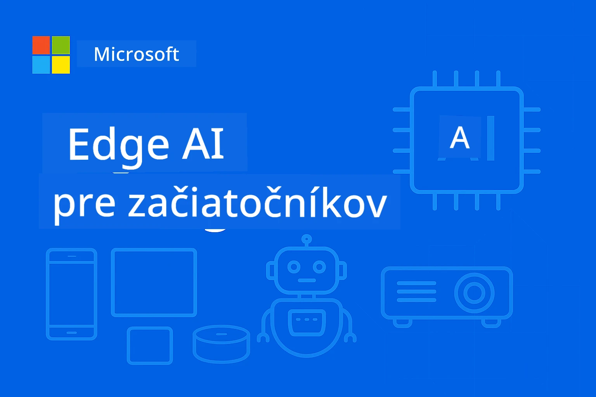

# EdgeAI pre začiatočníkov




[](https://GitHub.com/microsoft/edgeai-for-beginners/graphs/contributors)
[](https://GitHub.com/microsoft/edgeai-for-beginners/issues)
[](https://GitHub.com/microsoft/edgeai-for-beginners/pulls)
[](http://makeapullrequest.com)

[](https://GitHub.com/microsoft/edgeai-for-beginners/watchers)
[](https://GitHub.com/microsoft/edgeai-for-beginners/fork)
[](https://GitHub.com/microsoft/edgeai-for-beginners/stargazers)


[](https://discord.gg/nTYy5BXMWG)

Nasledujte tieto kroky, aby ste začali používať tieto zdroje:

1. **Forknite repozitár**: Kliknite [](https://GitHub.com/microsoft/edgeai-for-beginners/fork)
2. **Klonujte repozitár**:   `git clone https://github.com/microsoft/edgeai-for-beginners.git`
3. [**Pridajte sa do Azure AI Foundry Discord a stretnite sa s expertmi a ďalšími vývojármi**](https://discord.com/invite/ByRwuEEgH4)


### 🌐 Podpora viacerých jazykov

#### Podporované cez GitHub Action (automatizované a vždy aktuálne)

<!-- CO-OP TRANSLATOR LANGUAGES TABLE START -->
[Arabčina](../ar/README.md) | [Bengálčina](../bn/README.md) | [Bulharčina](../bg/README.md) | [Barmčina (Myanmar)](../my/README.md) | [Čínština (zjednodušená)](../zh-CN/README.md) | [Čínština (tradičná, Hongkong)](../zh-HK/README.md) | [Čínština (tradičná, Macau)](../zh-MO/README.md) | [Čínština (tradičná, Taiwan)](../zh-TW/README.md) | [Chorvátčina](../hr/README.md) | [Čeština](../cs/README.md) | [Dánčina](../da/README.md) | [Holandčina](../nl/README.md) | [Estónčina](../et/README.md) | [Fínčina](../fi/README.md) | [Francúzština](../fr/README.md) | [Nemčina](../de/README.md) | [Gréčtina](../el/README.md) | [Hebrejčina](../he/README.md) | [Hindčina](../hi/README.md) | [Maďarčina](../hu/README.md) | [Indonézčina](../id/README.md) | [Taliančina](../it/README.md) | [Japončina](../ja/README.md) | [Kannadčina](../kn/README.md) | [Khmerčina](../km/README.md) | [Kórejčina](../ko/README.md) | [Litovčina](../lt/README.md) | [Malajčina](../ms/README.md) | [Malajalčina](../ml/README.md) | [Maráthčina](../mr/README.md) | [Nepálčina](../ne/README.md) | [Nigérijský pidžin](../pcm/README.md) | [Nórčina](../no/README.md) | [Perzština (Farzí)](../fa/README.md) | [Poľština](../pl/README.md) | [Portugalčina (Brazília)](../pt-BR/README.md) | [Portugalčina (Portugalsko)](../pt-PT/README.md) | [Pandžábčina (Gurmukhi)](../pa/README.md) | [Rumunčina](../ro/README.md) | [Ruština](../ru/README.md) | [Srbčina (cyrilika)](../sr/README.md) | [Slovenčina](./README.md) | [Slovinčina](../sl/README.md) | [Španielčina](../es/README.md) | [Swahilčina](../sw/README.md) | [Švédčina](../sv/README.md) | [Tagalog (Filipínčina)](../tl/README.md) | [Tamilčina](../ta/README.md) | [Telugčina](../te/README.md) | [Thajčina](../th/README.md) | [Turečtina](../tr/README.md) | [Ukrajinčina](../uk/README.md) | [Urdu](../ur/README.md) | [Vietnamčina](../vi/README.md)

> **Preferujete klonovanie lokálne?**
>
> Tento repozitár obsahuje viac ako 50 jazykových prekladov, čo výrazne zväčšuje veľkosť na stiahnutie. Ak chcete klonovať bez prekladov, použite sparse checkout:
>
> **Bash / macOS / Linux:**
> ```bash
> git clone --filter=blob:none --sparse https://github.com/microsoft/edgeai-for-beginners.git
> cd edgeai-for-beginners
> git sparse-checkout set --no-cone '/*' '!translations' '!translated_images'
> ```
>
> **CMD (Windows):**
> ```cmd
> git clone --filter=blob:none --sparse https://github.com/microsoft/edgeai-for-beginners.git
> cd edgeai-for-beginners
> git sparse-checkout set --no-cone "/*" "!translations" "!translated_images"
> ```
>
> Toto vám poskytne všetko, čo potrebujete pre dokončenie kurzu s oveľa rýchlejším sťahovaním.
<!-- CO-OP TRANSLATOR LANGUAGES TABLE END -->

**Ak chcete, aby boli pridané ďalšie podporované jazyky, sú uvedené [tu](https://github.com/Azure/co-op-translator/blob/main/getting_started/supported-languages.md)**
## Úvod

Vitajte v **EdgeAI pre začiatočníkov** – vašej komplexnej ceste do transformujúceho sveta Edge umelej inteligencie. Tento kurz premostí priepasť medzi výkonnými AI schopnosťami a praktickým, reálnym nasadením na koncových zariadeniach, čo vám umožňuje využiť potenciál AI priamo tam, kde sa generujú dáta a musia sa robiť rozhodnutia.

### Čo zvládnete

Tento kurz vás prevedie od základných koncepcií až po implementácie pripravené na produkciu, zahŕňajúce:
- **Malé jazykové modely (SLM)** optimalizované pre nasadenie na edge zariadeniach
- **Optimalizáciu zohľadňujúcu hardvér** na rôznych platformách
- **Inferenciu v reálnom čase** s možnosťami zachovania súkromia
- **Stratégie produkčného nasadenia** pre podnikové aplikácie

### Prečo je EdgeAI dôležité

Edge AI predstavuje paradigmatický posun, ktorý rieši kľúčové moderné výzvy:
- **Súkromie a bezpečnosť**: Spracovanie citlivých dát lokálne bez vystavenia cloudu
- **Výkon v reálnom čase**: Eliminácia latencie siete pre časovo kritické aplikácie
- **Efektívnosť nákladov**: Zníženie výdavkov na šírku pásma a cloudové výpočty
- **Odolné operácie**: Zachovanie funkčnosti počas výpadkov siete
- **Dodržiavanie predpisov**: Splnenie požiadaviek na suverenitu dát

### Edge AI

Edge AI znamená spúšťanie AI algoritmov a jazykových modelov lokálne na hardvéri blízko miesta generovania dát bez závislosti na cloudových zdrojoch pri inferencii. Znižuje latenciu, zvyšuje súkromie a umožňuje rozhodovanie v reálnom čase.

### Kľúčové princípy:
- **Inferencia na zariadení**: AI modely bežia na edge zariadeniach (telefóny, routery, mikrokontroléry, priemyselné PC)
- **Funkčnosť offline**: Funguje bez nepretržitého internetového pripojenia
- **Nízka latencia**: Okamžité reakcie vhodné pre systémy v reálnom čase
- **Suverenita dát**: Uchováva citlivé dáta lokálne, zlepšuje bezpečnosť a dodržiavanie noriem

### Malé jazykové modely (SLM)

SLM ako Phi-4, Mistral-7B a Gemma sú optimalizované verzie väčších LLM—vytrénované alebo destilované pre:
- **Zmenšenú pamäťovú náročnosť**: Efektívne využitie obmedzenej pamäte edge zariadení
- **Nižšie výpočtové nároky**: Optimalizované pre výkon CPU a edge GPU
- **Rýchlejšie spustenie**: Rýchla inicializácia pre reakčné aplikácie

Umožňujú výkonné NLP schopnosti, pričom spĺňajú obmedzenia:
- **Zabudované systémy**: IoT zariadenia a priemyselné regulátory
- **Mobilné zariadenia**: Smartfóny a tablety s možnosťou offline
- **IoT zariadenia**: Senzory a inteligentné zariadenia s obmedzenými zdrojmi
- **Edge servery**: Lokálne spracovateľské jednotky s obmedzenými GPU zdrojmi
- **Osobné počítače**: Nasadenie na desktopoch a notebookoch

## Moduly kurzu a navigácia

| Modul | Téma | Zameranie | Kľúčový obsah | Úroveň | Dĺžka |
|--------|-------|------------|-------------|--------|----------|
| [📖 00 ](./introduction.md) | [Úvod do EdgeAI](./introduction.md) | Základy a kontext | Prehľad EdgeAI • Priemyselné aplikácie • Úvod do SLM • Ciele učenia | Začiatočník | 1-2 hod |
| [📚 01](../../Module01) | [Základy EdgeAI](./Module01/README.md) | Porovnanie Cloud vs Edge AI | Základy EdgeAI • Prípadové štúdie zo života • Sprievodca implementáciou • Nasadenie na edge | Začiatočník | 3-4 hod |
| [🧠 02](../../Module02) | [Základy SLM modelov](./Module02/README.md) | Rodiny modelov a architektúry | Rodina Phi • Rodina Qwen • Rodina Gemma • BitNET • μModel • Phi-Silica | Začiatočník | 4-5 hod |
| [🚀 03](../../Module03) | [Praktické nasadenie SLM](./Module03/README.md) | Lokálne a cloudové nasadenie | Pokročilé učenie • Lokálne prostredie • Cloudové nasadenie | Stredne pokročilý | 4-5 hod |
| [⚙️ 04](../../Module04) | [Nástroje na optimalizáciu modelov](./Module04/README.md) | Optimalizácia naprieč platformami | Úvod • Llama.cpp • Microsoft Olive • OpenVINO • Apple MLX • Syntéza workflow | Stredne pokročilý | 5-6 hod |
| [🔧 05](../../Module05) | [SLMOps v produkcii](./Module05/README.md) | Produkčné operácie | Úvod do SLMOps • Destilácia modelov • Doladenie • Produkčné nasadenie | Pokročilý | 5-6 hod |
| [🤖 06](../../Module06) | [AI Agenti a volanie funkcií](./Module06/README.md) | Rámce agentov a MCP | Úvod do agentov • Volanie funkcií • Protokol kontextu modelu | Pokročilý | 4-5 hod |
| [💻 07](../../Module07) | [Implementácia platformy](./Module07/README.md) | Ukážky naprieč platformami | AI Toolkit • Foundry Local • Vývoj Windows | Pokročilý | 3-4 hod |
| [🏭 08](../../Module08) | [Foundry Local Toolkit](./Module08/README.md) | Produkčne pripravené ukážky | Ukážkové aplikácie (pozri detaily nižšie) | Expert | 8-10 hod |

### 🏭 **Modul 08: Ukážkové aplikácie**

- [01: Rýchly štart REST Chat](./Module08/samples/01/README.md)
- [02: Integrácia OpenAI SDK](./Module08/samples/02/README.md)
- [03: Objavovanie a benchmark modelov](./Module08/samples/03/README.md)
- [04: Chainlit RAG aplikácia](./Module08/samples/04/README.md)
- [05: Multi-agentná orchestrácia](./Module08/samples/05/README.md)
- [06: Router Modely ako nástroje](./Module08/samples/06/README.md)
- [07: Priamy API klient](./Module08/samples/07/README.md)
- [08: Chat aplikácia Windows 11](./Module08/samples/08/README.md)
- [09: Pokročilý multi-agentný systém](./Module08/samples/09/README.md)
- [10: Foundry Tools Framework](./Module08/samples/10/README.md)

### 🎓 **Workshop: Praktická cesta učenia**

Komplexné praktické materiály workshopu s implementáciami pripravenými na produkciu:

- **[Sprievodca workshopom](./Workshop/Readme.md)** - Kompletné ciele učenia, výsledky a navigácia zdrojov
- **Python ukážky** (6 sekcií) - Aktualizované o najlepšie postupy, spracovanie chýb a komplexnú dokumentáciu
- **Jupyter notesy** (8 interaktívnych) - Návody krok za krokom s benchmarkmi a monitorovaním výkonu
- **Sprievodcovia sekciami** - Detailné markdown sprievodcovia ku každému workshopu
- **Nástroje validácie** - Skripty na overenie kvality kódu a testy základnej funkčnosti

**Čo vybudujete:**
- Lokálne AI chat aplikácie s podporou streamovania
- RAG pipeline s hodnotením kvality (RAGAS)
- Nástroje na benchmarking a porovnanie viacerých modelov
- Multi-agentné orchestrácie
- Inteligentné smerovanie modelov s výberom založeným na úlohách

### 🎙️ **Workshop pre Agentic: Prakticky - AI Podcast Studio**
Vybudujte AI-poháňaný produkčný proces podcastu od základu! Tento pútavý workshop vás naučí vytvoriť kompletný systém viacerých agentov, ktorý premení nápady na profesionálne podcastové epizódy.

**[🎬 Začať workshop AI Podcast Studio](./WorkshopForAgentic/README.md)**

**Vaša misia**: Spustiť „Future Bytes“ — technologický podcast poháňaný výhradne AI agentmi, ktorých si vy sami vytvoríte. Žiadne cloudové závislosti, žiadne náklady na API — všetko beží lokálne na vašom zariadení.

**Čo robí tento kurz jedinečným:**
- **🤖 Skutočná orchestrácia viacerých agentov** – Vybudujte špecializovaných AI agentov, ktorí vyhľadávajú informácie, píšu a produkujú audio
- **🎯 Kompletný produkčný proces** – Od výberu témy až po finálny zvuk podcastu
- **💻 100 % lokálne nasadenie** – Používa Ollama a lokálne modely (Qwen-3-8B) pre úplné súkromie a kontrolu
- **🎤 Integrácia prevodu textu na reč** – Premena skriptov na prirodzene znejúce konverzácie viacerých hovorcov
- **✋ Pracovné postupy s človekom v slučke** – Schvaľovacie brány zabezpečujú kvalitu pri zachovaní automatizácie

**Výučbová cesta v troch dejstvách:**

| Dejstvo | Zameranie | Kľúčové zručnosti | Trvanie |
|-----|-------|------------|----------|
| **[Dejstvo 1: Spoznajte svojich AI asistentov](./WorkshopForAgentic/md/01.BuildAIAgentWithSLM.md)** | Vytvorte svojho prvého AI agenta | Integrácia nástrojov • Webové vyhľadávanie • Riešenie problémov • Agentické uvažovanie | 2-3 hodiny |
| **[Dejstvo 2: Zostavte svoj produkčný tím](./WorkshopForAgentic/md/02.AIAgentOrchestrationAndWorkflows.md)** | Orchestrujte viacerých agentov | Koordinácia tímu • Schvaľovacie pracovné toky • Rozhranie DevUI • Ľudský dohľad | 3-4 hodiny |
| **[Dejstvo 3: Oživte svoj podcast](./WorkshopForAgentic/md/03.Multi-SpeakerPodcastGenerationWithVibeVoice.md)** | Generujte podcastové audio | Prevod textu na reč • Syntéza viacerých hovorcov • Dlhý formát • Plná automatizácia | 2-3 hodiny |

**Použité technológie:**
- **Microsoft Agent Framework** – Orchestrácia a koordinácia viacerých agentov
- **Ollama** – Lokálne spúšťanie AI modelov (bez potreby cloudu)
- **Qwen-3-8B** – Open-source jazykový model optimalizovaný pre agentické úlohy
- **API pre prevod textu na reč** – Prirodzená syntéza hlasu pre tvorbu podcastov

**Podpora hardvéru:**
- ✅ **Režim CPU** – Funguje na akomkoľvek modernom počítači (odporúča sa 8 GB+ RAM)
- 🚀 **Akcelerácia GPU** – Výrazné zrýchlenie inferencie s GPU NVIDIA/AMD
- ⚡ **Podpora NPU** – Akcelerácia nového typu neurónových procesorov

**Ideálne pre:**
- Vývojárov učúcich sa systémy viacerých AI agentov
- Každého, koho zaujíma AI automatizácia a pracovné postupy
- Tvorcov obsahu skúmajúcich AI-podporovanú produkciu
- Študentov študujúcich praktické vzory orchestrácie AI

**Začnite tvoriť**: [🎙️ Workshop AI Podcast Studio →](./WorkshopForAgentic/README.md)

### 📊 **Zhrnutie učebnej cesty**
- **Celkové trvanie**: 36-45 hodín
- **Začiatočnícka cesta**: Moduly 01-02 (7-9 hodín)  
- **Stredne pokročilá cesta**: Moduly 03-04 (9-11 hodín)
- **Pokročilá cesta**: Moduly 05-07 (12-15 hodín)
- **Expertná cesta**: Modul 08 (8-10 hodín)

## Čo vybudujete

### 🎯 Základné kompetencie
- **Architektúra Edge AI**: Navrhnite lokálne najprv AI systémy s cloudovou integráciou
- **Optimalizácia modelov**: Kvantizujte a komprimujte modely pre edge nasadenie (85 % zrýchlenie, 75 % zmenšenie veľkosti)
- **Viacplatformové nasadenie**: Windows, mobilné zariadenia, embedded systémy a cloud-edge hybrídne systémy
- **Produkčné operácie**: Monitorovanie, škálovanie a údržba edge AI v produkcii

### 🏗️ Praktické projekty
- **Foundry Local Chat Apps**: Nativná aplikácia Windows 11 so prepínaním modelov
- **Systémy viacerých agentov**: Koordinátor so špecialistickými agentmi pre komplexné pracovné toky  
- **RAG aplikácie**: Lokálne spracovanie dokumentov s vyhľadávaním vo vektoroch
- **Routery modelov**: Inteligentný výber modelov na základe analýzy úloh
- **API rámce**: Produkčne pripravení klienti s streamingom a monitorovaním stavu
- **Nástroje pre viaceré platformy**: Vzory integrácie LangChain / Semantic Kernel

### 🏢 Priemyselné aplikácie
**Výroba** • **Zdravotníctvo** • **Autonómne vozidlá** • **Smart Cities** • **Mobilné aplikácie**

## Rýchly štart

**Odporúčaná učebná cesta** (20-30 hodín celkovo):

0. **📖 Úvod** ([Introduction.md](./introduction.md)): Základ EdgeAI + kontext odvetvia + rámec učenia
1. **📚 Základy** (Moduly 01-02): Pojmy EdgeAI + rodiny modelov SLM
2. **⚙️ Optimalizácia** (Moduly 03-04): Nasadenie + kvantizačné rámce  
3. **🚀 Produkcia** (Moduly 05-06): SLMOps + AI agenti + volanie funkcií
4. **💻 Implementácia** (Moduly 07-08): Vzory pre platformu + nástroje Foundry Local

Každý modul obsahuje teóriu, praktické cvičenia a produkčné ukážky kódu.

## Kariérny dosah

**Technické pozície**: Architekt EdgeAI riešení • ML inžinier (Edge) • AI vývojár IoT • Mobilný AI vývojár

**Priemyselné odvetvia**: Výroba 4.0 • Technológie zdravotníctva • Autonómne systémy • FinTech • Spotrebná elektronika

**Portfólio projektov**: Systémy viacerých agentov • Produkčné RAG aplikácie • Viacplatformové nasadenia • Optimalizácia výkonu

## Štruktúra repozitára

```
edgeai-for-beginners/
├── 📖 introduction.md  # Foundation: EdgeAI Overview & Learning Framework
├── 📚 Module01-04/     # Fundamentals → SLMs → Deployment → Optimization  
├── 🔧 Module05-06/     # SLMOps → AI Agents → Function Calling
├── 💻 Module07/        # Platform Samples (VS Code, Windows, Jetson, Mobile)
├── 🏭 Module08/        # Foundry Local Toolkit + 10 Comprehensive Samples
│   ├── samples/01-06/  # Foundation: REST, SDK, RAG, Agents, Routing
│   └── samples/07-10/  # Advanced: API Client, Windows App, Enterprise Agents, Tools
├── 🌐 translations/    # Multi-language support (8+ languages)
└── 📋 STUDY_GUIDE.md   # Structured learning paths & time allocation
```

## Hlavné body kurzu

✅ **Postupné učenie**: Teória → Prax → Produkčné nasadenie  
✅ **Reálne prípadové štúdie**: Microsoft, Japan Airlines, firemné implementácie  
✅ **Praktické ukážky**: Viac ako 50 príkladov, 10 komplexných demo aplikácií Foundry Local  
✅ **Zameranie na výkon**: 85 % zlepšenie rýchlosti, 75 % zníženie veľkosti  
✅ **Multi-platformnosť**: Windows, mobil, embedded, cloud-edge hybrid  
✅ **Produkčne pripravené**: Monitorovanie, škálovanie, zabezpečenie, súlad s reguláciami

📖 **[Dostupný študijný sprievodca](STUDY_GUIDE.md)**: Štruktúrovaná 20-hodinová učebná cesta s odporúčaním alokácie času a nástrojmi na vlastné hodnotenie.

---

**EdgeAI predstavuje budúcnosť nasadenia AI**: lokálne najprv, s dôrazom na ochranu súkromia a efektívnosť. Ovládnite tieto zručnosti a vytvorte ďalšiu generáciu inteligentných aplikácií.

## Ďalšie kurzy

Náš tím pripravuje aj iné kurzy! Pozrite si:

<!-- CO-OP TRANSLATOR OTHER COURSES START -->
### LangChain
[](https://aka.ms/langchain4j-for-beginners)
[](https://aka.ms/langchainjs-for-beginners?WT.mc_id=m365-94501-dwahlin)
[](https://github.com/microsoft/langchain-for-beginners?WT.mc_id=m365-94501-dwahlin)
---

### Azure / Edge / MCP / Agents
[](https://github.com/microsoft/AZD-for-beginners?WT.mc_id=academic-105485-koreyst)
[](https://github.com/microsoft/edgeai-for-beginners?WT.mc_id=academic-105485-koreyst)
[](https://github.com/microsoft/mcp-for-beginners?WT.mc_id=academic-105485-koreyst)
[](https://github.com/microsoft/ai-agents-for-beginners?WT.mc_id=academic-105485-koreyst)

---
 
### Séria Generatívnej AI
[](https://github.com/microsoft/generative-ai-for-beginners?WT.mc_id=academic-105485-koreyst)
[-9333EA?style=for-the-badge&labelColor=E5E7EB&color=9333EA)](https://github.com/microsoft/Generative-AI-for-beginners-dotnet?WT.mc_id=academic-105485-koreyst)
[-C084FC?style=for-the-badge&labelColor=E5E7EB&color=C084FC)](https://github.com/microsoft/generative-ai-for-beginners-java?WT.mc_id=academic-105485-koreyst)
[-E879F9?style=for-the-badge&labelColor=E5E7EB&color=E879F9)](https://github.com/microsoft/generative-ai-with-javascript?WT.mc_id=academic-105485-koreyst)

---
 
### Základné učenie
[](https://aka.ms/ml-beginners?WT.mc_id=academic-105485-koreyst)
[](https://aka.ms/datascience-beginners?WT.mc_id=academic-105485-koreyst)
[](https://aka.ms/ai-beginners?WT.mc_id=academic-105485-koreyst)
[](https://github.com/microsoft/Security-101?WT.mc_id=academic-96948-sayoung)
[](https://aka.ms/webdev-beginners?WT.mc_id=academic-105485-koreyst)
[](https://aka.ms/iot-beginners?WT.mc_id=academic-105485-koreyst)
[](https://github.com/microsoft/xr-development-for-beginners?WT.mc_id=academic-105485-koreyst)

---
 
### Séria Copilot
[](https://aka.ms/GitHubCopilotAI?WT.mc_id=academic-105485-koreyst)
[](https://github.com/microsoft/mastering-github-copilot-for-dotnet-csharp-developers?WT.mc_id=academic-105485-koreyst)
[](https://github.com/microsoft/CopilotAdventures?WT.mc_id=academic-105485-koreyst)
<!-- CO-OP TRANSLATOR OTHER COURSES END -->

## Získanie pomoci

Ak sa zaseknete alebo máte akékoľvek otázky o vytváraní AI aplikácií, pripojte sa:

[](https://discord.gg/nTYy5BXMWG)

Ak máte spätnú väzbu k produktu alebo chyby počas tvorby, navštívte:

[](https://aka.ms/foundry/forum)

---

<!-- CO-OP TRANSLATOR DISCLAIMER START -->
**Upozornenie**:  
Tento dokument bol preložený pomocou AI prekladateľskej služby [Co-op Translator](https://github.com/Azure/co-op-translator). Aj keď sa snažíme o presnosť, majte prosím na pamäti, že automatizované preklady môžu obsahovať chyby alebo nepresnosti. Pôvodný dokument v jeho rodnom jazyku by mal byť považovaný za autoritatívny zdroj. Pre kritické informácie sa odporúča profesionálny ľudský preklad. Nie sme zodpovední za akékoľvek nedorozumenia alebo nesprávne interpretácie vyplývajúce z použitia tohto prekladu.
<!-- CO-OP TRANSLATOR DISCLAIMER END -->