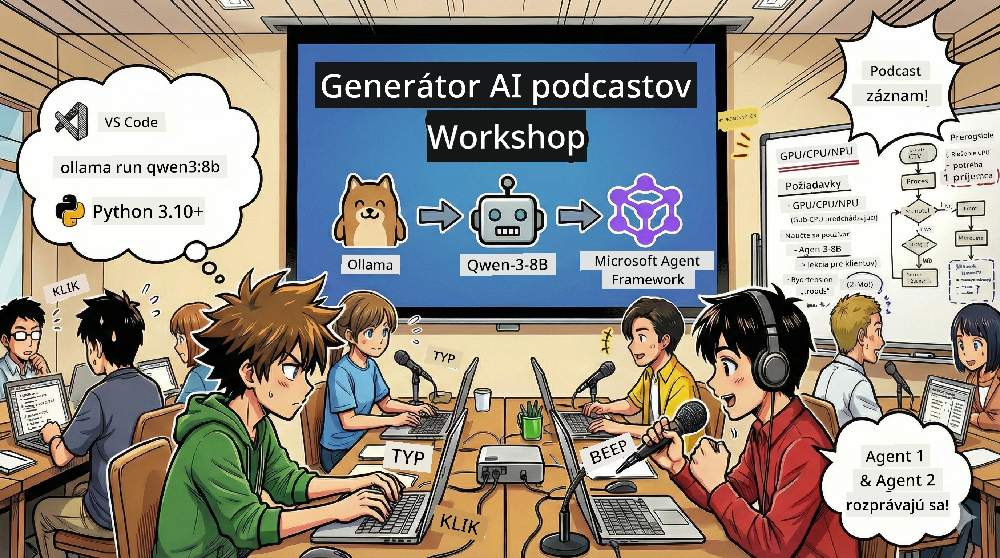
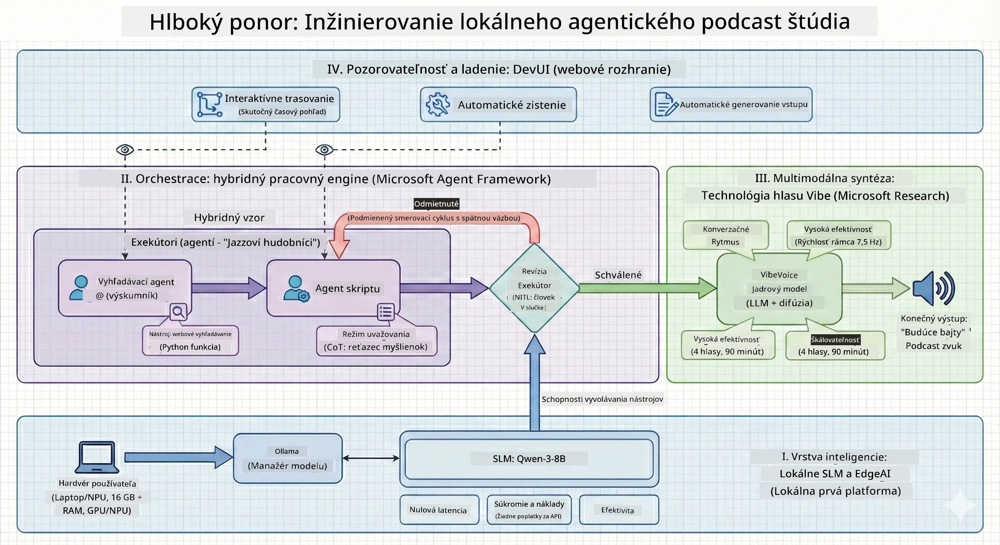

# 🎙️ Workshop Štúdio AI Podcastu

> 🌏 [中文版 (Čínska verzia)](translation/zh-cn/README.md)



## Tvoja Misia

Vitaj v **Štúdiu AI Podcastu**! Pripravuješ sa spustiť vlastný technologický podcast s názvom "Future Bytes" — ale tu je ten zvrat: vybuduješ tím poháňaný AI, ktorý ti pomôže ho vytvoriť. Žiadne nekonečné hodiny výskumu, písania scenárov a úprav zvuku. Namiesto toho sa naučíš kódovať a stať sa producentom podcastu so supermocami AI.

## Príbeh

Predstav si to: Ty a tvoji priatelia chcete začať podcast o najzaujímavejších technologických trendoch, ale každý je zaneprázdnený školou, prácou alebo životom. Čo keby si mohol vytvoriť tím AI agentov, ktorí vykonajú ťažkú prácu? Jeden agent robí výskum tém, druhý píše pútavé scenáre a tretí premieňa text na prirodzene znejúce rozhovory. Znie to ako sci-fi? Poďme to spraviť skutočným.

## Čo Sa Naučíš

Na konci tohto workshopu budeš vedieť:
- 🤖 Nasadiť si vlastný lokálny AI model (žiadne náklady na API, žiadna závislosť na cloude!)
- 🔧 Vybudovať špecializovaných AI agentov, ktorí naozaj spolupracujú
- 🎬 Vytvoriť kompletný produkčný pipeline podcastu od nápadu až po audio

## Tvoja Cesta: Tri Dejstvá



Ako v každom dobrom príbehu, máme tri dejstvá. Každé postupne buduje tvoje AI podcastové štúdio:

| Epizóda | Tvoja Výzva | Čo sa Stane | Odomknuté Zručnosti |
|---------|-------------|-------------|---------------------|
| **Dejstvo 1** | [Zoznám Sa so Svojimi AI Asistentmi](md/01.BuildAIAgentWithSLM.md) | Objavíš, ako vytvoriť AI agentov, ktorí vedia chatovať, vyhľadávať na internete a riešiť problémy. Predstav si ich ako výskumných stážistov, ktorí nikdy nespia. | 🎯 Vytvor svojho prvého agenta<br>🛠️ Daj mu super schopnosti (nástroje!)<br>🧠 Nauč ho rozmýšľať<br>🌐 Pripoj ho na internet |
| **Dejstvo 2** | [Poskladaj Tím Produkcie](md/02.AIAgentOrchestrationAndWorkflows.md) | Teraz sa to začne naozaj diať! Orchestruješ viac AI agentov, aby spolupracovali ako pravý podcastový tím. Jeden robí výskum, druhý píše, ty schvaľuješ – tímová práca je základ. | 🎭 Koordinuj viac agentov<br>🔄 Vytvor schvaľovacie workflow<br>🖥️ Testuj s DevUI rozhraním<br>✋ Zachovaj kontrolu ľudí |
| **Dejstvo 3** | [Oživ Svoj Podcast](md/03.Multi-SpeakerPodcastGenerationWithVibeVoice.md) | Finále! Premeníš textové scenáre na skutočné podcastové audio s realistickými hlasmi a prirodzenými rozhovormi. Tvoj podcast "Future Bytes" je pripravený na vysielanie! | 🎤 Text na reč<br>👥 Viacero hlasov<br>⏱️ Dlhšie audio<br>🚀 Plná automatizácia |

Každé dejstvo ti odomkne nové schopnosti. Ak si odvážny, môžeš preskočiť dopredu, ale odporúčame sledovať príbeh!

## Požiadavky Prostredia

Tento workshop podporuje rôzne hardvérové prostredia:
- **CPU**: Vhodné na testovanie a malé použitie
- **GPU**: Odporúčané pre produkciu, výrazne zrýchľuje rýchlosť inferencie
- **NPU**: Podpora akcelerácie nových generácií neurónových procesorov

## Čo Budeš Potrebovať

### Softvérový zoznam ✅
- **Python 3.10+** (tvoj programovací jazyk)
- **Ollama** (beží AI modely lokálne na tvojom stroji)
- **VS Code** (tvoj kódový editor)
- **Python Extension** (zlepší VS Code)
- **Git** (na získanie kódu)

### Hardvérové minimum 💻
- **Môžem to spustiť?**: 8GB RAM, 10GB voľného miesta (funguje, môže byť pomalé)
- **Ideálny setup**: 16GB+ RAM, slušné GPU (pohoda a plynulosť!)
- **Máš NPU?**: Ešte lepšie! Odomkneš výkon novej generácie 🚀

## Nastav Svoj Štúdio 🎬

### Krok 1: Python Nabíjačka

Uisti sa, že máš Python 3.10 alebo novší:

```bash
python --version
# Malo by zobraziť Python 3.10.x alebo novší
```

Nemáš Python? Stiahni si ho na [python.org](https://python.org) — je zadarmo!

### Krok 2: Stiahni Ollama (Tvoj Spúšťač AI Modelov)

Choď na [ollama.ai](https://ollama.ai) a stiahni Ollama pre tvoj operačný systém. Predstav si to ako motor, ktorý spúšťa tvoje lokálne AI modely.

Skontroluj, či je pripravený:

```bash
ollama --version
```

### Krok 3: Stiahni Svoj AI Mozog 🧠

Je čas získať model Qwen-3-8B (je to ako zamestnať svojho prvého AI asistenta):

```bash
ollama pull qwen3:8b
```

*Potrvá to niekoľko minút. Perfektný čas na kávu! ☕*

### Krok 4: Nastav VS Code

Stiahni si [Visual Studio Code](https://code.visualstudio.com/), ak ho ešte nemáš. Je to najlepší editor kódu (súdiac podľa mňa 😄).

### Krok 5: Rozšírenie pre Python

Vo VS Code:
1. Stlač `Ctrl+Shift+X` (alebo `Cmd+Shift+X` na Macu)
2. Vyhľadaj "Python"
3. Nainštaluj oficiálne rozšírenie od Microsoftu

### Krok 6: Si Pripravený! 🎉

Seriózne, môžeš začať čarovať s AI!

### Krok 7: Nainštaluj Microsoft Agent Framework a Súvisiace Balíky 📦

Nainštaluj všetky potrebné závislosti pre workshop:

```bash
pip install -r ./Installations/requirements.txt -U
```

*Inštaluje Microsoft Agent Framework a všetky potrebné balíčky. Daj si kávu — prvé nastavenie môže chvíľu trvať! ☕*

## Pokyny k Workshopu

Podrobná štruktúra projektu, konfigurácia a spustenie budú podrobne vysvetlené počas workshopu.

## Riešenie Problémov (Keď Niečo Nejde) 🔧

### „Tá sťahovanie modelu trvá večne!“
**Riešenie**: Použi VPN alebo nastav Ollama na zrkadlový server. Internet nás niekedy proste nemá rád.

### „Môj počítač umiera! Chýba mu pamäť!“
**Riešenie**: Prejdi na menší model alebo zmeň nastavenie `num_ctx`, aby používal menej pamäte. Predstav si to ako AI diétu.

### „Môžem to zrýchliť s mojím GPU?“
**Riešenie**: Ollama automaticky rozpoznáva GPU! Len sa uisti, že máš najnovšie ovládače GPU. Zdarma zrýchlenie! 🏎️

## Extra Zdroje (Pre Zvedavcov) 📚

- [Ollama Docs](https://github.com/ollama/ollama) — Hlboký ponor do lokálnych AI modelov
- [Microsoft Agent Framework](https://microsoft.github.io/autogen/) — Viac o vytváraní tímov agentov
- [Info o modeli Qwen](https://qwenlm.github.io/) — Spoznaj mozog svojho AI asistenta

## Licencia

MIT licencia — Buduj skvelé veci, zdieľaj ich a sprav svet lepším! 🌍

## Chceš Prispieť?

Našiel si chybu? Máš nápad? Vytvor issue alebo PR! Milujeme komunitu. ✨

---

<!-- CO-OP TRANSLATOR DISCLAIMER START -->
**Zrieknutie sa zodpovednosti**:  
Tento dokument bol preložený pomocou AI prekladateľskej služby [Co-op Translator](https://github.com/Azure/co-op-translator). Aj keď sa snažíme o presnosť, berte prosím na vedomie, že automatizované preklady môžu obsahovať chyby alebo nepresnosti. Pôvodný dokument v jeho pôvodnom jazyku by mal byť považovaný za autoritatívny zdroj. Pre kritické informácie sa odporúča profesionálny ľudský preklad. Nezodpovedáme za žiadne nedorozumenia alebo nesprávne interpretácie vyplývajúce z použitia tohto prekladu.
<!-- CO-OP TRANSLATOR DISCLAIMER END -->