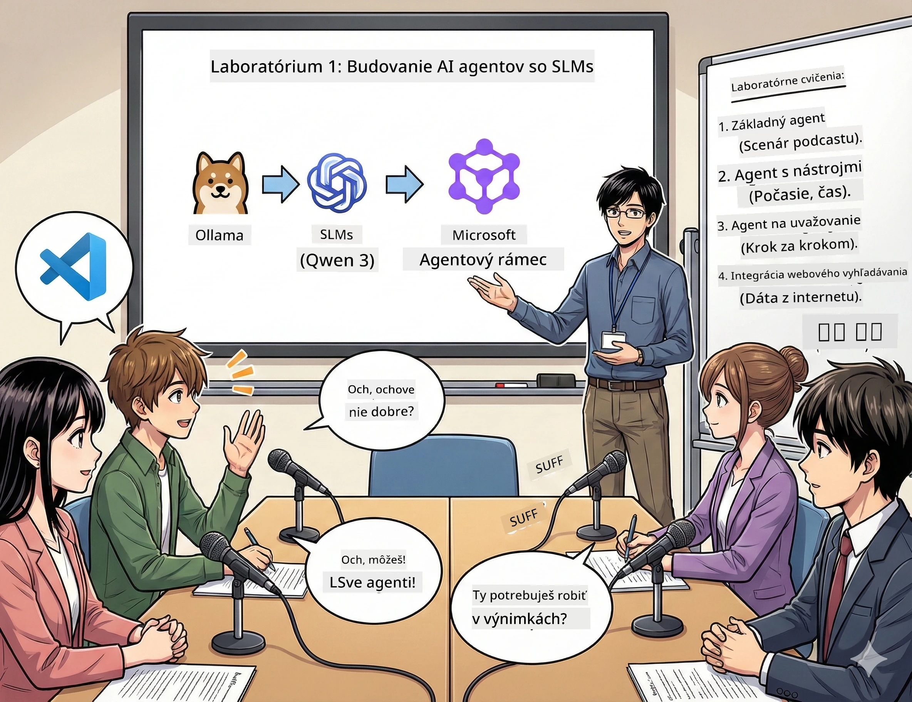

# Dejstvo 1: Spoznajte svojho AI výskumného asistenta 🤖

## Výzva

Spúšťate "Future Bytes," váš nový tech podcast. Epizóda 1 je o najnovších AI prielomoch, ale máte 24 hodín na:
1. Preskúmať tému
2. Nájsť dôveryhodné zdroje
3. Napísať pútavý scenár
4. Znieť prirodzene

**Zvrat v deji**: Nemusíte to robiť sami. Práve staviate svojho prvého AI asistenta, ktorý vám so všetkým pomôže. Nazvime ho Alex — váš neúnavný výskumný partner, ktorý nikdy nepotrebuje spať.

## Prečo malé jazykové modely? (Spoiler: Sú úžasné)

Predstavte si malé jazykové modely (SLM) ako vášho osobného AI, ktorý žije *na vašom* počítači. Žiadny cloud, žiadne mesačné poplatky, žiadne pochybná zdieľanie dát.

**Prečo sú SLM 🔥:**
- **🏠 Bežia na vašom zariadení**: Laptop, desktop, alebo aj výkonný Raspberry Pi
- **💸 Žiadne priebežné náklady**: Žiadne API poplatky, ktoré by rozsýpali váš obed
- **🔒 Ochrana súkromia na prvom mieste**: Vaše dáta nikdy neopustia vaše zariadenie
- **⚡ Bleskurýchle**: Žiadne oneskorenie internetu, okamžité odpovede
- **🪦 Ľahké**: 1Mld-10Mld parametrov vs 100Mld+ pre veľkých hráčov

**Populárne SLM:** Qwen 3, Phi-4, Gemma 3 (na tento workshop používame Qwen)

## Vaša výbava

### Ollama: Váš manažér AI modelov

[Ollama](https://ollama.com/) je ako Steam pre AI modely. Stiahnite, spustite a spravujte modely jednoduchými príkazmi.

**Čo je na ňom super:**
- Jeden príkaz na stiahnutie a spustenie akéhokoľvek modelu
- Funguje na Mac, Windows, Linux
- Automaticky využíva vašu GPU, ak ju máte
- Veľmi efektívne využitie pamäte

### Microsoft Agent Framework: Kde sa deje kúzlo

[Microsoft Agent Framework](https://github.com/microsoft/agent-framework) je vaše ihrisko na tvorbu AI agentov, ktorí môžu:

- 💬 Chatovať a pamätať si, o čom ste hovorili
- 🛠️ Používať vlastné nástroje (napríklad vyhľadávanie na webe alebo kontrolu počasia)
- 🧠 Myslieť na zložité problémy krok za krokom
- 🤝 Spolupracovať v tíme s inými agentmi
- 🔌 Pripojiť sa na rôznych AI poskytovateľov (OpenAI, Ollama, Azure)

**Stavebné kamene:**
- **Agenti**: Vaši AI asistenti s konkrétnymi úlohami
- **Nástroje**: Špeciálne schopnosti, ktoré im dáte
- **Pamäť**: Aby nezabudli váš rozhovor
- **Uvažovanie**: Naučiť ich rozmýšľať, nie len odpovedať

## Vaše tréningové misie: 4 úlohy

### Misia 1: Vytvorte svojho prvého agenta

📓 [Otvorte si zošit](../code/01.BasicAgent/00.BasicAgent-agent.ipynb)

**Úloha**: Vytvorte Alexa, vášho AI scenáristu podcastu. Alex musí generovať dialóg medzi dvoma moderátormi diskutujúcimi o tech témach.

**Čo sa naučíte**:
- Ako prebudiť AI agenta (je to jednoduchšie ako v pondelok ráno)
- Dať mu osobnosť a inštrukcie
- Vytvárať skutočné scenáre podcastov
- Rozumieť, čo vám odpovedá

**Podmienka úspechu**: Alex vytvorí scenár pre váš pilotný diel "Future Bytes" o AI! 🎯

### Misia 2: Dajte Alexovi super schopnosti (Nástroje!)

📓 [Otvorte si zošit](../code/01.BasicAgent/01.BasicAgent-tools.ipynb)

**Úloha**: Alex je múdry, ale nevie aké je dnes počasie ani koľko je hodín. Dajte mu nástroje, aby to vedel!

**Čo sa naučíte**:
- Vytvárať vlastné Python funkcie ako "nástroje"
- Nechať Alexa rozhodnúť *kedy* ktorý nástroj použiť
- Sledovať ako autonómne rieši problémy
- Kombinovať viac nástrojov pre zložité úlohy

**Podmienka úspechu**: Spýtajte sa "Aké je počasie v Tokiu?" a Alex vám to sám odpovie! ☁️

### Misia 3: Naučte Alexa myslieť

📓 [Otvorte si zošit](../code/01.BasicAgent/02.BasicAgent-reasoning.ipynb)

**Úloha**: Prinúťte Alexa ukázať, ako pracuje. Pri riešení problémov chcete vidieť *ako* rozmýšľa, nie len výsledok.

**Čo sa naučíte**:
- Aktivovať "režim uvažovania" (je to ako ukázať prácu pri matematike)
- Vidieť Alexov krok-za-krokom proces myslenia
- Pochopiť reťazcovú motiváciu
- Riešiť problémy, keď sa Alex zmätený

**Podmienka úspechu**: Spýtajte sa zložitej matematickej otázky a sledujte, ako ju Alex rieši! 🧠

### Misia 4: Pripojte Alexa na internet

📓 [Otvorte si zošit](../code/01.BasicAgent/03.BasicAgent-websearch.ipynb)

**Úloha**: Alexove znalosti sú ohraničené časom. Pripojme ho na web pre aktuálne informácie!

**Čo sa naučíte**:
- Vytvoriť vlastný nástroj na webové vyhľadávanie
- Integrovať externé API
- Elegantne riešiť sieťové chyby
- Získať informácie nad rámec Alexovych tréningových dát

**Podmienka úspechu**: Spýtajte sa na dnešné tech novinky a dostanete čerstvé výsledky! 📰

## Pred začiatkom 🚀

**Povinná výbava**:
- Nainštalovaný Python 3.10+
- Ollama spustený (skontrolujte cez `ollama --version`)
- VS Code s rozšírením Python
- Minimálne 8GB RAM (16GB pre hladký chod)

## Poradie misií

Postupujte podľa zošitov v tejto postupnosti pre kompletný príbeh:

1. [00.BasicAgent-agent.ipynb](../code/01.BasicAgent/00.BasicAgent-agent.ipynb) — Spoznajte Alexa (vášho prvého agenta)
2. [01.BasicAgent-tools.ipynb](../code/01.BasicAgent/01.BasicAgent-tools.ipynb) — Nabíjame ho silou!
3. [02.BasicAgent-reasoning.ipynb](../code/01.BasicAgent/02.BasicAgent-reasoning.ipynb) — Naučte Alexa myslieť
4. [03.BasicAgent-websearch.ipynb](../code/01.BasicAgent/03.BasicAgent-websearch.ipynb) — Prístup na internet odomknutý!

## Čo zvládnete

Po Dejstve 1 budete vedieť:

- ✅ Spúšťať AI modely na vlastnom hardvéri (bez cloudu!)
- ✅ Stavať agentov s vlastnými osobnosťami a schopnosťami
- ✅ Dávať agentom nástroje na riešenie reálnych problémov
- ✅ Nechať agentov ukázať svoj proces uvažovania
- ✅ Pripojiť agentov k externým dátovým zdrojom
- ✅ Ladíť chyby, keď niečo nejde

## Keď niečo prestane fungovať (a ako to opraviť) 🔧

### "Alex sa nenačíta! Nie je dosť pamäte!"
**Riešenie**: Váš počítač zápasí. Skúste zavrieť iné aplikácie alebo prepnúť na menší model. 8GB RAM je minimum.

### "Alex je TAKY pomalý"
**Riešenie**: Zapnite GPU akceleráciu v nastaveniach Ollama. Alebo znížte veľkosť kontextového okna. Zapol sa režim blesku! 🏎️

### "Nástroje nefungujú!"
**Riešenie**: Skontrolujte podpisy funkcií. Alex potrebuje správne typové nápovedy, aby pochopil, čo nástroj robí. Predstavte si to ako jasné inštrukcie.

## Užitečné odkazy 🔗

- [Dokumentácia Agent Framework](https://github.com/microsoft/agent-framework) — Oficiálne návody a príklady
- [Knižnica modelov Ollama](https://ollama.com/library) — Prezrite si všetky dostupné modely
- [Model Qwen](https://ollama.com/library/qwen3) — Mozog vášho AI
- [Príklady kódu](https://github.com/microsoft/agent-framework/tree/main/python/samples) — Inšpirujte sa tu

## Čo bude ďalej: Dejstvo 2 🎬

Máte jedného agenta. Ale čo ak by ste mali *tím* agentov pracujúcich spolu? V Dejstve 2 zostavíte celý váš podcast produkčný tím:
- **Researcher agent**: Nájde tie najlepšie zdroje
- **Writer agent**: Napíše dokonalý scenár
- **Editor (vy!)**: Schvaľuje alebo žiada zmeny

Poďme na AI kúzla! → [Dejstvo 2: Zostavte svoj produkčný tím](02.AIAgentOrchestrationAndWorkflows.md)

---

**Zaseknutí?** Pýtajte sa počas workshopu. Všetci sa učíme spolu! 🙌

---

<!-- CO-OP TRANSLATOR DISCLAIMER START -->
**Vyhlásenie o zodpovednosti**:  
Tento dokument bol preložený pomocou AI prekladateľskej služby [Co-op Translator](https://github.com/Azure/co-op-translator). Hoci sa usilujeme o presnosť, majte prosím na pamäti, že automatické preklady môžu obsahovať chyby alebo nepresnosti. Pôvodný dokument v jeho rodnom jazyku by mal byť považovaný za autoritatívny zdroj. Pre kritické informácie sa odporúča profesionálny ľudský preklad. Nezodpovedáme za akékoľvek nedorozumenia alebo nesprávne výklady vyplývajúce z používania tohto prekladu.
<!-- CO-OP TRANSLATOR DISCLAIMER END -->