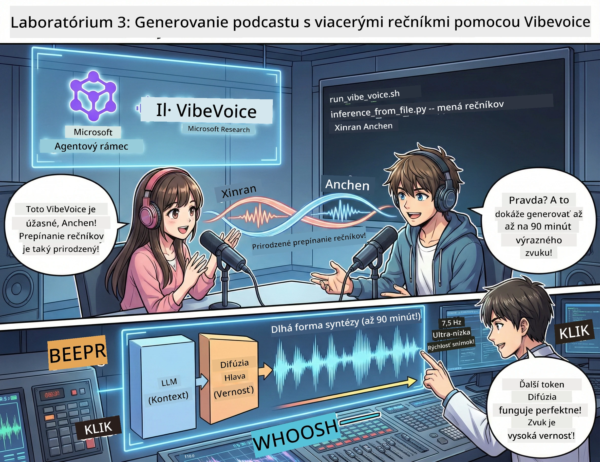

<!--
CO_OP_TRANSLATOR_METADATA:
{
  "original_hash": "bb2a3cf5ebd0ec8211af960a004fc23d",
  "translation_date": "2026-01-05T12:25:41+00:00",
  "source_file": "WorkshopForAgentic/md/03.Multi-SpeakerPodcastGenerationWithVibeVoice.md",
  "language_code": "sk"
}
-->
# Herečka 3: Oživte svoj podcast 🎤



## Veľké finále

Preskúmali ste témy. Napísali ste scenáre. Teraz to najlepšie na záver: premeniť svoj text na skutočné podcastové audio s realistickými hlasmi!

Predstavujeme **VibeVoice** — open-source TTS (text-to-speech) kúzlo od Microsoft Research, ktoré vytvára:
- 🎭 Prírodzene znejúce rozhovory
- 👥 Viacero rečníkov (až 4!)
- ⏱️ Dlhé audio (až 90 minút!)
- 🎵 Výrazné podanie (nie robotické hlasy!)

Toto je technológia za syntetickými podcastmi. Poďme vytvoriť ten váš!

## Čo je VibeVoice? (Tá skvelá vec)

VibeVoice je dar Microsoft Research svetu. Je špeciálne navrhnutý pre podcastový štýl konverzačného audia.

### Prečo je úžasný 🔥

* **⏱️ Maratónske sedenia**: Generuje až 90 minút kontinuálnej reči (to je celý podcastový diel!)
* **👥 Viac-rečnícka mágia**: Až 4 rôzne hlasy so súdržnou osobnosťou
* **⚡ Šialene efektívny**: Používa ultra-nízku frekvenciu 7,5 Hz, aby šetril výpočtový výkon
* **🧠 Inteligentné audio**: Kombinuje LLM (rozumie kontextu) s difúznym modelom (vytvára realistické audio)
* **🎭 Prírodzený tok**: Automaticky rieši striedanie, pauzy a konverzačný rytmus

**Preklad**: VibeVoice vám nielen prečíta scenár — *predstavuje* ho ako skutoční ľudia.

---

## Predtým, než začnete 🚀

**Čo potrebujete**:

* 🐍 **Python 3.10+** (tento už máte z her 1 & 2)
* 🚀 **uv** (rýchly správca balíkov pre Python — nainštalujeme ho)
* 📝 **Váš scenár**: Súbor `podcast.txt` z Vedie 2 (v `../03.Application/`)

**Profesionálny tip**: Tento krok vyžaduje dobré pripojenie na internet pre stiahnutie predtrénovaného modelu. Dajte si kávu! ☕

---

## Poďme na to! Jednoduchá cesta 🎬

Urobili sme to veľmi jednoduché. Jeden shell skript spraví všetko.

### Proces

1. **Nastavte spustiteľnosť**:
```bash
chmod +x run_vibe_voice.sh
```

2. **Spustite ho**:
```bash
./run_vibe_voice.sh
```

3. **Počkajte na kúzlo** (prvýkrát to môže trvať pár minút)

### Čo sa deje v pozadí 🎭

Skript je v podstate váš automatizovaný zvukový inžinier:

1. **📥 Sťahuje VibeVoice**: Klonuje oficiálne repo z GitHubu
2. **📦 Inštaluje závislosti**: Používa `uv pip` na bleskovú inštaláciu balíkov
3. **🎬 Generuje audio**: Spúšťa inferenčný skript s:
   * `--model_path`: Predtrénovaný model VibeVoice-7B
   * `--txt_path`: Váš scenár `podcast.txt`
   * `--speaker_names`: Pridelenie hlasov (štandardne Xinran & Anchen)

**Výsledok**: Váš scenár sa premení na skutočný podcastový diel! 🎉

---

## Vaša úloha 🎯

Poďme to spraviť zaujímavé:

### Úloha 1: Vytvorte obsah
Upravte `../03.Application/podcast.txt` s konverzáciou medzi dvoma ľuďmi. Nech je to o technológiách, záľubách, čomkoľvek! Len aby to bolo konverzačné.

**Príklad formátu**:
```
Speaker 1: Hey! Did you hear about the new AI model?
Speaker 2: No way! Tell me more!
Speaker 1: It's called...
```

### Úloha 2: Vygenerujte audio
Spustite skript a sledujte, ako sa dej odohráva. Za prvýkrát to potrvá dlhšie (sťahovanie modelu).

### Úloha 3: Počúvajte a analyzujte
- Znie to prirodzene?
- Majú rečníci odlišné hlasy?
- Je striedanie plynulé?
- Sú tam robotické momenty?

### Úloha 4: Experimentujte (pre odvážnych)
Upravte `run_vibe_voice.sh` a zmeňte `--speaker_names`, aby ste vyskúšali rôzne kombinácie hlasov. VibeVoice má niekoľko predpripravených hlasov!

**Bonusová výzva**: Vyskúšajte konverzáciu s 3 rečníkmi! 🎆

---

## Viac sa dozviete 📚

* **🏠 Domovská stránka projektu**: [VibeVoice Oficiálna stránka](https://microsoft.github.io/VibeVoice/)
* **🤗 Predtrénovaný model**: [Hugging Face - VibeVoice-7B](https://huggingface.co/vibevoice/VibeVoice-7B)
* **📖 Výskumný článok**: Prehĺbte sa do technológie (ak vás to zaujíma)

> **⚠️ Upozornenie na zodpovedné AI**: VibeVoice je mocný nástroj. Používajte ho eticky! Nevytvárajte deepfake ani zavádzajúci obsah. Vytvárajte skvelé veci, ktoré pomáhajú ľuďom. 🙏

---

## 🏆 Gratulujeme! Podarilo sa vám to!

Práve ste dokončili celý proces:
1. ✅ **Act 1**: Vytvorili AI agentov s vlastnými nástrojmi
2. ✅ **Act 2**: Zorchestrvali viacerých agentov
3. ✅ **Act 3**: Vygenerovali reálne podcastové audio

**Teraz máte**:
- Fungujúceho AI výskumného asistenta
- Kompletný workflow produkcie podcastu
- Skutočný audio súbor na zdieľanie

### Čo ďalej? 🚀

**Spustite svoj podcast!**
- Nahrajte ho na podcastové platformy
- Zdieľajte na sociálnych sieťach
- Vylepšujte a iterujte

**Pokračujte v budovaní!**
- Skúšajte rôzne témy
- Experimentujte s viacerými rečníkmi
- Pridajte podkladovú hudbu
- Vytvorte webové rozhranie
- Automatizujte celý proces

**Zdieľajte svoju prácu!**
Označte nás! Ukážte svetu, čo ste vytvorili. Revolúcia AI podcastov začína vami. 🎙️

---

**Máte otázky? Nápady? Príbehy o úspechu?** Napíšte ich do chatovania workshopu!

**Vitajte v budúcnosti tvorby obsahu.** 🌟

---

<!-- CO-OP TRANSLATOR DISCLAIMER START -->
**Upozornenie**:  
Tento dokument bol preložený pomocou AI prekladateľskej služby [Co-op Translator](https://github.com/Azure/co-op-translator). Aj keď sa snažíme o presnosť, majte prosím na pamäti, že automatizované preklady môžu obsahovať chyby alebo nepresnosti. Originálny dokument v jeho pôvodnom jazyku by sa mal považovať za autoritatívny zdroj. Pre dôležité informácie sa odporúča profesionálny ľudský preklad. Nie sme zodpovední za akékoľvek nedorozumenia alebo nesprávne výklady vyplývajúce z použitia tohto prekladu.
<!-- CO-OP TRANSLATOR DISCLAIMER END -->