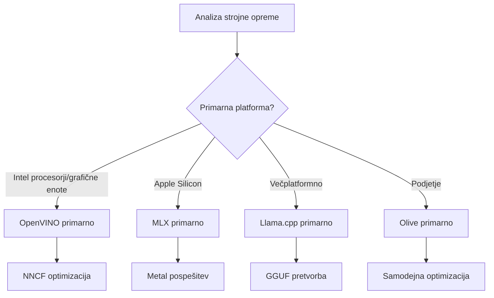
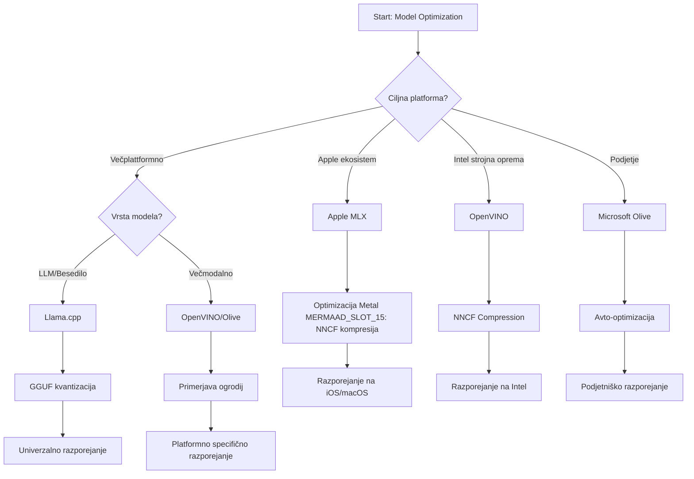
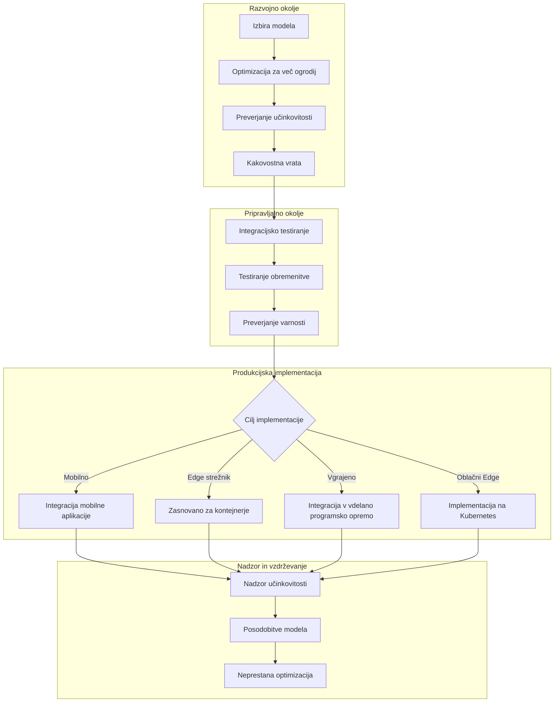

# Poglavje 6: Sinteza delovnega procesa razvoja Edge AI

## Kazalo
1. [Uvod](#uvod)
2. [Učni cilji](#ucni-cilji)
3. [Pregled združenega delovnega procesa](#pregled-zdruzenega-delovnega-procesa)
4. [Matrika izbire ogrodij](#matrika-izbire-ogrodij)
5. [Sinteza najboljših praks](#sinteza-najboljsih-praks)
6. [Vodnik po strategiji uvajanja](#vodnik-po-strategiji-uvajanja)
7. [Delovni proces optimizacije zmogljivosti](#delovni-proces-optimizacije-zmogljivosti)
8. [Kontrolni seznam pripravljenosti za proizvodnjo](#kontrolni-seznam-pripravljenosti-za-proizvodnjo)
9. [Odpravljanje težav in spremljanje](#odpravljanje-tezav-in-spremljanje)
10. [Prihodnja zaščita vašega Edge AI procesa](#prihodnja-zascita-vašega-edge-ai-procesa)

## Uvod

Razvoj Edge AI zahteva poglobljeno razumevanje več optimizacijskih ogrodij, strategij uvajanja ter strojnih zahtev. Ta celovita sinteza združuje znanje iz Llama.cpp, Microsoft Olive, OpenVINO in Apple MLX za ustvarjanje združenega delovnega procesa, ki maksimira učinkovitost, ohranja kakovost in zagotavlja uspešno produkcijsko uvajanje.

V tem tečaju smo raziskovali posamezna optimizacijska ogrodja, vsako s svojimi edinstvenimi prednostmi in specializiranimi primeri uporabe. Vendar pa realni projekti Edge AI pogosto zahtevajo uporabo kombinacij tehnik iz več ogrodij ali strateške odločitve o pristopu, ki bo prinesel najboljše rezultate glede na določene omejitve in zahteve.

To poglavje združuje kolektivno modrost vseh ogrodij v izvedljive delovne procese, drevesa odločitev in najboljše prakse, ki vam omogočajo učinkovito in uspešno izdelavo Edge AI rešitev, pripravljenih za proizvodnjo. Ne glede na to, ali optimizirate za mobilne naprave, vgrajene sisteme ali edge strežnike, ta vodnik ponuja strateško ogrodje za sprejemanje premišljenih odločitev skozi celoten razvojni cikel.

## Učni cilji

Ob koncu tega poglavja boste znali:

### Strateško odločanje
- **Oceniti in izbrati** optimalno optimizacijsko ogrodje glede na zahteve projekta, strojne omejitve in scenarije uvajanja
- **Oblikovati celovite delovne procese**, ki vključujejo več optimizacijskih tehnik za največjo učinkovitost
- **Ocenjevati kompromise** med natančnostjo modela, hitrostjo sklepanja, porabo pomnilnika in kompleksnostjo uvajanja v različnih ogrodjih

### Integracija delovnih procesov
- **Izvajati združene razvojne pipline**, ki izkoriščajo prednosti več optimizacijskih ogrodij
- **Ustvarjati reproducibilne delovne procese** za dosledno optimizacijo in uvajanje modelov v različnih okoljih
- **Vzpostaviti kakovostne prehode** in validacijske postopke za zagotovitev, da optimizirani modeli izpolnjujejo proizvodne zahteve

### Optimizacija zmogljivosti
- **Uporabljati sistematične strategije optimizacije** z uporabo kvantizacije, rezanja in strojno-specifičnih metod pospeševanja
- **Spremljati in meriti** zmogljivost modelov v različnih nivojih optimizacije in ciljnih okoljih uvajanja
- **Optimizirati za specifične strojne platforme**, vključno s CPU, GPU, NPU in specializiranimi edge pospeševalniki

### Proizvodno uvajanje
- **Načrtovati razširljive arhitekture uvajanja**, ki podpirajo več formatov modelov in izvedbenih okolij (inference engines)
- **Implementirati spremljanje in opazovanje** za Edge AI aplikacije v proizvodnih okoljih
- **Vzpostaviti vzdrževalne delovne procese** za posodobitve modelov, spremljanje zmogljivosti in sistemske optimizacije

### Odličnost na več platformah
- **Uvajati optimizirane modele** na različnih strojnih platformah ob ohranjanju konsistentne zmogljivosti
- **Obravnavati platformno-specifične optimizacije** za Windows, macOS, Linux, mobilne in vgrajene sisteme
- **Ustvariti abstrakcijske plasti**, ki omogočajo nemoteno uvajanje v različnih edge okoljih

## Pregled združenega delovnega procesa

### Faza 1: Analiza zahtev in izbira ogrodja

Temelj uspešnega uvajanja Edge AI je temeljita analiza zahtev, ki usmerja izbiro ogrodja in strategijo optimizacije.

#### 1.1 Ocena strojne opreme


**Ključni dejavniki:**
- **Arhitektura CPU**: x86, ARM, zmogljivosti Apple Silicon
- **Razpoložljivost pospeševalcev**: GPU, NPU, VPU, specializirani AI čipi
- **Omejitve pomnilnika**: omejitve RAM-a, zmogljivost shranjevanja
- **Energetski proračun**: življenjska doba baterije, termične omejitve
- **Povezljivost**: zahteve za delovanje brez povezave, omejitve pasovne širine

#### 1.2 Matrika zahtev aplikacije

| Zahteva | Llama.cpp | Microsoft Olive | OpenVINO | Apple MLX |
|-------------|-----------|-----------------|----------|-----------|
| Večplatformno | ✅ Odlično | ⚡ Dobro | ⚡ Dobro | ❌ Samo Apple |
| Podjetniška integracija | ⚡ Osnovno | ✅ Odlično | ✅ Odlično | ⚡ Omejeno |
| Mobilno uvajanje | ✅ Odlično | ⚡ Dobro | ⚡ Dobro | ✅ iOS Odlično |
| Realnočasno sklepanje | ✅ Odlično | ✅ Odlično | ✅ Odlično | ✅ Odlično |
| Raznolikost modelov | ✅ Osredotočeno na LLM | ✅ Vsi modeli | ✅ Vsi modeli | ✅ Osredotočeno na LLM |
| Enostavnost uporabe | ✅ Preprosto | ✅ Avtomatizirano | ⚡ Zmerno | ✅ Preprosto |

### Faza 2: Priprava in optimizacija modela

#### 2.1 Univerzalni pipelin za oceno modela

```python
# Univerzalni okvir za ocenjevanje modelov
class EdgeAIModelAssessment:
    def __init__(self, model_path, target_hardware):
        self.model_path = model_path
        self.target_hardware = target_hardware
        self.optimization_frameworks = []
        
    def assess_model_characteristics(self):
        """Analyze model size, architecture, and complexity"""
        return {
            'model_size': self.get_model_size(),
            'parameter_count': self.get_parameter_count(),
            'architecture_type': self.detect_architecture(),
            'quantization_compatibility': self.check_quantization_support()
        }
    
    def recommend_optimization_strategy(self):
        """Recommend optimal frameworks and techniques"""
        characteristics = self.assess_model_characteristics()
        
        if self.target_hardware.startswith('apple'):
            return self.mlx_optimization_strategy(characteristics)
        elif self.target_hardware.startswith('intel'):
            return self.openvino_optimization_strategy(characteristics)
        elif characteristics['model_size'] > 7_000_000_000:  # 7 milijard+ parametrov
            return self.enterprise_optimization_strategy(characteristics)
        else:
            return self.lightweight_optimization_strategy(characteristics)
```

#### 2.2 Multi-ogrodna optimizacijska cevovod

**Zaporedni pristop k optimizaciji:**
1. **Začetna konverzija**: Pretvorba v vmesni format (po možnosti ONNX)
2. **Ogrodno-specifična optimizacija**: Uporaba specializiranih tehnik
3. **Medsebojna validacija**: Preverjanje zmogljivosti na ciljnih platformah
4. **Končno pakiranje**: Priprava za uvajanje

```bash
# Skripta za optimizacijo več okvirov
#!/bin/bash

MODEL_NAME="phi-3-mini"
BASE_MODEL="microsoft/Phi-3-mini-4k-instruct"

# Faza 1: Pretvorba ONNX (univerzalna)
python convert_to_onnx.py --model $BASE_MODEL --output models/onnx/

# Faza 2: Optimizacija za specifično platformo
if [[ "$TARGET_PLATFORM" == "intel" ]]; then
    # Optimizacija OpenVINO
    python optimize_openvino.py --input models/onnx/ --output models/openvino/
elif [[ "$TARGET_PLATFORM" == "apple" ]]; then
    # Optimizacija MLX
    python optimize_mlx.py --input $BASE_MODEL --output models/mlx/
elif [[ "$TARGET_PLATFORM" == "cross" ]]; then
    # Optimizacija Llama.cpp
    python convert_to_gguf.py --input models/onnx/ --output models/gguf/
fi

# Faza 3: Validacija
python validate_optimization.py --original $BASE_MODEL --optimized models/$TARGET_PLATFORM/
```

### Faza 3: Validacija zmogljivosti in benchmarking

#### 3.1 Celovito ogrodje za benchmarking

```python
class EdgeAIBenchmark:
    def __init__(self, optimized_models):
        self.models = optimized_models
        self.metrics = {
            'inference_time': [],
            'memory_usage': [],
            'accuracy_score': [],
            'throughput': [],
            'energy_consumption': []
        }
    
    def run_comprehensive_benchmark(self):
        """Execute standardized benchmarks across all optimized models"""
        test_inputs = self.generate_test_inputs()
        
        for model_framework, model_path in self.models.items():
            print(f"Benchmarking {model_framework}...")
            
            # Testiranje zakasnitve
            latency = self.measure_inference_latency(model_path, test_inputs)
            
            # Profiliranje pomnilnika
            memory = self.profile_memory_usage(model_path)
            
            # Preverjanje natančnosti
            accuracy = self.validate_model_accuracy(model_path, test_inputs)
            
            # Analiza prepustnosti
            throughput = self.measure_throughput(model_path)
            
            self.record_metrics(model_framework, latency, memory, accuracy, throughput)
    
    def generate_optimization_report(self):
        """Create comprehensive comparison report"""
        report = {
            'recommendations': self.analyze_performance_trade_offs(),
            'deployment_guidance': self.generate_deployment_recommendations(),
            'monitoring_requirements': self.define_monitoring_metrics()
        }
        return report
```

## Matrika izbire ogrodij

### Drevo odločitev za izbiro ogrodja



### Celoviti kriteriji izbire

#### 1. Glavna usmeritev uporabe

**Veliki jezikovni modeli (LLM):**
- **Llama.cpp**: Najboljše za CPU usmerjeno, večplatformno uvajanje
- **Apple MLX**: Optimalno za Apple Silicon z enotnim pomnilnikom
- **OpenVINO**: Odlično za Intel strojno opremo z NNCF optimizacijo
- **Microsoft Olive**: Idealno za podjetniške delovne tokove z avtomatizacijo

**Večmodalni modeli:**
- **OpenVINO**: Celovita podpora za vid, zvok in besedilo
- **Microsoft Olive**: Podjetniška optimizacija za kompleksne pipeline
- **Llama.cpp**: Omejeno na besedilne modele
- **Apple MLX**: Naraščajoča podpora za večmodalne aplikacije

#### 2. Matrika strojne platforme

| Platforma | Primarno ogrodje | Sekundarna izbira | Specializirane lastnosti |
|----------|------------------|------------------|-------------------------|
| Intel CPU/GPU | OpenVINO | Microsoft Olive | NNCF stiskanje, Intel optimizacija |
| NVIDIA GPU | Microsoft Olive | OpenVINO | CUDA pospeševanje, podjetniške funkcije |
| Apple Silicon | Apple MLX | Llama.cpp | Metal shaderji, enotni pomnilnik |
| ARM Mobile | Llama.cpp | OpenVINO | Večplatformno, minimalne odvisnosti |
| Edge TPU | OpenVINO | Microsoft Olive | Podpora za specializiran pospeševalnik |
| Vgrajeni ARM | Llama.cpp | OpenVINO | Minimalen odtis, učinkovito sklepanje |

#### 3. Preference delovnih procesov razvoja

**Hitri prototip:**
1. **Llama.cpp**: Najhitrejša nastavitev, takojšnji rezultati
2. **Apple MLX**: Preprosto Python API, hitre iteracije
3. **Microsoft Olive**: Avtomatizirana optimizacija, minimalna konfiguracija
4. **OpenVINO**: Bolj kompleksna nastavitev, celovite funkcije

**Proizvodnja za podjetja:**
1. **Microsoft Olive**: Podjetniške funkcije, Azure integracija
2. **OpenVINO**: Intel ekosistem, celovita orodja
3. **Apple MLX**: Apple-specifične podjetniške aplikacije
4. **Llama.cpp**: Preprosto uvajanje, omejene podjetniške funkcije

## Sinteza najboljših praks

### Univerzalna načela optimizacije

#### 1. Progresivna strategija optimizacije

```python
class ProgressiveOptimization:
    def __init__(self, base_model):
        self.base_model = base_model
        self.optimization_stages = [
            'baseline_measurement',
            'format_conversion',
            'quantization_optimization',
            'hardware_acceleration',
            'production_validation'
        ]
    
    def execute_progressive_optimization(self):
        """Apply optimization techniques incrementally"""
        
        # Faza 1: Osnovno merjenje
        baseline_metrics = self.measure_baseline_performance()
        
        # Faza 2: Pretvorba formata
        converted_model = self.convert_to_optimal_format()
        conversion_metrics = self.measure_performance(converted_model)
        
        # Faza 3: Kvantizacija
        quantized_model = self.apply_quantization(converted_model)
        quantization_metrics = self.measure_performance(quantized_model)
        
        # Faza 4: Pospešek strojne opreme
        accelerated_model = self.enable_hardware_acceleration(quantized_model)
        acceleration_metrics = self.measure_performance(accelerated_model)
        
        # Faza 5: Validacija
        production_ready = self.validate_for_production(accelerated_model)
        
        return self.compile_optimization_report(
            baseline_metrics, conversion_metrics, 
            quantization_metrics, acceleration_metrics
        )
```

#### 2. Implementacija kakovostnih prehodov

**Prehodi ohranjanja natančnosti:**
- Ohranjajte >95 % prvotne natančnosti modela
- Validirajte na reprezentativnih testnih podatkovnih sklopih
- Izvajajte A/B testiranje za validacijo v proizvodnji

**Prehodi izboljšanja zmogljivosti:**
- Dosezite najmanj 2-kratno izboljšanje hitrosti
- Zmanjšajte pomnilniški odtis za vsaj 50 %
- Validirajte konsistentnost časov sklepanja

**Prehodi pripravljenosti za proizvodnjo:**
- Preizkusite stabilnost ob obremenitvi
- Pokažite stabilno delovanje skozi čas
- Validirajte zahteve glede varnosti in zasebnosti

### Integracija najboljših praks, specifičnih za ogrodja

#### 1. Sinteza strategij kvantizacije

```python
# Enoten pristop k kvantizaciji
class UnifiedQuantizationStrategy:
    def __init__(self, model, target_platform):
        self.model = model
        self.platform = target_platform
        
    def select_optimal_quantization(self):
        """Choose best quantization based on platform and requirements"""
        
        if self.platform == 'apple_silicon':
            return self.mlx_quantization_strategy()
        elif self.platform == 'intel_hardware':
            return self.openvino_quantization_strategy()
        elif self.platform == 'cross_platform':
            return self.llamacpp_quantization_strategy()
        else:
            return self.olive_quantization_strategy()
    
    def mlx_quantization_strategy(self):
        """Apple MLX-specific quantization"""
        return {
            'method': 'mlx_quantize',
            'precision': 'int4',
            'group_size': 64,
            'optimization_target': 'unified_memory'
        }
    
    def openvino_quantization_strategy(self):
        """OpenVINO NNCF quantization"""
        return {
            'method': 'nncf_quantize',
            'precision': 'int8',
            'calibration_method': 'post_training',
            'optimization_target': 'intel_hardware'
        }
```

#### 2. Optimizacija strojniškega pospeševanja

**Sinteza optimizacije CPU:**
- **SIMD ukazi**: Izkoristite optimizirane jedrne funkcije v različnih ogrodjih
- **Pasovna širina pomnilnika**: Optimizirajte razporeditev podatkov za večjo učinkovitost predpomnilnika
- **Vezenje nitk**: Uravnotežite vzporednost in omejitve virov

**Najboljše prakse za pospeševanje z GPU:**
- **Obdelava paketov**: Maksimirajte prepustnost z ustreznimi velikostmi paketov
- **Upravljanje pomnilnika**: Optimizirajte dodeljevanje in prenose GPU pomnilnika
- **Natančnost**: Uporabljajte FP16, kjer je podprto, za boljšo zmogljivost

**Optimizacija NPU/specializiranih pospeševalnikov:**
- **Arhitektura modela**: Zagotovite združljivost s zmožnostmi pospeševalnika
- **Tok podatkov**: Optimizirajte vhodno/izhodne pipeleine za učinkovitost pospeševalnika
- **Strategije zasilnega preklopa**: Implementirajte CPU zasilno delovanje za nepodprte operacije

## Vodnik po strategiji uvajanja

### Univerzalna arhitektura uvajanja



### Platformno-specifični vzorci uvajanja

#### 1. Strategija mobilnega uvajanja

```yaml
# Mobile Deployment Configuration
mobile_deployment:
  ios:
    framework: apple_mlx
    optimization:
      quantization: int4
      memory_mapping: true
      background_execution: limited
    packaging:
      format: mlx
      bundle_size: <50MB
      
  android:
    framework: llama_cpp
    optimization:
      quantization: q4_k_m
      threading: android_optimized
      memory_management: conservative
    packaging:
      format: gguf
      apk_size: <100MB
      
  cross_platform:
    framework: onnx_runtime
    optimization:
      quantization: int8
      execution_provider: cpu
    packaging:
      format: onnx
      shared_libraries: minimal
```

#### 2. Uvajanje na edge strežnikih

```yaml
# Edge Server Deployment Configuration
edge_server:
  intel_based:
    framework: openvino
    optimization:
      quantization: int8
      acceleration: cpu_gpu_auto
      batch_processing: dynamic
    deployment:
      container: openvino_runtime
      orchestration: kubernetes
      scaling: horizontal
      
  nvidia_based:
    framework: microsoft_olive
    optimization:
      quantization: int4
      acceleration: cuda
      tensor_parallelism: true
    deployment:
      container: nvidia_triton
      orchestration: kubernetes
      scaling: gpu_aware
```

### Najboljše prakse za kontejnerizacijo

```dockerfile
# Multi-Framework Edge AI Container
FROM ubuntu:22.04 as base

# Install common dependencies
RUN apt-get update && apt-get install -y \
    python3 \
    python3-pip \
    build-essential \
    cmake \
    && rm -rf /var/lib/apt/lists/*

# Framework-specific stages
FROM base as openvino
RUN pip install openvino nncf optimum[intel]

FROM base as llamacpp
RUN git clone https://github.com/ggerganov/llama.cpp.git \
    && cd llama.cpp && make LLAMA_OPENBLAS=1

FROM base as olive
RUN pip install olive-ai[auto-opt] onnxruntime-genai

# Production stage with selected framework
FROM openvino as production
COPY models/ /app/models/
COPY src/ /app/src/
WORKDIR /app

EXPOSE 8080
CMD ["python3", "src/inference_server.py"]
```

## Delovni proces optimizacije zmogljivosti

### Sistemska nastavitev zmogljivosti

#### 1. Pipeline profiliranja zmogljivosti

```python
class EdgeAIPerformanceProfiler:
    def __init__(self, model_path, framework):
        self.model_path = model_path
        self.framework = framework
        self.profiling_results = {}
    
    def comprehensive_profiling(self):
        """Execute comprehensive performance analysis"""
        
        # Profiliranje CPU
        cpu_profile = self.profile_cpu_usage()
        
        # Profiliranje pomnilnika
        memory_profile = self.profile_memory_usage()
        
        # Zamuda sklepov
        latency_profile = self.profile_inference_latency()
        
        # Analiza prepustnosti
        throughput_profile = self.profile_throughput()
        
        # Poraba energije (kjer je na voljo)
        energy_profile = self.profile_energy_consumption()
        
        return self.compile_performance_report(
            cpu_profile, memory_profile, latency_profile,
            throughput_profile, energy_profile
        )
    
    def identify_bottlenecks(self):
        """Automatically identify performance bottlenecks"""
        bottlenecks = []
        
        if self.profiling_results['cpu_utilization'] > 80:
            bottlenecks.append('cpu_bound')
        
        if self.profiling_results['memory_usage'] > 90:
            bottlenecks.append('memory_bound')
        
        if self.profiling_results['inference_variance'] > 20:
            bottlenecks.append('inconsistent_performance')
        
        return self.generate_optimization_recommendations(bottlenecks)
```

#### 2. Avtomatiziran pipelin optimizacije

```python
class AutomatedOptimizationPipeline:
    def __init__(self, base_model, target_constraints):
        self.base_model = base_model
        self.constraints = target_constraints
        self.optimization_history = []
    
    def execute_optimization_search(self):
        """Systematically search optimization space"""
        
        optimization_candidates = [
            {'quantization': 'int8', 'pruning': 0.1},
            {'quantization': 'int4', 'pruning': 0.2},
            {'quantization': 'int8', 'acceleration': 'gpu'},
            {'quantization': 'int4', 'acceleration': 'npu'}
        ]
        
        best_configuration = None
        best_score = 0
        
        for config in optimization_candidates:
            optimized_model = self.apply_optimization(config)
            score = self.evaluate_optimization(optimized_model)
            
            if score > best_score and self.meets_constraints(optimized_model):
                best_score = score
                best_configuration = config
            
            self.optimization_history.append({
                'config': config,
                'score': score,
                'model': optimized_model
            })
        
        return best_configuration, self.optimization_history
```

### Optimizacija z več cilji

#### 1. Pareto optimizacija za Edge AI

```python
class ParetoOptimization:
    def __init__(self, objectives=['speed', 'accuracy', 'memory']):
        self.objectives = objectives
        self.pareto_frontier = []
    
    def find_pareto_optimal_solutions(self, optimization_results):
        """Identify Pareto-optimal configurations"""
        
        for result in optimization_results:
            is_dominated = False
            
            for frontier_point in self.pareto_frontier:
                if self.dominates(frontier_point, result):
                    is_dominated = True
                    break
            
            if not is_dominated:
                # Odstrani podrejene točke iz meje
                self.pareto_frontier = [
                    point for point in self.pareto_frontier 
                    if not self.dominates(result, point)
                ]
                
                self.pareto_frontier.append(result)
        
        return self.pareto_frontier
    
    def recommend_configuration(self, user_preferences):
        """Recommend configuration based on user preferences"""
        
        weighted_scores = []
        for config in self.pareto_frontier:
            score = sum(
                user_preferences[obj] * config['metrics'][obj] 
                for obj in self.objectives
            )
            weighted_scores.append((score, config))
        
        return max(weighted_scores, key=lambda x: x[0])[1]
```

## Kontrolni seznam pripravljenosti za proizvodnjo

### Celovita proizvodna validacija

#### 1. Zagotovilo kakovosti modela

```python
class ProductionReadinessValidator:
    def __init__(self, optimized_model, production_requirements):
        self.model = optimized_model
        self.requirements = production_requirements
        self.validation_results = {}
    
    def validate_model_quality(self):
        """Comprehensive model quality validation"""
        
        # Preverjanje natančnosti
        accuracy_result = self.validate_accuracy()
        
        # Preverjanje zmogljivosti
        performance_result = self.validate_performance()
        
        # Testiranje robustnosti
        robustness_result = self.validate_robustness()
        
        # Ocena varnosti
        security_result = self.validate_security()
        
        # Preverjanje skladnosti
        compliance_result = self.validate_compliance()
        
        return self.compile_validation_report(
            accuracy_result, performance_result, robustness_result,
            security_result, compliance_result
        )
    
    def generate_certification_report(self):
        """Generate production certification report"""
        return {
            'model_signature': self.generate_model_signature(),
            'validation_timestamp': datetime.now(),
            'validation_results': self.validation_results,
            'deployment_approval': self.check_deployment_approval(),
            'monitoring_requirements': self.define_monitoring_requirements()
        }
```

#### 2. Kontrolni seznam uvajanja v proizvodnjo

**Validacija pred uvajanjem:**
- [ ] Natančnost modela ustreza minimalnim zahtevam (>95 % izhodišča)
- [ ] Doseženi so cilji zmogljivosti (zakasnitev, prepustnost, pomnilnik)
- [ ] Varnostne ranljivosti ocenjene in odpravljene
- [ ] Stresno testiranje opravljeno pri pričakovani obremenitvi
- [ ] Preizkušeni scenariji okvar in potrjeni postopki obnovitve
- [ ] Konfigurirani sistemi spremljanja in alarmiranja
- [ ] Preizkušeni in dokumentirani postopki vračanja nazaj

**Proces uvajanja:**
- [ ] Izvedena strategija modro-zelene uvedbe
- [ ] Konfigurirano postopno povečanje prometa
- [ ] Aktivni nadzorni nadzorni paneli v realnem času
- [ ] Vzpostavljene osnovne zmogljivosti
- [ ] Določeni pragovi napak
- [ ] Konfigurirani sprožilci avtomatiziranega vračanja

**Spremljanje po uvajanju:**
- [ ] Aktivna detekcija drsenja modela
- [ ] Konfigurirana opozorila za poslabšanje zmogljivosti
- [ ] Omogočeno spremljanje porabe virov
- [ ] Merjenje uporabniške izkušnje
- [ ] Vzdrževanje različic in genealogije modela
- [ ] Redni pregledi zmogljivosti modela

### Neprekinjena integracija/neprekinjeno uvajanje (CI/CD)

```yaml
# Edge AI CI/CD Pipeline Configuration
edge_ai_pipeline:
  stages:
    - model_validation
    - optimization
    - testing
    - staging_deployment
    - production_deployment
    - monitoring
  
  model_validation:
    accuracy_threshold: 0.95
    performance_baseline: required
    security_scan: enabled
    
  optimization:
    frameworks:
      - llama_cpp
      - openvino
      - microsoft_olive
    validation:
      cross_validation: enabled
      performance_comparison: required
      
  testing:
    unit_tests: comprehensive
    integration_tests: full_pipeline
    load_tests: production_scale
    security_tests: comprehensive
    
  deployment:
    strategy: blue_green
    traffic_ramping: gradual
    rollback: automatic
    monitoring: real_time
```

## Odpravljanje težav in spremljanje

### Univerzalno ogrodje za odpravljanje težav

#### 1. Pogoste težave in rešitve

**Težave z zmogljivostjo:**
```python
class PerformanceTroubleshooter:
    def __init__(self, model_metrics):
        self.metrics = model_metrics
        
    def diagnose_performance_issues(self):
        """Systematic performance issue diagnosis"""
        
        issues = []
        
        # Diagnostika visoke zakasnitve
        if self.metrics['avg_latency'] > self.metrics['target_latency']:
            issues.append(self.diagnose_latency_issues())
        
        # Diagnostika uporabe pomnilnika
        if self.metrics['memory_usage'] > self.metrics['memory_limit']:
            issues.append(self.diagnose_memory_issues())
        
        # Diagnostika prepustnosti
        if self.metrics['throughput'] < self.metrics['target_throughput']:
            issues.append(self.diagnose_throughput_issues())
        
        return self.generate_resolution_plan(issues)
    
    def diagnose_latency_issues(self):
        """Specific latency troubleshooting"""
        potential_causes = []
        
        if self.metrics['cpu_utilization'] > 80:
            potential_causes.append('cpu_bottleneck')
        
        if self.metrics['memory_bandwidth'] > 90:
            potential_causes.append('memory_bandwidth_limit')
        
        if self.metrics['model_size'] > self.metrics['optimal_size']:
            potential_causes.append('model_too_large')
        
        return {
            'issue': 'high_latency',
            'causes': potential_causes,
            'solutions': self.generate_latency_solutions(potential_causes)
        }
```

**Specifično odpravljanje težav za ogrodja:**

| Težava | Llama.cpp | Microsoft Olive | OpenVINO | Apple MLX |
|-------|-----------|-----------------|----------|-----------|
| Težave s pomnilnikom | Zmanjšajte dolžino konteksta | Zmanjšajte velikost paketa | Omogočite predpomnjenje | Uporabite preslikavo pomnilnika |
| Počasno sklepanje | Omogočite SIMD | Preverite kvantizacijo | Optimizirajte vezenje niti | Omogočite Metal |
| Izguba natančnosti | Višja kvantizacija | Ponovno usposabljanje s QAT | Povečajte kalibracijo | Finotuniranje po kvantizaciji |
| Združljivost | Preverite format modela | Preverite različico ogrodja | Posodobite gonilnike | Preverite različico macOS |

#### 2. Strategija spremljanja v proizvodnji

```python
class EdgeAIMonitoring:
    def __init__(self, deployment_config):
        self.config = deployment_config
        self.metrics_collectors = []
        self.alerting_rules = []
    
    def setup_comprehensive_monitoring(self):
        """Configure comprehensive monitoring for Edge AI deployment"""
        
        # Spremljanje zmogljivosti modela
        self.setup_model_performance_monitoring()
        
        # Spremljanje infrastrukture
        self.setup_infrastructure_monitoring()
        
        # Spremljanje poslovnih metrik
        self.setup_business_metrics_monitoring()
        
        # Varnostno spremljanje
        self.setup_security_monitoring()
    
    def setup_model_performance_monitoring(self):
        """Model-specific performance monitoring"""
        metrics = [
            'inference_latency_p50',
            'inference_latency_p95',
            'inference_latency_p99',
            'model_accuracy_drift',
            'prediction_confidence_distribution',
            'error_rate',
            'throughput_requests_per_second'
        ]
        
        for metric in metrics:
            self.add_metric_collector(metric)
            self.add_alerting_rule(metric)
    
    def detect_model_drift(self):
        """Automated model drift detection"""
        drift_indicators = [
            self.statistical_drift_detection(),
            self.performance_drift_detection(),
            self.data_distribution_shift_detection()
        ]
        
        return self.aggregate_drift_signals(drift_indicators)
```

### Avtomatizirano reševanje težav

```python
class AutomatedIssueResolution:
    def __init__(self, monitoring_system):
        self.monitoring = monitoring_system
        self.resolution_strategies = {}
    
    def handle_performance_degradation(self, alert):
        """Automated performance issue resolution"""
        
        if alert['type'] == 'high_latency':
            return self.resolve_latency_issue(alert)
        elif alert['type'] == 'high_memory_usage':
            return self.resolve_memory_issue(alert)
        elif alert['type'] == 'accuracy_drift':
            return self.resolve_accuracy_issue(alert)
        
    def resolve_latency_issue(self, alert):
        """Automated latency issue resolution"""
        resolution_steps = [
            'increase_cpu_allocation',
            'enable_model_caching',
            'reduce_batch_size',
            'switch_to_quantized_model'
        ]
        
        for step in resolution_steps:
            if self.apply_resolution_step(step):
                return f"Resolved latency issue with: {step}"
        
        return "Escalating to human operator"
```

## Prihodnja zaščita vašega Edge AI procesa

### Integracija novih tehnologij

#### 1. Podpora za strojno opremo naslednje generacije

```python
class FutureHardwareIntegration:
    def __init__(self):
        self.supported_accelerators = [
            'npu_next_gen',
            'quantum_processors',
            'neuromorphic_chips',
            'optical_processors'
        ]
    
    def design_adaptive_pipeline(self):
        """Create hardware-agnostic optimization pipeline"""
        
        pipeline = {
            'model_preparation': self.universal_model_preparation(),
            'hardware_detection': self.dynamic_hardware_detection(),
            'optimization_selection': self.adaptive_optimization_selection(),
            'performance_validation': self.hardware_agnostic_validation()
        }
        
        return pipeline
    
    def adaptive_optimization_selection(self):
        """Dynamically select optimization based on available hardware"""
        
        def optimize_for_hardware(model, available_hardware):
            if 'npu' in available_hardware:
                return self.npu_optimization(model)
            elif 'quantum' in available_hardware:
                return self.quantum_optimization(model)
            elif 'neuromorphic' in available_hardware:
                return self.neuromorphic_optimization(model)
            else:
                return self.fallback_optimization(model)
        
        return optimize_for_hardware
```

#### 2. Evolucija arhitekture modela

**Podpora za nove arhitekture:**
- **Mix strokovnjakov (MoE)**: Redke arhitekture modelov za učinkovitost
- **Generiranje z dopolnitvijo pridobivanja**: Hibridni modeli + baze znanja
- **Večmodalni modeli**: Integracija vida + jezika + zvoka
- **Federirano učenje**: Razpršeno usposabljanje in optimizacija

```python
class NextGenModelSupport:
    def __init__(self):
        self.architecture_handlers = {
            'moe': self.handle_mixture_of_experts,
            'rag': self.handle_retrieval_augmented,
            'multimodal': self.handle_multimodal,
            'federated': self.handle_federated_learning
        }
    
    def handle_mixture_of_experts(self, model):
        """Optimize Mixture of Experts models for edge deployment"""
        optimization_strategy = {
            'expert_pruning': True,
            'routing_optimization': True,
            'expert_quantization': 'per_expert',
            'load_balancing': 'dynamic'
        }
        return self.apply_moe_optimization(model, optimization_strategy)
```

### Neprekinjeno učenje in prilagajanje

#### 1. Integracija spletnega učenja

```python
class EdgeOnlineLearning:
    def __init__(self, base_model, learning_rate=0.001):
        self.base_model = base_model
        self.learning_rate = learning_rate
        self.adaptation_buffer = []
    
    def continuous_adaptation(self, new_data, feedback):
        """Continuously adapt model based on edge data"""
        
        # Lokalna prilagoditev z ohranjanjem zasebnosti
        local_updates = self.compute_local_gradients(new_data, feedback)
        
        # Uporabi posodobitve s pogoji
        adapted_model = self.apply_constrained_updates(
            self.base_model, local_updates
        )
        
        # Preveri kakovost prilagoditve
        if self.validate_adaptation(adapted_model):
            self.base_model = adapted_model
            return True
        
        return False
    
    def federated_learning_participation(self):
        """Participate in federated learning while preserving privacy"""
        
        # Izračunaj lokalne posodobitve modela
        local_updates = self.compute_private_updates()
        
        # Zaščita diferencialne zasebnosti
        private_updates = self.apply_differential_privacy(local_updates)
        
        # Delite s koordinatorjem federiranega učenja
        return self.share_updates(private_updates)
```

#### 2. Trajnost in zelena AI

```python
class GreenEdgeAI:
    def __init__(self, sustainability_targets):
        self.targets = sustainability_targets
        self.energy_monitor = EnergyMonitor()
    
    def optimize_for_sustainability(self, model):
        """Optimize model for minimal environmental impact"""
        
        optimization_objectives = [
            'minimize_energy_consumption',
            'maximize_hardware_utilization',
            'reduce_model_training_cost',
            'extend_device_lifetime'
        ]
        
        return self.multi_objective_green_optimization(
            model, optimization_objectives
        )
    
    def carbon_aware_deployment(self):
        """Deploy models considering carbon footprint"""
        
        deployment_strategy = {
            'prefer_renewable_energy_regions': True,
            'optimize_for_energy_efficiency': True,
            'minimize_data_transfer': True,
            'lifecycle_carbon_accounting': True
        }
        
        return deployment_strategy
```

## Zaključek

Ta celovita sinteza delovnega procesa predstavlja vrhunec znanja o optimizaciji EdgeAI, saj združuje najboljše prakse vseh glavnih optimizacijskih ogrodij v enoten pristop, pripravljen za proizvodnjo. Z upoštevanjem teh smernic boste lahko:

**Dosegli optimalno zmogljivost**: Z sistematično izbiro ogrodja, progresivno optimizacijo in celovito validacijo, kar zagotavlja maksimalno učinkovitost vaših Edge AI aplikacij.

**Zagotovili pripravljenost za proizvodnjo**: S temeljitim testiranjem, spremljanjem in kakovostnimi prehodi, ki zagotavljajo zanesljivo uvajanje in delovanje v realnih okoljih.

**Ohranili dolgoročni uspeh**: Z neprekinjenim spremljanjem, avtomatiziranim reševanjem težav in strategijami prilagajanja, ki ohranjajo vaše Edge AI rešitve zmogljive in relevantne.

**Zaščitili vaš vložek za prihodnost**: Z oblikovanjem prilagodljivih, strojno neodvisnih pipeline-ov, ki se lahko razvijajo z novimi tehnologijami in zahtevami.

Pokrajina edge AI se hitro spreminja z novimi strojno platformami, tehnikami optimizacije in strategijami uvajanja, ki se redno pojavljajo. Ta sinteza omogoča navigiranje skozi to kompleksnost ob oblikovanju robustnih, učinkovitih in vzdržljivih Edge AI rešitev, ki prinašajo pravo vrednost v proizvodnih okoljih.

Ne pozabite, da je najboljša optimizacijska strategija tista, ki izpolnjuje vaše specifične zahteve ob ohranjanju prilagodljivosti za prilagajanje, ko se te zahteve razvijajo. Ta vodnik uporabite kot ogrodje za sprejemanje premišljenih odločitev, vendar vedno validirajte svoje izbire z empiričnim testiranjem in izkušnjami z uvajanjem v realnem svetu.

## ➡️ Kaj je naslednje


- [07: Qualcomm QNN Poglobljen vpogled](./07.QualcommQNN.md)

---

<!-- CO-OP TRANSLATOR DISCLAIMER START -->
**Omejitev odgovornosti**:
Ta dokument je bil preveden z uporabo AI prevajalske storitve [Co-op Translator](https://github.com/Azure/co-op-translator). Čeprav si prizadevamo za natančnost, vas prosimo, da upoštevate, da avtomatizirani prevodi lahko vsebujejo napake ali netočnosti. Izvirni dokument v njegovem izvirnem jeziku je treba obravnavati kot avtoritativni vir. Za kritične informacije je priporočljiv strokovni človeški prevod. Ne odgovarjamo za morebitna nesporazume ali napačne interpretacije, ki izhajajo iz uporabe tega prevoda.
<!-- CO-OP TRANSLATOR DISCLAIMER END -->