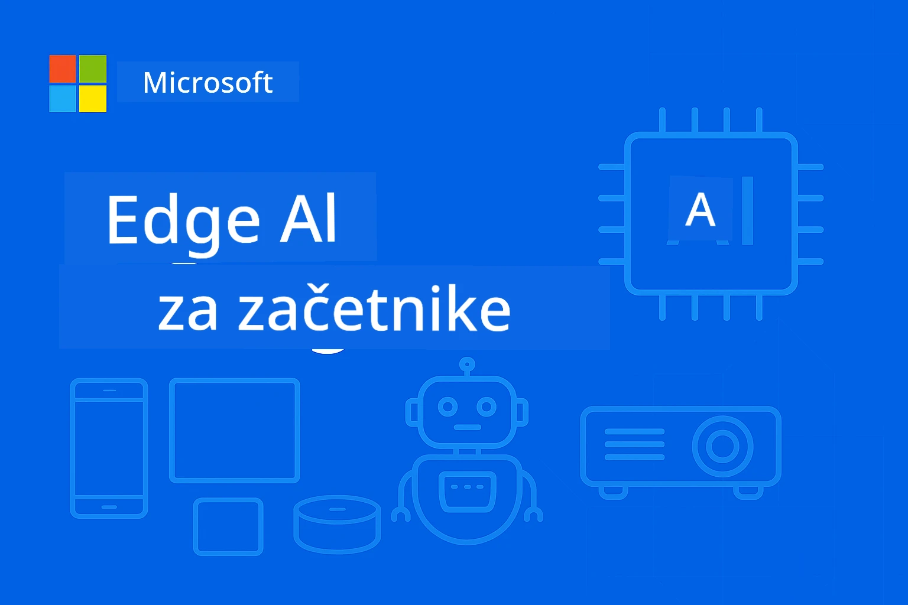

# EdgeAI za začetnike 




[](https://GitHub.com/microsoft/edgeai-for-beginners/graphs/contributors)
[](https://GitHub.com/microsoft/edgeai-for-beginners/issues)
[](https://GitHub.com/microsoft/edgeai-for-beginners/pulls)
[](http://makeapullrequest.com)

[](https://GitHub.com/microsoft/edgeai-for-beginners/watchers)
[](https://GitHub.com/microsoft/edgeai-for-beginners/fork)
[](https://GitHub.com/microsoft/edgeai-for-beginners/stargazers)


[](https://discord.gg/nTYy5BXMWG)

Sledite tem korakom, da začnete uporabljati te vire:

1. **Razvejitev repozitorija**: Kliknite [](https://GitHub.com/microsoft/edgeai-for-beginners/fork)
2. **Kloniranje repozitorija**:   `git clone https://github.com/microsoft/edgeai-for-beginners.git`
3. [**Pridružite se Azure AI Foundry Discordu in spoznajte strokovnjake ter druge razvijalce**](https://discord.com/invite/ByRwuEEgH4)


### 🌐 Podpora za več jezikov

#### Podprto preko GitHub Action (avtomatizirano in vedno posodobljeno)

<!-- CO-OP TRANSLATOR LANGUAGES TABLE START -->
[Arabščina](../ar/README.md) | [Bengalski](../bn/README.md) | [Bolgarščina](../bg/README.md) | [Burmanski (Mjanmar)](../my/README.md) | [Kitajščina (poenostavljena)](../zh-CN/README.md) | [Kitajščina (tradicionalna, Hongkong)](../zh-HK/README.md) | [Kitajščina (tradicionalna, Macao)](../zh-MO/README.md) | [Kitajščina (tradicionalna, Tajvan)](../zh-TW/README.md) | [Hrvaščina](../hr/README.md) | [Češčina](../cs/README.md) | [Danska](../da/README.md) | [Nizozemščina](../nl/README.md) | [Estonščina](../et/README.md) | [Finščina](../fi/README.md) | [Francoščina](../fr/README.md) | [Nemščina](../de/README.md) | [Grščina](../el/README.md) | [Hebrejščina](../he/README.md) | [Hindijščina](../hi/README.md) | [Madžarščina](../hu/README.md) | [Indonezijščina](../id/README.md) | [Italijanščina](../it/README.md) | [Japonščina](../ja/README.md) | [Kannada](../kn/README.md) | [Korejščina](../ko/README.md) | [Litovščina](../lt/README.md) | [Malezijščina](../ms/README.md) | [Malajalamski](../ml/README.md) | [Marathi](../mr/README.md) | [Nepalščina](../ne/README.md) | [Nigerijski pidžin](../pcm/README.md) | [Norveščina](../no/README.md) | [Perzijski (Farsi)](../fa/README.md) | [Poljščina](../pl/README.md) | [Portugalski (Brazilija)](../pt-BR/README.md) | [Portugalski (Portugal)](../pt-PT/README.md) | [Punjabi (Gurmukhi)](../pa/README.md) | [Romunščina](../ro/README.md) | [Ruščina](../ru/README.md) | [Srbščina (cirilica)](../sr/README.md) | [Slovaščina](../sk/README.md) | [Slovenščina](./README.md) | [Španščina](../es/README.md) | [Svahili](../sw/README.md) | [Švedščina](../sv/README.md) | [Tagalog (Filipino)](../tl/README.md) | [Tamilščina](../ta/README.md) | [Telugu](../te/README.md) | [Tajščina](../th/README.md) | [Turščina](../tr/README.md) | [Ukrajinščina](../uk/README.md) | [Urdu](../ur/README.md) | [Vietnamščina](../vi/README.md)

> **Raje lokalno klonirate?**

> Ta repozitorij vsebuje prevode v več kot 50 jezikih, kar znatno poveča velikost prenosa. Če želite klonirati brez prevodov, uporabite sparse checkout:
> ```bash
> git clone --filter=blob:none --sparse https://github.com/microsoft/edgeai-for-beginners.git
> cd edgeai-for-beginners
> git sparse-checkout set --no-cone '/*' '!translations' '!translated_images'
> ```
> Tako dobite vse, kar potrebujete za zaključek tečaja, z veliko hitrejšim prenosom.
<!-- CO-OP TRANSLATOR LANGUAGES TABLE END -->

**Če želite podpreti dodatne prevode jezikov, si oglejte seznam [tukaj](https://github.com/Azure/co-op-translator/blob/main/getting_started/supported-languages.md)**
## Uvod

Dobrodošli v **EdgeAI za začetnike** – vaše celovito potovanje v preobrazbeni svet Edge umetne inteligence. Ta tečaj premošča vrzel med zmogljivimi sposobnostmi AI in praktično, stvarno uporabo na edge napravah, kar vam omogoča, da izkoristite potencial AI neposredno tam, kjer se podatki ustvarjajo in kjer je treba sprejemati odločitve.

### Kaj boste osvojili

Ta tečaj vas vodi od osnovnih pojmov do implementacij pripravljenih za produkcijo, s poudarkom na:
- **Majhnih jezikovnih modelih (SLM)**, optimiziranih za edge uporabo
- **Optimizaciji s poznavanjem strojne opreme** na različnih platformah
- **Vzporedno izvajanje inferenc v realnem času** z varstvom zasebnosti
- **Strategijah produkcijske uporabe** za podjetniške aplikacije

### Zakaj je EdgeAI pomemben

Edge AI predstavlja prelomni premik, ki naslavlja ključne sodobne izzive:
- **Zasebnost in varnost**: obdelava občutljivih podatkov lokalno brez izpostavitve v oblaku
- **Delovanje v realnem času**: odprava zamud zaradi omrežja za aplikacije, kjer je čas kritičen
- **Učinkovitost stroškov**: znižanje porabe pasovne širine in stroškov obračunavanja v oblaku
- **Vzdrževanje delovanja**: ohranjanje funkcionalnosti med izpadi omrežja
- **Skladnost s predpisi**: spoštovanje zahtev glede suverenosti podatkov

### Edge AI

Edge AI pomeni izvajanje AI algoritmov in jezikovnih modelov lokalno na strojni opremi, blizu vira podatkov, brez odvisnosti od oblačnih virov za inferenco. Zmanjšuje zamudo, povečuje zasebnost in omogoča odločanje v realnem času.

### Temeljna načela:
- **Inferenca na napravi**: AI modeli tečejo na edge napravah (telefoni, usmerjevalniki, mikrokontrolerji, industrijski računalniki)
- **Funkcionalnost brez povezave**: deluje brez stalne internetne povezave
- **Nizka zakasnitev**: takojšnji odzivi, primerni za sisteme v realnem času
- **Suverenost podatkov**: občutljivi podatki ostanejo lokalno, izboljšuje varnost in skladnost

### Majhni jezikovni modeli (SLM)

SLM-ji, kot so Phi-4, Mistral-7B in Gemma, so optimizirane različice večjih LLM-jev — trenirani ali destilirani za:
- **Zmanjšan pomnilniški odtis**: učinkovita raba omejenega pomnilnika edge naprav
- **Manjša potreba po računanju**: optimizirano za CPU in edge GPU zmogljivost
- **Hiter zagon**: hitra inicializacija za odzivne aplikacije

Omogočajo napredne NLP zmogljivosti ob upoštevanju omejitev:
- **Vgrajeni sistemi**: IoT naprave in industrijski krmilniki
- **Mobilne naprave**: pametni telefoni in tablice z delovanjem brez povezave
- **IoT naprave**: senzorji in pametne naprave z omejenimi viri
- **Edge strežniki**: lokalne obdelovalne enote z omejenimi GPU zmogljivostmi
- **Osebni računalniki**: scenariji uporabe na namiznih in prenosnih računalnikih

## Moduli tečaja in navigacija

| Modul | Tema | Osrednje področje | Ključna vsebina | Raven | Trajanje |
|--------|-------|------------|-------------|--------|----------|
| [📖 00 ](./introduction.md) | [Uvod v EdgeAI](./introduction.md) | Osnove in kontekst | Pregled EdgeAI • Industrijske uporabe • Uvod v SLM • Cilji učenja | Začetnik | 1-2 uri |
| [📚 01](../../Module01) | [Osnove EdgeAI](./Module01/README.md) | Primerjava oblak vs edge AI | Osnove EdgeAI • Stvarne študije primerov • Vodnik implementacije • Edge postavitev | Začetnik | 3-4 ure |
| [🧠 02](../../Module02) | [Temelji SLM modelov](./Module02/README.md) | Podružnice modelov in arhitektura | Družina Phi • Družina Qwen • Družina Gemma • BitNET • μModel • Phi-Silica | Začetnik | 4-5 ur |
| [🚀 03](../../Module03) | [Praksa postavitve SLM](./Module03/README.md) | Lokalna in oblačna postavitev | Napredno učenje • Lokalno okolje • Postavitev v oblaku | Srednje | 4-5 ur |
| [⚙️ 04](../../Module04) | [Orodja za optimizacijo modelov](./Module04/README.md) | Optimizacija za več platform | Uvod • Llama.cpp • Microsoft Olive • OpenVINO • Apple MLX • Sestavljanje delovnih tokov | Srednje | 5-6 ur |
| [🔧 05](../../Module05) | [Produkcija z SLMOps](./Module05/README.md) | Produkcijsko upravljanje | Uvod v SLMOps • Destilacija modelov • Izpopolnjevanje • Produkcijska postavitev | Napredno | 5-6 ur |
| [🤖 06](../../Module06) | [AI agenti in klicanje funkcij](./Module06/README.md) | Okviri agentov & MCP | Uvod v agente • Klicanje funkcij • Protokol konteksta modela | Napredno | 4-5 ur |
| [💻 07](../../Module07) | [Implementacija platforme](./Module07/README.md) | Primeri za več platform | AI orodjarna • Foundry Local • Windows razvoj | Napredno | 3-4 ure |
| [🏭 08](../../Module08) | [Foundry Local orodjarna](./Module08/README.md) | Produkcijsko pripravljeni primeri | Vzorčne aplikacije (podrobnosti spodaj) | Strokovnjak | 8-10 ur |

### 🏭 **Modul 08: Vzorčne aplikacije**

- [01: REST Chat hitri začetek](./Module08/samples/01/README.md)
- [02: OpenAI SDK integracija](./Module08/samples/02/README.md)
- [03: Iskanje in benchmarking modelov](./Module08/samples/03/README.md)
- [04: Chainlit RAG aplikacija](./Module08/samples/04/README.md)
- [05: Orkestracija več agentov](./Module08/samples/05/README.md)
- [06: Usmerjevalnik modelov kot orodij](./Module08/samples/06/README.md)
- [07: Neposredni API odjemalec](./Module08/samples/07/README.md)
- [08: Windows 11 klepetalna aplikacija](./Module08/samples/08/README.md)
- [09: Napredni sistem več agentov](./Module08/samples/09/README.md)
- [10: Foundry Tools okvir](./Module08/samples/10/README.md)

### 🎓 **Delavnica: Učno pot s praktičnim delom**

Celoviti materiali delavnice s pripravljenimi implementacijami za produkcijo:

- **[Vodnik delavnice](./Workshop/Readme.md)** - Popolni cilji učenja, izidi in navigacija virov
- **Python primeri** (6 sej) - Posodobljeni z najboljšimi praksami, ravnanjem z napakami in celostno dokumentacijo
- **Jupyter zvezki** (8 interaktivnih) - Korak za korakom vodiči z benchmark testi in spremljanjem zmogljivosti
- **Vodniki za seje** - Podrobni markdown vodiči za vsako delavnico
- **Orodja za preverjanje** - Skripte za preverjanje kakovosti kode in izvajanje hitrih testov

**Kaj boste razvili:**
- Lokalne AI klepetalne aplikacije s podporo pretakanja
- RAG potoke z evalvacijo kakovosti (RAGAS)
- Orodja za benchmarking in primerjavo več modelov
- Sisteme orkestracije več agentov
- Inteligentno usmerjanje modelov z izbiro nalog

### 🎙️ **Delavnica za agentike: Praktično - AI podcast studio**

Ustvarite produkcijski potek za podcast, ki ga poganja AI, iz nič! Ta poglobljena delavnica vas uči, kako oblikovati celovit sistem z več agenti, ki preoblikuje ideje v profesionalne epizode podcastov.
**[🎬 Začni delavnico AI Podcast Studia](./WorkshopForAgentic/README.md)**

**Tvoja naloga**: Zaženi "Future Bytes" — tehnični podcast, ki ga v celoti poganjajo AI agenti, ki jih boš zgradil sam. Brez odvisnosti od oblaka, brez stroškov API — vse teče lokalno na tvojem računalniku.

**Kaj to naredi edinstveno:**
- **🤖 Prava večagentna orkestracija** - Zgradi specializirane AI agente, ki raziskujejo, pišejo in proizvajajo zvok
- **🎯 Celoten produkcijski proces** - Od izbire teme do končnega zvočnega posnetka podcasta
- **💻 100% lokalna namestitev** - Uporablja Ollama in lokalne modele (Qwen-3-8B) za popolno zasebnost in kontrolo
- **🎤 Integracija besedila v govor** - Spremeni scenarije v naravno zvenijoče večgovorce pogovore
- **✋ Delovni procesi s človekom v zanki** - Kontrolna mesta za odobritev zagotavljajo kakovost ob ohranjanju avtomatizacije

**Učno potovanje v treh dejanjih:**

| Dejanje | Osredotočenost | Ključne veščine | Trajanje |
|---------|----------------|-----------------|----------|
| **[Dejanje 1: Spoznaj svoje AI asistente](./WorkshopForAgentic/md/01.BuildAIAgentWithSLM.md)** | Zgradi svoj prvi AI agent | Integracija orodij • Spletno iskanje • Reševanje težav • Agentno razmišljanje | 2-3 ure |
| **[Dejanje 2: Sestavi svojo produkcijsko ekipo](./WorkshopForAgentic/md/02.AIAgentOrchestrationAndWorkflows.md)** | Orkestriraj več agentov | Koordinacija ekipe • Delovni procesi odobritve • DevUI vmesnik • Človeški nadzor | 3-4 ure |
| **[Dejanje 3: Oživi svoj podcast](./WorkshopForAgentic/md/03.Multi-SpeakerPodcastGenerationWithVibeVoice.md)** | Generiraj podcast zvok | Besedilo v govor • Sinteza več govorcev • Daljši zvočni posnetki • Popolna avtomatizacija | 2-3 ure |

**Uporabljene tehnologije:**
- **Microsoft Agent Framework** - Orkestracija in koordinacija več agentov
- **Ollama** - Lokalni zagon AI modelov (brez oblaka)
- **Qwen-3-8B** - Odprtostrojni jezikovni model, optimiziran za agentne naloge
- **API-ji za pretvorbo besedila v govor** - Naravna sinteza glasu za generiranje podcastov

**Podpora za strojno opremo:**
- ✅ **Način CPU** - Deluje na vsakem sodobnem računalniku (priporočeno 8 GB+ RAM)
- 🚀 **Pospešek z GPU** - Bistveno hitrejše sklepanje z NVIDIA/AMD GPU-ji
- ⚡ **Podpora NPU** - Pospeševanje z enotami za nevronalno procesiranje naslednje generacije

**Popolno za:**
- Razvijalce, ki se učijo večagentnih AI sistemov
- Vsakogar, ki ga zanimajo AI avtomatizacija in delovni procesi
- Ustvarjalce vsebin, ki raziskujejo AI-podprto produkcijo
- Študente, ki preučujejo praktične vzorce AI orkestracije

**Začni graditi**: [🎙️ Delavnica AI Podcast Studia →](./WorkshopForAgentic/README.md)

### 📊 **Povzetek učne poti**
- **Skupno trajanje**: 36-45 ur
- **Začetna pot**: Moduli 01-02 (7-9 ur)  
- **Srednja pot**: Moduli 03-04 (9-11 ur)
- **Napredna pot**: Moduli 05-07 (12-15 ur)
- **Strokovna pot**: Modul 08 (8-10 ur)

## Kaj boš zgradil

### 🎯 Osnovne kompetence
- **Robna AI arhitektura**: Načrtuj lokalno usmerjene AI sisteme z integracijo v oblak
- **Optimizacija modelov**: Kvantiziraj in stisni modele za robno nameščanje (85 % hitrejše, 75 % manjša velikost)
- **Večplatformna namestitev**: Windows, mobilne naprave, vgrajeni sistemi in hibridni oblaki na robu
- **Produkcijske operacije**: Nadzor, skaliranje in vzdrževanje robne AI v produkciji

### 🏗️ Praktični projekti
- **Foundry lokalne klepetalnice**: Windows 11 izvorna aplikacija z menjavo modelov
- **Večagentni sistemi**: Koordinator s specialističnimi agenti za kompleksne delovne procese  
- **RAG aplikacije**: Lokalna obdelava dokumentov z vektorskim iskanjem
- **Usmerjevalci modelov**: Inteligentna izbira med modeli glede na analizo naloge
- **API ogrodja**: Produkcijsko pripravljen klienti s pretakanjem in nadzorom zdravja
- **Večplatformna orodja**: Vzorec integracije LangChain/Semantic Kernel

### 🏢 Industrijske aplikacije
**Proizvodnja** • **Zdravstvo** • **Avtonomna vozila** • **Pametna mesta** • **Mobilne aplikacije**

## Hitri začetek

**Priporočena učna pot** (skupaj 20-30 ur):

0. **📖 Uvod** ([Introduction.md](./introduction.md)): Osnove EdgeAI + industrijski kontekst + učno ogrodje  
1. **📚 Osnove** (Moduli 01-02): Koncepti EdgeAI + družine SLM modelov  
2. **⚙️ Optimizacija** (Moduli 03-04): Namestitev + kvantizacijska ogrodja  
3. **🚀 Produkcija** (Moduli 05-06): SLMOps + AI agenti + klic funkcij  
4. **💻 Implementacija** (Moduli 07-08): Vzorci platform in Foundry Local orodjarna

Vsak modul vključuje teorijo, praktične vaje in vzorce kode pripravljene za produkcijo.

## Karierni vpliv

**Tehnične vloge**: Arhitekt rešitve EdgeAI • ML inženir (rob) • IoT AI razvijalec • Mobilni AI razvijalec

**Industrijski sektorji**: Proizvodnja 4.0 • Zdravstvena tehnologija • Avtonomni sistemi • FinTech • Potrošniška elektronika

**Portfeljski projekti**: Večagentni sistemi • Produkcijske RAG aplikacije • Večplatformna namestitev • Optimizacija zmogljivosti

## Struktura repozitorija

```
edgeai-for-beginners/
├── 📖 introduction.md  # Foundation: EdgeAI Overview & Learning Framework
├── 📚 Module01-04/     # Fundamentals → SLMs → Deployment → Optimization  
├── 🔧 Module05-06/     # SLMOps → AI Agents → Function Calling
├── 💻 Module07/        # Platform Samples (VS Code, Windows, Jetson, Mobile)
├── 🏭 Module08/        # Foundry Local Toolkit + 10 Comprehensive Samples
│   ├── samples/01-06/  # Foundation: REST, SDK, RAG, Agents, Routing
│   └── samples/07-10/  # Advanced: API Client, Windows App, Enterprise Agents, Tools
├── 🌐 translations/    # Multi-language support (8+ languages)
└── 📋 STUDY_GUIDE.md   # Structured learning paths & time allocation
```

## Poudarki tečaja

✅ **Postopno učenje**: Teorija → Praksa → Produkcijska namestitev  
✅ **Resnične študije primerov**: Microsoft, Japan Airlines, implementacije podjetij  
✅ **Praktični vzorci**: 50+ primerov, 10 celovitih demonstracij Foundry Local  
✅ **Osredotočenost na zmogljivost**: 85 % izboljšave hitrosti, 75 % zmanjšanje velikosti  
✅ **Večplatformno**: Windows, mobilno, vgrajeno, hibrid oblak-rob  
✅ **Pripravljen za produkcijo**: Nadzor, skaliranje, varnost, skladnost ogrodij

📖 **[Razpoložljiv študijski vodič](STUDY_GUIDE.md)**: Strukturirana 20-urna učna pot z usmeritvijo porabe časa in orodji za samoocenjevanje.

---

**EdgeAI predstavlja prihodnost nameščanja AI**: lokalno usmerjeno, varovanje zasebnosti in učinkovito. Obvladaj te veščine in zgradi naslednjo generacijo inteligentnih aplikacij.

## Drugi tečaji

Naša ekipa pripravlja tudi druge tečaje! Oglej si:

<!-- CO-OP TRANSLATOR OTHER COURSES START -->
### LangChain
[](https://aka.ms/langchain4j-for-beginners)
[](https://aka.ms/langchainjs-for-beginners?WT.mc_id=m365-94501-dwahlin)

---

### Azure / Edge / MCP / Agenti
[](https://github.com/microsoft/AZD-for-beginners?WT.mc_id=academic-105485-koreyst)
[](https://github.com/microsoft/edgeai-for-beginners?WT.mc_id=academic-105485-koreyst)
[](https://github.com/microsoft/mcp-for-beginners?WT.mc_id=academic-105485-koreyst)
[](https://github.com/microsoft/ai-agents-for-beginners?WT.mc_id=academic-105485-koreyst)

---

### Serija generativnega AI
[](https://github.com/microsoft/generative-ai-for-beginners?WT.mc_id=academic-105485-koreyst)
[-9333EA?style=for-the-badge&labelColor=E5E7EB&color=9333EA)](https://github.com/microsoft/Generative-AI-for-beginners-dotnet?WT.mc_id=academic-105485-koreyst)
[-C084FC?style=for-the-badge&labelColor=E5E7EB&color=C084FC)](https://github.com/microsoft/generative-ai-for-beginners-java?WT.mc_id=academic-105485-koreyst)
[-E879F9?style=for-the-badge&labelColor=E5E7EB&color=E879F9)](https://github.com/microsoft/generative-ai-with-javascript?WT.mc_id=academic-105485-koreyst)

---

### Osnovno učenje
[](https://aka.ms/ml-beginners?WT.mc_id=academic-105485-koreyst)
[](https://aka.ms/datascience-beginners?WT.mc_id=academic-105485-koreyst)
[](https://aka.ms/ai-beginners?WT.mc_id=academic-105485-koreyst)
[](https://github.com/microsoft/Security-101?WT.mc_id=academic-96948-sayoung)
[](https://aka.ms/webdev-beginners?WT.mc_id=academic-105485-koreyst)
[](https://aka.ms/iot-beginners?WT.mc_id=academic-105485-koreyst)
[](https://github.com/microsoft/xr-development-for-beginners?WT.mc_id=academic-105485-koreyst)

---

### Serija Copilot
[](https://aka.ms/GitHubCopilotAI?WT.mc_id=academic-105485-koreyst)
[](https://github.com/microsoft/mastering-github-copilot-for-dotnet-csharp-developers?WT.mc_id=academic-105485-koreyst)
[](https://github.com/microsoft/CopilotAdventures?WT.mc_id=academic-105485-koreyst)
<!-- CO-OP TRANSLATOR OTHER COURSES END -->

## Pridobivanje pomoči

Če obstanete ali imate kakršnakoli vprašanja glede izdelave AI aplikacij, se pridružite:

[](https://discord.gg/nTYy5BXMWG)

Če imate povratne informacije o izdelku ali napake med izdelavo, obiščite:

[](https://aka.ms/foundry/forum)

---

<!-- CO-OP TRANSLATOR DISCLAIMER START -->
**Omejitev odgovornosti**:
Ta dokument je bil preveden z uporabo storitve za avtomatski prevod AI [Co-op Translator](https://github.com/Azure/co-op-translator). Čeprav si prizadevamo za natančnost, upoštevajte, da avtomatski prevodi lahko vsebujejo napake ali netočnosti. Izvirni dokument v njegovem izvorni jezik se smatra za verodostojen vir. Za ključne informacije priporočamo strokovni človeški prevod. Ne odgovarjamo za morebitna nesporazume ali napačne interpretacije, ki izhajajo iz uporabe tega prevoda.
<!-- CO-OP TRANSLATOR DISCLAIMER END -->