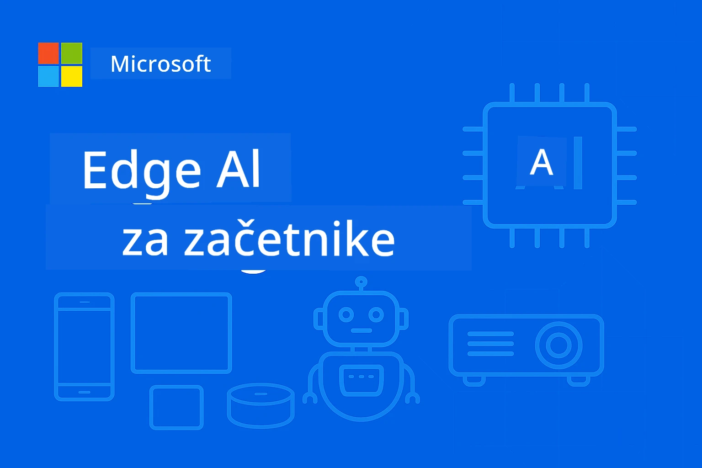

# EdgeAI za začetnike 




[](https://GitHub.com/microsoft/edgeai-for-beginners/graphs/contributors)
[](https://GitHub.com/microsoft/edgeai-for-beginners/issues)
[](https://GitHub.com/microsoft/edgeai-for-beginners/pulls)
[](http://makeapullrequest.com)

[](https://discord.gg/nTYy5BXMWG)

Sledite tem korakom, da začnete uporabljati te vire:

1. **Razveji repozitorij (Fork)**: Click [](https://GitHub.com/microsoft/edgeai-for-beginners/fork)
2. **Kloniraj repozitorij**:   `git clone https://github.com/microsoft/edgeai-for-beginners.git`
3. [**Pridružite se Azure AI Foundry Discordu in spoznajte strokovnjake ter druge razvijalce**](https://discord.com/invite/ByRwuEEgH4)


### 🌐 Večjezična podpora

#### Podprto preko GitHub Action (avtomatizirano in vedno posodobljeno)

<!-- CO-OP TRANSLATOR LANGUAGES TABLE START -->
[Arabščina](../ar/README.md) | [Bengalščina](../bn/README.md) | [Bolgarščina](../bg/README.md) | [Burmanščina (Myanmar)](../my/README.md) | [Kitajščina (poenostavljena)](../zh-CN/README.md) | [Kitajščina (tradicionalna, Hong Kong)](../zh-HK/README.md) | [Kitajščina (tradicionalna, Macau)](../zh-MO/README.md) | [Kitajščina (tradicionalna, Taiwan)](../zh-TW/README.md) | [Hrvaščina](../hr/README.md) | [Češčina](../cs/README.md) | [Danščina](../da/README.md) | [Nizozemščina](../nl/README.md) | [Estonščina](../et/README.md) | [Finščina](../fi/README.md) | [Francoščina](../fr/README.md) | [Nemščina](../de/README.md) | [Grščina](../el/README.md) | [Hebrejščina](../he/README.md) | [Hintščina](../hi/README.md) | [Madžarščina](../hu/README.md) | [Indonezijščina](../id/README.md) | [Italijanščina](../it/README.md) | [Japonščina](../ja/README.md) | [Kannada](../kn/README.md) | [Khmer](../km/README.md) | [Korejščina](../ko/README.md) | [Litovščina](../lt/README.md) | [Malajščina](../ms/README.md) | [Malayalam](../ml/README.md) | [Marathi](../mr/README.md) | [Nepalščina](../ne/README.md) | [Nigerijski pidgin](../pcm/README.md) | [Norveščina](../no/README.md) | [Perzijski (Farsi)](../fa/README.md) | [Poljščina](../pl/README.md) | [Portugalščina (Brazilija)](../pt-BR/README.md) | [Portugalščina (Portugal)](../pt-PT/README.md) | [Pandžabski (Gurmukhi)](../pa/README.md) | [Romunščina](../ro/README.md) | [Ruščina](../ru/README.md) | [Srbščina (cirilica)](../sr/README.md) | [Slovaščina](../sk/README.md) | [Slovenščina](./README.md) | [Španščina](../es/README.md) | [Svahili](../sw/README.md) | [Švedščina](../sv/README.md) | [Tagalog (Filipino)](../tl/README.md) | [Tamilščina](../ta/README.md) | [Telegu](../te/README.md) | [Tajščina](../th/README.md) | [Turščina](../tr/README.md) | [Ukrajinščina](../uk/README.md) | [Urdu](../ur/README.md) | [Vietnamščina](../vi/README.md)

> **Raje klonirate lokalno?**
>
> Ta repozitorij vsebuje več kot 50 prevodov jezikov, kar znatno povečuje velikost prenosa. Če želite klonirati brez prevodov, uporabite sparse checkout:
>
> **Bash / macOS / Linux:**
> ```bash
> git clone --filter=blob:none --sparse https://github.com/microsoft/edgeai-for-beginners.git
> cd edgeai-for-beginners
> git sparse-checkout set --no-cone '/*' '!translations' '!translated_images'
> ```
>
> **CMD (Windows):**
> ```cmd
> git clone --filter=blob:none --sparse https://github.com/microsoft/edgeai-for-beginners.git
> cd edgeai-for-beginners
> git sparse-checkout set --no-cone "/*" "!translations" "!translated_images"
> ```
>
> To vam da vse, kar potrebujete za dokončanje tečaja z veliko hitrejšim prenosom.
<!-- CO-OP TRANSLATOR LANGUAGES TABLE END -->

**Če želite imeti dodatne prevode, podprti jeziki so navedeni [tukaj](https://github.com/Azure/co-op-translator/blob/main/getting_started/supported-languages.md)**
## Uvod

Dobrodošli v **EdgeAI za začetnike** – vaše celovito potovanje v preoblikovalni svet robne umetne inteligence. Ta tečaj premošča vrzel med zmogljivimi AI zmožnostmi in praktičnim uvajanjem na robnih napravah, vam omogoča, da izkoristite potencial AI neposredno tam, kjer se podatki ustvarjajo in je treba sprejemati odločitve.

### Kaj boste obvladali

Ta tečaj vas vodi od osnovnih konceptov do rešitev, pripravljenih za produkcijo, in pokriva:
- **Majhni jezikovni modeli (SLM-ji)**, optimizirani za uvajanje na robu
- **Optimizacija, prilagojena strojni opremi** za različne platforme
- **Sklepanje v realnem času** s funkcijami varovanja zasebnosti
- **Strategije uvajanja v produkcijo** za poslovne aplikacije

### Zakaj je EdgeAI pomemben

Edge AI predstavlja prelomnico, ki naslavlja ključne sodobne izzive:
- **Zasebnost in varnost**: Obdelava občutljivih podatkov lokalno brez izpostavljenosti oblaku
- **Delovanje v realnem času**: Odprava zamika omrežja pri časovno kritičnih aplikacijah
- **Učinkovitost stroškov**: Zmanjšanje porabe pasovne širine in stroškov oblačnega računanja
- **Odpornost delovanja**: Ohranjanje funkcionalnosti med izpadi omrežja
- **Upoštevanje zahtev glede suverenosti podatkov**

### Edge AI

Edge AI pomeni poganjanje AI algoritmov in jezikovnih modelov lokalno na strojni opremi, blizu mesta, kjer se podatki ustvarjajo, brez odvisnosti od oblačnih virov za sklepanje. Zmanjšuje zakasnitev, povečuje zasebnost in omogoča odločanje v realnem času.

### Temeljna načela:
- **Sklepanje na napravi**: AI modeli tečejo na robnih napravah (telefoni, usmerjevalniki, mikrokrmilniki, industrijski PC-ji)
- **Delovanje brez povezave**: Funkcije brez stalne internetne povezave
- **Nizka zakasnitev**: Takojšnji odgovori, primerni za sisteme v realnem času
- **Suverenost podatkov**: Ohranja občutljive podatke lokalno, kar izboljšuje varnost in skladnost

### Majhni jezikovni modeli (SLM-ji)

SLM-ji, kot so Phi-4, Mistral-7B in Gemma, so optimizirane različice večjih LLM-jev — izurjene ali destilirane za:
- **Zmanjšan pomnilniški odtis**: Učinkovita raba omejenega pomnilnika robnih naprav
- **Manjše zahteve po računalniških virih**: Optimizirani za zmogljivost CPU-jev in robnih GPU-jev
- **Hitrejši čas zagona**: Hitra inicializacija za odzivne aplikacije

Omogočajo zmogljive NLP zmožnosti ob hkratnem upoštevanju omejitev:
- **Vgrajeni sistemi**: IoT naprave in industrijski krmilniki
- **Mobilne naprave**: Pametni telefoni in tablice z možnostjo delovanja brez povezave
- **IoT naprave**: Senzorji in pametne naprave z omejenimi viri
- **Robni strežniki**: Lokalna procesna enota z omejenimi GPU viri
- **Osebni računalniki**: Scenariji namestitve na namizne računalnike in prenosnike

## Moduli tečaja in navigacija

| Modul | Tema | Osrednje področje | Ključna vsebina | Raven | Trajanje |
|--------|-------|------------|-------------|--------|----------|
| [📖 00 ](./introduction.md) | [Uvod v EdgeAI](./introduction.md) | Temelj in kontekst | Pregled EdgeAI • Industrijske aplikacije • Uvod v SLM • Cilji učenja | Začetni | 1-2 ur |
| [📚 01](../../Module01) | [Osnove EdgeAI](./Module01/README.md) | Primerjava oblačne in robne AI | Osnove EdgeAI • Primeri iz resničnega sveta • Vodič za implementacijo • Namestitev na robu | Začetni | 3-4 ur |
| [🧠 02](../../Module02) | [Osnove SLM modelov](./Module02/README.md) | Družine modelov in arhitektura | Phi Family • Qwen Family • Gemma Family • BitNET • μModel • Phi-Silica | Začetni | 4-5 ur |
| [🚀 03](../../Module03) | [Praksa uvajanja SLM](./Module03/README.md) | Lokalna in oblačna uvajanja | Napredno učenje • Lokalno okolje • Oblačno uvajanje | Vmesno | 4-5 ur |
| [⚙️ 04](../../Module04) | [Orodja za optimizacijo modelov](./Module04/README.md) | Optimizacija za več platform | Uvod • Llama.cpp • Microsoft Olive • OpenVINO • Apple MLX • Sinteza delovnega toka | Vmesno | 5-6 ur |
| [🔧 05](../../Module05) | [SLMOps v produkciji](./Module05/README.md) | Operacije v produkciji | Uvod v SLMOps • Destilacija modelov • Fino nastavljanje • Uvajanje v produkcijo | Napredno | 5-6 ur |
| [🤖 06](../../Module06) | [AI agenti in klicanje funkcij](./Module06/README.md) | Okviri agentov & MCP | Uvod v agente • Klicanje funkcij • Protokol konteksta modela | Napredno | 4-5 ur |
| [💻 07](../../Module07) | [Implementacija platforme](./Module07/README.md) | Vzorci za več platform | AI orodja • Foundry Local • Razvoj za Windows | Napredno | 3-4 ur |
| [🏭 08](../../Module08) | [Foundry Local orodjarna](./Module08/README.md) | Vzorci pripravljeni za produkcijo | Vzorcne aplikacije (oglejte si podrobnosti spodaj) | Strokovni | 8-10 ur |

### 🏭 **Modul 08: Vzorcne aplikacije**

- [01: REST klepet - hitri začetek](./Module08/samples/01/README.md)
- [02: Integracija OpenAI SDK](./Module08/samples/02/README.md)
- [03: Odkritje modelov in primerjava zmogljivosti](./Module08/samples/03/README.md)
- [04: Chainlit RAG aplikacija](./Module08/samples/04/README.md)
- [05: Orkestracija več agentov](./Module08/samples/05/README.md)
- [06: Usmerjevalnik modelov kot orodja](./Module08/samples/06/README.md)
- [07: Neposredni API odjemalec](./Module08/samples/07/README.md)
- [08: Aplikacija za klepet Windows 11](./Module08/samples/08/README.md)
- [09: Napreden sistem več agentov](./Module08/samples/09/README.md)
- [10: Okvir Foundry Tools](./Module08/samples/10/README.md)

### 🎓 **Delavnica: Praktična učna pot**

Celovita gradiva za praktično delavnico z implementacijami, pripravljenimi za produkcijo:

- **[Vodnik delavnice](./Workshop/Readme.md)** - Popolni cilji učenja, rezultati in navigacija po virih
- **Python primeri** (6 sej) - Posodobljeni z najboljšimi praksami, obravnavo napak in obsežno dokumentacijo
- **Jupyter zvezki** (8 interaktivnih) - Vodniki korak za korakom z meritvami in nadzorom zmogljivosti
- **Vodiči sej** - Podrobni markdown vodiči za vsako sejo delavnice
- **Orodja za preverjanje** - Skripte za preverjanje kakovosti kode in zagon osnovnih testov

**Kaj boste zgradili:**
- Lokalni AI klepetalni programi s podporo pretakanja
- RAG cevovodi z ocenjevanjem kakovosti (RAGAS)
- Orodja za primerjavo in meritve več modelov
- Sistemi za orkestracijo več agentov
- Inteligentno usmerjanje modelov z izbiro glede na nalogo

### 🎙️ **Delavnica za Agentic: Praktično - AI Podcast Studio**
Ustvarite proizvodni potek podcasta, pogonjen z AI, iz nič! Ta poglobljena delavnica vas nauči, kako ustvariti celovit sistem več agentov, ki ideje spremeni v profesionalne epizode podcasta.

**[🎬 Začnite delavnico AI Podcast Studio](./WorkshopForAgentic/README.md)**

**Vaša misija**: Zaženite "Future Bytes" — tehnološki podcast, v celoti pogonjen z AI agenti, ki jih boste zgradili sami. Brez odvisnosti od oblaka, brez stroškov API — vse teče lokalno na vašem računalniku.

**Zakaj je to edinstveno:**
- **🤖 Prava orkestracija več agentov** - Zgradite specializirane AI agente, ki raziskujejo, pišejo in proizvajajo zvok
- **🎯 Popoln proizvodni potek** - Od izbire teme do končnega avdio izhoda podcasta
- **💻 100% lokalna namestitev** - Uporablja Ollama in lokalne modele (Qwen-3-8B) za popolno zasebnost in nadzor
- **🎤 Integracija pretvorbe besedila v govor** - Pretvorite skripte v naravno zveneče pogovore med več govorniki
- **✋ Delo s človeškim nadzorom** - Mehanizmi odobritve zagotavljajo kakovost, hkrati pa ohranjajo avtomatizacijo

Three-Act Learning Journey:

| Act | Focus | Key Skills | Duration |
|-----|-------|------------|----------|
| **[Act 1: Meet Your AI Assistants](./WorkshopForAgentic/md/01.BuildAIAgentWithSLM.md)** | Build your first AI agent | Tool integration • Web search • Problem-solving • Agentic reasoning | 2-3 hrs |
| **[Act 2: Assemble Your Production Team](./WorkshopForAgentic/md/02.AIAgentOrchestrationAndWorkflows.md)** | Orchestrate multiple agents | Team coordination • Approval workflows • DevUI interface • Human oversight | 3-4 hrs |
| **[Act 3: Bring Your Podcast to Life](./WorkshopForAgentic/md/03.Multi-SpeakerPodcastGenerationWithVibeVoice.md)** | Generate podcast audio | Text-to-speech • Multi-speaker synthesis • Long-form audio • Full automation | 2-3 hrs |

**Uporabljene tehnologije:**
- **Microsoft Agent Framework** - Orkestracija in koordinacija več agentov
- **Ollama** - Lokalno okolje za zagon AI modelov (brez oblaka)
- **Qwen-3-8B** - Open-source jezikovni model, optimiziran za agente
- **Text-to-Speech APIs** - Naravna sinteza govora za generiranje podcastov

Podpora strojne opreme:
- ✅ **Način CPU** - Deluje na katerem koli sodobnem računalniku (priporočeno 8GB+ RAM)
- 🚀 **Pospeševanje z GPU** - Pomembno hitrejše sklepanje z NVIDIA/AMD GPU-ji
- ⚡ **Podpora NPU** - Pospeševanje z naslednjo generacijo enot za nevronsko obdelavo

Primerno za:
- Razvijalce, ki se učijo sistemov z več agenti
- Kogar koli, ki ga zanima avtomatizacija in delovni tok AI
- Ustvarjalce vsebin, ki raziskujejo AI-pomoč pri produkciji
- Študente, ki preučujejo praktične vzorce orkestracije AI

Začnite z gradnjo: [🎙️ Delavnica AI Podcast Studio →](./WorkshopForAgentic/README.md)

### 📊 **Povzetek učne poti**
- **Skupna dolžina**: 36-45 ur
- **Pot za začetnike**: Moduli 01-02 (7-9 ur)  
- **Srednji nivo**: Moduli 03-04 (9-11 ur)
- **Napredni nivo**: Moduli 05-07 (12-15 ur)
- **Ekspertna pot**: Modul 08 (8-10 ur)

## Kaj boste zgradili

### 🎯 Glavne kompetence
- **Arhitektura Edge AI**: Načrtovanje sistemov, ki dajejo prednost lokalnemu izvajanju z možnostjo integracije v oblak
- **Optimizacija modelov**: Kvantizacija in stiskanje modelov za namestitev na robu (85% hitrejše, 75% manjša velikost)
- **Razmestitev na več platformah**: Windows, mobilne naprave, vgrajene naprave in hibridni sistemi oblak-rob
- **Upravljanje produkcije**: Spremljanje, skaliranje in vzdrževanje edge AI v produkciji

### 🏗️ Praktični projekti
- **Foundry Local Chat Apps**: Nativna aplikacija za Windows 11 z možnostjo preklapljanja modelov
- **Večagentni sistemi**: Koordinator z specialističnimi agenti za kompleksne delovne tokove  
- **RAG aplikacije**: Lokalno obdelovanje dokumentov s vektorskim iskanjem
- **Usmerjevalniki modelov**: Inteligentna izbira med modeli glede na analizo naloge
- **Ogrodja API**: Pripravljeni odjemalci za produkcijo s pretakanjem in spremljanjem zdravja
- **Orodja za več platform**: Vzorci integracije LangChain/Semantic Kernel

### 🏢 Industrijske uporabe
**Proizvodnja** • **Zdravstvo** • **Avtonomna vozila** • **Pametna mesta** • **Mobilne aplikacije**

## Hiter začetek

**Priporočena učna pot** (20-30 ur skupaj):

0. **📖 Uvod** ([Introduction.md](./introduction.md)): Osnove EdgeAI + industrijski kontekst + okvir učenja
1. **📚 Osnove** (Moduli 01-02): Koncepti EdgeAI + družine modelov SLM
2. **⚙️ Optimizacija** (Moduli 03-04): Namestitev + okviri za kvantizacijo  
3. **🚀 Produkcija** (Moduli 05-06): SLMOps + AI agenti + klicanje funkcij
4. **💻 Implementacija** (Moduli 07-08): Vzorci za platforme + orodja Foundry Local

Vsak modul vključuje teorijo, praktične vaje in kodo, pripravljeno za produkcijo.

## Vpliv na kariero

**Tehnične vloge**: EdgeAI solutions architect • ML inženir (Edge) • IoT AI razvijalec • Mobilni AI razvijalec

**Industrijski sektorji**: Proizvodnja 4.0 • Zdravstvena tehnologija • Avtonomni sistemi • FinTech • Potrošniška elektronika

**Projekti za portfelj**: Večagentni sistemi • Produkcijske RAG aplikacije • Večplatformna namestitev • Optimizacija zmogljivosti

## Struktura repozitorija

```
edgeai-for-beginners/
├── 📖 introduction.md  # Foundation: EdgeAI Overview & Learning Framework
├── 📚 Module01-04/     # Fundamentals → SLMs → Deployment → Optimization  
├── 🔧 Module05-06/     # SLMOps → AI Agents → Function Calling
├── 💻 Module07/        # Platform Samples (VS Code, Windows, Jetson, Mobile)
├── 🏭 Module08/        # Foundry Local Toolkit + 10 Comprehensive Samples
│   ├── samples/01-06/  # Foundation: REST, SDK, RAG, Agents, Routing
│   └── samples/07-10/  # Advanced: API Client, Windows App, Enterprise Agents, Tools
├── 🌐 translations/    # Multi-language support (8+ languages)
└── 📋 STUDY_GUIDE.md   # Structured learning paths & time allocation
```

## Poudarki tečaja

✅ **Postopno učenje**: Teorija → Praksa → Producentna namestitev  
✅ **Resnični primeri**: Microsoft, Japan Airlines, rešitve za podjetja  
✅ **Praktični primeri**: 50+ primerov, 10 celovitih demojev Foundry Local  
✅ **Osredotočenost na zmogljivost**: 85% izboljšave hitrosti, 75% zmanjšanje velikosti  
✅ **Večplatformno**: Windows, mobilno, vgrajeno, hibrid oblak-rob  
✅ **Pripravljeno za produkcijo**: Spremljanje, skaliranje, varnost, skladnost

📖 **[Vodnik za študij na voljo](STUDY_GUIDE.md)**: Strukturirana 20-urna učna pot z razporeditvijo časa in orodji za samoevalvacijo.

---

**EdgeAI predstavlja prihodnost uvajanja AI**: lokalno-prvi pristop, varovanje zasebnosti in učinkovitost. Obvladujte te veščine za gradnjo naslednje generacije inteligentnih aplikacij.

## Drugi tečaji

Naša ekipa ustvarja tudi druge tečaje! Oglejte si:

<!-- CO-OP TRANSLATOR OTHER COURSES START -->
### LangChain
[](https://aka.ms/langchain4j-for-beginners)
[](https://aka.ms/langchainjs-for-beginners?WT.mc_id=m365-94501-dwahlin)
[](https://github.com/microsoft/langchain-for-beginners?WT.mc_id=m365-94501-dwahlin)
---

### Azure / Edge / MCP / Agents
[](https://github.com/microsoft/AZD-for-beginners?WT.mc_id=academic-105485-koreyst)
[](https://github.com/microsoft/edgeai-for-beginners?WT.mc_id=academic-105485-koreyst)
[](https://github.com/microsoft/mcp-for-beginners?WT.mc_id=academic-105485-koreyst)
[](https://github.com/microsoft/ai-agents-for-beginners?WT.mc_id=academic-105485-koreyst)

---
 
### Generative AI Series
[](https://github.com/microsoft/generative-ai-for-beginners?WT.mc_id=academic-105485-koreyst)
[-9333EA?style=for-the-badge&labelColor=E5E7EB&color=9333EA)](https://github.com/microsoft/Generative-AI-for-beginners-dotnet?WT.mc_id=academic-105485-koreyst)
[-C084FC?style=for-the-badge&labelColor=E5E7EB&color=C084FC)](https://github.com/microsoft/generative-ai-for-beginners-java?WT.mc_id=academic-105485-koreyst)
[-E879F9?style=for-the-badge&labelColor=E5E7EB&color=E879F9)](https://github.com/microsoft/generative-ai-with-javascript?WT.mc_id=academic-105485-koreyst)

---
 
### Core Learning
[](https://aka.ms/ml-beginners?WT.mc_id=academic-105485-koreyst)
[](https://aka.ms/datascience-beginners?WT.mc_id=academic-105485-koreyst)
[](https://aka.ms/ai-beginners?WT.mc_id=academic-105485-koreyst)
[](https://github.com/microsoft/Security-101?WT.mc_id=academic-96948-sayoung)
[](https://aka.ms/webdev-beginners?WT.mc_id=academic-105485-koreyst)
[](https://aka.ms/iot-beginners?WT.mc_id=academic-105485-koreyst)
[](https://github.com/microsoft/xr-development-for-beginners?WT.mc_id=academic-105485-koreyst)

---
 
### Copilot Series
[](https://aka.ms/GitHubCopilotAI?WT.mc_id=academic-105485-koreyst)
[](https://github.com/microsoft/mastering-github-copilot-for-dotnet-csharp-developers?WT.mc_id=academic-105485-koreyst)
[](https://github.com/microsoft/CopilotAdventures?WT.mc_id=academic-105485-koreyst)
<!-- CO-OP TRANSLATOR OTHER COURSES END -->

## Dobite pomoč

Če se zataknete ali imate kakršnakoli vprašanja glede razvoja AI aplikacij, se pridružite:

[](https://discord.gg/nTYy5BXMWG)

Če imate povratne informacije o izdelku ali naletite na napake med razvojem, obiščite:

[](https://aka.ms/foundry/forum)

---

<!-- CO-OP TRANSLATOR DISCLAIMER START -->
**Izjava o omejitvi odgovornosti**:
Ta dokument je bil preveden z uporabo storitve za prevajanje z umetno inteligenco [Co-op Translator](https://github.com/Azure/co-op-translator). Čeprav si prizadevamo za natančnost, upoštevajte, da avtomatizirani prevodi lahko vsebujejo napake ali netočnosti. Izvirni dokument v izvirnem jeziku velja za avtoritativni vir. Za kritične informacije priporočamo strokovni človeški prevod. Za morebitna nesporazume ali napačne interpretacije, ki izhajajo iz uporabe tega prevoda, ne odgovarjamo.
<!-- CO-OP TRANSLATOR DISCLAIMER END -->