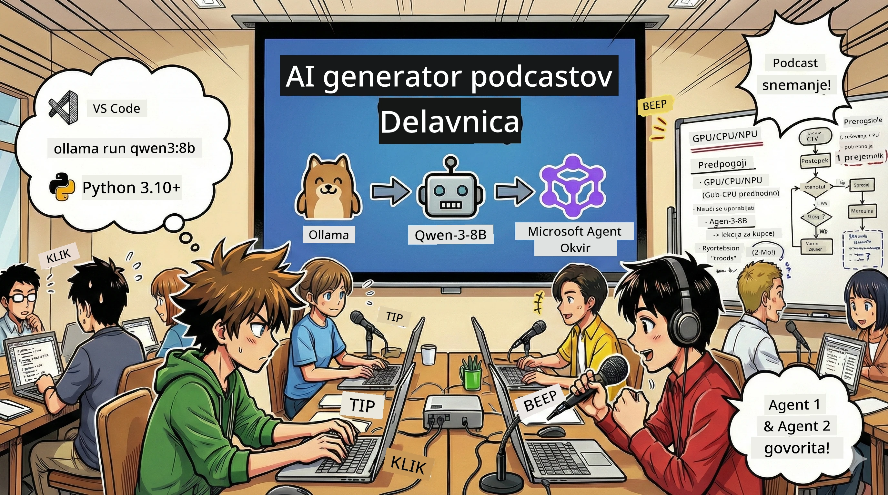
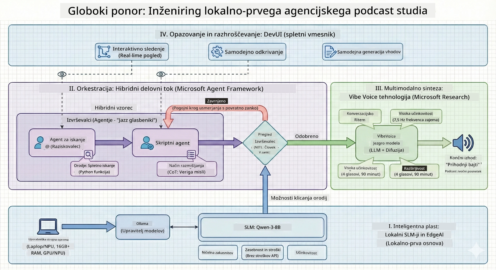

<!--
CO_OP_TRANSLATOR_METADATA:
{
  "original_hash": "f94e745264597bc5d8df967ead2eff97",
  "translation_date": "2026-01-05T10:55:24+00:00",
  "source_file": "WorkshopForAgentic/README.md",
  "language_code": "sl"
}
-->
# 🎙️ Delavnica AI Podcast Studia

> 🌏 [中文版 (Kitajska različica)](translation/zh-cn/README.md)



## Vaša misija

Dobrodošli v **The AI Podcast Studio**! Pripravljate se, da zaženete svoj tehnološki podcast z imenom "Future Bytes" — a z zvitkom: zgradili boste produkcijsko ekipo, ki jo poganja AI, da vam pomaga ustvariti podcast. Brez neskončnih ur raziskovanja, pisanja scenarijev in urejanja zvoka. Namesto tega boste s programiranjem postali producent podcasta z AI supermočmi.

## Zgodba

Predstavljajte si to: vi in vaši prijatelji želite začeti podcast o najbolj kul tehnoloških trendih, a so vsi zaposleni s šolo, delom ali življenjem nasploh. Kaj če bi lahko zgradili ekipo AI agentov, ki bi opravila težka dela? En agent raziskuje teme, drugi piše zanimive scenarije, tretji pa spremeni besedilo v naravno zveneče pogovore. Zveni kot znanstvena fantastika? Naredimo to resničnost.

## Kaj se boste naučili

Na koncu delavnice boste znali:
- 🤖 Namestiti svoj lasten lokalni AI model (brez stroškov API, brez odvisnosti od oblaka!)
- 🔧 Zgraditi specializirane AI agente, ki dejansko sodelujejo
- 🎬 Ustvariti celoten produkcijski proces podcasta od ideje do avdia

## Vaša pot: trije čini



Kot vsaka dobra zgodba ima tudi naša tri čine. Vsak gradi vaš AI podcast studio korak za korakom:

| Epizoda | Vaš cilj | Kaj se zgodi | Pridobljene veščine |
|---------|-----------|--------------|----------------|
| **1. čin** | [Spoznajte vaše AI asistente](md/01.BuildAIAgentWithSLM.md) | Spoznate, kako ustvariti AI agente, ki lahko klepetajo, brskajo po spletu in celo rešujejo težave. Predstavljajte si jih kot raziskovalne pripravnike, ki nikoli ne spijo. | 🎯 Zgradite svojega prvega agenta<br>🛠️ Opremljen z supermočmi (orodja!)<br>🧠 Naučite ga razmišljati<br>🌐 Povežite ga z internetom |
| **2. čin** | [Združite svojo produkcijsko ekipo](md/02.AIAgentOrchestrationAndWorkflows.md) | Zdaj postane zanimivo! Orkestrirali boste več AI agentov, da skupaj delajo kot prava produkcijska ekipa. Eden raziskuje, drugi piše, vi odobravate — ekipa dela sanje. | 🎭 Koordinacija več agentov<br>🔄 Ustvarjanje delovnih tokov odobritve<br>🖥️ Preizkus z vmesnikom DevUI<br>✋ Ohranjanje nadzora ljudi |
| **3. čin** | [Oživite svoj podcast](md/03.Multi-SpeakerPodcastGenerationWithVibeVoice.md) | Finale! Pretvorite svoje besedilne scenarije v pravo podcast zvočno posnetek z realistično glasu in naravnimi pogovori. Vaš podcast "Future Bytes" je pripravljen za objavo! | 🎤 Magija pretvorbe besedila v govor<br>👥 Več različnih glasov govorcev<br>⏱️ Dolg avdio vsebina<br>🚀 Popolna avtomatizacija |

Vsak čin odkrije nove zmožnosti. Preskočite naprej, če ste pogumni, a priporočamo, da sledite zgodbi!

## Zahteve glede okolja

Delavnica podpira različna strojna okolja:
- **CPU**: Primeren za testiranje in manjšo uporabo
- **GPU**: Priporočljivo za produkcijska okolja, znatno pospeši inferenco
- **NPU**: Podpira pospešitev z naslednjo generacijo nevronskih procesnih enot

## Kaj boste potrebovali

### Programska oprema ✅
- **Python 3.10+** (vaš programski jezik)
- **Ollama** (zaženete AI modele lokalno)
- **VS Code** (urejevalnik kode)
- **Python razširitev** (upanjujeni dodatek za VS Code)
- **Git** (za prenos kode)

### Strojna oprema 💻
- **Lahko to tečem?**: 8GB RAM, 10GB prostega prostora (deluje, vendar lahko počasneje)
- **Idealna konfiguracija**: 16GB+ RAM, dober GPU (gladko delovanje!)
- **Imate NPU?**: Še bolje! Pospešek naslednje generacije odklenjen 🚀

## Nastavite svoj studio 🎬

### 1. korak: Aktivirajte Python

Prepričajte se, da imate Python 3.10 ali novejši:

```bash
python --version
# Mora prikazati Python 3.10.x ali višjo različico
```

Nimate Pythona? Prenesite ga na [python.org](https://python.org) — brezplačno!

### 2. korak: Prenesite Ollama (vaš poganjalnik modelov AI)

Pojdite na [ollama.ai](https://ollama.ai) in prenesite Ollama za vaš operacijski sistem. Predstavljajte si ga kot motor, ki lokalno poganja vaše AI modele.

Preverite, če je pripravljen:

```bash
ollama --version
```

### 3. korak: Prenesite svoj AI možgan 🧠

Čas je za prenos modela Qwen-3-8B (kot če bi najeli prvega AI asistenta):

```bash
ollama pull qwen3:8b
```

*To lahko traja nekaj minut. Popoln čas za odmor ob kavi! ☕*

### 4. korak: Nastavite VS Code

Če ga še nimate, prenesite [Visual Studio Code](https://code.visualstudio.com/). Najboljši urejevalnik kode (poskusite, se boste zaljubili 😄).

### 5. korak: Namestite Python razširitev

V VS Code:
1. Pritisnite `Ctrl+Shift+X` (ali `Cmd+Shift+X` na Macu)
2. Poiščite "Python"
3. Namestite uradno Microsoft Python razširitev

### 6. korak: Ste pripravljeni! 🎉

Resno, že ste pripravljeni začeti. Ustvarimo nekaj AI čarovnije!

### 7. korak: Namestite Microsoft Agent Framework in povezane pakete 📦

Namestite vse potrebne odvisnosti za delavnico:

```bash
pip install -r ./Installations/requirements.txt -U
```

*To bo namestilo Microsoft Agent Framework in vse potrebne pakete. Pripravite si kavo — prvič lahko traja nekaj minut! ☕*

## Navodila za delavnico

Podrobna struktura projekta, konfiguracijski koraki in načini izvajanja bodo razloženi korak za korakom med delavnico.

## Reševanje težav (ko gre kaj narobe) 🔧

### "Uf, prenos modela traja večno!"
**Rešitev**: Uporabite VPN ali konfigurirajte Ollama z zrcalnim virom. Včasih internet pač ne sodeluje.

### "Računalnik mi umira! Nimam več spomina!"
**Rešitev**: Preklopite na manjši model ali prilagodite nastavitev `num_ctx`, da porabite manj pomnilnika. Kot da bi dali AI na dieto.

### "Lahko to pospešim z mojim GPUjem?"
**Rešitev**: Ollama samodejno zazna GPU! Prepričajte se samo, da so vaši GPU gonilniki posodobljeni. Brezplačen pospešek! 🏎️

## Dodatni viri (za radovedne) 📚

- [Ollama Dokumentacija](https://github.com/ollama/ollama) — Podrobnosti o lokalnih AI modelih
- [Microsoft Agent Framework](https://microsoft.github.io/autogen/) — Več o gradnji agentnih ekip
- [Informacije o modelu Qwen](https://qwenlm.github.io/) — Spoznajte možgane vašega AI asistenta

## Licenca

Licenca MIT — Gradite kul stvari, jih delite in naredite svet boljši! 🌍

## Želite prispevati?

Našli ste napako? Imate idejo? Sporočite preko Issue ali PR! Radi imamo skupnostno vzdušje. ✨

---

<!-- CO-OP TRANSLATOR DISCLAIMER START -->
**Izjava o omejitvi odgovornosti**:
Ta dokument je bil preveden z uporabo AI prevajalske storitve [Co-op Translator](https://github.com/Azure/co-op-translator). Čeprav si prizadevamo za natančnost, upoštevajte, da avtomatizirani prevodi lahko vsebujejo napake ali netočnosti. Izvirni dokument v njegovem izvirnem jeziku velja za avtoritativni vir. Za kritične informacije priporočamo strokovni človeški prevod. Za morebitne nesporazume ali napačne razlage, ki izhajajo iz uporabe tega prevoda, ne odgovarjamo.
<!-- CO-OP TRANSLATOR DISCLAIMER END -->