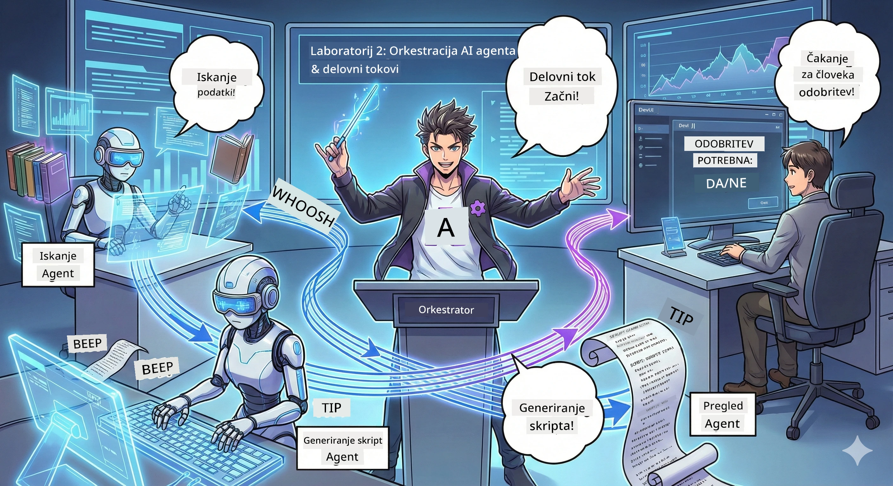

# 2. dejanje: Zberite svojo produkcijsko ekipo za podcast 🎬



## Zgodba se zapleta

Alex (vaš AI pomočnik iz 1. dejanja) je super, vendar en agent ne more voditi celotnega podcast studia. Potrebujete *ekipo*:
- 🔍 **Raziskovalni agent**: Preišče internet po svežih informacijah
- ✍️ **Agent za scenarij**: Pretvori raziskave v zanimiv dialog
- 👤 **Vi (Urejevalec)**: Potrjujete scenarije ali jih vračate nazaj na popravke

Dobrodošli v **orkestracijo AI agentov** — kjer postanete režiser lastne AI ekipe. Pomislite na Maščevalce, ampak za produkcijo podcastov.

## Kaj je orkestracija agentov? (poenostavljena različica)

Predstavljajte si, da vodite restavracijo. Ne delate vsega sami, kajne? Imate:
- 🍳 kuharja, ki kuha
- 👨‍🍳 pomočnika kuharja, ki pripravlja
- 👩‍🍳 natakarja, ki dostavlja

Orkestracija agentov je ista zamisel, a z AI. Vsak agent ima svojo specialnost, vi pa jih usklajujete, da dosežejo večje cilje. Noben agent ni preobremenjen, delo pa poteka hitreje.

### Analogi band 🎸

Vaši AI agenti so kot glasbena skupina:
- **Glavni pevec**: glavni agent, ki skrbi za stike s strankami
- **Baterist**: drži ritem, upravlja ozadje  
- **Basist**: podpira vse, priskrbi podatke
- **Vi (manager skupine)**: usklajujete vse!

Brez usklajevanja? Sam hrup. Z orkestracijo? Čudovita glasba.

### Zakaj je to pomembno

Poskus enega AI agenta, da naredi vse = izgorelost. Specializirani agenti, ki sodelujejo = odkrita učinkovitost! 🚀

**Resnična situacija**: Se spomnite, kako ste poskušali sami raziskovati, pisati IN urejati podcast? Ja, to je grozno. Z orkestracijo vsak agent naredi, kar zna najbolje. Vi pa sprejmete končne odločitve.

**Primer iz resničnega sveta**: Boti za podporo strankam, ki vedo, kdaj rešiti vprašanja za obračun, kdaj tehnične težave in kdaj poklicati človeka. To je orkestracija!

## Agent vs. potek dela: kakšna je razlika?

Predstavljajte si tako:

### 🤖 AI Agent = jazz glasbenik
- **Sprejema odločitve sproti** glede na to, kar sliši
- **Improvizira** rešitve s svojimi orodji
- **Razmišlja** z možgani LLM
- **Prilagaja se** na karkoli mu daste

### 🎵 Potek dela = orkester, ki igra klasično glasbo  
- **Sledi notam** (vnaprej določenim korakom)
- **Predvidljivo** izvajanje
- **Usklajuje** več agentov, ljudi, sistemov
- **Strukturirano** kot recept

**Magija**: poteki dela *orkestrirajo* agente! Zgradite potek dela, ki agentom pove, kdaj naj igrajo svojo vlogo. Najboljše iz obeh svetov. 🎭

## Trije načini za usklajevanje vaše AI ekipe

### 1. 🎯 Centralizirano (Vi ste šef)

En glavni agent vodi vse odločitve. Predstavljajte si, da upravljate ekipo — vi odločate kdo kaj in kdaj dela.

**Prednosti**:
- ✅ Jasno vodenje (brez zmede)
- ✅ Dosledne odločitve
- ✅ Enostavno odkrivanje napak

**Uporaba**:
- Usmerjanje službe za podporo strankam ("Je to obračun ali tehnična podpora?")
- Poteki odobritve vsebin ("Ali je ta scenarij sprejemljiv?")
- Produkcija podcasta (prav to, kar gradimo!)

### 2. 🤝 Decentralizirano (Agenti se sami organizirajo)

Agenti komunicirajo neposredno med seboj in skupaj rešujejo stvari. Kot skupinski klepet, kjer se vsi usklajujejo.

**Prednosti**:
- ✅ Enostavno razširjanje (dodate lahko več agentov kadarkoli)
- ✅ Brez enotne točke okvare
- ✅ Agenti sodelujejo naravno

**Uporaba**:
- Raziskovalne skupine (vsak agent raziskuje različne vire)
- Brainstorming seje
- Razpršeno reševanje problemov

### 3. 🔀 Hibridno (Najboljše iz obeh svetov)

Določite splošno smer, a agenti imajo svobodo pri samozorganizaciji nalog. Kot direktor, ki zaupa svoji ekipi.

**Popolno za**: Kompleksne projekte, ki potrebujejo tako nadzor kot fleksibilnost.

## Microsoft Agent Framework: Vaša orodja za orkestracijo 🧰

Čas za gradnjo! To boste uporabili:

### Gradniki

#### 1. 🧱 Izvajalci (vaši delavci)
- **Kaj so**: Posamezne enote za obdelavo — lahko agenti ali prilagojena logika
- **Kaj delajo**: Sprejmejo vhod, opravijo delo, proizvedejo izhod
- **Predstavljajte si jih kot**: Postaje v produkcijski liniji

#### 2. ➡️ Povezave (priključki)
- **Kaj so**: Poti med izvajalci
- **Kaj delajo**: Nadzorujejo pretok sporočil ("Po A pojdi na B")
- **Predstavljajte si jih kot**: Puščice na diagramu poteka

#### 3. 🗺️ Poteki dela (glavni načrt)
- **Kaj so**: Celoten graf izvajalcev + povezav
- **Kaj delajo**: Določa celoten postopek od začetka do konca
- **Predstavljajte si jih kot**: Načrt proizvodne linije

### Kul funkcije, ki vam bodo všeč

**🛡️ Tipna varnost**: Sporočila med agenti so preverjena glede tipa. Brez neprijetnih presenečenj "Ups, napačen tip podatka".

**🔀 Fleksibilno usmerjanje**: 
- Pogoji če-potem ("Če je potrjeno, objavi; drugače prepiši")
- Paralelna obdelava (več agentov dela hkrati)
- Dinamične poti (potek dela se prilagaja glede na rezultate)

**🔌 Zunanja integracija**:
- Povezava z API-ji
- Dodajanje kontrolnih točk s človekom v zanki (vi potrjujete pred objavo)
- Gradnja potekov zahteve/odgovora

**💾 Vzporedne točke**: Shrani napredek! Če kaj crkne, začni tam, kjer si končal.

**🤝 Koordinacija več agentov**:
- Zaženite agente zaporedno (A → B → C)
- Zaženite jih vzporedno (A + B + C hkrati)
- Predajanje med agenti
- Sodelovalna obdelava

## Najboljše prakse (pro nasveti) 🎯

### 1. Naj bo modularno
Vsak agent naj dela ENO stvar res dobro. Ne naredite "super agenta", ki dela vse — obžalovali boste pri odpravljanju napak.

### 2. Načrtujte za napake
Agenti počnejo napake. Omrežja odpovedo. Vključite ravnanje z napakami in rezervne načrte. Vaš prihodnji jaz vam bo hvaležen.

### 3. Spremljajte vse
Spremljajte, kaj agenti počnejo. Uporabite DevUI (to bomo pokrili!) za ogled potekov dela v akciji.

### 4. Optimizirajte velikost sporočil
Ne pošiljajte velikih datotek med agente. Sporočila naj bodo lahka in hitra.

### 5. Izberite pravi vzorec
Potrebujete nadzor? Izberite centralizirano. Potrebujete širitev? Decentralizirano. Ne morete se odločiti? Hibridno!

## DevUI: vaš razhroščevalnik potekov dela 🔍

### Kaj je DevUI?

DevUI je kot igralnica za testiranje vaših agentov in potekov dela. To je spletni vmesnik, kjer lahko:
- 👀 spremljate potek dela v akciji
- 💬 klepetate z agenti neposredno
- 🔍 razhroščujete, ko kaj ne gre
- 📊 vidite sledove in metrike učinkovitosti

> **Pomembno**: DevUI je samo za razvoj! Ne uporabljajte v produkciji. Predstavljajte si ga kot lokalno testno okolje.

### Zakaj je super

- **🖥️ Interaktivni spletni UI**: Klikajte, tipkajte, testirajte — brez ukazne vrstice
- **📁 Pripravljeno za povleci-in-spusti**: Naložite datoteke, testirajte z različnimi vhodi
- **📂 Samodejna zaznava**: Usmerite ga na mapo, sam najde vse vaše agente
- **📋 Brez-nastavitve način**: Registrirajte agente v kodi, mapa ni potrebna
- **🔌 Združljiv z OpenAI**: Deluje z OpenAI SDK (združljivost FTW!)
- **👁️ Sledenje vgrajeno**: Vidite točno, kaj agenti počnejo

### Kako deluje vhod

DevUI je pameten glede vhodov:

- **Testirate agente?** Dobite polja za besedilo in gumbe za nalaganje datotek
- **Testirate poteke dela?** UI samodejno ustvari vhodna polja glede na pričakovanja vašega poteka dela

Je kot čarovnija, a je samo dobra koda. ✨

## Vaše naloge: zgradite podcast studio 🎬

### Naloga 1: Ustvarite enega agenta z DevUI

📂 [01.AgentDevUI](../../../../WorkshopForAgentic/code/02.Workflow/01.AgentDevUI)

**Izziv**: Preden sestavimo celotno ekipo, testirajmo DevUI z enim agentom: specialistom za spletno iskanje.

**Kaj gradite**:  
Agenta za raziskave, ki lahko išče po internetu teme za podcast. Testirali ga boste preko spletnega vmesnika DevUI na `http://localhost:8090`.

**Spretnosti, ki se jih naučite**:
- 🚀 Zagon agentov v DevUI
- 🔍 Testiranje odzivov agenta v realnem času
- 🛠️ Gradnja lastnih orodij (spletno iskanje)
- 📊 Omogočanje sledenja za razhroščevanje
- 🖥️ Uporaba interaktivnega spletnega UI-ja

**Koda**:
- `agent.py`: vaš SearchAgent s supermočmi spletnega iskanja
- Uporablja OllamaChatClient za povezavo z Qwen
- Vpeljana funkcija orodja `web_search()`
- Zaženete z `serve()` — DevUI se odpre samodejno

**Pogoj zmage**: Vprašajte agenta "Kaj je trenutno v trendu v AI?" in opazujte spletno iskanje! 🎉

### Naloga 2: Zgradite večagentni potek dela

📂 [02.WorkflowDevUI](../../../../WorkshopForAgentic/code/02.Workflow/02.WorkflowDevUI)

**Izziv**: Sedaj se zabava začne! Zgradite popoln potek produkcije podcasta z:
1. 🔍 **Agent iskanja** → raziskuje vašo temo
2. ✍️ **Agent za scenarij** → napiše dialog med dvema gostiteljema (v kitajščini!)
3. 👤 **Izvajalec pregleda** → vpraša VAS za potrditev ali zavrnitev
4. 🔄 **Povratna zanka** → če je zavrnjeno, prepiše na podlagi vaših povratnih informacij

**Spretnosti, ki se jih naučite**:
- 🧱 Ustvarjanje specializiranih agentov za različna opravila
- 🔗 Povezovanje agentov z WorkflowBuilder
- 🔀 Izvajanje zank odobritve (človek v zanki!)
- 🚦 Pogoji usmerjanja (če je odobreno v primerjavi z zavrnitvijo)
- 🔧 Gradnja izvajalcev za poslovno logiko po meri

**Potek dela**:
```
SearchAgent → ScriptAgent → ReviewExecutor
                             ↑          ↓ (if rejected)
                             ←─────────
```

**Koda**:
- `search_agent/agent.py`: vaš specialist za raziskave
- `generate_script_agent/agent.py`: vaš pisec scenarijev (piše v kitajščini!)
- `workflow/workflow.py`: orkestracijska magija tukaj
- `main.py`: vse zažene v DevUI

**Pogoj zmage**: Dajte temo, preglejte scenarij, enkrat zavrnite za testiranje zanke, nato potrdite! 🎉

### Naloga 3: Zgradite konzolno aplikacijo

📂 [03.Application](../../../../WorkshopForAgentic/code/02.Workflow/03.Application)

**Izziv**: Vzemite svoj potek dela iz DevUI in ga spremenite v elegantno terminalsko aplikacijo z barvnim izpisom, vrtljivimi indikatorji nalaganja in shranjevanjem datotek. To je pripravljeno za produkcijo!

**Spretnosti, ki se jih naučite**:
- ⚡ Zagon potekov dela programsko (brez DevUI)
- 📡 Dogodkovno usmerjena arhitektura s pretakanjem
- 🎨 Ustvarjanje lepih terminalskih UI-jev (barve, vrtiljaki, napredne vrstice)
- 💾 Shranjevanje končnih scenarijev v datoteke
- 🔄 Upravljanje asinhronih potekov z Python asyncio

**Kaj aplikacija počne**:
1. Vprašajte vas za temo podcasta
2. Prikaže napredek v realnem času ("Agent iskanja dela...")
3. Prikaže generiran scenarij z barvami
4. Vpraša za potrditev
5. Shrani potrjen scenarij v `podcast.txt`

**Koda**:
- `podcast_app.py`: vaša glavna aplikacija z upravljanjem dogodkov
- `workflow.py`: ponovno uporabi potek dela iz Naloge 2
- Obvladuje dogodke: `AgentRunUpdateEvent`, `RequestInfoEvent`, `WorkflowOutputEvent`
- Uporablja ANSI barve za stil terminala

**Pogoj zmage**: Zaženite aplikacijo, ustvarite podcast scenarij in si oglejte, kako je shranjen! Zgradili ste pravo orodje. 🚀

## Kaj ste osvojili 🏆

Po 2. dejanju znate:

- ✅ Orkestrirati več AI agentov kot šef
- ✅ Graditi poteke dela z zaporedno in pogojno logiko
- ✅ Dodajati kontrolne točke odobritve s človekom
- ✅ Uporabljati DevUI za testiranje in odpravljanje napak potekov dela
- ✅ Ustvarjati produkcijsko pripravljene konzolne aplikacije
- ✅ Pravilno obvladovati napake v kompleksnih sistemih
- ✅ Izbrati pravi vzorec orkestracije za kateri koli projekt

## Ko se stvari pokvarijo 🔧

### "Moj potek dela je preveč zapleten!"
**Popravek**: Razdelite ga na manjše pod-poteke. Vsak potek dela naj dela ENO stvar dobro. Po potrebi jih povežite skupaj.

### "Ne morem slediti, kaj se dogaja!"
**Popravek**: Uporabite shranjevanje stanja poteka dela. Omogočite sledenje v DevUI, da vidite vsak korak.

### "Napaka enega agenta zruši vse!"
**Popravek**: Dodajte meje za napake. Vsak agent naj obvlada svoje napake in ima rezervne načine delovanja.

### "To je tako počasi"
**Popravek**: Lahko kateri agenti delajo vzporedno? Zaporedni poteki so enostavni, a počasni. Poiščite priložnosti za paralelizacijo!

## Koristni viri 🔗

- [Dokumentacija Workflow](https://learn.microsoft.com/en-us/agent-framework/user-guide/workflows/overview) — uradne Microsoftove smernice
- [Vzorec orkestracije](https://www.ibm.com/think/topics/ai-agent-orchestration) — IBM-ov pogled na to
- [Agent Framework GitHub](https://github.com/microsoft/agent-framework) — oglejte si izvorno kodo
- [Primeri kode](https://github.com/microsoft/agent-framework/tree/main/python/samples) — Tukaj si sposodi vzorce

---

**Pripravljeni na finale?** Imate svoj skript. Zdaj pa ga spremenimo v dejansko avdio! → [3. čin: Oživite svoj podcast](03.Multi-SpeakerPodcastGenerationWithVibeVoice.md) 🎤

---

**Blokirani? Zmedeni? Navdušeni?** Delite v klepetu delavnice! Vsi se skupaj učimo. 🚀

---

<!-- CO-OP TRANSLATOR DISCLAIMER START -->
**Omejitev odgovornosti**:
Ta dokument je bil preveden z uporabo AI prevajalske storitve [Co-op Translator](https://github.com/Azure/co-op-translator). Čeprav si prizadevamo za natančnost, vas opozarjamo, da avtomatizirani prevodi lahko vsebujejo napake ali netočnosti. Izvirni dokument v izvorni jeziku velja za avtoritativni vir. Za pomembne informacije priporočamo strokovni človeški prevod. Ne odgovarjamo za morebitna nesporazume ali napačne interpretacije, ki izhajajo iz uporabe tega prevoda.
<!-- CO-OP TRANSLATOR DISCLAIMER END -->