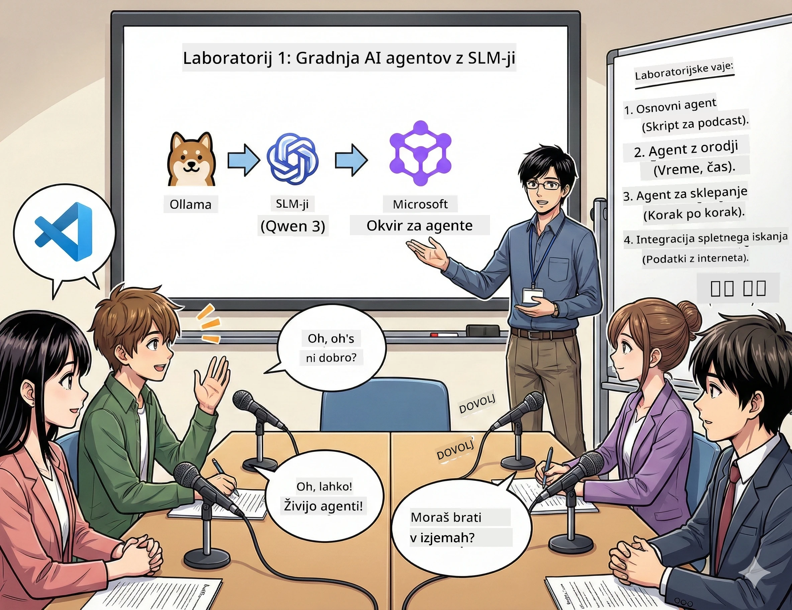

# Prvi čin: Spoznajte svojega AI raziskovalnega pomočnika 🤖

## Izziv

Začenjate z »Prihodnjimi bajti«, vašim novim tehnološkim podcastom. Prva epizoda je o najnovejših AI prebojih, a imate le 24 ur za:
1. raziskovanje teme
2. iskanje zanesljivih virov
3. pisanje privlačnega scenarija
4. da zveni naravno

**Preobrat v zgodbi**: Ni vam treba vsega narediti sami. Pravkar boste ustvarili svojega prvega AI pomočnika, ki vam bo pomagal opraviti vse to. Poimenujmo ga Alex — vaš nikoli utrujeni raziskovalni partner, ki nikoli ne potrebuje spanja.

## Zakaj izbrati majhne jezikovne modele? (Namig: So odlični)

Majhne jezikovne modele (SLM) si predstavljajte kot osebnega AI, ki teče na *vašem* računalniku. Brez oblaka, brez mesečnih stroškov, brez sumljivega deljenja podatkov.

**Zakaj so SLM tako 🔥:**
- **🏠 Teknejo na tvoji napravi**: prenosnik, namizni računalnik, celo zmogljiv Raspberry Pi
- **💸 Nobenih stalnih stroškov**: brez stroškov API, ki ti jemljejo žepnino
- **🔒 Pristojnost do zasebnosti**: tvoji podatki nikoli ne zapustijo tvoje naprave
- **⚡ Bliskovito hitri**: brez omrežnih zakasnitev, takojšen odziv
- **🪦 Lahki**: 1–10 milijard parametrov v primerjavi z velikimi modeli s 100+ milijardami

**Priljubljeni SLM**: Qwen 3, Phi-4, Gemma 3 (v tej delavnici uporabljamo Qwen)

## Tvoja orodjarna

### Ollama: tvoj upravljalnik AI modelov

[Ollama](https://ollama.com/) je kot Steam za AI modele. Z enostavnimi ukazi prenesi, zaženi in upravljaj modele.

**Zakaj je kul:**
- en ukaz za prenos in zagon kateregakoli modela
- deluje na Mac, Windows, Linux
- samodejno uporablja GPU, če ga imaš
- zelo varčen z RAM-om

### Microsoft Agent Framework: tam, kjer se zgodi čarovnija

[Microsoft Agent Framework](https://github.com/microsoft/agent-framework) je tvoj igrišče za ustvarjanje AI agentov, ki lahko:

- 💬 klepetajo in si zapomnijo, o čem ste govorili
- 🛠️ uporabljajo prilagojena orodja (npr. iskanje po spletu ali preverjanje vremena)
- 🧠 korak za korakom razmišljajo o zapletenih težavah
- 🤝 sodelujejo kot ekipa z drugimi agenti
- 🔌 povezujejo se z različnimi AI ponudniki (OpenAI, Ollama, Azure)

**Gradniki:**
- **Agenti**: AI pomočniki z določenimi opravilnimi
- **Orodja**: posebne veščine, ki jim jih daš
- **Pomnilnik**: tako ne pozabijo najinega pogovora
- **Razmišljanje**: nauči jih razmišljati, ne samo odgovarjati

## Tvoj trening montiran: 4 naloge

### Naloga 1: Ustvari svojega prvega agenta

📓 [Odpri zvezek](../../code/01.BasicAgent/00.BasicAgent-agent.ipynb)

**Naloga**: zgradi Alexa, AI za pisanje scenarijev tvojega podcasta. Alex mora ustvariti dialog med dvema voditeljema o tehnoloških temah.

**Naučil se boš:**
- kako »zbuditi« AI agenta (lažje kot vstati ob ponedeljkih)
- kako mu dati osebnost in navodila
- kako ustvariti realistično scenarij podcasta
- kako razumeti njegove odgovore

**Cilj**: Alex pripravi scenarij za poskusno epizodo »Prihodnjih bajtov« o AI! 🎯

### Naloga 2: Daj Alexu nadnaravne moči (orodja!)

📓 [Odpri zvezek](../../code/01.BasicAgent/01.BasicAgent-tools.ipynb)

**Naloga**: Alex je pameten, a ne ve, kakšno je vreme ali koliko je ura. Dajmo mu orodja, da to reši!

**Naučil se boš:**
- ustvarjanje prilagojenih Python funkcij kot »orodij«
- kako naj Alex sam odloči *kdaj* uporabiti katero orodje
- opazovati, kako sam rešuje probleme
- kombinirati več orodij za kompleksna opravila

**Cilj**: vprašaj »Kakšno je vreme v Tokiu?« in Alex bo sam našel odgovor! ☁️

### Naloga 3: Nauči Alexa razmišljati

📓 [Odpri zvezek](../../code/01.BasicAgent/02.BasicAgent-reasoning.ipynb)

**Naloga**: pokaži Alexov postopek dela. Pri reševanju problemov želiš videti *kako* razmišlja, ne samo odgovor.

**Naučil se boš:**
- aktivirati »način razmišljanja« (kot v matematici pokaži svoje poteze)
- videti korake Alexove miselne verige
- razumeti sled miselnih povezav
- odpraviti težave, ko je Alex zmeden

**Cilj**: postavi zahtevno matematično vprašanje in glej, kako Alex razmišlja! 🧠

### Naloga 4: Poveži Alexa z internetom

📓 [Odpri zvezek](../../code/01.BasicAgent/03.BasicAgent-websearch.ipynb)

**Naloga**: Alexova baza znanja ni posodobljena. Povežimo ga z internetom za sprotne informacije!

**Naučil se boš:**
- graditi prilagojena orodja za spletno iskanje
- integrirati zunanje API-je
- upravljati spletne napake lepo in zanesljivo
- pridobiti informacije, ki presegajo Alexova usposabljanja

**Cilj**: vprašaj za današnje tehnološke novice in prejmi najnovejše rezultate! 📰

## Pred začetkom 🚀

**Zahtevana oprema**:
- nameščen Python 3.10+
- Ollama teče (preveri z `ollama --version`)
- VS Code s Python razširitvijo
- vsaj 8 GB RAM-a (16 GB za tekočo izkušnjo)

## Zaporedje nalog

Dovrši zvezke po vrsti za celovito izkušnjo:

1. [00.BasicAgent-agent.ipynb](../../code/01.BasicAgent/00.BasicAgent-agent.ipynb) — spoznaj Alexa (tvoj prvi agent)
2. [01.BasicAgent-tools.ipynb](../../code/01.BasicAgent/01.BasicAgent-tools.ipynb) — čas za nadgradnjo!
3. [02.BasicAgent-reasoning.ipynb](../../code/01.BasicAgent/02.BasicAgent-reasoning.ipynb) — nauči Alexa razmišljati
4. [03.BasicAgent-websearch.ipynb](../../code/01.BasicAgent/03.BasicAgent-websearch.ipynb) — odkleni dostop do interneta!

## Kaj boš osvojil

Po prvem činu boš znal:

- ✅ poganjati AI modele na lastni strojni opremi (brez oblaka!)
- ✅ graditi agente s prilagojeno osebnostjo in veščinami
- ✅ opremiti agente z orodji za reševanje resničnih problemov
- ✅ omogočiti agentom prikaz njihovih miselnih procesov
- ✅ povezati agente z zunanjimi viri podatkov
- ✅ odpravljati napake, ko stvari gredo narobe

## Ko stvari gredo narobe (in kako jih popraviti) 🔧

### »Alex se ne naloži! Ni dovolj pomnilnika!«
**Rešitev**: tvoj računalnik ne zmore. Poskusi zapreti druge aplikacije ali preklopiti na manjši model. 8 GB RAM je minimum.

### »Alex je prepočasen«
**Rešitev**: v nastavitvah Ollama omogoči pospešek z GPU. Ali pa zmanjša velikost kontekstnega okna. Vklopi turbo način! 🏎️

### »Orodja ne delujejo!«
**Rešitev**: natančno preveri podpis funkcij. Alex potrebuje pravilne oznake tipov, da razume, kako orodja delujejo. Predstavljaj si to kot jasna navodila.

## Uporabne povezave 🔗

- [Agent Framework dokumentacija](https://github.com/microsoft/agent-framework) — uradni vodiči in primeri
- [Ollama knjižnica modelov](https://ollama.com/library) — brskaj med vsemi razpoložljivimi modeli
- [Qwen model](https://ollama.com/library/qwen3) — spoznaj možgane svojega AI pomočnika
- [Primeri kode](https://github.com/microsoft/agent-framework/tree/main/python/samples) — ukradi nekaj idej tukaj

## Naslednji korak: drugi čin 🎬

Imate agenta. Kaj pa *ekipa* agentov, ki sodelujejo? V drugem činu boste zgradili popolno ekipo za produkcijo podcasta:
- **Raziskovalci agenti**: poiščejo najboljše vire
- **Scenaristi agenti**: ustvarijo popoln scenarij
- **Uredniki (ti!)**: odobriš ali zahtevaš spremembe

Pripravimo nekaj AI čarovnije! → [Drugi čin: Organizacija in delovni tok tvoje ekipe](02.AIAgentOrchestrationAndWorkflows.md)

---

**Zastali?** Postavit vprašanja med delavnico. Skupaj bomo napredovali! 🙌

---

<!-- CO-OP TRANSLATOR DISCLAIMER START -->
**Opozorilo:**
Ta dokument je bil preveden z uporabo storitve za prevajanje z umetno inteligenco [Co-op Translator](https://github.com/Azure/co-op-translator). Čeprav si prizadevamo za natančnost, upoštevajte, da lahko avtomatizirani prevodi vsebujejo napake ali netočnosti. Izvirni dokument v izvorni jezik velja za avtoritativni vir. Za pomembne informacije priporočamo strokovni človeški prevod. Ne odgovarjamo za morebitne nesporazume ali napačne interpretacije, ki izhajajo iz uporabe tega prevoda.
<!-- CO-OP TRANSLATOR DISCLAIMER END -->