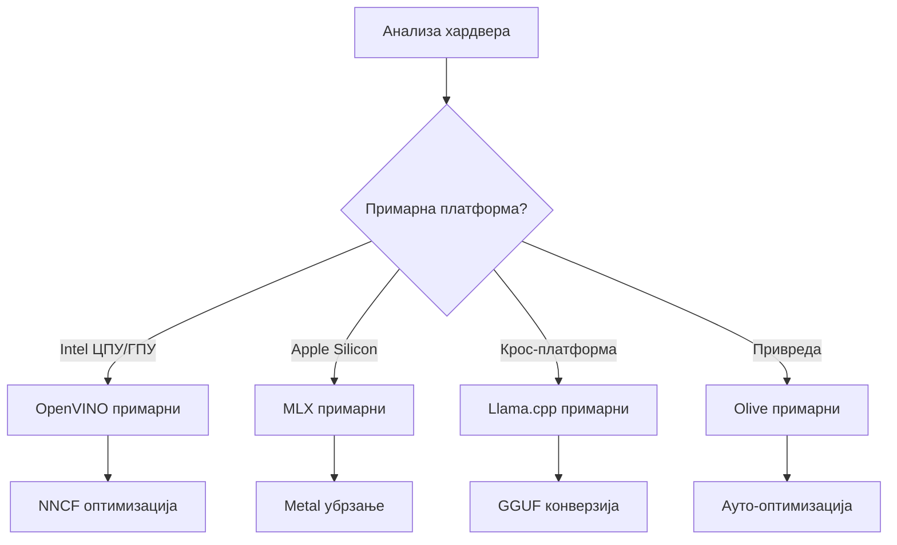
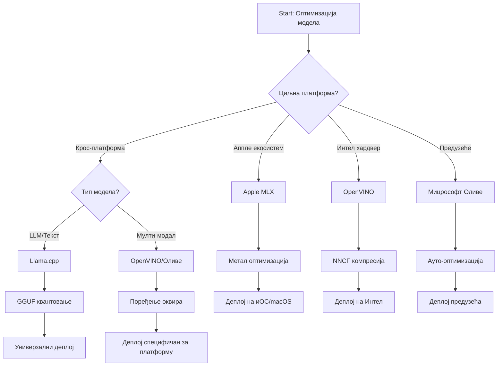
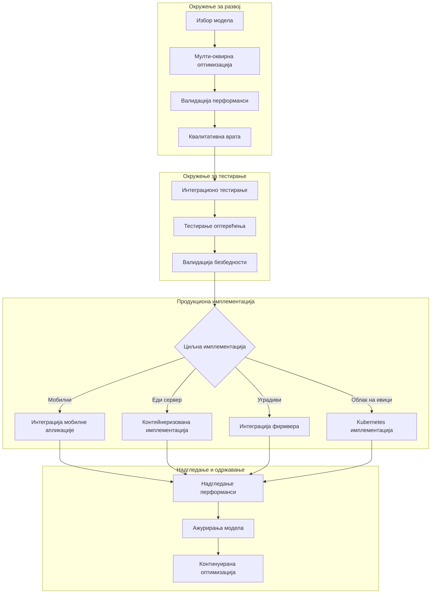

# Одељак 6: Синтеза радног тока за развој Edge AI

## Садржај
1. [Увод](#увод)
2. [Циљеви учења](#циљеви-учења)
3. [Преглед унификованог радног тока](#преглед-унификованог-радног-тока)
4. [Матрица избора оквира](#матрица-избора-оквира)
5. [Синтеза најбољих пракси](#синтеза-најбољих-пракси)
6. [Водич за стратегију распореда](#водич-за-стратегију-распореда)
7. [Радни ток оптимизације перформанси](#радни-ток-оптимизације-перформанси)
8. [Контролна листа спремности за производњу](#контролна-листа-спремности-за-производњу)
9. [Решавање проблема и праћење](#решавање-проблема-и-праћење)
10. [Заштита ваше Edge AI цевоводе за будућност](#заштита-ваше-edge-ai-цевоводе-за-будућност)

## Увод

Развој Edge AI захтева напредно разумевање више оквира за оптимизацију, стратегија распореда и хардверских разматрања. Ова свеобухватна синтеза окупља знање из Llama.cpp, Microsoft Olive, OpenVINO и Apple MLX да би створила унификовани радни ток који максимизује ефикасност, одржава квалитет и осигура успешан распоред у производњу.

Кроз овај курс истраживали смо појединачне оквире за оптимизацију, сваки са својим јединственим снагама и специјализованим случајевима употребе. Међутим, пројекти Edge AI у стварном свету често захтевају комбинацију техника из више оквира или доношење стратешких одлука о томе који приступ ће пружити најбоље резултате у складу са специфичним ограничењима и захтевима.

Овај одељак синтетизује колективну мудрост свих оквира у применљиве радне токове, одлуке и најбоље праксе које вам омогућавају да ефикасно и ефективно изградите Edge AI решења спремна за производњу. Без обзира да ли оптимизујете за мобилне уређаје, уграђене системе или edge сервере, овај водич пружа стратешки оквир за доношење информисаних одлука током целог животног циклуса развоја.

## Циљеви учења

На крају овог одељка, моћи ћете да:

### Стратешко доношење одлука
- **Процените и изаберите** оптималан оквир за оптимизацију на основу захтева пројекта, хардверских ограничења и сценарија распореда
- **Дизајнирајте свеобухватне радне токове** који интегришу више техника оптимизације за максималну ефикасност
- **Процените компромисе** између тачности модела, брзине инференце, употребе меморије и сложености распореда кроз различите оквире

### Интеграција радног тока
- **Имплементирајте унификоване цевоводе развоја** који користе снаге више оквира за оптимизацију
- **Креирајте репродуцибилне радне токове** за доследну оптимизацију и распоред модела у различитим окружењима
- **Успоставите контроле квалитета** и процесе валидације како бисте осигурали да оптимизовани модели испуњавају захтеве за производњу

### Оптимизација перформанси
- **Примените систематске стратегије оптимизације** користећи квантовање, прунинг и хардверски специфичне технике акцелерације
- **Пратите и мерите** перформансе модела на различитим нивоима оптимизације и мишљеним платформама распореда
- **Оптимизујте за специфичне хардвер платформе** укључујући CPU, GPU, NPU и специјализоване edge акцелераторе

### Распоред у производњу
- **Дизајнирајте скалабилне архитектуре распореда** које прихватају више формата модела и инференце мотора
- **Имплементирајте праћење и посматрачност** за Edge AI апликације у производним окружењима
- **Успоставите радне токове одржавања** за ажурирања модела, праћење перформанси и оптимизацију система

### Изврсност на више платформи
- **Распоредите оптимизоване моделе** на различитим хардверским платформама уз одржавање доследних перформанси
- **Обрадите специфичне оптимизације платформи** за Windows, macOS, Linux, мобилне и уграђене системе
- **Креирајте апстракционе слојеве** који омогућавају беспрекорни распоред у различитим edge окружењима

## Преглед унификованог радног тока

### Фаза 1: Анализа захтева и избор оквира

Основа успешног распореда Edge AI почиње темљном анализом захтева која обавештава избор оквира и стратегију оптимизације.

#### 1.1 Процена хардвера


**Кључна разматрања:**
- **Архитектура CPU**: x86, ARM, могућности Apple Silicon
- **Доступност акцелератора**: GPU, NPU, VPU, специјализовани AI чипови
- **Ограничења меморије**: Ограничења RAM-а, капацитет складиштења
- **Буџет снаге**: Трајање батерије, термална ограничења
- **Повезивост**: Захтеви за рад ван мреже, ограничења пропусног опсега

#### 1.2 Матрица захтева апликације

| Захтев | Llama.cpp | Microsoft Olive | OpenVINO | Apple MLX |
|-------------|-----------|-----------------|----------|-----------|
| Крос-платформа | ✅ Изванредан | ⚡ Добар | ⚡ Добар | ❌ Само Apple |
| Интеграција у предузеће | ⚡ Основни | ✅ Изванредан | ✅ Изванредан | ⚡ Ограничен |
| Мобилни распоред | ✅ Изванредан | ⚡ Добар | ⚡ Добар | ✅ iOS Изванредан |
| Инференца у реалном времену | ✅ Изванредан | ✅ Изванредан | ✅ Изванредан | ✅ Изванредан |
| Разноликост модела | ✅ Фокус на LLM | ✅ Сви модели | ✅ Сви модели | ✅ Фокус на LLM |
| Лакшина употребе | ✅ Једноставан | ✅ Аутоматизован | ⚡ Умерен | ✅ Једноставан |

### Фаза 2: Припрема и оптимизација модела

#### 2.1 Универзални цевовод за процену модела

```python
# Универзални оквир за процену модела
class EdgeAIModelAssessment:
    def __init__(self, model_path, target_hardware):
        self.model_path = model_path
        self.target_hardware = target_hardware
        self.optimization_frameworks = []
        
    def assess_model_characteristics(self):
        """Analyze model size, architecture, and complexity"""
        return {
            'model_size': self.get_model_size(),
            'parameter_count': self.get_parameter_count(),
            'architecture_type': self.detect_architecture(),
            'quantization_compatibility': self.check_quantization_support()
        }
    
    def recommend_optimization_strategy(self):
        """Recommend optimal frameworks and techniques"""
        characteristics = self.assess_model_characteristics()
        
        if self.target_hardware.startswith('apple'):
            return self.mlx_optimization_strategy(characteristics)
        elif self.target_hardware.startswith('intel'):
            return self.openvino_optimization_strategy(characteristics)
        elif characteristics['model_size'] > 7_000_000_000:  # Више од 7 милијарди параметара
            return self.enterprise_optimization_strategy(characteristics)
        else:
            return self.lightweight_optimization_strategy(characteristics)
```

#### 2.2 Цевовод за оптимизацију више оквира

**Секвенцијални приступ оптимизацији:**
1. **Почетна конверзија**: Конвертујте у интермедијарни формат (ONNX кад је могуће)
2. **Оптимизација специфична за оквир**: Примените специјализоване технике
3. **Крос-валидација**: Верификујте перформансе на циљним платформама
4. **Коначна паковања**: Припрема за распоред

```bash
# Скрипта за оптимизацију више оквира
#!/bin/bash

MODEL_NAME="phi-3-mini"
BASE_MODEL="microsoft/Phi-3-mini-4k-instruct"

# Фаза 1: ONNX конверзија (универзална)
python convert_to_onnx.py --model $BASE_MODEL --output models/onnx/

# Фаза 2: Оптимизација специфична за платформу
if [[ "$TARGET_PLATFORM" == "intel" ]]; then
    # Оптимизација за OpenVINO
    python optimize_openvino.py --input models/onnx/ --output models/openvino/
elif [[ "$TARGET_PLATFORM" == "apple" ]]; then
    # MLX оптимизација
    python optimize_mlx.py --input $BASE_MODEL --output models/mlx/
elif [[ "$TARGET_PLATFORM" == "cross" ]]; then
    # Оптимизација за Llama.cpp
    python convert_to_gguf.py --input models/onnx/ --output models/gguf/
fi

# Фаза 3: Валидација
python validate_optimization.py --original $BASE_MODEL --optimized models/$TARGET_PLATFORM/
```

### Фаза 3: Валидација перформанси и мерење

#### 3.1 Свеобухватни оквир за мерење

```python
class EdgeAIBenchmark:
    def __init__(self, optimized_models):
        self.models = optimized_models
        self.metrics = {
            'inference_time': [],
            'memory_usage': [],
            'accuracy_score': [],
            'throughput': [],
            'energy_consumption': []
        }
    
    def run_comprehensive_benchmark(self):
        """Execute standardized benchmarks across all optimized models"""
        test_inputs = self.generate_test_inputs()
        
        for model_framework, model_path in self.models.items():
            print(f"Benchmarking {model_framework}...")
            
            # Тестирање латенције
            latency = self.measure_inference_latency(model_path, test_inputs)
            
            # Профилисање меморије
            memory = self.profile_memory_usage(model_path)
            
            # Валидација тачности
            accuracy = self.validate_model_accuracy(model_path, test_inputs)
            
            # Анализа пропусног опсега
            throughput = self.measure_throughput(model_path)
            
            self.record_metrics(model_framework, latency, memory, accuracy, throughput)
    
    def generate_optimization_report(self):
        """Create comprehensive comparison report"""
        report = {
            'recommendations': self.analyze_performance_trade_offs(),
            'deployment_guidance': self.generate_deployment_recommendations(),
            'monitoring_requirements': self.define_monitoring_metrics()
        }
        return report
```

## Матрица избора оквира

### Дрво одлука за избор оквира



### Свеобухватни критеријуми избора

#### 1. Главни случај употребе

**Велики језички модели (LLM):**
- **Llama.cpp**: Најбољи за CPU фокусирани, крос-платформски распоред
- **Apple MLX**: Оптималан за Apple Silicon са уједињеном меморијом
- **OpenVINO**: Изванредан за Intel хардвер са NNCF оптимизацијом
- **Microsoft Olive**: Идеалан за предузетничке радне токове са аутоматизацијом

**Мулти-модални модели:**
- **OpenVINO**: Свеобухватна подршка за визуелне, аудио и текстуалне податке
- **Microsoft Olive**: Оптимизација нивоа предузећа за сложене цевоводе
- **Llama.cpp**: Ограничено на текстуалне моделе
- **Apple MLX**: Растућа подршка за мулти-модалне апликације

#### 2. Матрица хардверске платформе

| Платформа | Примарни оквир | Секундарна опција | Специјализоване функције |
|----------|------------------|------------------|---------------------|
| Intel CPU/GPU | OpenVINO | Microsoft Olive | NNCF компресија, Intel оптимизација |
| NVIDIA GPU | Microsoft Olive | OpenVINO | CUDA акцелерација, предузећне функције |
| Apple Silicon | Apple MLX | Llama.cpp | Metal шейдери, уједињена меморија |
| ARM мобилни | Llama.cpp | OpenVINO | Крос-платформа, минималне зависности |
| Edge TPU | OpenVINO | Microsoft Olive | Подршка специјализованог акцелератора |
| Уграђени ARM | Llama.cpp | OpenVINO | Минимални отисак, ефикасна инференца |

#### 3. Преференције радног тока развоја

**Брзо прототиписање:**
1. **Llama.cpp**: Најбрже постављање, непосредни резултати
2. **Apple MLX**: Једноставан Python API, брза итерација
3. **Microsoft Olive**: Аутоматизована оптимизација, минимална конфигурација
4. **OpenVINO**: Компликованија конфигурација, свеобухватне функције

**Производња предузећа:**
1. **Microsoft Olive**: Функције за предузеће, интеграција са Azure
2. **OpenVINO**: Intel екосистем, свеобухватни алати
3. **Apple MLX**: Апликације специфичне за Apple у предузећима
4. **Llama.cpp**: Једноставан распоред, ограничене предузетничке функције

## Синтеза најбољих пракси

### Универзални принципи оптимизације

#### 1. Прогресивна стратегија оптимизације

```python
class ProgressiveOptimization:
    def __init__(self, base_model):
        self.base_model = base_model
        self.optimization_stages = [
            'baseline_measurement',
            'format_conversion',
            'quantization_optimization',
            'hardware_acceleration',
            'production_validation'
        ]
    
    def execute_progressive_optimization(self):
        """Apply optimization techniques incrementally"""
        
        # Фаза 1: Поштовање основне мере
        baseline_metrics = self.measure_baseline_performance()
        
        # Фаза 2: Конверзија формата
        converted_model = self.convert_to_optimal_format()
        conversion_metrics = self.measure_performance(converted_model)
        
        # Фаза 3: Квантизација
        quantized_model = self.apply_quantization(converted_model)
        quantization_metrics = self.measure_performance(quantized_model)
        
        # Фаза 4: Хардверско убрзање
        accelerated_model = self.enable_hardware_acceleration(quantized_model)
        acceleration_metrics = self.measure_performance(accelerated_model)
        
        # Фаза 5: Верификација
        production_ready = self.validate_for_production(accelerated_model)
        
        return self.compile_optimization_report(
            baseline_metrics, conversion_metrics, 
            quantization_metrics, acceleration_metrics
        )
```

#### 2. Имплементација контроле квалитета

**Контроле очувања тачности:**
- Одржавајте >95% оригиналне тачности модела
- Валидација на представничким тест скупова података
- Имплементирајте A/B тестирање за валидацију у производњи

**Контроле побољшања перформанси:**
- Постижите минимум 2к побољшање брзине
- Смањите употребу меморије за најмање 50%
- Валидација конзистентности времена инференце

**Контроле спремности за производњу:**
- Прођите стрес тестове под оптерећењем
- Прикажите стабилне перформансе током времена
- Валидација безбедносних и приватносних захтева

### Интеграција најбољих пракси специфичних за оквир

#### 1. Синтеза стратегије квантовања

```python
# Унификовани приступ квантизацији
class UnifiedQuantizationStrategy:
    def __init__(self, model, target_platform):
        self.model = model
        self.platform = target_platform
        
    def select_optimal_quantization(self):
        """Choose best quantization based on platform and requirements"""
        
        if self.platform == 'apple_silicon':
            return self.mlx_quantization_strategy()
        elif self.platform == 'intel_hardware':
            return self.openvino_quantization_strategy()
        elif self.platform == 'cross_platform':
            return self.llamacpp_quantization_strategy()
        else:
            return self.olive_quantization_strategy()
    
    def mlx_quantization_strategy(self):
        """Apple MLX-specific quantization"""
        return {
            'method': 'mlx_quantize',
            'precision': 'int4',
            'group_size': 64,
            'optimization_target': 'unified_memory'
        }
    
    def openvino_quantization_strategy(self):
        """OpenVINO NNCF quantization"""
        return {
            'method': 'nncf_quantize',
            'precision': 'int8',
            'calibration_method': 'post_training',
            'optimization_target': 'intel_hardware'
        }
```

#### 2. Оптимизација хардверске акцелерације

**Синтеза оптимизације CPU-а:**
- **SIMD инструкције**: Искористите оптимизоване кернеле кроз оквире
- **Пропусни опсег меморије**: Оптимизујте распореде података за ефикасност кеша
- **Вишенитност**: Балансирање паралелизма са ограничењима ресурса

**Најбоље праксе акцелерације GPU-а:**
- **Пакетна обрада**: Максимизујте пропусни опсег одговарајућим величинама пакета
- **Управљање меморијом**: Оптимизујте алокацију и пренос GPU меморије
- **Прецизност**: Користите FP16 кад је подржано за боље перформансе

**Оптимизација NPU/специјализованих акцелератора:**
- **Архитектура модела**: Обезбедите компатибилност са могућностима акцелератора
- **Проток података**: Оптимизујте улазно/излазне цевоводе за ефикасност акцелератора
- **Стратегије за враћање на CPU**: Имплементирајте резервно решење CPU-а за неподржане операције

## Водич за стратегију распореда

### Универзална архитектура распореда



### Обрасци распореда специфични за платформу

#### 1. Стратегија мобилног распореда

```yaml
# Mobile Deployment Configuration
mobile_deployment:
  ios:
    framework: apple_mlx
    optimization:
      quantization: int4
      memory_mapping: true
      background_execution: limited
    packaging:
      format: mlx
      bundle_size: <50MB
      
  android:
    framework: llama_cpp
    optimization:
      quantization: q4_k_m
      threading: android_optimized
      memory_management: conservative
    packaging:
      format: gguf
      apk_size: <100MB
      
  cross_platform:
    framework: onnx_runtime
    optimization:
      quantization: int8
      execution_provider: cpu
    packaging:
      format: onnx
      shared_libraries: minimal
```

#### 2. Распоред edge сервера

```yaml
# Edge Server Deployment Configuration
edge_server:
  intel_based:
    framework: openvino
    optimization:
      quantization: int8
      acceleration: cpu_gpu_auto
      batch_processing: dynamic
    deployment:
      container: openvino_runtime
      orchestration: kubernetes
      scaling: horizontal
      
  nvidia_based:
    framework: microsoft_olive
    optimization:
      quantization: int4
      acceleration: cuda
      tensor_parallelism: true
    deployment:
      container: nvidia_triton
      orchestration: kubernetes
      scaling: gpu_aware
```

### Најбоље праксе контејнеризације

```dockerfile
# Multi-Framework Edge AI Container
FROM ubuntu:22.04 as base

# Install common dependencies
RUN apt-get update && apt-get install -y \
    python3 \
    python3-pip \
    build-essential \
    cmake \
    && rm -rf /var/lib/apt/lists/*

# Framework-specific stages
FROM base as openvino
RUN pip install openvino nncf optimum[intel]

FROM base as llamacpp
RUN git clone https://github.com/ggerganov/llama.cpp.git \
    && cd llama.cpp && make LLAMA_OPENBLAS=1

FROM base as olive
RUN pip install olive-ai[auto-opt] onnxruntime-genai

# Production stage with selected framework
FROM openvino as production
COPY models/ /app/models/
COPY src/ /app/src/
WORKDIR /app

EXPOSE 8080
CMD ["python3", "src/inference_server.py"]
```

## Радни ток оптимизације перформанси

### Систематско подешавање перформанси

#### 1. Цевовод профилисања перформанси

```python
class EdgeAIPerformanceProfiler:
    def __init__(self, model_path, framework):
        self.model_path = model_path
        self.framework = framework
        self.profiling_results = {}
    
    def comprehensive_profiling(self):
        """Execute comprehensive performance analysis"""
        
        # Профилисање ЦПУ-а
        cpu_profile = self.profile_cpu_usage()
        
        # Профилисање меморије
        memory_profile = self.profile_memory_usage()
        
        # Кањон кашњења извођења
        latency_profile = self.profile_inference_latency()
        
        # Анализа протока
        throughput_profile = self.profile_throughput()
        
        # Потрошња енергије (где је доступно)
        energy_profile = self.profile_energy_consumption()
        
        return self.compile_performance_report(
            cpu_profile, memory_profile, latency_profile,
            throughput_profile, energy_profile
        )
    
    def identify_bottlenecks(self):
        """Automatically identify performance bottlenecks"""
        bottlenecks = []
        
        if self.profiling_results['cpu_utilization'] > 80:
            bottlenecks.append('cpu_bound')
        
        if self.profiling_results['memory_usage'] > 90:
            bottlenecks.append('memory_bound')
        
        if self.profiling_results['inference_variance'] > 20:
            bottlenecks.append('inconsistent_performance')
        
        return self.generate_optimization_recommendations(bottlenecks)
```

#### 2. Аутоматизовани цевовод оптимизације

```python
class AutomatedOptimizationPipeline:
    def __init__(self, base_model, target_constraints):
        self.base_model = base_model
        self.constraints = target_constraints
        self.optimization_history = []
    
    def execute_optimization_search(self):
        """Systematically search optimization space"""
        
        optimization_candidates = [
            {'quantization': 'int8', 'pruning': 0.1},
            {'quantization': 'int4', 'pruning': 0.2},
            {'quantization': 'int8', 'acceleration': 'gpu'},
            {'quantization': 'int4', 'acceleration': 'npu'}
        ]
        
        best_configuration = None
        best_score = 0
        
        for config in optimization_candidates:
            optimized_model = self.apply_optimization(config)
            score = self.evaluate_optimization(optimized_model)
            
            if score > best_score and self.meets_constraints(optimized_model):
                best_score = score
                best_configuration = config
            
            self.optimization_history.append({
                'config': config,
                'score': score,
                'model': optimized_model
            })
        
        return best_configuration, self.optimization_history
```

### Оптимизација са више циљева

#### 1. Парето оптимизација за Edge AI

```python
class ParetoOptimization:
    def __init__(self, objectives=['speed', 'accuracy', 'memory']):
        self.objectives = objectives
        self.pareto_frontier = []
    
    def find_pareto_optimal_solutions(self, optimization_results):
        """Identify Pareto-optimal configurations"""
        
        for result in optimization_results:
            is_dominated = False
            
            for frontier_point in self.pareto_frontier:
                if self.dominates(frontier_point, result):
                    is_dominated = True
                    break
            
            if not is_dominated:
                # Уклони доминиране тачке са руба
                self.pareto_frontier = [
                    point for point in self.pareto_frontier 
                    if not self.dominates(result, point)
                ]
                
                self.pareto_frontier.append(result)
        
        return self.pareto_frontier
    
    def recommend_configuration(self, user_preferences):
        """Recommend configuration based on user preferences"""
        
        weighted_scores = []
        for config in self.pareto_frontier:
            score = sum(
                user_preferences[obj] * config['metrics'][obj] 
                for obj in self.objectives
            )
            weighted_scores.append((score, config))
        
        return max(weighted_scores, key=lambda x: x[0])[1]
```

## Контролна листа спремности за производњу

### Свеобухватна валидација производње

#### 1. Осигурање квалитета модела

```python
class ProductionReadinessValidator:
    def __init__(self, optimized_model, production_requirements):
        self.model = optimized_model
        self.requirements = production_requirements
        self.validation_results = {}
    
    def validate_model_quality(self):
        """Comprehensive model quality validation"""
        
        # Валидација прецизности
        accuracy_result = self.validate_accuracy()
        
        # Валидација перформанси
        performance_result = self.validate_performance()
        
        # Тестирање робусности
        robustness_result = self.validate_robustness()
        
        # Процена безбедности
        security_result = self.validate_security()
        
        # Верификација усаглашености
        compliance_result = self.validate_compliance()
        
        return self.compile_validation_report(
            accuracy_result, performance_result, robustness_result,
            security_result, compliance_result
        )
    
    def generate_certification_report(self):
        """Generate production certification report"""
        return {
            'model_signature': self.generate_model_signature(),
            'validation_timestamp': datetime.now(),
            'validation_results': self.validation_results,
            'deployment_approval': self.check_deployment_approval(),
            'monitoring_requirements': self.define_monitoring_requirements()
        }
```

#### 2. Контролна листа распореда у производњу

**Валидација пре распореда:**
- [ ] Тачност модела испуњава минималне захтеве (>95% основне вредности)
- [ ] Постижени циљеви перформанси (латенција, пропусност, меморија)
- [ ] Процењене и отклоњене безбедносне рањивости
- [ ] Завршено стрес тестирање под очекиваним оптерећењем
- [ ] Тестирани сценарији отказа и валидирани процедуре опоравка
- [ ] Конфигурисани системи за праћење и узбуњење
- [ ] Тестиране и документоване процедуре повратка

**Процес распореда:**
- [ ] Имплементирана стратегија blue-green распореда
- [ ] Конфигурисано постепено повећање саобраћаја
- [ ] Активни панели за надзор у реалном времену
- [ ] Установљени основни нивои перформанси
- [ ] Дефинисане границе за стопу грешака
- [ ] Конфигурисани тригери за аутоматски повратак

**Надзор након распореда:**
- [ ] Активно откривање одступања модела
- [ ] Конфигурисана упозорења о деградацији перформанси
- [ ] Омогућено праћење коришћења ресурса
- [ ] Праћење метрика корисничког искуства
- [ ] Одржаван верзионирање и порекло модела
- [ ] Планирани редовни прегледи перформанси модела

### Континуирана интеграција/континуирано распоређивање (CI/CD)

```yaml
# Edge AI CI/CD Pipeline Configuration
edge_ai_pipeline:
  stages:
    - model_validation
    - optimization
    - testing
    - staging_deployment
    - production_deployment
    - monitoring
  
  model_validation:
    accuracy_threshold: 0.95
    performance_baseline: required
    security_scan: enabled
    
  optimization:
    frameworks:
      - llama_cpp
      - openvino
      - microsoft_olive
    validation:
      cross_validation: enabled
      performance_comparison: required
      
  testing:
    unit_tests: comprehensive
    integration_tests: full_pipeline
    load_tests: production_scale
    security_tests: comprehensive
    
  deployment:
    strategy: blue_green
    traffic_ramping: gradual
    rollback: automatic
    monitoring: real_time
```

## Решавање проблема и праћење

### Универзални оквир за решавање проблема

#### 1. Уобичајени проблеми и решења

**Проблеми са перформансама:**
```python
class PerformanceTroubleshooter:
    def __init__(self, model_metrics):
        self.metrics = model_metrics
        
    def diagnose_performance_issues(self):
        """Systematic performance issue diagnosis"""
        
        issues = []
        
        # Дијагностика високе латенције
        if self.metrics['avg_latency'] > self.metrics['target_latency']:
            issues.append(self.diagnose_latency_issues())
        
        # Дијагностика коришћења меморије
        if self.metrics['memory_usage'] > self.metrics['memory_limit']:
            issues.append(self.diagnose_memory_issues())
        
        # Дијагностика пропусног опсега
        if self.metrics['throughput'] < self.metrics['target_throughput']:
            issues.append(self.diagnose_throughput_issues())
        
        return self.generate_resolution_plan(issues)
    
    def diagnose_latency_issues(self):
        """Specific latency troubleshooting"""
        potential_causes = []
        
        if self.metrics['cpu_utilization'] > 80:
            potential_causes.append('cpu_bottleneck')
        
        if self.metrics['memory_bandwidth'] > 90:
            potential_causes.append('memory_bandwidth_limit')
        
        if self.metrics['model_size'] > self.metrics['optimal_size']:
            potential_causes.append('model_too_large')
        
        return {
            'issue': 'high_latency',
            'causes': potential_causes,
            'solutions': self.generate_latency_solutions(potential_causes)
        }
```

**Решавање проблема специфично за оквир:**

| Проблем | Llama.cpp | Microsoft Olive | OpenVINO | Apple MLX |
|-------|-----------|-----------------|----------|-----------|
| Проблеми са меморијом | Смањите дужину контекста | Смањите величину пакета | Омогућите кеширање | Користите меморијско мапирање |
| Спора инференца | Омогућите SIMD | Проверите квантовање | Оптимизујте нити | Омогућите Metal |
| Губитак тачности | Више квантовање | Поново обучите са QAT | Повећајте калибрацију | Фино подесите после квантовања |
| Комппатибилност | Проверите формат модела | Потврдите верзију оквира | Ажурирајте драјвере | Проверите верзију macOS |

#### 2. Стратегија праћења у производњи

```python
class EdgeAIMonitoring:
    def __init__(self, deployment_config):
        self.config = deployment_config
        self.metrics_collectors = []
        self.alerting_rules = []
    
    def setup_comprehensive_monitoring(self):
        """Configure comprehensive monitoring for Edge AI deployment"""
        
        # Праћење перформанси модела
        self.setup_model_performance_monitoring()
        
        # Праћење инфраструктуре
        self.setup_infrastructure_monitoring()
        
        # Праћење пословних метрикa
        self.setup_business_metrics_monitoring()
        
        # Безбедносно праћење
        self.setup_security_monitoring()
    
    def setup_model_performance_monitoring(self):
        """Model-specific performance monitoring"""
        metrics = [
            'inference_latency_p50',
            'inference_latency_p95',
            'inference_latency_p99',
            'model_accuracy_drift',
            'prediction_confidence_distribution',
            'error_rate',
            'throughput_requests_per_second'
        ]
        
        for metric in metrics:
            self.add_metric_collector(metric)
            self.add_alerting_rule(metric)
    
    def detect_model_drift(self):
        """Automated model drift detection"""
        drift_indicators = [
            self.statistical_drift_detection(),
            self.performance_drift_detection(),
            self.data_distribution_shift_detection()
        ]
        
        return self.aggregate_drift_signals(drift_indicators)
```

### Аутоматизовано решавање проблема

```python
class AutomatedIssueResolution:
    def __init__(self, monitoring_system):
        self.monitoring = monitoring_system
        self.resolution_strategies = {}
    
    def handle_performance_degradation(self, alert):
        """Automated performance issue resolution"""
        
        if alert['type'] == 'high_latency':
            return self.resolve_latency_issue(alert)
        elif alert['type'] == 'high_memory_usage':
            return self.resolve_memory_issue(alert)
        elif alert['type'] == 'accuracy_drift':
            return self.resolve_accuracy_issue(alert)
        
    def resolve_latency_issue(self, alert):
        """Automated latency issue resolution"""
        resolution_steps = [
            'increase_cpu_allocation',
            'enable_model_caching',
            'reduce_batch_size',
            'switch_to_quantized_model'
        ]
        
        for step in resolution_steps:
            if self.apply_resolution_step(step):
                return f"Resolved latency issue with: {step}"
        
        return "Escalating to human operator"
```

## Заштита ваше Edge AI цевоводе за будућност

### Интеграција нових технологија

#### 1. Подршка хардвера нове генерације

```python
class FutureHardwareIntegration:
    def __init__(self):
        self.supported_accelerators = [
            'npu_next_gen',
            'quantum_processors',
            'neuromorphic_chips',
            'optical_processors'
        ]
    
    def design_adaptive_pipeline(self):
        """Create hardware-agnostic optimization pipeline"""
        
        pipeline = {
            'model_preparation': self.universal_model_preparation(),
            'hardware_detection': self.dynamic_hardware_detection(),
            'optimization_selection': self.adaptive_optimization_selection(),
            'performance_validation': self.hardware_agnostic_validation()
        }
        
        return pipeline
    
    def adaptive_optimization_selection(self):
        """Dynamically select optimization based on available hardware"""
        
        def optimize_for_hardware(model, available_hardware):
            if 'npu' in available_hardware:
                return self.npu_optimization(model)
            elif 'quantum' in available_hardware:
                return self.quantum_optimization(model)
            elif 'neuromorphic' in available_hardware:
                return self.neuromorphic_optimization(model)
            else:
                return self.fallback_optimization(model)
        
        return optimize_for_hardware
```

#### 2. Еволуција архитектуре модела

**Подршка за нове архитектуре:**
- **Микс експерата (MoE)**: Разређене архитектуре модела за ефикасност
- **Генерација проширена преузимањем података**: Хибридни модели + базе знања
- **Мултимодални модели**: Интеграција видеа, језика и аудија
- **Федеративно учење**: Дистрибуирана обука и оптимизација

```python
class NextGenModelSupport:
    def __init__(self):
        self.architecture_handlers = {
            'moe': self.handle_mixture_of_experts,
            'rag': self.handle_retrieval_augmented,
            'multimodal': self.handle_multimodal,
            'federated': self.handle_federated_learning
        }
    
    def handle_mixture_of_experts(self, model):
        """Optimize Mixture of Experts models for edge deployment"""
        optimization_strategy = {
            'expert_pruning': True,
            'routing_optimization': True,
            'expert_quantization': 'per_expert',
            'load_balancing': 'dynamic'
        }
        return self.apply_moe_optimization(model, optimization_strategy)
```

### Континуирано учење и прилагођавање

#### 1. Интеграција онлајн учења

```python
class EdgeOnlineLearning:
    def __init__(self, base_model, learning_rate=0.001):
        self.base_model = base_model
        self.learning_rate = learning_rate
        self.adaptation_buffer = []
    
    def continuous_adaptation(self, new_data, feedback):
        """Continuously adapt model based on edge data"""
        
        # Приватан локални прилагођавање
        local_updates = self.compute_local_gradients(new_data, feedback)
        
        # Примени ажурирања са ограничењима
        adapted_model = self.apply_constrained_updates(
            self.base_model, local_updates
        )
        
        # Валидација квалитета прилагођавања
        if self.validate_adaptation(adapted_model):
            self.base_model = adapted_model
            return True
        
        return False
    
    def federated_learning_participation(self):
        """Participate in federated learning while preserving privacy"""
        
        # Израчунај локална ажурирања модела
        local_updates = self.compute_private_updates()
        
        # Заштита диференцијалне приватности
        private_updates = self.apply_differential_privacy(local_updates)
        
        # Делити са координатором федеративног учења
        return self.share_updates(private_updates)
```

#### 2. Одрживост и зелена AI

```python
class GreenEdgeAI:
    def __init__(self, sustainability_targets):
        self.targets = sustainability_targets
        self.energy_monitor = EnergyMonitor()
    
    def optimize_for_sustainability(self, model):
        """Optimize model for minimal environmental impact"""
        
        optimization_objectives = [
            'minimize_energy_consumption',
            'maximize_hardware_utilization',
            'reduce_model_training_cost',
            'extend_device_lifetime'
        ]
        
        return self.multi_objective_green_optimization(
            model, optimization_objectives
        )
    
    def carbon_aware_deployment(self):
        """Deploy models considering carbon footprint"""
        
        deployment_strategy = {
            'prefer_renewable_energy_regions': True,
            'optimize_for_energy_efficiency': True,
            'minimize_data_transfer': True,
            'lifecycle_carbon_accounting': True
        }
        
        return deployment_strategy
```

## Закључак

Ова свеобухватна синтеза радног тока представља кулминацију знања о оптимизацији Edge AI, окупљајући најбоље праксе из свих главних оквира у унификовани приступ спреман за производњу. Пратећи ове смернице, моћи ћете да:

**Постигнете оптималне перформансе**: Кроз систематски избор оквира, прогресивну оптимизацију и свеобухватну валидацију, осигуравајући да ваше Edge AI апликације пружају максималну ефикасност.

**Осигурате спремност за производњу**: Са темљним тестирањем, праћењем и контролама квалитета које гарантују поуздан распоред и рад у реалним условима.

**Одржите дугорочни успех**: Кроз континуирано праћење, аутоматизовано решавање проблема и стратегије прилагођавања које одржавају ваше Edge AI решења перформантним и релевантним.

**Заштитите своју инвестицију за будућност**: Дизајнирањем флексибилних, хардверско-агностичних цевовода који могу еволуирати са новим технологијама и захтевима.

Пејзаж Edge AI се брзо развија, са све новим хардверским платформама, техникама оптимизације и стратегијама распореда које се редовно појављују. Ова синтеза пружа основу за сналажење у овој комплексности при изради робусних, ефикасних и одрживих Edge AI решења која пружају стварну вредност у производним окружењима.

Запамтите да је најбоља стратегија оптимизације она која испуњава ваше специфичне захтеве уз одржавање флексибилности за прилагођавање како ти захтеви еволуирају. Користите овај водич као оквир за доношење информисаних одлука, али увек проверите своје изборе кроз емпиријско тестирање и искуство распореда у реалном свету.

## ➡️ Шта следи


- [07: Qualcomm QNN Framework Детаљан преглед](./07.QualcommQNN.md)

---

<!-- CO-OP TRANSLATOR DISCLAIMER START -->
**Изјава о одрицању одговорности**:
Овај документ је преведен коришћењем услуге за аутоматски превод [Co-op Translator](https://github.com/Azure/co-op-translator). Иако тежимо тачности, имајте у виду да аутоматски преводи могу садржати грешке или нетачности. Оригинални документ на његовом изворном језику треба сматрати ауторитативним извором. За критичне информације препоручује се професионални људски превод. Нисмо одговорни за било каква неспоразума или погрешна тумачења која произилазе из коришћења овог превода.
<!-- CO-OP TRANSLATOR DISCLAIMER END -->