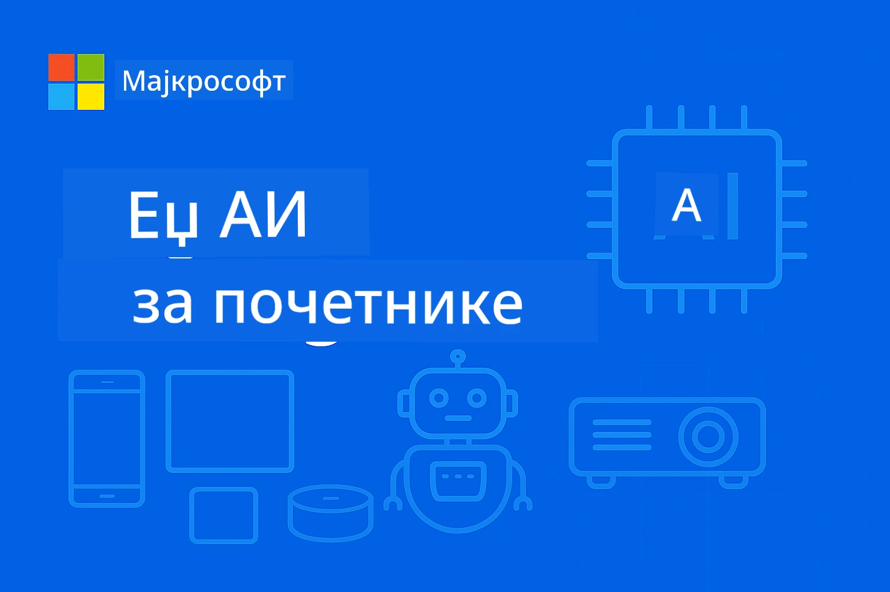

# EdgeAI за почетнике 




[](https://GitHub.com/microsoft/edgeai-for-beginners/graphs/contributors)
[](https://GitHub.com/microsoft/edgeai-for-beginners/issues)
[](https://GitHub.com/microsoft/edgeai-for-beginners/pulls)
[](http://makeapullrequest.com)

[](https://GitHub.com/microsoft/edgeai-for-beginners/watchers)
[](https://GitHub.com/microsoft/edgeai-for-beginners/fork)
[](https://GitHub.com/microsoft/edgeai-for-beginners/stargazers)


[](https://discord.gg/nTYy5BXMWG)

Пратите следеће кораке да бисте почели да користите ове ресурсе:

1. **Направите форк репозиторијума**: Кликните на [](https://GitHub.com/microsoft/edgeai-for-beginners/fork)
2. **Клонирајте репозиторијум**:   `git clone https://github.com/microsoft/edgeai-for-beginners.git`
3. [**Придружите се Azure AI Foundry Discord-у и упознајте експерте и друге програмере**](https://discord.com/invite/ByRwuEEgH4)


### 🌐 Подршка више језика

#### Подржано путем GitHub акције (аутоматски и увек ажурирано)

<!-- CO-OP TRANSLATOR LANGUAGES TABLE START -->
[Arabic](../ar/README.md) | [Bengali](../bn/README.md) | [Bulgarian](../bg/README.md) | [Burmese (Myanmar)](../my/README.md) | [Chinese (Simplified)](../zh-CN/README.md) | [Chinese (Traditional, Hong Kong)](../zh-HK/README.md) | [Chinese (Traditional, Macau)](../zh-MO/README.md) | [Chinese (Traditional, Taiwan)](../zh-TW/README.md) | [Croatian](../hr/README.md) | [Czech](../cs/README.md) | [Danish](../da/README.md) | [Dutch](../nl/README.md) | [Estonian](../et/README.md) | [Finnish](../fi/README.md) | [French](../fr/README.md) | [German](../de/README.md) | [Greek](../el/README.md) | [Hebrew](../he/README.md) | [Hindi](../hi/README.md) | [Hungarian](../hu/README.md) | [Indonesian](../id/README.md) | [Italian](../it/README.md) | [Japanese](../ja/README.md) | [Kannada](../kn/README.md) | [Korean](../ko/README.md) | [Lithuanian](../lt/README.md) | [Malay](../ms/README.md) | [Malayalam](../ml/README.md) | [Marathi](../mr/README.md) | [Nepali](../ne/README.md) | [Nigerian Pidgin](../pcm/README.md) | [Norwegian](../no/README.md) | [Persian (Farsi)](../fa/README.md) | [Polish](../pl/README.md) | [Portuguese (Brazil)](../pt-BR/README.md) | [Portuguese (Portugal)](../pt-PT/README.md) | [Punjabi (Gurmukhi)](../pa/README.md) | [Romanian](../ro/README.md) | [Russian](../ru/README.md) | [Serbian (Cyrillic)](./README.md) | [Slovak](../sk/README.md) | [Slovenian](../sl/README.md) | [Spanish](../es/README.md) | [Swahili](../sw/README.md) | [Swedish](../sv/README.md) | [Tagalog (Filipino)](../tl/README.md) | [Tamil](../ta/README.md) | [Telugu](../te/README.md) | [Thai](../th/README.md) | [Turkish](../tr/README.md) | [Ukrainian](../uk/README.md) | [Urdu](../ur/README.md) | [Vietnamese](../vi/README.md)

> **Више волите да клонирате локално?**

> Овај репозиторијум садржи преводе за више од 50 језика што знатно повећава величину скидања. Да бисте клонирали без превода, користите sparse checkout:
> ```bash
> git clone --filter=blob:none --sparse https://github.com/microsoft/edgeai-for-beginners.git
> cd edgeai-for-beginners
> git sparse-checkout set --no-cone '/*' '!translations' '!translated_images'
> ```
> Ово вам даје све што вам је потребно за завршетак курса уз много брже скидање.
<!-- CO-OP TRANSLATOR LANGUAGES TABLE END -->

**Ако желите додатну подршку за преводе, подржани језици су наведени [овде](https://github.com/Azure/co-op-translator/blob/main/getting_started/supported-languages.md)**
## Увод

Добродошли у **EdgeAI за почетнике** – ваше свеобухватно путовање у трансформативни свет Едге вештачке интелигенције. Овај курс превазилази јаз између моћних AI могућности и практичне примене у реалном свету на уређајима на ивици мреже, омогућавајући вам да искористите потенцијал AI директно тамо где се подаци генеришу и где је потребно доносити одлуке.

### Шта ћете савладати

Овај курс води вас од основних појмова до имплементација спремних за производњу, покривајући:
- **Мали језички модели (SLM)** оптимизовани за извођење на ивици мреже
- **Оптимизацију осетљиву на хардвер** на различитим платформама
- **Инференцу у реалном времену** са могућностима очувања приватности
- **Стратегије производног имплементирања** за предузећа

### Зашто је EdgeAI важан

Edge AI представља парадигматску промену која решава критичне савремене изазове:
- **Приватност и безбедност**: Обрада осетљивих података локално без излагања облаку
- **Успешност у реалном времену**: Елиминисање кашњења мреже за апликације критичне по време
- **Ефикасност трошкова**: Смањење трошкова пропусног опсега и облачног рачунара
- **Отпорност операција**: Остаје функционалан током кварова мреже
- **Усклађеност са прописима**: Испуњавање захтева о суверенитету података

### Edge AI

Edge AI се односи на извођење AI алгоритама и језичких модела локално на хардверу, близу места где се подаци генеришу, без ослањања на облачне ресурсе за инференцу. Смањује латенцију, побољшава приватност и омогућава доношење одлука у реалном времену.

### Основни принципи:
- **Инференца на уређају**: AI модели раде на ивичним уређајима (телефони, рутери, микроконтролери, индустријски рачунари)
- **Без интернет везе**: Функционише без сталне интернет конекције
- **Ниска латенција**: Одмах одговара, погодан за системе у реалном времену
- **Суверенитет података**: Чува осетљиве податке локално, побољшавајући безбедност и усаглашеност

### Мали језички модели (SLM)

SLM-ови као што су Phi-4, Mistral-7B и Gemma су оптимизоване верзије већих LLM-ова — обучени или дистиловани за:
- **Смањену потрошњу меморије**: Ефективно коришћење ограничене меморије уређаја на ивици мреже
- **Мања потреба за процесорском снагом**: Оптимизовано за перформансе CPU и еџ GPU
- **Брже време покретања**: Брзо иницијализовање за апликације које захтевају реакцију

Они откључавају моћне могућности процесирања природног језика уз испуњавање ограничења:
- **Уграђени системи**: IоT уређаји и индустријски контролери
- **Мобилни уређаји**: Паметни телефони и таблети са могућностима рада офлајн
- **IoT уређаји**: Сензори и паметни уређаји са ограниченим ресурсима
- **Edge сервери**: Локалне обрађивачке јединице са ограниченим GPU ресурсима
- **Персонални рачунари**: Сценарији за радну површину и лаптопове

## Модули курса и навигација

| Модул | Тема | Фокусна област | Кључни садржај | Ниво | Трајање |
|--------|-------|------------|-------------|--------|----------|
| [📖 00 ](./introduction.md) | [Увод у EdgeAI](./introduction.md) | Основа & Контекст | Преглед EdgeAI • Применa у индустрији • Увод у SLM • Циљеви учења | Почетник | 1-2 сата |
| [📚 01](../../Module01) | [Основе EdgeAI](./Module01/README.md) | Поређење облака и Edge AI | Основе EdgeAI • Студије случаја из реалног света • Водич за имплементацију • Edge извођење | Почетник | 3-4 сата |
| [🧠 02](../../Module02) | [Основе SLM модела](./Module02/README.md) | Породице модела и архитектура | Породица Phi • Породица Qwen • Породица Gemma • BitNET • μModel • Phi-Silica | Почетник | 4-5 сати |
| [🚀 03](../../Module03) | [Практична употреба SLM](./Module03/README.md) | Локално и облачно извођење | Напредно учење • Локално окружење • Облачно извођење | Средњи | 4-5 сати |
| [⚙️ 04](../../Module04) | [Туторијал за оптимизацију модела](./Module04/README.md) | Оптимизација на више платформи | Увод • Llama.cpp • Microsoft Olive • OpenVINO • Apple MLX • Синтеза радног тока | Средњи | 5-6 сати |
| [🔧 05](../../Module05) | [SLMOps Производња](./Module05/README.md) | Производне операције | Увод у SLMOps • Дистилација модела • Фино подешавање • Производно извођење | Напредни | 5-6 сати |
| [🤖 06](../../Module06) | [AI агенти и позивање функција](./Module06/README.md) | Okviri агената и MCP | Увод у агенте • Позивање функција • Протокол контекста модела | Напредни | 4-5 сати |
| [💻 07](../../Module07) | [Имплементација на платформи](./Module07/README.md) | Примери на више платформи | AI алатке • Foundry Local • Windows развој | Напредни | 3-4 сата |
| [🏭 08](../../Module08) | [Foundry Local алатки комплет](./Module08/README.md) | Примери спремни за производњу | Пример апликација (погледајте детаље испод) | Стручњак | 8-10 сати |

### 🏭 **Модул 08: Примери апликација**

- [01: Брзи почетак REST ћаскања](./Module08/samples/01/README.md)
- [02: Интеграција OpenAI SDK](./Module08/samples/02/README.md)
- [03: Откривање и бенчмаркинг модела](./Module08/samples/03/README.md)
- [04: Chainlit RAG апликација](./Module08/samples/04/README.md)
- [05: Оркестрација више агената](./Module08/samples/05/README.md)
- [06: Усмеривач „Модели као алати“](./Module08/samples/06/README.md)
- [07: Директан API клијент](./Module08/samples/07/README.md)
- [08: Windows 11 апликација за ћаскање](./Module08/samples/08/README.md)
- [09: Напредни систем са више агената](./Module08/samples/09/README.md)
- [10: Фрејмворк Foundry алата](./Module08/samples/10/README.md)

### 🎓 **Радионца: Пут учења практичним радом**

Свеобухватни материјали радионице са имплементацијама спремним за производњу:

- **[Водич за радионицу](./Workshop/Readme.md)** - Потпуни циљеви учења, резултати и навигација ресурса
- **Python примери** (6 сесија) - Ажурирани са најбољим праксама, руковањем грешкама и свеобухватном документацијом
- **Jupyter бележнице** (8 интерактивних) - Туторијали корак по корак са бенчмарковима и праћењем перформанси
- **Водичи за сесије** - Детаљни markdown водичи за сваку сесију радионице
- **Алати за валидацију** - Скрипте за проверу квалитета кода и покретање smoke тестова

**Шта ћете направити:**
- Локалне AI апликације за ћаскање са подршком за стримовање
- RAG пипелина са проценом квалитета (RAGAS)
- Алати за бенчмаркинг и поређење више модела
- Системи за оркестрацију више агената
- Интелигентно усмеравање модела са избором заснованим на задацима

### 🎙️ **Радионца за Agentic: Практично - AI Подкаст студио**

Направите AI-подржану пипелину за продукцију подкаста од почетка! Ова импресивна радионица учи вас како да направите комплетан систем са више агената који претвара идеје у професионалне епизоде подкаста.
**[🎬 Почни радионицу AI Podcast студија](./WorkshopForAgentic/README.md)**

**Твој задатак**: Покрени "Future Bytes" — технолошки подкаст који у потпуности покрећу AI агенти које ћеш сам креирати. Без облачних зависности, без API трошкова — све се извршава локално на твом рачунару.

**Шта чини ово јединственим:**
- **🤖 Право мулти-агентно оркестрирање** - Креирај специјализоване AI агенте који истражују, пишу и производе аудио
- **🎯 Комплетан производни процес** - Од избора теме до коначног аудио подкаста
- **💻 100% локална инсталација** - Користи Ollama и локалне моделе (Qwen-3-8B) за пуну приватност и контролу
- **🎤 Интеграција текста у глас** - Претвори скрипте у природне конверзације са више говорника
- **✋ Радни токови са људском контролом** - Прозори за одобрење обезбеђују квалитет уз одржавање аутоматизације

**Троакторски образовни пут:**

| Акт | Фокус | Кључне вештине | Трајање |
|-----|-------|-----------------|---------|
| **[Акт 1: Упознај своје AI асистенте](./WorkshopForAgentic/md/01.BuildAIAgentWithSLM.md)** | Креирај свог првог AI агента | Интеграција алата • Веб претрага • Решавање проблема • Агентско расуђивање | 2-3 сата |
| **[Акт 2: Састави свој производни тим](./WorkshopForAgentic/md/02.AIAgentOrchestrationAndWorkflows.md)** | Оркестрирај више агената | Координација тима • Радни токови одобрења • DevUI интерфејс • Људски надзор | 3-4 сата |
| **[Акт 3: Учини свој подкаст живим](./WorkshopForAgentic/md/03.Multi-SpeakerPodcastGenerationWithVibeVoice.md)** | Генериши аудио подкаст | Текст у глас • Синтеза више говорника • Дужи аудио запис • Пуна аутоматизација | 2-3 сата |

**Користеће технологије:**
- **Microsoft Agent Framework** - Мулти-агентно оркестрирање и координација
- **Ollama** - Локално извршавање AI модела (без облака)
- **Qwen-3-8B** - Опен-сорс језички модел оптимизован за агентске задатке
- **Text-to-Speech API-ји** - Природна синтеза гласа за генерацију подкаста

**Подршка за хардвер:**
- ✅ **CPU режим** - Ради на сваком модерном рачунару (препоручено 8GB+ RAM)
- 🚀 **GPU акцелерација** - Знатно брже извршавање са NVIDIA/AMD графичким картицама
- ⚡ **NPU подршка** - Убрзање са следећом генерацијом неуралних процесорских јединица

**Идеално за:**
- Програмере који уче мулти-агентне AI системе
- Свакога ко је заинтересован за AI аутоматизацију и радне токове
- Креаторе садржаја који истражују AI-асистирану производњу
- Студенте који проучавају практичне парадигме AI оркестрације

**Почни са радом**: [🎙️ AI Podcast студио радионица →](./WorkshopForAgentic/README.md)

### 📊 **Резиме учења**
- **Укупно трајање**: 36-45 сати
- **Почетни ниво**: Модули 01-02 (7-9 сати)  
- **Средњи ниво**: Модули 03-04 (9-11 сати)
- **Напредни ниво**: Модули 05-07 (12-15 сати)
- **Експертски ниво**: Модул 08 (8-10 сати)

## Шта ћеш изградити

### 🎯 Основне компетенције
- **Архитектура Edge AI**: Дизајн AI система са приоритетом локалног рада уз интеграцију облака
- **Оптимизација модела**: Квантизација и компресија модела за Edge имплементацију (85% убрзање, 75% смањење величине)
- **Мултиплатформска имплементација**: Windows, мобилне, уграђене и хибридне cloud-edge системе
- **Производне операције**: Мониторинг, скалирање и одржавање Edge AI у продукцији

### 🏗️ Практични пројекти
- **Foundry локалне апликације за ћаскање**: Виндовс 11 нативна апликација са пребацивањем модела
- **Мулти-агентски системи**: Координатор са специјализованим агентима за сложене радне токове  
- **RAG апликације**: Локална обрада докумената и претрага помоћу векторских претрага
- **Рутери модела**: Интелигентан избор између модела на основу анализе задатака
- **API оквири**: Клијенти спремни за продукцију са стримингом и мониторингом здравља система
- **Крос-платформски алати**: Обрасци интеграције LangChain/Semantic Kernel

### 🏢 Примена у индустрији
**Производња** • **Здравство** • **Аутономна возила** • **Паметни градови** • **Мобилне апликације**

## Брзи почетак

**Препоручени учењски пут** (укупно 20-30 сати):

0. **📖 Увод** ([Introduction.md](./introduction.md)): Основа EdgeAI + индустријски контекст + оквир за учење
1. **📚 Основе** (Модули 01-02): Концепти EdgeAI + породице SLM модела
2. **⚙️ Оптимизација** (Модули 03-04): Имплементација + оквири за квантизацију  
3. **🚀 Продукција** (Модули 05-06): SLMOps + AI агенти + позивање функција
4. **💻 Имплементација** (Модули 07-08): Узорци за платформе + Foundry Local алат

Сваки модул укључује теорију, практичне вежбе и пример кода спреман за продукцију.

## Утицај на каријеру

**Техничке улоге**: архитекта EdgeAI решења • ML инжењер (Edge) • IoT AI програмер • мобилни AI програмер

**Индустријски сектори**: Производња 4.0 • Здравствена технологија • Аутономни системи • ФинТек • Потрошачка електроника

**Портфолио пројекти**: Мулти-агентски системи • Производне RAG апликације • Крос-платформска имплементација • Оптимизација перформанси

## Структура репозиторијума

```
edgeai-for-beginners/
├── 📖 introduction.md  # Foundation: EdgeAI Overview & Learning Framework
├── 📚 Module01-04/     # Fundamentals → SLMs → Deployment → Optimization  
├── 🔧 Module05-06/     # SLMOps → AI Agents → Function Calling
├── 💻 Module07/        # Platform Samples (VS Code, Windows, Jetson, Mobile)
├── 🏭 Module08/        # Foundry Local Toolkit + 10 Comprehensive Samples
│   ├── samples/01-06/  # Foundation: REST, SDK, RAG, Agents, Routing
│   └── samples/07-10/  # Advanced: API Client, Windows App, Enterprise Agents, Tools
├── 🌐 translations/    # Multi-language support (8+ languages)
└── 📋 STUDY_GUIDE.md   # Structured learning paths & time allocation
```

## Кључни елементи курса

✅ **Прогресивно учење**: Теорија → Практика → Продукцијска имплементација  
✅ **Стварни случајеви**: Microsoft, Japan Airlines, корпоративне имплементације  
✅ **Практични примери**: 50+ примера, 10 обухватних Foundry Local демонстрација  
✅ **Фокус на перформансе**: 85% побољшање брзине, 75% смањење величине  
✅ **Мултиплатформски**: Windows, мобилни, уграђени, хибридни cloud-edge  
✅ **Спремно за продукцију**: Мониторинг, скалирање, безбедност, оквири за усаглашеност

📖 **[Доступан водич за учење](STUDY_GUIDE.md)**: Структурисан 20-часовни учењски пут са смерницама за распоређивање времена и алатима за самоевалуацију.

---

**EdgeAI представља будућност AI развоја**: превасходно локално, са очувањем приватности и ефикасношћу. Усвоји ове вештине да би градио наредну генерацију интелигентних апликација.

## Остали курсеви

Наш тим производи и друге курсеве! Погледај:

<!-- CO-OP TRANSLATOR OTHER COURSES START -->
### LangChain
[](https://aka.ms/langchain4j-for-beginners)
[](https://aka.ms/langchainjs-for-beginners?WT.mc_id=m365-94501-dwahlin)
[](https://github.com/microsoft/langchain-for-beginners?WT.mc_id=m365-94501-dwahlin)
---

### Azure / Edge / MCP / Agents
[](https://github.com/microsoft/AZD-for-beginners?WT.mc_id=academic-105485-koreyst)
[](https://github.com/microsoft/edgeai-for-beginners?WT.mc_id=academic-105485-koreyst)
[](https://github.com/microsoft/mcp-for-beginners?WT.mc_id=academic-105485-koreyst)
[](https://github.com/microsoft/ai-agents-for-beginners?WT.mc_id=academic-105485-koreyst)

---
 
### Serija generativnog AI
[](https://github.com/microsoft/generative-ai-for-beginners?WT.mc_id=academic-105485-koreyst)
[-9333EA?style=for-the-badge&labelColor=E5E7EB&color=9333EA)](https://github.com/microsoft/Generative-AI-for-beginners-dotnet?WT.mc_id=academic-105485-koreyst)
[-C084FC?style=for-the-badge&labelColor=E5E7EB&color=C084FC)](https://github.com/microsoft/generative-ai-for-beginners-java?WT.mc_id=academic-105485-koreyst)
[-E879F9?style=for-the-badge&labelColor=E5E7EB&color=E879F9)](https://github.com/microsoft/generative-ai-with-javascript?WT.mc_id=academic-105485-koreyst)

---
 
### Основно учење
[](https://aka.ms/ml-beginners?WT.mc_id=academic-105485-koreyst)
[](https://aka.ms/datascience-beginners?WT.mc_id=academic-105485-koreyst)
[](https://aka.ms/ai-beginners?WT.mc_id=academic-105485-koreyst)
[](https://github.com/microsoft/Security-101?WT.mc_id=academic-96948-sayoung)
[](https://aka.ms/webdev-beginners?WT.mc_id=academic-105485-koreyst)
[](https://aka.ms/iot-beginners?WT.mc_id=academic-105485-koreyst)
[](https://github.com/microsoft/xr-development-for-beginners?WT.mc_id=academic-105485-koreyst)

---
 
### Serija Copilot  

[](https://aka.ms/GitHubCopilotAI?WT.mc_id=academic-105485-koreyst)
[](https://github.com/microsoft/mastering-github-copilot-for-dotnet-csharp-developers?WT.mc_id=academic-105485-koreyst)
[](https://github.com/microsoft/CopilotAdventures?WT.mc_id=academic-105485-koreyst)
<!-- CO-OP TRANSLATOR OTHER COURSES END -->

## Како добити помоћ

Ако запнете или имате било каквих питања о креирању AI апликација, придружите се:

[](https://discord.gg/nTYy5BXMWG)

Ако имате повратне информације о производу или пријављујете грешке током креирања посетите:

[](https://aka.ms/foundry/forum)

---

<!-- CO-OP TRANSLATOR DISCLAIMER START -->
**Изјава о одрицању одговорности**:  
Овај документ је преведен коришћењем АИ преводилачке услуге [Co-op Translator](https://github.com/Azure/co-op-translator). Иако тежимо тачности, молимо вас да имате у виду да аутоматски преводи могу садржати грешке или нетачности. Оригинални документ на његовом матерњем језику треба сматрати ауторитетним извором. За критичне информације препоручује се професионални људски превод. Ми нисмо одговорни за било какве неспоразуме или погрешне тумачења настала коришћењем овог превода.
<!-- CO-OP TRANSLATOR DISCLAIMER END -->