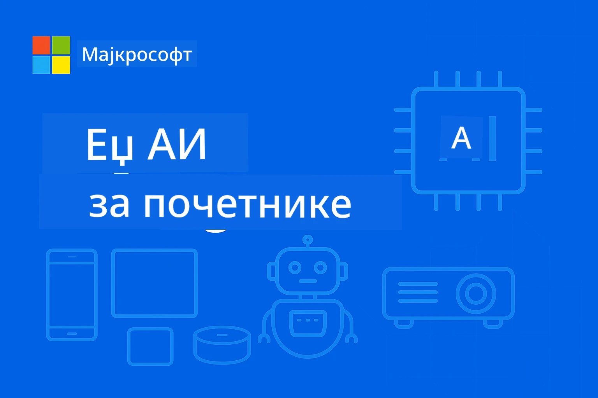

# EdgeAI за почетнике 




[](https://GitHub.com/microsoft/edgeai-for-beginners/graphs/contributors)
[](https://GitHub.com/microsoft/edgeai-for-beginners/issues)
[](https://GitHub.com/microsoft/edgeai-for-beginners/pulls)
[](http://makeapullrequest.com)

[](https://GitHub.com/microsoft/edgeai-for-beginners/watchers)
[](https://GitHub.com/microsoft/edgeai-for-beginners/fork)
[](https://GitHub.com/microsoft/edgeai-for-beginners/stargazers)


[](https://discord.gg/nTYy5BXMWG)

Следите ове кораке да бисте започели коришћење ових ресурса:

1. **Направите форк репозиторијума**: Кликните [](https://GitHub.com/microsoft/edgeai-for-beginners/fork)
2. **Клонирајте репозиторијум**:   `git clone https://github.com/microsoft/edgeai-for-beginners.git`
3. [**Придружите се Azure AI Foundry Discord-у и упознајте експерте и друге програмере**](https://discord.com/invite/ByRwuEEgH4)


### 🌐 Подршка за више језика

#### Подржано преко GitHub Action (Аутоматски и увек ажурно)

<!-- CO-OP TRANSLATOR LANGUAGES TABLE START -->
[Арапски](../ar/README.md) | [Бенгалски](../bn/README.md) | [Бугарски](../bg/README.md) | [Бирмански (Мјанмар)](../my/README.md) | [Кинески (поједностављени)](../zh-CN/README.md) | [Кинески (традиционални, Хонг Конг)](../zh-HK/README.md) | [Кинески (традиционални, Макао)](../zh-MO/README.md) | [Кинески (традиционални, Тајван)](../zh-TW/README.md) | [Хрватски](../hr/README.md) | [Чешки](../cs/README.md) | [Дански](../da/README.md) | [Холандски](../nl/README.md) | [Естонски](../et/README.md) | [Фински](../fi/README.md) | [Француски](../fr/README.md) | [Немачки](../de/README.md) | [Грчки](../el/README.md) | [Хебрејски](../he/README.md) | [Хинди](../hi/README.md) | [Мађарски](../hu/README.md) | [Индонежански](../id/README.md) | [Италијански](../it/README.md) | [Јапански](../ja/README.md) | [Каннада](../kn/README.md) | [Кмерски](../km/README.md) | [Корејски](../ko/README.md) | [Литвански](../lt/README.md) | [Малајски](../ms/README.md) | [Малајалам](../ml/README.md) | [Марати](../mr/README.md) | [Непалски](../ne/README.md) | [Нигеријски пидџин](../pcm/README.md) | [Норвешки](../no/README.md) | [Персијски (фарси)](../fa/README.md) | [Пољски](../pl/README.md) | [Португалски (Бразил)](../pt-BR/README.md) | [Португалски (Португал)](../pt-PT/README.md) | [Панџаби (Гурумухи)](../pa/README.md) | [Румунски](../ro/README.md) | [Руски](../ru/README.md) | [Српски (ћирилица)](./README.md) | [Словачки](../sk/README.md) | [Словеначки](../sl/README.md) | [Шпански](../es/README.md) | [Свахили](../sw/README.md) | [Шведски](../sv/README.md) | [Тагалог (Филипински)](../tl/README.md) | [Тамил](../ta/README.md) | [Телугу](../te/README.md) | [Тајландски](../th/README.md) | [Турски](../tr/README.md) | [Украјински](../uk/README.md) | [Урду](../ur/README.md) | [Вијетнамски](../vi/README.md)

> **Преферирате да клонирате локално?**
>
> Овај репозиторијум укључује преко 50 превода што значајно повећава величину преузимања. Да бисте клонирали без превода, користите sparse checkout:
>
> **Bash / macOS / Linux:**
> ```bash
> git clone --filter=blob:none --sparse https://github.com/microsoft/edgeai-for-beginners.git
> cd edgeai-for-beginners
> git sparse-checkout set --no-cone '/*' '!translations' '!translated_images'
> ```
>
> **CMD (Windows):**
> ```cmd
> git clone --filter=blob:none --sparse https://github.com/microsoft/edgeai-for-beginners.git
> cd edgeai-for-beginners
> git sparse-checkout set --no-cone "/*" "!translations" "!translated_images"
> ```
>
> Ово вам даје све што вам је потребно за завршетак курса уз много брже преузимање.
<!-- CO-OP TRANSLATOR LANGUAGES TABLE END -->

**Ако желите додатне преводе, подржани језици су наведени [овде](https://github.com/Azure/co-op-translator/blob/main/getting_started/supported-languages.md)**
## Увод

Добродошли у **EdgeAI за почетнике** – ваше свеобухватно путовање у трансформативни свет Edge вештачке интелигенције. Овај курс преклапа јаз између моћних AI могућности и практичне, реалне примене на edge уређајима, омогућавајући вам да искористите потенцијал AI-а директно тамо где се подаци генеришу и где треба доносити одлуке.

### Шта ћете савладати

Овај курс вас води од основних концепата до имплементација спремних за производњу, обухватајући:
- **Мали језички модели (SLM)** оптимизовани за распоређивање на периферији
- **Оптимизацију свесну хардвера** на различитим платформама
- **Извођење у реалном времену** са могућностима очувања приватности
- **Стратегије производног распоређивања** за корпоративне апликације

### Зашто је EdgeAI важан

Edge AI представља промена парадигме која решава критичне савремене изазове:
- **Приватност и безбедност**: Обрада осетљивих података локално, без излагања облаку
- **Перформансе у реалном времену**: Елиминише латенцију мреже за апликације осетљиве на време
- **Ефикасност трошкова**: Смањује пропусни опсег и трошкове облачног рачунања
- **Отпорне операције**: Одржава функционалност током прекида мреже
- **Усклађеност са регулативом**: Испуњава захтеве о суверенитету података

### Edge AI

Edge AI означава покретање AI алгоритама и језичких модела локално на хардверу, близу места где се подаци генеришу, без ослањања на облачне ресурсе за извођење. Смањује латенцију, побољшава приватност и омогућава доношење одлука у реалном времену.

### Основна начела:
- **Инференција на уређају**: AI модели раде на edge уређајима (телефони, рутери, микроконтролери, индустријски ПК)
- **Рад без мреже**: Функционише без сталне интернет везе
- **Ниска латенција**: Одговори у истом тренутку погодни за системе у реалном времену
- **Суверенитет података**: Чува осетљиве податке локално, побољшавајући безбедност и усклађеност

### Мали језички модели (SLM)

SLM-ови као што су Phi-4, Mistral-7B и Gemma су оптимизоване верзије већих LLM-ова — обучавани или дистиловани за:
- **Смањен меморијски отисак**: Ефикасна употреба ограничене меморије edge уређаја
- **Смањени захтеви за ресурсе**: Оптимизације за CPU и edge GPU перформансе
- **Брже време покретања**: Брза иницијализација за ресиве апликације

Они откључавају моћне NLP могућности уз испуњавање ограничења:
- **Уграчени системи**: IoT уређаји и индустријски контролери
- **Мобилни уређаји**: Смарт телефони и таблети са могућностима рада без мреже
- **IoT уређаји**: Сензори и паметни уређаји са ограниченим ресурсима
- **Edge сервери**: Локалне јединице за обраду са ограниченим GPU ресурсима
- **Персонални рачунари**: Сценарији распоређивања на десктоп и лаптоп уређајима

## Модули курса и навигација

| Module | Topic | Focus Area | Key Content | Level | Duration |
|--------|-------|------------|-------------|--------|----------|
| [📖 00 ](./introduction.md) | [Увод у EdgeAI](./introduction.md) | Фондација и контекст | Преглед EdgeAI • Индустријске примене • Увод у SLM • Циљеви учења | Почетник | 1-2 hrs |
| [📚 01](../../Module01) | [Основе EdgeAI](./Module01/README.md) | Поређење облака и периферије | Основе EdgeAI • Студије случаја из стварног света • Водич за имплементацију • Распоређивање на периферији | Почетник | 3-4 hrs |
| [🧠 02](../../Module02) | [Основе SLM модела](./Module02/README.md) | Породице модела и архитектура | Phi породица • Qwen породица • Gemma породица • BitNET • μModel • Phi-Silica | Почетник | 4-5 hrs |
| [🚀 03](../../Module03) | [Практична имплементација SLM](./Module03/README.md) | Локално и у облаку | Напредно учење • Локално окружење • Распоређивање у облаку | Средњи | 4-5 hrs |
| [⚙️ 04](../../Module04) | [Алати за оптимизацију модела](./Module04/README.md) | Оптимизација за више платформи | Увод • Llama.cpp • Microsoft Olive • OpenVINO • Apple MLX • Синтеза рада | Средњи | 5-6 hrs |
| [🔧 05](../../Module05) | [SLMOps у производњи](./Module05/README.md) | Операције у производњи | Увод у SLMOps • Дестилација модела • Фино подешавање • Распоређивање у производњи | Напредни | 5-6 hrs |
| [🤖 06](../../Module06) | [AI агенти и позив функција](./Module06/README.md) | Фрејмворкови агената и MCP | Увод у агенте • Позив функција • Протокол контекста модела | Напредни | 4-5 hrs |
| [💻 07](../../Module07) | [Имплементација платформе](./Module07/README.md) | Примери за више платформи | AI алатни комплет • Foundry Local • Развој за Windows | Напредни | 3-4 hrs |
| [🏭 08](../../Module08) | [Foundry локални алатни комплет](./Module08/README.md) | Примери спремни за производњу | Примери апликација (видети детаље испод) | Експерт | 8-10 hrs |

### 🏭 **Модул 08: Примери апликација**

- [01: REST Chat брзи почетак](./Module08/samples/01/README.md)
- [02: Интеграција OpenAI SDK](./Module08/samples/02/README.md)
- [03: Откривање модела и бенчмаркинг](./Module08/samples/03/README.md)
- [04: Chainlit RAG апликација](./Module08/samples/04/README.md)
- [05: Оркестрација више агената](./Module08/samples/05/README.md)
- [06: Рутер Модели као алати](./Module08/samples/06/README.md)
- [07: Директни API клијент](./Module08/samples/07/README.md)
- [08: Windows 11 чат апликација](./Module08/samples/08/README.md)
- [09: Напредни систем више агената](./Module08/samples/09/README.md)
- [10: Foundry алатни оквир](./Module08/samples/10/README.md)

### 🎓 **Радионица: Практична стаза учења**

Свеобухватни материјали за практичну радионицу са имплементацијама спремним за производњу:

- **[Водич за радионицу](./Workshop/Readme.md)** - Комплетни циљеви учења, резултати и навигација ресурса
- **Python примери** (6 сесија) - Ажурирани са најбољим праксама, руковањем грешкама и свеобухватном документацијом
- **Jupyter бележнице** (8 интерактивних) - Туторијали корак по корак са бенчмаркингом и праћењем перформанси
- **Водичи за сесије** - Детаљни markdown водичи за сваку радионичку сесију
- **Алатке за валидацију** - Скрипте за проверу квалитета кода и покретање основних тестова

**Шта ћете изградити:**
- Локалне AI чат апликације са подршком за стриминг
- RAG пипелайни са проценом квалитета (RAGAS)
- Алатке за бенчмаркинг и упоређивање више модела
- Системи за оркестрацију више агената
- Интелигентно усмеравање модела са избором на основу задатка

### 🎙️ **Радионица за Agentic: Практична - AI подкаст студио**
Build an AI-powered podcast production pipeline from scratch! This immersive workshop teaches you to create a complete multi-agent system that transforms ideas into professional podcast episodes.

**[🎬 Start The AI Podcast Studio Workshop](./WorkshopForAgentic/README.md)**

**Ваша мисија**: Покрените "Future Bytes" — технолошки подкаст који је у потпуности покренут од стране AI агената које ћете сами изградити. Без облака, без трошкова API-ja — све ради локално на вашем рачунару.

**Шта ово чини једноставним и јединственим:**
- **🤖 Правa мулти-агентска оркестрација** - Изградите специјализоване AI агенте који истражују, пишу и производе аудио
- **🎯 Потпуни продукцијски пипелайн** - Од избора теме до коначног подцаст аудио исхода
- **💻 Потпуно локално извршавање** - Користи Ollama и локалне моделе (Qwen-3-8B) за пуну приватност и контролу
- **🎤 Интеграција текста у говор** - Претворите сценарије у природно звучеће разговоре са више говорника
- **✋ Радни токови са људским надзором** - Прелази за одобравање осигуравају квалитет уз одржавање аутоматизације

**Трочинска учења путовање:**

| Act | Focus | Key Skills | Duration |
|-----|-------|------------|----------|
| **[Act 1: Meet Your AI Assistants](./WorkshopForAgentic/md/01.BuildAIAgentWithSLM.md)** | Изградите свог првог AI агента | Интеграција алата • Веб претрага • Решавање проблема • Агентско резоновање | 2-3 hrs |
| **[Act 2: Assemble Your Production Team](./WorkshopForAgentic/md/02.AIAgentOrchestrationAndWorkflows.md)** | Оркестрирајте више агената | Координација тима • Радни токови за одобравање • DevUI интерфејс • Људски надзор | 3-4 hrs |
| **[Act 3: Bring Your Podcast to Life](./WorkshopForAgentic/md/03.Multi-SpeakerPodcastGenerationWithVibeVoice.md)** | Генеришите подкаст аудио | Текст-у-говор • Синтеза више говорника • Дужи аудио формати • Потпуна аутоматизација | 2-3 hrs |

**Технологије које се користе:**
- **Microsoft Agent Framework** - Оркестрација и координација мулти-агентских система
- **Ollama** - Локални runtime за AI моделе (није потребан облак)
- **Qwen-3-8B** - Отворени модел језика оптимизован за агентске задатке
- **Text-to-Speech APIs** - Нативна синтеза гласа за генерисање подкаста

**Подршка хардвера:**
- ✅ **CPU режим** - Ради на сваком савременом рачунару (препоручено 8GB+ RAM)
- 🚀 **GPU убрзање** - Знатно брже закључивање са NVIDIA/AMD GPU-има
- ⚡ **Подршка за NPU** - Убрзање на новом генерацији неуронских процесних јединица

**Идеално за:**
- Девелопере који уче мулти-агентске AI системе
- Све који су заинтересовани за AI аутоматизацију и радне токове
- Креаторе садржаја који истражују AI-помогнуту продукцију
- Студенте који изучавају практичне обрасце оркестрације AI

**Почните са изградњом**: [🎙️ The AI Podcast Studio Workshop →](./WorkshopForAgentic/README.md)

### 📊 **Резиме пута учења**
- **Укупно трајање**: 36-45 сати
- **Путања за почетнике**: Модули 01-02 (7-9 сати)  
- **Средњи ниво**: Модули 03-04 (9-11 сати)
- **Напредни ниво**: Модули 05-07 (12-15 сати)
- **Експертска путања**: Модул 08 (8-10 сати)

## Шта ћете изградити

### 🎯 Кључне компетенције
- **Edge AI архитектура**: Дизајнирајте локално-прво AI системе са интеграцијом у облак
- **Оптимизација модела**: Квантизујте и компримујте моделе за Edge распоређивање (85% убрзање, 75% смањење величине)
- **Распоређивање на више платформи**: Windows, мобилне, уграђене и cloud-edge хибридне системе
- **Операције продукције**: Мониторинг, скалирање и одржавање Edge AI у продукцији

### 🏗️ Практични пројекти
- **Foundry локалне чат апликације**: Нативна апликација за Windows 11 са пребацивањем модела
- **Мулти-агентски системи**: Координатор са специјалистичким агентима за сложене радне токове  
- **RAG апликације**: Локална обрада докумената са векторском претрагом
- **Рутери модела**: Интелигентан избор између модела базиран на анализи задатка
- **API оквири**: Клијенти спремни за продукцију са стримингом и мониторингом здравља
- **Крос-платформ алати**: Обрасци интеграције LangChain/Semantic Kernel

### 🏢 Примена у индустрији
**Производња** • **Здравство** • **Аутономна возила** • **Паметни градови** • **Мобилне апликације**

## Брзи почетак

**Препоручена путања учења** (укупно 20-30 сати):

0. **📖 Увод** ([Introduction.md](./introduction.md)): Основа EdgeAI + контекст индустрије + оквир учења
1. **📚 Основа** (Модули 01-02): EdgeAI концепти + SLM породице модела
2. **⚙️ Оптимизација** (Модули 03-04): Рaspоређивање + квантизација оквира  
3. **🚀 Продукција** (Модули 05-06): SLMOps + AI агенти + function calling
4. **💻 Имплементација** (Модули 07-08): Примери платформи + Foundry Local алат

Сваки модул садржи теорију, вежбе и код спреман за продукцију.

## Утицај на каријеру

**Техничке улоге**: EdgeAI Solutions Architect • ML Engineer (Edge) • IoT AI Developer • Mobile AI Developer

**Индустријски сектори**: Производња 4.0 • Здравствена технологија • Аутономни системи • FinTech • Потрошачка електроника

**Пројекти за портфолио**: Мулти-агентски системи • Production RAG апликације • Крос-платформ распоређивање • Оптимизација перформанси

## Структура репозиторијума

```
edgeai-for-beginners/
├── 📖 introduction.md  # Foundation: EdgeAI Overview & Learning Framework
├── 📚 Module01-04/     # Fundamentals → SLMs → Deployment → Optimization  
├── 🔧 Module05-06/     # SLMOps → AI Agents → Function Calling
├── 💻 Module07/        # Platform Samples (VS Code, Windows, Jetson, Mobile)
├── 🏭 Module08/        # Foundry Local Toolkit + 10 Comprehensive Samples
│   ├── samples/01-06/  # Foundation: REST, SDK, RAG, Agents, Routing
│   └── samples/07-10/  # Advanced: API Client, Windows App, Enterprise Agents, Tools
├── 🌐 translations/    # Multi-language support (8+ languages)
└── 📋 STUDY_GUIDE.md   # Structured learning paths & time allocation
```

## Главне карактеристике курса

✅ **Прогресивно учење**: Теорија → Практика → Продукција  
✅ **Стварни студији случаја**: Microsoft, Japan Airlines, ентерпрајз имплементације  
✅ **Практични примери**: 50+ примера, 10 свеобухватних Foundry Local демо апликација  
✅ **Фокус на перформансама**: 85% побољшања брзине, 75% смањења величине  
✅ **Мулти-платформски**: Windows, мобилни, уграђени, cloud-edge хибрид  
✅ **Спремно за продукцију**: Мониторинг, скалирање, безбедност, оквири за комплајанс

📖 **[Доступан студијски водич](STUDY_GUIDE.md)**: Структурирана 20-сатна путања учења са смерницама за расподелу времена и алатима за самооцењивање.

---

**EdgeAI представља будућност распоређивања AI**: локално-прво, очување приватности и ефикасно. Савладајте ове вештине да бисте изградили следећу генерацију интелигентних апликација.

## Други курсеви

Наш тим производи и друге курсеве! Погледајте:

<!-- CO-OP TRANSLATOR OTHER COURSES START -->
### LangChain
[](https://aka.ms/langchain4j-for-beginners)
[](https://aka.ms/langchainjs-for-beginners?WT.mc_id=m365-94501-dwahlin)
[](https://github.com/microsoft/langchain-for-beginners?WT.mc_id=m365-94501-dwahlin)
---

### Azure / Edge / MCP / Agents
[](https://github.com/microsoft/AZD-for-beginners?WT.mc_id=academic-105485-koreyst)
[](https://github.com/microsoft/edgeai-for-beginners?WT.mc_id=academic-105485-koreyst)
[](https://github.com/microsoft/mcp-for-beginners?WT.mc_id=academic-105485-koreyst)
[](https://github.com/microsoft/ai-agents-for-beginners?WT.mc_id=academic-105485-koreyst)

---
 
### Генеративни AI серија
[](https://github.com/microsoft/generative-ai-for-beginners?WT.mc_id=academic-105485-koreyst)
[-9333EA?style=for-the-badge&labelColor=E5E7EB&color=9333EA)](https://github.com/microsoft/Generative-AI-for-beginners-dotnet?WT.mc_id=academic-105485-koreyst)
[-C084FC?style=for-the-badge&labelColor=E5E7EB&color=C084FC)](https://github.com/microsoft/generative-ai-for-beginners-java?WT.mc_id=academic-105485-koreyst)
[-E879F9?style=for-the-badge&labelColor=E5E7EB&color=E879F9)](https://github.com/microsoft/generative-ai-with-javascript?WT.mc_id=academic-105485-koreyst)

---
 
### Основно учење
[](https://aka.ms/ml-beginners?WT.mc_id=academic-105485-koreyst)
[](https://aka.ms/datascience-beginners?WT.mc_id=academic-105485-koreyst)
[](https://aka.ms/ai-beginners?WT.mc_id=academic-105485-koreyst)
[](https://github.com/microsoft/Security-101?WT.mc_id=academic-96948-sayoung)
[](https://aka.ms/webdev-beginners?WT.mc_id=academic-105485-koreyst)
[](https://aka.ms/iot-beginners?WT.mc_id=academic-105485-koreyst)
[](https://github.com/microsoft/xr-development-for-beginners?WT.mc_id=academic-105485-koreyst)

---
 
### Copilot серија
[](https://aka.ms/GitHubCopilotAI?WT.mc_id=academic-105485-koreyst)
[](https://github.com/microsoft/mastering-github-copilot-for-dotnet-csharp-developers?WT.mc_id=academic-105485-koreyst)
[](https://github.com/microsoft/CopilotAdventures?WT.mc_id=academic-105485-koreyst)
<!-- CO-OP TRANSLATOR OTHER COURSES END -->

## Како добити помоћ

Ако заглавите или имате било каквих питања о прављењу апликација заснованих на вештачкој интелигенцији (AI), придружите се:

[](https://discord.gg/nTYy5BXMWG)

Ако имате повратне информације о производу или наиђете на грешке током развоја, посетите:

[](https://aka.ms/foundry/forum)

---

<!-- CO-OP TRANSLATOR DISCLAIMER START -->
**Одрицање одговорности**:
Овај документ је преведен помоћу сервиса за аутоматско превођење на бази вештачке интелигенције [Co-op Translator](https://github.com/Azure/co-op-translator). Иако настојимо да превод буде тачан, имајте у виду да аутоматски преводи могу садржати грешке или нетачности. Оригинални документ на његовом изворном језику треба сматрати ауторитетним извором. За критичне информације препоручује се професионалан превод који обавља стручни преводилац. Не сносимо одговорност за било каква неразумевања или погрешна тумачења која произилазе из употребе овог превода.
<!-- CO-OP TRANSLATOR DISCLAIMER END -->