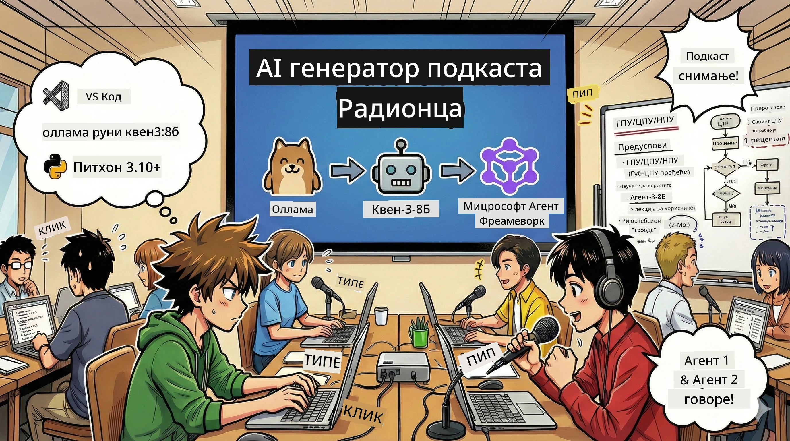
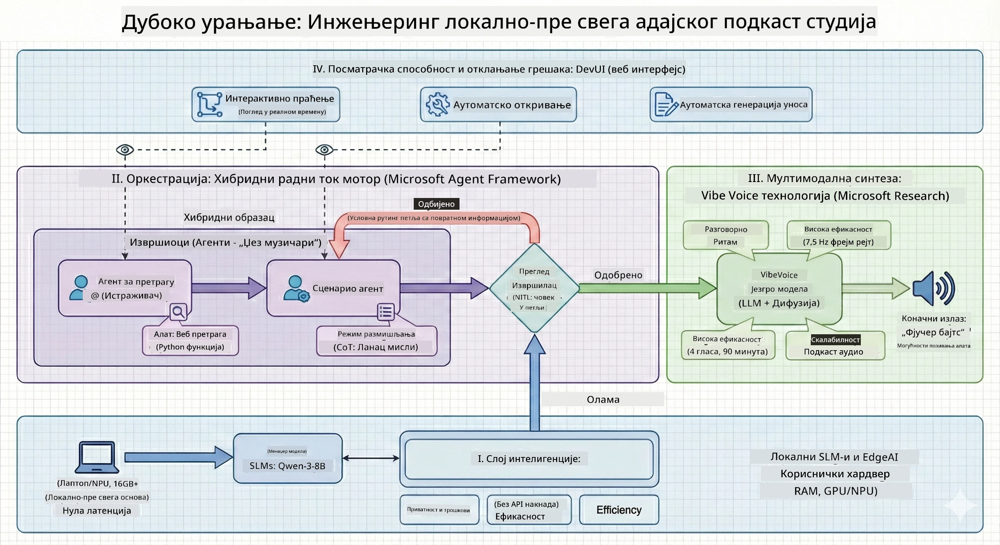

<!--
CO_OP_TRANSLATOR_METADATA:
{
  "original_hash": "f94e745264597bc5d8df967ead2eff97",
  "translation_date": "2026-01-05T10:53:38+00:00",
  "source_file": "WorkshopForAgentic/README.md",
  "language_code": "sr"
}
-->
# 🎙️ Радионица Студија за AI Подкаст

> 🌏 [中文版 (Кинеска верзија)](translation/zh-cn/README.md)



## Ваша Мисија

Добродошли у **The AI Podcast Studio**! На кораку сте да покренете свој технолошки подкаст под називом „Future Bytes“ — али ево обрта: саздаћете тим за продукцију покретан вештачком интелигенцијом који ће вам помоћи да га направите. Није више потребно бескрајно време за истраживање, писање сценарија и монтажу звука. Уместо тога, кодаћете свој пут до постајања продуцентом подкаста са суперсилама вештачке интелигенције.

## Прича

Замислите ово: ви и ваши пријатељи желите да започнете подкаст о најзанимљивијим технолошким трендовима, али свако је заузет школом, послом или просто животом. Шта ако бисте могли да направите тим AI агената да ураде тежак посао? Један агент истражује теме, други пише занимљиве сценарије, а трећи претвара текст у природне разговоре. Звучи као научна фантастика? Хајде да то остваримо.

## Шта Ћете Ученити

На крају ове радионице, знаћете како да:
- 🤖 Покренете свој локални AI модел (без трошкова API-ја, без зависности од облака!)
- 🔧 Направите специјализоване AI агенте који заиста раде заједно
- 🎬 Креирате комплетан процес продукције подкаста од идеје до аудија

## Ваше Путовање: Три Чина



Као и свака добра прича, имамо три чина. Сваки део гради ваш AI подкаст студио корак по корак:

| Епизода | Ваша Потрага | Шта Се Догађа | Отворене Вештине |
|---------|--------------|---------------|------------------|
| **Чин 1** | [Упознајте Своје AI Асистенте](md/01.BuildAIAgentWithSLM.md) | Откривате како се праве AI агенти који могу да ћаскају, претражују интернет и чак решавају проблеме. Мислите на њих као на ваше истраживачке стажисте који никад не спавају. | 🎯 Направите првог агента<br>🛠️ Дайте му суперснаге (алате!)<br>🧠 Научите га да размишља<br>🌐 Повежите га на интернет |
| **Чин 2** | [Саздајте Продукцијски Тим](md/02.AIAgentOrchestrationAndWorkflows.md) | Сада ствари постају занимљиве! Координирате више AI агената да раде заједно као прави тим подкаста. Један истражује, други пише, ви одобравате — тимски рад постиже циљеве. | 🎭 Координација више агената<br>🔄 Израда тока одобрења<br>🖥️ Тестирање са DevUI интерфејсом<br>✋ Чување људске контроле |
| **Чин 3** | [Оживите Свој Подкаст](md/03.Multi-SpeakerPodcastGenerationWithVibeVoice.md) | Финале! Претворите своје текстуалне сценарије у прави аудио подкаст са реалистичним гласовима и природним разговорима. Ваш подкаст „Future Bytes“ је спреман за публиковање! | 🎤 Магија текста у говор<br>👥 Гласови вишеструких говорника<br>⏱️ Дуга аудио трака<br>🚀 Потпуна аутоматизација |

Сваки чин откључава нове способности. Ако сте храбри, можете прескочити напред, али препоручујемо да пратите причу!

## Захтеви Окружења

Ова радионица подржава разна хардверска окружења:
- **CPU**: Погодно за тестирање и мале скале коришћења
- **GPU**: Препоручује се за продукцијска окружења, значајно побољшава брзину извођења
- **NPU**: Подржава убрзање наредне генерације неуронских процесора

## Шта Ћете Треbati

### Листа Софвера ✅
- **Python 3.10+** (ваш језик за програмирање)
- **Ollama** (покреће AI моделе на вашем рачунару)
- **VS Code** (ваш едитор кода)
- **Python екстензија** (чини VS Code паметнијим)
- **Git** (за преузимање кода)

### Провера Хардвера 💻
- **Могу ли ово да покренем?**: 8GB RAM, 10GB слободног простора (ради, али можда споро)
- **Идеално подешавање**: 16GB+ RAM, пристојан GPU (глатко извођење!)
- **Имате NPU?**: Још боље! Откључана перформанса наредне генерације 🚀

## Поставите Ваш Студио 🎬

### Корак 1: Оснаживање Python-а

Уверите се да имате Python 3.10 или новији:

```bash
python --version
# Треба да приказује Python 3.10.x или новију верзију
```

Немате Python? Преузмите га са [python.org](https://python.org) — бесплатан је!

### Корак 2: Преузмите Ollama (ваш покретач AI модела)

Идите на [ollama.ai](https://ollama.ai) и преузмите Ollama за свој ОС. Можете га замислити као мотор који локално покреће ваше AI моделе.

Проверите да ли је спремно:

```bash
ollama --version
```

### Корак 3: Преузмите Ваш AI Мозак 🧠

Време је да преузмете модел Qwen-3-8B (као да запошљавате свог првог AI асистента):

```bash
ollama pull qwen3:8b
```

*Ово може потрајати неколико минута. Савршено време за кафу! ☕*

### Корак 4: Поставите VS Code

Преузмите [Visual Studio Code](https://code.visualstudio.com/) ако га немате. То је најбољи едитор кода (изазивам вас 😄).

### Корак 5: Python екстензија

У VS Code:
1. Притисните `Ctrl+Shift+X` (или `Cmd+Shift+X` на Mac-у)
2. Тражите „Python“
3. Инсталирајте званичну Microsoft Python екстензију

### Корак 6: Спремни сте! 🎉

Сериозно, спремни сте да направите магију вештачке интелигенције!

### Корак 7: Инсталирајте Microsoft Agent Framework и Потребне Пакете 📦

Инсталирајте све неопходне зависности за радионицу:

```bash
pip install -r ./Installations/requirements.txt -U
```

*Ово ће инсталирати Microsoft Agent Framework и све потребне пакете. Узмите кафу — прво подешавање може потрајати! ☕*

## Упутства за Радионицу

Детаљна структура пројекта, кораци конфигурације и начини извођења биће објашњени корак по корак током радионице.

## Решавање Проблема (Када Ствари Пођу По Злу) 🔧

### „Уф, преузимање модела траје вечно!“
**Решење**: Користите VPN или конфигуришите Ollama са огледалним сервером. Понекад интернет једноставно некако не сарађује.

### „Мој рачунар се гаси! Немам меморију!“
**Решење**: Прелазак на мањи модел или подешавање `num_ctx` да користи мање меморије. Мислите на то као да дајете AI-у дијету.

### „Могу ли да убрзам са мојим GPU-ом?“
**Решење**: Ollama аутоматски детектује GPU! Само проверите да ли су драјвери ажурирани. Бесплатан убрзавач! 🏎️

## Додатни Ресурси (За Радознале) 📚

- [Ollama Docs](https://github.com/ollama/ollama) — Дубински преглед локалних AI модела
- [Microsoft Agent Framework](https://microsoft.github.io/autogen/) — Сазнајте више о састављању тимова агената
- [Qwen Model Info](https://qwenlm.github.io/) — Упознајте мозак вашег AI асистента

## Лиценца

MIT лиценца — правите кул ствари, делите их, учините свет бољим! 🌍

## Желите да допринесете?

Пронашли сте грешку? Имате идеју? Отворите Ишију или PR! Волимо заједницу. ✨

---

<!-- CO-OP TRANSLATOR DISCLAIMER START -->
**Одрицање од одговорности**:
Овај документ је преведен помоћу АИ услуге за превођење [Co-op Translator](https://github.com/Azure/co-op-translator). Иако се трудимо да превод буде прецизан, молимо вас да имате у виду да аутоматски преводи могу садржати грешке или нетачности. Изворни документ на његовом матичном језику треба сматрати ауторитетом. За критичне информације препоручује се професионални превод који обавља човек. Не сносимо одговорност за било какве неразумевања или погрешна тумачења настала коришћењем овог превода.
<!-- CO-OP TRANSLATOR DISCLAIMER END -->