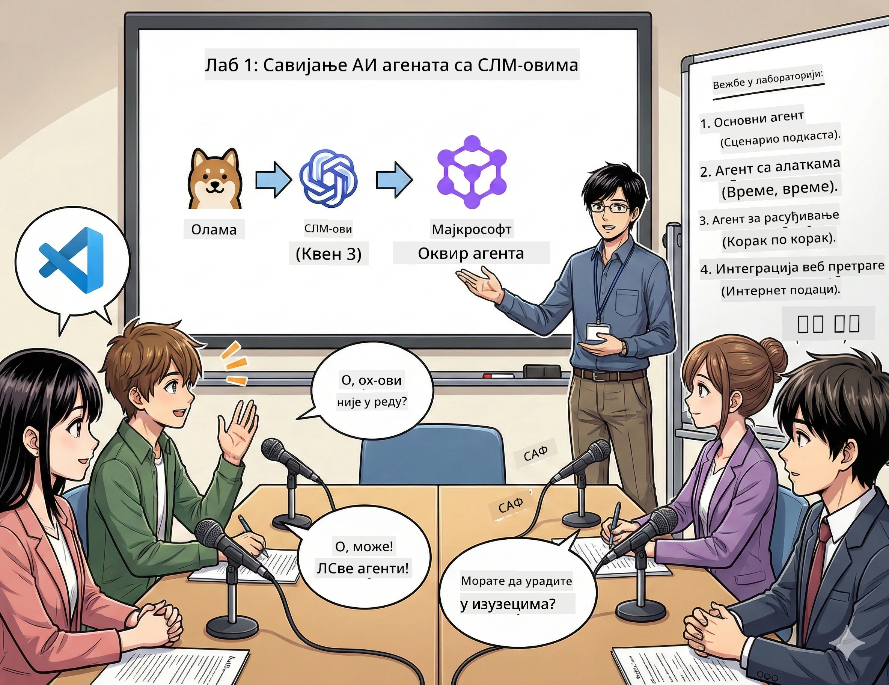

# Чин 1: Упознајте свог AI истраживачког асистента 🤖

## Изазов

Покрећете "Future Bytes", свој нови технолошки подкаст. Епизода 1 је о најновијим достигнућима у области AI, али имате 24 сата да:
1. Истражите тему
2. Пронађете поуздане изворе
3. Напишете занимљив сценарио
4. Учините да звучи природно

**Заплет:** Не морате то радити сами. Окрећете се да направите свог првог AI асистента који може помоћи у свему овоме. Назовимо га Алекс — ваш неуморни партнер за истраживање који никада не треба спавати.

## Зашто мали језички модели? (Спојлер: Они су одлични)

Замислите мале језичке моделе (SLM) као свог личног AI који живи на *вашем* рачунару. Без облака, без месечних накнада, без сумњивог дељења података.

**Зашто су SLM 🔥:**
- **🏠 Ради на вашем уређају**: Лаптоп, десктоп, чак и моћни Raspberry Pi
- **💸 Нема сталних трошкова**: Нема API накнада да вам поједу новац за ручак
- **🔒 Приватност на првом месту**: Ваша подаци никада не напуштају уређај
- **⚡ Блиц брзина**: Без кашњења интернета, тренутни одговори
- **🪦 Лаган**: 1B-10B параметара у односу на 100B+ код великих модела

**Популарни SLM-ови**: Qwen 3, Phi-4, Gemma 3 (ми користимо Qwen за ову радионицу)

## Ваш алат

### Ollama: Ваш менаџер AI модела

[Ollama](https://ollama.com/) је као Steam за AI моделе. Преузимајте, покрећите и управљајте моделима једноставним командама.

**Шта га чини кул:**
- Једна команда за преузимање и покретање било ког модела
- Ради на Mac, Windows, Linux
- Аутоматски користи вашу GPU ако је имате
- Врло ефикасан у коришћењу меморије

### Microsoft Agent Framework: Где се дешава магија

[Microsoft Agent Framework](https://github.com/microsoft/agent-framework) је ваше игралиште за прављење AI агената који могу:

- 💬 Причати и памтити о чему сте разговарали
- 🛠️ Користити прилагођене алате (као претрага веба или провера времена)
- 🧠 Решавати сложене проблеме корак по корак
- 🤝 Радити са другим агентима као тим
- 🔌 Повезивати се са различитим AI провајдерима (OpenAI, Ollama, Azure)

**Грађевински блокови:**
- **Агенти**: Ваши AI асистенти са специфичним задацима
- **Алатке**: Посебне вештине које им дајете
- **Меморија**: Да не забораве ваш разговор
- **Разумевање**: Учите их да размишљају, не само да одговарају

## Ваш тренинг монтаж: 4 задатка

### Задатак 1: Направите свог првог агента

📓 [Отворите свеску](../code/01.BasicAgent/00.BasicAgent-agent.ipynb)

**Задај:** Направите Алекса, свог AI сценаристу за подкаст. Алекс треба да генерише дијалог између два водитеља који расправљају о технолошким темама.

**Шта ћете научити:**
- Како пробудити AI агента (једноставније него што је устајање у понедељак)
- Дати му личност и упутства
- Наговорити га да генерише праве сценарије за подкаст
- Разумети шта вам изговара назад

**Услов победе**: Алекс креира сценарио за вашу пилот епизоду "Future Bytes" о AI-ју! 🎯

### Задатак 2: Дајте Алексу супермоћи (Алатке!)

📓 [Отворите свеску](../code/01.BasicAgent/01.BasicAgent-tools.ipynb)

**Задај:** Алекс је паметан, али не зна какво је време данас или колико је сати. Хајде да му дамо алатке!

**Шта ћете научити:**
- Направити прилагођене Python функције као "алатке"
- Нека Алекс одлучује *када* да користи коју алатку
- Гледајте како аутономно решава проблеме
- Комбиновање више алатки за комплексне задатке

**Услов победе**: Питајте "Какво је време у Токију?" и Алекс сам нађе одговор! ☁️

### Задатак 3: Научите Алекса да размишља

📓 [Отворите свеску](../code/01.BasicAgent/02.BasicAgent-reasoning.ipynb)

**Задај:** Наговорите Алекса да покаже свој рад. Када решавате проблеме, желите да видите *како* размишља, не само одговор.

**Шта ћете научити:**
- Активирати "режим размишљања" (као да показујете рад на часу математике)
- Видео корак по корак процес размишљања Алекса
- Разумети „ланца размишљања“ (chain-of-thought prompting)
- Решавати проблеме кад се Алекс збуни

**Услов победе**: Питајте тешки математички задатак и гледајте како Алекс размишља! 🧠

### Задатак 4: Повежите Алекса на интернет

📓 [Отворите свеску](../code/01.BasicAgent/03.BasicAgent-websearch.ipynb)

**Задај:** Знање Алекса има рок важности. Повежимо га на веб за информације у реалном времену!

**Шта ћете научити:**
- Направити прилагођени алат за претрагу на вебу
- Интегрисати спољне API-је
- Лепо руковати грешкама мреже
- Добити информације изван Алексових тренинг података

**Услов победе**: Питајте за данашње технолошке вести и добијте свеже резултате! 📰

## Пре него што почнете 🚀

**Потребна опрема**:
- Инсталиран Python 3.10+
- Ollama ради (проверите са `ollama --version`)
- VS Code са Python екстензијом
- Најмање 8GB RAM (16GB ако желите глатко искуство)

## Редослед задатака

Пратите свеске по реду ради целе приче:

1. [00.BasicAgent-agent.ipynb](../code/01.BasicAgent/00.BasicAgent-agent.ipynb) — Упознајте Алекса (ваш први агент)
2. [01.BasicAgent-tools.ipynb](../code/01.BasicAgent/01.BasicAgent-tools.ipynb) — Временa за надоградњу!
3. [02.BasicAgent-reasoning.ipynb](../code/01.BasicAgent/02.BasicAgent-reasoning.ipynb) — Научите Алекса да размишља
4. [03.BasicAgent-websearch.ipynb](../code/01.BasicAgent/03.BasicAgent-websearch.ipynb) — Интернет приступ откључан!

## Шта ћете савладати

Након Чина 1, бићете у стању да:

- ✅ Покренете AI моделе на свом хардверу (без облака!)
- ✅ Направите агенте са прилагођеним личностима и вештинама
- ✅ Дате агентима алатке да решавају стварне проблеме
- ✅ Наговорите агенте да покажу свој процес размишљања
- ✅ Повежете агенте са спољним изворима података
- ✅ Решите проблеме када нешто крене по злу

## Када нешто крене наопако (и како то поправити) 🔧

### "Алекс се не учитава! Мањак меморије!"
**Решење**: Ваш рачунар се бори. Покушајте да затворите друге апликације или прелазите на мањи модел. 8GB RAM је апсолутни минимум.

### "Алекс је тако спор"
**Решење**: Укључите GPU акцелерацију у Ollama подешавањима. Или смањите величину коңтекстног прозора. Мод за тркачке брзине укључен! 🏎️

### "Алатке не раде!"
**Решење**: Проверите своје дефиниције функција. Алекс треба исправне типовске указатеље да разуме шта алат ради. Размислите као да му дајете јасна упутства.

## Корисни линкови 🔗

- [Agent Framework Docs](https://github.com/microsoft/agent-framework) — Службени водичи и примери
- [Ollama Model Library](https://ollama.com/library) — Прегледајте све доступне моделе
- [Qwen Model](https://ollama.com/library/qwen3) — Упознајте "мозак" свог AI
- [Code Examples](https://github.com/microsoft/agent-framework/tree/main/python/samples) — Позајмљивање идеја

## Следеће: Чин 2 🎬

Имаш једног агента. А шта ако имаш *тим* агената који раде заједно? У Чину 2 ћеш направити цео тим за продукцију подкаста:
- **Истраживачки агент**: Проналази најбоље изворе
- **Сценариста агент**: Саставља савршени сценарио  
- **Уредник (ти!)**: Одобрава или захтева измене

Хајде да изведемо мало AI магије! → [Чин 2: Саставите свој продукцијски тим](02.AIAgentOrchestrationAndWorkflows.md)

---

**Запело?** Постављајте питања током радионице. Заједно учимо! 🙌

---

<!-- CO-OP TRANSLATOR DISCLAIMER START -->
**Ограничење одговорности**:
Овај документ је преведен помоћу AI преводилачке услуге [Co-op Translator](https://github.com/Azure/co-op-translator). Иако настојимо да будемо прецизни, имајте у виду да аутоматски преводи могу садржати грешке или нетачности. Изворни документ на његовом оригиналном језику треба сматрати званичним извором. За критичне информације препоручује се професионални људски превод. Не сносимо одговорност за било каква неразумевања или погрешна тумачења настала употребом овог превода.
<!-- CO-OP TRANSLATOR DISCLAIMER END -->