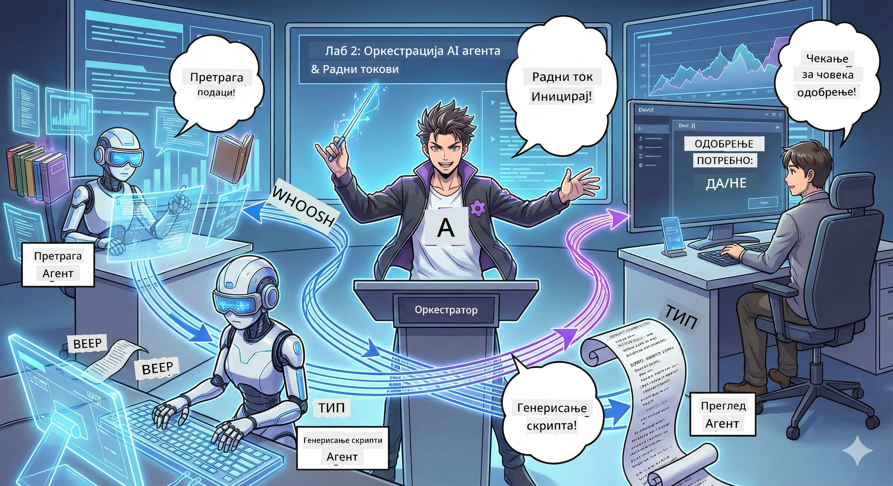

<!--
CO_OP_TRANSLATOR_METADATA:
{
  "original_hash": "2a2578dc4f813ca93ca7952d842a4b59",
  "translation_date": "2026-01-05T15:20:46+00:00",
  "source_file": "WorkshopForAgentic/translation/zh-cn/02.AIAgentOrchestrationAndWorkflows.md",
  "language_code": "sr"
}
-->
# Други чин: Формирај свој тим за продукцију подкаста 🎬



## Ескалација заплета

Алекс (твој AI асистент из првог чина) је сјајан, али један агент не може водити цео подкаст студио. Треба ти *тим*:
- 🔍 **Истраживачки агент**: претражује интернет да пронађе свежe информацијe
- ✍️ **Сценарио агент**: претвара истраживања у занимљивe разговорe
- 👤 **Ти (уредник)**: одобраваш сценарио или га враћаш на преправку

Добродошао у **AI оркестрацију агената** – ти си режисер свог AI тима. Замисли Осветнике, али за продукцију подкаста.

## Шта је оркестрација агената? (једноставна верзија)

Замисли да водиш ресторан. Не радиш све сам, зар не? Имаш:
- 🍳 Кувара који спрема храну
- 👨‍🍳 Помоћног кувара који припрема састојке
- 👩‍🍳 Конобара који служи

Оркестрација агената је иста идеја, али са AI. Сваки агент има своју специјалност, а ти их координишеш да остваре већи циљ. Ни један агент није преплављен, посао се обавља брже.

### Поређење са бендом 🎸

Твоји AI агенти су као бенд:
- **Вокал**: главни агент који рукује задацима према кориснику
- **Бубњар**: одржава ритам, ради позадинске процесе
- **Бас гитариста**: пружа подршку свима, дохвата податке
- **Ти (менаџер бенда)**: координишеш све!

Нема координације? Само бука. Имаш оркестрацију? Прелепа музика.

### Зашто је ово важно

Један AI агент који покушава све = оптерећење. Специјализовани агенти који раде заједно = максимална ефикасност! 🚀

**Искрено**: сећаш ли се како је било покушавати сам да истражујеш, пишеш и уређујеш свој подкаст? Да, то је било лоше. Са оркестрацијом, сваки агент ради оно у чему је најбољи. Ти само доносиš коначну одлуку.

**Пример из стварног света**: бот за корисничку подршку зна када да обради рачун, када техничко питање и када да позове човека. То је оркестрација!

## Агент против радног тока: Која је разлика?

Размишљај ово:

### 🤖 AI агент = џез музичар
- **Импровизација** заснована на ономе што чује
- **Креирање у моменту** користећи своје алате
- **Размишљање** са LLM мозгом
- **Прилагодљивост** на све што му бациш

### 🎵 Радни ток = оркестар који свира класичну музику
- **Прати нотни запис** (предефинисане кораке)
- **Предвидљив пут извођења**
- **Координише** више агената, људи, система
- **Структура као рецепт**

**Магија**: Радни ток *оркестрира* агенте! Ти правиш радни ток који каже агентима када да делују. Најбоље из оба света. 🎭

## Три начина да координираш свој AI тим

### 1. 🎯 Централизовано (ти си шеф)

Главни агент даје наређења. Замисли да водиш тим – ти одлучујеш ко шта ради и када.

**Предности**:
- ✅ Јасно вођство (без конфузије)
- ✅ Усклађене одлуке
- ✅ Једноставно за дебаговање

**Погодно за**:
- Рутацију корисничке подршке ("Је ли ово рачун или техничка подршка?")
- Радне токове одобрења садржаја ("Да ли је овај сценарио одобрен?")
- Производњу подкаста (управо оно што ми градимо!)

### 2. 🤝 Децентрализовано (агенти се сами организују)

Агенти причају међусобно директно и заједнички решавају проблеме. Као тим у сарадничком чету.

**Предности**:
- ✅ Лако се проширује (могуће додати више агената у било ком тренутку)
- ✅ Нема појединачне тачке квара
- ✅ Агенти се природно сарађују

**Погодно за**:
- Истраживачке тимове (сваки агент прегледа различите изворе)
- Састанке идеја
- Распоређено решавање проблема

### 3. 🔀 Хибридно (најбоље из оба света)

Ти задајеш општи правац, али агенти имају слободу у самоорганизацији задатака. Као CEO који верује свом тиму.

**Идеално за**: сложене пројекте који захтевају контролу и флексибилност.

## Microsoft Agent Framework: твој скуп алата за оркестрацију 🧰

Време је за градњу! Ово ћеш користити:

### Компоненте за градњу

#### 1. 🧱 Извршиоци (твоји радници)
- **Шта су**: појединачне радне јединице – могу бити агенти или прилагођена логика
- **Шта раде**: примају улаз, раде задатке и дају излаз
- **Замисли их као**: радне станице на покретној траци

#### 2. ➡️ Ивице (повезнице)
- **Шта су**: путеви између извршилаца
- **Шта раде**: контролишу проток порука ("После А идеш у Б")
- **Замисли их као**: стрелице на дијаграму

#### 3. 🗺️ Радни ток (укупни план)
- **Шта је**: читав граф извршилаца и ивица
- **Шта ради**: дефинише цео процес од почетка до краја
- **Замисли као**: твој план продуције

### Фантастичне функције које ћеш волети

**🛡️ Типска сигурност**: поруке између агената су типски провераване. Нема "упс, погрешан тип података" изненађења.

**🔀 Флексибилно усмеравање**:
- If-then услови ("ако је одобрено, објави; иначе, преправи")
- Паралелна обрада (много агената ради истовремено)
- Динамички путеви (радни ток се прилагођава резултатима)

**🔌 Спољне интеграције**:
- Повезивање API-ја
- Додавање „човек у петљи“ тачака (ти одобраваш пре објаве)
- Грађење тока захтева/одговора

**💾 Контролне тачке**: сачувај напредак! Ако нешто падне, настави одатле где си стао.

**🤝 Координација више агената**:
- Редоследно извођење (А → Б → Ц)
- Паралелно извођење (А + Б + Ц истовремено)
- Предаја између агената
- Заједнички рад

## Најбоље праксе (стручни савети) 🎯

### 1. Чувај модуларност
Сваки агент треба да ради једну ствар стварно добро. Немој правити "супер агента" који ради све – пожалићеш се кад дебагујеш.

### 2. Планирај за грешке
Агенти могу да се збуне. Мрежа може пукнути. Направи руковање грешкама и резервне планове. Ти из будућности ћеш бити захвалан.

### 3. Надгледај све
Прати шта твоји агенти раде. Користи DevUI (послаћемо о томе!) да видиш радни ток у акцији.

### 4. Оптимизуј величину порука
Не шаљи велике датотеке између агената. Држи поруке мале и брзе.

### 5. Изабери прави модел
Треба ти контрола? Централизовано. Треба ти скалабилност? Децентрализовано. Не знаш? Хибридно!

## DevUI: твој дебагер радног тока 🔍

### Шта је DevUI?

DevUI је као игралиште за тестирање твојих агената и радних токова. То је веб интерфејс где можеш:
- 👀 Пратити како радни ток ради
- 💬 Чаврљати директно са агентима
- 🔍 Решавати проблеме кад нешто крене по злу
- 📊 Видети праћење и перформансе

> **Важно**: DevUI је само за развој! Немој га користити у продукцији. Замисли га као твоје локално тест окружење.

### Зашто је одличан

- **🖥️ Интерактивни веб UI**: кликај, уноси, тестирај – без командне линије
- **📁 Спреман за повлачење и испуштање**: отпремај фајлове, тестирај различите уносе
- **📂 Аутоматско откривање**: усмери на фасциклу, аутоматски налази све агенте
- **📋 Нема потребе за поставкама**: региструј агенте у коду, без структуре фасцикле
- **🔌 Компатибилан са OpenAI**: ради са OpenAI SDK (да здраво компатибилност!! ) 
- **👁️ Уграђено праћење**: види тачно шта агенти раде

### Како функционишу улази

DevUI паметно рукује улазима:

- **Тестираш агента?** Имаш текстуално поље и дугме за отпремање датотека
- **Тестираш радни ток?** UI аутоматски генерише поља улазa на основу шта радни ток очекује

Као магија, али то је само добра кода. ✨

## Твој задатак: Изгради студио за подкаст 🎬

### Задатак 1: Креирај једног агента користећи DevUI

📂 [01.AgentDevUI](../../../../../WorkshopForAgentic/code/02.Workflow/01.AgentDevUI)

**Изазов**: Пре него што саставиш цео тим, хајде да тестираш DevUI једним агентом: експерт за претрагу интернета.

**Шта правиш**:
Агент који може претраживати интернет и тражити теме за подкаст. Тестират ћеш га преко DevUI веб интерфејса `http://localhost:8090`.

**Шта ћеш научити**:
- 🚀 Покрени агента у DevUI
- 🔍 Тестирај одговоре агента у реалном времену
- 🛠️ Направи прилагођени алат (претрага интернета)
- 📊 Укључи праћење за дебаг
- 🖥️ Користи интерактивни веб UI

**Код**:
- `agent.py`: твој SearchAgent са супер способностима претраге интернета
- Повезивање на Qwen користећи OllamaChatClient
- Имплементација алатке `web_search()`
- Покретање помоћу `serve()` – аутоматско отварање DevUI

**Услов за успех**: Питај свог агента "Који су трендови у AI области?" и гледај како претражује интернет! 🎉

### Задатак 2: Креирај радни ток са више агената

📂 [02.WorkflowDevUI](../../../../../WorkshopForAgentic/code/02.Workflow/02.WorkflowDevUI)

**Изазов**: Прави забавни део почиње! Изгради целокупан радни ток за продукцију подкаста:
1. 🔍 **Истраживачки агент** → истражи своју тему
2. ✍️ **Сценарио агент** → напиши разговор између два водитеља (на кинеском!)
3. 👤 **Извршилац прегледа** → тражи твоје одобрење или одбијање
4. 🔄 **Повратна петља** → ако одбијеш, препиши према твом фидбеку

**Шта ћеш научити**:
- 🧱 Креирање специфичних агената за различите задатке
- 🔗 Коришћење WorkflowBuilder-а за повезивање агената
- 🔀 Имплементација петље одобрења (човек у петљи!)
- 🚦 Условно рутирање (одобри против одбиј)
- 🔧 Направи прилагођене извршиоце за пословну логику

**Радни ток**:
```
SearchAgent → ScriptAgent → ReviewExecutor
                             ↑          ↓ (如果被拒绝)
                             ←─────────
```

**Код**:
- `search_agent/agent.py`: твој експерт за истраживање
- `generate_script_agent/agent.py`: твој аутор сценарија (пише на кинеском!)
- `workflow/workflow.py`: магија оркестрације овде
- `main.py`: покреће све у DevUI

**Услов за успех**: Додели тему, прегледај сценарио, једном одбиј ради тестирања петље, онда одобри! 🎉

### Задатак 3: Направи конзолну апликацију

📂 [03.Application](../../../../../WorkshopForAgentic/code/02.Workflow/03.Application)

**Изазов**: Претвори свој радни ток из DevUI у хладну терминалну апликацију са шареним излазом, ротатором учитавања и чувањем у фајл. Ово је продукцијски спремно!

**Шта ћеш научити**:
- ⚡ Покрени радни ток програмски (без DevUI)
- 📡 Користи догађајно вођену архитектуру са стримингом
- 🎨 Направи леп UI у терминалу (боје, ротатор, прогрес бар)
- 💾 Сачувај коначни сценарио у фајл
- 🔄 Управљај асинхроним радним током коришћењем Python asyncio

**Шта ради**:
1. Пита те за тему подкаста
2. Приказује напредак уживо ("Истраживачки агент ради...")
3. Приказује сценарио у боји
4. Тражи твоје одобрење
5. Чува одобрени сценарио у `podcast.txt`

**Код**:
- `podcast_app.py`: твоја главна апликација са руковањем догађајима
- `workflow.py`: реупотреба радног тока из задатка 2
- Обрада догађаја: `AgentRunUpdateEvent`、`RequestInfoEvent`、`WorkflowOutputEvent`
- Користите ANSI боје за стилове терминала

**Услов победе**: Покрените апликацију, направите сценарио за подкаст и видите да је сачуван! Управо сте направили прави алат.🚀

## Шта сте већ савладали 🏆

Након друге сцене, можете:

- ✅ Организовати више AI агената као шеф
- ✅ Конструисати радне токове са секвенцом и условном логиком
- ✅ Додати тачке за људску одобрење
- ✅ Тестирати и отклањати радне токове помоћу DevUI
- ✅ Креирати апликацију за производну конзолу
- ✅ Елегантно рукујте грешкама у сложеним системима
- ✅ Изабрати исправан модел оркестрације за било који пројекат

## Када нешто пође по злу 🔧

### "Мој радни ток је превише компликован!"
**Решење**: Поделите га на мање подрадне токове. Сваки радни ток треба да ради једну ствар. Када је потребно, повежите их заједно.

### "Не могу да пратим шта се дешава!"
**Решење**: Користите тачке контроле радног тока за чување стања. Укључите праћење у DevUI да видите сваки корак.

### "Грешка једног агента руши све!"
**Решење**: Додајте граничнике за грешке. Сваки агент треба да обради сопствене неуспехе и има резервни поступак.

### "Превише је споро"
**Решење**: Постоје ли агенти који могу радити паралелно? Секвенцијални радни токови су једноставни, али спори. Потражите могућности за паралелизацију!

## Корисни ресурси 🔗

- [Документација радних токова](https://learn.microsoft.com/en-us/agent-framework/user-guide/workflows/overview) —— званични Microsoft водич
- [Модели оркестрације](https://www.ibm.com/think/topics/ai-agent-orchestration) —— IBM-ов поглед
- [Agent Framework GitHub](https://github.com/microsoft/agent-framework) —— прегледајте изворни код
- [Примери кода](https://github.com/microsoft/agent-framework/tree/main/python/samples) —— позајмите моделе од овде

---

**Спремни за завршни чин?** Имаш сценарио. Сада хајде да га претворимо у стварни аудио!→ [Трећа сцена: Оживи свој подкаст](03.Multi-SpeakerPodcastGenerationWithVibeVoice.md) 🎤

---

**Заглавили сте се? Збуњени сте? Узбуђени сте?** Поделите у чету радионице! Учимо заједно.🚀

---

<!-- CO-OP TRANSLATOR DISCLAIMER START -->
**Одрицање од одговорности**:  
Овај документ је преведен коришћењем AI услуге за превођење [Co-op Translator](https://github.com/Azure/co-op-translator). Иако настојимо да превод буде што прецизнији, имајте у виду да аутоматски преводи могу садржати грешке или нетачности. Изворни документ на његовом оригиналном језику треба сматрати коначним и званичним извором. За критичне информације препоручује се професионални људски превод. Не сносимо одговорност за било каква неспоразума или погрешна тумачења настала коришћењем овог превода.
<!-- CO-OP TRANSLATOR DISCLAIMER END -->