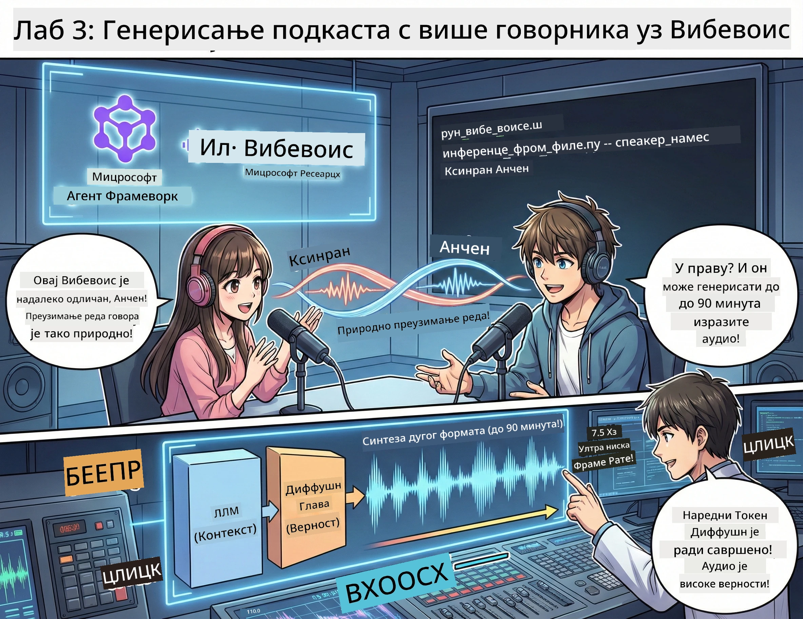

<!--
CO_OP_TRANSLATOR_METADATA:
{
  "original_hash": "d5c8bb53a007e77e7f8afe3067e64c55",
  "translation_date": "2026-01-05T16:14:01+00:00",
  "source_file": "WorkshopForAgentic/translation/zh-cn/03.Multi-SpeakerPodcastGenerationWithVibeVoice.md",
  "language_code": "sr"
}
-->
# Трећа акта: Оживи свој подкаст 🎤



## Финале

Ти си већ истраживао тему. Ти си већ написао сценарио. Сада је време за круну: претвори свој текст у стварни подкаст са реалистичним гласом!

Упознај **VibeVoice** — отворени TTS (текст у говор) систем из Microsoft Research-а који ствара:
- 🎭 Природно текуће дијалоге
- 👥 Више говорника (до 4!)
- ⏱️ Дугачке аудио записе (до 90 минута!)
- 🎵 Експресивно извођење (није роботски глас!)

Ово је технологија иза синтетисаних подкаста. Хајде да направимо твој!

## Шта је VibeVoice? (супер ствар)

VibeVoice је поклон свету од Microsoft Research-а. Дизајниран је за подкаст стил говорних аудио записа.

### Зашто је сјајан 🔥

* **⏱️ Маратон сесије**: генерише до 90 минута континуираног говора (то је цео епизод подкаста!)
* **👥 Чаробни више говорника**: до 4 различита гласа са конзистентним карактером
* **⚡ Врло ефикасан**: користи изузетно ниску фреквенцију фрејмова од 7.5 Hz да уштеди ресурсе
* **🧠 Интелигентан аудио**: комбинује LLM (разумевање контекста) и моделе дифузије (стварна аудио синтеза)
* **🎭 Природан и текућ**: аутоматски управља променама говора, паузама и ритмом дијалога

**Превод:** VibeVoice не само чита сценарио — он га *изводи* као стварна особа.

---

## Пре него што почнеш 🚀

**Шта ти треба**:

* 🐍 **Python 3.10+** (већ имаш из прве и друге акте)
* 🚀 **uv** (брзи Python пакет менаџер — инсталираћемо га)
* 📝 **Твој сценарио**: `podcast.txt` из друге акте (у `../03.Application/`)

**Стручни савет**: Овај корак захтева добру интернет везу за преузимање предучитаних модела. Уживај у кафи! ☕

---

## Хајде! Једноставни начин 🎬

Пошли смо једноставно. Један shell скрипт ради све.

### Процес

1. **Направи га извршним**:
```bash
chmod +x run_vibe_voice.sh
```

2. **Покрени га**:
```bash
./run_vibe_voice.sh
```

3. **Чекај магију** (први пут може потрајати неколико минута)

### Шта се дешава иза сцене 🎭

Скрипта је у основи твој ауто звук инжењер:

1. **📥 Преузима VibeVoice**: клонира званични репозиторијум са GitHub-а
2. **📦 Инсталира зависности**: користи `uv pip` за брзу инсталацију пакета
3. **🎬 Генерише аудио**: покреће скрипту за инференцију са:
   * `--model_path`: предучитани модел VibeVoice-7B
   * `--txt_path`: твој `podcast.txt` сценарио
   * `--speaker_names`: додељује гласове (подразумевано Xinran и Anchen)

**Резултат**: твој сценарио постаје стварни епизод подкаста! 🎉

---

## Твој изазов 🎯

Хајде да ово учинимо забавним:

### Задаци 1: Креирај садржај
Уреди `../03.Application/podcast.txt` као дијалог између двоје људи. Може бити о технологији, хобијима, било чему! Само нека буде дијалог.

**Пример формата**:
```
说话人 1：嘿！你听说新的 AI 模型了吗？
说话人 2：不会吧！告诉我更多！
说话人 1：它叫...
```

### Задаци 2: Генериши аудио
Покрени скрипту и посматрај како се магија дешава. Први пут ће требати мало дуже (због преузимања модела).

### Задаци 3: Слушај и анализирај
- Звучи ли природно?
- Имају ли говорници различите гласове?
- Да ли је прелаз између говорника текућ?
- Има ли момената када звучи као робот?

### Задаци 4: Експериментиши (за храбре)
Уреди `run_vibe_voice.sh` и промени `--speaker_names` да пробаш друге комбинације гласова. VibeVoice има више предучитаних гласова!

**Изазов за награду**: пробај дијалог са 3 говорника! 🎆

---

## Сазнај више 📚

* **🏠 Почетна страница пројекта**: [VibeVoice званични сајт](https://microsoft.github.io/VibeVoice/)
* **🤗 Предучитани модели**: [Hugging Face - VibeVoice-7B](https://huggingface.co/vibevoice/VibeVoice-7B)
* **📖 Научни рад**: дубље разумевање технологије (ако те занима)

> **⚠️ ОDGOVORNA AI Порука**: VibeVoice је моћан. Користи га етично! Немој правити дубоке фалсификате или заблуду. Креирај кул ствари које помажу људима. 🙏

---

## 🏆 Честитамо! Урадио си то!

Ти си управо завршио цео процес:
1. ✅ **Прва акта**: Конструисање AI агента уз прилагођене алате
2. ✅ **Друга акта**: Оркестрација више агената
3. ✅ **Трећа акта**: Генерисање стварног подкаст аудио записа

**Сада имаш**:
- Ефикасног AI истраживачког помоћника
- Комплетан ток рада продукције подкаста
- Стварне аудио датотеке за дељење

### Шта следи? 🚀

**Објави свој подкаст!**
- Постави га на платформе за подкасте
- Подели на друштвеним мрежама
- Итеративно унапређуј

**Настави да градиш!**
- Испробавај различите теме
- Експериментиши са више говорника
- Додај позадинску музику
- Изгради веб интерфејс
- Аутоматизуј цео процес

**Подели свој рад!**
Ознаци нас! Покажи свету шта си направио. AI револуција у подкастима почиње од тебе. 🎙️

---

**Питања? Идеје? Успешне приче?** Постави их у ћаскању радионице!

**Добродошао у будућност креирања садржаја.** 🌟

---

<!-- CO-OP TRANSLATOR DISCLAIMER START -->
**Резервисање одговорности**:
Овај документ је преведен помоћу AI сервиса за превођење [Co-op Translator](https://github.com/Azure/co-op-translator). Иако тежимо прецизности, имајте у виду да аутоматски преводи могу садржати грешке или нетачности. Изворни документ на његовом оригиналном језику треба сматрати ауторитетним извором. За критичне информације препоручује се професионални превод од стране људског стручњака. Ми нисмо одговорни за било каква неспоразуми или погрешна тумачења настала коришћењем овог превода.
<!-- CO-OP TRANSLATOR DISCLAIMER END -->