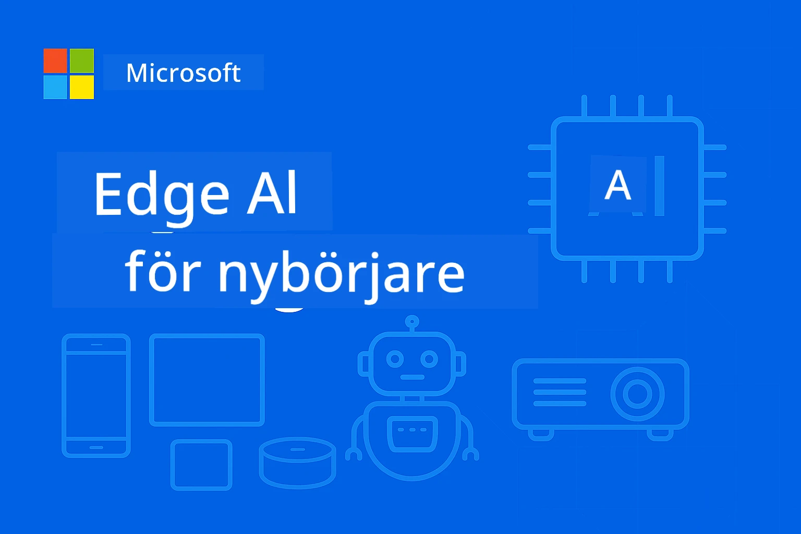

# EdgeAI för nybörjare 




[](https://GitHub.com/microsoft/edgeai-for-beginners/graphs/contributors)
[](https://GitHub.com/microsoft/edgeai-for-beginners/issues)
[](https://GitHub.com/microsoft/edgeai-for-beginners/pulls)
[](http://makeapullrequest.com)

[](https://GitHub.com/microsoft/edgeai-for-beginners/watchers)
[](https://GitHub.com/microsoft/edgeai-for-beginners/fork)
[](https://GitHub.com/microsoft/edgeai-for-beginners/stargazers)


[](https://discord.gg/nTYy5BXMWG)

Följ dessa steg för att komma igång med dessa resurser:

1. **Forka Repositoriet**: Klicka [](https://GitHub.com/microsoft/edgeai-for-beginners/fork)
2. **Klona Repositoriet**:   `git clone https://github.com/microsoft/edgeai-for-beginners.git`
3. [**Gå med i Azure AI Foundry Discord och träffa experter och andra utvecklare**](https://discord.com/invite/ByRwuEEgH4)


### 🌐 Flerspråkigt stöd

#### Stöds via GitHub Action (Automatiserat & Alltid Uppdaterat)

<!-- CO-OP TRANSLATOR LANGUAGES TABLE START -->
[Arabic](../ar/README.md) | [Bengali](../bn/README.md) | [Bulgarian](../bg/README.md) | [Burmese (Myanmar)](../my/README.md) | [Chinese (Simplified)](../zh-CN/README.md) | [Chinese (Traditional, Hong Kong)](../zh-HK/README.md) | [Chinese (Traditional, Macau)](../zh-MO/README.md) | [Chinese (Traditional, Taiwan)](../zh-TW/README.md) | [Croatian](../hr/README.md) | [Czech](../cs/README.md) | [Danish](../da/README.md) | [Dutch](../nl/README.md) | [Estonian](../et/README.md) | [Finnish](../fi/README.md) | [French](../fr/README.md) | [German](../de/README.md) | [Greek](../el/README.md) | [Hebrew](../he/README.md) | [Hindi](../hi/README.md) | [Hungarian](../hu/README.md) | [Indonesian](../id/README.md) | [Italian](../it/README.md) | [Japanese](../ja/README.md) | [Kannada](../kn/README.md) | [Korean](../ko/README.md) | [Lithuanian](../lt/README.md) | [Malay](../ms/README.md) | [Malayalam](../ml/README.md) | [Marathi](../mr/README.md) | [Nepali](../ne/README.md) | [Nigerian Pidgin](../pcm/README.md) | [Norwegian](../no/README.md) | [Persian (Farsi)](../fa/README.md) | [Polish](../pl/README.md) | [Portuguese (Brazil)](../pt-BR/README.md) | [Portuguese (Portugal)](../pt-PT/README.md) | [Punjabi (Gurmukhi)](../pa/README.md) | [Romanian](../ro/README.md) | [Russian](../ru/README.md) | [Serbian (Cyrillic)](../sr/README.md) | [Slovak](../sk/README.md) | [Slovenian](../sl/README.md) | [Spanish](../es/README.md) | [Swahili](../sw/README.md) | [Swedish](./README.md) | [Tagalog (Filipino)](../tl/README.md) | [Tamil](../ta/README.md) | [Telugu](../te/README.md) | [Thai](../th/README.md) | [Turkish](../tr/README.md) | [Ukrainian](../uk/README.md) | [Urdu](../ur/README.md) | [Vietnamese](../vi/README.md)

> **Föredrar du att klona lokalt?**

> Detta repositorium inkluderar översättningar på över 50 språk vilket ökar nedladdningsstorleken avsevärt. För att klona utan översättningar, använd sparse checkout:
> ```bash
> git clone --filter=blob:none --sparse https://github.com/microsoft/edgeai-for-beginners.git
> cd edgeai-for-beginners
> git sparse-checkout set --no-cone '/*' '!translations' '!translated_images'
> ```
> Det ger dig allt du behöver för att genomföra kursen med mycket snabbare nedladdning.
<!-- CO-OP TRANSLATOR LANGUAGES TABLE END -->

**Om du önskar få stöd för fler språk finns de listade [här](https://github.com/Azure/co-op-translator/blob/main/getting_started/supported-languages.md)**
## Introduktion

Välkommen till **EdgeAI för nybörjare** – din omfattande resa in i den transformerande världen av Edge Artificiell Intelligens. Denna kurs bygger en bro mellan kraftfulla AI-funktioner och praktisk, verklig implementering på edge-enheter, vilket ger dig möjligheten att utnyttja AI:s potential direkt där data skapas och beslut måste fattas.

### Vad du kommer att behärska

Denna kurs tar dig från grundläggande koncept till produktionsklara implementationer och täcker:
- **Små språkmodeller (SLM)** optimerade för edge-implementation
- **Hårdvaruoptimering** över olika plattformar
- **Realtidsinferens** med sekretessbevarande funktioner
- **Produktionssättningsstrategier** för företagsapplikationer

### Varför EdgeAI är viktigt

Edge AI representerar ett paradigmskifte som adresserar viktiga moderna utmaningar:
- **Sekretess & Säkerhet**: Bearbeta känslig data lokalt utan exponering mot molnet
- **Realtidsprestanda**: Eliminera nätverksfördröjning för tidskritiska applikationer
- **Kostnadseffektivitet**: Minska bandbredd och molndatorresursernas kostnader
- **Robusta operationer**: Upprätthåll funktionalitet vid nätverksavbrott
- **Regulatorisk efterlevnad**: Uppfyll datasuveränitetskrav

### Edge AI

Edge AI avser att köra AI-algoritmer och språkmodeller lokalt på hårdvara, nära där data genereras utan att förlita sig på molntjänster för inferens. Det minskar latens, förbättrar sekretessen och möjliggör beslut i realtid.

### Kärnprinciper:
- **Inferens på enheten**: AI-modeller körs på edge-enheter (telefoner, routrar, mikrokontroller, industriella PC)
- **Offlinekapacitet**: Fungerar utan ständig internetuppkoppling
- **Låg latens**: Omedelbara svar anpassade för realtidssystem
- **Datasuveränitet**: Behåller känslig data lokalt för bättre säkerhet och efterlevnad

### Små språkmodeller (SLM)

SLM:er som Phi-4, Mistral-7B och Gemma är optimerade versioner av större LLM:er – tränade eller destillerade för:
- **Minskad minnesanvändning**: Effektiv användning av begränsat minne på edge-enheter
- **Lägre beräkningskrav**: Optimerade för CPU och edge-GPU-prestanda
- **Snabbare uppstartstider**: Snabb initiering för responsiva applikationer

De låser upp kraftfulla NLP-funktioner samtidigt som de möter begränsningarna för:
- **Inbyggda system**: IoT-enheter och industriella styrsystem
- **Mobila enheter**: Smartphones och surfplattor med offline-funktion
- **IoT-enheter**: Sensorer och smarta enheter med begränsade resurser
- **Edge-servrar**: Lokala processorenheter med begränsade GPU-resurser
- **Persondatorer**: Stationära och bärbara datorer för implementering

## Kursmoduler & Navigering

| Modul | Ämne | Fokusområde | Viktigt Innehåll | Nivå | Tid |
|--------|-------|------------|-------------|--------|----------|
| [📖 00 ](./introduction.md) | [Introduktion till EdgeAI](./introduction.md) | Grund & Kontext | EdgeAI Översikt • Branschapplikationer • SLM Introduktion • Lärandemål | Nybörjare | 1-2 timmar |
| [📚 01](../../Module01) | [EdgeAI Grunder](./Module01/README.md) | Moln vs Edge AI jämförelse | EdgeAI Grundläggande • Fallstudier från verkligheten • Implementeringsguide • Edge-implementering | Nybörjare | 3-4 timmar |
| [🧠 02](../../Module02) | [SLM Modellgrunder](./Module02/README.md) | Modellfamiljer & arkitektur | Phi-familjen • Qwen-familjen • Gemma-familjen • BitNET • μModel • Phi-Silica | Nybörjare | 4-5 timmar |
| [🚀 03](../../Module03) | [SLM Implementeringspraktik](./Module03/README.md) | Lokal & molnimplementering | Avancerat lärande • Lokal miljö • Molnimplementering | Mellan | 4-5 timmar |
| [⚙️ 04](../../Module04) | [Verktyg för modelloptimering](./Module04/README.md) | Plattformoberoende optimering | Introduktion • Llama.cpp • Microsoft Olive • OpenVINO • Apple MLX • Arbetsflödessyntes | Mellan | 5-6 timmar |
| [🔧 05](../../Module05) | [SLMOps Produktion](./Module05/README.md) | Produktionsdrift | SLMOps Introduktion • Modelldestillering • Finjustering • Produktionssättning | Avancerad | 5-6 timmar |
| [🤖 06](../../Module06) | [AI-Agenter & Funktionsanrop](./Module06/README.md) | Agentramverk & MCP | Agentintroduktion • Funktionsanrop • Model Context Protocol | Avancerad | 4-5 timmar |
| [💻 07](../../Module07) | [Plattformsimplementering](./Module07/README.md) | Plattformoberoende exempel | AI Toolkit • Foundry Local • Windows-utveckling | Avancerad | 3-4 timmar |
| [🏭 08](../../Module08) | [Foundry Local Toolkit](./Module08/README.md) | Produktionsklara exempel | Exemplarapplikationer (se detaljer nedan) | Expert | 8-10 timmar |

### 🏭 **Modul 08: Exemplarapplikationer**

- [01: REST Chat Snabbstart](./Module08/samples/01/README.md)
- [02: OpenAI SDK Integration](./Module08/samples/02/README.md)
- [03: Modellupptäckt & Benchmarking](./Module08/samples/03/README.md)
- [04: Chainlit RAG-applikation](./Module08/samples/04/README.md)
- [05: Multi-agent Orkestrering](./Module08/samples/05/README.md)
- [06: Models-as-Tools Router](./Module08/samples/06/README.md)
- [07: Direkt API-klient](./Module08/samples/07/README.md)
- [08: Windows 11 Chat-app](./Module08/samples/08/README.md)
- [09: Avancerat Multi-agent System](./Module08/samples/09/README.md)
- [10: Foundry Tools Framework](./Module08/samples/10/README.md)

### 🎓 **Workshop: Praktisk Lärandeväg**

Omfattande workshopsmaterial med produktionsklara implementationer:

- **[Workshop-guide](./Workshop/Readme.md)** - Kompletta lärandemål, resultat och resursnavigering
- **Python-exempel** (6 sessioner) - Uppdaterade med bästa praxis, felhantering och omfattande dokumentation
- **Jupyter Notebooks** (8 interaktiva) - Steg-för-steg handledningar med benchmarks och prestandaövervakning
- **Sessionsguider** - Detaljerade markdown-guider för varje workshop-session
- **Valideringsverktyg** - Skript för att verifiera kodkvalitet och köra snabbtester

**Det du kommer att bygga:**
- Lokala AI-chattapplikationer med strömningsstöd
- RAG-pipelines med kvalitetsutvärdering (RAGAS)
- Benchmarking- och jämförelseverktyg för flera modeller
- Multi-agent orkestreringssystem
- Intelligent modellroutning med uppgiftsbaserat urval

### 🎙️ **Workshop För Agentic: Praktiskt – AI Podcast Studio**

Bygg en AI-driven podcastproduktionspipeline från grunden! Denna fördjupande workshop lär dig skapa ett komplett multi-agent system som förvandlar idéer till professionella podcastavsnitt.
**[🎬 Starta AI Podcast Studio Workshop](./WorkshopForAgentic/README.md)**

**Din mission**: Lansera "Future Bytes" — en teknikpodcast helt driven av AI-agenter som du bygger själv. Inga molnära beroenden, inga API-kostnader — allt körs lokalt på din dator.

**Vad som gör detta unikt:**
- **🤖 Verklig Multi-Agent Orkestrering** - Bygg specialiserade AI-agenter som forskar, skriver och producerar ljud
- **🎯 Komplett produktionsflöde** - Från ämnesval till slutgiltig podcastljudsoutput
- **💻 100% Lokal distribution** - Använder Ollama och lokala modeller (Qwen-3-8B) för fullständig integritet och kontroll
- **🎤 Text-till-tal integration** - Förvandla manus till naturljudande flerspråkiga konversationer
- **✋ Människa-i-loopen arbetsflöden** - Godkännandepunkter säkerställer kvalitet samtidigt som automatisering bibehålls

**En treakters läranderesa:**

| Akt | Fokus | Nyckelkompetenser | Varaktighet |
|-----|-------|------------------|--------------|
| **[Akt 1: Träffa dina AI-assistenter](./WorkshopForAgentic/md/01.BuildAIAgentWithSLM.md)** | Bygg din första AI-agent | Verktygsintegration • Webbsökning • Problemlösning • Agent-baserat resonemang | 2-3 tim |
| **[Akt 2: Sätt ihop ditt produktionsteam](./WorkshopForAgentic/md/02.AIAgentOrchestrationAndWorkflows.md)** | Orkestrera flera agenter | Teamkoordinering • Godkännandearbetsflöden • DevUI-gränssnitt • Mänsklig översikt | 3-4 tim |
| **[Akt 3: Ge liv åt din podcast](./WorkshopForAgentic/md/03.Multi-SpeakerPodcastGenerationWithVibeVoice.md)** | Generera podcastljud | Text-till-tal • Flerspråkig syntes • Långformigt ljud • Fullständig automatisering | 2-3 tim |

**Använda teknologier:**
- **Microsoft Agent Framework** - Multi-agent orkestrering och koordinering
- **Ollama** - Local AI-modell runtime (ingen molnkrav)
- **Qwen-3-8B** - Open source språkmodell optimerad för agentuppgifter
- **Text-till-tal API:er** - Naturlig röstsyntes för podcastgenerering

**Hårdvarustöd:**
- ✅ **CPU-läge** - Fungerar på alla moderna datorer (8GB+ RAM rekommenderas)
- 🚀 **GPU-acceleration** - Betydligt snabbare inferens med NVIDIA/AMD GPU:er
- ⚡ **NPU-stöd** - Nästa generations neural processor accelerering

**Perfekt för:**
- Utvecklare som lär sig multi-agent AI-system
- Alla intresserade av AI-automatisering och arbetsflöden
- Innehållsskapare som utforskar AI-assisterad produktion
- Studenter som studerar praktiska AI-orkestreringsmönster

**Börja bygga**: [🎙️ AI Podcast Studio Workshop →](./WorkshopForAgentic/README.md)

### 📊 **Sammanfattning av lärandestig**
- **Total varaktighet**: 36-45 timmar
- **Nybörjarstig**: Moduler 01-02 (7-9 timmar)  
- **Mellanliggande stig**: Moduler 03-04 (9-11 timmar)
- **Avancerad stig**: Moduler 05-07 (12-15 timmar)
- **Expertstig**: Modul 08 (8-10 timmar)

## Vad du kommer bygga

### 🎯 Kärnkompetenser
- **Edge AI-arkitektur**: Designa lokalt-först AI-system med molnintegration
- **Modelloptimering**: Kvantifiera och komprimera modeller för edge-distribution (85% snabbare, 75% mindre storlek)
- **Multi-plattformsdistribution**: Windows, mobil, inbyggt och moln-edge hybrid system
- **Produktionsoperationer**: Övervakning, skalning och underhåll av edge AI i produktion

### 🏗️ Praktiska projekt
- **Foundry Local Chat-appar**: Windows 11 native-app med modellväxling
- **Multi-Agent System**: Koordinator med specialistagenter för komplexa arbetsflöden  
- **RAG-applikationer**: Lokal dokumentbearbetning med vektorsökning
- **Modellroutrar**: Intelligent val mellan modeller baserat på uppgiftsanalys
- **API-ramverk**: Produktionsklara klienter med streaming och hälsomonitorering
- **Cross-Platform Tools**: Integrationsmönster med LangChain/Semantic Kernel

### 🏢 Branschapplikationer
**Tillverkning** • **Vård** • **Autonoma fordon** • **Smarta städer** • **Mobila appar**

## Snabbstart

**Rekommenderad lärandestig** (20-30 timmar totalt):

0. **📖 Introduktion** ([Introduction.md](./introduction.md)): EdgeAI-grunder + branschkontext + läranderamverk  
1. **📚 Grundläggande** (Moduler 01-02): EdgeAI-koncept + SLM modellfamiljer  
2. **⚙️ Optimering** (Moduler 03-04): Distribution + kvantiseringsramverk  
3. **🚀 Produktion** (Moduler 05-06): SLMOps + AI-agenter + funktionsanrop  
4. **💻 Implementering** (Moduler 07-08): Plattformexempel + Foundry Local verktygslåda

Varje modul innehåller teori, praktiska övningar och produktionsfärdiga kodexempel.

## Karriäreffekt

**Tekniska roller**: EdgeAI Solutions Architect • ML Engineer (Edge) • IoT AI-utvecklare • Mobil AI-utvecklare

**Branschsektorer**: Manufacturing 4.0 • HealthTech • Autonoma system • FinTech • Konsumentelektronik

**Portföljprojekt**: Multi-agent system • Produktions-RAG-appar • Cross-platform-distribution • Prestandaoptimering

## Repositoriumstruktur

```
edgeai-for-beginners/
├── 📖 introduction.md  # Foundation: EdgeAI Overview & Learning Framework
├── 📚 Module01-04/     # Fundamentals → SLMs → Deployment → Optimization  
├── 🔧 Module05-06/     # SLMOps → AI Agents → Function Calling
├── 💻 Module07/        # Platform Samples (VS Code, Windows, Jetson, Mobile)
├── 🏭 Module08/        # Foundry Local Toolkit + 10 Comprehensive Samples
│   ├── samples/01-06/  # Foundation: REST, SDK, RAG, Agents, Routing
│   └── samples/07-10/  # Advanced: API Client, Windows App, Enterprise Agents, Tools
├── 🌐 translations/    # Multi-language support (8+ languages)
└── 📋 STUDY_GUIDE.md   # Structured learning paths & time allocation
```

## Kursens höjdpunkter

✅ **Progressivt lärande**: Teori → Praktik → Produktionsdistribution  
✅ **Autentiska fallstudier**: Microsoft, Japan Airlines, företagsimplementationer  
✅ **Praktiska exempel**: 50+ exempel, 10 omfattande Foundry Local demos  
✅ **Prestandafokus**: 85% snabbare, 75% mindre storlek  
✅ **Multi-plattform**: Windows, mobil, inbyggt, moln-edge hybrid  
✅ **Produktionsredo**: Övervakning, skalning, säkerhet, efterlevnadsramverk

📖 **[Studievägledning finns](STUDY_GUIDE.md)**: Strukturerad 20-timmars lärandestig med tidsplanering och självbedömningsverktyg.

---

**EdgeAI representerar framtiden för AI-distribution**: lokal-först, integritetsbevarande och effektivt. Mästra dessa färdigheter för att bygga nästa generation intelligenta applikationer.

## Andra kurser

Vårt team producerar fler kurser! Kolla in:

<!-- CO-OP TRANSLATOR OTHER COURSES START -->
### LangChain
[](https://aka.ms/langchain4j-for-beginners)
[](https://aka.ms/langchainjs-for-beginners?WT.mc_id=m365-94501-dwahlin)

---

### Azure / Edge / MCP / Agenter
[](https://github.com/microsoft/AZD-for-beginners?WT.mc_id=academic-105485-koreyst)
[](https://github.com/microsoft/edgeai-for-beginners?WT.mc_id=academic-105485-koreyst)
[](https://github.com/microsoft/mcp-for-beginners?WT.mc_id=academic-105485-koreyst)
[](https://github.com/microsoft/ai-agents-for-beginners?WT.mc_id=academic-105485-koreyst)

---
 
### Generativ AI-serie
[](https://github.com/microsoft/generative-ai-for-beginners?WT.mc_id=academic-105485-koreyst)
[-9333EA?style=for-the-badge&labelColor=E5E7EB&color=9333EA)](https://github.com/microsoft/Generative-AI-for-beginners-dotnet?WT.mc_id=academic-105485-koreyst)
[-C084FC?style=for-the-badge&labelColor=E5E7EB&color=C084FC)](https://github.com/microsoft/generative-ai-for-beginners-java?WT.mc_id=academic-105485-koreyst)
[-E879F9?style=for-the-badge&labelColor=E5E7EB&color=E879F9)](https://github.com/microsoft/generative-ai-with-javascript?WT.mc_id=academic-105485-koreyst)

---
 
### Kärnlärande
[](https://aka.ms/ml-beginners?WT.mc_id=academic-105485-koreyst)
[](https://aka.ms/datascience-beginners?WT.mc_id=academic-105485-koreyst)
[](https://aka.ms/ai-beginners?WT.mc_id=academic-105485-koreyst)
[](https://github.com/microsoft/Security-101?WT.mc_id=academic-96948-sayoung)
[](https://aka.ms/webdev-beginners?WT.mc_id=academic-105485-koreyst)
[](https://aka.ms/iot-beginners?WT.mc_id=academic-105485-koreyst)
[](https://github.com/microsoft/xr-development-for-beginners?WT.mc_id=academic-105485-koreyst)

---
 
### Copilot-serie
[](https://aka.ms/GitHubCopilotAI?WT.mc_id=academic-105485-koreyst)
[](https://github.com/microsoft/mastering-github-copilot-for-dotnet-csharp-developers?WT.mc_id=academic-105485-koreyst)
[](https://github.com/microsoft/CopilotAdventures?WT.mc_id=academic-105485-koreyst)
<!-- CO-OP TRANSLATOR OTHER COURSES END -->

## Få hjälp

Om du fastnar eller har några frågor om att bygga AI-appar, gå med i:

[](https://discord.gg/nTYy5BXMWG)

Om du har produktfeedback eller fel medan du bygger, besök:

[](https://aka.ms/foundry/forum)

---

<!-- CO-OP TRANSLATOR DISCLAIMER START -->
**Friskrivning**:
Detta dokument har översatts med hjälp av AI-översättningstjänsten [Co-op Translator](https://github.com/Azure/co-op-translator). Även om vi strävar efter noggrannhet, vänligen var medveten om att automatiska översättningar kan innehålla fel eller brister. Det ursprungliga dokumentet på dess modersmål bör betraktas som den auktoritativa källan. För kritisk information rekommenderas professionell mänsklig översättning. Vi ansvarar inte för några missförstånd eller feltolkningar som uppstår till följd av användningen av denna översättning.
<!-- CO-OP TRANSLATOR DISCLAIMER END -->