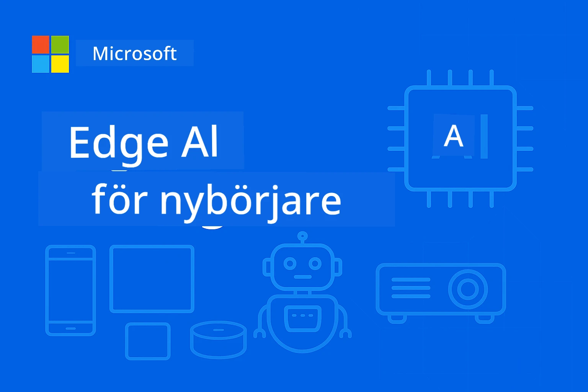

# EdgeAI för nybörjare 




[](https://GitHub.com/microsoft/edgeai-for-beginners/graphs/contributors)
[](https://GitHub.com/microsoft/edgeai-for-beginners/issues)
[](https://GitHub.com/microsoft/edgeai-for-beginners/pulls)
[](http://makeapullrequest.com)

[](https://GitHub.com/microsoft/edgeai-for-beginners/watchers)
[](https://GitHub.com/microsoft/edgeai-for-beginners/fork)
[](https://GitHub.com/microsoft/edgeai-for-beginners/stargazers)


[](https://discord.gg/nTYy5BXMWG)

Följ dessa steg för att komma igång med att använda dessa resurser:

1. **Fork:a arkivet**: Klicka [](https://GitHub.com/microsoft/edgeai-for-beginners/fork)
2. **Klona arkivet**:   `git clone https://github.com/microsoft/edgeai-for-beginners.git`
3. [**Gå med i Azure AI Foundry Discord för att träffa experter och andra utvecklare**](https://discord.com/invite/ByRwuEEgH4)


### 🌐 Fler-språkigt stöd

#### Stöds via GitHub Action (Automatiserat & Alltid Uppdaterat)

<!-- CO-OP TRANSLATOR LANGUAGES TABLE START -->
[Arabiska](../ar/README.md) | [Bengali](../bn/README.md) | [Bulgarska](../bg/README.md) | [Burmese (Myanmar)](../my/README.md) | [Kinesiska (Förenklad)](../zh-CN/README.md) | [Kinesiska (Traditionell, Hong Kong)](../zh-HK/README.md) | [Kinesiska (Traditionell, Macau)](../zh-MO/README.md) | [Kinesiska (Traditionell, Taiwan)](../zh-TW/README.md) | [Kroatiska](../hr/README.md) | [Tjeckiska](../cs/README.md) | [Danska](../da/README.md) | [Holländska](../nl/README.md) | [Estniska](../et/README.md) | [Finska](../fi/README.md) | [Franska](../fr/README.md) | [Tyska](../de/README.md) | [Grekiska](../el/README.md) | [Hebreiska](../he/README.md) | [Hindi](../hi/README.md) | [Ungerska](../hu/README.md) | [Indonesiska](../id/README.md) | [Italienska](../it/README.md) | [Japanska](../ja/README.md) | [Kannada](../kn/README.md) | [Khmer](../km/README.md) | [Koreanska](../ko/README.md) | [Litauiska](../lt/README.md) | [Malajiska](../ms/README.md) | [Malayalam](../ml/README.md) | [Marathi](../mr/README.md) | [Nepali](../ne/README.md) | [Nigeriansk Pidgin](../pcm/README.md) | [Norska](../no/README.md) | [Persiska (Farsi)](../fa/README.md) | [Polska](../pl/README.md) | [Portugisiska (Brasilien)](../pt-BR/README.md) | [Portugisiska (Portugal)](../pt-PT/README.md) | [Punjabi (Gurmukhi)](../pa/README.md) | [Rumänska](../ro/README.md) | [Ryska](../ru/README.md) | [Serbiska (Kyrilliska)](../sr/README.md) | [Slovakiska](../sk/README.md) | [Slovenska](../sl/README.md) | [Spanska](../es/README.md) | [Swahili](../sw/README.md) | [Svenska](./README.md) | [Tagalog (Filippinska)](../tl/README.md) | [Tamil](../ta/README.md) | [Telugu](../te/README.md) | [Thailändska](../th/README.md) | [Turkiska](../tr/README.md) | [Ukrainska](../uk/README.md) | [Urdu](../ur/README.md) | [Vietnamesiska](../vi/README.md)

> **Föredrar du att klona lokalt?**
>
> Detta arkiv innehåller över 50 språköversättningar som avsevärt ökar nedladdningsstorleken. För att klona utan översättningar, använd sparsam utcheckning:
>
> **Bash / macOS / Linux:**
> ```bash
> git clone --filter=blob:none --sparse https://github.com/microsoft/edgeai-for-beginners.git
> cd edgeai-for-beginners
> git sparse-checkout set --no-cone '/*' '!translations' '!translated_images'
> ```
>
> **CMD (Windows):**
> ```cmd
> git clone --filter=blob:none --sparse https://github.com/microsoft/edgeai-for-beginners.git
> cd edgeai-for-beginners
> git sparse-checkout set --no-cone "/*" "!translations" "!translated_images"
> ```
>
> Detta ger dig allt du behöver för att slutföra kursen med en mycket snabbare nedladdning.
<!-- CO-OP TRANSLATOR LANGUAGES TABLE END -->

**Om du vill ha ytterligare översättningsspråk stöds de listade [här](https://github.com/Azure/co-op-translator/blob/main/getting_started/supported-languages.md)**
## Introduktion

Välkommen till **EdgeAI för nybörjare** – din omfattande resa in i den transformerande världen av Edge Artificiell Intelligens. Den här kursen överbryggar klyftan mellan kraftfulla AI-möjligheter och praktisk, verklig användning på edge-enheter, och ger dig möjlighet att utnyttja AI:s potential direkt där data genereras och beslut måste fattas.

### Vad Du Kommer Behärska

Denna kurs tar dig från grundläggande koncept till produktionsklara implementationer, och täcker:
- **Små språkmodeller (SLMs)** optimerade för edge-distribution
- **Hårdvaru-medveten optimering** över olika plattformar
- **Real-tidsinferens** med integritetsbevarande kapacitet
- **Strategier för produktionsdistribution** för företagsanvändningar

### Varför EdgeAI är Viktigt

Edge AI representerar ett paradigmskifte som hanterar viktiga moderna utmaningar:
- **Integritet & Säkerhet**: Bearbeta känslig data lokalt utan molnexponering
- **Prestanda i realtid**: Eliminera nätverkslatens för tidkritiska applikationer
- **Kostnadseffektivitet**: Minska bandbredd och molndatakostnader
- **Robust drift**: Upprätthåll funktionalitet vid nätverksavbrott
- **Reglerings efterlevnad**: Uppfyll krav på datasuveränitet

### Edge AI

Edge AI avser att köra AI-algoritmer och språkmodeller lokalt på hårdvara, nära där data genereras utan att förlita sig på molnresurser för inferens. Det minskar latens, förbättrar integriteten och möjliggör beslut i realtid.

### Kärnprinciper:
- **Inferens på enheten**: AI-modeller körs på edge-enheter (telefoner, routrar, mikrokontroller, industri-PC:er)
- **Offline-förmåga**: Fungerar utan stadig internetuppkoppling
- **Låg latens**: Omedelbara svar anpassade för realtidssystem
- **Datasuveränitet**: Håller känslig data lokal, vilket förbättrar säkerhet och efterlevnad

### Små Språkmodeller (SLMs)

SLMs som Phi-4, Mistral-7B och Gemma är optimerade versioner av större LLMs – tränade eller destillerade för:
- **Minskat minnesavtryck**: Effektiv användning av begränsat minne på edge-enheter
- **Lägre beräkningsbehov**: Optimerade för CPU- och edge GPU-prestanda
- **Snabbare uppstartstider**: Snabb initialisering för responsiva applikationer

De öppnar kraftfulla NLP-funktioner samtidigt som de möter begränsningarna för:
- **Inbyggda system**: IoT-enheter och industriella styrsystem
- **Mobila enheter**: Smartphones och surfplattor med offline-funktionalitet
- **IoT-enheter**: Sensorer och smarta enheter med begränsade resurser
- **Edge-servrar**: Lokala bearbetningsenheter med begränsade GPU-resurser
- **Persondatorer**: Stationära och bärbara datorer i distributionsscenarier

## Kursmoduler & Navigering

| Modul | Ämne | Fokusområde | Nyckelinnehåll | Nivå | Varaktighet |
|--------|-------|------------|-------------|--------|----------|
| [📖 00 ](./introduction.md) | [Introduktion till EdgeAI](./introduction.md) | Grund & Kontext | EdgeAI Översikt • Branschapplikationer • SLM-introduktion • Lärandemål | Nybörjare | 1-2 tim |
| [📚 01](../../Module01) | [Grundläggande EdgeAI](./Module01/README.md) | Jämförelse moln vs edge AI | EdgeAI Grunder • Verkliga fallstudier • Implementeringsguide • Edge-distribution | Nybörjare | 3-4 tim |
| [🧠 02](../../Module02) | [SLM Modellgrunder](./Module02/README.md) | Modellfamiljer & arkitektur | Phi-familjen • Qwen-familjen • Gemma-familjen • BitNET • μModel • Phi-Silica | Nybörjare | 4-5 tim |
| [🚀 03](../../Module03) | [SLM-distribution praktik](./Module03/README.md) | Lokal & moln-distribution | Avancerat lärande • Lokal miljö • Moln-distribution | Mellanliggande | 4-5 tim |
| [⚙️ 04](../../Module04) | [Verktyg för modelloptimering](./Module04/README.md) | Plattform-överskridande optimering | Introduktion • Llama.cpp • Microsoft Olive • OpenVINO • Apple MLX • Arbetsflödessyntes | Mellanliggande | 5-6 tim |
| [🔧 05](../../Module05) | [SLMOps produktion](./Module05/README.md) | Produktionsdrift | SLMOps introduktion • Modelldestillering • Finjustering • Produktionsdistribution | Avancerad | 5-6 tim |
| [🤖 06](../../Module06) | [AI-agenter & Funktionsanrop](./Module06/README.md) | Agentramverk & MCP | Agentintroduktion • Funktionsanrop • Modellkontextprotokoll | Avancerad | 4-5 tim |
| [💻 07](../../Module07) | [Plattformsimplementation](./Module07/README.md) | Plattformexempel | AI Toolkit • Foundry Local • Windows-utveckling | Avancerad | 3-4 tim |
| [🏭 08](../../Module08) | [Foundry Local Toolkit](./Module08/README.md) | Produktions-exempel | Exempelapplikationer (se nedan) | Expert | 8-10 tim |

### 🏭 **Modul 08: Exempelapplikationer**

- [01: REST Chat Kom-igång](./Module08/samples/01/README.md)
- [02: OpenAI SDK-integration](./Module08/samples/02/README.md)
- [03: Modellupptäckt & Benchmarking](./Module08/samples/03/README.md)
- [04: Chainlit RAG-applikation](./Module08/samples/04/README.md)
- [05: Multi-agentorkestrering](./Module08/samples/05/README.md)
- [06: Modeller-som-verktyg-router](./Module08/samples/06/README.md)
- [07: Direkt API-klient](./Module08/samples/07/README.md)
- [08: Windows 11 chatt-app](./Module08/samples/08/README.md)
- [09: Avancerat multi-agent system](./Module08/samples/09/README.md)
- [10: Foundry Tools Framework](./Module08/samples/10/README.md)

### 🎓 **Workshop: Praktisk inlärningsväg**

Omfattande praktiska workshopmaterial med produktionsklara implementationer:

- **[Workshop-guide](./Workshop/Readme.md)** - Kompletta lärandemål, resultat och resursnavigering
- **Python-exempel** (6 sessioner) - Uppdaterade med bästa praxis, felhantering och omfattande dokumentation
- **Jupyter-notebooks** (8 interaktiva) - Steg-för-steg-handledningar med benchmark och prestandaövervakning
- **Sessionsguider** - Detaljerade markdown-guider för varje workshop-session
- **Valideringsverktyg** - Skript för att verifiera kodkvalitet och köra röktester

**Vad Du Kommer Bygga:**
- Lokala AI-chattapplikationer med streaming-stöd
- RAG-pipelines med kvalitetsutvärdering (RAGAS)
- Multi-modell benchmark och jämförelseverktyg
- Multi-agent orkestreringssystem
- Intelligent modellroutning med uppgiftsbaserat val

### 🎙️ **Workshop För Agentic: Praktiskt - AI Podcast Studio**
Bygg en AI-driven podcastproduktionspipeline från grunden! Denna immersiva workshop lär dig skapa ett komplett multi-agent system som förvandlar idéer till professionella podcastepisoder.

**[🎬 Starta AI Podcast Studio Workshop](./WorkshopForAgentic/README.md)**

**Ditt uppdrag**: Lansera "Future Bytes" — en teknikpodcast som drivs helt av AI-agenter du själv bygger. Inga molnberoenden, inga API-kostnader — allt körs lokalt på din maskin.

**Vad som gör detta unikt:**
- **🤖 Verklig multi-agent orkestrering** - Bygg specialiserade AI-agenter som forskar, skriver och producerar ljud
- **🎯 Komplett produktionspipeline** - Från ämnesval till slutgiltig podcastljudsproduktion
- **💻 100% Lokal distribution** - Använder Ollama och lokala modeller (Qwen-3-8B) för full integritet och kontroll
- **🎤 Text-till-tal integration** - Förvandla manus till naturligt klingande flerpersonssamtal
- **✋ Mänsklig-in-the-loop arbetsflöden** - Godkännandepunkter säkerställer kvalitet samtidigt som automatiseringen bibehålls

**Tre-akters lärupplevelse:**

| Akt | Fokus | Nyckelfärdigheter | Varaktighet |
|-----|-------|-------------------|-------------|
| **[Akt 1: Möt dina AI-assistenter](./WorkshopForAgentic/md/01.BuildAIAgentWithSLM.md)** | Bygg din första AI-agent | Verktygsintegration • Webb-sökning • Problemlösning • Agentiskt resonemang | 2-3 tim |
| **[Akt 2: Sätt ihop ditt produktionsteam](./WorkshopForAgentic/md/02.AIAgentOrchestrationAndWorkflows.md)** | Orkestrera flera agenter | Teamkoordination • Godkännande-flöden • DevUI-gränssnitt • Mänsklig tillsyn | 3-4 tim |
| **[Akt 3: Ge liv åt din podcast](./WorkshopForAgentic/md/03.Multi-SpeakerPodcastGenerationWithVibeVoice.md)** | Generera podcastljud | Text-till-tal • Flerpersonssyntes • Långformat ljud • Fullständig automatisering | 2-3 tim |

**Använda teknologier:**
- **Microsoft Agent Framework** - Multi-agent orkestrering och koordinering
- **Ollama** - Lokal AI-modell runtime (inget moln behövs)
- **Qwen-3-8B** - Öppen källkod språkmodell optimerad för agentiska uppgifter
- **Text-till-tal API:er** - Naturlig röstsynthes för podcastgenerering

**Hårdvarustöd:**
- ✅ **CPU-läge** - Fungerar på vilken modern dator som helst (8GB+ RAM rekommenderas)
- 🚀 **GPU-acceleration** - Betydligt snabbare inferens med NVIDIA/AMD GPU:er
- ⚡ **NPU-stöd** - Nästa generations neuralt processorenhets-acceleration

**Perfekt för:**
- Utvecklare som lär sig multi-agent AI-system
- Alla intresserade av AI-automatisering och arbetsflöden
- Innehållsskapare som utforskar AI-assisterad produktion
- Studenter som studerar praktiska AI-orkestreringsmönster

**Börja bygga**: [🎙️ AI Podcast Studio Workshop →](./WorkshopForAgentic/README.md)

### 📊 **Sammanfattning av lärväg**
- **Total varaktighet**: 36-45 timmar
- **Nybörjarväg**: Moduler 01-02 (7-9 timmar)  
- **Mellanväg**: Moduler 03-04 (9-11 timmar)
- **Avancerad väg**: Moduler 05-07 (12-15 timmar)
- **Expertväg**: Modul 08 (8-10 timmar)

## Vad du kommer att bygga

### 🎯 Kärnkompetenser
- **Edge AI-arkitektur**: Designa lokalt-först AI-system med molnintegration
- **Modelloptimering**: Kvantisera och komprimera modeller för edge-distribution (85% snabbare, 75% mindre)
- **Multi-plattformsdistribution**: Windows, mobilt, inbyggt och moln-edge hybrider
- **Produktionsverksamhet**: Övervakning, skalning och underhåll av edge AI i produktion

### 🏗️ Praktiska projekt
- **Foundry Local Chat-appar**: Windows 11-native app med modellväxling
- **Multi-agent system**: Koordinator med specialistagenter för komplexa arbetsflöden  
- **RAG-applikationer**: Lokal dokumenthantering med vektorsökning
- **Modellruttrar**: Intelligent val mellan modeller baserat på uppgiftsanalys
- **API-ramverk**: Produktionsklara klienter med strömning och hälsokontroll
- **Korsplattformverktyg**: LangChain/Semantic Kernel integrationsmönster

### 🏢 Branschapplikationer
**Tillverkning** • **Vård** • **Autonoma fordon** • **Smarta städer** • **Mobilappar**

## Snabbstart

**Rekommenderad lärväg** (20-30 timmar totalt):

0. **📖 Introduktion** ([Introduction.md](./introduction.md)): EdgeAI-grunder + branschkontext + lärandets ramverk
1. **📚 Grund** (Moduler 01-02): EdgeAI-koncept + SLM-modellfamiljer
2. **⚙️ Optimering** (Moduler 03-04): Distribution + kvantiseringsramverk  
3. **🚀 Produktion** (Moduler 05-06): SLMOps + AI-agenter + funktionsanrop
4. **💻 Implementering** (Moduler 07-08): Plattformsexempel + Foundry Local toolkit

Varje modul innehåller teori, praktiska övningar och produktionsklara kodexempel.

## Karriäreffekt

**Tekniska roller**: EdgeAI-lösningsarkitekt • ML-ingenjör (Edge) • IoT AI-utvecklare • Mobil AI-utvecklare

**Branscher**: Tillverkning 4.0 • Vårdteknik • Autonoma system • FinTech • Konsumentelektronik

**Portföljprojekt**: Multi-agent system • Produktions-RAG-appar • Korsplattformdistribution • Prestandaoptimering

## Repositorie-struktur

```
edgeai-for-beginners/
├── 📖 introduction.md  # Foundation: EdgeAI Overview & Learning Framework
├── 📚 Module01-04/     # Fundamentals → SLMs → Deployment → Optimization  
├── 🔧 Module05-06/     # SLMOps → AI Agents → Function Calling
├── 💻 Module07/        # Platform Samples (VS Code, Windows, Jetson, Mobile)
├── 🏭 Module08/        # Foundry Local Toolkit + 10 Comprehensive Samples
│   ├── samples/01-06/  # Foundation: REST, SDK, RAG, Agents, Routing
│   └── samples/07-10/  # Advanced: API Client, Windows App, Enterprise Agents, Tools
├── 🌐 translations/    # Multi-language support (8+ languages)
└── 📋 STUDY_GUIDE.md   # Structured learning paths & time allocation
```

## Kursens höjdpunkter

✅ **Progressivt lärande**: Teori → Praktik → Produktionsdistribution  
✅ **Verkliga fallstudier**: Microsoft, Japan Airlines, företagsimplementeringar  
✅ **Praktiska exempel**: 50+ exempel, 10 omfattande Foundry Local-demonstrationer  
✅ **Prestandafokus**: 85% snabbare, 75% minskning i storlek  
✅ **Multi-plattform**: Windows, mobilt, inbyggt, moln-edge hybrid  
✅ **Produktionsklart**: Övervakning, skalning, säkerhet, regelefterlevnadsramverk

📖 **[Studiehandledning tillgänglig](STUDY_GUIDE.md)**: Strukturerad 20-timmars lärväg med tidfördelning och självbedömningsverktyg.

---

**EdgeAI representerar framtiden för AI-distribution**: lokalt-först, integritetsbevarande och effektivt. Bemästra dessa färdigheter för att bygga nästa generations intelligenta applikationer.

## Andra kurser

Vårt team producerar fler kurser! Kolla in:

<!-- CO-OP TRANSLATOR OTHER COURSES START -->
### LangChain
[](https://aka.ms/langchain4j-for-beginners)
[](https://aka.ms/langchainjs-for-beginners?WT.mc_id=m365-94501-dwahlin)
[](https://github.com/microsoft/langchain-for-beginners?WT.mc_id=m365-94501-dwahlin)
---

### Azure / Edge / MCP / Agenter
[](https://github.com/microsoft/AZD-for-beginners?WT.mc_id=academic-105485-koreyst)
[](https://github.com/microsoft/edgeai-for-beginners?WT.mc_id=academic-105485-koreyst)
[](https://github.com/microsoft/mcp-for-beginners?WT.mc_id=academic-105485-koreyst)
[](https://github.com/microsoft/ai-agents-for-beginners?WT.mc_id=academic-105485-koreyst)

---
 
### Generativ AI-serie
[](https://github.com/microsoft/generative-ai-for-beginners?WT.mc_id=academic-105485-koreyst)
[-9333EA?style=for-the-badge&labelColor=E5E7EB&color=9333EA)](https://github.com/microsoft/Generative-AI-for-beginners-dotnet?WT.mc_id=academic-105485-koreyst)
[-C084FC?style=for-the-badge&labelColor=E5E7EB&color=C084FC)](https://github.com/microsoft/generative-ai-for-beginners-java?WT.mc_id=academic-105485-koreyst)
[-E879F9?style=for-the-badge&labelColor=E5E7EB&color=E879F9)](https://github.com/microsoft/generative-ai-with-javascript?WT.mc_id=academic-105485-koreyst)

---
 
### Kärnlärande
[](https://aka.ms/ml-beginners?WT.mc_id=academic-105485-koreyst)
[](https://aka.ms/datascience-beginners?WT.mc_id=academic-105485-koreyst)
[](https://aka.ms/ai-beginners?WT.mc_id=academic-105485-koreyst)
[](https://github.com/microsoft/Security-101?WT.mc_id=academic-96948-sayoung)
[](https://aka.ms/webdev-beginners?WT.mc_id=academic-105485-koreyst)
[](https://aka.ms/iot-beginners?WT.mc_id=academic-105485-koreyst)
[](https://github.com/microsoft/xr-development-for-beginners?WT.mc_id=academic-105485-koreyst)

---
 
### Copilot-serie

[](https://aka.ms/GitHubCopilotAI?WT.mc_id=academic-105485-koreyst)
[](https://github.com/microsoft/mastering-github-copilot-for-dotnet-csharp-developers?WT.mc_id=academic-105485-koreyst)
[](https://github.com/microsoft/CopilotAdventures?WT.mc_id=academic-105485-koreyst)
<!-- CO-OP TRANSLATOR OTHER COURSES END -->

## Få Hjälp

Om du fastnar eller har några frågor om att bygga AI-appar, gå med i:

[](https://discord.gg/nTYy5BXMWG)

Om du har produktfeedback eller fel medan du bygger, besök:

[](https://aka.ms/foundry/forum)

---

<!-- CO-OP TRANSLATOR DISCLAIMER START -->
**Ansvarsfriskrivning**:
Detta dokument har översatts med hjälp av AI-översättningstjänsten [Co-op Translator](https://github.com/Azure/co-op-translator). Även om vi strävar efter noggrannhet, bör du vara medveten om att automatiska översättningar kan innehålla fel eller brister. Det ursprungliga dokumentet på dess modersmål bör betraktas som den auktoritativa källan. För viktig information rekommenderas professionell mänsklig översättning. Vi ansvarar inte för några missförstånd eller feltolkningar som uppstår från användningen av denna översättning.
<!-- CO-OP TRANSLATOR DISCLAIMER END -->