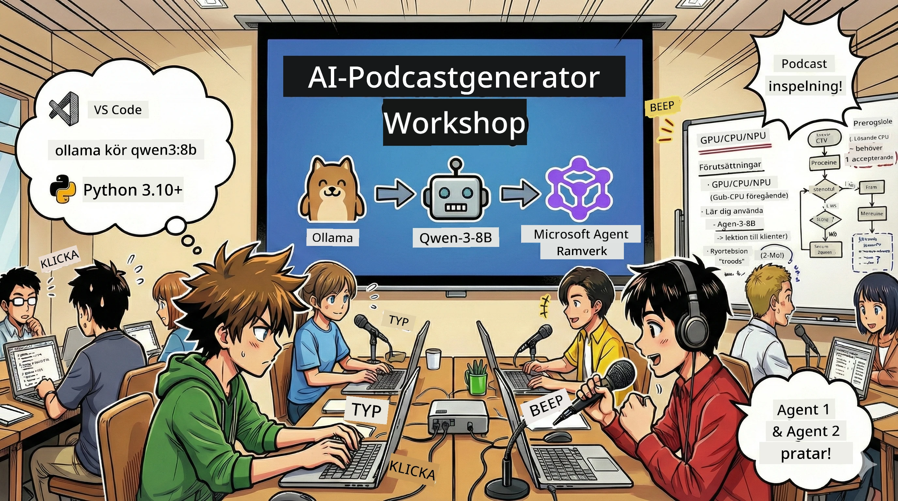
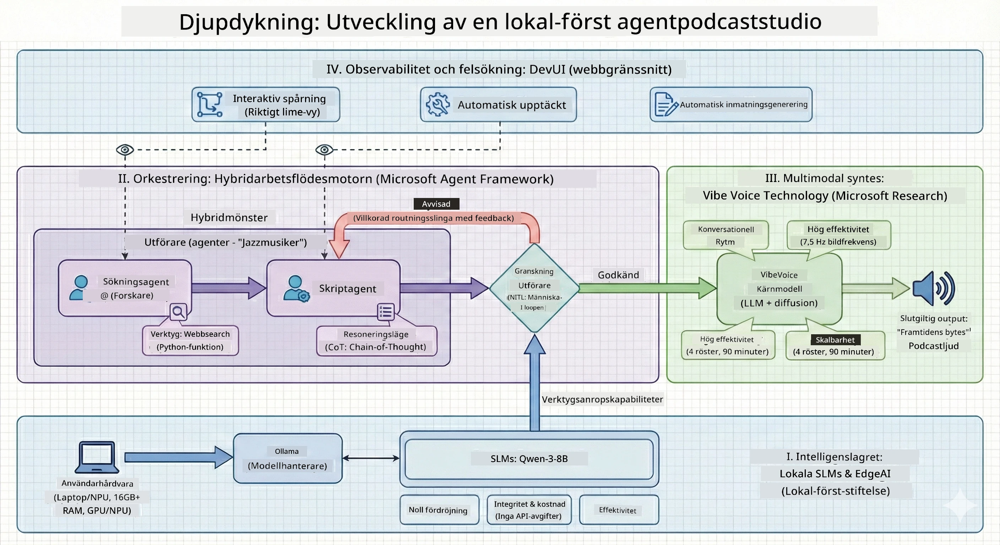

<!--
CO_OP_TRANSLATOR_METADATA:
{
  "original_hash": "f94e745264597bc5d8df967ead2eff97",
  "translation_date": "2026-01-05T10:39:48+00:00",
  "source_file": "WorkshopForAgentic/README.md",
  "language_code": "sv"
}
-->
# 🎙️ AI Podcast Studio Workshop

> 🌏 [中文版 (Chinese Version)](translation/zh-cn/README.md)



## Ditt Uppdrag

Välkommen till **AI Podcast Studio**! Du är på väg att starta din egen teknikpodd som heter "Future Bytes" — men här kommer twisten: du ska bygga ett AI-drivet produktionsteam som hjälper dig skapa den. Inga fler oändliga timmar av research, manusförfattande och ljudredigering. Istället kommer du koda dig till att bli en poddproducent med AI-superkrafter.

## Historien

Föreställ dig detta: Du och dina vänner vill starta en podd om de coolaste tekniktrenderna, men alla är upptagna med skola, jobb eller bara livet. Tänk om du kunde bygga ett team av AI-agenter som gör det tunga jobbet? En agent forskar ämnen, en annan skriver engagerande manus, och en tredje förvandlar text till naturliga samtal. Låter det som sci-fi? Låt oss göra det verkligt.

## Vad Du Kommer Lära Dig

I slutet av denna workshop kommer du kunna:
- 🤖 Köra din egen lokala AI-modell (inga API-kostnader, inget molnberoende!)
- 🔧 Bygga specialiserade AI-agenter som faktiskt samarbetar
- 🎬 Skapa en komplett podcastproduktionskedja från idé till ljud

## Din Resa: Tre Akter



Som i vilken bra berättelse som helst har vi tre akter. Var och en bygger din AI-podcaststudio bit för bit:

| Avsnitt | Din Uppgift | Vad Händer | Färdigheter du Får |
|---------|-------------|------------|--------------------|
| **Akt 1** | [Träffa Dina AI-assistenter](md/01.BuildAIAgentWithSLM.md) | Du lär dig skapa AI-agenter som kan chatta, söka på webben och till och med lösa problem. Tänk på dem som dina researchpraktikanter som aldrig sover. | 🎯 Bygg din första agent<br>🛠️ Ge den superkrafter (verktyg!)<br>🧠 Lär den tänka<br>🌐 Koppla den till internet |
| **Akt 2** | [Sätt Ihop Ditt Produktionsteam](md/02.AIAgentOrchestrationAndWorkflows.md) | Nu blir det intressant! Du kommer samordna flera AI-agenter att arbeta tillsammans som ett riktigt poddteam. En forskar, en skriver, du godkänner — teamwork gör drömmen möjlig. | 🎭 Koordinera flera agenter<br>🔄 Bygg godkännande-flöden<br>🖥️ Testa med DevUI-gränssnitt<br>✋ Behåll kontrollen hos människan |
| **Akt 3** | [Ge Liv åt Din Podcast](md/03.Multi-SpeakerPodcastGenerationWithVibeVoice.md) | Finalen! Förvandla dina manus till verkligt poddljud med realistiska röster och naturliga samtal. Din "Future Bytes"-podd är redo att släppas! | 🎤 Text-till-tal-magik<br>👥 Flera talarröster<br>⏱️ Långformigt ljud<br>🚀 Full automation |

Varje akt låser upp nya färdigheter. Hoppa gärna framåt om du är modig, men vi rekommenderar att följa berättelsen!

## Miljökrav

Denna workshop stödjer olika hårdvarumiljöer:
- **CPU**: Lämpligt för test och mindre användning
- **GPU**: Rekommenderas för produktionsmiljöer, förbättrar avsevärt inferenshastighet
- **NPU**: Stöder nästa generations neural processor-acceleration

## Vad Du Behöver

### Programvarukolla ✅
- **Python 3.10+** (ditt programmeringsspråk)
- **Ollama** (kör AI-modeller på din dator)
- **VS Code** (din kodredigerare)
- **Python-tillägg** (gör VS Code smartare)
- **Git** (för att hämta koden)

### Hårdvarukoll 💻
- **Kan jag köra detta?**: 8GB RAM, 10GB ledigt utrymme (funkar, men kan vara långsamt)
- **Ideal setup**: 16GB+ RAM, ett hyfsat GPU (smidigt!)
- **Har du en NPU?**: Ännu bättre! Nästa generations prestanda låst upp 🚀

## Sätt Upp Din Studio 🎬

### Steg 1: Python Power-Up

Se till att du har Python 3.10 eller nyare:

```bash
python --version
# Bör visa Python 3.10.x eller högre
```

Ingen Python? Hämta den från [python.org](https://python.org) — den är gratis!

### Steg 2: Skaffa Ollama (din AI-modellsläsare)

Gå till [ollama.ai](https://ollama.ai) och ladda ner Ollama för ditt operativsystem. Tänk på det som motorn som kör dina AI-modeller lokalt.

Kontrollera om den är redo:

```bash
ollama --version
```

### Steg 3: Ladda Ner Din AI-hjärna 🧠

Dags att hämta modellen Qwen-3-8B (det är som att anställa din första AI-assistent):

```bash
ollama pull qwen3:8b
```

*Det kan ta några minuter. Perfekt tid för en kaffepaus! ☕*

### Steg 4: Installera VS Code

Ladda ner [Visual Studio Code](https://code.visualstudio.com/) om du inte redan har det. Det är den bästa kodeditorn (vi slåss om det 😄).

### Steg 5: Python-tillägg

I VS Code:
1. Tryck `Ctrl+Shift+X` (eller `Cmd+Shift+X` på Mac)
2. Sök efter "Python"
3. Installera Microsofts officiella Python-tillägg

### Steg 6: Du är Redo! 🎉

Seriöst, nu är du redo att köra. Låt oss skapa lite AI-magi!

### Steg 7: Installera Microsoft Agent Framework och relaterade paket 📦

Installera alla nödvändiga beroenden för workshopen:

```bash
pip install -r ./Installations/requirements.txt -U
```

*Detta installerar Microsoft Agent Framework och alla nödvändiga paket. Ta en kaffe — första installationen kan ta några minuter! ☕*

## Workshopinstruktioner

Detaljerad projektstruktur, konfigurationssteg och körningsmetoder kommer förklaras steg för steg under workshopen.

## Felsökning (när det krånglar) 🔧

### "Ugh, modellnedladdningen tar evigheter!"
**Lösning**: Använd en VPN eller konfigurera Ollama med en speglingskälla. Ibland hatar internet oss bara.

### "Min dator dör! Slut på minne!"
**Lösning**: Byt till en mindre modell eller justera `num_ctx`-inställningen för att använda mindre minne. Tänk på det som att sätta din AI på diet.

### "Kan jag göra detta snabbare med min GPU?"
**Lösning**: Ollama hittar GPU automatiskt! Se bara till att dina GPU-drivrutiner är uppdaterade. Gratis hastighetsboost! 🏎️

## Extra Resurser (för den nyfikne) 📚

- [Ollama Docs](https://github.com/ollama/ollama) — Fördjupning i lokala AI-modeller
- [Microsoft Agent Framework](https://microsoft.github.io/autogen/) — Lär dig mer om att bygga agentteam
- [Qwen Model Info](https://qwenlm.github.io/) — Möt AI-assistentens hjärna

## Licens

MIT License — Bygg coola grejer, dela dem, gör världen bättre! 🌍

## Vill du Bidra?

Hittade en bugg? Har en idé? Öppna ett Issue eller PR! Vi älskar communitykänslan. ✨

---

<!-- CO-OP TRANSLATOR DISCLAIMER START -->
**Ansvarsfriskrivning**:
Detta dokument har översatts med hjälp av AI-översättningstjänsten [Co-op Translator](https://github.com/Azure/co-op-translator). Även om vi strävar efter noggrannhet bör du vara medveten om att automatiska översättningar kan innehålla fel eller avvikelser. Det ursprungliga dokumentet på dess modersmål bör betraktas som den auktoritativa källan. För kritisk information rekommenderas professionell översättning av människor. Vi ansvarar inte för några missförstånd eller feltolkningar som uppstår från användningen av denna översättning.
<!-- CO-OP TRANSLATOR DISCLAIMER END -->