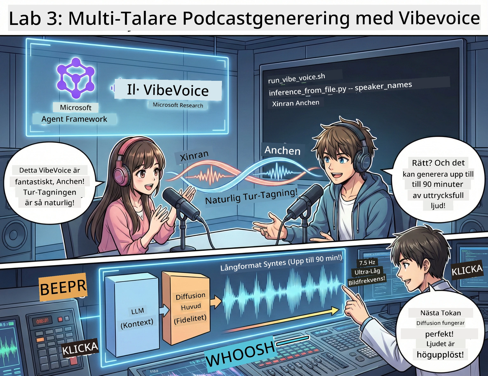

# Akt 3: Ge Liv åt Din Podcast 🎤



## Den Stora Finalen

Du har forskat om ämnen. Du har skrivit manus. Nu till pricken över i: att förvandla din text till riktig podcastljud med realistiska röster!

Möt **VibeVoice** — Microsoft Researchs open source TTS (text-till-tal) magi som skapar:
- 🎭 Naturljudande samtal
- 👥 Flera talare (upp till 4!)
- ⏱️ Långformat ljud (upp till 90 minuter!)
- 🎵 Uttrycksfull leverans (inga robotröster!)

Detta är tekniken bakom syntetiska podcasts. Låt oss göra din!

## Vad är VibeVoice? (Det Coola)

VibeVoice är Microsoft Researchs gåva till världen. Den är speciellt designad för podcastliknande samtalsljud.

### Varför den är Fantastisk 🔥

* **⏱️ Maratonsessioner**: Genererar upp till 90 minuter av oavbruten tal (det är ett helt podcastep)
* **👥 Multi-Talar-Magi**: Upp till 4 olika röster med konsekventa personligheter
* **⚡ Galet Effektiv**: Använder ultralåg 7,5 Hz bildfrekvens för att spara beräkningskraft
* **🧠 Smart Ljud**: Kombinerar en LLM (förstår kontext) med en diffusionsmodell (skapar realistiskt ljud)
* **🎭 Naturligt Flöde**: Hanterar talarbyte, pauser och samtalsrytm automatiskt

**Översättning**: VibeVoice läser inte bara ditt manus – den *uppför* det som riktiga människor pratar.

---

## Innan Du Börjar 🚀

**Vad Du Behöver**:

* 🐍 **Python 3.10+** (det har du redan från Akt 1 & 2)
* 🚀 **uv** (en snabb Python-pakethanterare — vi installerar den)
* 📝 **Ditt Manus**: Filen `podcast.txt` från Akt 2 (i `../03.Application/`)

**Proffstips**: Det här steget kräver bra internet för att ladda ner den förtränade modellen. Ta en kaffe! ☕

---

## Nu Kör Vi! Det Lätta Sättet 🎬

Vi har gjort det superenkelt. Ett skal-skript fixar allt.

### Processen

1. **Gör det körbart**:
```bash
chmod +x run_vibe_voice.sh
```

2. **Kör det**:
```bash
./run_vibe_voice.sh
```

3. **Vänta på magin** (det kan ta några minuter första gången)

### Vad som Händer Bakom Kulisserna 🎭

Skriptet är i princip din automatiska ljudtekniker:

1. **📥 Laddar ner VibeVoice**: Klonar den officiella repot från GitHub
2. **📦 Installerar beroenden**: Använder `uv pip` för blixtsnabb paketinstallation
3. **🎬 Genererar ljud**: Kör inferensskriptet med:
   * `--model_path`: Den förtränade VibeVoice-7B modellen
   * `--txt_path`: Ditt `podcast.txt` manus
   * `--speaker_names`: Tilldelar röster (Xinran & Anchen som standard)

**Resultat**: Ditt manus blir ett riktigt podcastep! 🎉

---

## Din Uppgift 🎯

Låt oss göra det intressant:

### Uppgift 1: Skapa Innehåll
Redigera `../03.Application/podcast.txt` med en konversation mellan två personer. Prata om teknik, hobbyer, vad som helst! Gör det bara samtalsmässigt.

**Formatexempel**:
```
Speaker 1: Hey! Did you hear about the new AI model?
Speaker 2: No way! Tell me more!
Speaker 1: It's called...
```

### Uppgift 2: Generera Ljud
Kör skriptet och se magin ske. Första gången tar det längre tid (laddar ner modellen).

### Uppgift 3: Lyssna & Analysera
- Låter det naturligt?
- Har talarna olika röster?
- Är talarbytena smidiga?
- Några robotiska moment?

### Uppgift 4: Experimentera (För de Modiga)
Redigera `run_vibe_voice.sh` och ändra `--speaker_names` för att testa olika röstkombinationer. VibeVoice har flera förtränade röster!

**Bonusutmaning**: Testa en konversation med 3 talare! 🎆

---

## Lär Dig Mer 📚

* **🏠 Projektets Hemsida**: [VibeVoice Officiell Sida](https://microsoft.github.io/VibeVoice/)
* **🤗 Förtränad Modell**: [Hugging Face - VibeVoice-7B](https://huggingface.co/vibevoice/VibeVoice-7B)
* **📖 Forskningsartikel**: Fördjupa dig i tekniken (om du gillar sånt)

> **⚠️ Ansvarsfull AI-påminnelse**: VibeVoice är kraftfullt. Använd det etiskt! Skapa inga deepfakes eller vilseledande innehåll. Skapa häftiga grejer som hjälper folk. 🙏

---

## 🏆 Grattis! Du Klarade Det!

Du har just genomgått hela kedjan:
1. ✅ **Akt 1**: Byggde AI-agenter med specialverktyg
2. ✅ **Akt 2**: Koordinerade ett multi-agent-flöde
3. ✅ **Akt 3**: Genererade äkta podcastep-ljud

**Du har nu**:
- En fungerande AI-forskningsassistent
- Ett komplett podcastproduktionsflöde
- En riktig ljudfil som du kan dela

### Vad Nu? 🚀

**Starta din podcast!**
- Ladda upp till podcastplattformar
- Dela på sociala medier
- Iterera och förbättra

**Fortsätt bygga!**
- Testa olika ämnen
- Experimentera med fler talare
- Lägg till bakgrundsmusik
- Bygg ett webbgränssnitt
- Automatisera hela processen

**Dela ditt arbete!**
Tagga oss! Visa världen vad du byggt. AI-podcastrevolutionen börjar med dig. 🎙️

---

**Frågor? Idéer? Framgångshistorier?** Dela dem i workshopchatten!

**Välkommen till framtidens innehållsskapande.** 🌟

---

<!-- CO-OP TRANSLATOR DISCLAIMER START -->
**Ansvarsfriskrivning**:
Detta dokument har översatts med hjälp av AI-översättningstjänsten [Co-op Translator](https://github.com/Azure/co-op-translator). Även om vi strävar efter noggrannhet, vänligen notera att automatiska översättningar kan innehålla fel eller brister. Det ursprungliga dokumentet på dess originalspråk bör betraktas som den auktoritativa källan. För kritisk information rekommenderas professionell översättning av människa. Vi ansvarar inte för några missförstånd eller feltolkningar som uppstår från användningen av denna översättning.
<!-- CO-OP TRANSLATOR DISCLAIMER END -->