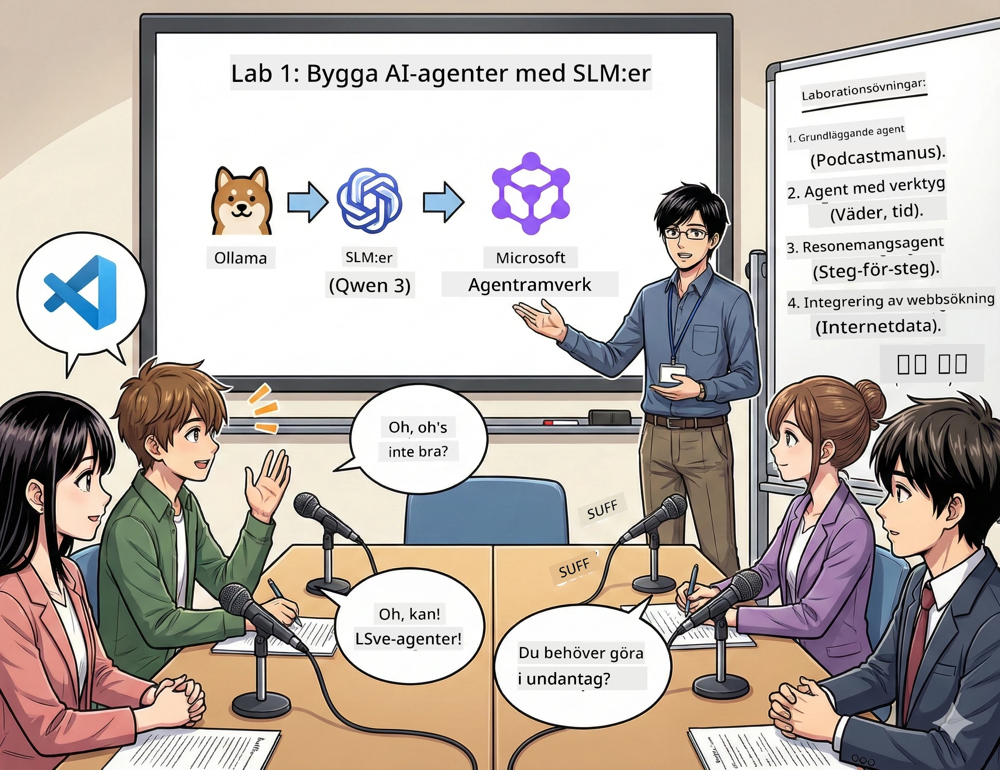

# Akt 1: Lär känna din AI-forskningsassistent 🤖

## Utmaning

Du lanserar "Future Bytes", din nya teknikpodcast. Det första avsnittet handlar om den senaste AI-genombrottet, men du har bara 24 timmar på dig att:
1. Forska ämnet
2. Hitta pålitliga källor
3. Skriva ett engagerande manus
4. Få det att låta naturligt

**Tvist**: Du behöver inte göra det ensam. Du är på väg att bygga din första AI-assistent som kan hjälpa dig med allt detta. Låt oss kalla den Alex — din outtröttliga forskningspartner som aldrig behöver sova.

## Varför välja små språkmodeller? (Spoiler: de är fantastiska)

Tänk på små språkmodeller (SLM) som en personlig AI som körs på *din* dator. Ingen moln, inga månadsavgifter, ingen misstänkt datadelning.

**Varför SLM är så 🔥:**
- **🏠 Körs på din maskin**: Laptop, stationär eller till och med en kraftfull Raspberry Pi
- **💸 Inga löpande kostnader**: Ingen API-avgift som äter upp din fickpeng
- **🔒 Integritet först**: Dina data lämnar aldrig din enhet
- **⚡ Supersnabb**: Ingen nätverksfördröjning, omedelbara svar
- **🪦 Lättviktig**: 1–10 miljarder parametrar jämfört med stora modellernas 100 miljarder+

**Populära SLM**: Qwen 3, Phi-4, Gemma 3 (denna workshop använder Qwen)

## Din verktygslåda

### Ollama: din AI-modellmanager

[Ollama](https://ollama.com/) är som Steam för AI-modeller. Ladda ner, kör och hantera modeller med enkla kommandon.

**Vad som är coolt:**
- Ett kommando för att ladda ner och köra vilken modell som helst
- Fungerar på Mac, Windows, Linux
- Använder GPU automatiskt om du har det
- Superminnesbesparande

### Microsoft Agent Framework: där magin händer

[Microsoft Agent Framework](https://github.com/microsoft/agent-framework) är din lekplats för att bygga AI-agenter som kan:

- 💬 Chatta och komma ihåg vad ni pratat om
- 🛠️ Använda egna verktyg (som webbsök eller kolla vädret)
- 🧠 Tänka stegvis för komplexa problem
- 🤝 Samarbeta som ett team med andra agenter
- 🔌 Koppla till olika AI-leverantörer (OpenAI, Ollama, Azure)

**Byggstenar:**
- **Agenter**: AI-assistenter med specifika jobb
- **Verktyg**: Särskilda förmågor du ger dem
- **Minne**: Så de inte glömmer er konversation
- **Slutsats**: Lär dem tänka, inte bara svara

## Din träningsmontage: 4 uppgifter

### Uppgift 1: Skapa din första agent

📓 [Öppna Notebook](../../code/01.BasicAgent/00.BasicAgent-agent.ipynb)

**Uppgift**: Bygg Alex, din AI som skriver poddmanus. Alex ska generera en dialog mellan två värdar som diskuterar teknik.

**Du lär dig:**
- Hur du väcker upp en AI-agent (lättare än att vakna på måndag)
- Ge den personlighet och instruktioner
- Få den att skriva äkta poddmanus
- Förstå vad den svarar dig

**Målsättning**: Alex skapar manus till ditt "Future Bytes" pilotavsnitt om AI! 🎯

### Uppgift 2: Ge Alex superkrafter (verktyg!)

📓 [Öppna Notebook](../../code/01.BasicAgent/01.BasicAgent-tools.ipynb)

**Uppgift**: Alex är smart men vet inte dagens väder eller tid. Låt oss fixa det genom att ge den verktyg!

**Du lär dig:**
- Skapa egna Python-funktioner som "verktyg"
- Låta Alex själv bestämma *när* hen ska använda vilket verktyg
- Se hen lösa problem självständigt
- Kombinera flera verktyg för komplexa uppgifter

**Målsättning**: Fråga "Hur är vädret i Tokyo?" och se Alex ta reda på svaret själv! ☁️

### Uppgift 3: Lär Alex tänka

📓 [Öppna Notebook](../../code/01.BasicAgent/02.BasicAgent-reasoning.ipynb)

**Uppgift**: Låt Alex visa hur hen arbetar. När hen löser problem vill du se *hur* hen tänker, inte bara svaret.

**Du lär dig:**
- Aktivera "resonemangsläge" (som att visa dina lösningssteg i mattan)
- Se steg-för-steg-tänkandet från Alex
- Förstå kedjan av tankar
- Felsöka när Alex är förvirrad

**Målsättning**: Fråga en knepig mattetal och se Alex tänka sig fram! 🧠

### Uppgift 4: Koppla Alex till internet

📓 [Öppna Notebook](../../code/01.BasicAgent/03.BasicAgent-websearch.ipynb)

**Uppgift**: Alex kunskaper har en gränsdatum. Låt oss koppla hen till webben för realtidsinfo!

**Du lär dig:**
- Bygga egna webbsearch-verktyg
- Integrera externa API:er
- Hantera nätverksfel smidigt
- Hämta info utanför Alex träningsdata

**Målsättning**: Fråga dagens tekniknyheter och få det senaste! 📰

## Innan vi börjar 🚀

**Nödvändig utrustning**:
- Python 3.10+ installerat
- Ollama igång (kolla med `ollama --version`)
- VS Code med Python-extension
- Minst 8GB RAM (16GB rekommenderas för smidigt flöde)

## Uppgiftsordning

Följ notebooksen i ordning för bästa upplevelse:

1. [00.BasicAgent-agent.ipynb](../../code/01.BasicAgent/00.BasicAgent-agent.ipynb) — Lär känna Alex (din första agent)
2. [01.BasicAgent-tools.ipynb](../../code/01.BasicAgent/01.BasicAgent-tools.ipynb) — Uppgradera nu!
3. [02.BasicAgent-reasoning.ipynb](../../code/01.BasicAgent/02.BasicAgent-reasoning.ipynb) — Lär Alex tänka
4. [03.BasicAgent-websearch.ipynb](../../code/01.BasicAgent/03.BasicAgent-websearch.ipynb) — Lås upp internetåtkomst!

## Vad du kommer behärska

Efter Akt 1 kommer du kunna:

- ✅ Köra AI-modeller på din egen hårdvara (ingen moln!)
- ✅ Bygga agenter med egen personlighet och förmågor
- ✅ Ge agenter verktyg för att lösa riktiga problem
- ✅ Få agenter att visa sitt resonemang
- ✅ Koppla agenter till externa datakällor
- ✅ Felsöka när något går snett

## När saker går fel (och hur du fixar) 🔧

### "Alex laddar inte! Minnet räcker inte!"
**Lösning**: Din dator kämpar. Stäng andra appar eller byt till en mindre modell. 8GB är minsta krav.

### "Alex är för långsam"
**Lösning**: Aktivera GPU-acceleration i Ollamas inställningar. Eller minska kontextfönstrets storlek. Sätt på snabbhetsdjävulsläget! 🏎️

### "Verktygen fungerar inte!"
**Lösning**: Kontrollera dina funktionssignaturer noga. Alex behöver rätt typinformation för att förstå verktygen. Tänk på det som tydliga instruktioner.

## Användbara länkar 🔗

- [Agent Framework-dokumentation](https://github.com/microsoft/agent-framework) — Officiella guider och exempel
- [Ollama modellbibliotek](https://ollama.com/library) — Bläddra bland alla tillgängliga modeller
- [Qwen-modellen](https://ollama.com/library/qwen3) — Lär känna hjärnan bakom din AI-assistent
- [Kodexempel](https://github.com/microsoft/agent-framework/tree/main/python/samples) — Sno idéer härifrån

## Nästa steg: Akt 2 🎬

Du har en agent. Men tänk om du hade *ett team* av agenter som jobbar tillsammans? I Akt 2 bygger du ett komplett poddproduktionslag:
- **Forskningsagent**: Hitta bästa källorna
- **Skrivagent**: Skapa perfekta manus
- **Redigera (du!)**: Godkänn eller begär förändringar

Låt oss sätta igång lite AI-magi! → [Akt 2: Bygg ditt produktionsteam](02.AIAgentOrchestrationAndWorkflows.md)

---

**Fast?** Ställ frågor under workshopen. Vi lär oss tillsammans! 🙌

---

<!-- CO-OP TRANSLATOR DISCLAIMER START -->
**Ansvarsfriskrivning**:
Detta dokument har översatts med hjälp av AI-översättningstjänsten [Co-op Translator](https://github.com/Azure/co-op-translator). Även om vi strävar efter noggrannhet, vänligen var medveten om att automatiska översättningar kan innehålla fel eller felaktigheter. Det ursprungliga dokumentet på dess modersmål ska betraktas som den auktoritativa källan. För kritisk information rekommenderas professionell, mänsklig översättning. Vi ansvarar inte för några missförstånd eller feltolkningar som uppstår vid användning av denna översättning.
<!-- CO-OP TRANSLATOR DISCLAIMER END -->