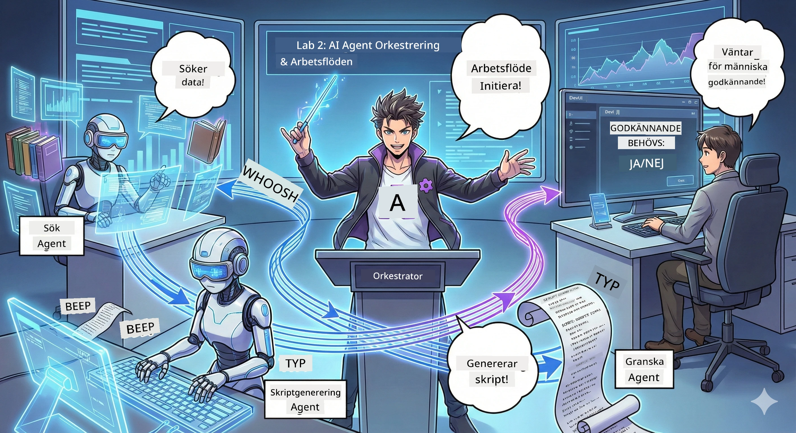

<!--
CO_OP_TRANSLATOR_METADATA:
{
  "original_hash": "2a2578dc4f813ca93ca7952d842a4b59",
  "translation_date": "2026-01-05T14:54:41+00:00",
  "source_file": "WorkshopForAgentic/translation/zh-cn/02.AIAgentOrchestrationAndWorkflows.md",
  "language_code": "sv"
}
-->
# Akt 2: Bygg ditt podcastproduktionsteam 🎬



## Ökande spänning

Alex (din AI-assistent från Akt 1) är fantastisk, men en agent kan inte driva en hel podcaststudio. Du behöver ett *team*:
- 🔍 **Forskningsagent**: söker på nätet efter färsk information
- ✍️ **Manusagent**: omvandlar forskning till engagerande dialoger
- 👤 **Du (redaktören)**: godkänner manus eller skickar tillbaka för omskrivning

Välkommen till **AI Agent Orkestrering** – där du blir regissör för ditt eget AI-team. Tänk på det som Avengers, men för podcastproduktion.

## Vad är agentorkestrering? (Enkel version)

Föreställ dig att du driver en restaurang. Du gör inte allt själv, eller hur? Du har:
- 🍳 Kocken som lagar maten
- 👨‍🍳 Souschefen som förbereder ingredienser
- 👩‍🍳 Servitören som serverar gästerna

Agentorkestrering är samma idé, fast med AI. Varje agent har sin specialitet, och du koordinerar dem för att uppnå ett större mål. Ingen agent blir överbelastad, och jobbet görs snabbare.

### Bandliknelse 🎸

Dina AI-agenter är som ett band:
- **Sångaren**: huvudagenten som hanterar kundrelaterade uppgifter
- **Trummisen**: håller takten, sköter backend
- **Basisten**: stödjer alla och hämtar data
- **Du (bandchef)**: koordinerar allt!

Ingen koordination? Bara brus. Med orkestrering? Vacker musik.

### Varför är detta viktigt

En AI-agent försöker göra allt = utbrändhet. Specialiserade agenter som samarbetar = effektivitet frigjord!🚀

**Sanningen**: Kommer du ihåg när du försökte forska, skriva och redigera din podcast själv? Ja, det var hemskt. Med orkestrering hanterar varje agent det den är bäst på. Du tar bara det slutgiltiga beslutet.

**Exempel från verkligheten**: En kundsupportrobot vet när den ska hantera fakturafrågor kontra tekniska problem kontra när den ska eskalera till en mänsklig handläggare. Det är orkestrering!

## Agent vs arbetsflöde: Vad är skillnaden?

Tänk så här:

### 🤖 AI-agent = Jazzmusiker
- **Improviserar beslut** baserat på vad den hör
- **Improviserar lösningar** med sina verktyg
- **Tänker** med LLM-hjärna
- **Anpassar sig** till vad du kastar på den

### 🎵 Arbetsflöde = Orkester som spelar klassisk musik
- **Följer noter** (fördefinierade steg)
- **Förutsägbar** exekveringsväg
- **Koordinerar** flera agenter, människor, system
- **Strukturerad** som ett recept

**Magin**: Arbetsflöden *orkestrerar* agenter! Du bygger ett arbetsflöde och berättar när agenterna ska agera. Bäst av två världar.🎭

## Tre sätt att koordinera ditt AI-team

### 1. 🎯 Centraliserat (du är chefen)

En huvudagent ger order. Tänk dig att du leder ett team – du bestämmer vem som gör vad och när.

**Fördelar**:
- ✅ Klart ledarskap (inget kaos)
- ✅ Enhetliga beslut
- ✅ Lätt att felsöka

**Passar för**:
- Kundservice-routing ("Är detta faktura eller teknisk support?")
- Innehållsgodkännande (”Gick manuset igenom?”)
- Podcastproduktion (precis vad vi bygger!)

### 2. 🤝 Decentraliserat (agenter självorganiserar sig)

Agenter pratar direkt med varandra och löser problem som en grupp. Som en samordnad gruppchatt.

**Fördelar**:
- ✅ Skalbart (lägg till fler agenter när som helst)
- ✅ Ingen enskild felpunkt
- ✅ Agenter samarbetar naturligt

**Passar för**:
- Forskningsgrupper (varje agent utforskar olika källor)
- Brainstormingsessioner
- Distribuerad problemlösning

### 3. 🔀 Hybrid (bäst av två världar)

Du sätter riktningen, men agenterna har frihet att självorganisera sig i uppgifterna. Som en VD som litar på sitt team.

**Perfekt för**: komplexa projekt som kräver både kontroll och flexibilitet.

## Microsoft Agent Framework: Din orkestreringsverktygslåda 🧰

Dags att bygga! Här är vad du kommer använda:

### Byggblock

#### 1. 🧱 Exekverare (dina arbetare)
- **Vad de är**: separata bearbetningsenheter – kan vara agenter eller anpassad logik
- **Vad de gör**: tar emot input, gör jobbet, genererar output
- **Tänk på dem som**: arbetsstationer på en monteringslinje

#### 2. ➡️ Kanter (kopplingar)
- **Vad de är**: vägar mellan exekverare
- **Vad de gör**: styr meddelandeflödet ("Efter A, gå till B")
- **Tänk på dem som**: pilar på ett flödesschema

#### 3. 🗺️ Arbetsflöde (helhetsplanen)
- **Vad de är**: komplett diagram av exekverare + kanter
- **Vad de gör**: definierar hela processen från start till slut
- **Tänk på det som**: din blueprint för produktionen

### Coola funktioner du kommer älska

**🛡️ Typsäkerhet**: meddelanden mellan agenter typkontrolleras. Inga ”ajdå, fel datatype”-överraskningar.

**🔀 Flexibel routing**:
- If-then villkor ("Om godkänt, publicera; annars skriv om")
- Parallell behandling (flera agenter arbetar samtidigt)
- Dynamiska vägar (arbetsflödet anpassas efter resultat)

**🔌 Extern integration**:
- Anslut till API:er
- Lägg till mänsklig genomgång (du godkänner innan publicering)
- Bygg förfrågnings-/svarsflöden

**💾 Checkpoint**: spara framsteg! Om något kraschar fortsätter du där du slutade.

**🤝 Multi-agent koordinering**:
- Kör agenter i sekvens (A → B → C)
- Kör dem parallellt (A + B + C samtidigt)
- Överlämningar mellan agenter
- Samarbetsbehandling

## Bästa praxis (proffs-tips) 🎯

### 1. Håll det modulärt
Varje agent ska göra en sak riktigt bra. Skapa inte en "superagent" som gör allt – du kommer ångra det vid felsökning.

### 2. Planera för fel
Agenter gör misstag. Nätverk fallerar. Bygg in felhantering och backup-planer. Din framtida jag tackar dig.

### 3. Övervaka allt
Följ vad dina agenter gör. Använd DevUI (vi kommer gå igenom det!) för att se arbetsflöden i realtid.

### 4. Optimera meddelandestorlek
Skicka inte stora filer mellan agenter. Håll meddelanden lätta för snabbare svarstider.

### 5. Välj rätt modell
Behöver du kontroll? Välj centraliserat. Behöver du skala? Välj decentraliserat. Kan du inte bestämma dig? Kör hybrid!

## DevUI: Din arbetsflödes-debugger 🔍

### Vad är DevUI?

DevUI är som en lekplats för att testa dina agenter och arbetsflöden. Det är en webbgränssnitt där du kan:
- 👀 Titta på dina arbetsflöden när de körs
- 💬 Chatta direkt med agenterna
- 🔍 Debugga när något går fel
- 📊 Se loggar och prestandamått

> **Viktigt**: DevUI är bara för utveckling! Använd inte i produktion. Tänk på det som din lokala testmiljö.

### Vad gör det fantastiskt

- **🖥️ Interaktivt webb-UI**: klicka, mata in, testa – inga kommandorader behövs
- **📁 Drag & drop redo**: ladda upp filer, testa med olika inputs
- **📂 Automatisk upptäckt**: peka på en mapp, den hittar alla agenter automatiskt
- **📋 Inga konfigurationsfiler**: registera agenter i koden utan mappstruktur
- **🔌 OpenAI-kompatibelt**: fungerar med OpenAI SDK (kompatibilitet för livet!)
- **👁️ Inbyggd spårning**: se exakt vad dina agenter gör

### Så här funkar input

DevUI är smart:
- **Testar du en agent?** Du får textfält och filuppladdning
- **Testar du arbetsflöde?** UI genererar automatiskt inmatningsfält baserat på arbetsflödets behov

Som magi, men bara bra kod. ✨

## Din uppgift: Bygg podcaststudion 🎬

### Uppgift 1: Skapa en agent med DevUI

📂 [01.AgentDevUI](../../../../../WorkshopForAgentic/code/02.Workflow/01.AgentDevUI)

**Utmaning**: Innan du bygger hela teamet, testa DevUI med en agent: nätverkssöknings-experten.

**Vad du bygger**:
En forskningsagent som kan söka på internet efter podcastämnen. Du testar via DevUIs webbgränssnitt `http://localhost:8090`.

**Färdigheter du lär dig**:
- 🚀 Starta agenten i DevUI
- 🔍 Testa agentens svar i realtid
- 🛠️ Bygga egna verktyg (nätverkssökning)
- 📊 Aktivera spårning för felsökning
- 🖥️ Använda interaktivt webbgränssnitt

**Kod**:
- `agent.py`: din SearchAgent med nätverkssökarsuperkrafter
- Använd OllamaChatClient för att ansluta till Qwen
- Implementera `web_search()` verktygsfunktion
- Starta med `serve()` – öppnar DevUI automatiskt

**Vinstvillkor**: Fråga din agent ”Vad är heta trender inom AI?” och se den söka på nätet! 🎉

### Uppgift 2: Bygg ett multi-agent arbetsflöde

📂 [02.WorkflowDevUI](../../../../../WorkshopForAgentic/code/02.Workflow/02.WorkflowDevUI)

**Utmaning**: Nu börjar det roliga! Bygg ett komplett podcastproduktionsarbetsflöde:
1. 🔍 **Sökningsagent** → forska ämnet
2. ✍️ **Manusagent** → skriv dialog mellan två värdar (på kinesiska!)
3. 👤 **Granskningsexekverare** → du godkänner eller avvisar
4. 🔄 **Loop-back** → skriv om om det avvisas enligt din feedback

**Färdigheter du lär dig**:
- 🧱 Skapa specialiserade agenter för olika uppgifter
- 🔗 Använd WorkflowBuilder för att koppla agenter
- 🔀 Implementera godkännandeloop (människa i loopen!)
- 🚦 Villkorsstyrd routing (godkänd vs avvisad)
- 🔧 Bygg anpassad exekverare för affärslogik

**Arbetsflöde**:
```
SearchAgent → ScriptAgent → ReviewExecutor
                             ↑          ↓ (如果被拒绝)
                             ←─────────
```

**Kod**:
- `search_agent/agent.py`: din forskningsexpert
- `generate_script_agent/agent.py`: din manusförfattare (skriv på kinesiska!)
- `workflow/workflow.py`: orkestrering sker här
- `main.py`: startar allt i DevUI

**Vinstvillkor**: Ge ett ämne, granska manus, avvisa en gång för att testa loopen och sen godkänn! 🎉

### Uppgift 3: Bygg en konsolapplikation

📂 [03.Application](../../../../../WorkshopForAgentic/code/02.Workflow/03.Application)

**Utmaning**: Förvandla arbetsflödet från DevUI till en snygg terminalapp med färgad output, laddningsindikatorer och filsparande. Detta är produktionsklart!

**Färdigheter du lär dig**:
- ⚡ Kör arbetsflödet programmässigt (utan DevUI)
- 📡 Använd event-driven arkitektur med streaming
- 🎨 Skapa snygg terminal-UI (färger, spinners, progressbars)
- 💾 Spara slutmanuset i en fil
- 🔄 Hantera asynkrona arbetsflöden med Pythons asyncio

**Den gör**:
1. Frågar om ditt podcastämne
2. Visar realtidsprogress ("Sökningsagenten jobbar...")
3. Visar färgad text på det genererade manuset
4. Frågar efter ditt godkännande
5. Sparar godkänt manus i `podcast.txt`

**Kod**:
- `podcast_app.py`: din huvudapp med event-hantering
- `workflow.py`: återanvänder arbetsflödet från Uppgift 2
- Hantera händelser: `AgentRunUpdateEvent`, `RequestInfoEvent`, `WorkflowOutputEvent`
- Använd ANSI-färger för terminalstil

**Vinnarkriterium**: Kör appen, skapa ett podcapskript och se det sparas! Du har byggt ett riktigt verktyg. 🚀

## Vad du har bemästrat 🏆

Efter andra akten kan du:

- ✅ Koreografera flera AI-agenter som ett proffs
- ✅ Skapa arbetsflöden med sekvens- och villkorslogik
- ✅ Lägga till manuella godkännandepunkter
- ✅ Testa och felsök arbetsflöden i DevUI
- ✅ Skapa produktionsklara konsolapplikationer
- ✅ Hantera fel smidigt i komplexa system
- ✅ Välja rätt orkestreringsmönster för vilket projekt som helst

## När saker går fel 🔧

### "Mitt arbetsflöde är för komplext!"
**Lösning**: Dela upp det i mindre underarbetsflöden. Varje arbetsflöde ska göra en sak bra. Koppla ihop dem vid behov.

### "Jag kan inte följa vad som händer!"
**Lösning**: Använd arbetsflödeskontrollpunkter för att spara status. Aktivera spårning i DevUI för att se varje steg.

### "Ett agents fel kraschar allt!"
**Lösning**: Lägg till felgränser. Varje agent ska hantera sina egna fel och ha fallback-beteende.

### "Det går för långsamt"
**Lösning**: Finns agenter som kan köras parallellt? Sekventiella arbetsflöden är enkla men långsamma. Leta efter möjligheter till parallellisering!

## Användbara resurser 🔗

- [Arbetsflödesdokumentation](https://learn.microsoft.com/en-us/agent-framework/user-guide/workflows/overview) — Officiell Microsoft-guide
- [Orkestreringsmönster](https://www.ibm.com/think/topics/ai-agent-orchestration) — IBMs synpunkter
- [Agent Framework GitHub](https://github.com/microsoft/agent-framework) — Bläddra i källkoden
- [Kodexempel](https://github.com/microsoft/agent-framework/tree/main/python/samples) — Stjäla mönster härifrån

---

**Redo för finalen?** Du har manus. Nu gör vi det till riktig ljud! → [Tredje akten: Ge liv åt din podcast](03.Multi-SpeakerPodcastGenerationWithVibeVoice.md) 🎤

---

**Fast? Förvirrad? Exalterad?** Dela i workshopchatten! Vi lär oss tillsammans. 🚀

---

<!-- CO-OP TRANSLATOR DISCLAIMER START -->
**Ansvarsfriskrivning**:
Detta dokument har översatts med hjälp av AI-översättningstjänsten [Co-op Translator](https://github.com/Azure/co-op-translator). Även om vi strävar efter noggrannhet, vänligen ha i åtanke att automatiska översättningar kan innehålla fel eller brister. Det ursprungliga dokumentet på dess modersmål bör betraktas som den auktoritativa källan. För kritisk information rekommenderas professionell mänsklig översättning. Vi ansvarar inte för missförstånd eller feltolkningar som uppstår till följd av användningen av denna översättning.
<!-- CO-OP TRANSLATOR DISCLAIMER END -->