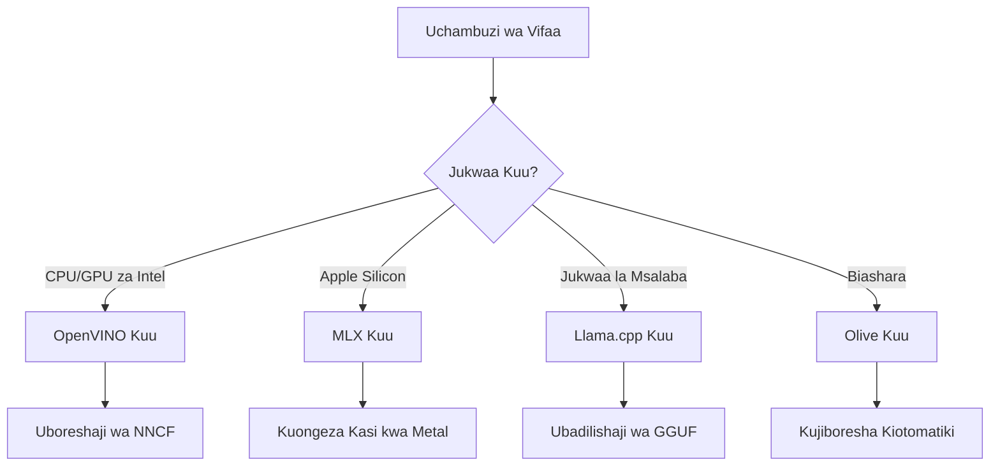
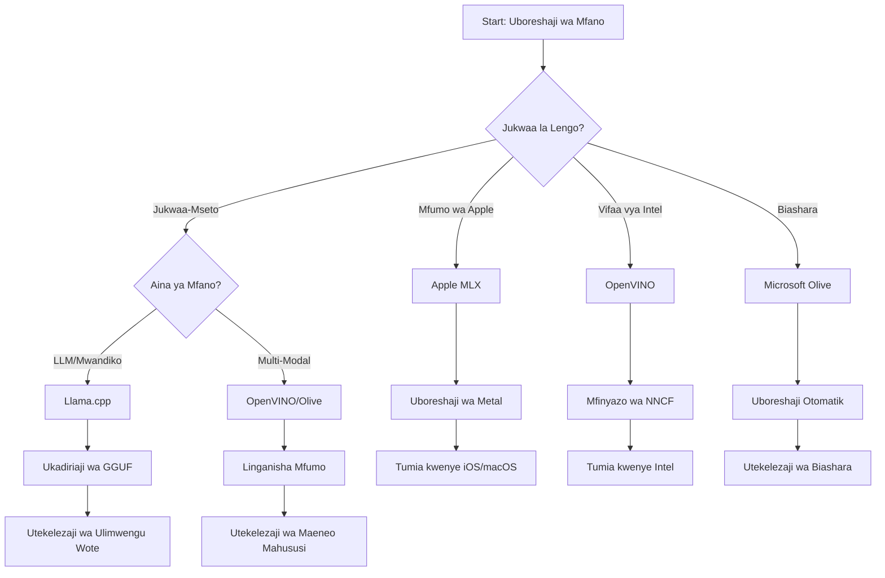
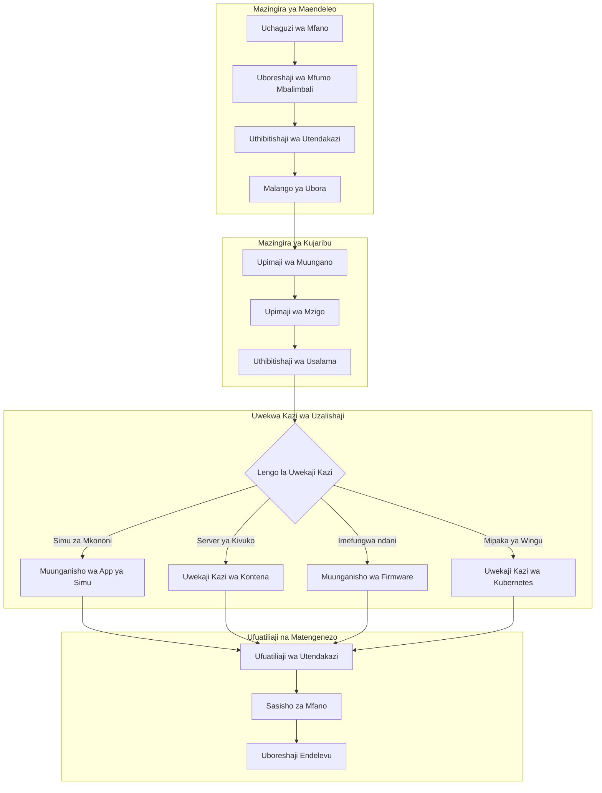

# Sehemu ya 6: Muhtasari wa Mchakato wa Maendeleo wa Edge AI

## Jedwali la Yaliyomo
1. [Utangulizi](#utangulizi)
2. [Malengo ya Kujifunza](#malengo-ya-kujifunza)
3. [Muhtasari wa Mchakato Muunganiko](#muhtasari-wa-mchakato-muunganiko)
4. [Matriki ya Uchaguzi wa Mfumo](#matriki-ya-uchaguzi-wa-mfumo)
5. [Muhtasari wa Mambo Bora ya Kufanya](#muhtasari-wa-mambo-bora-ya-kufanya)
6. [Mwongozo wa Mkakati wa Utekelezaji](#mwongozo-wa-mkakati-wa-utekelezaji)
7. [Mchakato wa Uboreshaji wa Utendaji](#mchakato-wa-uboreshaji-wa-utendaji)
8. [Orodha ya Ukaguzi wa Uwezo wa Uzalishaji](#orodha-ya-ukaguzi-wa-uwezo-wa-uzalishaji)
9. [Utatuzi wa Matatizo na Ufuatiliaji](#utatuzi-wa-matatizo-na-ufuatiliaji)
10. [Kuhakiksha Utekelezaji wa Pipeline ya Edge AI ya Baadaye](#kuhakiksha-utekelezaji-wa-pipeline-ya-edge-ai-ya-baadaye)

## Utangulizi

Maendeleo ya Edge AI yanahitaji uelewa wa kina wa mifumo mbalimbali ya uboreshaji, mikakati ya utekelezaji, na mambo ya vifaa. Muhtasari huu wa kina unaunganisha maarifa kutoka Llama.cpp, Microsoft Olive, OpenVINO, na Apple MLX kuunda mchakato muunganiko ambao unaongeza ufanisi, unahakikisha ubora, na kuhakikisha utekelezaji wa mafanikio katika uzalishaji.

Katika kozi hii, tumechunguza mifumo ya uboreshaji binafsi, kila mojawapo ikiwa na nguvu zake za kipekee na matumizi maalum. Hata hivyo, miradi halisi ya Edge AI mara nyingi huhitaji kuchanganya mbinu kutoka mifumo mingi au kufanya maamuzi ya kimkakati kuhusu njia gani itatoa matokeo bora kwa vikwazo na mahitaji maalum.

Sehemu hii inaunganisha hekima ya pamoja kutoka kwa mifumo yote kuwa michakato inayoweza kutekelezwa, mti wa maamuzi, na mambo bora ya kufuata yanayokuwezesha kujenga suluhisho za Edge AI tayari kwa uzalishaji kwa ufanisi na ufanisi. Ikiwa unaboreshaji kwa vifaa vya mkononi, mifumo iliyopachikwa, au seva za Edge, mwongozo huu unatoa mfumo wa kimkakati wa kufanya maamuzi sahihi katika mzunguko mzima wa maendeleo yako.

## Malengo ya Kujifunza

Mwisho wa sehemu hii, utaweza:

### Maamuzi ya Kimkakati
- **Kukadiria na kuchagua** mfumo bora wa uboreshaji kulingana na mahitaji ya mradi, vizuizi vya vifaa, na hali za utekelezaji
- **Kubuni michakato kamili** inayojumuisha mbinu nyingi za uboreshaji kwa ufanisi wa hali ya juu
- **Kutathmini masuala ya kinyume** kati ya usahihi wa mfano, kasi ya inference, matumizi ya kumbukumbu, na ugumu wa utekelezaji kwa mifumo tofauti

### Muunganisho wa Mchakato
- **Kutekeleza mistari muunganiko ya maendeleo** inayotumia nguvu za mifumo mingi ya uboreshaji
- **Kuunda michakato inayorudiwa** kwa ajili ya uboreshaji na utekelezaji thabiti wa modeli katika mazingira tofauti
- **Kuanzisha milango ya ubora** na michakato ya uthibitisho ya kuhakikisha mifano iliyoboreshwa inakidhi mahitaji ya uzalishaji

### Uboreshaji wa Utendaji
- **Kutumia mbinu za kimfumo za uboreshaji** kwa kutumia quantization, pruning, na mbinu za kuharakisha zinazohusu vifaa maalum
- **Kufuatilia na kupima viwango** vya utendaji wa mfano katika viwango mbalimbali vya uboreshaji na malengo ya utekelezaji
- **Kuboresha kwa majukwaa maalum ya vifaa** ikiwa ni pamoja na CPU, GPU, NPU, na waongeza kasi maalum wa Edge

### Utekelezaji wa Uzalishaji
- **Kubuni miundo inayoweza kupanuka ya utekelezaji** inayowezesha aina nyingi za mifano na injini za inference
- **Kutekeleza ufuatiliaji na uangalizi** kwa matumizi ya Edge AI katika mazingira ya uzalishaji
- **Kuanzisha michakato ya matengenezo** kwa masasisho ya modeli, ufuatiliaji wa utendaji, na uboreshaji wa mfumo

### Ubora wa Majukwaa Mbalimbali
- **Kutekeleza mifano iliyoboreshwa** katika majukwaa mbalimbali ya vifaa huku ukihakikisha utendaji thabiti
- **Kushughulikia uboreshaji maalum wa jukwaa** kwa Windows, macOS, Linux, vifaa vya mkononi, na mifumo iliyopachikwa
- **Kuunda tabaka za abstraction** zinazorahisisha utekelezaji usio na matatizo katika mazingira tofauti za Edge

## Muhtasari wa Mchakato Muunganiko

### Hatua ya 1: Uchambuzi wa Mahitaji na Uchaguzi wa Mfumo

Msingi wa utekelezaji mzuri wa Edge AI unaanza na uchambuzi kamili wa mahitaji unaoelekeza uchaguzi wa mfumo na mkakati wa uboreshaji.

#### 1.1 Tathmini ya Vifaa


**Mambo Muhimu:**
- **Mimambo ya CPU**: Uwezo wa x86, ARM, Apple Silicon 
- **Upatikanaji wa Waongeza Kasi**: GPU, NPU, VPU, chips maalum za AI
- **Vizuizi vya Kumbukumbu**: Kiqomo cha RAM, uwezo wa uhifadhi
- **Bajeti ya Nguvu**: Muda wa betri, vizuizi vya joto
- **Muunganisho**: Mahitaji ya offline, vikwazo vya upana wa bendi

#### 1.2 Matriki ya Mahitaji ya Programu

| Hitaji | Llama.cpp | Microsoft Olive | OpenVINO | Apple MLX |
|-------------|-----------|-----------------|----------|-----------|
| Majukwaa Mbalimbali | ✅ Bora | ⚡ Nzuri | ⚡ Nzuri | ❌ Kwa Apple Pekee |
| Uingizaji wa Biashara | ⚡ Msingi | ✅ Bora | ✅ Bora | ⚡ Mdogo |
| Utekelezaji wa Simu | ✅ Bora | ⚡ Nzuri | ⚡ Nzuri | ✅ iOS Bora |
| Inference ya Muda Halisi | ✅ Bora | ✅ Bora | ✅ Bora | ✅ Bora |
| Aina za Mfano | ✅ Lengo LLM | ✅ Mifano Yote | ✅ Mifano Yote | ✅ Lengo LLM |
| Urahisi wa Matumizi | ✅ Rahisi | ✅ Moja kwa Moja | ⚡ Wastani | ✅ Rahisi |

### Hatua ya 2: Maandalizi na Uboreshaji wa Mfano

#### 2.1 Mchakato wa Tathmini ya Mfano wa Ulimwengu Wote

```python
# Mfumo wa Tathmini ya Mfano wa Ulimwengu
class EdgeAIModelAssessment:
    def __init__(self, model_path, target_hardware):
        self.model_path = model_path
        self.target_hardware = target_hardware
        self.optimization_frameworks = []
        
    def assess_model_characteristics(self):
        """Analyze model size, architecture, and complexity"""
        return {
            'model_size': self.get_model_size(),
            'parameter_count': self.get_parameter_count(),
            'architecture_type': self.detect_architecture(),
            'quantization_compatibility': self.check_quantization_support()
        }
    
    def recommend_optimization_strategy(self):
        """Recommend optimal frameworks and techniques"""
        characteristics = self.assess_model_characteristics()
        
        if self.target_hardware.startswith('apple'):
            return self.mlx_optimization_strategy(characteristics)
        elif self.target_hardware.startswith('intel'):
            return self.openvino_optimization_strategy(characteristics)
        elif characteristics['model_size'] > 7_000_000_000:  # Vigezo zaidi ya 7B+
            return self.enterprise_optimization_strategy(characteristics)
        else:
            return self.lightweight_optimization_strategy(characteristics)
```

#### 2.2 Mchakato wa Uboreshaji wa Mifumo Mingi

**Mbinu ya Uboreshaji wa Mfululizo:**
1. **Mabadiliko ya Awali**: Badilisha kuwa muundo wa kati (ONNX inapowezekana)
2. **Uboreshaji Maalum wa Mfumo**: Tumia mbinu maalum
3. **Uthibitisho wa Msalaba**: Hakikisha utendaji katika majukwaa lengwa
4. **Ufungaji wa Mwisho**: Andaa kwa utekelezaji

```bash
# Skripti ya Uboreshaji wa Miundo Mingi
#!/bin/bash

MODEL_NAME="phi-3-mini"
BASE_MODEL="microsoft/Phi-3-mini-4k-instruct"

# Awamu ya 1: Ubadilishaji wa ONNX (Ulimwengu)
python convert_to_onnx.py --model $BASE_MODEL --output models/onnx/

# Awamu ya 2: Uboreshaji Maalum wa Jukwaa
if [[ "$TARGET_PLATFORM" == "intel" ]]; then
    # Uboreshaji wa OpenVINO
    python optimize_openvino.py --input models/onnx/ --output models/openvino/
elif [[ "$TARGET_PLATFORM" == "apple" ]]; then
    # Uboreshaji wa MLX
    python optimize_mlx.py --input $BASE_MODEL --output models/mlx/
elif [[ "$TARGET_PLATFORM" == "cross" ]]; then
    # Uboreshaji wa Llama.cpp
    python convert_to_gguf.py --input models/onnx/ --output models/gguf/
fi

# Awamu ya 3: Uthibitisho
python validate_optimization.py --original $BASE_MODEL --optimized models/$TARGET_PLATFORM/
```

### Hatua ya 3: Uthibitisho wa Utendaji na Upimaji

#### 3.1 Mfumo Kamili wa Upimaji

```python
class EdgeAIBenchmark:
    def __init__(self, optimized_models):
        self.models = optimized_models
        self.metrics = {
            'inference_time': [],
            'memory_usage': [],
            'accuracy_score': [],
            'throughput': [],
            'energy_consumption': []
        }
    
    def run_comprehensive_benchmark(self):
        """Execute standardized benchmarks across all optimized models"""
        test_inputs = self.generate_test_inputs()
        
        for model_framework, model_path in self.models.items():
            print(f"Benchmarking {model_framework}...")
            
            # Mtihani wa ucheleweshaji
            latency = self.measure_inference_latency(model_path, test_inputs)
            
            # Uchanganuzi wa kumbukumbu
            memory = self.profile_memory_usage(model_path)
            
            # Uthibitishaji wa usahihi
            accuracy = self.validate_model_accuracy(model_path, test_inputs)
            
            # Uchambuzi wa kiwango cha utoaji
            throughput = self.measure_throughput(model_path)
            
            self.record_metrics(model_framework, latency, memory, accuracy, throughput)
    
    def generate_optimization_report(self):
        """Create comprehensive comparison report"""
        report = {
            'recommendations': self.analyze_performance_trade_offs(),
            'deployment_guidance': self.generate_deployment_recommendations(),
            'monitoring_requirements': self.define_monitoring_metrics()
        }
        return report
```

## Matriki ya Uchaguzi wa Mfumo

### Mti wa Maamuzi kwa Uchaguzi wa Mfumo



### Vigezo Kamili vya Uchaguzi

#### 1. Ulinganifu wa Matumizi Kuu

**Mifano Mikubwa ya Lugha (LLMs):**
- **Llama.cpp**: Bora kwa utekelezaji wa CPU, majukwaa mengi
- **Apple MLX**: Chaguo bora kwa Apple Silicon na kumbukumbu muunganiko
- **OpenVINO**: Bora kwa vifaa vya Intel na uboreshaji wa NNCF
- **Microsoft Olive**: Inafaa kwa michakato ya biashara yenye automatisering

**Mifano ya Multi-Modal:**
- **OpenVINO**: Msaada kamili kwa kuona, sauti, na maandishi
- **Microsoft Olive**: Uboreshaji wa daraja la biashara kwa michakato tata
- **Llama.cpp**: Imefikia kwa mifano ya maandishi tu
- **Apple MLX**: Kuongezeka kwa msaada kwa matumizi ya multi-modal

#### 2. Matriki ya Jukwaa la Vifaa

| Jukwaa | Mfumo Muu | Chaguo la Pili | Sifa Maalum |
|----------|------------------|------------------|---------------------|
| CPU/GPU ya Intel | OpenVINO | Microsoft Olive | Compression ya NNCF, uboreshaji wa Intel |
| GPU ya NVIDIA | Microsoft Olive | OpenVINO | Kuongeza kasi ya CUDA, sifa za biashara |
| Apple Silicon | Apple MLX | Llama.cpp | Metal shaders, kumbukumbu muunganiko |
| Simu ya ARM | Llama.cpp | OpenVINO | Multi-jukwaa, utegemezi mdogo |
| Edge TPU | OpenVINO | Microsoft Olive | Msaada wa waongeza kasi maalum |
| ARM Iliyopachikwa | Llama.cpp | OpenVINO | Ukubwa mdogo, ufanisi wa inference |

#### 3. Mapendeleo ya Mchakato wa Maendeleo

**Utengenezaji wa Haraka:**
1. **Llama.cpp**: Usanidi wa haraka, matokeo ya papo hapo
2. **Apple MLX**: API rahisi ya Python, mabadiliko ya haraka
3. **Microsoft Olive**: Uboreshaji wa moja kwa moja, usanidi mdogo
4. **OpenVINO**: Usanidi mgumu, sifa kamili

**Uzalishaji wa Biashara:**
1. **Microsoft Olive**: Sifa za biashara, uunganisho wa Azure
2. **OpenVINO**: Mazingira ya Intel, zana kamili
3. **Apple MLX**: Programu za biashara za Apple pekee
4. **Llama.cpp**: Utekelezaji rahisi, sifa za biashara ndogo

## Muhtasari wa Mambo Bora ya Kufanya

### Misingi ya Uboreshaji wa Ulimwengu Wote

#### 1. Mkakati wa Uboreshaji wa Hatua kwa Hatua

```python
class ProgressiveOptimization:
    def __init__(self, base_model):
        self.base_model = base_model
        self.optimization_stages = [
            'baseline_measurement',
            'format_conversion',
            'quantization_optimization',
            'hardware_acceleration',
            'production_validation'
        ]
    
    def execute_progressive_optimization(self):
        """Apply optimization techniques incrementally"""
        
        # Hatua ya 1: Upimaji wa Msingi
        baseline_metrics = self.measure_baseline_performance()
        
        # Hatua ya 2: Ubadilishaji wa Muundo
        converted_model = self.convert_to_optimal_format()
        conversion_metrics = self.measure_performance(converted_model)
        
        # Hatua ya 3: Kiwango cha Ukuaji
        quantized_model = self.apply_quantization(converted_model)
        quantization_metrics = self.measure_performance(quantized_model)
        
        # Hatua ya 4: Uharakishaji wa Vifaa
        accelerated_model = self.enable_hardware_acceleration(quantized_model)
        acceleration_metrics = self.measure_performance(accelerated_model)
        
        # Hatua ya 5: Uthibitishaji
        production_ready = self.validate_for_production(accelerated_model)
        
        return self.compile_optimization_report(
            baseline_metrics, conversion_metrics, 
            quantization_metrics, acceleration_metrics
        )
```

#### 2. Utekelezaji wa Milango ya Ubora

**Milango ya Kuhifadhi Usahihi:**
- Hifadhi >95% ya usahihi wa mfano wa awali
- Thibitisha dhidi ya seti za mtihani za kuwakilisha
- Tekeleza majaribio ya A/B kwa uthibitisho wa uzalishaji

**Milango ya Kuboresha Utendaji:**
- Pata uboreshaji wa kasi wa angalau mara 2
- Punguza ukubwa wa kumbukumbu kwa angalau 50%
- Thibitisha usawa wa muda wa inference

**Milango ya Uwezo wa Uzalishaji:**
- Pitia mtihani wa mzigo
- Onyesha utendaji thabiti kwa muda mrefu
- Thibitisha mahitaji ya usalama na faragha

### Muunganisho wa Mambo Bora ya Mfumo Maalum

#### 1. Muhtasari wa Mkakati wa Quantization

```python
# Mbinu Moja ya Kupanua Mfumo wa Kiwango
class UnifiedQuantizationStrategy:
    def __init__(self, model, target_platform):
        self.model = model
        self.platform = target_platform
        
    def select_optimal_quantization(self):
        """Choose best quantization based on platform and requirements"""
        
        if self.platform == 'apple_silicon':
            return self.mlx_quantization_strategy()
        elif self.platform == 'intel_hardware':
            return self.openvino_quantization_strategy()
        elif self.platform == 'cross_platform':
            return self.llamacpp_quantization_strategy()
        else:
            return self.olive_quantization_strategy()
    
    def mlx_quantization_strategy(self):
        """Apple MLX-specific quantization"""
        return {
            'method': 'mlx_quantize',
            'precision': 'int4',
            'group_size': 64,
            'optimization_target': 'unified_memory'
        }
    
    def openvino_quantization_strategy(self):
        """OpenVINO NNCF quantization"""
        return {
            'method': 'nncf_quantize',
            'precision': 'int8',
            'calibration_method': 'post_training',
            'optimization_target': 'intel_hardware'
        }
```

#### 2. Uboreshaji wa Kuongeza Kasi kwa Vifaa

**Muhtasari wa Uboreshaji wa CPU:**
- **Maelekezo ya SIMD**: Tumika kernels zilizo optimized kwa mifumo tofauti
- **Upana wa Kumbukumbu**: Boresha mipangilio ya data kwa ufanisi wa cache
- **Threading**: Panga usawa wa ulinganifu na vizuizi vya rasilimali

**Mambo Bora ya Kuongeza Kasi ya GPU:**
- **Uchakataji wa Batch**: Ongeza throughput kwa ukubwa unaofaa wa batch
- **Usimamizi wa Kumbukumbu**: Boresha upangaji wa kumbukumbu ya GPU na uhamisho
- **Uhakikisho wa Usahihi**: Tumia FP16 unapowezekana kwa utendaji bora

**Uboreshaji wa NPU/Waongeza Kasi Maalum:**
- **Muundo wa Mfano**: Hakikisha muingiliano na uwezo wa waongeza kasi
- **Mtiririko wa Data**: Boresha mistari ya ingizo/utoa kwa ufanisi wa waongeza kasi
- **Mikakati ya Kurudi Nyuma**: Tekeleza CPU kama mbadala kwa shughuli zisizotegemewa

## Mwongozo wa Mkakati wa Utekelezaji

### Miundo ya Utekelezaji ya Ulimwengu Wote



### Mifumo Maalum ya Utekelezaji kwa Jukwaa

#### 1. Mkakati wa Utekelezaji wa Simu

```yaml
# Mobile Deployment Configuration
mobile_deployment:
  ios:
    framework: apple_mlx
    optimization:
      quantization: int4
      memory_mapping: true
      background_execution: limited
    packaging:
      format: mlx
      bundle_size: <50MB
      
  android:
    framework: llama_cpp
    optimization:
      quantization: q4_k_m
      threading: android_optimized
      memory_management: conservative
    packaging:
      format: gguf
      apk_size: <100MB
      
  cross_platform:
    framework: onnx_runtime
    optimization:
      quantization: int8
      execution_provider: cpu
    packaging:
      format: onnx
      shared_libraries: minimal
```

#### 2. Utekelezaji wa Seva za Edge

```yaml
# Edge Server Deployment Configuration
edge_server:
  intel_based:
    framework: openvino
    optimization:
      quantization: int8
      acceleration: cpu_gpu_auto
      batch_processing: dynamic
    deployment:
      container: openvino_runtime
      orchestration: kubernetes
      scaling: horizontal
      
  nvidia_based:
    framework: microsoft_olive
    optimization:
      quantization: int4
      acceleration: cuda
      tensor_parallelism: true
    deployment:
      container: nvidia_triton
      orchestration: kubernetes
      scaling: gpu_aware
```

### Mambo Bora ya Kuandaa kwa Kontena

```dockerfile
# Multi-Framework Edge AI Container
FROM ubuntu:22.04 as base

# Install common dependencies
RUN apt-get update && apt-get install -y \
    python3 \
    python3-pip \
    build-essential \
    cmake \
    && rm -rf /var/lib/apt/lists/*

# Framework-specific stages
FROM base as openvino
RUN pip install openvino nncf optimum[intel]

FROM base as llamacpp
RUN git clone https://github.com/ggerganov/llama.cpp.git \
    && cd llama.cpp && make LLAMA_OPENBLAS=1

FROM base as olive
RUN pip install olive-ai[auto-opt] onnxruntime-genai

# Production stage with selected framework
FROM openvino as production
COPY models/ /app/models/
COPY src/ /app/src/
WORKDIR /app

EXPOSE 8080
CMD ["python3", "src/inference_server.py"]
```

## Mchakato wa Uboreshaji wa Utendaji

### Uboreshaji wa Utendaji kwa Mfumo

#### 1. Mchakato wa Kupima Utendaji

```python
class EdgeAIPerformanceProfiler:
    def __init__(self, model_path, framework):
        self.model_path = model_path
        self.framework = framework
        self.profiling_results = {}
    
    def comprehensive_profiling(self):
        """Execute comprehensive performance analysis"""
        
        # Uchanganuzi wa CPU
        cpu_profile = self.profile_cpu_usage()
        
        # Uchanganuzi wa Kumbukumbu
        memory_profile = self.profile_memory_usage()
        
        # Chelezo ya Uhakiki
        latency_profile = self.profile_inference_latency()
        
        # Uchambuzi wa Ufanisi
        throughput_profile = self.profile_throughput()
        
        # Matumizi ya Nguvu (ikiwa yanapatikana)
        energy_profile = self.profile_energy_consumption()
        
        return self.compile_performance_report(
            cpu_profile, memory_profile, latency_profile,
            throughput_profile, energy_profile
        )
    
    def identify_bottlenecks(self):
        """Automatically identify performance bottlenecks"""
        bottlenecks = []
        
        if self.profiling_results['cpu_utilization'] > 80:
            bottlenecks.append('cpu_bound')
        
        if self.profiling_results['memory_usage'] > 90:
            bottlenecks.append('memory_bound')
        
        if self.profiling_results['inference_variance'] > 20:
            bottlenecks.append('inconsistent_performance')
        
        return self.generate_optimization_recommendations(bottlenecks)
```

#### 2. Mchakato wa Uboreshaji wa Moja kwa Moja

```python
class AutomatedOptimizationPipeline:
    def __init__(self, base_model, target_constraints):
        self.base_model = base_model
        self.constraints = target_constraints
        self.optimization_history = []
    
    def execute_optimization_search(self):
        """Systematically search optimization space"""
        
        optimization_candidates = [
            {'quantization': 'int8', 'pruning': 0.1},
            {'quantization': 'int4', 'pruning': 0.2},
            {'quantization': 'int8', 'acceleration': 'gpu'},
            {'quantization': 'int4', 'acceleration': 'npu'}
        ]
        
        best_configuration = None
        best_score = 0
        
        for config in optimization_candidates:
            optimized_model = self.apply_optimization(config)
            score = self.evaluate_optimization(optimized_model)
            
            if score > best_score and self.meets_constraints(optimized_model):
                best_score = score
                best_configuration = config
            
            self.optimization_history.append({
                'config': config,
                'score': score,
                'model': optimized_model
            })
        
        return best_configuration, self.optimization_history
```

### Uboreshaji wa Malengo Mengi

#### 1. Uboreshaji wa Pareto kwa Edge AI

```python
class ParetoOptimization:
    def __init__(self, objectives=['speed', 'accuracy', 'memory']):
        self.objectives = objectives
        self.pareto_frontier = []
    
    def find_pareto_optimal_solutions(self, optimization_results):
        """Identify Pareto-optimal configurations"""
        
        for result in optimization_results:
            is_dominated = False
            
            for frontier_point in self.pareto_frontier:
                if self.dominates(frontier_point, result):
                    is_dominated = True
                    break
            
            if not is_dominated:
                # Ondoa pointi zilizoongozwa kutoka mpaka wa mbele
                self.pareto_frontier = [
                    point for point in self.pareto_frontier 
                    if not self.dominates(result, point)
                ]
                
                self.pareto_frontier.append(result)
        
        return self.pareto_frontier
    
    def recommend_configuration(self, user_preferences):
        """Recommend configuration based on user preferences"""
        
        weighted_scores = []
        for config in self.pareto_frontier:
            score = sum(
                user_preferences[obj] * config['metrics'][obj] 
                for obj in self.objectives
            )
            weighted_scores.append((score, config))
        
        return max(weighted_scores, key=lambda x: x[0])[1]
```

## Orodha ya Ukaguzi wa Uwezo wa Uzalishaji

### Uthibitisho Kamili wa Uzalishaji

#### 1. Dhamana ya Ubora wa Mfano

```python
class ProductionReadinessValidator:
    def __init__(self, optimized_model, production_requirements):
        self.model = optimized_model
        self.requirements = production_requirements
        self.validation_results = {}
    
    def validate_model_quality(self):
        """Comprehensive model quality validation"""
        
        # Uthibitishaji wa Usahihi
        accuracy_result = self.validate_accuracy()
        
        # Uthibitishaji wa Utendaji
        performance_result = self.validate_performance()
        
        # Kupimwa Uhodari
        robustness_result = self.validate_robustness()
        
        # Tathmini ya Usalama
        security_result = self.validate_security()
        
        # Uthibitishaji wa Uzuzu
        compliance_result = self.validate_compliance()
        
        return self.compile_validation_report(
            accuracy_result, performance_result, robustness_result,
            security_result, compliance_result
        )
    
    def generate_certification_report(self):
        """Generate production certification report"""
        return {
            'model_signature': self.generate_model_signature(),
            'validation_timestamp': datetime.now(),
            'validation_results': self.validation_results,
            'deployment_approval': self.check_deployment_approval(),
            'monitoring_requirements': self.define_monitoring_requirements()
        }
```

#### 2. Orodha ya Ukaguzi wa Utekelezaji wa Uzalishaji

**Uthibitisho kabla ya Utekelezaji:**
- [ ] Usahihi wa mfano unakidhi mahitaji ya chini (>95% ya msingi)
- [ ] Malengo ya utendaji yamefikiwa (muda wa kuchelewa, throughput, kumbukumbu)
- [ ] Udhaifu wa usalama umepimwa na kufanyiwa kazi
- [ ] Mtihani wa mzigo umekamilika kwa mzigo unaotarajiwa
- [ ] Hali za kushindwa zimetestwa na taratibu za kupona zimehakikiwa
- [ ] Mfumo wa ufuatiliaji na onyo umeundwa
- [ ] Taratibu za kurejesha hali ya awali zimetestwa na kutiwa hati

**Mchakato wa Utekelezaji:**
- [ ] Mkakati wa utekelezaji wa blue-green umewekwa
- [ ] Ramping ya trafiki kwa hatua imepangwa
- [ ] Dashibodi za ufuatiliaji wa wakati halisi zinafanya kazi
- [ ] Misingi ya utendaji imewekwa
- [ ] Vizingiti vya kiwango cha makosa vimeainishwa
- [ ] Vichochezi vya kurejesha kifanyavyo kazi vyamewekwa

**Ufuatiliaji baada ya Utekelezaji:**
- [ ] Ugundaji wa mabadiliko ya mfano unaendelea
- [ ] Onyo la kudhoofika kwa utendaji limewekwa
- [ ] Ufuatiliaji wa matumizi ya rasilimali umewezeshwa
- [ ] Takwimu za uzoefu wa mtumiaji zinafuatiliwa
- [ ] Usimamizi wa toleo la mfano na msururu unadumishwa
- [ ] Mapitio ya mara kwa mara ya utendaji wa mfano yamepangwa

### Muunganisho Endelevu/Utayarishaji Endelevu (CI/CD)

```yaml
# Edge AI CI/CD Pipeline Configuration
edge_ai_pipeline:
  stages:
    - model_validation
    - optimization
    - testing
    - staging_deployment
    - production_deployment
    - monitoring
  
  model_validation:
    accuracy_threshold: 0.95
    performance_baseline: required
    security_scan: enabled
    
  optimization:
    frameworks:
      - llama_cpp
      - openvino
      - microsoft_olive
    validation:
      cross_validation: enabled
      performance_comparison: required
      
  testing:
    unit_tests: comprehensive
    integration_tests: full_pipeline
    load_tests: production_scale
    security_tests: comprehensive
    
  deployment:
    strategy: blue_green
    traffic_ramping: gradual
    rollback: automatic
    monitoring: real_time
```

## Utatuzi wa Matatizo na Ufuatiliaji

### Mfumo wa Utatuzi wa Matatizo wa Ulimwengu Wote

#### 1. Masuala ya Pamoja na Suluhisho

**Masuala ya Utendaji:**
```python
class PerformanceTroubleshooter:
    def __init__(self, model_metrics):
        self.metrics = model_metrics
        
    def diagnose_performance_issues(self):
        """Systematic performance issue diagnosis"""
        
        issues = []
        
        # Uchunguzi wa ucheleweshaji mkubwa
        if self.metrics['avg_latency'] > self.metrics['target_latency']:
            issues.append(self.diagnose_latency_issues())
        
        # Uchunguzi wa matumizi ya kumbukumbu
        if self.metrics['memory_usage'] > self.metrics['memory_limit']:
            issues.append(self.diagnose_memory_issues())
        
        # Uchunguzi wa mfumo wa uondoaji mkubwa
        if self.metrics['throughput'] < self.metrics['target_throughput']:
            issues.append(self.diagnose_throughput_issues())
        
        return self.generate_resolution_plan(issues)
    
    def diagnose_latency_issues(self):
        """Specific latency troubleshooting"""
        potential_causes = []
        
        if self.metrics['cpu_utilization'] > 80:
            potential_causes.append('cpu_bottleneck')
        
        if self.metrics['memory_bandwidth'] > 90:
            potential_causes.append('memory_bandwidth_limit')
        
        if self.metrics['model_size'] > self.metrics['optimal_size']:
            potential_causes.append('model_too_large')
        
        return {
            'issue': 'high_latency',
            'causes': potential_causes,
            'solutions': self.generate_latency_solutions(potential_causes)
        }
```

**Utatuzi wa Matatizo Maalum kwa Mfumo:**

| Tatizo | Llama.cpp | Microsoft Olive | OpenVINO | Apple MLX |
|-------|-----------|-----------------|----------|-----------|
| Masuala ya Kumbukumbu | Punguza urefu wa muktadha | Punguza ukubwa wa batch | Wezesha caching | Tumia ramani ya kumbukumbu |
| Inference Polepole | Wezesha SIMD | Angalia quantization | Boresha threading | Wezesha Metal |
| Kupoteza Usahihi | Quantization juu | Funza upya na QAT | Ongeza urekebishaji | Rekebisha baada ya quant |
| Ulinganifu | Angalia muundo wa mfano | Hakikisha toleo la mfumo | Sasisha madereva | Angalia toleo la macOS |

#### 2. Mkakati wa Ufuatiliaji wa Uzalishaji

```python
class EdgeAIMonitoring:
    def __init__(self, deployment_config):
        self.config = deployment_config
        self.metrics_collectors = []
        self.alerting_rules = []
    
    def setup_comprehensive_monitoring(self):
        """Configure comprehensive monitoring for Edge AI deployment"""
        
        # Ufuatiliaji wa Utendaji wa Mfano
        self.setup_model_performance_monitoring()
        
        # Ufuatiliaji wa Miundombinu
        self.setup_infrastructure_monitoring()
        
        # Ufuatiliaji wa Vipimo vya Biashara
        self.setup_business_metrics_monitoring()
        
        # Ufuatiliaji wa Usalama
        self.setup_security_monitoring()
    
    def setup_model_performance_monitoring(self):
        """Model-specific performance monitoring"""
        metrics = [
            'inference_latency_p50',
            'inference_latency_p95',
            'inference_latency_p99',
            'model_accuracy_drift',
            'prediction_confidence_distribution',
            'error_rate',
            'throughput_requests_per_second'
        ]
        
        for metric in metrics:
            self.add_metric_collector(metric)
            self.add_alerting_rule(metric)
    
    def detect_model_drift(self):
        """Automated model drift detection"""
        drift_indicators = [
            self.statistical_drift_detection(),
            self.performance_drift_detection(),
            self.data_distribution_shift_detection()
        ]
        
        return self.aggregate_drift_signals(drift_indicators)
```

### Utatuzi wa Masuala kwa Moja kwa Moja kwa Mohtasari

```python
class AutomatedIssueResolution:
    def __init__(self, monitoring_system):
        self.monitoring = monitoring_system
        self.resolution_strategies = {}
    
    def handle_performance_degradation(self, alert):
        """Automated performance issue resolution"""
        
        if alert['type'] == 'high_latency':
            return self.resolve_latency_issue(alert)
        elif alert['type'] == 'high_memory_usage':
            return self.resolve_memory_issue(alert)
        elif alert['type'] == 'accuracy_drift':
            return self.resolve_accuracy_issue(alert)
        
    def resolve_latency_issue(self, alert):
        """Automated latency issue resolution"""
        resolution_steps = [
            'increase_cpu_allocation',
            'enable_model_caching',
            'reduce_batch_size',
            'switch_to_quantized_model'
        ]
        
        for step in resolution_steps:
            if self.apply_resolution_step(step):
                return f"Resolved latency issue with: {step}"
        
        return "Escalating to human operator"
```

## Kuhakiksha Utekelezaji wa Pipeline ya Edge AI ya Baadaye

### Muunganisho wa Teknolojia Zinazoibuka

#### 1. Msaada wa Vifaa vya Kizazi Kipya

```python
class FutureHardwareIntegration:
    def __init__(self):
        self.supported_accelerators = [
            'npu_next_gen',
            'quantum_processors',
            'neuromorphic_chips',
            'optical_processors'
        ]
    
    def design_adaptive_pipeline(self):
        """Create hardware-agnostic optimization pipeline"""
        
        pipeline = {
            'model_preparation': self.universal_model_preparation(),
            'hardware_detection': self.dynamic_hardware_detection(),
            'optimization_selection': self.adaptive_optimization_selection(),
            'performance_validation': self.hardware_agnostic_validation()
        }
        
        return pipeline
    
    def adaptive_optimization_selection(self):
        """Dynamically select optimization based on available hardware"""
        
        def optimize_for_hardware(model, available_hardware):
            if 'npu' in available_hardware:
                return self.npu_optimization(model)
            elif 'quantum' in available_hardware:
                return self.quantum_optimization(model)
            elif 'neuromorphic' in available_hardware:
                return self.neuromorphic_optimization(model)
            else:
                return self.fallback_optimization(model)
        
        return optimize_for_hardware
```

#### 2. Mageuzi ya Muundo wa Mfano

**Msaada kwa Miundo Inayoibuka:**
- **Mchanganyiko wa Wataalam (MoE)**: Miundo ya mfano dhaifu kwa ufanisi
- **Uzalishaji Kwa Msingi wa Kuwasilishwa Maarifa**: Mfano mseto + mifumo ya hifadhidata
- **Mifano Multi-modal**: Mchanganyiko wa kuona + Lugha + Sauti
- **Kujifunza cha Pamoja (Federated Learning)**: Mafunzo na uboreshaji uliosambazwa

```python
class NextGenModelSupport:
    def __init__(self):
        self.architecture_handlers = {
            'moe': self.handle_mixture_of_experts,
            'rag': self.handle_retrieval_augmented,
            'multimodal': self.handle_multimodal,
            'federated': self.handle_federated_learning
        }
    
    def handle_mixture_of_experts(self, model):
        """Optimize Mixture of Experts models for edge deployment"""
        optimization_strategy = {
            'expert_pruning': True,
            'routing_optimization': True,
            'expert_quantization': 'per_expert',
            'load_balancing': 'dynamic'
        }
        return self.apply_moe_optimization(model, optimization_strategy)
```

### Kujifunza Endelevu na Kubadilika

#### 1. Muunganisho wa Kujifunza Mtandaoni

```python
class EdgeOnlineLearning:
    def __init__(self, base_model, learning_rate=0.001):
        self.base_model = base_model
        self.learning_rate = learning_rate
        self.adaptation_buffer = []
    
    def continuous_adaptation(self, new_data, feedback):
        """Continuously adapt model based on edge data"""
        
        # Urekebishaji wa ndani unaohifadhi faragha
        local_updates = self.compute_local_gradients(new_data, feedback)
        
        # Tumia masasisho kwa vizingiti
        adapted_model = self.apply_constrained_updates(
            self.base_model, local_updates
        )
        
        # Thibitisha ubora wa urekebishaji
        if self.validate_adaptation(adapted_model):
            self.base_model = adapted_model
            return True
        
        return False
    
    def federated_learning_participation(self):
        """Participate in federated learning while preserving privacy"""
        
        # Hesabu masasisho ya mfano wa ndani
        local_updates = self.compute_private_updates()
        
        # Ulinzi wa faragha ya tofauti
        private_updates = self.apply_differential_privacy(local_updates)
        
        # Shiriki na koördineta wa mafunzo ya shirikisho
        return self.share_updates(private_updates)
```

#### 2. Uendelevu na AI Mzuri kwa Mazingira

```python
class GreenEdgeAI:
    def __init__(self, sustainability_targets):
        self.targets = sustainability_targets
        self.energy_monitor = EnergyMonitor()
    
    def optimize_for_sustainability(self, model):
        """Optimize model for minimal environmental impact"""
        
        optimization_objectives = [
            'minimize_energy_consumption',
            'maximize_hardware_utilization',
            'reduce_model_training_cost',
            'extend_device_lifetime'
        ]
        
        return self.multi_objective_green_optimization(
            model, optimization_objectives
        )
    
    def carbon_aware_deployment(self):
        """Deploy models considering carbon footprint"""
        
        deployment_strategy = {
            'prefer_renewable_energy_regions': True,
            'optimize_for_energy_efficiency': True,
            'minimize_data_transfer': True,
            'lifecycle_carbon_accounting': True
        }
        
        return deployment_strategy
```

## Hitimisho

Muhtasari huu wa mchakato wa kazi unawakilisha kilele cha maarifa ya uboreshaji wa EdgeAI, ukiunganisha mbinu bora kutoka kwa mifumo yote mikuu ya uboreshaji katika njia moja, tayari kwa uzalishaji. Kwa kufuata miongozo hii, utaweza:

**Kupata Utendaji Bora**: Kupitia uchaguzi wa mfumo wa kimfumo, uboreshaji wa hatua kwa hatua, na uthibitisho kamili, kuhakikisha programu zako za Edge AI zinatoa ufanisi wa hali ya juu.

**Kuhakikisha Uwezo wa Uzalishaji**: Kwa kupima, kufuatilia, na milango ya ubora inayohakikisha utekelezaji wa kuaminika na uendeshaji katika mazingira halisi.

**Kudumisha Mafanikio ya Muda Mrefu**: Kupitia ufuatiliaji wa mara kwa mara, utatuzi wa matatizo kwa moja kwa moja, na mikakati ya kubadilika inayodhihirisha suluhisho zako za Edge AI zikiwa na utendaji thabiti na zinazoendana na mabadiliko.

**Kuhakiksha Uwekezaji Wako kwa Baadaye**: Kwa kubuni mistari ya mchakato inayobadilika, isiyegandamizwa na vifaa, inayoweza kuendelea kukua kwa teknolojia mpya na mahitaji yanayoibuka.

Uwanja wa Edge AI unaendelea kuleta mabadiliko ya kasi, pamoja na majukwaa mapya ya vifaa, mbinu za uboreshaji, na mikakati ya utekelezaji inayojitokeza mara kwa mara. Muhtasari huu unatoa msingi wa kuvinjari ugumu huu huku ukijenga suluhisho imara, zenye ufanisi, na zinazotunzwa za Edge AI zinazotoa thamani halisi katika mazingira ya uzalishaji.

Kumbuka kwamba mkakati bora wa uboreshaji ni ule unaokidhi mahitaji yako maalum huku ukihifadhi unyumbufu wa kubadilika unapoendelea mahitaji hayo kubadilika. Tumia mwongozo huu kama mfumo wa kufanya maamuzi yenye ufahamu, lakini daima thibitisha uchaguzi wako kupitia majaribio ya kivitendo na uzoefu wa utekelezaji wa dunia halisi.

## ➡️ Nini kinachofuata


- [07: Kichujio cha Qualcomm QNN Chunguzi Chajulufu](./07.QualcommQNN.md)

---

<!-- CO-OP TRANSLATOR DISCLAIMER START -->
**Kionyozo**:
Hati hii imetafsiriwa kwa kutumia huduma ya tafsiri ya AI [Co-op Translator](https://github.com/Azure/co-op-translator). Ingawa tunajitahidi kupata usahihi, tafadhali fahamu kwamba tafsiri za kiotomatiki zinaweza kuwa na makosa au upungufu wa usahihi. Hati ya asili katika lugha yake halisi inapaswa kuchukuliwa kama chanzo cha mamlaka. Kwa taarifa muhimu, tafsiri ya kitaalamu inayofanywa na binadamu inapendekezwa. Hatutojibu kwa kuelewa vibaya au tafsiri potofu zinazotokea kutokana na matumizi ya tafsiri hii.
<!-- CO-OP TRANSLATOR DISCLAIMER END -->