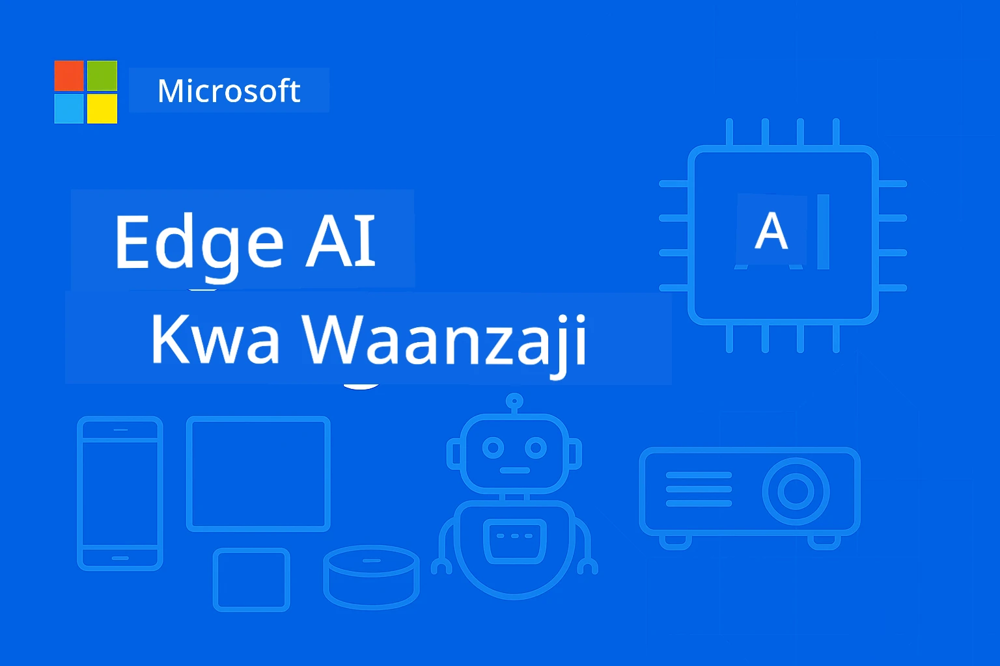

# EdgeAI kwa Waanzilishi 




[](https://GitHub.com/microsoft/edgeai-for-beginners/graphs/contributors)
[](https://GitHub.com/microsoft/edgeai-for-beginners/issues)
[](https://GitHub.com/microsoft/edgeai-for-beginners/pulls)
[](http://makeapullrequest.com)

[](https://GitHub.com/microsoft/edgeai-for-beginners/watchers)
[](https://GitHub.com/microsoft/edgeai-for-beginners/fork)
[](https://GitHub.com/microsoft/edgeai-for-beginners/stargazers)


[](https://discord.gg/nTYy5BXMWG)

Fuata hatua hizi kuanza kutumia rasilimali hizi:

1. **Tenganisha Hifadhi (Fork)**: Bonyeza [](https://GitHub.com/microsoft/edgeai-for-beginners/fork)
2. **Nakili Hifadhi (Clone)**:   `git clone https://github.com/microsoft/edgeai-for-beginners.git`
3. [**Jiunge na Azure AI Foundry Discord na ukutane na wataalamu na watengenezaji wenzako**](https://discord.com/invite/ByRwuEEgH4)


### 🌐 Msaada wa Lugha Nyingi

#### Unaungwa mkono kupitia Kitendo cha GitHub (Kifanyike Kiotomatiki & Kila Wakati Kinaboresha)

<!-- CO-OP TRANSLATOR LANGUAGES TABLE START -->
[Kiarabu](../ar/README.md) | [Kibengali](../bn/README.md) | [Kibulgaria](../bg/README.md) | [Kibama (Myanma)](../my/README.md) | [Kichina (Kilichorahisishwa)](../zh-CN/README.md) | [Kichina (Kilichotumika, Hong Kong)](../zh-HK/README.md) | [Kichina (Kilichotumika, Macau)](../zh-MO/README.md) | [Kichina (Kilichotumika, Taiwan)](../zh-TW/README.md) | [Kikroeshia](../hr/README.md) | [Kicheki](../cs/README.md) | [Kidenmaki](../da/README.md) | [Kiholanzi](../nl/README.md) | [Kiestonia](../et/README.md) | [Kifini](../fi/README.md) | [Kifaransa](../fr/README.md) | [Kijerumani](../de/README.md) | [Kigiriki](../el/README.md) | [Kiebrania](../he/README.md) | [Kihindi](../hi/README.md) | [Kihungari](../hu/README.md) | [Kiindonesia](../id/README.md) | [Kiitaliano](../it/README.md) | [Kijapani](../ja/README.md) | [Kikannada](../kn/README.md) | [Kikorea](../ko/README.md) | [Kilithuania](../lt/README.md) | [Kimelayu](../ms/README.md) | [Kimalayalam](../ml/README.md) | [Kimaratthi](../mr/README.md) | [Kinepali](../ne/README.md) | [Kipidgin cha Nigeria](../pcm/README.md) | [Kinorwe](../no/README.md) | [Kiajemi (Farsi)](../fa/README.md) | [Kipolandi](../pl/README.md) | [Kireno (Brazil)](../pt-BR/README.md) | [Kireno (Ureno)](../pt-PT/README.md) | [Kipunabi (Gurmukhi)](../pa/README.md) | [Kiromania](../ro/README.md) | [Kirusi](../ru/README.md) | [Kiserbia (Cyrillic)](../sr/README.md) | [Kislovakia](../sk/README.md) | [Kislovenia](../sl/README.md) | [Kihispania](../es/README.md) | [Kiswahili](./README.md) | [Kiswidi](../sv/README.md) | [Kitagalogi (Kifilipino)](../tl/README.md) | [Kitamili](../ta/README.md) | [Kitelugu](../te/README.md) | [Kithai](../th/README.md) | [Kituruki](../tr/README.md) | [Kiukraine](../uk/README.md) | [Kiurdu](../ur/README.md) | [Kivietnam](../vi/README.md)

> **Unapendelea Nakili Kwenye Kompyuta Binafsi?**

> Hifadhi hii ina tafsiri za lugha zaidi ya 50 ambazo huongeza ukubwa wa kupakua kwa kiasi kikubwa. Ili kunakili bila tafsiri, tumia sparse checkout:
> ```bash
> git clone --filter=blob:none --sparse https://github.com/microsoft/edgeai-for-beginners.git
> cd edgeai-for-beginners
> git sparse-checkout set --no-cone '/*' '!translations' '!translated_images'
> ```
> Hii inakupa kila kitu unachohitaji kukamilisha kozi kwa upakuaji wa haraka zaidi.
<!-- CO-OP TRANSLATOR LANGUAGES TABLE END -->

**Ikiwa unataka kuwa na lugha zaidi zinazoungwa mkono, zimetajwa [hapa](https://github.com/Azure/co-op-translator/blob/main/getting_started/supported-languages.md)**
## Utangulizi

Karibu kwenye **EdgeAI kwa Waanzilishi** – safari yako kamili katika dunia ya kubadilisha ya Akili Bandia ya Edge. Kozi hii inavuka pengo kati ya uwezo mkubwa wa AI na utekelezaji halisi wa matumizi katika vifaa vya edge, ikikuwezesha kutumia uwezo wa AI moja kwa moja mahali data inapotengenezwa na maamuzi yanapohitajika kufanywa.

### Uta Jifunze Nini

Kozi hii inakupeleka kutoka dhana za msingi hadi utekelezaji tayari wa uzalishaji, ikijumuisha:
- **Mifano Midogo ya Lugha (SLMs)** iliyoboreshwa kwa huduma katika edge
- **Uboreshaji unaoelewa vifaa** katika majukwaa mbalimbali
- **Ufafanuzi wa wakati halisi** yenye uwezo wa kuhifadhi faragha
- **Mikakati ya utoaji uzalishaji** kwa matumizi ya biashara

### Kwa Nini EdgeAI Ni Muhimu

Edge AI ni mabadiliko makubwa yanayoshughulikia changamoto za kisasa:
- **Faragha & Usalama**: Kusindika data nyeti kikanda bila kuyaweka kirahisi kwenye wingu
- **Utendaji wa wakati halisi**: Kuondoa ucheleweshaji wa mtandao kwa matumizi yanayohitaji muda muhimu
- **Ufanisi wa Gharama**: Kupunguza matumizi ya bendi ya mtandao na gharama za kompyuta wingu
- **Uendeshaji Imara**: Kuendelea kufanya kazi wakati wa kukatika mtandao
- **Uzingatiaji Sheria**: Kukidhi matakwa ya umiliki wa data

### Edge AI

Edge AI ni kuelezea kuendesha algoriti za AI na mifano ya lugha mtaani kwenye vifaa, karibu na mahali data inapotengenezwa bila kutegemea rasilimali za wingu kufanya ufafanuzi. Hii hupunguza ucheleweshaji, huongeza faragha, na kuruhusu maamuzi ya wakati halisi.

### Kanuni Muhimu:
- **Ufahamu wa ndani (on-device inference)**: Mifano ya AI inaendeshwa kwenye vifaa vya edge (simu, router, microcontrollers, PC za viwandani)
- **Uwezo wa kazi bila mtandao**: Huduma bila muunganisho wa kudumu wa mtandao
- **Ucheleweshaji mdogo**: Majibu ya papo hapo yanayofaa kwa mifumo ya wakati halisi
- **Wenendo wa data**: Kuhifadhi data nyeti ndani ya eneo, kuboresha usalama na ufuataji sheria

### Mifano Midogo ya Lugha (SLMs)

SLMs kama Phi-4, Mistral-7B, na Gemma ni matoleo yaliyobobea ya LLMs kubwa—yamefundishwa au kuchujwa kwa:
- **Kupunguza ukubwa wa kumbukumbu**: Matumizi bora ya kumbukumbu ndogo ya vifaa vya edge
- **Mahitaji ya chini ya kuhesabu**: Uboreshaji kwa CPU na utendaji wa GPU wa edge
- **Muda mfupi wa kuanzisha**: Kuanza kwa haraka kwa matumizi yenye mwitikio

Huwazindua uwezo mzito wa NLP huku wakikutana na vikwazo vya:
- **Mifumo iliyoingizwa**: Vifaa vya IoT na vidhibiti vya viwandani
- **Vifaa vya simu**: Simu za mkononi na vidonge zenye uwezo wa kufanya kazi bila mtandao
- **Vifaa vya IoT**: Vihisi na vifaa smart vyenye rasilimali ndogo
- **Vikimbizi wa edge**: Vitengo vya kusindika ndani vyenye rasilimali ndogo za GPU
- **Kompyuta Binafsi**: Mifumo ya matumizi kwenye desktop na laptop

## Moduli za Kozi & Urambazaji

| Moduli | Mada | Eneo la Kuzingatia | Maudhui Muhimu | Kiwango | Muda |
|--------|-------|------------|-------------|--------|----------|
| [📖 00 ](./introduction.md) | [Utangulizi wa EdgeAI](./introduction.md) | Msingi & Muktadha | Muhtasari wa EdgeAI • Matumizi ya Viwanda • Utangulizi wa SLM • Malengo ya Kujifunza | Mwanzo | 1-2 saa |
| [📚 01](../../Module01) | [Misingi ya EdgeAI](./Module01/README.md) | Ulinganisho kati ya Wingu na Edge AI | Misingi ya EdgeAI • Masomo ya Kesi Halisi • Mwongozo wa Utekelezaji • Utoaji wa Edge | Mwanzo | 3-4 saa |
| [🧠 02](../../Module02) | [Misingi ya Mifano ya SLM](./Module02/README.md) | Familia za Mfano & usanifu | Familia ya Phi • Familia ya Qwen • Familia ya Gemma • BitNET • μModel • Phi-Silica | Mwanzo | 4-5 saa |
| [🚀 03](../../Module03) | [Mazoezi ya Utoaji wa SLM](./Module03/README.md) | Utoaji wa ndani & wingu | Kujifunza kwa Halo • Mazingira ya Ndani • Utoaji wa Wingu | Kiwiliwili | 4-5 saa |
| [⚙️ 04](../../Module04) | [Vifaa vya Kuongeza Ufanisi wa Mfano](./Module04/README.md) | Uboreshaji wa majukwaa mbalimbali | Utangulizi • Llama.cpp • Microsoft Olive • OpenVINO • Apple MLX • Mchanganuo wa Mchakato | Kiwiliwili | 5-6 saa |
| [🔧 05](../../Module05) | [Uzazi wa SLMOps](./Module05/README.md) | Uendeshaji wa uzalishaji | Utangulizi wa SLMOps • Uchanganuzi wa Mfano • Marekebisho • Utoaji wa Uzalishaji | Kiwango cha Juu | 5-6 saa |
| [🤖 06](../../Module06) | [Wakala wa AI & Kuitisha Kazi](./Module06/README.md) | Mifumo ya wakala & MCP | Utangulizi wa Wakala • Kuitisha Kazi • Itifaki ya Muktadha wa Mfano | Kiwango cha Juu | 4-5 saa |
| [💻 07](../../Module07) | [Utekelezaji wa Jukwaa](./Module07/README.md) | Sampuli za jukwaa mbalimbali | Vifaa vya AI • Foundry Local • Uendelezaji wa Windows | Kiwango cha Juu | 3-4 saa |
| [🏭 08](../../Module08) | [Vifaa vya Foundry Local](./Module08/README.md) | Sampuli tayari uzalishaji | Maombi ya sampuli (tazama maelezo hapa chini) | Mtaalam | 8-10 saa |

### 🏭 **Moduli 08: Maombi ya Sampuli**

- [01: Anza Haraka Chat ya REST](./Module08/samples/01/README.md)
- [02: Muungano wa SDK ya OpenAI](./Module08/samples/02/README.md)
- [03: Ugunduzi wa Mfano & Ushindani wa Viwango](./Module08/samples/03/README.md)
- [04: Maombi ya Chainlit RAG](./Module08/samples/04/README.md)
- [05: Mpangilio wa Wakala Wengi](./Module08/samples/05/README.md)
- [06: Router ya Mifano kama Vifaa](./Module08/samples/06/README.md)
- [07: Mteja wa API Moja kwa Moja](./Module08/samples/07/README.md)
- [08: App ya Chat ya Windows 11](./Module08/samples/08/README.md)
- [09: Mfumo wa Wakala Wengi wa Juu](./Module08/samples/09/README.md)
- [10: Mfumo wa Vifaa vya Foundry](./Module08/samples/10/README.md)

### 🎓 **Warsha: Njia ya Kujifunza kwa Vitendo**

Vifaa kamili vya warsha za vitendo zenye utekelezaji tayari wa uzalishaji:

- **[Mwongozo wa Warsha](./Workshop/Readme.md)** - Malengo kamili ya kujifunza, matokeo, na urambazaji wa rasilimali
- **Sampuli za Python** (vikao 6) - Imeboreshwa kwa mbinu bora, usimamizi wa makosa, na nyaraka kamili
- **Vitabu vya Jupyter** (8 zenye mwingiliano) - Mafunzo kwa hatua kwa hatua yakiwa na viwango na usimamizi wa utendaji
- **Miongozo ya Vikao** - Miongozo ya kina ya markdown kwa kila kikao cha warsha
- **Vyombo vya Uthibitisho** - Mipitisho ya kuchunguza ubora wa nambari na kuendesha majaribio ya awali

**Utajenga Nini:**
- Maombi ya mazungumzo ya AI ya ndani yenye msaada wa mtiririko
- Mifumo ya RAG yenye tathmini ya ubora (RAGAS)
- Vyombo vya kulinganisha mifano mingi na uamuzi wa ushindani
- Mifumo ya mpangilio wa wakala wengi
- Uelekezaji wa akili wa mfano kwa uteuzi unaotegemea kazi

### 🎙️ **Warsha Kwa Agentic: Vitendo - Studio ya Podcast ya AI**

Tengeneza mnyororo wa uzalishaji wa podcast wa AI toka mwanzo! Warsha hii ya kina inakufundisha kuunda mfumo kamili wa wakala wengi unaobadilisha mawazo kuwa vipindi vya podcast vya kitaalam.
**[🎬 Anzisha Warsha ya Studio ya Podcast ya AI](./WorkshopForAgentic/README.md)**

**Misson Yako**: Anzisha "Future Bytes" — podcast ya teknolojia inayotumia mara kwa mara maajenti wa AI utakaojijengea mwenyewe. Hakuna utegemezi wa wingu, hakuna gharama za API — kila kitu kinaendeshwa kwa ndani kwenye kompyuta yako.

**Kinachofanya Hiki Kuwa Cha Kipekee:**
- **🤖 Umaandalizi Halisi wa Maajenti Wengi** - Jenga maajenti maalum wa AI wanaofanya utafiti, kuandika, na kuzalisha sauti
- **🎯 Mzunguko Kamili wa Uzalishaji** - Kuanzia kuchagua mada hadi kutoa sauti ya podcast ya mwisho
- **💻 Utekelezaji wa Kiasi 100% Kwenye Kompyuta Yako** - Inatumia Ollama na mifano ya ndani (Qwen-3-8B) kwa usiri kamili na udhibiti
- **🎤 Muunganisho wa Nenosauti** - Badilisha maandishi kuwa mazungumzo asili yenye sauti nyingi
- **✋ Taratibu za Binadamu Kuwa Sehemu ya Mchakato** - Vizingiti vya idhini vinahakikisha ubora huku kiotomatiki ikiendelea

**Safari ya Kujifunza ya Hatua Tatu:**

| Hatua | Lengo | Ujuzi Muhimu | Muda |
|-----|-------|------------|----------|
| **[Hatua 1: Kutana na Msaidizi Wako wa AI](./WorkshopForAgentic/md/01.BuildAIAgentWithSLM.md)** | Jenga maajenti yako wa kwanza wa AI | Muunganisho wa zana • Utafutaji wa wavuti • Utatuzi wa matatizo • Ufantaziaji wa maajenti | Saa 2-3 |
| **[Hatua 2: Kusanya Timu Yako ya Uzalishaji](./WorkshopForAgentic/md/02.AIAgentOrchestrationAndWorkflows.md)** | Kuandaa maajenti wengi | Uratibu wa timu • Taratibu za idhini • Kiolesura cha DevUI • Uangalizi wa binadamu | Saa 3-4 |
| **[Hatua 3: Fanya Podcast Yako Kuishi](./WorkshopForAgentic/md/03.Multi-SpeakerPodcastGenerationWithVibeVoice.md)** | Tengeneza sauti ya podcast | Nenosauti hadi sauti • Synthesisi ya wasemaji wengi • Sauti ya muda mrefu • Kiotomatiki kamili | Saa 2-3 |

**Teknolojia Zinazotumika:**
- **Microsoft Agent Framework** - Umaandalizi na uratibu wa maajenti wengi
- **Ollama** - Muda wa kuendesha modeli za AI za ndani (hakuna wingu linahitajika)
- **Qwen-3-8B** - Modeli ya lugha yenye chanzo wazi iliyoboreshwa kwa kazi za maajenti
- **API za Nenosauti** - Synthesis asili ya sauti kwa ajili ya utengenezwaji wa podcast

**Msaada wa Vifaa:**
- ✅ **Hali ya CPU** - Inafanya kazi kwenye kompyuta yoyote ya kisasa (inashauriwa RAM ya 8GB+)
- 🚀 **Kuongezewa Kasi kwa GPU** - Uamuzi haraka sana kwa GPUs za NVIDIA/AMD
- ⚡ **Msaada wa NPU** - Kuongeza kasi kwa kitengo cha usindikaji wa neva kizazi kipya

**Inafaa Kwa:**
- Waendelezaji wanaojifunza mifumo ya maajenti wengi wa AI
- Mtu yeyote anayevutiwa na kujiendesha kwa AI na taratibu zake
- Waumbaji wa maudhui wanaochunguza uzalishaji wa kusaidiwa na AI
- Wanafunzi wanaosoma mifumo halisi ya umaandalizi wa AI

**Anza Kujenga**: [🎙️ Warsha ya Studio ya Podcast ya AI →](./WorkshopForAgentic/README.md)

### 📊 **Muhtasari wa Njia ya Kujifunza**
- **Muda wa Jumla**: Saa 36-45
- **Njia ya Mwanzo**: Moduli 01-02 (Saa 7-9)  
- **Njia ya Kati**: Moduli 03-04 (Saa 9-11)
- **Njia ya Juu**: Moduli 05-07 (Saa 12-15)
- **Njia ya Mtaalamu**: Moduli 08 (Saa 8-10)

## Utajenge

### 🎯 Uwezo Muhimu
- **Marekebisho ya AI ya Edge**: Tengeneza mifumo ya AI inayotegemea kwanza kompyuta ya ndani na kuunganisha na wingu
- **Uboreshaji wa Modeli**: Fanya quantize na compress modeli kwa ajili ya utekelezaji wa edge (kuongezeka kwa kasi kwa 85%, kupunguzwa ukubwa kwa 75%)
- **Utekelezaji Kwenye Majukwaa Mengi**: Windows, simu, vitu vilivyojumuishwa, na mifumo mchanganyiko ya wingu na edge
- **Uendeshaji wa Uzalishaji**: Ufuatiliaji, upanuzi, na matengenezo ya AI ya edge iwe kazini

### 🏗️ Miradi ya Kivitendo
- **Programu za Mazungumzo za Foundry Local**: Programu ya Windows 11 yenye uwezo wa kubadili modeli
- **Mifumo ya Maajenti Wengi**: Mratibu na maajenti maalum kwa taratibu tata  
- **Programu za RAG**: Usindikaji wa nyaraka za ndani kwa utafutaji wa vector
- **Mitaratibu ya Modeli**: Uchaguzi mahiri kati ya modeli kulingana na uchambuzi wa kazi
- **Mifumo ya API**: Wateja watayarishwa kwa uzalishaji wenye mtiririko na ufuatiliaji wa afya
- **Zana za Mifumo Mbalimbali**: Mifumo ya kuunganisha LangChain/Semantic Kernel

### 🏢 Maombi ya Sekta
**Uzalishaji** • **Huduma za Afya** • **Magari Yanayojitegemea** • **Miji Mcha Mungu** • **Programu za Simu**

## Anza Haraka

**Njia Inayopendekezwa ya Kujifunza** (saa 20-30 jumla):

0. **📖 Utangulizi** ([Introduction.md](./introduction.md)): Msingi wa EdgeAI + muktadha wa sekta + mfumo wa kujifunza
1. **📚 Msingi** (Moduli 01-02): Dhana za EdgeAI + familia za modeli za SLM
2. **⚙️ Uboreshaji** (Moduli 03-04): Utekelezaji + mifumo ya quantization  
3. **🚀 Uzalishaji** (Moduli 05-06): SLMOps + maajenti wa AI + upigaji wa simu za kazi
4. **💻 Utekelezaji** (Moduli 07-08): Sampuli za jukwaa + zana ya Foundry Local

Kila moduli inajumuisha nadharia, mazoezi ya vitendo, na mifano ya msimbo tayari kwa uzalishaji.

## Mwelekeo wa Kazi

**Nafasi za Kifundi**: Mbuni wa Suluhisho za EdgeAI • Mhandisi wa ML (Edge) • Mendelezaji wa AI wa IoT • Mendelezaji wa AI wa Simu

**Sekta za Kazi**: Uzalishaji 4.0 • Teknolojia ya Huduma za Afya • Mifumo Yanayojitegemea • FinTech • Vifaa vya Kielektroniki vya Wateja

**Miradi ya Portfolio**: Mifumo ya maajenti wengi • Programu za RAG za uzalishaji • Utekelezaji wa jukwaa nyingi • Uboreshaji wa utendaji

## Muundo wa Hifadhi

```
edgeai-for-beginners/
├── 📖 introduction.md  # Foundation: EdgeAI Overview & Learning Framework
├── 📚 Module01-04/     # Fundamentals → SLMs → Deployment → Optimization  
├── 🔧 Module05-06/     # SLMOps → AI Agents → Function Calling
├── 💻 Module07/        # Platform Samples (VS Code, Windows, Jetson, Mobile)
├── 🏭 Module08/        # Foundry Local Toolkit + 10 Comprehensive Samples
│   ├── samples/01-06/  # Foundation: REST, SDK, RAG, Agents, Routing
│   └── samples/07-10/  # Advanced: API Client, Windows App, Enterprise Agents, Tools
├── 🌐 translations/    # Multi-language support (8+ languages)
└── 📋 STUDY_GUIDE.md   # Structured learning paths & time allocation
```

## Mambo Muhimu ya Kozi

✅ **Kujifunza kwa Taratibu**: Nadharia → Vitendo → Utekelezaji wa uzalishaji  
✅ **Mifano Halisi**: Microsoft, Japan Airlines, utekelezaji wa biashara  
✅ **Mifano ya Vitendo**: Mifano 50+, maonyesho 10 ya kina ya Foundry Local  
✅ **Kuzingatia Utendaji**: Maboresho ya kasi ya 85%, upunguzaji wa ukubwa wa 75%  
✅ **Jukwaa Mbalimbali**: Windows, simu, vitu vilivyojumuishwa, mchanganyiko wa wingu-edge  
✅ **Tayari Kwa Uzalishaji**: Ufuatiliaji, upanuzi, usalama, mifumo ya kufuata taratibu

📖 **[Mwongozo wa Kujifunza Unapatikana](STUDY_GUIDE.md)**: Njia ya kujifunza ya saa 20 yenye muundo na mwongozo wa mgawanyo wa muda pamoja na zana za auto-uhakiki.

---

**EdgeAI ni mustakabali wa utekelezaji wa AI**: kwanza kwenye eneo la kompyuta za ndani, inalinda faragha, na ina ufanisi. Himiza ujuzi huu kujenga kizazi kijacho cha programu za akili.

## Kozi Nyingine

Timu yetu hutengeneza kozi nyingine! Angalia:

<!-- CO-OP TRANSLATOR OTHER COURSES START -->
### LangChain
[](https://aka.ms/langchain4j-for-beginners)
[](https://aka.ms/langchainjs-for-beginners?WT.mc_id=m365-94501-dwahlin)

---

### Azure / Edge / MCP / Maajenti
[](https://github.com/microsoft/AZD-for-beginners?WT.mc_id=academic-105485-koreyst)
[](https://github.com/microsoft/edgeai-for-beginners?WT.mc_id=academic-105485-koreyst)
[](https://github.com/microsoft/mcp-for-beginners?WT.mc_id=academic-105485-koreyst)
[](https://github.com/microsoft/ai-agents-for-beginners?WT.mc_id=academic-105485-koreyst)

---
 
### Mfululizo wa AI ya Uumbaji
[](https://github.com/microsoft/generative-ai-for-beginners?WT.mc_id=academic-105485-koreyst)
[-9333EA?style=for-the-badge&labelColor=E5E7EB&color=9333EA)](https://github.com/microsoft/Generative-AI-for-beginners-dotnet?WT.mc_id=academic-105485-koreyst)
[-C084FC?style=for-the-badge&labelColor=E5E7EB&color=C084FC)](https://github.com/microsoft/generative-ai-for-beginners-java?WT.mc_id=academic-105485-koreyst)
[-E879F9?style=for-the-badge&labelColor=E5E7EB&color=E879F9)](https://github.com/microsoft/generative-ai-with-javascript?WT.mc_id=academic-105485-koreyst)

---
 
### Kujifunza Msingi
[](https://aka.ms/ml-beginners?WT.mc_id=academic-105485-koreyst)
[](https://aka.ms/datascience-beginners?WT.mc_id=academic-105485-koreyst)
[](https://aka.ms/ai-beginners?WT.mc_id=academic-105485-koreyst)
[](https://github.com/microsoft/Security-101?WT.mc_id=academic-96948-sayoung)
[](https://aka.ms/webdev-beginners?WT.mc_id=academic-105485-koreyst)
[](https://aka.ms/iot-beginners?WT.mc_id=academic-105485-koreyst)
[](https://github.com/microsoft/xr-development-for-beginners?WT.mc_id=academic-105485-koreyst)

---
 
### Mfululizo wa Copilot
[](https://aka.ms/GitHubCopilotAI?WT.mc_id=academic-105485-koreyst)
[](https://github.com/microsoft/mastering-github-copilot-for-dotnet-csharp-developers?WT.mc_id=academic-105485-koreyst)
[](https://github.com/microsoft/CopilotAdventures?WT.mc_id=academic-105485-koreyst)
<!-- CO-OP TRANSLATOR OTHER COURSES END -->

## Kupata Msaada

Kama utakwama au una maswali yoyote kuhusu kujenga programu za AI, jiunge:

[](https://discord.gg/nTYy5BXMWG)

Kama una maoni kuhusu bidhaa au makosa wakati wa kujenga tembelea:

[](https://aka.ms/foundry/forum)

---

<!-- CO-OP TRANSLATOR DISCLAIMER START -->
**Kagua**:  
Hati hii imetafsiriwa kwa kutumia huduma ya tafsiri ya AI [Co-op Translator](https://github.com/Azure/co-op-translator). Ingawa tunajitahidi kwa usahihi, tafadhali fahamu kuwa tafsiri za kiotomatiki zinaweza kuwa na makosa au ukosefu wa usahihi. Hati ya asili katika lugha yake ya asili inapaswa kuzingatiwa kama chanzo cha mamlaka. Kwa taarifa muhimu, tafsiri ya kitaalamu ya binadamu inapendekezwa. Hatubebeshi dhima kwa kutoelewana au tafsiri potofu zinazotokana na matumizi ya tafsiri hii.
<!-- CO-OP TRANSLATOR DISCLAIMER END -->