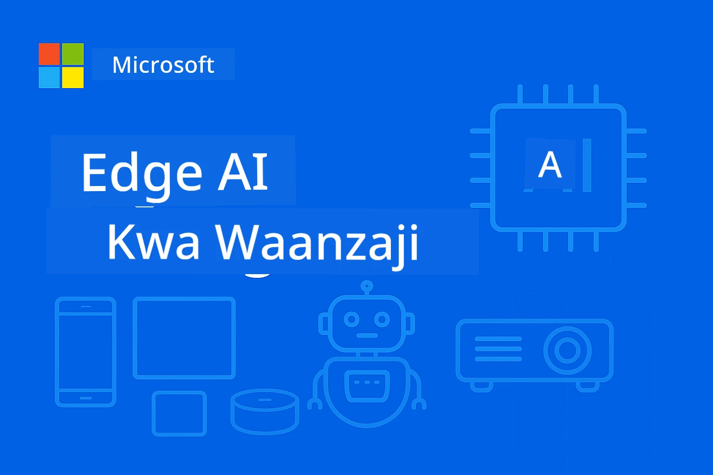

# EdgeAI kwa Wakianza 




[](https://GitHub.com/microsoft/edgeai-for-beginners/graphs/contributors)
[](https://GitHub.com/microsoft/edgeai-for-beginners/issues)
[](https://GitHub.com/microsoft/edgeai-for-beginners/pulls)
[](http://makeapullrequest.com)

[](https://GitHub.com/microsoft/edgeai-for-beginners/watchers)
[](https://GitHub.com/microsoft/edgeai-for-beginners/fork)
[](https://GitHub.com/microsoft/edgeai-for-beginners/stargazers)


[](https://discord.gg/nTYy5BXMWG)

Fuata hatua hizi kuanza kutumia rasilimali hizi:

1. **Fokea Hifadhi ya Kumbukumbu**: Bonyeza [](https://GitHub.com/microsoft/edgeai-for-beginners/fork)
2. **Nakili Hifadhi ya Kumbukumbu**:   `git clone https://github.com/microsoft/edgeai-for-beginners.git`
3. [**Jiunge na Azure AI Foundry Discord na ukutane na wataalamu na watengenezaji wenzako**](https://discord.com/invite/ByRwuEEgH4)


### 🌐 Msaada wa Lugha Nyingi

#### Unaungwa mkono kupitia Hatua ya GitHub (Yenye Otomatiki & Daima ya Kisasa)

<!-- CO-OP TRANSLATOR LANGUAGES TABLE START -->
[Kiarabu](../ar/README.md) | [Kibenzi](../bn/README.md) | [Kibulgaria](../bg/README.md) | [Kiburma (Myanma)](../my/README.md) | [Kichina (Rahisi)](../zh-CN/README.md) | [Kichina (Kiasili, Hong Kong)](../zh-HK/README.md) | [Kichina (Kiasili, Macau)](../zh-MO/README.md) | [Kichina (Kiasili, Taiwan)](../zh-TW/README.md) | [Kikroatia](../hr/README.md) | [Kicheki](../cs/README.md) | [Kideni](../da/README.md) | [Kiholanzi](../nl/README.md) | [Kiestonia](../et/README.md) | [Kifini](../fi/README.md) | [Kifaransa](../fr/README.md) | [Kijerumani](../de/README.md) | [Kigiriki](../el/README.md) | [Kiheberi](../he/README.md) | [Kihindi](../hi/README.md) | [Kihungari](../hu/README.md) | [Kiindonesian](../id/README.md) | [Kiitaliano](../it/README.md) | [Kijapani](../ja/README.md) | [Kikannada](../kn/README.md) | [Kikimeri](../km/README.md) | [Kikorea](../ko/README.md) | [Kilitwania](../lt/README.md) | [Kimalay](../ms/README.md) | [Kimalayalam](../ml/README.md) | [Kimarathi](../mr/README.md) | [Kinepali](../ne/README.md) | [Kipidgin cha Nigeria](../pcm/README.md) | [Kinorwe](../no/README.md) | [Kifarsi (Farsi)](../fa/README.md) | [Kipolishi](../pl/README.md) | [Kireno (Brazil)](../pt-BR/README.md) | [Kireno (Portugal)](../pt-PT/README.md) | [Kipunja (Gurmukhi)](../pa/README.md) | [Kromania](../ro/README.md) | [Kirusi](../ru/README.md) | [Kiserbia (Cyrillic)](../sr/README.md) | [Kislovakia](../sk/README.md) | [Kislovenia](../sl/README.md) | [Kihispania](../es/README.md) | [Kiswahili](./README.md) | [Kiswidi](../sv/README.md) | [Kitagalog (Kifilipino)](../tl/README.md) | [Kitamili](../ta/README.md) | [Kitelugu](../te/README.md) | [Kithai](../th/README.md) | [Kituruki](../tr/README.md) | [Kiukrania](../uk/README.md) | [Kiurdu](../ur/README.md) | [Kivietinamu](../vi/README.md)

> **Unapendelea Kukopa Kwenye Kompyuta Binafsi?**
>
> Hifadhi hii ya kumbukumbu ina tafsiri za lugha zaidi ya 50 ambazo huongeza ukubwa wa kupakua kwa kiasi kikubwa. Ili kukopa bila tafsiri, tumia sparse checkout:
>
> **Bash / macOS / Linux:**
> ```bash
> git clone --filter=blob:none --sparse https://github.com/microsoft/edgeai-for-beginners.git
> cd edgeai-for-beginners
> git sparse-checkout set --no-cone '/*' '!translations' '!translated_images'
> ```
>
> **CMD (Windows):**
> ```cmd
> git clone --filter=blob:none --sparse https://github.com/microsoft/edgeai-for-beginners.git
> cd edgeai-for-beginners
> git sparse-checkout set --no-cone "/*" "!translations" "!translated_images"
> ```
>
> Hii inakupa kila kitu unachohitaji kukamilisha kozi kwa upakuaji wa haraka zaidi.
<!-- CO-OP TRANSLATOR LANGUAGES TABLE END -->

**Ikiwa unataka lugha za ziada za tafsiri, ziliopo [hapa](https://github.com/Azure/co-op-translator/blob/main/getting_started/supported-languages.md)**
## Utangulizi

Karibu kwa **EdgeAI kwa Wakianza** – safari yako kamili ndani ya dunia ya mageuzi ya Akili Bandia ya Edge. Kozi hii inaunganisha daraja kati ya uwezo mkubwa wa AI na utekelezaji wa vitendo unaoendeshwa kwenye vifaa vya edge, ikikuwezesha kutumia uwezo wa AI moja kwa moja mahali ambapo data inazalishwa na maamuzi yanapaswa kufanywa.

### Utajifunza Nini

Kozi hii inakupeleka kutoka kwa dhana za msingi hadi utekelezaji tayari kwa uzalishaji, ikijumuisha:
- **Modeli Ndogo za Lugha (SLMs)** zilizorekebishwa kwa ajili ya kuendeshwa kwenye edge
- **Uboreshaji unaojali vifaa** katika majukwaa mbalimbali
- **Utambuzi wa wakati halisi** wenye uwezo wa kuhifadhi faragha
- **Mikakati ya uzalishaji** kwa matumizi ya biashara

### Kwa Nini EdgeAI ni Muhimu

Edge AI ni mabadiliko makubwa yanayojibu changamoto muhimu za kisasa:
- **Faragha na Usalama**: Fanya usindikaji wa data nyeti kwenye eneo bila kuonyesha wingu
- **Utendaji wa Muda Halisi**: Ondoa ucheleweshaji wa mtandao kwa maombi ya wakati wa haraka
- **Ufanisi wa Gharama**: Punguza matumizi ya bendi ya mtandao na gharama za kompyuta za wingu
- **Uendeshaji Shupavu**: Endelea kufanya kazi wakati wa kutokuwepo kwa mtandao
- **Uzingatiaji wa Sheria**: Kamilisha mahitaji ya udhibiti wa data

### Akili Bandia ya Edge

Edge AI inahusu kuendesha algoriti za AI na modeli za lugha kwenye vifaa vya karibu, karibu na mahali data inazalishwa bila kutegemea rasilimali za wingu kwa utambuzi. Inapunguza ucheleweshaji, inaongeza faragha, na kuwezesha maamuzi ya wakati halisi.

### Kanuni Muhimu:
- **Utambuzi kwenye kifaa**: Modeli za AI zinaendelea kwenye vifaa vya edge (simu, router, microcontrollers, kompyuta viwandani)
- **Uwezo wa mtandao usiokuwa wa kudumu**: Hufanya kazi bila uunganisho wa mtandao endelevu
- **Ucheleweshaji mdogo**: Majibu ya haraka kwa mifumo ya wakati halisi
- **Udhibiti wa data**: Hushikilia data nyeti ndani, kuboresha usalama na uzingatiaji

### Modeli Ndogo za Lugha (SLMs)

SLMs kama Phi-4, Mistral-7B, na Gemma ni toleo zilizorekebishwa za LLM kubwa—zilizo funzwa au kusafishwa kwa ajili ya:
- **Kupunguza matumizi ya kumbukumbu**: Matumizi ya ufanisi ya kumbukumbu chache za kifaa cha edge
- **Mahitaji madogo ya kompyuta**: Zilizorekebishwa kwa utendaji wa CPU na GPU za edge
- **Muda mfupi wa kuanzisha**: Kuanza haraka kwa matumizi yenye majibu ya haraka

Huzindua uwezo mkubwa wa NLP huku zikifuata vizingiti vya:
- **Mifumo iliyojengewa ndani**: Vifaa vya IoT na vidhibiti viwandani
- **Vifaa vya Mkononi**: Simu mahiri na vidonge vyenye uwezo wa offline
- **Vifaa vya IoT**: Vihisi na vifaa mahiri vyenye rasilimali chache
- **Seva za Edge**: Vitengo vya usindikaji wa karibu vyenye rasilimali duni za GPU
- **Kompyuta Binafsi**: Matumizi kwenye mezani na kompyuta mpakato

## Moduli za Kozi & Uelekezaji

| Moduli | Mada | Eneo la Kuzingatia | Yaliyomo Muhimu | Kiwango | Muda |
|--------|-------|------------|-------------|--------|----------|
| [📖 00 ](./introduction.md) | [Utangulizi wa EdgeAI](./introduction.md) | Msingi & Muktadha | Muhtasari wa EdgeAI • Matumizi ya Sekta • Utangulizi wa SLM • Malengo ya Kujifunza | Mwanzo | 1-2 hrs |
| [📚 01](../../Module01) | [Misingi ya EdgeAI](./Module01/README.md) | Mlinganisho wa Wingu na Edge AI | Misingi ya EdgeAI • Masomo Halisi ya Dunia • Mwongozo wa Utekelezaji • Utekelezaji wa Edge | Mwanzo | 3-4 hrs |
| [🧠 02](../../Module02) | [Misingi ya Modeli za SLM](./Module02/README.md) | Familia za modeli & usanifu | Familia ya Phi • Familia ya Qwen • Familia ya Gemma • BitNET • μModel • Phi-Silica | Mwanzo | 4-5 hrs |
| [🚀 03](../../Module03) | [Mazingira ya Utekelezaji wa SLM](./Module03/README.md) | Utekelezaji wa ndani & wingu | Kujifunza Kiwanda • Mazingira ya Ndani • Utekelezaji wa Wingu | Kati | 4-5 hrs |
| [⚙️ 04](../../Module04) | [Mfuko wa Zana za Uboreshaji](./Module04/README.md) | Uboreshaji mtambuka majukwaa | Utangulizi • Llama.cpp • Microsoft Olive • OpenVINO • Apple MLX • Muundo wa Mchakato | Kati | 5-6 hrs |
| [🔧 05](../../Module05) | [Uendeshaji wa SLMOps kwa Uzalishaji](./Module05/README.md) | Uendeshaji kwa uzalishaji | Utangulizi wa SLMOps • Uchanganuzi wa Modeli • Uboreshaji • Utekelezaji wa Uzalishaji | Kidini | 5-6 hrs |
| [🤖 06](../../Module06) | [Wakala wa AI & Kupiga Simu za Kazi](./Module06/README.md) | Fremu za wakala & MCP | Utangulizi wa Wakala • Kupiga simu za kazi • Itifaki ya muktadha wa modeli | Kidini | 4-5 hrs |
| [💻 07](../../Module07) | [Utekelezaji wa Jukwaa](./Module07/README.md) | Sampuli mtambuka jukwaa | Mfuko wa Zana za AI • Foundry Local • Maendeleo ya Windows | Kidini | 3-4 hrs |
| [🏭 08](../../Module08) | [Mfuko wa Zana wa Foundry Local](./Module08/README.md) | Sampuli tayari kwa uzalishaji | Programu za sampuli (angalia maelezo hapa chini) | Mtaalamu | 8-10 hrs |

### 🏭 **Moduli 08: Programu za Sampuli**

- [01: Anza Haraka ya Chat REST](./Module08/samples/01/README.md)
- [02: Uunganisho wa SDK ya OpenAI](./Module08/samples/02/README.md)
- [03: Ugunduzi wa Modeli & Kulinganisha](./Module08/samples/03/README.md)
- [04: Programu ya Chainlit RAG](./Module08/samples/04/README.md)
- [05: Usimamizi wa Wakala Mengi](./Module08/samples/05/README.md)
- [06: Zana za Routing za Modeli](./Module08/samples/06/README.md)
- [07: Mteja wa API Moja kwa Moja](./Module08/samples/07/README.md)
- [08: Programu ya Chat Windows 11](./Module08/samples/08/README.md)
- [09: Mfumo wa Wakala Wengi wa Juu](./Module08/samples/09/README.md)
- [10: Fremu za Zana za Foundry](./Module08/samples/10/README.md)

### 🎓 **Warsha: Njia ya Kujifunza kwa Vitendo**

Vifaa kamili vya warsha ya kujifunza kwa vitendo na utekelezaji tayari kwa uzalishaji:

- **[Mwongozo wa Warsha](./Workshop/Readme.md)** - Malengo kamili ya kujifunza, matokeo, na uelekezaji wa rasilimali
- **Sampuli za Python** (vikao 6) - Zilisasishwa kwa mbinu bora, kushughulikia makosa, na nyaraka kamili
- **Daftari za Jupyter** (vya kuingiliana 8) - Mafunzo hatua kwa hatua na vipimo na ufuatiliaji wa utendaji
- **Mwongozo wa Vikao** - Mwongozo wa kina wa markdown kwa kila kikao cha warsha
- **Zana za Uthibitisho** - Skripti za kuthibitisha ubora wa msimbo na kuendesha majaribio ya mvuke

**Utajenga Nini:**
- Programu za AI za mazungumzo za ndani zenye mkondo wa taarifa
- Mabomba ya RAG yenye tathmini ya ubora (RAGAS)
- Zana za kulinganisha na kupima modeli nyingi
- Mifumo ya usimamizi wa wakala wengi
- Routing ya akili ya modeli kwa uchaguzi wa kazi

### 🎙️ **Warsha kwa Agentic: Kujifunza kwa Vitendo - Studio ya Podcast ya AI**
Jenga njia ya uzalishaji wa podikasti inayotumia akili bandia kutoka mwanzoni kabisa! Warsha hii ya kipekee inakufundisha kuunda mfumo kamili wa mawakala wengi unaobadilisha mawazo kuwa vipindi vya podikasti vya kitaalamu.

**[🎬 Anza Warsha ya AI Podcast Studio](./WorkshopForAgentic/README.md)**

**Lengo Lako**: Anzisha "Future Bytes" — podikasti ya teknolojia inayotumia mawakala wa AI wote ambao wewe utakayejenga. Hakuna utegemezi wa wingu, hakuna gharama za API — kila kitu kinaendeshwa ndani ya kompyuta yako mwenyewe.

**Kinachofanya Hiki Kiwe Maalum:**
- **🤖 Uendeshaji wa Maendeleo wa Mawakala Wengi Halisi** - Jenga mawakala maalumu wa AI wanaofanya utafiti, kuandika, na kutengeneza sauti
- **🎯 Njia Kamili ya Uzalishaji** - Kutoka kwa uchaguzi wa mada hadi sauti ya mwisho ya podikasti
- **💻 Utekelezaji wa Kiasili 100%** - Inatumia Ollama na mifano ya ndani (Qwen-3-8B) kwa faragha kamili na udhibiti
- **🎤 Muunganisho wa Maandishi-Kwa-Sauti** - Badilisha maandishi kuwa mazungumzo asilia yasiyo na sauti ya bandia ya wazungumzaji wengi
- **✋ Mikakati yenye Mtu katika Mzunguko** - Mlezi wa idhini unahakikisha ubora huku kiotomatiki ikiendelea

**Safari ya Kujifunza yenye Vipindi Vitatu:**

| Kipindi | Lengo | Ujuzi Muhimu | Muda |
|---------|--------|--------------|------|
| **[Kipindi 1: Kutambulisha Msaidizi Wako wa AI](./WorkshopForAgentic/md/01.BuildAIAgentWithSLM.md)** | Jenga msaidizi wako wa kwanza wa AI | Muunganisho wa zana • Utafutaji mtandaoni • Kutatua matatizo • Fikira za mawakala | Saa 2-3 |
| **[Kipindi 2: Kusanya Timu Yako ya Uzalishaji](./WorkshopForAgentic/md/02.AIAgentOrchestrationAndWorkflows.md)** | Kuandaa mawakala wengi | Uratibu wa timu • Mikakati ya idhini • Kiolesura cha DevUI • Usimamizi wa binadamu | Saa 3-4 |
| **[Kipindi 3: Kuleta Podikasti Yako Kuwa Hai](./WorkshopForAgentic/md/03.Multi-SpeakerPodcastGenerationWithVibeVoice.md)** | Tengeneza sauti ya podikasti | Maandishi-kwa-sauti • muundo wa wazungumzaji wengi • sauti ndefu • otomatiki kamili | Saa 2-3 |

**Teknolojia Zinazotumika:**
- **Microsoft Agent Framework** - Uratibu na usimamizi wa mawakala wengi
- **Ollama** - Muda wa utekelezaji wa mfano wa AI wa ndani (hakuna hitaji la wingu)
- **Qwen-3-8B** - Mfano wa lugha wa chanzo wazi ulioboreshwa kwa kazi za mawakala
- **API za Maandishi-Kwa-Sauti** - Muundaji sauti asilia kwa uzalishaji wa podikasti

**Msaada wa Vifaa:**
- ✅ **Hali ya CPU** - Inafanya kazi kwenye kompyuta yoyote ya kisasa (inapendekezwa RAM ya 8GB+)
- 🚀 **Kuendesha kwa GPU** - Uendeshaji haraka kwa vifaa vya NVIDIA/AMD
- ⚡ **Msaada wa NPU** - Kuongeza kasi kwa kifaa kijacho cha kusindika neva

**Inafaa Kwa:**
- Waendelezaji wanaojifunza mifumo ya mawakala wengi wa AI
- Yoyote anayevutiwa na otomatiki ya AI na mikakati ya kazi
- Waandishi wa maudhui wanaochunguza uzalishaji wa kusaidiwa na AI
- Wanafunzi wanaosoma mifumo ya vitendo ya usimamizi wa AI

**Anza Kujenga**: [🎙️ Warsha ya AI Podcast Studio →](./WorkshopForAgentic/README.md)

### 📊 **Muhtasari wa Njia ya Kujifunza**
- **Muda wa Jumla**: Saa 36-45
- **Njia ya Mwanzo**: Moduli 01-02 (saa 7-9)  
- **Njia ya Kati**: Moduli 03-04 (saa 9-11)  
- **Njia ya Juu**: Moduli 05-07 (saa 12-15)  
- **Njia ya Mtaalamu**: Moduli 08 (saa 8-10)

## Kitu Kitakachojengwa

### 🎯 Ujuzi wa Msingi
- **Ujenzi wa AI wa Kupitia-Mwisho**: Buni mifumo ya AI kiasili kwanza na uunganishaji wa wingu
- **Uboreshaji wa Mfano**: Punguza ukubwa na kuboresha mifano kwa ajili ya utekelezaji wa pembezoni (ongezeko la kasi la 85%, upunguzaji wa ukubwa la 75%)
- **Utekelezaji wa Miundo Mbalimbali**: Windows, simu, vifaa vilivyochanganywa na mifumo ya wingu-pembezoni
- **Uendeshaji wa Uzalishaji**: Ufuatiliaji, upanuzi, na matengenezo ya AI pembezoni katika uzalishaji

### 🏗️ Miradi ya Vitendo
- **Programu za Mazungumzo za Foundry Local**: Programu ya asili ya Windows 11 yenye kubadilisha mfano
- **Mifumo ya Mawakala Wengi**: Mratibu na mawakala maalumu kwa mikakati tata  
- **Programu za RAG**: Usindikaji nyaraka wa ndani pamoja na utafutaji kwa vector
- **Marudio ya Mfano**: Uchaguzi wa akili kati ya mifano kulingana na uchambuzi wa kazi
- **Miundombinu ya API**: Wateja tayari kwa uzalishaji yenye mtiririko na ufuatiliaji wa afya
- **Zana za Miundombinu ya Mifumo Mbalimbali**: Muundo wa muunganisho wa LangChain/Semantic Kernel

### 🏢 Matumizi ya Sekta
**Utengenezaji** • **Huduma za Afya** • **Magari Yanayotumia AI** • **Miji Smart** • **Programu za Simu**

## Anza Haraka

**Njia ya Kujifunza Inayopendekezwa** (saa 20-30 jumla):

0. **📖 Utangulizi** ([Introduction.md](./introduction.md)): Msingi wa EdgeAI + muktadha wa sekta + mfumo wa kujifunza
1. **📚 Misingi** (Moduli 01-02): Dhahania za EdgeAI + familia za modeli za SLM
2. **⚙️ Uboreshaji** (Moduli 03-04): Miundo ya utekelezaji + kupunguza ukubwa  
3. **🚀 Uzalishaji** (Moduli 05-06): SLMOps + mawakala wa AI + wito wa kazi
4. **💻 Utekelezaji** (Moduli 07-08): Sampuli za miundombinu + Seti ya zana ya Foundry Local

Kila moduli ina nadharia, mazoezi ya vitendo, na mifano ya nambari tayari kwa uzalishaji.

## Athari kwa Kazi

**Nafasi za Kiufundi**: Mtaalamu wa Suluhisho za EdgeAI • Mhandisi wa ML (Edge) • Mtaalamu wa AI wa IoT • Mtaalamu wa AI wa Simu

**Sekta za Viwanda**: Utengenezaji 4.0 • Teknolojia ya Huduma za Afya • Mifumo Huru • FinTech • Vifaa vya Kielektroniki vya Watumiaji

**Miradi ya Mtsindo**: Mifumo ya mawakala wengi • Programu za RAG za uzalishaji • Utekelezaji wa mifumo mingi • Uboreshaji wa utendaji

## Muundo wa Hifadhi ya Faili

```
edgeai-for-beginners/
├── 📖 introduction.md  # Foundation: EdgeAI Overview & Learning Framework
├── 📚 Module01-04/     # Fundamentals → SLMs → Deployment → Optimization  
├── 🔧 Module05-06/     # SLMOps → AI Agents → Function Calling
├── 💻 Module07/        # Platform Samples (VS Code, Windows, Jetson, Mobile)
├── 🏭 Module08/        # Foundry Local Toolkit + 10 Comprehensive Samples
│   ├── samples/01-06/  # Foundation: REST, SDK, RAG, Agents, Routing
│   └── samples/07-10/  # Advanced: API Client, Windows App, Enterprise Agents, Tools
├── 🌐 translations/    # Multi-language support (8+ languages)
└── 📋 STUDY_GUIDE.md   # Structured learning paths & time allocation
```

## Vinukuu vya Kozi

✅ **Kujifunza kwa Hatua**: Nadharia → Vitendo → Utekelezaji wa uzalishaji  
✅ **Mifano Halisi**: Microsoft, Japan Airlines, utekelezaji wa mashirika  
✅ **Mifano ya Vitendo**: Mifano 50+, maonyesho 10 ya kina ya Foundry Local  
✅ **Kuzingatia Utendaji**: Maboresho ya kasi 85%, upunguzaji wa ukubwa 75%  
✅ **Mifumo Mbalimbali**: Windows, simu, vifaa vilivyojumuishwa, wingu-pembezoni  
✅ **Tayari kwa Uzalishaji**: Ufuatiliaji, upanaji, usalama, mifumo ya kufuata taratibu

📖 **[Mwongozo wa Kujifunza Upatikana](STUDY_GUIDE.md)**: Njia iliyopangwa ya safari ya saa 20 na mwongozo wa mgawanyo wa muda na zana za kujitathmini.

---

**EdgeAI ni mustakabali wa utekelezaji wa AI**: kwanza ndani ya eneo, kuhifadhi faragha, na ufanisi. Jifunze ujuzi huu kujenga kizazi kijacho cha programu zenye akili.

## Kozi Nyingine

Timu yetu hutengeneza kozi nyingine! Angalia:

<!-- CO-OP TRANSLATOR OTHER COURSES START -->
### LangChain
[](https://aka.ms/langchain4j-for-beginners)
[](https://aka.ms/langchainjs-for-beginners?WT.mc_id=m365-94501-dwahlin)
[](https://github.com/microsoft/langchain-for-beginners?WT.mc_id=m365-94501-dwahlin)
---

### Azure / Edge / MCP / Wakala
[](https://github.com/microsoft/AZD-for-beginners?WT.mc_id=academic-105485-koreyst)
[](https://github.com/microsoft/edgeai-for-beginners?WT.mc_id=academic-105485-koreyst)
[](https://github.com/microsoft/mcp-for-beginners?WT.mc_id=academic-105485-koreyst)
[](https://github.com/microsoft/ai-agents-for-beginners?WT.mc_id=academic-105485-koreyst)

---
 
### Mfululizo wa AI Inayozalisha
[](https://github.com/microsoft/generative-ai-for-beginners?WT.mc_id=academic-105485-koreyst)
[-9333EA?style=for-the-badge&labelColor=E5E7EB&color=9333EA)](https://github.com/microsoft/Generative-AI-for-beginners-dotnet?WT.mc_id=academic-105485-koreyst)
[-C084FC?style=for-the-badge&labelColor=E5E7EB&color=C084FC)](https://github.com/microsoft/generative-ai-for-beginners-java?WT.mc_id=academic-105485-koreyst)
[-E879F9?style=for-the-badge&labelColor=E5E7EB&color=E879F9)](https://github.com/microsoft/generative-ai-with-javascript?WT.mc_id=academic-105485-koreyst)

---
 
### Kujifunza Msingi
[](https://aka.ms/ml-beginners?WT.mc_id=academic-105485-koreyst)
[](https://aka.ms/datascience-beginners?WT.mc_id=academic-105485-koreyst)
[](https://aka.ms/ai-beginners?WT.mc_id=academic-105485-koreyst)
[](https://github.com/microsoft/Security-101?WT.mc_id=academic-96948-sayoung)
[](https://aka.ms/webdev-beginners?WT.mc_id=academic-105485-koreyst)
[](https://aka.ms/iot-beginners?WT.mc_id=academic-105485-koreyst)
[](https://github.com/microsoft/xr-development-for-beginners?WT.mc_id=academic-105485-koreyst)

---
 
### Mfululizo wa Copilot
[](https://aka.ms/GitHubCopilotAI?WT.mc_id=academic-105485-koreyst)
[](https://github.com/microsoft/mastering-github-copilot-for-dotnet-csharp-developers?WT.mc_id=academic-105485-koreyst)
[](https://github.com/microsoft/CopilotAdventures?WT.mc_id=academic-105485-koreyst)
<!-- CO-OP TRANSLATOR OTHER COURSES END -->

## Kupata Msaada

Iwapo utashindwa au ukiwa na maswali kuhusu ujenzi wa programu za AI, jiunge na:

[](https://discord.gg/nTYy5BXMWG)

Kama una mrejesho wa bidhaa au makosa wakati wa kujenga tembelea:

[](https://aka.ms/foundry/forum)

---

<!-- CO-OP TRANSLATOR DISCLAIMER START -->
**Hati ya Kukana**:  
Hati hii imetafsiriwa kwa kutumia huduma ya tafsiri ya AI [Co-op Translator](https://github.com/Azure/co-op-translator). Ingawa tunajitahidi kuwa sahihi, tafadhali fahamu kwamba tafsiri za kiotomatiki zinaweza kuwa na makosa au upotoshwaji. Hati asili katika lugha yake ya asili inapaswa kuzingatiwa kama chanzo cha mamlaka. Kwa taarifa muhimu, tafsiri ya kitaalamu ya binadamu inapendekezwa. Hatuwezi kuwajibika kwa lolote dhana potofu au tafsiri mbaya zinazotokana na matumizi ya tafsiri hii.
<!-- CO-OP TRANSLATOR DISCLAIMER END -->