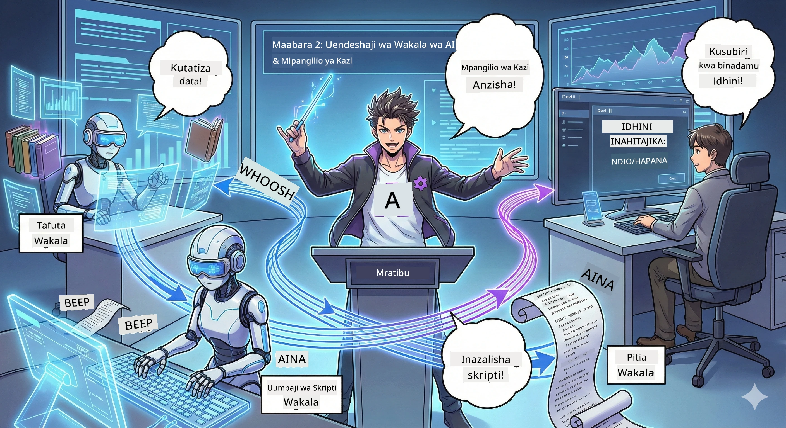

# Sura ya 2: Kusanya Timu Yako ya Uzalishaji wa Podcast 🎬



## Hadithi Inaongeza Mvuto

Alex (msaidizi wako wa AI kutoka Sura ya 1) ni mzuri, lakini wakala mmoja hawezi kuendesha studio yote ya podcast. Unahitaji *timu*:
- 🔍 **Wakala wa Utafiti**: Anatafuta mtandaoni kwa habari safi
- ✍️ **Wakala wa Script**: Hubadilisha utafiti kuwa mazungumzo ya kuvutia
- 👤 **Wewe (Mhariri)**: Anakubali miswada au kuirudisha kwa usahihishaji

Karibu kwenye **Uratibu wa Wakala wa AI** — ambapo wewe unakuwa mkurugenzi wa kikosi chako cha AI. Fikiria kama Avengers, lakini kwa uzalishaji wa podcast.

## Je, Uratibu wa Wakala ni Nini? (Toleo Rahisi)

Fikiria unaendesha mgahawa. Hufanyi kila kitu wewe mwenyewe, sivyo? Una:
- 🍳 Mpishi anapika
- 👨‍🍳 Msaidizi wa mpishi anayefanya maandalizi
- 👩‍🍳 Mhudumu anayewahudumia wateja

Uratibu wa wakala ni wazo sawa, lakini kwa AI. Kila wakala ana taaluma, na wewe unaorodhesha ili kufanikisha malengo makubwa. Hakuna wakala mmoja anayechoka, na kazi inakamilika haraka.

### Mfano wa Bendi 🎸

Wakala wako wa AI ni kama bendi:
- **Mwimbaji mkuu**: Wakala mkuu anayeshughulikia kazi zinazowaelekea wateja
- **Mpiga ngoma**: Anasimamia mpangilio, anashughulikia kazi za nyuma  
- **Mpiga bass**: Anasaidia kila mtu, anachukua data
- **Wewe (Msimamizi wa Bendi)**: Unaendesha kila kitu!

Bila uratibu? Mvumo tu. Kwa uratibu? Muziki mzuri.

### Kwa Nini Hii Ni Muhimu

Wakala mmoja wa AI anajaribu kufanya kila kitu = kuchoka. Wakelaji waliobobea wakiunda timu = ufanisi unaachiliwa! 🚀

**Kusema Kweli**: Kumbuka kuhakikisha kufanya utafiti, kuandika, NA kuhariri podcast yako peke yako? Ndiyo, hiyo ni ngumu. Kwa uratibu, kila wakala anashughulikia kile anachofanya vizuri. Wewe unafanya maamuzi ya mwisho tu.

**Mfano Halisi wa Ulimwengu**: Bots za huduma kwa wateja zinazojua lini kushughulikia bili dhidi ya matatizo ya kiufundi na lini kumpigia mwanadamu simu. Hiyo ni uratibu!

## Wakala dhidi ya Mtiririko wa Kazi: Tofauti ni Nini?

Fikiria hivi:

### 🤖 Wakala wa AI = Mwana muziki wa Jazz
- **Hufanya maamuzi moja kwa moja** kulingana na anachosikia
- **Hubuni suluhisho** kwa kutumia zana zake
- **Hufikiri** kwa ubongo wa LLM
- **Hubadilika** kwa kila kitu unachomwambia

### 🎵 Mtiririko wa Kazi = Bendi Inayocheza Muziki wa Klasiki  
- **Hufuata alama** (hatua zilizoainishwa mapema)
- **Njia inayoweza kutabirika** ya utekelezaji
- **Huuratibu** wakala wengi, watu na mifumo
- **Iliyopangwa** kama mapishi

**Siri**: Mtiririko wa kazi *huratibu* wakala! Unaunda mtiririko unaowaambia wakala lini kucheza sehemu yao. Bora ya pande zote. 🎭

## Njia Tatu za Kuuratibu Kikosi Chako cha AI

### 1. 🎯 Kituo Kimoja (Wewe Ndiye Bosi)

Wakala mmoja mkuu anatoa maagizo yote. Fikiria kama unasimamia timu — unaamua nani anafanya nini na lini.

**Faida**:
- ✅ Uongozi wazi (hakuna mvurugiko)
- ✅ Maamuzi ya kuaminika
- ✅ Rahisi kufuatilia kasoro

**Tumia kwa**:
- Kupita huduma kwa wateja ("Hii ni bili au msaada wa kiufundi?")
- Mtiririko wa kinnayotathmini maudhui ("Je, script hii inakubalika?")
- Uzalishaji wa podcast (hasa tunachojenga!)

### 2. 🤝 Usambazaji (Wakala Wanajipanga Wenyewe)

Wakala wanazungumza moja kwa moja na kupanga mambo kama kundi. Kama gumzo la pamoja ambapo kila mtu anaratibu.

**Faida**:
- ✅ Inaweza kuongezeka kwa urahisi (ongeza wakala wakati wowote)
- ✅ Hakuna sehemu moja inayoweza kuharibika
- ✅ Wakala wanashirikiana kwa asili

**Tumia kwa**:
- Timu za utafiti (kila wakala huchunguza vyanzo tofauti)
- Vikao vya utafakari mawazo
- Kutatua matatizo kwa usambazaji

### 3. 🔀 Mchanganyiko (Bora Zaidi Kutoka Pande Zote)

Wewe unaweka mwelekeo wa jumla, lakini wakala wana uhuru wa kujipanga kwa kazi. Kama kuwa Mkurugenzi Mtendaji anayeamini timu yake.

**Bora kwa**: Miradi ngumu inayohitaji usimamizi na ufanisi.

## Mfumo wa Wakala wa Microsoft: Zana Yako ya Uratibu 🧰

Ni wakati wa kujenga! Hapa ni kile utakachotumia:

### Vipande vya Kujenga

#### 1. 🧱 Watekelezaji (Wafanyakazi Wako)
- **Nini ni wao**: Vitengo binafsi vya usindikaji — vinaweza kuwa wakala au mantiki maalum
- **Nini hufanya**: Kupokea ingizo, kufanya kazi, kutoa matokeo
- **Fikiria kama**: Vituo kwenye mstari wa mkusanyiko

#### 2. ➡️ Mipaka (Mihusiano)
- **Nini ni wao**: Njia kati ya watekelezaji
- **Nini hufanya**: Kudhibiti mtiririko wa ujumbe ("Baada ya A, nenda B")
- **Fikiria kama**: Mshale kwenye mchoro wa mtiririko

#### 3. 🗺️ Mitiririko ya Kazi (Mpango Mkuu)
- **Nini ni wao**: Mchoro kamili wa watekelezaji + mipaka
- **Nini hufanya**: Kufafanua mchakato mzima kutoka mwanzoni hadi mwisho
- **Fikiria kama**: Ramani ya bomba la uzalishaji wako

### Vipengele Vizuri Utavyopenda

**🛡️ Usalama wa Aina**: Ujumbe kati ya wakala huangaliwa kama aina sahihi. Hakuna mshangao wa "Aina ya data si sahihi".

**🔀 Upangilio Rahisi**: 
- Masharti ya ikiwa-basi ("Ikiidhinishwa, chapisha; vinginevyo, andika upya")
- Usindikaji sambamba (wakala wengi wakifanya kazi kwa wakati mmoja)
- Njia zinazobadilika (mtiririko hubadilika kulingana na matokeo)

**🔌 Muunganisho wa Nje**:
- Unganisha na APIs
- Ongeza viingilio vya binadamu (unakubali kabla ya kuchapisha)
- Jenga mzunguko wa maombi/jawabu

**💾 Uhifadhi wa Hatua**: Hifadhi maendeleo! Ikiwa kitu kitashindwa, anzisha kutoka sehemu uliyoacha.

**🤝 Uratibu wa Wakala Wengi**:
- Endesha wakala kwa mfululizo (A → B → C)
- Endesha sambamba (A + B + C kwa pamoja)
- Pipiliza kati ya wakala
- Usindikaji kwa ushirikiano

## Mbinu Bora (Vidokezo vya Mtaalamu) 🎯

### 1. Fanya Kila Kitu Kiwe Kidogo
Kila wakala afanye KITU KIMOJA vizuri kabisa. Usifanye "wakala mkuu" anayefanya kila kitu — utajuta ukichagua kasoro.

### 2. Panga Kushindwa
Wakala huenda wakakosea. Mitandao huenda ikashindwa. Jenga udhibiti wa makosa na mipango ya dharura. Wewe wa baadaye utakushukuru.

### 3. Simamia Kila Kitu
Fuata kile wakala wako wanachofanya. Tumia DevUI (tutajadili hii!) kuona mitiririko ya kazi ikifanya kazi.

### 4. Rekebisha Ukubwa wa Ujumbe
Usipitisha mafaili makubwa kati ya wakala. Fanya ujumbe kuwa mdogo na rahisi kwa kasi.

### 5. Chagua Mfumo Sahihi
Unahitaji udhibiti? Chagua kituo kimoja. Unahitaji ukaribu? Chagua usambazaji. Huwezi kuamua? Chagua mchanganyiko!

## DevUI: Kifuatilia Mitiririko Yako 🔍

### DevUI ni Nini?

DevUI ni kama uwanja wa kuchezea kwa kupima wakala na mitiririko yako ya kazi. Ni interface ya wavuti ambapo unaweza:
- 👀 Tazama mtiririko wako ukiwa hai
- 💬 Ongea moja kwa moja na wakala
- 🔍 Tatua matatizo yanapotokea
- 📊 Tazama njia na takwimu za utendaji

> **Muhimu**: DevUI ni kwa maendeleo tu! Usitumie katika uzalishaji. Fikiria kama mazingira ya mtihani wa ndani. 

### Kinachoiifanya Iwe Nzuri

- **🖥️ UI ya Wavuti Inayoshirikiana**: Bonyeza, andika, jaribu — hakuna haja ya mstari wa amri
- **📁 Wezesha Kuvuta na Kuachia**: Pakia mafaili, jaribu na viingizo tofauti
- **📂 Kugundua Kiotomatiki**: Elekeza kwa folda, inapata wakala wote moja kwa moja
- **📋 Mode Isiyo na Mpangilio**: Sajili wakala kwa msimbo, hakuna muundo wa folda unahitajika
- **🔌 Inasaidiana na OpenAI**: Inafanya kazi na SDK ya OpenAI (inao ufanisi!)
- **👁️ Ufuatiliaji Mjenzi**: Tazama kabisa kile wakala wako wanachofanya

### Jinsi Ingizo Linavyofanya Kazi

DevUI ni mwerevu kuhusu ingizo:

- **Tukijaribu Wakala?** Unapata masanduku ya maandishi na vifungo vya kupakia faili
- **Tukijaribu Mitiririko ya Kazi?** UI huunda sehemu za kuingiza kulingana na kile mtiririko unachotegemea

Ni kama uchawi, lakini ni msimbo mzuri tu. ✨

## Misheni Zako: Jenga Studio ya Podcast 🎬

### Misheni 1: Unda Wakala Mmoja kwa DevUI

📂 [01.AgentDevUI](../../../../WorkshopForAgentic/code/02.Workflow/01.AgentDevUI)

**Changamoto**: Kabla ya kujenga timu kamili, tupime DevUI na wakala mmoja: mtaalamu wa utafutaji mtandaoni.

**Unachojenga**:
Wakala wa utafiti anaweza kutafuta mtandaoni mada za podcast. Utajipima ukiwa kwenye interface ya wavuti ya DevUI kwa `http://localhost:8090`.

**Ujuzi Utakaojifunza**:
- 🚀 Kuzindua wakala ndani ya DevUI
- 🔍 Kupima majibu ya wakala papo hapo
- 🛠️ Kujenga zana maalum (utafutaji mtandaoni)
- 📊 Kuwezesha ufuatiliaji wa kasoro
- 🖥️ Kutumia UI ya wavuti inayoshirikiana

**Msimbo**:
- `agent.py`: SearchAgent na nguvu ya utaftaji mtandaoni
- Inatumia OllamaChatClient kuunganishwa na Qwen
- Inatekeleza `web_search()` kama zana
- Inazinduliwa na `serve()` — inafungua DevUI moja kwa moja

**Sharti la Ushindi**: Muulize wakala wako "Ni nini kinachovuma katika AI?" na uangalie akitafuta mtandaoni! 🎉

### Misheni 2: Jenga Mtiririko wa Wakala Wengi

📂 [02.WorkflowDevUI](../../../../WorkshopForAgentic/code/02.Workflow/02.WorkflowDevUI)

**Changamoto**: Sasa jambo kuu linaanza! Jenga mtiririko kamili wa uzalishaji wa podcast unaojumuisha:
1. 🔍 **Wakala wa Utafutaji** → Anatafuta mada yako
2. ✍️ **Wakala wa Script** → Anaandika mazungumzo kati ya wenyeji wawili (kwa Kichina!)
3. 👤 **Mtekelezaji wa Ukaguzi** → Akuulize WEWE kuidhinisha au kukataa
4. 🔄 **Rudia** → Ikiwa imakataa, andika upya kwa maoni yako

**Ujuzi Utakaojifunza**:
- 🧱 Kuunda wakala maalum kwa kazi tofauti
- 🔗 Kuunganisha wakala na WorkflowBuilder
- 🔀 Kutekeleza mizunguko ya idhini (binadamu katikati!)
- 🚦 Upangaji wa masharti (ikiwa imeidhinishwa kontra kukataa)
- 🔧 Kujenga watekelezaji maalum kwa mantiki za biashara

**Mtiririko wa Kazi**:
```
SearchAgent → ScriptAgent → ReviewExecutor
                             ↑          ↓ (if rejected)
                             ←─────────
```

**Msimbo**:
- `search_agent/agent.py`: Mtaalamu wako wa utafiti
- `generate_script_agent/agent.py`: Mwandishi wako wa script (anaunda kwa Kichina!)
- `workflow/workflow.py`: Hapa ndipo uchawi wa uratibu unapatikana
- `main.py`: Huzindua kila kitu ndani ya DevUI

**Sharti la Ushindi**: Toa mada, pitia script, kata mara moja kujaribu mzunguko, kisha idhinisha! 🎉

### Misheni 3: Jenga Programu ya Console

📂 [03.Application](../../../../WorkshopForAgentic/code/02.Workflow/03.Application)

**Changamoto**: Chukua mtiririko wako kutoka DevUI uibadilishe kuwa programu ya terminal yenye matokeo yenye rangi, mizunguko ya kupakia na kuhifadhi faili. Hii ni kwa ajili ya uzalishaji!

**Ujuzi Utakaojifunza**:
- ⚡ Kuendesha mitiririko kwa program
- 📡 Muundo wa tukio unaosababishwa na matukio ya mtiririko
- 🎨 Kuunda UI nzuri ya terminal (rangi, mizunguko, barua za maendeleo)
- 💾 Kuhifadhi script za mwisho kwenye faili
- 🔄 Kushughulikia mitiririko ya asyncronous kwa Python asyncio

**Inafanya Nini**:
1. Inakuuliza mada ya podcast
2. Inaonyesha maendeleo ya wakati halisi ("Wakala wa Utafutaji anafanya kazi...")
3. Inaonyesha script iliyoundwa kwa rangi
4. Inauliza idhini yako
5. Inahifadhi script iliyokubaliwa kwenye `podcast.txt`

**Msimbo**:
- `podcast_app.py`: Programu kuu yenye usimamizi wa tukio
- `workflow.py`: Inatumia tena mtiririko kutoka Misheni 2
- Inashughulikia matukio: `AgentRunUpdateEvent`, `RequestInfoEvent`, `WorkflowOutputEvent`
- Inatumia rangi za ANSI kwa muundo wa terminal

**Sharti la Ushindi**: Endesha programu, unda script ya podcast, na uione ikihifadhiwa! Umetengeneza zana halisi. 🚀

## Umemudu Nini 🏆

Baada ya Sura ya 2, unaweza:

- ✅ Kuuratibu wakala wa AI wengi kama bosi
- ✅ Kujenga mitiririko ya kazi yenye mantiki za mfululizo NA masharti
- ✅ Ongeza hatua za idhini za binadamu
- ✅ Tumia DevUI kupima na kutatua matatizo ya mitiririko
- ✅ Tengeneza programu za console zenye uzalishaji tayari
- ✅ Shughulikia makosa kwa ufanisi katika mifumo ngumu
- ✅ Chagua mfumo sahihi wa uratibu kwa mradi wowote

## Mambo Yanapovunjika 🔧

### "Mtiririko wangu ni mgumu mno!"
**Marekebisho**: Ugawanye kuwa mitiririko ndogo ndogo. Kila mtiririko ufanye KITU KIMOJA vizuri. Zibandike pamoja kama inahitajika.

### "Siwezi kufuatilia kinachotokea!"
**Marekebisho**: Tumia uhifadhi wa hatua za mitiririko. Weka ufuatiliaji kwenye DevUI kuona kila hatua.

### "Kosa la wakala mmoja linaumiza vyote!"
**Marekebisho**: Ongeza mipaka ya makosa. Kila wakala asimame kushughulikia makosa yake mwenyewe na awe na mbinu ya kurejesha.

### "Hii ni polepole sana"
**Marekebisho**: Kuna wakala yeyote anaweza kuendeshwa kwa sambamba? Mitiririko ya mfululizo ni rahisi lakini polepole. Tafuta nafasi za usambazaji!

## Rasilimali Zaidi Zaidi 🔗

- [Hati za Mtiririko wa Kazi](https://learn.microsoft.com/en-us/agent-framework/user-guide/workflows/overview) — Miongozo rasmi ya Microsoft
- [Mifumo ya Uratibu](https://www.ibm.com/think/topics/ai-agent-orchestration) — Mtazamo wa IBM juu yake
- [Agent Framework GitHub](https://github.com/microsoft/agent-framework) — Pitia msimbo wa chanzo
- [Mifano ya Msimbo](https://github.com/microsoft/agent-framework/tree/main/python/samples) — Chukua mifano kutoka hapa

---

**Ume tayari kwa hitimisho?** Umeandaa script yako. Sasa hebu tuibadilishe kuwa sauti halisi! → [Kitendo cha 3: Kuleta Podcast Yako Kuishi](03.Multi-SpeakerPodcastGenerationWithVibeVoice.md) 🎤

---

**Umekwama? Umelazimika? Umefurahia?** Shiriki kwenye gumzo la warsha! Sisi sote tunajifunza pamoja. 🚀

---

<!-- CO-OP TRANSLATOR DISCLAIMER START -->
**Kumbusho**:
Nyaraka hii imetafsiriwa kwa kutumia huduma ya tafsiri ya AI [Co-op Translator](https://github.com/Azure/co-op-translator). Ingawa tunajitahidi kwa usahihi, tafadhali fahamu kwamba tafsiri za kiotomatiki zinaweza kuwa na makosa au upungufu wa usahihi. Nyaraka asili katika lugha yake ya asili inapaswa kuzingatiwa kama chanzo cha mamlaka. Kwa taarifa muhimu, tafsiri ya kitaalamu kwa mwanadamu inapendekezwa. Hatubebei lawama kwa kutoelewana au tafsiri potofu zinazotokana na matumizi ya tafsiri hii.
<!-- CO-OP TRANSLATOR DISCLAIMER END -->