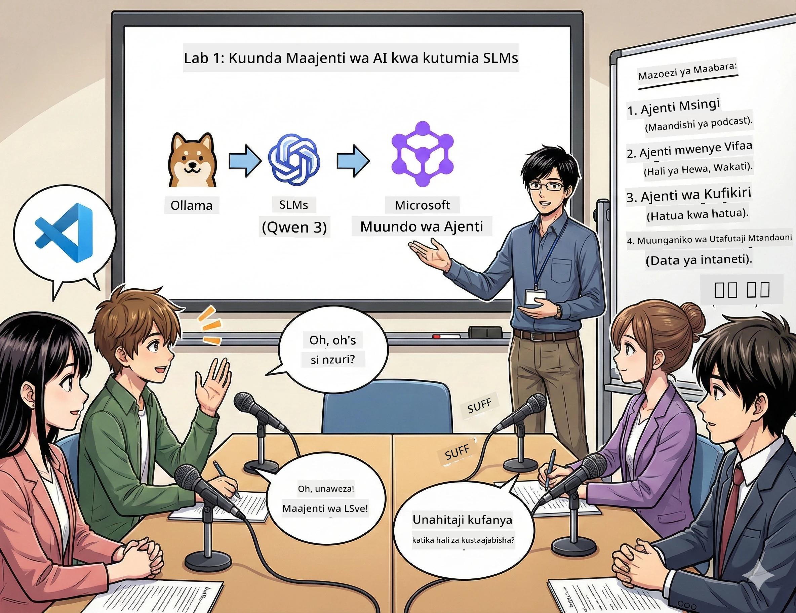

<!--
CO_OP_TRANSLATOR_METADATA:
{
  "original_hash": "21779ce57b388adecb26881a35d9cbcf",
  "translation_date": "2026-01-05T16:59:28+00:00",
  "source_file": "WorkshopForAgentic/translation/zh-cn/01.BuildAIAgentWithSLM.md",
  "language_code": "sw"
}
-->
# Tamthilia ya Kwanza: Kumbukana Msaidizi Wako wa Utafiti wa AI 🤖

## Changamoto

Unazindua "Baite za Baadaye", podcast yako mpya ya teknolojia. Kifungu cha kwanza ni kuhusu mafanikio ya hivi karibuni ya AI, lakini una masaa 24 tu ya:
1. Kufanya utafiti wa mada
2. Kupata vyanzo vya kuaminika
3. Kuandika script ya kusisimua
4. Kuifanya isikie ya kawaida

**Mgeuzo wa hadithi**: Huhitaji kufanya peke yako. Unakaribia kujenga msaidizi wako wa AI wa kwanza, ambaye anaweza kusaidia kutimiza yote haya. Tuitaie Alex — mshirika wako wa utafiti usioweza kuchoka, ambaye hahitaji kulala kabisa.

## Kwanini Kuchagua Mfano Mdogo wa Lugha? (Spoiler: Ni Bora)

Fikiria mfano mdogo wa lugha (SLM) kama AI binafsi inayotumia kompyuta *yako*. Hakuna mawingu, hakuna gharama za kila mwezi, hakuna kushiriki data kwa mashaka.

**Kwa nini SLM ni nzuri hivi🔥:**
- **🏠 Inaendesha kwenye mashine yako**: kompyuta mpakato, desktop, hata Raspberry Pi yenye nguvu
- **💸 Gharama sifuri za kuendelea**: hakuna ada za API zitakazokula pesa zako
- **🔒 Faragha kwanza**: data yako haiwezi kutoka kwenye kifaa chako kamwe
- **⚡ Haraka kama mwanga wa umeme**: hakuna ucheleweshaji wa mtandao, majibu mara moja
- **🪦 Nyepesi**: параметры bilioni 1-10 dhidi ya bilioni 1000+ za mifano mikubwa

**SLM maarufu**: Qwen 3, Phi-4, Gemma 3 (workshop hii inatumia Qwen)

## Kifaa Chako

### Ollama: Meneja Wako wa Mifano ya AI

[Ollama](https://ollama.com/) ni kama Steam ya mifano ya AI. Pakua, endesha na simamia mifano kwa amri rahisi.

**Urembo wake:**
- Amri moja tu kupakua na kuendesha mfano wowote
- Inafanya kazi kwa Mac, Windows, Linux
- Ikiwa una GPU, itaitumia moja kwa moja
- Inahifadhi kumbukumbu sana

### Microsoft Agent Framework: Mahali Hapa Uchawi Hutokea

[Microsoft Agent Framework](https://github.com/microsoft/agent-framework) ni uwanja wako wa kujenga maajenti wa AI, ambayo wanaweza:

- 💬 Kuzungumza na kukumbuka mazungumzo yenu
- 🛠️ Kutumia zana maalum (kama kutafuta mtandaoni au kuangalia hali ya hewa)
- 🧠 Kufikiria hatua kwa hatua matatizo magumu
- 🤝 Kufanya kazi kama timu na maajenti wengine
- 🔌 Kuungana na wasambazaji tofauti wa AI (OpenAI, Ollama, Azure)

**Sehemu za kujenga:**
- **Maajenti (Agents)**: wasaidizi wa AI wenye kazi maalum
- **Zana (Tools)**: uwezo maalum unaowapa
- **Kumbukumbu (Memory)**: ili wasisahau mazungumzo yako
- **Ufikiri (Reasoning)**: kuwafundisha kufikiria, sio tu kujibu

## Muhtasari wa Mafunzo Yako: Kazi 4

### Kazi 1: Tengeneza Ajenti Yako wa Kwanza

📓 [Fungua Notebook](../../code/01.BasicAgent/00.BasicAgent-agent.ipynb)

**Kazi**: tengeneza Alex, AI wako wa kuandika script za podcast. Alex anahitaji kuunda mazungumzo ya wadau wawili wakijadili mada za teknolojia.

**Utajifunza:**
- Jinsi ya kuamsha ajenti wa AI (rahisi zaidi kuliko kuamka Jumatatu)
- Kumwambia sifa na maagizo
- Kumfanya azalishe script halisi ya podcast
- Kuelewa majibu anayotoa

**Sharti la ushindi**: Alex aunda script ya jaribio la "Baite za Baadaye" juu ya AI! 🎯

### Kazi 2: Kumpa Alex Nguvu Zaidi (Zana!)

📓 [Fungua Notebook](../../code/01.BasicAgent/01.BasicAgent-tools.ipynb)

**Kazi**: Alex ni mwerevu, lakini hajui hali ya hewa ya leo au saa ngapi sasa. Tukampatie zana ili kutatua hili!

**Utajifunza:**
- Kuunda kazi za Python maalum kama "zana"
- Kumruhusu Alex kuamua *lini* kutumia zana gani
- Kuona anavyosuluhisha matatizo kwa uhuru
- Kuchanganya zana nyingi kufanikisha kazi ngumu

**Sharti la ushindi**: Uliza "Hali ya hewa Tokyo iko aje?" Alex atapata jibu mwenyewe! ☁️

### Kazi 3: Fundisha Alex Kufikiria

📓 [Fungua Notebook](../../code/01.BasicAgent/02.BasicAgent-reasoning.ipynb)

**Kazi**: Muweke Alex aonyeshe mchakato wake wa kazi. Unataka kuona *jinsi* anavyofikiria, si majibu tu.

**Utajifunza:**
- Kuzindua "hali ya ufikiri" (kama kuonyesha kazi yako darasani)
- Kuona mchakato wa hatua kwa hatua wa Alex
- Kuelewa vidokezo vya mnyororo wa mawazo
- Kurekebisha wakati Alex anapojikwaa

**Sharti la ushindi**: Uliza swali zito la hesabu, tazama Alex akifikiria! 🧠

### Kazi 4: Unganisha Alex na Intaneti

📓 [Fungua Notebook](../../code/01.BasicAgent/03.BasicAgent-websearch.ipynb)

**Kazi**: Maarifa ya Alex yana tarehe ya mwisho. Tumuungeze na mtandao kwa habari za sasa!

**Utajifunza:**
- Kujenga zana za utafutaji mtandaoni maalum
- Kuunganisha API za nje
- Kushughulikia makosa ya mtandao kwa heshima
- Kupata taarifa zaidi ya data za mafunzo za Alex

**Sharti la ushindi**: Uliza habari za teknolojia za leo na upate matokeo mapya! 📰

## Kabla ya Kuanzia 🚀

**Mahitaji ya Lazima**:
- Python 3.10+ imewekwa
- Ollama inaendesha (angalia kwa `ollama --version`)
- VS Code yenye upanuzi wa Python
- Angalau 8GB ya kumbukumbu (16GB inashauriwa kwa urahisi)

## Mpangilio wa Kazi

Kamilisha notebooks kwa mpangilio kupata uzoefu kamili:

1. [00.BasicAgent-agent.ipynb](../../code/01.BasicAgent/00.BasicAgent-agent.ipynb) —— Jifunze kuhusu Alex (ajenti wako wa kwanza)
2. [01.BasicAgent-tools.ipynb](../../code/01.BasicAgent/01.BasicAgent-tools.ipynb) —— Ni wakati wa usasishaji!
3. [02.BasicAgent-reasoning.ipynb](../../code/01.BasicAgent/02.BasicAgent-reasoning.ipynb) —— Fundisha Alex kufikiri
4. [03.BasicAgent-websearch.ipynb](../../code/01.BasicAgent/03.BasicAgent-websearch.ipynb) —— Fungua upatikanaji wa intaneti!

## Utakuwa Umelijua Nini

Baada ya tamthilia ya kwanza, utaweza:

- ✅ Kuendesha mifano ya AI kwenye vifaa vyako (bila mawingu!)
- ✅ Kujenga ajenti wenye sifa na ujuzi maalum
- ✅ Kumpa ajenti zana za kutatua matatizo halisi
- ✅ Kuwafanya ajenti waonyeshe mchakato wao wa ufikiri
- ✅ Kuunganisha ajenti kwenye vyanzo vya data vya nje
- ✅ Kurekebisha makosa wakati mambo yanaposhindikana

## Wakati Mambo Yanaposhindikana (na Jinsi ya Kurekebisha) 🔧

### "Alex hakuweza kupakia! Kumbukumbu hairoshi!"
**Suluhisho**: Kompyuta yako inashindwa. Jaribu kuzima programu nyingine, au tumia mfano mdogo zaidi. Kumbukumbu 8GB ni kiwango cha chini.

### "Alex anakwenda polepole"
**Suluhisho**: Washa uwezeshaji wa GPU kwenye mipangilio ya Ollama. Au punguza ukubwa wa dirisha la muktadha. Hali ya kichwa ya kasi imewashwa! 🏎️

### "Zana hazifanyi kazi!"
**Suluhisho**: Kagua kwa makini saini za kazi zako. Alex anahitaji vidokezo vya aina sahihi kuelewa zana. Fikiria kama kumtumia maagizo waziwazi.

## Viungo Muhimu 🔗

- [Nyaraka za Agent Framework](https://github.com/microsoft/agent-framework) —— Mwongozo rasmi na mifano
- [Maktaba ya Mifano ya Ollama](https://ollama.com/library) —— Vinjari mifano yote inayopatikana
- [Mfano wa Qwen](https://ollama.com/library/qwen3) —— Tambua ubongo wa msaidizi wako wa AI
- [Mifano ya Msimbo](https://github.com/microsoft/agent-framework/tree/main/python/samples) —— Chukua mawazo kutoka hapa

## Hatua Inayofuata: Tamthilia ya Pili 🎬

Una ajenti. Lakini kwa vipi unapokuwa na *kikosi* cha maajenti wanaofanya kazi pamoja? Katika tamthilia ya pili, utaunda timu kamili ya uzalishaji wa podcast:
- **Ajenti wa utafiti**: pata vyanzo bora
- **Ajenti wa uandishi**: tengeneza script kamili
- **Mhariri (wewe!)**: idhinisha au omba mabadiliko

Tuchanganye uchawi wa AI! → [Tamthilia ya Pili: Tengeneza Timu Yako ya Uzalishaji](02.AIAgentOrchestrationAndWorkflows.md)

---

**Umekwama?** Uliza maswali wakati wa warsha. Tujifunze pamoja! 🙌

---

<!-- CO-OP TRANSLATOR DISCLAIMER START -->
**Tangazo la Majeruhi**:
Nyaraka hii imetafsiriwa kwa kutumia huduma ya tafsiri ya AI [Co-op Translator](https://github.com/Azure/co-op-translator). Ingawa tunajitahidi kwa usahihi, tafadhali fahamu kwamba tafsiri za kiotomatiki zinaweza kuwa na makosa au dosari. Nyaraka ya asili katika lugha yake ya asili inapaswa kuzingatiwa kama chanzo cha mamlaka. Kwa taarifa nyeti, tafsiri ya kitaalamu ya mwanadamu inashauriwa. Hatuna wajibu wowote kwa kutoelewana au tafsiri potofu zinazotokana na matumizi ya tafsiri hii.
<!-- CO-OP TRANSLATOR DISCLAIMER END -->