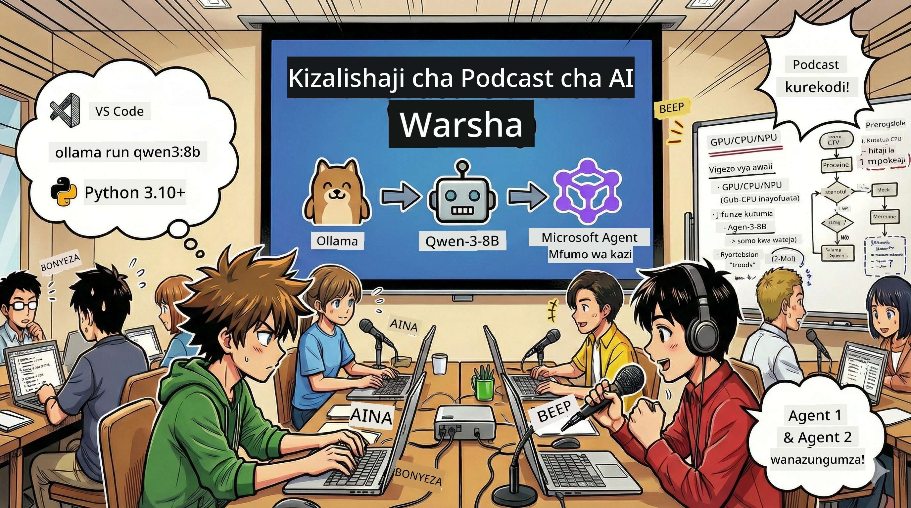

<!--
CO_OP_TRANSLATOR_METADATA:
{
  "original_hash": "aa775a734bda4590ecbe3a94a3b62197",
  "translation_date": "2026-01-05T17:52:07+00:00",
  "source_file": "WorkshopForAgentic/translation/zh-cn/README.md",
  "language_code": "sw"
}
-->
# 🎙️ Warsha ya Studio ya Podcast ya AI



## Kazi Yako

Karibu **Studio ya Podcast ya AI**! Utazindua podcast yako mwenyewe ya teknolojia iitwayo "Viwango vya Baadaye" — lakini kuna mabadiliko kidogo: utaunda timu ya uzalishaji inayotumia AI itakayokusaidia kuiunda. Hautahitaji tena utafiti usio na kikomo, kuandika maandishi, au kuhariri sauti. Badala yake, utakuwa mtayarishaji wa podcast mwenye nguvu za AI kupitia programu.

## Muktadha wa Hadithi

Fikiria: wewe na marafiki zako mnataka kuanzisha podcast kuhusu mwenendo wa teknolojia wa kuvutia, lakini kila mtu ana shughuli za masomo, kazi, au maisha. Je, ungeweza kuunda timu ya wakala wa AI kufanya kazi ngumu? Mwakala mmoja anafanya utafiti wa mada, mwingine anaandika maandishi ya kuvutia, mwingine hubadilisha maandishi kuwa mazungumzo ya asili na laini. Inasikika kama hadithi za kisayansi? Hebu tuibadilishe kuwa halisi.

## Utajifunza Nini

Mwisho wa warsha hii, utajua jinsi ya:
- 🤖 Kuendesha modeli ya AI ya eneo lako mwenyewe (bila gharama za API, bila utegemezi wa wingu!)
- 🔧 Kujenga mawakala wa AI wa kitaalamu wanaoshirikiana kwa vitendo
- 🎬 Kuunda mchakato kamili wa uzalishaji wa podcast kutoka ubunifu hadi sauti

## Safari Yako: Tamthilia Tatu

Kama hadithi yoyote nzuri, tunayo tamthilia tatu. Kila tamthilia itaongeza hatua kwa hatua studio yako ya podcast ya AI:

| Sura | Kazi Yako | Kinachotokea | Ujuzi Unaufungua |
|---------|-----------|--------------|----------------|
| **Tamthilia ya Kwanza** | [Kutambulisha Msaidizi Wako wa AI](01.BuildAIAgentWithSLM.md) | Utafahamu jinsi ya kuunda mawakala wa AI ambao wanaweza kuzungumza, kutafuta mtandao, na hata kutatua matatizo. Wahesabu kama wanafunzi wa utafiti wasiolala kamwe. | 🎯 Kujenga wakala wako wa kwanza<br>🛠️ Kumuwekea nguvu za ziada (zana!)<br>🧠 Kumfundisha kufikiria<br>🌐 Kuunganisha mtandao |
| **Tamthilia ya Pili** | [Kuunda Timu Yako ya Uzalishaji](02.AIAgentOrchestrationAndWorkflows.md) | Sasa mambo yanakuwa ya kufurahisha! Uta kupanga mawakala wengi wa AI kufanya kazi pamoja kama timu halisi ya podcast. Mmoja anatafiti, mwingine anaandika, wewe uthibitishe — ushirikiano unaleta mafanikio. | 🎭 Kuratibu mawakala wengi<br>🔄 Kujenga mtiririko wa uthibitishaji<br>🖥️ Kutumia kiolesura cha DevUI kwa majaribio<br>✋ Kudumisha udhibiti wa binadamu |
| **Tamthilia ya Tatu** | [Fanikisha Podcast Yako Kuishi](03.Multi-SpeakerPodcastGenerationWithVibeVoice.md) | Hitimisho! Badilisha maandishi yako kuwa sauti halisi ya podcast yenye sauti halisi na mazungumzo ya asili. Podcast yako ya "Viwango vya Baadaye" iko tayari kuchapishwa! | 🎤 Uchawi wa maandishi hadi sauti<br>👥 Sauti za wazungumzaji wengi<br>⏱️ Sauti za muundo mrefu<br>🚀 Uendeshaji kamili wa moja kwa moja |

Kila tamthilia itafungua uwezo mpya. Ikiwa una ujasiri, unaweza kuruka sehemu, lakini tunapendekeza ujifunze kwa mpangilio!

## Mahitaji ya Mazingira

Warsha hii inaunga mkono mazingira mbalimbali ya vifaa:
- **CPU**: Inafaa kwa majaribio na matumizi madogo
- **GPU**: Inapendekezwa kwa mazingira ya uzalishaji, huongeza kasi ya uamuzi kwa kiasi kikubwa
- **NPU**: Inasaidia kasi ya kizazi kipya cha vitengo vya usindikaji wa neva

## Unahitaji Nini

### Orodha ya Programu ✅
- **Python 3.10+** (Lugha yako ya programu)
- **Ollama** (Kwa kuendesha modeli ya AI kwenye mashine yako)
- **VS Code** (Mhariri wako wa msimbo)
- **Ongeza ya Python** (Kuifanya VS Code kuwa ya akili zaidi)
- **Git** (Kwa kupata msimbo)

### Ukaguzi wa Vifaa 💻
- **Naweza kuendesha?**: Kumbukumbu 8GB, Nafasi ya Hifadhi 10GB (Inaweza tumika, lakini inaweza kuwa polepole kidogo)
- **Usanidi Bora**: Kumbukumbu 16GB+ na GPU nzuri (Inaendesha kwa urahisi!)
- **Je, una NPU?**: Hiyo ni bora zaidi! Fungua kasi ya kizazi kipya 🚀

## Anzisha Studio Yako 🎬

### Hatua ya 1: Sasisha Python

Hakikisha una Python 3.10 au toleo jipya zaidi:

```bash
python --version
# Inapaswa kuonyesha Python 3.10.x au toleo la juu zaidi
```

Huna Python? Pata kutoka [python.org](https://python.org) — ni bure!

### Hatua ya 2: Pata Ollama (Endesha Modeli Yako Ya AI)

Tembelea [ollama.ai](https://ollama.ai) upakue Ollama inayoendana na mfumo wako wa uendeshaji. Fikiria kama injini ya kuendesha modeli ya AI eneo lako.

Thibitisha kama tayari:

```bash
ollama --version
```

### Hatua ya 3: Pakua Ubongo Wako wa AI 🧠

Ni wakati wa kupata modeli ya Qwen-3-8B (kama kuajiri msaidizi wako wa kwanza wa AI):

```bash
ollama pull qwen3:8b
```

*Hii inaweza kuchukua dakika chache. Wakati mzuri wa kikombe cha kahawa! ☕*

### Hatua ya 4: Sanidi VS Code

Kama bado hujui, pata [Visual Studio Code](https://code.visualstudio.com/). Huu ni mhariri bora wa msimbo (pindana na mimi kama haukubaliani 😄).

### Hatua ya 5: Ongeza ya Python

Ndani ya VS Code:
1. Bonyeza `Ctrl+Shift+X` (Mac ni `Cmd+Shift+X`)
2. Tafuta "Python"
3. Sakinisha Ongeza rasmi ya Python kutoka Microsoft

### Hatua ya 6: Tayari! 🎉

Kwa kweli, uko tayari. Hebu tuunde uchawi wa AI!

### Hatua ya 7: Sakinisha Microsoft Agent Framework na Pakiti Zinazohitajika 📦

Sakinisha tegemezi zote za warsha:

```bash
pip install -r ./Installations/requirements.txt -U
```

*Hii itasakinisha Microsoft Agent Framework na pakiti zote muhimu. Furahia kikombe cha kahawa — usakinishaji wa kwanza unaweza kuchukua dakika chache! ☕*

## Maelekezo ya Warsha

Muundo wa mradi, hatua za usanidi, na utendaji zitafundishwa hatua kwa hatua wakati wa warsha.

## Utatuzi wa Matatizo (Wakati Mambo Yanatokea Vibaya) 🔧

### "Ay! Uchakataji wa modeli umepoteza muda mwingi!"
**Suluhisho**: Tumia VPN au sanidi chanzo cha kioo cha Ollama. Wakati mwingine mtandao hautoi msaada.

### "Kompyuta yangu inaanza kuzimika! Kumbukumbu haitoshi!"
**Suluhisho**: Badilisha kwenda modeli ndogo au rekebisha `num_ctx` kutumia kumbukumbu kidogo. Fikiria hii kama lishe kwa AI yako.

### "Naweza kutumia GPU kuifanya iwe haraka zaidi?"
**Suluhisho**: Ollama hutambua GPU moja kwa moja! Hakikisha tu dereva wa GPU wako ni mpya. Kuongeza kasi bure! 🏎️

## Rasilimali Zaidi (Kwa Mdadisi Kama Wewe) 📚

- [Nyaraka za Ollama](https://github.com/ollama/ollama) — Fahamu zaidi kuhusu modeli ya AI ya eneo lako
- [Microsoft Agent Framework](https://microsoft.github.io/autogen/) — Jifunze zaidi kuhusu kujenga timu ya mawakala
- [Taarifa za Modeli ya Qwen](https://qwenlm.github.io/) — Jifunze kuhusu ubongo wa msaidizi wako wa AI

## Leseni

Leseni ya MIT — Tengeneza vitu poa, shirikisha, na ufanye dunia kuwa mahali pazuri zaidi! 🌍

## Unataka Kuchangia?

Umeona hitilafu? Una mawazo? Tuma Issue au PR! Tunapenda mazingira ya jumuiya. ✨

---

<!-- CO-OP TRANSLATOR DISCLAIMER START -->
**Tangazo la Uhuru**:
Nyaraka hii imetafsiriwa kwa kutumia huduma ya kutafsiri kwa AI [Co-op Translator](https://github.com/Azure/co-op-translator). Ingawa tunajitahidi kuhakikisha usahihi, tafadhali fahamu kwamba tafsiri za kiautomatic zinaweza kuwa na makosa au kutoeleweka vizuri. Nyaraka asili katika lugha yake ya asili inapaswa kuchukuliwa kama chanzo cha kisheria. Kwa habari muhimu, tafsiri ya kitaalamu inayotolewa na mtaalamu wa binadamu inapendekezwa. Hatubebei dhima kwa kutoelewana au makosa yoyote yanayotokea kutokana na matumizi ya tafsiri hii.
<!-- CO-OP TRANSLATOR DISCLAIMER END -->