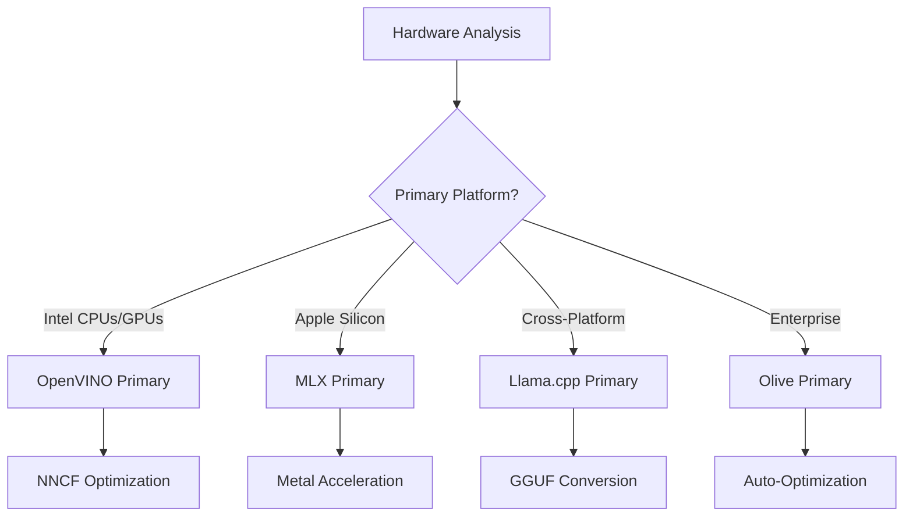
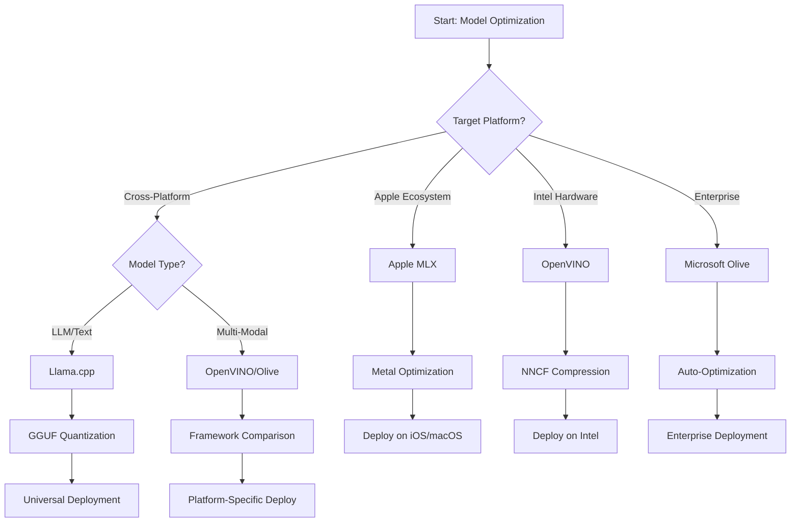
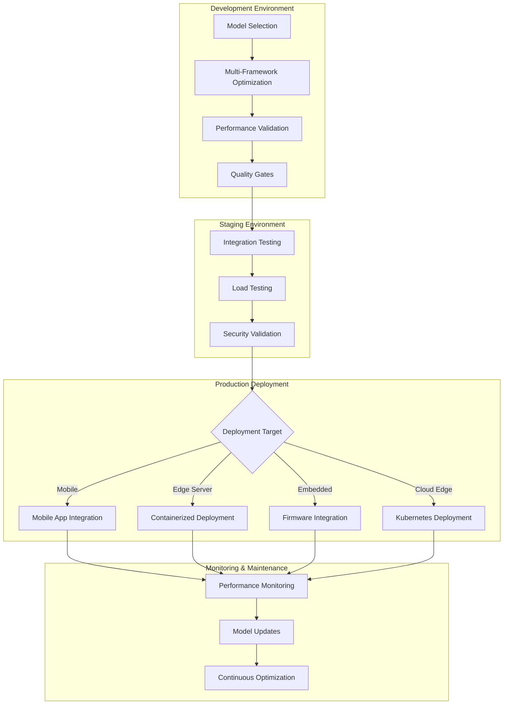

# பிரிவு 6: எட்ஜ் AI மேம்பாட்டு வேலைப்பாடுகள் ஒருங்கிணைப்பு

## உள்ளடக்க அட்டவணை
1. [அறிமுகம்](../../../Module04)
2. [கற்றல் நோக்கங்கள்](../../../Module04)
3. [ஒற்றுமையான வேலைப்பாடுகள் கண்ணோட்டம்](../../../Module04)
4. [கட்டமைப்பு தேர்வு அட்டவணை](../../../Module04)
5. [சிறந்த நடைமுறைகள் ஒருங்கிணைப்பு](../../../Module04)
6. [விநியோக உத்தி வழிகாட்டி](../../../Module04)
7. [செயல்திறன் மேம்பாட்டு வேலைப்பாடுகள்](../../../Module04)
8. [தயாரிப்பு தயார்நிலை சோதனை பட்டியல்](../../../Module04)
9. [சிக்கல்களை தீர்க்குதல் மற்றும் கண்காணித்தல்](../../../Module04)
10. [உங்கள் எட்ஜ் AI குழாய்களை எதிர்காலத்திற்குத் தயார்படுத்துதல்](../../../Module04)

## அறிமுகம்

எட்ஜ் AI மேம்பாடு பல்வேறு மேம்பாட்டு கட்டமைப்புகள், விநியோக உத்திகள் மற்றும் ஹார்ட்வேரின் சிக்கலான புரிதலை தேவைப்படுத்துகிறது. Llama.cpp, Microsoft Olive, OpenVINO மற்றும் Apple MLX ஆகியவற்றின் அறிவை ஒருங்கிணைத்து, செயல்திறனை அதிகரிக்க, தரத்தை பராமரிக்க மற்றும் வெற்றிகரமான தயாரிப்பு விநியோகத்தை உறுதிசெய்யும் ஒற்றுமையான வேலைப்பாடுகளை உருவாக்க இந்த விரிவான ஒருங்கிணைப்பு உதவுகிறது.

இந்த பாடநெறியில், ஒவ்வொரு மேம்பாட்டு கட்டமைப்பின் தனித்துவமான பலம் மற்றும் சிறப்பு பயன்பாடுகளை ஆராய்ந்துள்ளோம். ஆனால், உண்மையான உலக எட்ஜ் AI திட்டங்கள் பல கட்டமைப்புகளிலிருந்து தொழில்நுட்பங்களை இணைக்க அல்லது குறிப்பிட்ட கட்டுப்பாடுகள் மற்றும் தேவைகளுக்கு சிறந்த முடிவுகளை வழங்கும் அணுகுமுறைகளைத் தேர்ந்தெடுக்க வேண்டும்.

இந்த பிரிவு அனைத்து கட்டமைப்புகளின் கூட்டு அறிவை செயல்படக்கூடிய வேலைப்பாடுகள், முடிவு மரங்கள் மற்றும் சிறந்த நடைமுறைகளாக ஒருங்கிணைத்து, உங்களை தயாரிப்பு தயார்நிலை எட்ஜ் AI தீர்வுகளை திறமையாகவும் பயனுள்ளதாகவும் உருவாக்க உதவுகிறது. நீங்கள் மொபைல் சாதனங்கள், எம்பெடட் சிஸ்டம்கள் அல்லது எட்ஜ் சர்வர்கள் ஆகியவற்றுக்காக மேம்படுத்துகிறீர்களா என்பதை பொருத்து, இந்த வழிகாட்டி உங்கள் மேம்பாட்டு வாழ்க்கைச்சுழற்சியில் தகவலறிந்த முடிவுகளை எடுக்க உங்களுக்கு தேவையான உத்திகளை வழங்குகிறது.

## கற்றல் நோக்கங்கள்

இந்த பிரிவின் முடிவில், நீங்கள்:

### மூலோபாய முடிவு எடுப்பது
- **தேர்வு மற்றும் மதிப்பீடு**: திட்ட தேவைகள், ஹார்ட்வேர கட்டுப்பாடுகள் மற்றும் விநியோக சூழல்களை அடிப்படையாகக் கொண்டு சிறந்த மேம்பாட்டு கட்டமைப்பைத் தேர்வு செய்யவும்
- **விரிவான வேலைப்பாடுகளை வடிவமைக்கவும்**: அதிகபட்ச செயல்திறனைப் பெற பல்வேறு மேம்பாட்டு தொழில்நுட்பங்களை ஒருங்கிணைக்கவும்
- **மதிப்பீடு செய்யவும்**: மாடல் துல்லியம், தீர்மான வேகம், நினைவக பயன்பாடு மற்றும் விநியோக சிக்கல்களைப் பற்றிய சலுகைகள்

### வேலைப்பாடுகள் ஒருங்கிணைப்பு
- **ஒற்றுமையான மேம்பாட்டு குழாய்களை செயல்படுத்தவும்**: பல்வேறு மேம்பாட்டு கட்டமைப்புகளின் பலத்தைப் பயன்படுத்தவும்
- **மீண்டும் செய்யக்கூடிய வேலைப்பாடுகளை உருவாக்கவும்**: மாடல் மேம்பாடு மற்றும் விநியோகத்தை பல்வேறு சூழல்களில் ஒரே மாதிரியானதாக வைத்திருக்கவும்
- **தர நுழைவாயில்களை நிறுவவும்**: மேம்படுத்தப்பட்ட மாடல்கள் தயாரிப்பு தேவைகளை பூர்த்தி செய்கின்றன என்பதை உறுதிசெய்யவும்

### செயல்திறன் மேம்பாடு
- **முறைமையான மேம்பாட்டு உத்திகளைப் பயன்படுத்தவும்**: குவாண்டைசேஷன், பிரூனிங் மற்றும் ஹார்ட்வேர-சிறப்பு வேகப்படுத்தல் தொழில்நுட்பங்களைப் பயன்படுத்தவும்
- **கண்காணிக்கவும் மற்றும் மதிப்பீடு செய்யவும்**: மாடல் செயல்திறனை பல்வேறு மேம்பாட்டு நிலைகள் மற்றும் விநியோக இலக்குகளில்
- **குறிப்பிட்ட ஹார்ட்வேர தளங்களுக்கு மேம்படுத்தவும்**: CPU, GPU, NPU மற்றும் சிறப்பு எட்ஜ் வேகப்படுத்திகள்

### தயாரிப்பு விநியோகம்
- **மிகப்பெரிய விநியோக கட்டமைப்புகளை வடிவமைக்கவும்**: பல மாடல் வடிவங்கள் மற்றும் தீர்மான இயந்திரங்களை உள்ளடக்கியது
- **கண்காணிப்பு மற்றும் கண்காணிப்பு செயல்படுத்தவும்**: தயாரிப்பு சூழல்களில் எட்ஜ் AI பயன்பாடுகளுக்கு
- **பராமரிப்பு வேலைப்பாடுகளை நிறுவவும்**: மாடல் புதுப்பிப்புகள், செயல்திறன் கண்காணிப்பு மற்றும் அமைப்பு மேம்பாடு

### பல தள சிறப்புமிக்க செயல்திறன்
- **மேம்படுத்தப்பட்ட மாடல்களை விநியோகிக்கவும்**: பல்வேறு ஹார்ட்வேர தளங்களில் ஒரே மாதிரியான செயல்திறனை பராமரிக்கவும்
- **தள-சிறப்பு மேம்பாடுகளை கையாளவும்**: Windows, macOS, Linux, மொபைல் மற்றும் எம்பெடட் சிஸ்டம்களுக்கு
- **மாற்று அடுக்கு அமைக்கவும்**: பல்வேறு எட்ஜ் சூழல்களில் ஒரே மாதிரியான விநியோகத்தை சாத்தியமாக்க

## ஒற்றுமையான வேலைப்பாடுகள் கண்ணோட்டம்

### கட்டம் 1: தேவைகள் பகுப்பாய்வு மற்றும் கட்டமைப்பு தேர்வு

வெற்றிகரமான எட்ஜ் AI விநியோகம், தேவைகள் பகுப்பாய்வின் மூலம் தொடங்குகிறது, இது கட்டமைப்பு தேர்வு மற்றும் மேம்பாட்டு உத்தியைத் தகவலளிக்கிறது.

#### 1.1 ஹார்ட்வேர மதிப்பீடு


**முக்கிய கருத்துக்கள்:**
- **CPU கட்டமைப்பு**: x86, ARM, Apple Silicon திறன்கள்
- **வேகப்படுத்தல் கிடைக்கும்**: GPU, NPU, VPU, சிறப்பு AI சிப்கள்
- **நினைவக கட்டுப்பாடுகள்**: RAM வரம்புகள், சேமிப்பு திறன்
- **சக்தி வரம்பு**: பேட்டரி ஆயுள், வெப்ப கட்டுப்பாடுகள்
- **இணைப்புத்திறன்**: ஆஃப்லைன் தேவைகள், பாண்ட்விட்த் வரம்புகள்

#### 1.2 பயன்பாட்டு தேவைகள் அட்டவணை

| தேவைகள் | Llama.cpp | Microsoft Olive | OpenVINO | Apple MLX |
|-------------|-----------|-----------------|----------|-----------|
| பல தளம் | ✅ சிறந்தது | ⚡ நல்லது | ⚡ நல்லது | ❌ Apple மட்டும் |
| நிறுவன ஒருங்கிணைப்பு | ⚡ அடிப்படை | ✅ சிறந்தது | ✅ சிறந்தது | ⚡ வரம்பு |
| மொபைல் விநியோகம் | ✅ சிறந்தது | ⚡ நல்லது | ⚡ நல்லது | ✅ iOS சிறந்தது |
| நேரடி தீர்மானம் | ✅ சிறந்தது | ✅ சிறந்தது | ✅ சிறந்தது | ✅ சிறந்தது |
| மாடல் பல்வேறு | ✅ LLM மையம் | ✅ அனைத்து மாடல்கள் | ✅ அனைத்து மாடல்கள் | ✅ LLM மையம் |
| பயன்படுத்த எளிது | ✅ எளிது | ✅ தானியங்கியது | ⚡ மிதமானது | ✅ எளிது |

### கட்டம் 2: மாடல் தயாரிப்பு மற்றும் மேம்பாடு

#### 2.1 உலகளாவிய மாடல் மதிப்பீட்டு குழாய்

```python
# Universal Model Assessment Framework
class EdgeAIModelAssessment:
    def __init__(self, model_path, target_hardware):
        self.model_path = model_path
        self.target_hardware = target_hardware
        self.optimization_frameworks = []
        
    def assess_model_characteristics(self):
        """Analyze model size, architecture, and complexity"""
        return {
            'model_size': self.get_model_size(),
            'parameter_count': self.get_parameter_count(),
            'architecture_type': self.detect_architecture(),
            'quantization_compatibility': self.check_quantization_support()
        }
    
    def recommend_optimization_strategy(self):
        """Recommend optimal frameworks and techniques"""
        characteristics = self.assess_model_characteristics()
        
        if self.target_hardware.startswith('apple'):
            return self.mlx_optimization_strategy(characteristics)
        elif self.target_hardware.startswith('intel'):
            return self.openvino_optimization_strategy(characteristics)
        elif characteristics['model_size'] > 7_000_000_000:  # 7B+ parameters
            return self.enterprise_optimization_strategy(characteristics)
        else:
            return self.lightweight_optimization_strategy(characteristics)
```

#### 2.2 பல கட்டமைப்பு மேம்பாட்டு குழாய்

**தொடர்ச்சியான மேம்பாட்டு அணுகுமுறை:**
1. **ஆரம்ப மாற்றம்**: இடைநிலை வடிவத்திற்கு மாற்றவும் (ONNX சாத்தியமானால்)
2. **கட்டமைப்பு-சிறப்பு மேம்பாடு**: சிறப்பு தொழில்நுட்பங்களைப் பயன்படுத்தவும்
3. **குறுக்குவழி சரிபார்ப்பு**: இலக்கு தளங்களில் செயல்திறனை உறுதிசெய்யவும்
4. **இறுதி தொகுப்பு**: விநியோகத்திற்காக தயாரிக்கவும்

```bash
# Multi-Framework Optimization Script
#!/bin/bash

MODEL_NAME="phi-3-mini"
BASE_MODEL="microsoft/Phi-3-mini-4k-instruct"

# Phase 1: ONNX Conversion (Universal)
python convert_to_onnx.py --model $BASE_MODEL --output models/onnx/

# Phase 2: Platform-Specific Optimization
if [[ "$TARGET_PLATFORM" == "intel" ]]; then
    # OpenVINO Optimization
    python optimize_openvino.py --input models/onnx/ --output models/openvino/
elif [[ "$TARGET_PLATFORM" == "apple" ]]; then
    # MLX Optimization
    python optimize_mlx.py --input $BASE_MODEL --output models/mlx/
elif [[ "$TARGET_PLATFORM" == "cross" ]]; then
    # Llama.cpp Optimization
    python convert_to_gguf.py --input models/onnx/ --output models/gguf/
fi

# Phase 3: Validation
python validate_optimization.py --original $BASE_MODEL --optimized models/$TARGET_PLATFORM/
```

### கட்டம் 3: செயல்திறன் சரிபார்ப்பு மற்றும் மதிப்பீடு

#### 3.1 விரிவான மதிப்பீட்டு கட்டமைப்பு

```python
class EdgeAIBenchmark:
    def __init__(self, optimized_models):
        self.models = optimized_models
        self.metrics = {
            'inference_time': [],
            'memory_usage': [],
            'accuracy_score': [],
            'throughput': [],
            'energy_consumption': []
        }
    
    def run_comprehensive_benchmark(self):
        """Execute standardized benchmarks across all optimized models"""
        test_inputs = self.generate_test_inputs()
        
        for model_framework, model_path in self.models.items():
            print(f"Benchmarking {model_framework}...")
            
            # Latency Testing
            latency = self.measure_inference_latency(model_path, test_inputs)
            
            # Memory Profiling
            memory = self.profile_memory_usage(model_path)
            
            # Accuracy Validation
            accuracy = self.validate_model_accuracy(model_path, test_inputs)
            
            # Throughput Analysis
            throughput = self.measure_throughput(model_path)
            
            self.record_metrics(model_framework, latency, memory, accuracy, throughput)
    
    def generate_optimization_report(self):
        """Create comprehensive comparison report"""
        report = {
            'recommendations': self.analyze_performance_trade_offs(),
            'deployment_guidance': self.generate_deployment_recommendations(),
            'monitoring_requirements': self.define_monitoring_metrics()
        }
        return report
```

## கட்டமைப்பு தேர்வு அட்டவணை

### கட்டமைப்பு தேர்வுக்கான முடிவு மரம்



### விரிவான தேர்வு அளவுகோல்கள்

#### 1. முதன்மை பயன்பாட்டு ஒத்திசைவு

**பெரிய மொழி மாடல்கள் (LLMs):**
- **Llama.cpp**: CPU மையம், பல தள விநியோகத்திற்கு சிறந்தது
- **Apple MLX**: Apple Silicon க்கு சிறந்தது, ஒருங்கிணைந்த நினைவகம்
- **OpenVINO**: Intel ஹார்ட்வேருக்கு சிறந்தது, NNCF மேம்பாடு
- **Microsoft Olive**: நிறுவன வேலைப்பாடுகளுக்கு சிறந்தது, தானியங்கியது

**பலவகை மாடல்கள்:**
- **OpenVINO**: பார்வை, ஒலி மற்றும் உரை ஆகியவற்றுக்கு விரிவான ஆதரவு
- **Microsoft Olive**: சிக்கலான குழாய்களுக்கு நிறுவன தரமான மேம்பாடு
- **Llama.cpp**: உரை மைய மாடல்களுக்கு மட்டுமே
- **Apple MLX**: பலவகை பயன்பாடுகளுக்கு வளர்ந்து வரும் ஆதரவு

#### 2. ஹார்ட்வேர தள அட்டவணை

| தளம் | முதன்மை கட்டமைப்பு | இரண்டாம் நிலை விருப்பம் | சிறப்பு அம்சங்கள் |
|----------|------------------|------------------|---------------------|
| Intel CPU/GPU | OpenVINO | Microsoft Olive | NNCF சுருக்கம், Intel மேம்பாடு |
| NVIDIA GPU | Microsoft Olive | OpenVINO | CUDA வேகப்படுத்தல், நிறுவன அம்சங்கள் |
| Apple Silicon | Apple MLX | Llama.cpp | Metal shaders, ஒருங்கிணைந்த நினைவகம் |
| ARM மொபைல் | Llama.cpp | OpenVINO | பல தளம், குறைந்த சார்பு |
| Edge TPU | OpenVINO | Microsoft Olive | சிறப்பு வேகப்படுத்தல் ஆதரவு |
| Embedded ARM | Llama.cpp | OpenVINO | குறைந்த அளவு, திறமையான தீர்மானம் |

#### 3. மேம்பாட்டு வேலைப்பாடுகள் விருப்பங்கள்

**விரைவான மாதிரியாக்கம்:**
1. **Llama.cpp**: மிக வேகமான அமைப்பு, உடனடி முடிவுகள்
2. **Apple MLX**: எளிய Python API, விரைவான திருத்தம்
3. **Microsoft Olive**: தானியங்கிய மேம்பாடு, குறைந்த கட்டமைப்பு
4. **OpenVINO**: சிக்கலான அமைப்பு, விரிவான அம்சங்கள்

**நிறுவன தயாரிப்பு:**
1. **Microsoft Olive**: நிறுவன அம்சங்கள், Azure ஒருங்கிணைப்பு
2. **OpenVINO**: Intel சூழல், விரிவான கருவிகள்
3. **Apple MLX**: Apple-சிறப்பு நிறுவன பயன்பாடுகள்
4. **Llama.cpp**: எளிய விநியோகம், வரம்பான நிறுவன அம்சங்கள்

## சிறந்த நடைமுறைகள் ஒருங்கிணைப்பு

### உலகளாவிய மேம்பாட்டு கொள்கைகள்

#### 1. முன்னேற்றமான மேம்பாட்டு உத்தி

```python
class ProgressiveOptimization:
    def __init__(self, base_model):
        self.base_model = base_model
        self.optimization_stages = [
            'baseline_measurement',
            'format_conversion',
            'quantization_optimization',
            'hardware_acceleration',
            'production_validation'
        ]
    
    def execute_progressive_optimization(self):
        """Apply optimization techniques incrementally"""
        
        # Stage 1: Baseline Measurement
        baseline_metrics = self.measure_baseline_performance()
        
        # Stage 2: Format Conversion
        converted_model = self.convert_to_optimal_format()
        conversion_metrics = self.measure_performance(converted_model)
        
        # Stage 3: Quantization
        quantized_model = self.apply_quantization(converted_model)
        quantization_metrics = self.measure_performance(quantized_model)
        
        # Stage 4: Hardware Acceleration
        accelerated_model = self.enable_hardware_acceleration(quantized_model)
        acceleration_metrics = self.measure_performance(accelerated_model)
        
        # Stage 5: Validation
        production_ready = self.validate_for_production(accelerated_model)
        
        return self.compile_optimization_report(
            baseline_metrics, conversion_metrics, 
            quantization_metrics, acceleration_metrics
        )
```

#### 2. தர நுழைவாயில் செயல்படுத்தல்

**துல்லியத்தை பராமரிக்கும் நுழைவாயில்கள்:**
- அசல் மாடல் துல்லியத்தின் 95% க்கு மேல் பராமரிக்கவும்
- பிரதிநிதி சோதனை தரவுத்தொகுப்புகளுக்கு எதிராக சரிபார்க்கவும்
- தயாரிப்பு சரிபார்ப்புக்கு A/B சோதனையை செயல்படுத்தவும்

**செயல்திறன் மேம்பாட்டு நுழைவாயில்கள்:**
- குறைந்தபட்சம் 2x வேக மேம்பாட்டை அடையவும்
- நினைவக அளவை குறைந்தபட்சம் 50% குறைக்கவும்
- தீர்மான நேரத்தின் நிலைத்தன்மையை உறுதிசெய்யவும்

**தயாரிப்பு தயார்நிலை நுழைவாயில்கள்:**
- சுமை கீழ் அழுத்த சோதனையை கடக்கவும்
- நேரத்திற்கும் மேலாக நிலையான செயல்திறனை நிரூபிக்கவும்
- பாதுகாப்பு மற்றும் தனியுரிமை தேவைகளை உறுதிசெய்யவும்

### கட்டமைப்பு-சிறப்பு சிறந்த நடைமுறைகள் ஒருங்கிணைப்பு

#### 1. குவாண்டைசேஷன் உத்தி ஒருங்கிணைப்பு

```python
# Unified Quantization Approach
class UnifiedQuantizationStrategy:
    def __init__(self, model, target_platform):
        self.model = model
        self.platform = target_platform
        
    def select_optimal_quantization(self):
        """Choose best quantization based on platform and requirements"""
        
        if self.platform == 'apple_silicon':
            return self.mlx_quantization_strategy()
        elif self.platform == 'intel_hardware':
            return self.openvino_quantization_strategy()
        elif self.platform == 'cross_platform':
            return self.llamacpp_quantization_strategy()
        else:
            return self.olive_quantization_strategy()
    
    def mlx_quantization_strategy(self):
        """Apple MLX-specific quantization"""
        return {
            'method': 'mlx_quantize',
            'precision': 'int4',
            'group_size': 64,
            'optimization_target': 'unified_memory'
        }
    
    def openvino_quantization_strategy(self):
        """OpenVINO NNCF quantization"""
        return {
            'method': 'nncf_quantize',
            'precision': 'int8',
            'calibration_method': 'post_training',
            'optimization_target': 'intel_hardware'
        }
```

#### 2. ஹார்ட்வேர வேகப்படுத்தல் மேம்பாடு

**CPU மேம்பாட்டு ஒருங்கிணைப்பு:**
- **SIMD வழிமுறைகள்**: அனைத்து கட்டமைப்புகளிலும் மேம்படுத்தப்பட்ட கர்னல்களைப் பயன்படுத்தவும்
- **நினைவக பாண்ட்விட்த்**: கேஷ் திறமைக்காக தரவுத் வடிவங்களை மேம்படுத்தவும்
- **த்ரெடிங்**: சமநிலையை பராமரிக்கவும்

**GPU வேகப்படுத்தல் சிறந்த நடைமுறைகள்:**
- **தொகுதி செயலாக்கம்**: சரியான தொகுதி அளவுகளுடன் செயல்திறனை அதிகரிக்கவும்
- **நினைவக மேலாண்மை**: GPU நினைவக ஒதுக்கீடு மற்றும் பரிமாற்றங்களை மேம்படுத்தவும்
- **துல்லியம்**: FP16 பயன்படுத்தவும்

**NPU/சிறப்பு வேகப்படுத்தல் மேம்பாடு:**
- **மாடல் கட்டமைப்பு**: வேகப்படுத்தல் திறன்களுடன் இணக்கமானதை உறுதிசெய்யவும்
- **தரவு ஓட்டம்**: வேகப்படுத்தல் திறமைக்காக உள்ளீடு/வெளியீட்டு குழாய்களை மேம்படுத்தவும்
- **மாற்று உத்திகள்**: ஆதரிக்கப்படாத செயல்பாடுகளுக்கு CPU மாற்று செயல்படுத்தவும்

## விநியோக உத்தி வழிகாட்டி

### உலகளாவிய விநியோக கட்டமைப்பு



### தள-சிறப்பு விநியோக முறை

#### 1. மொபைல் விநியோக உத்தி

```yaml
# Mobile Deployment Configuration
mobile_deployment:
  ios:
    framework: apple_mlx
    optimization:
      quantization: int4
      memory_mapping: true
      background_execution: limited
    packaging:
      format: mlx
      bundle_size: <50MB
      
  android:
    framework: llama_cpp
    optimization:
      quantization: q4_k_m
      threading: android_optimized
      memory_management: conservative
    packaging:
      format: gguf
      apk_size: <100MB
      
  cross_platform:
    framework: onnx_runtime
    optimization:
      quantization: int8
      execution_provider: cpu
    packaging:
      format: onnx
      shared_libraries: minimal
```

#### 2. எட்ஜ் சர்வர் விநியோகம்

```yaml
# Edge Server Deployment Configuration
edge_server:
  intel_based:
    framework: openvino
    optimization:
      quantization: int8
      acceleration: cpu_gpu_auto
      batch_processing: dynamic
    deployment:
      container: openvino_runtime
      orchestration: kubernetes
      scaling: horizontal
      
  nvidia_based:
    framework: microsoft_olive
    optimization:
      quantization: int4
      acceleration: cuda
      tensor_parallelism: true
    deployment:
      container: nvidia_triton
      orchestration: kubernetes
      scaling: gpu_aware
```

### கெண்டைனர் சிறந்த நடைமுறைகள்

```dockerfile
# Multi-Framework Edge AI Container
FROM ubuntu:22.04 as base

# Install common dependencies
RUN apt-get update && apt-get install -y \
    python3 \
    python3-pip \
    build-essential \
    cmake \
    && rm -rf /var/lib/apt/lists/*

# Framework-specific stages
FROM base as openvino
RUN pip install openvino nncf optimum[intel]

FROM base as llamacpp
RUN git clone https://github.com/ggerganov/llama.cpp.git \
    && cd llama.cpp && make LLAMA_OPENBLAS=1

FROM base as olive
RUN pip install olive-ai[auto-opt] onnxruntime-genai

# Production stage with selected framework
FROM openvino as production
COPY models/ /app/models/
COPY src/ /app/src/
WORKDIR /app

EXPOSE 8080
CMD ["python3", "src/inference_server.py"]
```

## செயல்திறன் மேம்பாட்டு வேலைப்பாடுகள்

### முறைமையான செயல்திறன் சீரமைப்பு

#### 1. செயல்திறன் சுயவிவர குழாய்

```python
class EdgeAIPerformanceProfiler:
    def __init__(self, model_path, framework):
        self.model_path = model_path
        self.framework = framework
        self.profiling_results = {}
    
    def comprehensive_profiling(self):
        """Execute comprehensive performance analysis"""
        
        # CPU Profiling
        cpu_profile = self.profile_cpu_usage()
        
        # Memory Profiling
        memory_profile = self.profile_memory_usage()
        
        # Inference Latency
        latency_profile = self.profile_inference_latency()
        
        # Throughput Analysis
        throughput_profile = self.profile_throughput()
        
        # Energy Consumption (where available)
        energy_profile = self.profile_energy_consumption()
        
        return self.compile_performance_report(
            cpu_profile, memory_profile, latency_profile,
            throughput_profile, energy_profile
        )
    
    def identify_bottlenecks(self):
        """Automatically identify performance bottlenecks"""
        bottlenecks = []
        
        if self.profiling_results['cpu_utilization'] > 80:
            bottlenecks.append('cpu_bound')
        
        if self.profiling_results['memory_usage'] > 90:
            bottlenecks.append('memory_bound')
        
        if self.profiling_results['inference_variance'] > 20:
            bottlenecks.append('inconsistent_performance')
        
        return self.generate_optimization_recommendations(bottlenecks)
```

#### 2. தானியங்கிய மேம்பாட்டு குழாய்

```python
class AutomatedOptimizationPipeline:
    def __init__(self, base_model, target_constraints):
        self.base_model = base_model
        self.constraints = target_constraints
        self.optimization_history = []
    
    def execute_optimization_search(self):
        """Systematically search optimization space"""
        
        optimization_candidates = [
            {'quantization': 'int8', 'pruning': 0.1},
            {'quantization': 'int4', 'pruning': 0.2},
            {'quantization': 'int8', 'acceleration': 'gpu'},
            {'quantization': 'int4', 'acceleration': 'npu'}
        ]
        
        best_configuration = None
        best_score = 0
        
        for config in optimization_candidates:
            optimized_model = self.apply_optimization(config)
            score = self.evaluate_optimization(optimized_model)
            
            if score > best_score and self.meets_constraints(optimized_model):
                best_score = score
                best_configuration = config
            
            self.optimization_history.append({
                'config': config,
                'score': score,
                'model': optimized_model
            })
        
        return best_configuration, self.optimization_history
```

### பல நோக்க மேம்பாடு

#### 1. எட்ஜ் AI க்கு Pareto மேம்பாடு

```python
class ParetoOptimization:
    def __init__(self, objectives=['speed', 'accuracy', 'memory']):
        self.objectives = objectives
        self.pareto_frontier = []
    
    def find_pareto_optimal_solutions(self, optimization_results):
        """Identify Pareto-optimal configurations"""
        
        for result in optimization_results:
            is_dominated = False
            
            for frontier_point in self.pareto_frontier:
                if self.dominates(frontier_point, result):
                    is_dominated = True
                    break
            
            if not is_dominated:
                # Remove dominated points from frontier
                self.pareto_frontier = [
                    point for point in self.pareto_frontier 
                    if not self.dominates(result, point)
                ]
                
                self.pareto_frontier.append(result)
        
        return self.pareto_frontier
    
    def recommend_configuration(self, user_preferences):
        """Recommend configuration based on user preferences"""
        
        weighted_scores = []
        for config in self.pareto_frontier:
            score = sum(
                user_preferences[obj] * config['metrics'][obj] 
                for obj in self.objectives
            )
            weighted_scores.append((score, config))
        
        return max(weighted_scores, key=lambda x: x[0])[1]
```

## தயாரிப்பு தயார்நிலை சோதனை பட்டியல்

### விரிவான தயாரிப்பு சரிபார்ப்பு

#### 1. மாடல் தர உறுதிப்படுத்தல்

```python
class ProductionReadinessValidator:
    def __init__(self, optimized_model, production_requirements):
        self.model = optimized_model
        self.requirements = production_requirements
        self.validation_results = {}
    
    def validate_model_quality(self):
        """Comprehensive model quality validation"""
        
        # Accuracy Validation
        accuracy_result = self.validate_accuracy()
        
        # Performance Validation
        performance_result = self.validate_performance()
        
        # Robustness Testing
        robustness_result = self.validate_robustness()
        
        # Security Assessment
        security_result = self.validate_security()
        
        # Compliance Verification
        compliance_result = self.validate_compliance()
        
        return self.compile_validation_report(
            accuracy_result, performance_result, robustness_result,
            security_result, compliance_result
        )
    
    def generate_certification_report(self):
        """Generate production certification report"""
        return {
            'model_signature': self.generate_model_signature(),
            'validation_timestamp': datetime.now(),
            'validation_results': self.validation_results,
            'deployment_approval': self.check_deployment_approval(),
            'monitoring_requirements': self.define_monitoring_requirements()
        }
```

#### 2. தயாரிப்பு விநியோக சோதனை பட்டியல்

**முன்-விநியோக சரிபார்ப்பு:**
- [ ] மாடல் துல்லியம் குறைந்தபட்ச தேவைகளை பூர்த்தி செய்கிறது (>95% அடிப்படை)
- [ ] செயல்திறன் இலக்குகளை அடைந்தது (தாமதம், திறன், நினைவகம்)
- [ ] பாதுகாப்பு பாதிப்புகள் மதிப்பீடு செய்யப்பட்டு சரிசெய்யப்பட்டன
- [ ] எதிர்பார்க்கப்பட்ட சுமையின் கீழ் அழுத்த சோதனை முடிந்தது
- [ ] தோல்வி சூழல்களை சோதித்து மீட்பு செயல்முறைகள் உறுதிசெய்யப்பட்டன
- [ ] கண்காணிப்பு மற்றும் எச்சரிக்கை அமைப்புகள் உள்ளன
- [ ] ரோல்பேக் செயல்முறைகள் சோதிக்கப்பட்டு ஆவணப்படுத்தப்பட்டன

**விநியோக செயல்முறை:**
- [ ] ப்ளூ-கிரீன் விநியோக உத்தி செயல்படுத்தப்பட்டது
- [ ] تدريجيًا போக்குவரத்து அதிகரிப்பு அமைக்கப்பட்டது
- [ ] நேரடி கண்காணிப்பு டாஷ்போர்டுகள் செயல்படுகின்றன
- [ ] செயல்திறன் அடிப்படைகள் நிறுவப்பட்டன
- [ ] பிழை விகித வரம்புகள் வரையறுக்கப்பட்டன
- [ ] தானியங்கிய ரோல்பேக் டிரிகர்கள் அமைக்கப்பட்டன

**விநியோகத்திற்குப் பின் கண்காணிப்பு:**
- [ ] மாடல் சாய்வு கண்டறிதல் செயல்படுகிறது
- [ ] செயல்திறன் குறைவு எச்சரிக்கைகள் அமைக்கப்பட்டன
- [ ] வள பயன்பாட்டு கண்காணிப்பு செயல்படுகிறது
- [ ] பயனர் அனுபவ அளவுகோல்கள் கண்காணிக்கப்படுகின்றன
- [ ] மாடல் பதிப்பு மற்றும் வரலாறு பராமரிக்கப்படுகிறது
- [ ] மாடல் செயல்திறன் மதிப்பீடுகள் திட்டமிடப்பட்டன

### தொடர்ச்சியான ஒருங்கிண
உங்கள் குறிப்பிட்ட தேவைகளை பூர்த்தி செய்யும், அதேசமயம் அவை மாறும்போது தழுவும் திறனை கொண்டிருக்கும் சிறந்த மேம்பாட்டு உத்தியை தேர்வு செய்வது முக்கியம். இந்த வழிகாட்டியை தகவலறிந்த முடிவுகளை எடுக்க ஒரு அடிப்படையாக பயன்படுத்துங்கள், ஆனால் உங்கள் தேர்வுகளை எப்போதும் அனுபவ சோதனை மற்றும் நிஜ உலக பயன்பாட்டின் மூலம் உறுதிப்படுத்துங்கள்.

## ➡️ அடுத்தது என்ன

- [07: Qualcomm QNN Framework ஆழமான பார்வை](./07.QualcommQNN.md)

---

**குறிப்பு**:  
இந்த ஆவணம் AI மொழிபெயர்ப்பு சேவை [Co-op Translator](https://github.com/Azure/co-op-translator) பயன்படுத்தி மொழிபெயர்க்கப்பட்டுள்ளது. நாங்கள் துல்லியத்திற்காக முயற்சிக்கிறோம், ஆனால் தானியக்க மொழிபெயர்ப்புகளில் பிழைகள் அல்லது தவறுகள் இருக்கக்கூடும் என்பதை கவனத்தில் கொள்ளவும். அதன் தாய்மொழியில் உள்ள மூல ஆவணம் அதிகாரப்பூர்வ ஆதாரமாக கருதப்பட வேண்டும். முக்கியமான தகவல்களுக்கு, தொழில்முறை மனித மொழிபெயர்ப்பு பரிந்துரைக்கப்படுகிறது. இந்த மொழிபெயர்ப்பைப் பயன்படுத்துவதால் ஏற்படும் எந்த தவறான புரிதல்கள் அல்லது தவறான விளக்கங்களுக்கு நாங்கள் பொறுப்பல்ல.