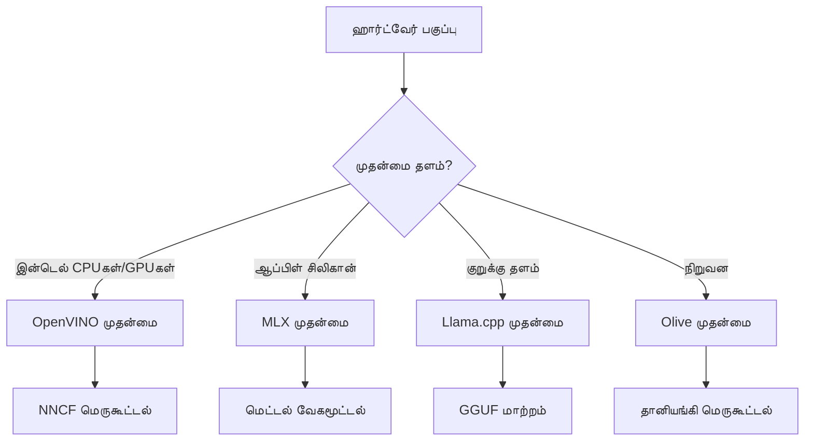
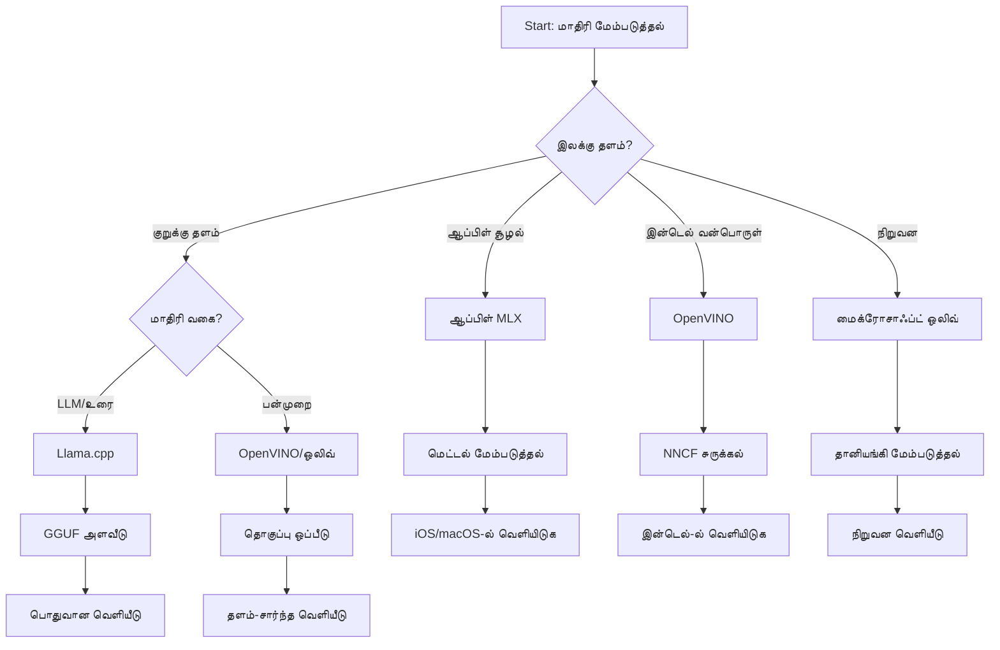
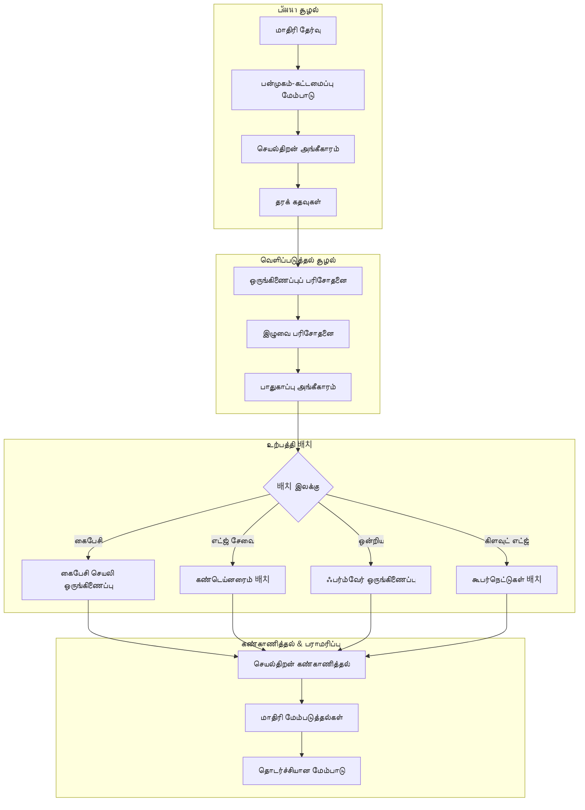

# பகுதி 6: எட்ஜ் AI வளர்ச்சி பணிச்சூழல் ஒருங்கிணைப்பு

## உள்ளடக்கம் அட்டவணை
1. [அறிமுகம்](#அறிமுகம்)
2. [கற்றல் நோக்கங்கள்](#கற்றல்-நோக்கங்கள்)
3. [ஒற்றைய பணிச்சூழல் மேலோட்டம்](#ஒற்றை-பணிச்சூழல்-மேலோட்டம்)
4. [ஏற்றுக்கொள்ளப்பட்ட கட்டமைப்பு தேர்வு மேட்ரிக்ஸ்](#கட்டமைப்பு-தேர்வு-மேட்ரிக்ஸ்)
5. [மிகச்சரியான நடைமுறைகள் ஒருங்கிணைப்பு](#சிறந்த-நடைமுறைகள்-ஒருங்கிணைப்பு)
6. [வினியோகம் யுக்தி கையேடு](#வினியோகம்-யுக்தி-கையேடு)
7. [செயற்பாடு மேம்படுத்தல் பணிச்சூழல்](#செயல்திறன்-மேம்படுத்தல்-பணிச்சூழல்)
8. [உற்பத்தி தயாரான்இருப்புக் பட்டியல்](#உற்பத்தி-தயாரான்இருப்புக்-பட்டியல்)
9. [பிரச்சனை நீக்கம் மற்றும் கண்காணிப்பு](#பிரச்சனைக்-கண்டறிதல்-மற்றும்-கண்காணிப்பு)
10. [எட்ஜ் AI புதியமைப்பு குழாய்க்கூட்டமான இருஞ்சுருக்கம்](#உங்கள்-எட்ஜ்-ai-குழாய்க்கூட்டை-எதிர்காலத்துக்கு-தயாராக்கல்)

## அறிமுகம்

எட்ஜ் AI வளர்ச்சி பல்வேறு மேம்படுத்தல் கட்டமைப்புகள், வினியோகம் யுக்திகள், மற்றும் ஹார்ட்வேர் பரிசீலனைகள் குறித்த சரியான புரிதலைக் கேட்கிறது. இந்த விரிவான ஒருங்கிணைப்பு Llama.cpp, Microsoft Olive, OpenVINO, மற்றும் Apple MLX ஆகியவற்றின் அறிவுத்திறன்களை ஒன்றாக சேர்த்து திறன் அதிகரிக்கும், தரத்தை பராமரிக்கும் மற்றும் வெற்றிகரமான உற்பத்தி வினியோகத்தை உறுதிப்படுத்தும் ஒருங்கிணைந்த பணிச்சூழலை உருவாக்குகிறது.

இந்த பாடத்தில், தனித்தனி மேம்படுத்தல் கட்டமைப்புகளை, விசேஷமான பலத்தையும் நுட்பமான பயன்பாட்டு வழிகளையும் ஆராய்ந்துள்ளோம். இருப்பினும், உண்மையான எட்ஜ் AI திட்டங்கள் பல கட்டமைப்புகளின் தொழில்நுட்பங்களை ஒருங்கிணைப்பதையோ அல்லது குறிப்பிட்ட கட்டுப்பாடுகள் மற்றும் தேவைகளுக்கு சிறந்த முடிவுகளை அளிக்கும் அணுகுமுறையை தேர்ந்தெடுப்பதையோ தேவைப்படுத்துகிறது.

இந்த பகுதி அனைத்து கட்டமைப்புகளின் கூட்டு ஞானத்தை செயற்பாட்டுக்குரிய பணிச்சூழல்கள், முடிவெடுத்தலைச் சித்திரங்கள் மற்றும் சிறந்த நடைமுறைகள் ஆகியவற்றின்படி ஒருங்கிணைக்கிறது, இதனால் நீங்கள் உற்பத்தி தயாரான எட்ஜ் AI தீர்வுகளை திறம்பட மற்றும் திறமையாக கட்டமைக்க முடியும். உங்கள் நோக்கம் கைபேசி சாதனங்கள், நுழைத்திருத்து அமைப்புகள் அல்லது எட்ஜ் சர்வர்கள் என்பதைப் பொறுத்து, இந்த கையேடு உங்கள் வளர்ச்சி வாழ்நாளில் அறிவார்ந்த முடிவுகளை எடுக்க ஒரு திட்டமிடல் வடிவமைப்பைக் கொடுக்கும்.

## கற்றல் நோக்கங்கள்

இந்த பகுதி முடிவில், நீங்கள் செய்யக்கூடியவை:

### திட்டமிட்ட முடிவெடுத்தல்
- **திட்ட தேவைகள், ஹார்ட்வேர் கட்டுப்பாடுகள், மற்றும் வினியோகம் சூழ்நிலைகளை** அடிப்படையாக கொண்டு சிறந்த மேம்படுத்தல் கட்டமைப்பை மதிப்பாய்வு செய்து தேர்ந்தெடுக்கவும்
- அதிக திறனைப் பெற பல மேம்படுத்தல் தொழில்நுட்பங்களை இணைக்கும் விரிவான பணிச்சூழல்களை வடிவமைக்கவும்
- ஒவ்வொரு கட்டமைப்பிலும் மாடல் துல்லியம், முன்னறிவிப்பு வேகம், நினைவக பயன்பாடு மற்றும் வினியோகம் சிக்கல்களை ஒப்பீடு செய்து வரம்புகளை மதிப்பாய்வு செய்யவும்

### பணிச்சூழல் ஒருங்கிணைப்பு
- பல மேம்படுத்தல் கட்டமைப்புகளின் பலங்களை பயன்படுத்திய ஒற்றை வளர்ச்சி குழாய்களைக் கையாளவும்
- வெவ்வேறு சூழல்களில் ஒரே மாதிரியான மாடல் மேம்படுத்தல் மற்றும் வினியோகம் பணிச்சூழல்களை உருவாக்கவும்
- மேம்படுத்தப்பட்ட மாடல்கள் உற்பத்தி தேவைகளை பூர்த்தி செய்து கொள்வதற்கான தர பாதுகாப்பு மற்றும் சரிபார்ப்புத் தளங்களை நிறுவவும்

### செயல்திறன் மேம்படுத்தல்
- அளவீடு, பரிக்ஷேபோற்றி, மற்றும் ஹார்ட்வேர் தனிப்பட்ட வேகம் கூடிய தொழில்நுட்பங்களைப் பயன்படுத்தி ஒழுங்கமைக்கப்பட்ட மேம்படுத்தல் யுக்திகளை நடைமுறைப்படுத்தவும்
- வெவ்வேறு மேம்படுத்தலை லெவல்கள் மற்றும் வினியோக இடங்களுக்கான திட்டமான செயல்திறன் கண்காணிப்பு மற்றும் மதிப்பீடு
- CPU, GPU, NPU மற்றும் சிறப்பு எட்ஜ் வேகப்படுத்திகள் போன்ற ஹார்ட்வேர் தளங்களுக்கு பிரதிஷ்டையாக மேம்படுத்தவும்

### உற்பத்தி வினியோகம்
- பல மாடல் வடிவங்கள் மற்றும் முன்னறிவிப்பு இயந்திரங்களை ஏற்றுக்கொள்ளும் அளவீட்டு வினியோக பண்பட்டங்களை வடிவமைக்கவும்
- உற்பத்தி சூழலில் எட்ஜ் AI பயன்பாடுகளுக்கான கண்காணிப்பு மற்றும் பார்வை அமைப்புகளை நடைமுறைப்படுத்தவும்
- மாடல் மேம்பாடுகள், செயல்திறன் கண்காணிப்பு மற்றும் அமைப்பு மேம்படுத்தலுக்கான பராமரிப்பு பணிச்சூழல்களை நிறுவவும்

### பன்மை தள சிறப்பு முன்னேற்றங்கள்
- பல்வேறு ஹார்ட்வேர் தளங்களில் மென்பொருள் மாற்றமில்லாமல் நடைமுறைப்படுத்தப்பட்ட மேம்படுத்தப்பட்ட மாடல்களை வினியோகிக்கவும்
- Windows, macOS, Linux, கைபேசி மற்றும் நுழைத்திருத்து அமைப்புகளுக்கான தளத்துக்கு உட்பட்ட மேம்படுத்தல்கள் கையாளவும்
- வெவ்வேறு எட்ஜ் சூழல்களுக்கு இடையே எளிதாக வினியோகிக்க உதவும் அப்ஸ்ட்ரக்ஷன் அடுக்குகளை உருவாக்கவும்

## ஒற்றை பணிச்சூழல் மேலோட்டம்

### கட்டம் 1: தேவைகள் பகுப்பாய்வு மற்றும் கட்டமைப்பு தேர்வு

வெற்றிகரமான எட்ஜ் AI வினியோகம் மொத்தம் தேவைகள் பகுப்பாய்விலிருந்து துவங்கி கட்டமைப்பு தேர்வு மற்றும் மேம்படுத்தல் யுக்தியை அறிவிப்பதில் உள்ளது.

#### 1.1 ஹார்ட்வேர் மதிப்பாய்வு

```mermaid
graph TD
    A[ஹார்ட்வேர் பகுப்பு] --> B{முதன்மை தளம்?}
    B -->|இன்டெல் CPUகள்/GPUகள்| C[OpenVINO முதன்மை]
    B -->|ஆப்பிள் சிலிகான்| D[MLX முதன்மை]
    B -->|குறுக்கு தளம்| E[Llama.cpp முதன்மை]
    B -->|நிறுவன| F[Olive முதன்மை]
    
    C --> G[NNCF மெருகூட்டல்]
    D --> H[மெட்டல் வேகமூட்டல்]
    E --> I[GGUF மாற்றம்]
    F --> J[தானியங்கி மெருகூட்டல்]
```

**முக்கிய பரிசீலனைகள்:**
- **CPU கட்டமைப்பு**: x86, ARM, ஆப்பிள் சிலிகான் திறன்கள்
- **வேகப்படுத்தி கிடைத்தல்**: GPU, NPU, VPU, சிறப்பு AI சிப்கள்
- **நினைவக வரம்புகள்**: RAM வரம்புகள், சேமிப்பு திறன்
- **மின் பொருள் பட்ஜெட்**: பேட்டரி ஆயுளிருத்தல், வெப்ப நிலைத்தன்மை வரம்புகள்
- **இணைப்பு**: ஆஃப்லைன் தேவைகள், பரப்பளவு வரம்புகள்

#### 1.2 பயன்பாட்டு தேவைகள் மேட்ரிக்ஸ்

| தேவைகள் | Llama.cpp | Microsoft Olive | OpenVINO | Apple MLX |
|-------------|-----------|-----------------|----------|-----------|
| பன்மை தள ஆதரவு | ✅ சிறந்தது | ⚡ நல்லது | ⚡ நல்லது | ❌ ஆப்பிள் மட்டும் |
| நிறுவன ஒருங்கிணைவு | ⚡ அடிப்படை | ✅ சிறந்தது | ✅ சிறந்தது | ⚡ வரம்பற்ற |
| கைபேசி வினியோகம் | ✅ சிறந்தது | ⚡ நல்லது | ⚡ நல்லது | ✅ iOS சிறந்தது |
| நேரடி முன்னறிவிப்பு | ✅ சிறந்தது | ✅ சிறந்தது | ✅ சிறந்தது | ✅ சிறந்தது |
| மாடல் பன்மை | ✅ LLM மையம் | ✅ அனைத்து மாடல்கள் | ✅ அனைத்து மாடல்கள் | ✅ LLM மையம் |
| எளிய பயன்பாடு | ✅ எளிமை | ✅ தானாகச் செயல் படுத்தல் | ⚡ நடுத்தர | ✅ எளிமை |

### கட்டம் 2: மாடல் தயார்ப்பு மற்றும் மேம்படுத்தல்

#### 2.1 ஒட்டுமொத்த மாடல் மதிப்பாய்வு குழாய்

```python
# யுனிவர்சல் மாதிரி மதிப்பீட்டு கட்டமைப்பு
class EdgeAIModelAssessment:
    def __init__(self, model_path, target_hardware):
        self.model_path = model_path
        self.target_hardware = target_hardware
        self.optimization_frameworks = []
        
    def assess_model_characteristics(self):
        """Analyze model size, architecture, and complexity"""
        return {
            'model_size': self.get_model_size(),
            'parameter_count': self.get_parameter_count(),
            'architecture_type': self.detect_architecture(),
            'quantization_compatibility': self.check_quantization_support()
        }
    
    def recommend_optimization_strategy(self):
        """Recommend optimal frameworks and techniques"""
        characteristics = self.assess_model_characteristics()
        
        if self.target_hardware.startswith('apple'):
            return self.mlx_optimization_strategy(characteristics)
        elif self.target_hardware.startswith('intel'):
            return self.openvino_optimization_strategy(characteristics)
        elif characteristics['model_size'] > 7_000_000_000:  # 7B+ அளவுருக்கள்
            return self.enterprise_optimization_strategy(characteristics)
        else:
            return self.lightweight_optimization_strategy(characteristics)
```

#### 2.2 பன்முனை கட்டமைப்பு மேம்படுத்தல் குழாய்

**வரிசைப்படுத்தப்பட்ட மேம்படுத்தல் அணுகுமுறை:**
1. **துவக்க மாற்றம்**: இடைநிலை வடிவத்திற்கு மாற்று (ONNX சாத்தியமான போது)
2. **கட்டமைப்பு தனிப்பட்ட மேம்படுத்தல்**: நுட்பமிக்க தொழில்நுட்பம் பயன்படுத்து
3. **இணைப்பு சோதனை**: குறிக்கோள் தளங்களில் செயல்திறனை உறுதி செய்
4. **இறுதி தொகுப்பு**: வினியோகத்துக்கான தயாரிப்பு

```bash
# பன்முக அமைப்புகளை சிறப்பாக்கொள் ஸ்கிரிப்ட்
#!/bin/bash

MODEL_NAME="phi-3-mini"
BASE_MODEL="microsoft/Phi-3-mini-4k-instruct"

# நிலை 1: ONNX மாற்றம் (பொருளாதாரம்)
python convert_to_onnx.py --model $BASE_MODEL --output models/onnx/

# நிலை 2: தளம்-சிறப்பான சிறப்பாக்கம்
if [[ "$TARGET_PLATFORM" == "intel" ]]; then
    # OpenVINO சிறப்பாக்கம்
    python optimize_openvino.py --input models/onnx/ --output models/openvino/
elif [[ "$TARGET_PLATFORM" == "apple" ]]; then
    # MLX சிறப்பாக்கம்
    python optimize_mlx.py --input $BASE_MODEL --output models/mlx/
elif [[ "$TARGET_PLATFORM" == "cross" ]]; then
    # Llama.cpp சிறப்பாக்கம்
    python convert_to_gguf.py --input models/onnx/ --output models/gguf/
fi

# நிலை 3: சரிபார்ப்பு
python validate_optimization.py --original $BASE_MODEL --optimized models/$TARGET_PLATFORM/
```

### கட்டம் 3: செயல்திறன் சரிபார்ப்பு மற்றும் தர பரிசோதனை

#### 3.1 விரிவான தரத் தேர்வு கட்டமைப்பு

```python
class EdgeAIBenchmark:
    def __init__(self, optimized_models):
        self.models = optimized_models
        self.metrics = {
            'inference_time': [],
            'memory_usage': [],
            'accuracy_score': [],
            'throughput': [],
            'energy_consumption': []
        }
    
    def run_comprehensive_benchmark(self):
        """Execute standardized benchmarks across all optimized models"""
        test_inputs = self.generate_test_inputs()
        
        for model_framework, model_path in self.models.items():
            print(f"Benchmarking {model_framework}...")
            
            # தாமத சோதனை
            latency = self.measure_inference_latency(model_path, test_inputs)
            
            # நினைவக சுயவிவரப்படுத்தல்
            memory = self.profile_memory_usage(model_path)
            
            # துல்லியத்தன்மை சரிபார்த்தல்
            accuracy = self.validate_model_accuracy(model_path, test_inputs)
            
            # தலகை பகுப்பாய்வு
            throughput = self.measure_throughput(model_path)
            
            self.record_metrics(model_framework, latency, memory, accuracy, throughput)
    
    def generate_optimization_report(self):
        """Create comprehensive comparison report"""
        report = {
            'recommendations': self.analyze_performance_trade_offs(),
            'deployment_guidance': self.generate_deployment_recommendations(),
            'monitoring_requirements': self.define_monitoring_metrics()
        }
        return report
```

## கட்டமைப்பு தேர்வு மேட்ரிக்ஸ்

### கட்டமைப்பு தேர்வுக்கான முடிவெடுத்தல் மரம்


```mermaid
graph TD
    A[Start: மாதிரி மேம்படுத்தல்] --> B{இலக்கு தளம்?}
    
    B -->|ஆப்பிள் சூழல்| C[ஆப்பிள் MLX]
    B -->|இன்டெல் வன்பொருள்| D[OpenVINO]
    B -->|குறுக்கு தளம்| E{மாதிரி வகை?}
    B -->|நிறுவன| F[மைக்ரோசாஃப்ட் ஒலிவ்]
    
    E -->|LLM/உரை| G[Llama.cpp]
    E -->|பன்முறை| H[OpenVINO/ஒலிவ்]
    
    C --> I[மெட்டல் மேம்படுத்தல்]
    D --> J[NNCF சுருக்கல்]
    F --> K[தானியங்கி மேம்படுத்தல்]
    G --> L[GGUF அளவீடு]
    H --> M[தொகுப்பு ஒப்பீடு]
    
    I --> N[iOS/macOS-ல் வெளியிடுக]
    J --> O[இன்டெல்-ல் வெளியிடுக]
    K --> P[நிறுவன வெளியீடு]
    L --> Q[பொதுவான வெளியீடு]
    M --> R[தளம்-சார்ந்த வெளியீடு]
```

### விரிவான தேர்வு விதிமுறைகள்

#### 1. முதன்மை பயன்பாட்டு பொருத்தம்

**பெரிய மொழி மாடல்கள் (LLMs):**
- **Llama.cpp**: CPU க்கான சிறந்த, பன்மை தளம் வினியோகம்
- **Apple MLX**: ஆப்பிள் சிலிகானுக்கு மிகவும் பொருத்தமானது ஒருங்கிணைந்த நினைவகத்துடன்
- **OpenVINO**: Intel ஹார்ட்வேர் மற்றும் NNCF மேம்படுத்தலுக்கு சிறந்தது
- **Microsoft Olive**: நிறுவன பணிச்சூழலுக்கு தானியங்கி உதவியுடன் பொருத்தமானது

**பன்முறையினர் மாடல்கள்:**
- **OpenVINO**: காட்சி, ஒலி மற்றும் உரை களஞ்சியத்திற்கு விரிவான ஆதரவு
- **Microsoft Olive**: சிக்கலான பணிச்சூழல்களுக்கு நிறுவன நிலை மேம்படுத்தல்
- **Llama.cpp**: உரை தள மாடல்களுக்கு மட்டுப்படுத்தப்பட்டது
- **Apple MLX**: பன்முறை பயன்பாடுக்கு வளர்ந்து வரும் ஆதரவு

#### 2. ஹார்ட்வேர் தள மேட்ரிக்ஸ்

| தளம் | முதன்மை கட்டமைப்பு | இரண்டாம் வாய்ப்பு | சிறப்பு அம்சங்கள் |
|----------|------------------|------------------|---------------------|
| Intel CPU/GPU | OpenVINO | Microsoft Olive | NNCF சுருக்கம், Intel மேம்படுத்தல் |
| NVIDIA GPU | Microsoft Olive | OpenVINO | CUDA வேகப்படுத்தல், நிறுவன அம்சங்கள் |
| Apple Silicon | Apple MLX | Llama.cpp | மெட்டல் ஷேடர்கள், ஒருங்கிணைந்த நினைவகம் |
| ARM கைபேசி | Llama.cpp | OpenVINO | பன்மை தளம், குறைந்த சார்புகள் |
| Edge TPU | OpenVINO | Microsoft Olive | சிறப்பு வேகப்படுத்தி ஆதரவு |
| நுழைத்திருத்து ARM | Llama.cpp | OpenVINO | குறைந்த அடிப்படை, திறன் வாய்ந்த முன்னறிவிப்பு |

#### 3. வளர்ச்சி பணிச்சூழல் விருப்பங்கள்

**வேகமான மாதிரிநாட்டு செயல்:**
1. **Llama.cpp**: மிக வேகமான அமைப்பு, உடனடி முடிவுகள்
2. **Apple MLX**: எளிய பைதான் API, விரைவான திருத்தம்
3. **Microsoft Olive**: தானாக மேம்படுத்தல், குறைந்த கட்டமைப்பு
4. **OpenVINO**: சற்றே சிக்கலான அமைப்பு, விரிவான அம்சங்கள்

**நிறுவன உற்பத்தி:**
1. **Microsoft Olive**: நிறுவன அம்சங்கள், Azure ஒருங்கிணைவு
2. **OpenVINO**: Intel சுற்றுச் சூழல் மற்றும் விரிவான கருவிகள்
3. **Apple MLX**: ஆப்பிள்-சொந்த நிறுவன பயன்பாடுகள்
4. **Llama.cpp**: எளிய வினியோகம், குறைந்த நிறுவன அம்சங்கள்

## சிறந்த நடைமுறைகள் ஒருங்கிணைப்பு

### பொதுவான மேம்படுத்தல் 원칙ங்கள்

#### 1. படிநிலை முறை மேம்படுத்தல் யுக்தி

```python
class ProgressiveOptimization:
    def __init__(self, base_model):
        self.base_model = base_model
        self.optimization_stages = [
            'baseline_measurement',
            'format_conversion',
            'quantization_optimization',
            'hardware_acceleration',
            'production_validation'
        ]
    
    def execute_progressive_optimization(self):
        """Apply optimization techniques incrementally"""
        
        # நிலை 1: அடிப்படை அளவீடு
        baseline_metrics = self.measure_baseline_performance()
        
        # நிலை 2: வடிவமைப்பு மாற்றம்
        converted_model = self.convert_to_optimal_format()
        conversion_metrics = self.measure_performance(converted_model)
        
        # நிலை 3: அளவு குறைத்தல்
        quantized_model = self.apply_quantization(converted_model)
        quantization_metrics = self.measure_performance(quantized_model)
        
        # நிலை 4: ஹார்ட்வேர்க் வேகமூட்டல்
        accelerated_model = self.enable_hardware_acceleration(quantized_model)
        acceleration_metrics = self.measure_performance(accelerated_model)
        
        # நிலை 5: சரிபார்த்தல்
        production_ready = self.validate_for_production(accelerated_model)
        
        return self.compile_optimization_report(
            baseline_metrics, conversion_metrics, 
            quantization_metrics, acceleration_metrics
        )
```

#### 2. தர பாதுகாப்பு அமல்படுத்தல்

**துல்லியம் பராமரிப்பு வாயில்கள்:**
- உண்மையான மாடல் துல்லியத்தின் >95% பராமரிக்கவும்
- பிரதிநிதித்துவமான சோதனை தரவு தொகுதிகளை எதிர்கொள்ளவும்
- உற்பத்தி சரிபார்ப்பிற்கு A/B சோதனையை செயல்படுத்தவும்

**செயல்திறன் மேம்படுத்தும் வாயில்கள்:**
- குறைந்தது 2 மடங்கு வேகம் மேம்பாடு அடையவும்
- நினைவக பயன்பாட்டை குறைந்தது 50% கட்டுக்குள் வடிகட்டி குறைக்கவும்
- முன்னறிவிப்பு நேர ஒத்திசைவைச் சரிபார்க்கவும்

**உற்பத்தி தயாரான வாயில்கள்:**
- சுமை செய்யப்பட்ட சோதனைகளை தாண்டி கடந்து செல்லவும்
- நேரத்தால் நிலைத்த செயற்பாட்டைக் காட்டு
- பாதுகாப்பு மற்றும் தனியுரிமை தேவைகளைச் சரிபார்த்து உறுதி செய்

### கட்டமைப்பு தனிப்பட்ட சிறந்த நடைமுறைகள் ஒருங்கிணைப்பு

#### 1. அளவீடு யுக்தி ஒருங்கிணைப்பு

```python
# ஒருங்கிணைந்த அளவீட்டு அணுகுமுறை
class UnifiedQuantizationStrategy:
    def __init__(self, model, target_platform):
        self.model = model
        self.platform = target_platform
        
    def select_optimal_quantization(self):
        """Choose best quantization based on platform and requirements"""
        
        if self.platform == 'apple_silicon':
            return self.mlx_quantization_strategy()
        elif self.platform == 'intel_hardware':
            return self.openvino_quantization_strategy()
        elif self.platform == 'cross_platform':
            return self.llamacpp_quantization_strategy()
        else:
            return self.olive_quantization_strategy()
    
    def mlx_quantization_strategy(self):
        """Apple MLX-specific quantization"""
        return {
            'method': 'mlx_quantize',
            'precision': 'int4',
            'group_size': 64,
            'optimization_target': 'unified_memory'
        }
    
    def openvino_quantization_strategy(self):
        """OpenVINO NNCF quantization"""
        return {
            'method': 'nncf_quantize',
            'precision': 'int8',
            'calibration_method': 'post_training',
            'optimization_target': 'intel_hardware'
        }
```

#### 2. ஹார்ட்வேர் வேகப்படுத்தல் மேம்படுத்தல்

**CPU மேம்படுத்தல் ஒருங்கிணைப்பு:**
- **SIMD கட்டளை**: கட்டமைப்புகளில் மேம்படுத்தப்பட்ட கர்னல் பயன்பாடு
- **நினைவக பட்டிகை பரபரப்பானன்**: குறையசெய்யப்பட்ட நினைவக வடிவமைப்புகள்
- **தெிரட்டிங்**: வளங்கள் மற்றும் செயல்பாடு சமன்செய்யவும்

**GPU வேகப்படுத்தல் சிறந்த நடைமுறைகள்:**
- **தொகுப்பு செயலாக்கம்**: மிகுதி வெளியீடு பெற பொருத்தமான தொகுப்பு அளவு
- **நினைவக மேலாண்மை**: GPU நினைவக ஒதுக்கீடு மற்றும் மாற்றங்களை மேம்படுத்தவும்
- **துல்லியம்**: சிறந்த செயல்பாட்டிற்கு ஆதரவு குறித்த போது FP16 பயன்படுத்தவும்

**NPU/சிறப்பு வேகப்படுத்தி மேம்படுத்தல்:**
- **மாடல் கட்டமைப்பு**: வேகப்படுத்தி திறன்கள் பொருந்தும் அங்கீகாரம் உறுதி செய்யவும்
- **தரவு பாய்ச்சி**: வேகப்படுத்தி திறன்மிக்க உள்ளடக்கு/வெளியீட்டு குழாய்களை மேம்படுத்தவும்
- **மீண்டும் திருப்புதல் யுக்திகள்**: ஆதரவு இல்லாத செயல்களுக்கு CPUFallback நடைமுறைப்படுத்தவும்

## வினியோகம் யுக்தி கையேடு

### பொதுவான வினியோகம் கட்டமைப்பு


```mermaid
graph TB
    subgraph "பัฒนา சூழல்"
        A[மாதிரி தேர்வு] --> B[பன்முகம்-கட்டமைப்பு மேம்பாடு]
        B --> C[செயல்திறன் அங்கீகாரம்]
        C --> D[தரக் கதவுகள்]
    end
    
    subgraph "வெளிப்படுத்தல் சூழல்"
        D --> E[ஒருங்கிணைப்புப் பரிசோதனை]
        E --> F[இழுவை பரிசோதனை]
        F --> G[பாதுகாப்பு அங்கீகாரம்]
    end
    
    subgraph "உற்பத்தி 배치"
        G --> H{배치 இலக்கு}
        H -->|கைபேசி| I[கைபேசி செயலி ஒருங்கிணைப்பு]
        H -->|எட்ஜ் சேவை| J[கண்டெய்னரைம் 배치]
        H -->|ஒன்றிய| K[ஃபர்ம்வேர் ஒருங்கிணைப்பு]
        H -->|கிளவுட் எட்ஜ்| L[கூபர்நெட்டுகள் 배치]
    end
    
    subgraph "கண்காணித்தல் & பராமரிப்பு"
        I --> M[செயல்திறன் கண்காணித்தல்]
        J --> M
        K --> M
        L --> M
        M --> N[மாதிரி மேம்படுத்தல்கள்]
        N --> O[தொடர்ச்சியான மேம்பாடு]
    end
```

### தளத்துக்கு உட்பட்ட வினியோகம் முறை அரசியல்

#### 1. கைபேசி வினியோகம் யுக்தி

```yaml
# Mobile Deployment Configuration
mobile_deployment:
  ios:
    framework: apple_mlx
    optimization:
      quantization: int4
      memory_mapping: true
      background_execution: limited
    packaging:
      format: mlx
      bundle_size: <50MB
      
  android:
    framework: llama_cpp
    optimization:
      quantization: q4_k_m
      threading: android_optimized
      memory_management: conservative
    packaging:
      format: gguf
      apk_size: <100MB
      
  cross_platform:
    framework: onnx_runtime
    optimization:
      quantization: int8
      execution_provider: cpu
    packaging:
      format: onnx
      shared_libraries: minimal
```

#### 2. எட்ஜ் சர்வர் வினியோகம்

```yaml
# Edge Server Deployment Configuration
edge_server:
  intel_based:
    framework: openvino
    optimization:
      quantization: int8
      acceleration: cpu_gpu_auto
      batch_processing: dynamic
    deployment:
      container: openvino_runtime
      orchestration: kubernetes
      scaling: horizontal
      
  nvidia_based:
    framework: microsoft_olive
    optimization:
      quantization: int4
      acceleration: cuda
      tensor_parallelism: true
    deployment:
      container: nvidia_triton
      orchestration: kubernetes
      scaling: gpu_aware
```

### கன்டெய்னரை பயன்படுத்தும் சிறந்த நடைமுறைகள்

```dockerfile
# Multi-Framework Edge AI Container
FROM ubuntu:22.04 as base

# Install common dependencies
RUN apt-get update && apt-get install -y \
    python3 \
    python3-pip \
    build-essential \
    cmake \
    && rm -rf /var/lib/apt/lists/*

# Framework-specific stages
FROM base as openvino
RUN pip install openvino nncf optimum[intel]

FROM base as llamacpp
RUN git clone https://github.com/ggerganov/llama.cpp.git \
    && cd llama.cpp && make LLAMA_OPENBLAS=1

FROM base as olive
RUN pip install olive-ai[auto-opt] onnxruntime-genai

# Production stage with selected framework
FROM openvino as production
COPY models/ /app/models/
COPY src/ /app/src/
WORKDIR /app

EXPOSE 8080
CMD ["python3", "src/inference_server.py"]
```

## செயல்திறன் மேம்படுத்தல் பணிச்சூழல்

### ஒழுங்கமைக்கப்பட்ட செயல்திறன் மேம்படுத்தல்

#### 1. செயல்திறன் சுயவிவரம் தொடர்ச்சி

```python
class EdgeAIPerformanceProfiler:
    def __init__(self, model_path, framework):
        self.model_path = model_path
        self.framework = framework
        self.profiling_results = {}
    
    def comprehensive_profiling(self):
        """Execute comprehensive performance analysis"""
        
        # CPU ப்ரோஃபைலிங்
        cpu_profile = self.profile_cpu_usage()
        
        # நினைவக ப்ரோஃபைலிங்
        memory_profile = self.profile_memory_usage()
        
        # முடிவெடுக்கும் தாமதம்
        latency_profile = self.profile_inference_latency()
        
        # திறன் பகுப்பாய்வு
        throughput_profile = self.profile_throughput()
        
        # энергி நுகர்வு (இணையமாக இருந்தால்)
        energy_profile = self.profile_energy_consumption()
        
        return self.compile_performance_report(
            cpu_profile, memory_profile, latency_profile,
            throughput_profile, energy_profile
        )
    
    def identify_bottlenecks(self):
        """Automatically identify performance bottlenecks"""
        bottlenecks = []
        
        if self.profiling_results['cpu_utilization'] > 80:
            bottlenecks.append('cpu_bound')
        
        if self.profiling_results['memory_usage'] > 90:
            bottlenecks.append('memory_bound')
        
        if self.profiling_results['inference_variance'] > 20:
            bottlenecks.append('inconsistent_performance')
        
        return self.generate_optimization_recommendations(bottlenecks)
```

#### 2. தானியங்கி மேம்படுத்தல் குழாய்

```python
class AutomatedOptimizationPipeline:
    def __init__(self, base_model, target_constraints):
        self.base_model = base_model
        self.constraints = target_constraints
        self.optimization_history = []
    
    def execute_optimization_search(self):
        """Systematically search optimization space"""
        
        optimization_candidates = [
            {'quantization': 'int8', 'pruning': 0.1},
            {'quantization': 'int4', 'pruning': 0.2},
            {'quantization': 'int8', 'acceleration': 'gpu'},
            {'quantization': 'int4', 'acceleration': 'npu'}
        ]
        
        best_configuration = None
        best_score = 0
        
        for config in optimization_candidates:
            optimized_model = self.apply_optimization(config)
            score = self.evaluate_optimization(optimized_model)
            
            if score > best_score and self.meets_constraints(optimized_model):
                best_score = score
                best_configuration = config
            
            self.optimization_history.append({
                'config': config,
                'score': score,
                'model': optimized_model
            })
        
        return best_configuration, self.optimization_history
```

### பல நோக்கங்கள் இணைக்கும் மேம்படுத்தல்

#### 1. எட்ஜ் AI க்கான பாரெட்டோ மேம்படுத்தல்

```python
class ParetoOptimization:
    def __init__(self, objectives=['speed', 'accuracy', 'memory']):
        self.objectives = objectives
        self.pareto_frontier = []
    
    def find_pareto_optimal_solutions(self, optimization_results):
        """Identify Pareto-optimal configurations"""
        
        for result in optimization_results:
            is_dominated = False
            
            for frontier_point in self.pareto_frontier:
                if self.dominates(frontier_point, result):
                    is_dominated = True
                    break
            
            if not is_dominated:
                # முன்னோக்கி இருந்து அடிமைப்படுத்தப்பட்ட புள்ளிகளை அகற்று
                self.pareto_frontier = [
                    point for point in self.pareto_frontier 
                    if not self.dominates(result, point)
                ]
                
                self.pareto_frontier.append(result)
        
        return self.pareto_frontier
    
    def recommend_configuration(self, user_preferences):
        """Recommend configuration based on user preferences"""
        
        weighted_scores = []
        for config in self.pareto_frontier:
            score = sum(
                user_preferences[obj] * config['metrics'][obj] 
                for obj in self.objectives
            )
            weighted_scores.append((score, config))
        
        return max(weighted_scores, key=lambda x: x[0])[1]
```

## உற்பத்தி தயாரான்இருப்புக் பட்டியல்

### முழுமையான உற்பத்தி சரிபார்ப்பு

#### 1. மாடல் தர உறுதி

```python
class ProductionReadinessValidator:
    def __init__(self, optimized_model, production_requirements):
        self.model = optimized_model
        self.requirements = production_requirements
        self.validation_results = {}
    
    def validate_model_quality(self):
        """Comprehensive model quality validation"""
        
        # துல்லிய சான்றிதழ்
        accuracy_result = self.validate_accuracy()
        
        # செயல்திறன் சான்றிதழ்
        performance_result = self.validate_performance()
        
        # கடுமை சோதனை
        robustness_result = self.validate_robustness()
        
        # பாதுகாப்பு மதிப்பீடு
        security_result = self.validate_security()
        
        # பொருந்துதலின் பரிசோதனை
        compliance_result = self.validate_compliance()
        
        return self.compile_validation_report(
            accuracy_result, performance_result, robustness_result,
            security_result, compliance_result
        )
    
    def generate_certification_report(self):
        """Generate production certification report"""
        return {
            'model_signature': self.generate_model_signature(),
            'validation_timestamp': datetime.now(),
            'validation_results': self.validation_results,
            'deployment_approval': self.check_deployment_approval(),
            'monitoring_requirements': self.define_monitoring_requirements()
        }
```

#### 2. உற்பத்தி வினியோகம் தாள்முறை பட்டியல்

**முன்னிடு வினியோகம் சரிபார்ப்பு:**
- [ ] மாடல் துல்லியம் குறைந்த பட்ச தேவைகளை நிறைவேற்றுகிறது (>95% அடிப்படை)
- [ ] செயல்திறன் இலக்குகள் அடைக்கப்பட்டுள்ளன (தாமதம், throughput, நினைவகம்)
- [ ] பாதுகாப்பு பலவீனங்கள் மதிப்பிட்டு குறைக்கப்பட்டு உள்ளன
- [ ] எதிர்பார்க்கப்பட்ட சுமையில் சுமை சோதனை முடிந்தது
- [ ] தோல்வி நிலைகள் சோதிக்கப்பட்டு மீட்டுப்படிகள் நிரூபிக்கப்பட்டன
- [ ] கண்காணிப்பு மற்றும் அலர்ட் அமைப்புகள் பராமரிக்கப்பட்டன
- [ ] பின்விளைவு முறைகள் சோதிக்கப்பட்டு பதிவுசெய்யப்பட்டன

**வினியோகம் செயல்முறை:**
- [ ] நீல-பச்சை வினியோகம் யுக்தி செயல்படுத்தப்பட்டது
- [ ] மெதுவான போக்குவரத்து அதிகரிப்பு அமைக்கப்பட்டது
- [ ] நேரடி கண்காணிப்பு டாஷ்போர்ட்கள் செயல்படுத்தப்பட்டன
- [ ] செயல்திறன் அடிப்படைகள் நிறுவப்பட்டன
- [ ] பிழை வீதத் தடைகள் வரையறுக்கப்பட்டன
- [ ] தானியக்க பின்விளைவுக் கண்ணோட்டங்கள் உருவாக்கப்பட்டன

**பின்வினியோகம் கண்காணிப்பு:**
- [ ] மாடல் சாய்வு கண்டறிதல் செயலில் உள்ளது
- [ ] செயல்திறன் சீர்கேடுகளுக்கான எச்சரிக்கை அமைக்கப்பட்டுள்ளது
- [ ] வளங்களின் பயன்பாட்டை கண்காணிக்கும் அமைப்பு இயக்கப்படுகிறது
- [ ] பயனர் அனுபவக் கணக்கெடுப்புகள் கண்காணிக்கப்படுகின்றன
- [ ] மாடல் பதிப்பு மற்றும் வரலாறு பராமரிக்கப்படுகிறது
- [ ] மாடல் செயல்திறன் மதிப்பீடுகள் முறையாக திட்டமிடப்பட்டன

### தொடர்ச்சியான ஒருங்கிணைத்தல்/தொடர்ச்சியான வினியோகம் (CI/CD)

```yaml
# Edge AI CI/CD Pipeline Configuration
edge_ai_pipeline:
  stages:
    - model_validation
    - optimization
    - testing
    - staging_deployment
    - production_deployment
    - monitoring
  
  model_validation:
    accuracy_threshold: 0.95
    performance_baseline: required
    security_scan: enabled
    
  optimization:
    frameworks:
      - llama_cpp
      - openvino
      - microsoft_olive
    validation:
      cross_validation: enabled
      performance_comparison: required
      
  testing:
    unit_tests: comprehensive
    integration_tests: full_pipeline
    load_tests: production_scale
    security_tests: comprehensive
    
  deployment:
    strategy: blue_green
    traffic_ramping: gradual
    rollback: automatic
    monitoring: real_time
```

## பிரச்சனைக் கண்டறிதல் மற்றும் கண்காணிப்பு

### பொதுவான பிரச்சனை தீர்க்கல் கட்டமைப்பு

#### 1. பொதுவான பிரச்சனைகள் மற்றும் தீர்வுகள்

**செயல்திறன் பிரச்சனைகள்:**
```python
class PerformanceTroubleshooter:
    def __init__(self, model_metrics):
        self.metrics = model_metrics
        
    def diagnose_performance_issues(self):
        """Systematic performance issue diagnosis"""
        
        issues = []
        
        # உயர் தாமதம் பகுப்பாய்வு
        if self.metrics['avg_latency'] > self.metrics['target_latency']:
            issues.append(self.diagnose_latency_issues())
        
        # நினைவக பயன்பாடு பகுப்பாய்வு
        if self.metrics['memory_usage'] > self.metrics['memory_limit']:
            issues.append(self.diagnose_memory_issues())
        
        # ஊடுருவல் பகுப்பாய்வு
        if self.metrics['throughput'] < self.metrics['target_throughput']:
            issues.append(self.diagnose_throughput_issues())
        
        return self.generate_resolution_plan(issues)
    
    def diagnose_latency_issues(self):
        """Specific latency troubleshooting"""
        potential_causes = []
        
        if self.metrics['cpu_utilization'] > 80:
            potential_causes.append('cpu_bottleneck')
        
        if self.metrics['memory_bandwidth'] > 90:
            potential_causes.append('memory_bandwidth_limit')
        
        if self.metrics['model_size'] > self.metrics['optimal_size']:
            potential_causes.append('model_too_large')
        
        return {
            'issue': 'high_latency',
            'causes': potential_causes,
            'solutions': self.generate_latency_solutions(potential_causes)
        }
```

**கட்டமைப்பு தனிப்பட்ட பிரச்சனை தீர்க்கல்:**

| பிரச்சனை | Llama.cpp | Microsoft Olive | OpenVINO | Apple MLX |
|-------|-----------|-----------------|----------|-----------|
| நினைவக பிரச்சனைகள் | சூழல் நீளம் குறை | தொகுப்பு அளவு குறை | கேசிங் இயக்கு | நினைவக வரைபடம் பயன்படுத்து |
| மெதுவான முன்னறிவிப்பு | SIMD இயக்கு | அளவீடு சரிபார் | தெிரட்டிங் மேம்படு | மெட்டல் இயக்கு |
| துல்லியம் இழப்பு | அதிகப்படுத்திய அளவீடு | QAT உடன் மறுபயிற்சி | அளவீடு அதிகரிக்க | பின்னர் துல்லியம் பிணைத்தல் |
| பொருந்துதல்பு | மாடல் வடிவத்தை ஆய்வு செய் | கட்டமைப்பு பதிப்பு சரிபார் | இயக்கி புதுப்பி | macOS பதிப்பு சரிபார் |

#### 2. உற்பத்தி கண்காணிப்பு யுக்தி

```python
class EdgeAIMonitoring:
    def __init__(self, deployment_config):
        self.config = deployment_config
        self.metrics_collectors = []
        self.alerting_rules = []
    
    def setup_comprehensive_monitoring(self):
        """Configure comprehensive monitoring for Edge AI deployment"""
        
        # மாடல் செயல்திறன் கண்காணிப்பு
        self.setup_model_performance_monitoring()
        
        # அடித்தளம் கண்காணிப்பு
        self.setup_infrastructure_monitoring()
        
        # வணிக அளவுகோல்கள் கண்காணிப்பு
        self.setup_business_metrics_monitoring()
        
        # பாதுகாப்பு கண்காணிப்பு
        self.setup_security_monitoring()
    
    def setup_model_performance_monitoring(self):
        """Model-specific performance monitoring"""
        metrics = [
            'inference_latency_p50',
            'inference_latency_p95',
            'inference_latency_p99',
            'model_accuracy_drift',
            'prediction_confidence_distribution',
            'error_rate',
            'throughput_requests_per_second'
        ]
        
        for metric in metrics:
            self.add_metric_collector(metric)
            self.add_alerting_rule(metric)
    
    def detect_model_drift(self):
        """Automated model drift detection"""
        drift_indicators = [
            self.statistical_drift_detection(),
            self.performance_drift_detection(),
            self.data_distribution_shift_detection()
        ]
        
        return self.aggregate_drift_signals(drift_indicators)
```

### தானியங்கி பிரச்சனை தீர்வு

```python
class AutomatedIssueResolution:
    def __init__(self, monitoring_system):
        self.monitoring = monitoring_system
        self.resolution_strategies = {}
    
    def handle_performance_degradation(self, alert):
        """Automated performance issue resolution"""
        
        if alert['type'] == 'high_latency':
            return self.resolve_latency_issue(alert)
        elif alert['type'] == 'high_memory_usage':
            return self.resolve_memory_issue(alert)
        elif alert['type'] == 'accuracy_drift':
            return self.resolve_accuracy_issue(alert)
        
    def resolve_latency_issue(self, alert):
        """Automated latency issue resolution"""
        resolution_steps = [
            'increase_cpu_allocation',
            'enable_model_caching',
            'reduce_batch_size',
            'switch_to_quantized_model'
        ]
        
        for step in resolution_steps:
            if self.apply_resolution_step(step):
                return f"Resolved latency issue with: {step}"
        
        return "Escalating to human operator"
```

## உங்கள் எட்ஜ் AI குழாய்க்கூட்டை எதிர்காலத்துக்கு தயாராக்கல்

### புதிய தொழில்நுட்ப ஒருங்கிணைப்பு

#### 1. அடுத்த தலைமுறை ஹார்ட்வேர் ஆதரவு

```python
class FutureHardwareIntegration:
    def __init__(self):
        self.supported_accelerators = [
            'npu_next_gen',
            'quantum_processors',
            'neuromorphic_chips',
            'optical_processors'
        ]
    
    def design_adaptive_pipeline(self):
        """Create hardware-agnostic optimization pipeline"""
        
        pipeline = {
            'model_preparation': self.universal_model_preparation(),
            'hardware_detection': self.dynamic_hardware_detection(),
            'optimization_selection': self.adaptive_optimization_selection(),
            'performance_validation': self.hardware_agnostic_validation()
        }
        
        return pipeline
    
    def adaptive_optimization_selection(self):
        """Dynamically select optimization based on available hardware"""
        
        def optimize_for_hardware(model, available_hardware):
            if 'npu' in available_hardware:
                return self.npu_optimization(model)
            elif 'quantum' in available_hardware:
                return self.quantum_optimization(model)
            elif 'neuromorphic' in available_hardware:
                return self.neuromorphic_optimization(model)
            else:
                return self.fallback_optimization(model)
        
        return optimize_for_hardware
```

#### 2. மாடல் கட்டமைப்பு வளர்ச்சி

**புதிய கட்டமைப்புகளுக்கு ஆதரவு:**
- **தோற்றக்கலை கலவை (MoE)**: திறனை அதிகரிக்கும் அரைகுறைக் கட்டமைப்புகள்
- **திரும்ப பெறுதல்-ஆதரிக்கப்பட்ட உருவாக்கம்**: கலவையான மாடல் + அறிவுத்தளம்
- **பன்முறை மாடல்கள்**: காட்சி + மொழி + ஒலி ஒருங்கிணைவு
- **பகிரங்க கற்றல்**: விநியோகிக்கப்பட்ட பயிற்சி மற்றும் மேம்படுத்தல்

```python
class NextGenModelSupport:
    def __init__(self):
        self.architecture_handlers = {
            'moe': self.handle_mixture_of_experts,
            'rag': self.handle_retrieval_augmented,
            'multimodal': self.handle_multimodal,
            'federated': self.handle_federated_learning
        }
    
    def handle_mixture_of_experts(self, model):
        """Optimize Mixture of Experts models for edge deployment"""
        optimization_strategy = {
            'expert_pruning': True,
            'routing_optimization': True,
            'expert_quantization': 'per_expert',
            'load_balancing': 'dynamic'
        }
        return self.apply_moe_optimization(model, optimization_strategy)
```

### தொடர்ச்சியான கற்றல் மற்றும் ஏற்பாடு

#### 1. ஆன்லைன் கற்றல் ஒருங்கிணைப்பு

```python
class EdgeOnlineLearning:
    def __init__(self, base_model, learning_rate=0.001):
        self.base_model = base_model
        self.learning_rate = learning_rate
        self.adaptation_buffer = []
    
    def continuous_adaptation(self, new_data, feedback):
        """Continuously adapt model based on edge data"""
        
        # தனியுரிமையை காக்கும் உள்ளூர் தகுதி
        local_updates = self.compute_local_gradients(new_data, feedback)
        
        # கட்டுப்பாடுகளுடன் புதுப்பிப்புகளை பயன்படுத்தவும்
        adapted_model = self.apply_constrained_updates(
            self.base_model, local_updates
        )
        
        # தகுதி தரத்தை சரிபார்க்கவும்
        if self.validate_adaptation(adapted_model):
            self.base_model = adapted_model
            return True
        
        return False
    
    def federated_learning_participation(self):
        """Participate in federated learning while preserving privacy"""
        
        # உள்ளூர் மையப்பதிவுகளை கணக்கிடுக
        local_updates = self.compute_private_updates()
        
        # வேறுபாடுத் தனியுரிமை பாதுகாப்பு
        private_updates = self.apply_differential_privacy(local_updates)
        
        # கூட்டுச் சீரமைப்பு ஒருங்கிணைப்பாளருடன் பகிரவும்
        return self.share_updates(private_updates)
```

#### 2. நிலைத்தன்மை மற்றும் பருவ AI

```python
class GreenEdgeAI:
    def __init__(self, sustainability_targets):
        self.targets = sustainability_targets
        self.energy_monitor = EnergyMonitor()
    
    def optimize_for_sustainability(self, model):
        """Optimize model for minimal environmental impact"""
        
        optimization_objectives = [
            'minimize_energy_consumption',
            'maximize_hardware_utilization',
            'reduce_model_training_cost',
            'extend_device_lifetime'
        ]
        
        return self.multi_objective_green_optimization(
            model, optimization_objectives
        )
    
    def carbon_aware_deployment(self):
        """Deploy models considering carbon footprint"""
        
        deployment_strategy = {
            'prefer_renewable_energy_regions': True,
            'optimize_for_energy_efficiency': True,
            'minimize_data_transfer': True,
            'lifecycle_carbon_accounting': True
        }
        
        return deployment_strategy
```

## முடிவு

இந்த விரிவான பணிச்சூழல் ஒருங்கிணைப்பு EdgeAI மேம்படுத்தல் அறிவுத்திறனின் உச்சிமட்டமாகும், அனைத்து முக்கிய மேம்படுத்தல் கட்டமைப்புகளின் சிறந்த நடைமுறைகளை ஒருங்கிணைத்து ஒரே ஒன்றுபட்ட, உற்பத்தி தயாரான அணுகுமுறையாக உள்ளது. இந்த வழிகாட்டலை பின்பற்றி, நீங்கள் முடியும்:

**உயர் செயல்திறனை அடையவும்**: கட்டமைப்பு தேர்வு, படிநிலை மேம்படுத்தல் மற்றும் விரிவான சரிபார்ப்பு மூலம், உங்கள் எட்ஜ் AI பயன்பாடுகள் அதிக திறனைக் கொடுக்க உறுதி செய்கின்றன.

**உற்பத்தி தயாரான இடைநிறுத்தல் வினியோகம்**: முழுமையான சோதனை, கண்காணிப்பு மற்றும் தர வாயில்கள் மூலம் நம்பகமான வினியோகம் மற்றும் செயல்பாட்டை உறுதிசெய்க.

**நீண்டகால வெற்றியை பராமரிக்கவும்**: தொடர்ச்சியான கண்காணிப்பு, தானியங்கி பிரச்சனை தீர்வு மற்றும் உள்ளமைவு யுக்திகள் மூலம் உங்கள் எட்ஜ் AI தீர்வுகள் செயல்திறமுடனும் பொருத்தமுடனும் இருக்கின்றன.

**உங்கள் முதலீட்டைக் கண்காணி**: புதிய தொழில்நுட்பங்கள் மற்றும் தேவைகள் விகிதமாக மாறுவதற்கு ஏற்ப வடிவமைக்கப்பட்ட நெகிழ்வான, ஹார்ட்வேர் சார்பற்ற குழாய்களை வடிவமைக்கவும்.

எட்ஜ் AI பரப்பு விரைவாக மாற்றம் பெற்று வருகின்றது, புதிய ஹார்ட்வேர் தளங்கள், மேம்படுத்தல் தொழில்நுட்பங்கள் மற்றும் வினியோகம் யுக்திகள் அடிக்கடி தோன்றுகின்றன. இந்த ஒருங்கிணைப்பு இந்த சிக்கலை வழிநடத்துவதற்கான அடித்தளமாக இருந்து, பலவீனமுடனும் திறமையுடனும் பராமரிக்கக்கூடிய எட்ஜ் AI தீர்வுகளை நெறிப்படுத்துவதற்கு உதவுகிறது, இது உற்பத்தி சூழல்களில் உண்மையான மதிப்பை வழங்குகிறது.

உங்கள் குறிப்பிட்ட தேவைகளை பூர்த்தி செய்யும் மற்றும் கொள்வதற்கும் தயார் இருக்கும் நெகிழ்வான அணுகுமுறையை வைத்துள்ள மேம்படுத்தல் யுக்தி சிறந்தது என்பதை நினைவில் வைக்கவும். இந்த கையேட்டை அறிவார்ந்த முடிவுகளை எடுக்க ஒரு பணிச்சூழல் வடிவமைப்பாக பயன்படுத்தவும், ஆனால் எப்போதும் உங்கள் தேர்வுகளை செயல்பாடு சோதிக்கும் மற்றும் உண்மையான வினியோகம் அனுபவம் மூலம் சரிபார்க்கவும்.

## ➡️ அடுத்ததாக என்ன


- [07: Qualcomm QNN கட்டமைப்பு ஆழ்ந்த உட்பிறிதல்](./07.QualcommQNN.md)

---

<!-- CO-OP TRANSLATOR DISCLAIMER START -->
**மறுப்பு**:
இந்த ஆவணம் AI மொழிபெயர்ப்பு சேவை [Co-op Translator](https://github.com/Azure/co-op-translator) பயன்படுத்தி மொழிபெயர்க்கப்பட்டுள்ளது. நாங்கள் துல்லியத்திற்காக முயற்சி செய்துள்ளோம், ஆனால் தானாக செய்யப்படும் மொழிபெயர்ப்புகளில் பிழைகள் அல்லது தவறுகள் இருக்கலாம் என்பதை கவனத்தில் கொள்ளவும். அசல் ஆவணம் அதன் தாய்மொழியில் அதிகாரப்பூர்வ ஆதாரமாக கருதப்பட வேண்டும். முக்கியமான தகவல்களுக்கு, தொழில்நுட்பமான மனித மொழிபெயர்ப்பு பரிந்துரைக்கப்படுகிறது. இந்த மொழிபெயர்ப்பைப் பயன்படுத்துவதால் ஏற்படும் எந்த தவறான புரிதல்கள் அல்லது தவறான விளக்கத்திற்கும் நாங்கள் பொறுப்பில்வில்லை.
<!-- CO-OP TRANSLATOR DISCLAIMER END -->