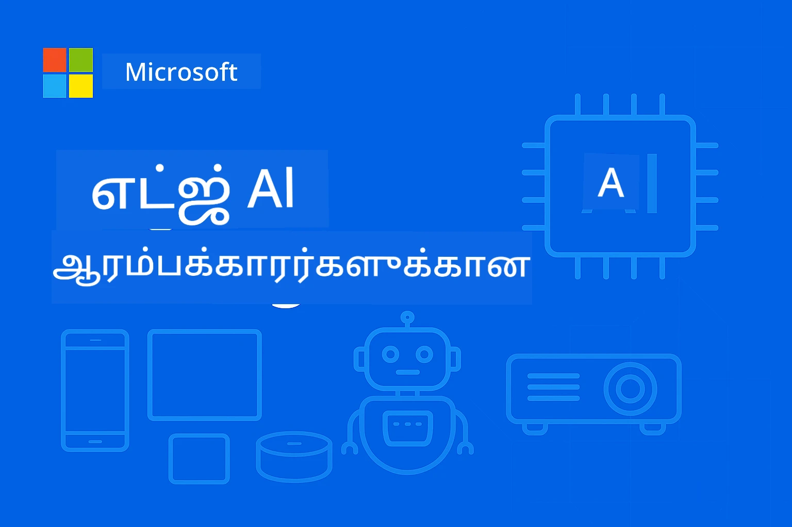

# EdgeAI ஆரம்பக்காரர்களுக்காக  




[](https://GitHub.com/microsoft/edgeai-for-beginners/graphs/contributors)
[](https://GitHub.com/microsoft/edgeai-for-beginners/issues)
[](https://GitHub.com/microsoft/edgeai-for-beginners/pulls)
[](http://makeapullrequest.com)

[](https://GitHub.com/microsoft/edgeai-for-beginners/watchers)
[](https://GitHub.com/microsoft/edgeai-for-beginners/fork)
[](https://GitHub.com/microsoft/edgeai-for-beginners/stargazers)


[](https://discord.gg/nTYy5BXMWG)

இந்த வளங்களைப் பயன்படுத்தத் தொடங்க இந்த படிகளை பின்பற்றவும்:

1. **களஞ்சியத்தை Fork செய்யவும்**: Click [](https://GitHub.com/microsoft/edgeai-for-beginners/fork)
2. **களஞ்சியத்தை கிளோன் செய்யவும்**:   `git clone https://github.com/microsoft/edgeai-for-beginners.git`
3. [**Azure AI Foundry Discord இல் சேர்ந்து நிபுணர்களையும் இணைந்துள்ள டெவலப்பர்களையும் சந்திக்கவும்**](https://discord.com/invite/ByRwuEEgH4)


### 🌐 பல மொழி ஆதரவு

#### GitHub Action மூலம் ஆதர்க்கப்பட்டது (சுயமடிப்பு மற்றும் எப்போதும் புதுப்பிக்கப்பட்டது)

<!-- CO-OP TRANSLATOR LANGUAGES TABLE START -->
[Arabic](../ar/README.md) | [Bengali](../bn/README.md) | [Bulgarian](../bg/README.md) | [Burmese (Myanmar)](../my/README.md) | [Chinese (Simplified)](../zh-CN/README.md) | [Chinese (Traditional, Hong Kong)](../zh-HK/README.md) | [Chinese (Traditional, Macau)](../zh-MO/README.md) | [Chinese (Traditional, Taiwan)](../zh-TW/README.md) | [Croatian](../hr/README.md) | [Czech](../cs/README.md) | [Danish](../da/README.md) | [Dutch](../nl/README.md) | [Estonian](../et/README.md) | [Finnish](../fi/README.md) | [French](../fr/README.md) | [German](../de/README.md) | [Greek](../el/README.md) | [Hebrew](../he/README.md) | [Hindi](../hi/README.md) | [Hungarian](../hu/README.md) | [Indonesian](../id/README.md) | [Italian](../it/README.md) | [Japanese](../ja/README.md) | [Kannada](../kn/README.md) | [Korean](../ko/README.md) | [Lithuanian](../lt/README.md) | [Malay](../ms/README.md) | [Malayalam](../ml/README.md) | [Marathi](../mr/README.md) | [Nepali](../ne/README.md) | [Nigerian Pidgin](../pcm/README.md) | [Norwegian](../no/README.md) | [Persian (Farsi)](../fa/README.md) | [Polish](../pl/README.md) | [Portuguese (Brazil)](../pt-BR/README.md) | [Portuguese (Portugal)](../pt-PT/README.md) | [Punjabi (Gurmukhi)](../pa/README.md) | [Romanian](../ro/README.md) | [Russian](../ru/README.md) | [Serbian (Cyrillic)](../sr/README.md) | [Slovak](../sk/README.md) | [Slovenian](../sl/README.md) | [Spanish](../es/README.md) | [Swahili](../sw/README.md) | [Swedish](../sv/README.md) | [Tagalog (Filipino)](../tl/README.md) | [Tamil](./README.md) | [Telugu](../te/README.md) | [Thai](../th/README.md) | [Turkish](../tr/README.md) | [Ukrainian](../uk/README.md) | [Urdu](../ur/README.md) | [Vietnamese](../vi/README.md)

> **உறுப்பிடத்தை உள்ளூர் பாதுகாப்பாக கிளோன் செய்ய விரும்புகிறீர்களா?**

> இந்த களஞ்சியத்தில் 50+ மொழி மொழிபெயர்ப்புகள் உள்ளன, அவை பதிவிறக்கத்தின் அளவை மிக அதிகரிக்கின்றன. மொழிபெயர்ப்புகள் இல்லாமல் கிளோன் செய்ய sparse checkout ஐ பயன்படுத்தவும்:
> ```bash
> git clone --filter=blob:none --sparse https://github.com/microsoft/edgeai-for-beginners.git
> cd edgeai-for-beginners
> git sparse-checkout set --no-cone '/*' '!translations' '!translated_images'
> ```
> இது பாடநெறியை நிறைவேற்ற நீங்கள் தேவையான எல்லாவற்றையும் விரைவான பதிவிறக்கத்துடன் வழங்குகிறது.
<!-- CO-OP TRANSLATOR LANGUAGES TABLE END -->

**மேலும் மொழிபெயர்ப்புகள் ஆதரவு விரும்பினால் இங்கு பட்டியலிடப்பட்டுள்ளன [here](https://github.com/Azure/co-op-translator/blob/main/getting_started/supported-languages.md)**

## அறிமுகம்

**EdgeAI for Beginners** இற்கு வரவேற்கிறோம் – உங்கள் பரிணத்த Edge செயற்கை நுண்ணறிவின் மாற்றத்திற்கான விரிவான பயணம். இந்த பாடநெறி சக்திவாய்ந்த AI திறன்களுக்கும், பாரபட்சமற்றப்பட்ட, செயல்பாட்டுக்கு தயாரான எட்ஜ் சாதனங்களில் நேரடியாக AIயை பயன்படுத்தும் திறந்த இடத்திற்கும் இடைவெளியை நிரப்புகிறது.

### நீங்கள் தேர்ச்சிபெறும் கருவிகள்

இந்த பாடநெறி அடிப்படைக் கருத்துக்களில் இருந்து தொடங்கி தயாரிப்பு-தயாரான அமல்களுக்குக் கொண்டு செல்கிறது, அதில்:
- **சிறிய மொழி மாதிரிகள் (SLMs)** எட்ஜ் பயன்பாட்டுக்கு உகந்தவை
- **பாதுகாப்பு நுட்ப அஞ்சல்பு** பல்வேறு தளம் இயக்கங்களுக்கான
- **நேரடி முடிவெடுப்பு** தனிமனிதக்குரியதையும் பாதுகாக்கும் வசதிகளுடன்
- **தயாரிப்பில் இயக்குதல்** பொது வணிக பயன்பாடுகளுக்கான

### ஏன் EdgeAI அவசியம்?

Edge AI என்பது முக்கிய காலத்தின் சவால்களைச் சமாளிக்கும் ஒரு முறை மாற்றம்:
- **தனியுரிமை & பாதுகாப்பு**: மெகா கணினி முலமாக அல்லாமல் உள்ளூர் தரவுகளை செயலாக்குக
- **நேரடி செயல்பாடு**: காலம் முக்கியமான செயலிகளுக்கான நெட்வொர்க் தாமதத்தை நீக்குக
- **செலவு திறன்**: வலையமைப்பு மற்றும் மேக கணினியியல் செலவுகளை குறைக்க
- **திறம்பட செயல்பாடு**: நெட்வொர்க் துண்டிப்பின் போது செயல்திறன் பேணுக
- **முறை தவறான காவல்**: தரவு அதிகாரப்பூர்வ நிலைத்தன்மையை பூர்த்தி செய்க

### எட்ஜ் AI

எட்ஜ் AI என்பது பகுப்பாய்வுக்கான AI நுண்ணறிவுகளையும் மொழி மாதிரிகளையும் நேரடியாக உள்ளூரில் இயக்குவதோடு தொடர்புடையது, அதாவது தரவு உருவாகும் இடத்தில் மேக வளங்களைப் பொறுத்து அல்லாது இயங்குகிறது. இது தாமதத்தை குறைத்து தனியுரிமையை மேம்படுத்தி நேரடி முடிவெடுப்பு வழங்குகிறது.

### முக்கியக் கொள்கைகள்:
- **உள்ளூர் தரவு ஆய்வு**: AI மாதிரிகள் எட்ஜ் சாதனங்களில் (மொபைல்கள், ரூட்டர்கள், மைக்ரோகண்ட்ரோலர்கள், தொழில்துறை கணினிகள்) இயங்குகின்றன
- **இணைய இணைப்பு இல்லாது இயங்கு திறன்**: தொடர்ந்து இணைய இணைப்பு இல்லாமலேயே இயங்குதல்
- **குறைந்த தாமதம்**: நேரடி முறைமைகளுக்கு உடனடி பதில்கள்
- **தரவு அதிகாரம்**: விரும்பிய மற்றும் பாதுகாப்பான உள்ளூர் தரவுத்தளத்தைக் காப்பது

### சிறிய மொழி மாதிரிகள் (SLMs)

Phi-4, Mistral-7B, மற்றும் Gemma போன்ற SLMகள் பெரும் LLMகளுக்கு குறைக்கப்பட்ட பதிப்புகள்—பயிற்சி அல்லது சுருக்கப்பட்ட அவற்றுக்கு:
- **குறைந்த நினைவக பயன்பாடு**: குறைந்த நினைவக வசதிக்கான சிறப்பு
- **குறைந்த கணினிக் கோரிக்கை**: CPU மற்றும் எட்ஜ் GPUக்கு உகந்த செயல்திறன்
- **விரைவான துவக்க நேரங்கள்**: உடனடித் பயன்பாட்டு துவக்கத்துக்கான

இவை சக்திவாய்ந்த மொழி செயலாக்க திறன்களை வெளிப்படுத்துகின்றன மேலும் பின்வருமாறு:
- **எம்பெடிட் சிஸ்டங்கள்**: IoT சாதனங்கள் மற்றும் தொழிற்சாலை கட்டுப்படுத்திகள்
- **மொபைல் சாதனங்கள்**: இணைய verbindல் இல்லாமல் இயங்கும் ஸ்மார்ட்போன்கள், டெப்லட்கள்
- **IoT சாதனங்கள்**: கொண்டாட்டச் சாதனங்கள் மற்றும் குறைந்த வளங்கள் கொண்ட சாமான்கள்
- **எட்ஜ் சர்வர்கள்**: GPU வளங்கள் குறைந்த உள்ளூர் கையாளல்கள்
- **தனிப்பட்ட கணினிகள்**: டெஸ்க்டாப்கள் மற்றும் லேப்டாப் தயாரிப்பு பயன்பாடுகள்

## பாடநெறி தொகுதிகள் மற்றும் வழிசெலுத்தல்

| தொகுதி | தலைப்பு | கவனம் செலுத்தும் பகுதி | முக்கிய உள்ளடக்கம் | மட்டம் | கால அளவு |
|--------|-------|------------|-------------|--------|----------|
| [📖 00 ](./introduction.md) | [EdgeAI அறிமுகம்](./introduction.md) | அடிக்கடி மற்றும் சூழல் | EdgeAI அவலோக்கம் • தொழில் பயன்பாடுகள் • SLM அறிமுகம் • கற்றல் இலக்குகள் | ஆரம்பம் | 1-2 மணி |
| [📚 01](../../Module01) | [EdgeAI அடித்தளம்](./Module01/README.md) | மேகம் vs எட்ஜ் AI ஒப்பீடு | EdgeAI அடித்தளம் • நிஜ உலக மேலாண்மைகள் • அமலாக்க வழிகாட்டி • எட்ஜ் விண்ணப்பம் | ஆரம்பம் | 3-4 மணி |
| [🧠 02](../../Module02) | [SLM மாதிரி அடித்தளங்கள்](./Module02/README.md) | மாதிரி குடும்பங்கள் & கட்டமைப்பு | Phi குடும்பம் • Qwen குடும்பம் • Gemma குடும்பம் • BitNET • μModel • Phi-Silica | ஆரம்பம் | 4-5 மணி |
| [🚀 03](../../Module03) | [SLM விண்ணப்ப பயிற்சி](./Module03/README.md) | உள்ளூர் & மேகம் அமல்படுத்தல் | மேம்பட்ட கற்றல் • உள்ளூர் சூழல் • மேகம் விண்ணப்பம் | நடுத்தரம் | 4-5 மணி |
| [⚙️ 04](../../Module04) | [மாதிரி நேர்முகப்படுத்தல் கருவி தொகுதி](./Module04/README.md) | குறுக்கு தளம் நேர்முகப்படுத்தல் | அறிமுகம் • Llama.cpp • Microsoft Olive • OpenVINO • Apple MLX • பணிசெறிவு இணைப்பு | நடுத்தரம் | 5-6 மணி |
| [🔧 05](../../Module05) | [SLMOps தயாரிப்பு](./Module05/README.md) | தயாரிப்பு இயக்கங்கள் | SLMOps அறிமுகம் • மாதிரி சுருக்கம் • நுணுக்கம் • தயாரிப்பு விண்ணப்பம் | மேம்பட்ட | 5-6 மணி |
| [🤖 06](../../Module06) | [AI முகவர்கள் & செயல்பாட்டு அழைப்பு](./Module06/README.md) | முகவர் கட்டமைப்புகள் & MCP | முகவர் அறிமுகம் • செயல்பாட்டு அழைப்பு • மாதிரி சூழல் நெறிமுறை | மேம்பட்ட | 4-5 மணி |
| [💻 07](../../Module07) | [தளம் செயல்படுத்தல்](./Module07/README.md) | குறுக்கு தளம் மாதிரிகள் | AI கருவி தொகுதி • Foundry உள்ளூர் • விண்டோஸ் மேம்பாடு | மேம்பட்ட | 3-4 மணி |
| [🏭 08](../../Module08) | [Foundry உள்ளூர் கருவி தொகுதி](./Module08/README.md) | தயாரிப்பு-தயாரான மாதிரிகள் | மாதிரி பயன்பாடுகள் (தகவல்கள் கீழே) | நிபுணர் | 8-10 மணி |

### 🏭 **தொகுதி 08: மாதிரி பயன்பாடுகள்**

- [01: REST அரட்டை துவக்கம்](./Module08/samples/01/README.md)
- [02: OpenAI SDK இணைப்பு](./Module08/samples/02/README.md)
- [03: மாதிரி கண்டுபிடிப்பு & நிலைமுறை மதிப்பீடு](./Module08/samples/03/README.md)
- [04: Chainlit RAG பயன்பாடு](./Module08/samples/04/README.md)
- [05: பன்முக முகவர் ஒருங்கிணைப்பு](./Module08/samples/05/README.md)
- [06: கருவியாக மாதிரிகள் ரூட்டர்](./Module08/samples/06/README.md)
- [07: நேரடி API கிளையன்ட்](./Module08/samples/07/README.md)
- [08: விண்டோஸ் 11 அரட்டை பயன்பாடு](./Module08/samples/08/README.md)
- [09: மேம்பட்ட பன்முக முகவர் முறைமை](./Module08/samples/09/README.md)
- [10: Foundry கருவி கட்டமைப்பு](./Module08/samples/10/README.md)

### 🎓 **ஊர்வலம்: கையால் கற்றல் பாதை**

தயாரிப்பு-தயாரான நிறைவேற்றத்துடன் முழுமையான கையால் பணிச்சாலைப் பொருட்கள்:

- **[ஊர்வலம் வழிகாட்டி](./Workshop/Readme.md)** - முழுமையான கற்றல் நோக்கங்கள், முடிவுகள் மற்றும் வள வழிசெலுத்தல்
- **Python மாதிரிகள்** (6 சிறப்புப் பிரிவுகள்) - சிறந்த நடைமுறைகள், பிழை கையாளல் மற்றும் விரிவான ஆவணங்கள்
- **Jupyter குறியீட்டு புத்தகங்கள்** (8 நிகழ்கால) - படி படியாக பயிற்சிகள், நிலைத்தன்மை மற்றும் செயல்திறன் கண்காணிப்பு
- **பிரிவு வழிகாட்டிகள்** - ஒவ்வொரு ஊர்வலம் பிரிவுக்கும் விரிவான மார்க்டவுன் வழிகாட்டிகள்
- **சரிபார்ப்பு கருவிகள்** - குறியீட்டு தர நற்செய்திகளுக்கு ஸ்கிரிப்ட்கள் மற்றும் புகை சோதனைகள்

**நீங்கள் உருவாக்கப்போகும்:**
- உள்ளூர் AI அரட்டை பயன்பாடுகள் திறந்த வழிநடத்தல் உடன்
- RAG குழாய் பயன்பாடுகள் தர மதிப்பீடு உடன் (RAGAS)
- பன்முக மாதிரி நிலைமுறை மதிப்பீடு மற்றும் ஒப்பீட்டுக் கருவிகள்
- பன்முக முகவர் ஒருங்கிணைப்பு முறைமைகள்
- பணிகளுக்கான தேர்வுடன் நுண்ணறியும் மாதிரி வழிசெலுத்தல்

### 🎙️ **முகவருக்கான ஊர்வலம்: கையால் கற்றல் - The AI Podcast Studio**

முழுமையான பல முகவர் முறைமையை உருவாக்கி AI இயக்கப்பட்ட போட்காஸ்ட் உற்பத்தி குழாயை ஆரம்ப நிலைდან கட்டியெழுப்புங்கள்! இந்த ஆழ்ந்த ஊர்வலம் உங்கள் ஐடியாக்களை தொழில்முறை போட்காஸ்ட் பரிவுகளாக மாற்ற கற்றுக்கொடுக்கிறது.
**[🎬 AI பოდ்காஸ்ட் ஸ்டுடியோ பணிக்கூட முறையீடு தொடங்கு](./WorkshopForAgentic/README.md)**

**உங்கள் பணி**: "Future Bytes" என்ற செம்மொழிச் செயலாளர்களால் இயக்கப்படும் தொழில்நுட்பப் பოდ்காஸ்ட் ஒன்றை முழுமையாக உங்கள் இயந்திரத்தில் உள்ளே இயங்கவைக்கவும். மேகத் தொழில்நுட்ப அனுமதிகள் இல்லை, API செலவுகள் இல்லை — எல்லாம் உங்கள் கணினியில் உள்ளே இயங்கும்.

**இதன் தனிச்சிறப்பு என்ன:**
- **🤖 உண்மையான பல-செயலாளர் ஒருங்கிணைப்பு** - ஆராய்ச்சி செய்யும், எழுதும் மற்றும் ஒலிப்பதிவை உருவாக்கும் சிறப்பு AI செயலாளர்களை உருவாக்குங்கள்
- **🎯 முழுமையான உற்பத்தி நரம்பமைப்பு** - தலைப்புப் தேர்விலிருந்து இறுதி பოდ்காஸ்ட் ஒலிவரை
- **💻 100% உள்ளூர் நடைமுறை** - முழு தனியுரிமை மற்றும் கட்டுப்பாட்டிற்காக Ollama மற்றும் உள்ளூரான மாதிரிகள் (Qwen-3-8B) பயன்படுத்துகிறது
- **🎤 உரைப்பதிவில் மாற்றும் ஒருங்கிணைப்பு** - உரைகளை இயல்பான பல-பேச்சாளர் உரையாடலாக மாற்றுகிறது
- **✋ மனிதர் தொடர்ந்து கொள்கை செயல்பாடுகள்** - உறுதிப்படுத்தும் கட்டங்கள் தானியக்கத்துடனும் தரத்தை பேணுகின்றன

**மூன்று அங்குடைய கற்றல் பயணம்:**

| அங்கு | கவனம் | முக்கிய திறன்கள் | கால அளவு |
|-------|--------|---------------|----------|
| **[அங்கு 1: உங்கள் AI உதவியாளர்களை சந்திக்கவும்](./WorkshopForAgentic/md/01.BuildAIAgentWithSLM.md)** | உங்கள் முதலாவது AI செயலாளரை உருவாக்கவும் | கருவி ஒருங்கிணைப்பு • வலைத் தேடல் • பிரச்சனை தீர்ப்பு • агентிக கருத்து | 2-3 மணி |
| **[அங்கு 2: உற்பத்தி அணியை சேர்க்கவும்](./WorkshopForAgentic/md/02.AIAgentOrchestrationAndWorkflows.md)** | பல செயலாளர்களை ஒருங்கிணைக்கவும் | குழு ஒத்துழைப்பு • ஒப்புதல்கள் • DevUI இடைமுகம் • மனித பராமரிப்பு | 3-4 மணி |
| **[அங்கு 3: உங்கள் பொட்காஸ்டை உயிரூட்டுங்கள்](./WorkshopForAgentic/md/03.Multi-SpeakerPodcastGenerationWithVibeVoice.md)** | புட்காஸ్ట్ ஒலியை உருவாக்கவும் | உரை-பொறி • பல-பேச்சாளர் உருவாக்கம் • நீண்ட இணைய ஒலி • முழுமையான தானியக்கத்தன்மை | 2-3 மணி |

**பயன்படுத்தப்படும் தொழில்நுட்பங்கள்:**
- **Microsoft Agent Framework** - பல செயலாளர் ஒருங்கிணைப்பு மற்றும் ஒத்துழைப்பு
- **Ollama** - உள்ளூர் AI மாதிரி இயக்கக் கருவி (மேகம் தேவை இல்லை)
- **Qwen-3-8B** - செயலாளர் பணிகளுக்கு சிறப்பித்த திறனுள்ள திறந்த மூல மொழி மாதிரி
- **உரை-பேச்சு APIகள்** - இயல்பான குரல் உருவாக்கம் புட்காஸ்ட் தயாரிப்பிற்கு

**இயந்திர ஆதரவு:**
- ✅ **CPU முறை** - எந்த நவீன கணினியிலும் இயங்கும் (8GB+ RAM பரிந்துரை செய்யப்படுகிறது)
- 🚀 **GPU விரைவு** - NVIDIA/AMD GPUகளுடன் வேகமான முன்னறிதல்
- ⚡ **NPU ஆதரவு** - அடுத்த தலைமுறையுடைய நரம்பியல் செயலாக்க அ...


**மிகச் சிறந்தது:**
- பல-செயலாளர் AI அமைப்புகளை கற்கும் டெவலப்பர்கள்
- AI தானியக்கத்தை மற்றும் வேலைநடவடிக்கைகளை ஆர்வமுள்ளவர்கள்
- AI உதவியுடன் உருவாக்கும் உள்ளடக்க தயாரிப்பாளர்கள்
- நடைமுறை AI ஒருங்கிணைப்பு முறைமைகள் கற்கும் மாணவர்கள்

**உருவாக ஆரம்பிக்கவும்**: [🎙️ AI புட்காஸ்ட் ஸ்டுடியோ பணிக்கூடத்திற்கு →](./WorkshopForAgentic/README.md)

### 📊 **கற்றல் பாதை சுருக்கம்**
- **மொத்த காலம்**: 36-45 மணி
- **தொடக்க நிலை**: தொகுதிகள் 01-02 (7-9 மணி)  
- **மத்திய நிலை**: தொகுதிகள் 03-04 (9-11 மணி)
- **மேம்பட்ட நிலை**: தொகுதிகள் 05-07 (12-15 மணி)
- **திறமை வாய்ந்த பாதை**: தொகுதி 08 (8-10 மணி)

## நீங்கள் உருவாக்கப்போகும் பொருள்

### 🎯 முக்கிய திறன்கள்
- **ஏஜ் AI கட்டமைப்பு**: மேக ஒருங்கிணைப்புடன் உள்ளூர் முதன்மையான AI அமைப்புகளை வடிவமைக்கவும்
- **மாதிரி மேம்படுத்தல்**: ஏஜ் நடைமுறைக்கு மாதிரிகளை அளவிடல் மற்றும் சுருக்குதல் (85% வேக மேம்பாடு, 75% அளவு குறைவு)
- **பல மேடையமைப்பில் நடைமுறை**: விண்டோஸ், மொபைல், செருகி, மேக-ஏஜ் கலப்பு அமைப்புகள்
- **உற்பத்தி இயங்குதளம்**: கண்காணிப்பு, அளவீர்த்தல் மற்றும் ஏஜ் AIயை பராமரித்தல்

### 🏗️ நடைமுறை திட்டங்கள்
- **Foundry உள்ளூர் செயலி**: மாதிரி பரிமாற்றம் கொண்ட விண்டோஸ் 11 செயலி
- **பல-செயலாளர் அமைப்புகள்**: சிறப்பு செயலாளர்களுடன் ஒருங்கிணைப்பாளர் குழு  
- **RAG பயன்பாடுகள்**: உள்ளூர் ஆவண செயலாக்கம் மற்றும் வெக்டர் தேடல்
- **மாதிரி வழிமுறைகள்**: பணிகளின் பகுப்பாய்வின்படி மாதிரிகளை செல்வாக்கு கொண்ட தேர்வு
- **API அமைப்புகள்**: ஸ்ட்ரீமிங் மற்றும் உடல் முன்னணி கண்காணிப்புடன் தயாரிப்புக்கான கிளையன்கள்
- **பல மேடையமைப்புக் கருவிகள்**: LangChain/Semantic Kernel ஒருங்கிணைப்பு முறைமைகள்

### 🏢 தொழில் பயன்பாடுகள்
**உற்பத்தி** • **சுகாதாரம்** • **தானியங்கி வாகனங்கள்** • **நுண்ணகரங்கள்** • **மொபைல் செயலிகள்**

## விரைவு தொடக்கம்

**பரிந்துரைக்கப்பட்ட கற்றல் பாதை** (மொத்தம் 20-30 மணி):

0. **📖 அறிமுகம்** ([Introduction.md](./introduction.md)): EdgeAI அடித்தளம் + தொழில் சூழல் + கற்றல் கட்டமைப்பு
1. **📚 அடித்தளம்** (தொகுதிகள் 01-02): EdgeAI கருத்துக்கள் + SLM மாதிரி குடும்பங்கள்
2. **⚙️ மேம்படுத்தல்** (தொகுதிகள் 03-04): நடைமுறை + அளவிடல் கட்டமைப்புகள்  
3. **🚀 உற்பத்தி** (தொகுதிகள் 05-06): SLMOps + AI செயலாளர்கள் + செயலி அழைப்பு
4. **💻 செயல்படுத்தல்** (தொகுதிகள் 07-08): மேடை மாதிரிகள் + Foundry உள்ளூர் கருவிப்பெட்டி

ஒவ்வொரு தொகுதியும் சித்தாந்தம், கைபயிற்சி, மற்றும் தயாரிப்பு தயாரான குறியீட்டு மாதிரிகளை கொண்டுள்ளது.

## தொழில் தாக்கம்

**தொழில்நுட்ப பங்குகள்**: EdgeAI தீர்வாளராக வடிவமைப்பாளர் • ML இன்ஜினியர் (Edge) • IoT AI டெவலப்பர் • மொபைல் AI டெவலப்பர்

**தொழில் துறைகள்**: உற்பத்தி 4.0 • சுகாதார தொழில்நுட்பம் • தானியங்கி அமைப்புகள் • நிதி தொழில்நுட்பம் • பயனர் எலக்ட்ராணிக்ஸ்

**போர்ட்ஃபோலியோ திட்டங்கள்**: பல-செயலாளர் அமைப்புகள் • உற்பத்தி RAG செயலிகள் • பல மேடையில் நடைமுறை • செயல்திறன் மேம்படுத்தல்

## சக்தி அமைப்பு

```
edgeai-for-beginners/
├── 📖 introduction.md  # Foundation: EdgeAI Overview & Learning Framework
├── 📚 Module01-04/     # Fundamentals → SLMs → Deployment → Optimization  
├── 🔧 Module05-06/     # SLMOps → AI Agents → Function Calling
├── 💻 Module07/        # Platform Samples (VS Code, Windows, Jetson, Mobile)
├── 🏭 Module08/        # Foundry Local Toolkit + 10 Comprehensive Samples
│   ├── samples/01-06/  # Foundation: REST, SDK, RAG, Agents, Routing
│   └── samples/07-10/  # Advanced: API Client, Windows App, Enterprise Agents, Tools
├── 🌐 translations/    # Multi-language support (8+ languages)
└── 📋 STUDY_GUIDE.md   # Structured learning paths & time allocation
```

## பாடநெறி முக்கிய அம்சங்கள்

✅ **மேம்பட்ட கற்றல்**: சித்தாந்தம் → நடைமுறை → உற்பத்தி நடைமுறை  
✅ **உண்மையான வழக்குகள் ஆய்வு**: மைக்ரோசாஃப்ட், ஜப்பான் ஏர்லைன்ஸ், நிறுவன பயன்பாடுகள்  
✅ **கைபயிற்சி மாதிரிகள்**: 50+ உதாரணங்கள், 10 விரிவான Foundry உள்ளூர் டெமோக்கள்  
✅ **செயல்திறன் கவனம்**: 85% வேக மேம்பாடு, 75% அளவு குறைவு  
✅ **பல மேடை**: விண்டோஸ், மொபைல், செருகி, மேக-ஏஜ் கலவையுடன்  
✅ **உற்பத்தி தயாராக**: கண்காணிப்பு, அளவீர், பாதுகாப்பு, சீர்திருத்த கட்டமைப்புகள்

📖 **[படித்தல் வழிகாட்டி கிடைக்கிறது](STUDY_GUIDE.md)**: நேரம் ஒதுக்கீடு வழிகாட்டல் மற்றும் சுய மதிப்பீட்டு கருவிகள் கொண்ட கட்டமைக்கப்பட்ட 20 மணி கற்றல் பாதை.

---

**EdgeAI என்பது AI நடைமுறையின் எதிர்காலம்**: உள்ளூர் முதன்மை, தனியுரிமை பாதுகாப்பு மற்றும் திறமையானது. இந்த திறன்களை கற்குங்கள் எதிர்கால அறிவு செயலிகளை உருவாக்க.

## மற்ற பாடநெறிகள்

எங்கள் குழு மற்ற பாடநெறிகளையும் வழங்குகிறது! பாருங்கள்:

<!-- CO-OP TRANSLATOR OTHER COURSES START -->
### LangChain
[](https://aka.ms/langchain4j-for-beginners)
[](https://aka.ms/langchainjs-for-beginners?WT.mc_id=m365-94501-dwahlin)
[](https://github.com/microsoft/langchain-for-beginners?WT.mc_id=m365-94501-dwahlin)
---

### Azure / Edge / MCP / Agents
[](https://github.com/microsoft/AZD-for-beginners?WT.mc_id=academic-105485-koreyst)
[](https://github.com/microsoft/edgeai-for-beginners?WT.mc_id=academic-105485-koreyst)
[](https://github.com/microsoft/mcp-for-beginners?WT.mc_id=academic-105485-koreyst)
[](https://github.com/microsoft/ai-agents-for-beginners?WT.mc_id=academic-105485-koreyst)

---
 
### உருவாக்கும் AI தொடர்
[](https://github.com/microsoft/generative-ai-for-beginners?WT.mc_id=academic-105485-koreyst)
[-9333EA?style=for-the-badge&labelColor=E5E7EB&color=9333EA)](https://github.com/microsoft/Generative-AI-for-beginners-dotnet?WT.mc_id=academic-105485-koreyst)
[-C084FC?style=for-the-badge&labelColor=E5E7EB&color=C084FC)](https://github.com/microsoft/generative-ai-for-beginners-java?WT.mc_id=academic-105485-koreyst)
[-E879F9?style=for-the-badge&labelColor=E5E7EB&color=E879F9)](https://github.com/microsoft/generative-ai-with-javascript?WT.mc_id=academic-105485-koreyst)

---
 
### முக்கியக் கற்றல்
[](https://aka.ms/ml-beginners?WT.mc_id=academic-105485-koreyst)
[](https://aka.ms/datascience-beginners?WT.mc_id=academic-105485-koreyst)
[](https://aka.ms/ai-beginners?WT.mc_id=academic-105485-koreyst)
[](https://github.com/microsoft/Security-101?WT.mc_id=academic-96948-sayoung)
[](https://aka.ms/webdev-beginners?WT.mc_id=academic-105485-koreyst)
[](https://aka.ms/iot-beginners?WT.mc_id=academic-105485-koreyst)
[](https://github.com/microsoft/xr-development-for-beginners?WT.mc_id=academic-105485-koreyst)

---
 
### உதவியாளர் தொடர்
[](https://aka.ms/GitHubCopilotAI?WT.mc_id=academic-105485-koreyst)
[](https://github.com/microsoft/mastering-github-copilot-for-dotnet-csharp-developers?WT.mc_id=academic-105485-koreyst)
[](https://github.com/microsoft/CopilotAdventures?WT.mc_id=academic-105485-koreyst)
<!-- CO-OP TRANSLATOR OTHER COURSES END -->

## உதவி பெறுதல்

நீங்கள் சிக்கியபோது அல்லது AI பயன்பாடுகளை உருவாக்குவதில் ஏதேனும் கேள்விகள் இருந்தால், சேரவும்:

[](https://discord.gg/nTYy5BXMWG)

உற்பத்தித் தரப்படுத்தல் அல்லது பிழைகள் இருந்தால், உருவாக்கும் போது பார்வையிடவும்:

[](https://aka.ms/foundry/forum)

---

<!-- CO-OP TRANSLATOR DISCLAIMER START -->
**மறுப்பு**:  
இந்த ஆவணம் AI மொழிபெயர்ப்பு சேவையான [Co-op Translator](https://github.com/Azure/co-op-translator) மூலம் மொழிபெயர்க்கப்பட்டுள்ளது. நாங்கள் சரியானதற்காக முயற்சி செய்தாலும், தானாக தேடும் மொழிபெயர்ப்புகளில் பிழைகள் அல்லது தவறுகள் இருக்க வாய்ப்பு உள்ளது என்பதை தயவுசெய்து கருத்தில் கொள்ளவும். தாய்மொழியில் உள்ள அசல் ஆவணம் அதிகாரப்பூர்வ மூலமாகக் கருதப்பட வேண்டும். முக்கியமான தகவல்களுக்கு, தொழில்நுட்ப மனித மொழிபெயர்ப்பாளரின் சேவை பரிந்துரைக்கப்படுகிறது. இந்த மொழிபெயர்ப்பைப் பயன்படுத்தியதில் ஏற்படும் எதுபோன்ற தவறான புரிதல்கள் அல்லது தவறான விளக்கங்களுக்கு நாங்கள் பொறுப்பில்லை.
<!-- CO-OP TRANSLATOR DISCLAIMER END -->