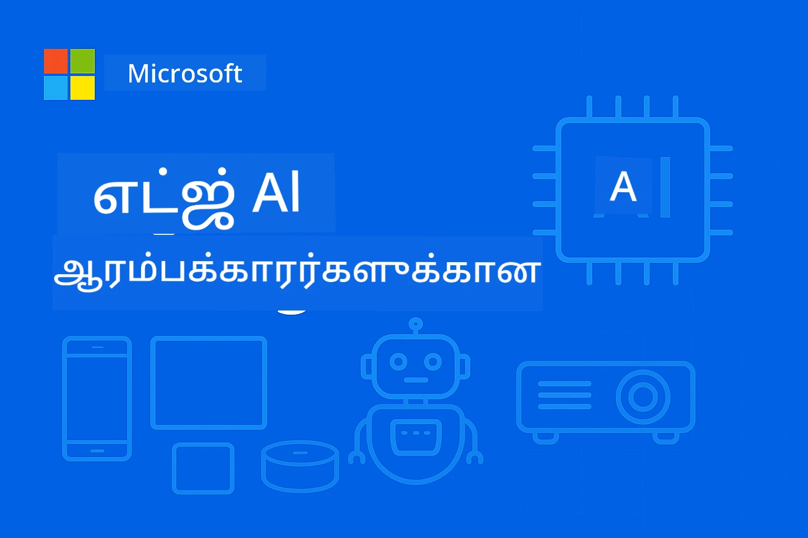

# ஆரம்பர்களுக்கு எட்ஜ்ஏஐ 




[](https://GitHub.com/microsoft/edgeai-for-beginners/graphs/contributors)
[](https://GitHub.com/microsoft/edgeai-for-beginners/issues)
[](https://GitHub.com/microsoft/edgeai-for-beginners/pulls)
[](http://makeapullrequest.com)

[](https://GitHub.com/microsoft/edgeai-for-beginners/watchers)
[](https://GitHub.com/microsoft/edgeai-for-beginners/fork)
[](https://GitHub.com/microsoft/edgeai-for-beginners/stargazers)


[](https://discord.gg/nTYy5BXMWG)

இந்த வளங்களை பயன்படுத்த தொடங்க இதை பின்பற்றவும்:

1. **சொதுக்ககையானதை Fork செய்யவும்**: கிளிக் செய்யவும் [](https://GitHub.com/microsoft/edgeai-for-beginners/fork)
2. **சொதுக்ககையானதை Clone செய்யவும்**:   `git clone https://github.com/microsoft/edgeai-for-beginners.git`
3. [**Azure AI Foundry Discord இல் இணைந்து நிபுணர்களையும் சக உருவாக்குனர்களையும் சந்திக்கவும்**](https://discord.com/invite/ByRwuEEgH4)


### 🌐 பன்மொழி ஆதரவு

#### GitHub செயலி மூலம் ஆதரிக்கப்படுகிறது (தானியங்கி மற்றும் எப்போதும் புதுப்பிக்கப்பட்டவை)

<!-- CO-OP TRANSLATOR LANGUAGES TABLE START -->
[அரபி](../ar/README.md) | [பெங்காலி](../bn/README.md) | [பல்கேரியன்](../bg/README.md) | [பிருமீஸ் (மியான்மர்)](../my/README.md) | [சீனம் (சரளப்படுத்தப்பட்டது)](../zh-CN/README.md) | [சீனம் (சம்பிரதாய, ஹொங்கொங்)](../zh-HK/README.md) | [சீனம் (சம்பிரதாய, மகாவ்)](../zh-MO/README.md) | [சீனம் (சம்பிரதாய, தைவான்)](../zh-TW/README.md) | [குரோஷியன்](../hr/README.md) | [செக்](../cs/README.md) | [டேனிஷ்](../da/README.md) | [நெதர்லாந்து](../nl/README.md) | [எஸ்டோனியன்](../et/README.md) | [பின்னிஷ்](../fi/README.md) | [பிரெஞ்சு](../fr/README.md) | [ஜெர்மன்](../de/README.md) | [கிரேக்கம்](../el/README.md) | [ஹீப்ரூ](../he/README.md) | [இந்தி](../hi/README.md) | [ஹங்கேரியன்](../hu/README.md) | [இந்தோனேஷியன்](../id/README.md) | [இத்தாலியன்](../it/README.md) | [ஜப்பானியன்](../ja/README.md) | [கன்னடம்](../kn/README.md) | [க்மர்](../km/README.md) | [கொரியன்](../ko/README.md) | [லிதுவேனியன்](../lt/README.md) | [மலாய்](../ms/README.md) | [மலையாளம்](../ml/README.md) | [மராத்தி](../mr/README.md) | [நேபாளி](../ne/README.md) | [நைஜீரியன் பிட்கின்](../pcm/README.md) | [நார்வேஜியன்](../no/README.md) | [பெர்ஷியன் (தமிழ்நாடு)](../fa/README.md) | [போலிஷ்](../pl/README.md) | [போர்ச்சுகீஸ் (பிரேசில்)](../pt-BR/README.md) | [போர்ச்சுக்கீஸ் (போர்த்துகால்)](../pt-PT/README.md) | [பஞ்சாபி (குருமுகி)](../pa/README.md) | [ரோமானியன்](../ro/README.md) | [ரஷியன்](../ru/README.md) | [செர்பியன் (சிரிலிக்)](../sr/README.md) | [ஸ்லோவாக்](../sk/README.md) | [ஸ்லோவேனியன்](../sl/README.md) | [ஸ்பானிஷ்](../es/README.md) | [ஸ்வாஹிலி](../sw/README.md) | [ஸ்வீடிஷ்](../sv/README.md) | [டகாலோக் (பிலிப்பீனோ)](../tl/README.md) | [தமிழ்](./README.md) | [తెలుగు](../te/README.md) | [தை](../th/README.md) | [துருக்கிய](../tr/README.md) | [உக்ரைனியன்](../uk/README.md) | [உர்஦ு](../ur/README.md) | [வியட்நாமீசு](../vi/README.md)

> **உள்ளூரில் கிளோன் செய்வது விரும்புகிறீர்களா?**
>
> இந்த தரவுத்தொகுப்பில் 50+ மொழி மொழிபெயர்ப்புகள் உள்ளதால் பதிவிறக்கும் அளவு அதிகரிக்கிறது. மொழிபெயர்ப்புகள் இல்லாமல் கிளோன் செய்ய sparse checkout பயன்படுத்தவும்:
>
> **Bash / macOS / Linux:**
> ```bash
> git clone --filter=blob:none --sparse https://github.com/microsoft/edgeai-for-beginners.git
> cd edgeai-for-beginners
> git sparse-checkout set --no-cone '/*' '!translations' '!translated_images'
> ```
>
> **CMD (விண்டோஸ்):**
> ```cmd
> git clone --filter=blob:none --sparse https://github.com/microsoft/edgeai-for-beginners.git
> cd edgeai-for-beginners
> git sparse-checkout set --no-cone "/*" "!translations" "!translated_images"
> ```
>
> இது பாடநெறியை விரைவாக முடிக்க தேவையான அனைத்து விஷயங்களையும் வழங்கும்.
<!-- CO-OP TRANSLATOR LANGUAGES TABLE END -->

**மேலும் ஆதரவு மொழிகள் தேவையெனில் இங்கே பட்டியலிடப்பட்டுள்ளன [here](https://github.com/Azure/co-op-translator/blob/main/getting_started/supported-languages.md)**
## அறிமுகம்

**அடங்கிக் கட்டுரை - EdgeAI for Beginners** – மாற்றம் ஏற்படுத்தும் எட்ஜ் செயற்கை நுண்ணறிவின் உலகிற்கு உங்களின் விரிவான பயணம். இந்த பாடநெறி சக்திவாய்ந்த AI திறன்களுக்கும் நேரடி, உலகத்தை தொடும் எட்ஜ் சாதனங்களில் நடைமுறை பயன்பாட்டுக்கும் இடையிலான இடைவெளியை நிரப்புகிறது, AI இன் திறன்களை அதன் தரவு உருவாகும் இடத்திலேயே மற்றும் முடிவுகள் எடுக்கப்படும் இடத்திலேயே நேரடியாக பயன்படுத்த உங்களை சக்திவாய்ப்பது.

### நீங்கள் கற்றுக்கொள்ளப்போகும் விஷயங்கள்

இந்த பாடநெறி அடிப்படை கருத்துக்களிலிருந்து தயாரிப்பு நிலை நடைமுறைகளுக்கு எடுத்துச் சென்றுள்ளது, இதில்:
- **எட்ஜ் பயன்பாட்டிற்கு சிறிய மொழி மாதிரிகள் (SLMs)**
- **பல்வகை சாதனங்களில் हार்ட்வேரைப் பொறுத்து மேம்படுத்துதல்**
- **தனியுரிமையை பாதுகாத்து நேரடியாக முன்னறிவிப்பு**
- **உற்பத்தி முறையில் பயன்பாட்டு திட்டங்கள்**

### ஏன் EdgeAI முக்கியம்

Edge AI என்பது முக்கிய சவால்களை வலியுறுத்தும் ஒரு மெழுகு மாறுதலைக் குறிக்கிறது:
- **தனியுரிமை மற்றும் பாதுகாப்பு**: மேகவலை பகிராமல் உள்ளூரில் நுண்ணறிவைக் கையாளுதல்
- **நேரடியாக செயல்திறன்**: நேரத்திற்கு முக்கியமான பயன்பாடுகளுக்கு நெட்வொர்க் தாமதத்தை தடுக்குதல்
- **செலவு குறைப்பு**: பாண்ட் வீதம் மற்றும் மேக கணினி செலவுகளை குறைத்தல்
- **உறுதியான செயல்பாடு**: நெட்வொர்க் துண்டிப்புகள் நேரங்களில் செயல்திறனை பராமரி்தல்
- **வரிவிதி நீதி**: தரவு உடைய உரிமை விதிகளை பூர்த்தி செய்தல்

### Edge AI

Edge AI என்பது தரவு உருவாகும் இடத்தில் அருகேயுள்ள உற்பத்தி சாதனங்களில் செயற்கை நுண்ணறிவு கெளரவான தொகுப்புகளையும் மொழி மாதிரிகளையும் இயக்குவதை குறிக்கிறது, பின்னணி மேக வளங்களை பயன்படுத்தாமல். இது தாமதத்தை குறைத்து தனியுரிமையை மேம்படுத்து, நேரடி முடிவெடுப்பை இயல்பாக்குகிறது.

### அடிப்படை கொள்கைகள்:
- **சாதனத்தில் முன்னறிவிப்பு**: AI மாதிரிகள் எட்ஜ் சாதனங்களில் இயக்கப்படும் (மொபைல், ரவுடர், மைக்ரோகண்ட்ரோலர், தொழில்துறை PC)
- **ஆஃப்லைன் திறன்**: தொடர்ச்சியான இணைய தொடர்பின்றி செயல்படும்
- **குறைந்த தாமதம்**: நேரடி முறைகளுக்கு உடனடி பதில்கள்
- **தரவு உரிமை**: சென்சிடிவ் தரவை உள்ளூரிலே வைத்துக் கொண்டு பாதுகாப்பும் குறைந்தாக்கும்

### சிறிய மொழி மாதிரிகள் (SLMs)

Phi-4, Mistral-7B மற்றும் Gemma போன்ற SLMs பெரிய LLMs இன் சிறந்த வடிவங்களாகும்—இவை:
- **நினைவு பயன்பாட்டை குறைத்தல்**: குறைந்த நினைவக உள்ளடக்கத்துடன் சிறந்த செயல்திறன்
- **கணினி தேவையை குறைத்தல்**: CPU மற்றும் எட்ஜ் GPU க்கு ஏற்ற முறையில் மேம்படுத்தல்
- **விரைவான துவக்க நேரங்கள்**: வினைத்திறனுக்கு உடனடி தொடக்கம்

இவை பின்வரும் கட்டுப்பாடுகளை பூர்த்தி செய்வதில் சக்திவாய்ந்த NLP திறன்களை வெளியிடுகின்றன:
- **உள்ளமைக்கப்பட்ட அமைப்புகள்**: IoT சாதனங்கள் மற்றும் தொழிற்துறை கட்டுப்பாளர்கள்
- **நெகிழ்வான சாதனங்கள்**: ஆன்லைன் உயர்ப்புள்ளி இல்லாத ஸ்மார்ட்போன்கள் மற்றும் டேப்ளெட்டுகள்
- **IoT சாதனங்கள்**: குறைந்த வளங்கள் கொண்ட சென்சார்கள் மற்றும் ஸ்மார்ட் சாதனங்கள்
- **எட்ஜ் சர்வர்கள்**: குறைந்த GPU வளங்களுடன் உள்ளூர் செயலாக்க அலகுகள்
- **நெட்வொர்க் கணினிகள்**: டெஸ்க்டாப் மற்றும் லாப்டாப் பயன்படுத்தும் சூழல்கள்

## பாடநெறி பகுதி மற்றும் வழிசெலுத்தல்

| பகுதி | தலைப்பு | கவனம் செலுத்தும் பகுதி | முக்கிய உள்ளடக்கம் | நிலை | காலம் |
|--------|-------|------------|-------------|--------|----------|
| [📖 00 ](./introduction.md) | [EdgeAI அறிமுகம்](./introduction.md) | அடித்தளமும் சூழலும் | EdgeAI பரிசீலனை • தொழிற்துறை பயன்பாடுகள் • SLM அறிமுகம் • கற்றல் நோக்குகள் | ஆரம்பநிலை | 1-2 மணி |
| [📚 01](../../Module01) | [EdgeAI அடிப்படைகள்](./Module01/README.md) | மேகம் மற்றும் எட்ஜ் AI ஒப்பீடு | EdgeAI அடிப்படைகள் • நடைமுறை உலக வழக்குகள் • செயல்முறை கோட்பாடுகள் • எட்ஜ் பயன்பாடு | ஆரம்பநிலை | 3-4 மணி |
| [🧠 02](../../Module02) | [SLM மாதிரி அடித்தளம்](./Module02/README.md) | மாதிரி குடும்பங்கள் மற்றும் கட்டமைப்பு | Phi குடும்பம் • Qwen குடும்பம் • Gemma குடும்பம் • BitNET • μமாதிரி • Phi-Silica | ஆரம்பநிலை | 4-5 மணி |
| [🚀 03](../../Module03) | [SLM பயன்பாட்டு நடைமுறை](./Module03/README.md) | உள்ளூர் மற்றும் மேகம் பயன்பாடு | மேம்பட்ட கற்றல் • உள்ளூர் சுற்றுச்சூழல் • மேகம் பயன்பாடு | நடுத்தர | 4-5 மணி |
| [⚙️ 04](../../Module04) | [மாதிரி மேம்பாட்டு கருவிகள்](./Module04/README.md) | பல்வேறு தள மேம்பாடு | அறிமுகம் • Llama.cpp • Microsoft Olive • OpenVINO • Apple MLX • பணிப் பிரிவினை | நடுத்தர | 5-6 மணி |
| [🔧 05](../../Module05) | [SLMOps உற்பத்தி](./Module05/README.md) | உற்பத்தி செயல்பாடுகள் | SLMOps அறிமுகம் • மாதிரி திரிபுத்தல் • நுணுக்கம் • உற்பத்தியிலான பயன்பாடு | மேம்பட்ட | 5-6 மணி |
| [🤖 06](../../Module06) | [AI முகவர்கள் மற்றும் செயல்பாட்டு அழைப்பு](./Module06/README.md) | முகவர் வடிவமைப்புகள் மற்றும் MCP | முகவர் அறிமுகம் • செயல்பாட்டு அழைப்பு • மாதிரி சூழல் சீர்முறை | மேம்பட்ட | 4-5 மணி |
| [💻 07](../../Module07) | [மஞ்சளம் நடைமுறை](./Module07/README.md) | பன்முக தள மாதிரிகள் | AI கருவி தொகுப்பு • Foundry உள்ளூர் • விண்டோஸ் மேம்பாடு | மேம்பட்ட | 3-4 மணி |
| [🏭 08](../../Module08) | [Foundry உள்ளூர் கருவி தொகுப்பு](./Module08/README.md) | உற்பத்தி தயாரான மாதிரிகள் | மாதிரி பயன்பாடுகள் (கீழே விவரங்கள் காண்க) | நிபுணர் | 8-10 மணி |

### 🏭 **பகுதி 08: மாதிரி பயன்பாடுகள்**

- [01: REST உரையாடல் துவக்கம்](./Module08/samples/01/README.md)
- [02: OpenAI SDK ஒருங்கிணைப்பு](./Module08/samples/02/README.md)
- [03: மாதிரி கண்டறிதல் மற்றும் மதிப்பீடு](./Module08/samples/03/README.md)
- [04: Chainlit RAG பயன்பாடு](./Module08/samples/04/README.md)
- [05: பன்முக முகவர் ஒருங்கமைப்பு](./Module08/samples/05/README.md)
- [06: கருவிகள் மாதிரிகளாக ரவுட்டர்](./Module08/samples/06/README.md)
- [07: நேரடி API கிளையன்ட்](./Module08/samples/07/README.md)
- [08: விண்டோஸ் 11 உரையாடல் அப்பிளிகேஷன்](./Module08/samples/08/README.md)
- [09: மேம்பட்ட பன்முக முகவர் அமைப்பு](./Module08/samples/09/README.md)
- [10: Foundry கருவி மேடையாக்கள்](./Module08/samples/10/README.md)

### 🎓 **பயிற்சி வகுப்பு: நடைமுறை கற்றல் பாதை**

உற்பத்தி பயன்பாடுகளுடன் விரிவான நடைமுறை பயிற்சி நுட்பங்கள்:

- **[பயிற்சி கையேடு](./Workshop/Readme.md)** - முழுமையான கற்றல் நோக்குகள், முடிவுகள் மற்றும் வள வழிசெலுத்தல்
- **Python மாதிரிகள்** (6 அமர்வுகள்) - சிறந்த நடைமுறைகள், பிழை கையாளுதல் மற்றும் விரிவான ஆவணங்கள்
- **ஜூபிடர் நோட்புக்கள்** (8 இடையறா) - படிநிலை படிநிலை பயிற்சிகள் மற்றும் செயல்திறன் கண்காணிப்பு
- **அமர்வு கையேடுகள்** - ஒவ்வொரு பயிற்சி அமர்வுக்கும் விரிவான மார்க்டவுன வழிகாட்டல்கள்
- **சரிபார்ப்பு கருவிகள்** - குறியீட்டை சரிபார்க்கும் குறியீடுகள் மற்றும் புகைச் சோதனைகள் இயக்கும் ஸ்கிரிப்ட்கள்

**நீங்கள் உருவாக்கப்போகும்:**
- உள்ளூர் AI உரையாடல் பயன்பாடுகள் மற்றும் ஸ்ட்ரீமிங் ஆதரவு
- தரம் மதிப்பீடு உடன் RAG பணியிலைகள் (RAGAS)
- பன்மாதிரி மதிப்பீடு மற்றும் ஒப்பீட்டு கருவிகள்
- பன்முக முகவர் ஒருங்கமைப்பு அமைப்புகள்
- பணிப்படி தேர்வு கொண்டு புத்திசாலித்தன்மை வாய்ந்த மாதிரி ரவுடிங்

### 🎙️ **Agentic க்கான பயிற்சி: நடைமுறை - AI போட்காஸ்ட் ஸ்டூடியோ**
தூய்மையான AI-ஆல் இயக்கப்படும் போட்காஸ்ட் தயாரிப்பு குழாயை தொடக்கத்திலிருந்து உருவாக்குங்கள்! இந்த ஆழமான பயிற்சி, உங்கள் எண்ணங்களை தொழில்நுட்பமான போட்காஸ்ட் தொகுப்புகளாக மாற்றும் முழுமையான பன்முக ஏஜென்ட் அமைப்பை உருவாக்கக் கற்பிக்கும்.

**[🎬 AI போட்காஸ்ட் ஸ்டுடியோ வகுப்பை தொடங்கு](./WorkshopForAgentic/README.md)**

**உங்கள் பணி**: "Future Bytes" என்ற முழுவதும் நீங்கள் உருவாக்கும் AI ஏஜென்ட்கள் மூலம் இயக்கப்படும் தொழில்நுட்ப போட்காஸ்டை தொடங்கு. கிளவுட் சார்ந்த ஆதாரங்கள் இல்லை, API செலவுகள் இல்லை — எல்லாம் உங்கள் கணினியில் உள்ளூர் முறையில் இயங்கும்.

**சிறப்பம்சங்கள்:**
- **🤖 உண்மையான பன்முக ஏஜென்ட் ஒழுங்கமைப்பு** - ஆராய்ச்சி செய்யும், எழுதும் மற்றும் ஆடியோ தயாரிக்கும் சிறப்பு AI ஏஜென்ட்களை உருவாக்குங்கள்
- **🎯 முழுமையான தயாரிப்பு குழாய்** - தலைப்பு தேர்வு முதல் இறுதி போட்காஸ்ட் ஆடியோ வெளியீடு வரை
- **💻 100% உள்ளூர் இயக்கம்** - முழு தனியுரிமையும் கட்டுப்பாட்டும் கொண்ட Ollama மற்றும் உள்ளூர் மாதிரிகள் (Qwen-3-8B) பயன்படுத்தப்படுகிறது
- **🎤 உரை-தொலைவை ஒருங்கிணைத்தல்** - எழுத்துக்களை இயல்பு பேச்சு கொண்ட பன்முக உரையாடல்களாக மாற்றுகிறது
- **✋ மனிதன் இடைஞாயிறு பணிகள்** - ஒப்புதல் வாயில்கள் தரத்தை உறுதி செய்து தானியக்கத்தை தொடர்வதை உறுதி செய்கின்றன

**மூன்று அத்தியாயக் கற்கை பயணம்:**

| அத்தியாயம் | கவனம் | முக்கிய திறன்கள் | காலம் |
|-----|-------|------------|----------|
| **[அத்தியாயம் 1: உங்கள் AI உதவியாளர்களை சந்திக்கவும்](./WorkshopForAgentic/md/01.BuildAIAgentWithSLM.md)** | உங்கள் முதல் AI ஏஜென்டை உருவாக்குங்கள் | கருவி ஒருங்கிணைப்பு • வலை தேடல் • சிக்கல் தீர்க்கல் • ஏஜென்ட் அறிவுத்திறன் | 2-3 மணி |
| **[அத்தியாயம் 2: உங்கள் தயாரிப்பு குழுவை சேர்க்கவும்](./WorkshopForAgentic/md/02.AIAgentOrchestrationAndWorkflows.md)** | பல ஏஜென்ட்களை ஒழுங்குமுறை செய்யவும் | குழு ஒருங்கிணைப்பு • ஒப்புதல் பணிகள் • DevUI இடைமுகம் • மனித மேற்பார்வை | 3-4 மணி |
| **[அத்தியாயம் 3: உங்கள் போட்காஸ்டை உயிர்ப்பிக்கவும்](./WorkshopForAgentic/md/03.Multi-SpeakerPodcastGenerationWithVibeVoice.md)** | போட்காஸ்ட் ஆடியோ உருவாக்கவும் | உரை-தொலைவு • பன்முக பேச்சாளர் அமைப்பு • நீண்ட வடிவ ஆடியோ • முழுமையான தானியக்கம் | 2-3 மணி |

**பயன்படுத்தப்படும் தொழில்நுட்பங்கள்:**
- **Microsoft ஏஜென்ட் கட்டமைப்பு** - பன்முக ஏஜென்ட் ஒழுங்குமுறை மற்றும் ஒருங்கிணைப்பு
- **Ollama** - உள்ளூர் AI மாதிரி இயக்கத் தளம் (கிளவுட் தேவையில்லை)
- **Qwen-3-8B** - ஏஜென்ட் பணிகளுக்கான திறக்கமதிய மொழி மாதிரி
- **உரை-தொலைவு APIகள்** - இயல்பு பேச்சு உருவாக்கம் போட்காஸ்ட் உருவாக்கத்திற்கு

**ஹார்ட்வேர் ஆதரவு:**
- ✅ **CPU முறை** - எந்த நவீன கணினியிலும் வேலை செய்யும் (8GB+ RAM பரிந்துரைக்கப்படுகிறது)
- 🚀 **GPU விரைவு செயல்** - NVIDIA/AMD GPUக்களுடன் மிக வேகமான தீர்வு
- ⚡ **NPU ஆதரவு** - அடுத்த തലமுறை நியூரல் செயலாக்க அணியும் விரைவாக்கம்

**சரியானவை:**
- பன்முக AI அமைப்புகளை கற்கும் மேனவர்கள்
- AI தானியக்கமும் பணிசாராதிகளுக்கும் ஆர்வமுள்ளவர்கள்
- AI உதவியுடன் தயாரிப்பை ஆராயும் உள்ளடக்க உருவாக்குவோர்
- நடைமுறை AI ஒழுங்குமுறை வடிவமைப்பைப் படிக்கும் மாணவர்கள்

**உருவாக்கத் தொடங்கு**: [🎙️ AI போட்காஸ்ட் ஸ்டுடியோ வகுப்பிற்கு →](./WorkshopForAgentic/README.md)

### 📊 **கற்றல் பாதை சுருக்கம்**
- **மொத்த காலம்**: 36-45 மணி
- **படிப்ப初心者 பாதை**: மாடியூல்கள் 01-02 (7-9 மணி)  
- **நடுத்தர பாதை**: மாடியூல்கள் 03-04 (9-11 மணி)
- **மேம்பட்ட பாதை**: மாடியூல்கள் 05-07 (12-15 மணி)
- **திறமையான பாதை**: மாடியூல் 08 (8-10 மணி)

## நீங்கள் உருவாக்கப்போகும் விவரம்

### 🎯 மைய திறன்கள்
- **எட்ஜ் AI கட்டமைப்பு**: கிளவுட் ஒருங்கிணைப்புடன் உள்ளூர் முதன்மை AI அமைப்புகளை வடிவமைக்கவும்
- **மாதிரி மேம்பாடு**: எட்ஜ் தயாரிப்பிற்குப் மாதிரிகளை அளவீடு செய்து சுருக்கவும் (85% வேக உயர்வு, 75% அளவு குறைப்பு)
- **பன்முக மேடையில் இயக்கம்**: விண்டோஸ், மொபைல், உட்பொதிக்கப்பட்ட மற்றும் கிளவுட்-எட்ஜ் கலவை அமைப்புகள்
- **தயாரிப்பு செயற்பாடுகள்**: எட்ஜ் AI-ஐ தயாரிப்பில் கண்காணிப்பு, பரிமாணம் மற்றும் பராமரிப்பு

### 🏗️ நடைமுறை திட்டங்கள்
- **Foundry உள்ளூர் அரட்டை செயலிகள்**: விண்டோஸ் 11 இயல்புநிலைய பயன்பாடு மாதிரியுடன் மாற்றும் அமைப்பு
- **பன்முக ஏஜென்ட் அமைப்புகள்**: சிக்கலான பணிக்கான ஒருங்கினைப்பு மற்றும் நிபுணர் ஏஜென்ட்கள்  
- **RAG பயன்பாடுகள்**: உள்ளூர் ஆவண செயலாக்கம் மற்றும் வெக்டார் தேடல்
- **மாதிரி ரவுடர்கள்**: பணிகளின் பகுப்பாய்வுக்கேற்ப மாதிரிகள் இடையில் நுண்ணறிவு தேர்வு
- **API கட்டமைப்புகள்**: ஸ்ட்ரீமிங் மற்றும் ஆரோக்கிய கண்காணிப்புடன் தயாரிப்புக்கான கிளையண்ட்கள்
- **பன்முக கருவிகள்**: LangChain/Semantic Kernel ஒருங்கிணைப்பு வடிவமைப்புகள்

### 🏢 தொழில் பயன்பாடுகள்
**உற்பத்தி** • **சுகாதாரம்** • **தன்னிச்சையான வாகனங்கள்** • **சிறந்த நகரங்கள்** • **மொபைல் செயலிகள்**

## விரைவான தொடக்கம்

**பரிந்துரைக்கப்பட்ட கற்றல் பாதை** (மொத்தம் 20-30 மணி):

0. **📖 அறிமுகம்** ([Introduction.md](./introduction.md)): EdgeAI அடிப்படை + தொழில் சூழல் + கற்றல் கட்டமைப்பு
1. **📚 அடிப்படை** (மாடியூல்கள் 01-02): EdgeAI கருத்துக்கள் + SLM மாதிரி குடும்பங்கள்
2. **⚙️ மேம்பாடு** (மாடியூல்கள் 03-04): இயக்கம் மற்றும் அளவீட்டு கட்டமைப்புகள்  
3. **🚀 தயாரிப்பு** (மாடியூல்கள் 05-06): SLMops + AI ஏஜென்ட்கள் + செயல்பாடுகளுக்கு அழைத்தல்
4. **💻 அமல்** (மாடியூல்கள் 07-08): மேடைகாட்டிகள் + Foundry உள்ளூர் கருவி பாதை

ஒவ்வொரு மாடியூலும் கோட்பாடு, நடைமுறை பயிற்சிகள் மற்றும் தயாரிப்பு-தயார்த்துக் கூறுகளை உள்ளடக்கியது.

## தொழில் தாக்கம்

**தொழில்நுட்ப பாத்திரங்கள்**: EdgeAI தீர்வு கட்டமைப்பாளராக • எம்எல் பொறியாளர் (எட்ஜ்) • IoT AI மேம்பாட்டாளர் • மொபைல் AI மேம்பாட்டாளர்

**தொழில் துறைகள்**: உற்பத்தி 4.0 • சுகாதார தொழில்நுட்பம் • தன்னிச்சையான அமைப்புகள் • פינடெக் • பயனர் எலக்ட்ரானிக்ஸ்

**கையேடு திட்டங்கள்**: பன்முக ஏஜென்ட் அமைப்புகள் • தயாரிப்பு RAG செயலிகள் • பன்முக இயக்கம் • செயல்திறன் மேம்பாடு

## களஞ்சிய அமைப்பு

```
edgeai-for-beginners/
├── 📖 introduction.md  # Foundation: EdgeAI Overview & Learning Framework
├── 📚 Module01-04/     # Fundamentals → SLMs → Deployment → Optimization  
├── 🔧 Module05-06/     # SLMOps → AI Agents → Function Calling
├── 💻 Module07/        # Platform Samples (VS Code, Windows, Jetson, Mobile)
├── 🏭 Module08/        # Foundry Local Toolkit + 10 Comprehensive Samples
│   ├── samples/01-06/  # Foundation: REST, SDK, RAG, Agents, Routing
│   └── samples/07-10/  # Advanced: API Client, Windows App, Enterprise Agents, Tools
├── 🌐 translations/    # Multi-language support (8+ languages)
└── 📋 STUDY_GUIDE.md   # Structured learning paths & time allocation
```

## பாடத் தேர்வுக்கான சிறப்பம்சங்கள்

✅ **முன்னேற்ற கூடிய கற்றல்**: கோட்பாடு → நடைமுறை → தயாரிப்பு இயக்கம்  
✅ **உண்மையான வழக்கு ஆய்வுகள்**: Microsoft, ஜப்பான் ஏர்லைன்ஸ், நிறுவன செயலாக்கங்கள்  
✅ **நடைமுறை மாதிரிகள்**: 50+ உதாரணங்கள், 10 விரிவான Foundry உள்ளூர் டெமோக்கள்  
✅ **செயல்திறன் கவனம்**: 85% வேகம் மேம்படுகை, 75% அளவு குறைப்பு  
✅ **பன்முக மேடை**: விண்டோஸ், மொபைல், உட்பொதிக்கப்பட்ட, கிளவுட்-எட்ஜ் கலவை  
✅ **தயாரிப்பு தயார்**: கண்காணிப்பு, பரிமாணம், பாதுகாப்பு, ஒழுங்குகள் கட்டமைப்புகள்

📖 **[படிப்புத் திட்டம் கிடைக்கிறது](STUDY_GUIDE.md)**: ஒழுங்கமைக்கப்பட்ட 20 மணி கற்றல் பாதை நேர ஒதுக்கீடு வழிகாட்டியுடன் மற்றும் சுய மதிப்பீடு கருவிகள்.

---

**EdgeAI என்பது AI இயக்கத்தின் எதிர்காலம்**: உள்ளூர்வழி முதன்மை, தனியுரிமை பாதுகாப்பு, மற்றும் திறம்பட செயல்பாடுகள். இந்த திறன்களை கற்றுகொண்டு அடுத்த தலைமுறை நுண்ணறிவு பயன்பாடுகளை உருவாக்குங்கள்.

## பிற பாடங்கள்

எங்கள் குழு கூடுதல் பாடங்களை உருவாக்குகிறது! பாருங்கள்:

<!-- CO-OP TRANSLATOR OTHER COURSES START -->
### LangChain
[](https://aka.ms/langchain4j-for-beginners)
[](https://aka.ms/langchainjs-for-beginners?WT.mc_id=m365-94501-dwahlin)
[](https://github.com/microsoft/langchain-for-beginners?WT.mc_id=m365-94501-dwahlin)
---

### Azure / Edge / MCP / ஏஜென்ட்கள்
[](https://github.com/microsoft/AZD-for-beginners?WT.mc_id=academic-105485-koreyst)
[](https://github.com/microsoft/edgeai-for-beginners?WT.mc_id=academic-105485-koreyst)
[](https://github.com/microsoft/mcp-for-beginners?WT.mc_id=academic-105485-koreyst)
[](https://github.com/microsoft/ai-agents-for-beginners?WT.mc_id=academic-105485-koreyst)

---
 
### உருவாக்கும் AI தொடர்
[](https://github.com/microsoft/generative-ai-for-beginners?WT.mc_id=academic-105485-koreyst)
[-9333EA?style=for-the-badge&labelColor=E5E7EB&color=9333EA)](https://github.com/microsoft/Generative-AI-for-beginners-dotnet?WT.mc_id=academic-105485-koreyst)
[-C084FC?style=for-the-badge&labelColor=E5E7EB&color=C084FC)](https://github.com/microsoft/generative-ai-for-beginners-java?WT.mc_id=academic-105485-koreyst)
[-E879F9?style=for-the-badge&labelColor=E5E7EB&color=E879F9)](https://github.com/microsoft/generative-ai-with-javascript?WT.mc_id=academic-105485-koreyst)

---
 
### மையக் கற்றல்
[](https://aka.ms/ml-beginners?WT.mc_id=academic-105485-koreyst)
[](https://aka.ms/datascience-beginners?WT.mc_id=academic-105485-koreyst)
[](https://aka.ms/ai-beginners?WT.mc_id=academic-105485-koreyst)
[](https://github.com/microsoft/Security-101?WT.mc_id=academic-96948-sayoung)
[](https://aka.ms/webdev-beginners?WT.mc_id=academic-105485-koreyst)
[](https://aka.ms/iot-beginners?WT.mc_id=academic-105485-koreyst)
[](https://github.com/microsoft/xr-development-for-beginners?WT.mc_id=academic-105485-koreyst)

---
 
### கூட்டுத்தொகுப்பு தொடர்
[](https://aka.ms/GitHubCopilotAI?WT.mc_id=academic-105485-koreyst)
[](https://github.com/microsoft/mastering-github-copilot-for-dotnet-csharp-developers?WT.mc_id=academic-105485-koreyst)
[](https://github.com/microsoft/CopilotAdventures?WT.mc_id=academic-105485-koreyst)
<!-- CO-OP TRANSLATOR OTHER COURSES END -->

## உதவி பெறுதல்

நீங்கள் சிக்கியிருந்தால் அல்லது AI செயலிகள் உருவாக்குவதற்கு ஏதேனும் கேள்விகள் இருந்தால், சேரவும்:

[](https://discord.gg/nTYy5BXMWG)

உற்பாட்டுத் கருத்துக்களைப் பெற அல்லது பிழைகள் இருந்தால் பார்வையிடவும்:

[](https://aka.ms/foundry/forum)

---

<!-- CO-OP TRANSLATOR DISCLAIMER START -->
**பிரதி உத்திரவாதம்**:  
இந்த ஆவணம் AI மொழி பெயர்ப்பு சேவையான [Co-op Translator](https://github.com/Azure/co-op-translator) பயன்படுத்தி மொழிபெயர்க்கப்பட்டது. நாங்கள் துல்லியத்திற்காக முயலும் போதிலும், தானாக இயங்கும் மொழிபெயர்ப்புகளில் பிழைகள் அல்லது தவறுகள் இருக்கக்கூடும் என்பதை कृபயுடன் கவனத்தில் கொள்ளவும். அதன் மூல மொழியில் உள்ள அசல் ஆவணம் அதிகாரப்பூர்வ மூலமாக கருதப்பட வேண்டும். முக்கியமான தகவல்களுக்கு, தொழில்முறை மனித மொழிபெயர்ப்பை பரிந்துரைக்கின்றோம். இந்த மொழிபெயர்ப்பின் பயன்பாட்டால் ஏற்படும் எந்தவொரு தவறான புரிதல்கள் அல்லது தவறான விளக்கங்களுக்கும் நாங்கள் பொறுப்பு இல்லை.
<!-- CO-OP TRANSLATOR DISCLAIMER END -->