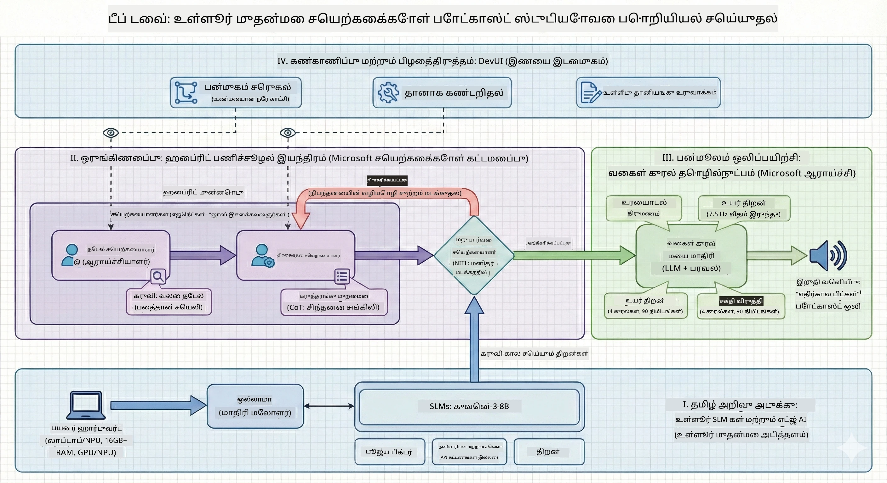

# 🎙️ ஏஐ போட்காஸ்ட் ஸ்டூடியோ வொர்க்ஷாப்

> 🌏 [中文版 (சீன பதிப்பு)](translation/zh-cn/README.md)


## உங்கள் பணிக்கான குறிக்கோள்

**The AI Podcast Studio**-க்கு வருக! நீங்கள் "Future Bytes" என்று பெயருடைய உங்கள் சொந்த தொழில்நுட்ப போட்காஸ்டை தொடங்கப்போகிறீர்கள் — ஆனால் இது சாதாரணமல்ல: அதை உருவாக்க நீங்கள் ஏஐ செயல்படக்கூடிய தயாரிப்பு குழுவை உருவாக்க வேண்டும். ஆய்வுக் காரியங்கள், ஸ்கிரிப்ட் எழுத்து, மற்றும் ஆடியோ தொகுப்பு ஆகியவற்றின் முடிவற்ற நேரங்கள் இல்லை. பதிலாக, நீங்கள் ஏஐ சூப்பர் சக்தியுடன் போட்காஸ்ட் தயாரிப்பாளராக உருவாவீர்கள்.

## கதை

இதைக் கற்பனை செய்க: நீங்கள் மற்றும் உங்கள் நண்பர்கள் மிகவும் சிறந்த தொழில்நுட்ப போதைகளைப் பற்றி ஒரு போட்காஸ்டைத் தொடங்க விரும்புகிறீர்கள், ஆனால் அனைவரும் பாடசாலை, வேலை அல்லது வாழ்க்கையால் பிஸியாக இருக்கிறார்கள். நீங்கள் ஒருசிறந்த AI முகவர்கள் குழுவை கட்டியமைக்க முடியுமா? ஒரு முகவர் தலைப்புகளை ஆராய்கிறார், மற்றவர் ஈர்க்கக்கூடிய ஸ்கிரிப்ட்டை எழுதியுள்ளார், மேலும் மூன்றாவது ஒருவர் உரையை இயற்கையான உரையாடலாக மாற்றுகிறார். இது சை-பி மாதிரி தோன்றுமா? அதினை உண்மையாக்கலாம்.

## நீங்கள் கற்கப்போகும் விஷயங்கள்

இந்த பணிமுரையில் இறுதிக்குப் பின் நீங்கள் யாராக இருப்பீர்கள் என்பதை அறிந்துகொள்ளலாம்:

- 🤖 உங்கள் சொந்த உள்ளூர் ஏஐ மாதிரியை (API கட்டணங்கள் இல்லை, மேகத்தை சார்ந்திருக்கவில்லை!) செயல்படுத்தல்
- 🔧 ஒன்றாக வேலை செய்யும் சிறப்பு AI முகவர்களை உருவாக்கல்
- 🎬 யோசனையிலிருந்து ஆடியோவுக்கு முழு போட்காஸ்ட் தயாரிப்பு வடிவமைப்பை உருவாக்கல்

## உங்கள் பயணம்: மூன்று அத்தியாயங்கள்



எந்த நல்ல கதையிலும் இருந்தபோல், நமக்கு மூன்று அத்தியாயங்கள் உள்ளன. ஒவ்வொன்றும் உங்கள் ஏஐ போட்காஸ்ட் ஸ்டூடியோகளை படிச்சமயமாக கட்டியமைக்கிறது:

| தொகுதி | உங்கள் பணி | என்ன நடக்கிறது | திறன்கள் திறக்கப்படுகிறது |
|---------|-----------|--------------|----------------|
| **அத்தியாயம் 1** | [உங்கள் ஏஐ உதவியாளர்களை சந்தியுங்கள்](md/01.BuildAIAgentWithSLM.md) | நீங்கள் சாவடியில் உழைப்பவர்கள் போலச் செயல்படும், பேசும், இணையத்தைத் தேடும் மற்றும் பிரச்சனைகளைத் தீர்க்கும் AI முகவர்களை உருவாக்குவதை கற்றுக்கொள்கிறீர்கள். | 🎯 முதலாவது முகவரை உருவாக்குதல்<br>🛠️ அதற்கு சூப்பர் சக்திகள் (கருவிகள்!) வழங்குதல்<br>🧠 அதை சிந்திக்க கற்பித்தல்<br>🌐 அதை இணையத்துடன் இணைத்தல் |
| **அத்தியாயம் 2** | [உங்கள் தயாரிப்பு குழுவை சேர்க்கவும்](md/02.AIAgentOrchestrationAndWorkflows.md) | இப்போது காரியங்கள் சுவாரஸ்யமாகிறது! நீங்கள் பல AI முகவர்களை ஒருமித்தமாக வேலை செய்யச் செய்யப்போகிறீர்கள். ஒருவர் ஆராய்ச்சி செய்கிறார், மற்றவர் எழுதுகிறான், நீங்கள் ஒப்புசெய்கிறீர்கள் — குழு வேலை கனவு செய்கிறது. | 🎭 பல முகவர்களை ஒருங்கிணைத்தல்<br>🔄 ஒப்புதல் வேலைகளை உருவாக்கல்<br>🖥️ DevUI இடைமுகத்துடன் சோதனை செய்தல்<br>✋ மனிதர் கட்டுப்பாட்டில் வைக்கல் |
| **அத்தியாயம் 3** | [உங்கள் போட்காஸ்ட்டை உயிரோட்டம் கொடுக்கவும்](md/03.Multi-SpeakerPodcastGenerationWithVibeVoice.md) | இறுதிப் பகுதி! உங்கள் உரை ஸ்கிரிப்ட்டுக்களை இயல்பான அழுத்தம் மற்றும் இயற்கையான உரையாடலுடன் விளையாட்டுப் போட்காஸ்ட் ஆடியோவாக மாற்றுங்கள். உங்கள் "Future Bytes" போட்காஸ்ட் கப்பல் தயாராக உள்ளது! | 🎤 உரை-க்கு-ஒலி மந்திரம்<br>👥 ஒரே நேரத்தில் பல பேச்சாளர்களின் குரல்கள்<br>⏱️ நீண்டகால ஆடியோ<br>🚀 முழு தானியக்கம் |

ஒவ்வொரு அத்தியாயமும் புதிய திறன்களை திறக்கிறது. நீங்கள் துணிச்சலானவராயின் நேரத்தை முந்திவிடலாம், ஆனால் கதையை சேர்ந்து தொடர பரிந்துரைக்கப்படுகிறோம்!

## சூழல் தேவைகள்

இந்த பணிமுறை பல்வேறு கணினி சூழல்களை ஆதரிக்கிறது:
- **CPU**: பரிசோதனை மற்றும் சிறிய அளவிலான பயன்பாட்டிற்கு பொருத்தமாகும்
- **GPU**: தயாரிப்பு சூழலுக்கு பரிந்துரைக்கப்படுகிறது, கணக்கு வேகத்தை கணிப்பிடக் கூடிய அளவு உயர்த்துகிறது
- **NPU**: அடுத்த தலைமுறை நரம்பியல் செயலாக்கக் கருவி விரைவை ஆதரிக்கிறது

## தேவையானவை

### மென்பொருள் சிடிச்செக் ✅
- **Python 3.10+** (உங்கள் குறியீட்டு மொழி)
- **Ollama** (உங்கள் இயந்திரத்தில் ஏஐ மாதிரிகள் இயக்கும்)
- **VS Code** (உங்கள் குறியீட்டு தொகுப்பி)
- **Python விரிவாக்கம்** (VS Code-ஐ இன்னும் புத்திசாலி ஆக்கும்)
- **Git** (குறியீட்டை எடுத்துக்கொள்ள)

### ஹார்ட்வேர்சிடிச்செக் 💻
- **நான் இது இயக்கலாமா?**: 8GB RAM, 10GB ազատ இடம் (நன்றாக இயங்கும், ஆனால் மெதுவாக இருக்கலாம்)
- **சரியான அமைப்பு**: 16GB+ RAM, சிறந்த GPU (மென்மையான பணிசெய்தல்!)
- **NPU உண்டா?**: இன்னும் சிறந்தது! அடுத்த தலைமுறை செயல்திறன் திறக்கும் 🚀

## உங்கள் ஸ்டூடியோவை அமைக்கவும் 🎬

### படி 1: பைத்தான் சக்தி

Python 3.10 அல்லது அதற்கு மேல் பதிப்பு உள்ளதா பார்க்கவும்:

```bash
python --version
# Python 3.10.x அல்லது அதற்கு மேல் காண்பிக்க வேண்டும்
```

Python இல்லைவா? [python.org](https://python.org) இருந்து எளிதில் இலவசமாக பெற்றுக்கொள்ளுங்கள்!

### படி 2: Ollama (உங்கள் AI மாதிரி இயக்கிப் பெட்டி) பெறு

உங்கள் OSக்கான Ollama ஐ [ollama.ai](https://ollama.ai) லிருந்து பதிவிறக்கவும். இது உங்கள் ஏஐ மாதிரிகளைக் உள்ளூரில் இயக்கும் என்ஜின் போல ஆகும்.

இதை சரிபார்க்கவும்:

```bash
ollama --version
```

### படி 3: உங்கள் ஏஐ அச்சரியை பதிவிறக்கவும் 🧠

Qwen-3-8B மாதிரியை பெற நேரம் வந்தது (இதுவே உங்கள் முதல் ஏஐ உதவியாளரை பணியமர்த்துவது போல்):

```bash
ollama pull qwen3:8b
```

*இது சில நிமிடங்கள் ஆகலாம். இனிமையான காப்பி இடைவேளை! ☕*

### படி 4: VS Code ஐ அமைக்கவும்

[Visual Studio Code](https://code.visualstudio.com/) இல்லையெனில் பதிவிறக்கவும். இது சிறந்த குறியீட்டு தொகுப்பி (எனக்கு எதிராகத் தோல்வி பெறுவீர் 😄).

### படி 5: Python விரிவாக்கத்தை நிறுவவும்

VS Code-ல்:
1. `Ctrl+Shift+X` (அல்லது Mac-ல் `Cmd+Shift+X`) அழுத்தவும்
2. "Python" என்பதை தேடவும்
3. அதிகாரப்பூர்வ Microsoft Python விரிவாக்கத்தை நிறுவவும்

### படி 6: நீங்கள் தயார்! 🎉

சூறாவளி நேரம்! AI மாயாஜாலத்தை உருவாக்குவோம்!

### படி 7: Microsoft Agent Framework மற்றும் தொடர்புடைய தொகுப்புகளை நிறுவவும் 📦

பணிமுறைக்கு தேவையான அனைத்து சார்ஹிக்கூறுகளும் மற்றும் தொகுப்புகளையும் நிறுவுங்கள்:

```bash
pip install -r ./Installations/requirements.txt -U
```

*இது Microsoft Agent Framework மற்றும் அனைத்து தேவையான தொகுப்புகளையும் நிறுவும். காப்பி எடுத்துக்கொள்ளுங்கள் — முதன்முறையாக அமைப்பது சில நிமிடங்கள் ஆகலாம்! ☕*

## பணிமுறை வழிகாட்டி

திட்ட கட்டமைப்பு, உள்ளமைவு செயல்முறைகள் மற்றும் செயல்படுத்தும் முறைகள் பணிமுறையின் போது படிப்படியாக விளக்கப்படுகின்றன.

## சிக்கல் நேரத்தில் இருக்கும் பாடங்கள் 🔧

### "ஆஹ், மாதிரி பதிவிறக்கம் வரைவு படிக்கிறது!"
**தீர்வு**: VPN-ஐ பயன்படுத்தவும் அல்லது Ollama-யை மிரர் மூலத்துடன் அமைக்கவும். சில சமயங்களில் இணையம் எங்களுக்கு விரோதமாக இருக்கிறது.

### "என் கணினி முடிவடைகிறது! நினைவகம் முடிந்துவிட்டது!"
**தீர்வு**: சிறிய மாதிரிக்கு மாற்றவும் அல்லது `num_ctx` அமைப்பை குறைக்கவும். இதை உங்கள் ஏஐயை ஒரு உணவு கட்டுப்பாட்டு முறையில் வைக்க போல நினைக்கவும்.

### "என் GPU கொண்டு இதை வேகப்படுத்த முடியுமா?"
**தீர்வு**: Ollama தானாக GPU-களை கண்டுபிடிக்கும்! உங்கள் GPU டிரைவர்கள் புதிதாக உள்ளதா என்று சரிபாருங்கள். இலவச வேகத்தின் குதிப்பு! 🏎️

## கூடுதல் வளங்கள் (ஆர்வமாக உள்ளவர்களுக்கு) 📚

- [Ollama ஆவணங்கள்](https://github.com/ollama/ollama) — உள்ளூர் ஏஐ மாதிரிகளில் ஆழ்ந்த ஆய்வுக்கு
- [Microsoft Agent Framework](https://microsoft.github.io/autogen/) — முகவர் குழுக்களை உருவாக்க கற்றுக்கொள்ள
- [Qwen மாதிரி தகவல்](https://qwenlm.github.io/) — உங்கள் ஏஐ உதவியாளரின் அறிவை அறிய

## உரிமம்

MIT உரிமம் — அருமையானவை உருவாக்கி பகிர்ந்து, உலகத்தை மேம்படுத்துங்கள்! 🌍

## பங்கேற்க விரும்புகிறீர்களா?

பிழை கண்டுபிடித்தீர்களா? யோசனை உண்டா? Issue அல்லது PR சமர்ப்பியுங்கள்! நாங்கள் சமுதாய உறவுகளை விரும்புகிறோம். ✨

---

<!-- CO-OP TRANSLATOR DISCLAIMER START -->
**வெறுக்கத்தக்க மறுப்பு**:
இந்த ஆவணம் AI மொழிபெயர்ப்பு சேவை [Co-op Translator](https://github.com/Azure/co-op-translator) மூலம் மொழிபெயர்க்கப்பட்டுள்ளது. எங்கள் முயற்சி துல்லியத்துக்கு என்றாலும், தானியங்கி மொழிபெயர்ப்புகளில் பிழைகள் அல்லது தவறுகள் இருக்கக்கூடும் என்பதை தயவுசெய்து கவனிக்கவும். முதற்பிரதியமுள்ள ஆவணம் அதன் சொந்த மொழியில் அதிகாரப்பூர்வமான மூலமாக கருதப்பட வேண்டும். முக்கியமான தகவல்களுக்கு, தொழில்முறை மனித மொழிபெயர்ப்பை பரிந்துரைக்கின்றோம். இந்த மொழிபெயர்ப்பை பயன்படுத்துவதிலிருந்து ஏற்பட்ட எந்தவொரு தவறுதல்களுக்கான பொறுப்பும் நாம் ஏற்க மறுக்கிறோம்.
<!-- CO-OP TRANSLATOR DISCLAIMER END -->