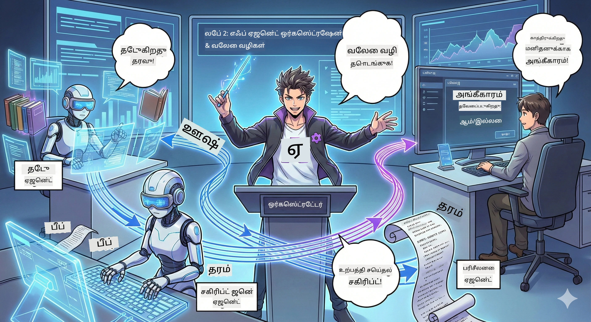

<!--
CO_OP_TRANSLATOR_METADATA:
{
  "original_hash": "93f84b804ced67c5cd017c3c4bb476ff",
  "translation_date": "2026-01-05T11:53:31+00:00",
  "source_file": "WorkshopForAgentic/md/02.AIAgentOrchestrationAndWorkflows.md",
  "language_code": "ta"
}
-->
# நிகழ்ச்சி 2: உங்கள் போட்காஸ்ட் தயாரிப்பு குழுவை ஒன்றிணைக்கவும் 🎬



## கதையின் திகதி

ஆலெக்ஸ் (நிகழ்ச்சி 1இல் உங்கள் AI உதவியாளர்) அற்புதமானவர், ஆனால் ஒரு முகவர் ஒரே ஒருவராக முழு போட்காஸ்ட் ஸ்டுடியோவை இயக்க முடியாது. உங்களுக்கு ஒரு *குழு* வேண்டும்:
- 🔍 **ஆராய்ச்சி முகவர்**: இணையத்தில் புதிய தகவல்களைத் தேடும்
- ✍️ **திரைக்கதை முகவர்**: ஆராய்ச்சியை ஈடுபடுத்தும் உரையாடலாக மாற்றுகிறது
- 👤 **நீங்கள் (திருத்துநர்)**: திரைக்கதைகளை ஒப்புக் கொள்கிறீர்கள் அல்லது மறுபதிவு அனுப்புகிறீர்கள்

வரவேற்கிறோம் **AI முகவர் ஒர்கேஸ்ட்ரேஷன்**க்கு — நீங்கள் உங்கள் சொந்த AI குழுவின் இயக்குனராக மாறுகிறீர்கள். அவென்ஜர்ஸ் போல, ஆனால் போட்காஸ்ட் தயாரிப்புக்காக.

## முகவர் ஒர்கேஸ்ட்ரேஷன் என்றால் என்ன? (எளிய பதிப்பு)

நீங்கள் ஒரு உணவகம் இயக்குகிறீர்கள் என்று கற்பனை செய்யுங்கள். நீங்கள் எல்லாவற்றையும் தான் செய்வதா? இல்லை, உங்களிடம்:
- 🍳 சாப்பிடும் சமையல்காரர்
- 👨‍🍳Sous Chef தயாரிப்பவர்
- 👩‍🍳 பரிமாறும் பணியாளர்

முகவர் ஒர்கேஸ்ட்ரேஷன் அதே கருத்து, ஆனால் AI உடன். ஒவ்வொரு முகவருக்கும் ஒரு நிபுணத்துவம் உண்டு, நீங்கள் அவர்களை இணைத்து பெரிய இலக்கு அடைவீர்கள். ஒரே முகவர் அவசரப்படுவதில்லை, வேலை வேகமாக முடிகிறது.

### குழு ஒப்புமை 🎸

உங்கள் AI முகவர்கள் ஒரு குழுவைப் போன்றவர்கள்:
- **தலைப்பாட்டு பாடகர்**: வாடிக்கையாளர் தொடர்பு பணிகளை கையாளும் முக்கிய முகவர்
- **ட்ரம்மர்**: ரிதம் பேணுகிறது, பின்னணி செயல்பாட்டை கையாள்கிறது  
- **பேஸ் இசையமைப்பாளர்**: அனைவரையும் ஆதரிக்கிறார், தரவுகளை பெறுகிறார்
- **நீங்கள் (குழு மேலாளர்)**: அனைத்தையும் ஒருங்கிணைக்க!
ஒருங்கிணைப்பு இல்லாதால்? வெறும் சத்தம். ஒருங்கிணைப்பு இருந்தால்? அழகான இசை.

### இது ஏன் முக்கியம்

ஒரு AI முகவர் எல்லாவற்றையும் செய்ய முயற்சிப்பது = தூக்குவிப்பு. நிபுணத்துவ முகவர்கள் ஒன்றிணைந்தால் = திறன் விருத்தி! 🚀

**உண்மை பேசுதல்**: நீங்கள் தனியாக ஆராய்ச்சி, எழுத்து, திருத்தம் செய்ய முயற்சித்தீர்களா? அது மிகவும் கடினம். ஒர்கேஸ்ட்ரேஷன் வழங்கும் போது, ஒவ்வொரு முகவரும் தன் சிறந்த பணியை செய்வார். நீங்கள் இறுதி முடிவுகளை மட்டுமே எடுக்கிறீர்கள்.

**உண்மை உலக உதாரணம்**: வாடிக்கையாளர் ஆதரவு பாட்டுகள் எந்த வேதனை நிர்வகிக்க வேண்டும், எந்த குழப்பம் தீர்க்க வேண்டும் என அறிவர், போதுமான போது மனிதனை அழைக்கிறர். அதுதான் ஒர்கேஸ்ட்ரேஷன்!

## முகவர் மற்றும் வேலைப்பாட்டு (Workflow): வேறுபாடு என்ன?

இதுவைப் பாருங்கள்:

### 🤖 AI முகவர் = ஜாஸ் இசையமைப்பாளர்
- **தேவையைப் பொருத்து உடனுக்குடன் முடிவுகள் எடுக்கிறார்**
- **இயற்கையாக தீர்வுகளை உருவாக்குகிறார்**
- **LLM மூளை கொண்டு யோசிக்கிறார்**
- **எதையும் தட்டச்சு செய்தாலும் சார்ந்தார்**

### 🎵 வேலைப்பாட்டு = ஒர்கஸ்ட்ரா பிளேயிங் கלאசிக்கல் மியூசிக்  
- **கோப்பு (score)** பின்பற்றுகிறது (முன்னிலைப்படுத்திய படிகள்)
- **கணிப்புக் கூடிய** நடைமுறை பாதை
- **பல முகவர்கள், மனிதர்கள், அமைப்புகளை ஒருங்கிணைக்கிறது**
- **ஒரு செய்முறைப் போன்ற அமைப்பு**

**மாயாஜாலம்**: வேலைப்பாட்டுகள் முகவர்களை ஒருங்கிணைக்கின்றன! நீங்கள் ஒரு workflow உருவாக்கி, முகவர்களுக்கு எப்போது தங்கள் பங்கினை விளையாட வேண்டும் என்று சொல்கிறீர்கள். இரண்டு உலகங்களும் சிறந்தவை. 🎭

## உங்கள் AI குழுவை ஒருங்கிணைக்கும் மூன்று வழிகள்

### 1. 🎯 மையப்படுத்தப்பட்டது (நீங்கள் மேலாளர்)

ஒரே ஒருங்கிணைப்பாளர் எல்லா முடிவுகளையும் கையாள்கிறார். இது நீங்கள் ஒரு குழுவை மேலாண்மை செய்வது போல — நீங்கள் யார் என்ன செய்ய வேண்டும் என்றும் எப்போது செய்ய வேண்டும் என்றும் தீர்மானிப்பீர்கள்.

**நன்மைகள்**:
- ✅ தெளிவான தலைமை (சரியான குழப்பமின்றி)
- ✅ ஒத்தியை முடிவு
- ✅ எளிதில் பிழை திருத்தம்

**பயன்பாடு**:
- வாடிக்கையாளர் சேவை வழிமுறை ("இது பில்லிங் அல்லது டெக் ஆதரவு?")
- உள்ளடக்க அங்கீகாரம் வேலைப்பாடு ("இந்த திரைக்கதை பரிசீலனைக்கு சாதகமா?")
- போட்காஸ்ட் தயாரிப்பு (நாம் உருவாக்கும் விஷயம்!)

### 2. 🤝 மையமில்லாது (முகவர்கள் தானாக ஒருங்கிணைக்கிறார்கள்)

முகவர்கள் நேரடியாக பேசும் மற்றும் குழுவாக முடிவுகள் எடுப்பார்கள். அனைவரும் ஒருங்கிணைக்கும் குழுத்தார்க் போல.

**நன்மைகள்**:
- ✅ எளிதாக ஏற்றுக்கொள்ள முடியும் (நேரத்தில் கூட அதிக முகவர்களை சேர்க்கலாம்)
- ✅ ஒரே புள்ளி தோல்வி இல்லை
- ✅ முகவர்கள் இயற்கையாக ஒத்துழைக்கிறார்கள்

**பயன்பாடு**:
- ஆராய்ச்சி குழுக்கள் (ஒவ்வொரு முகவரும் வேறுபட்ட ஆதாரங்களை ஆராய்கிறது)
- கரு வீசும் அமர்வுகள்
- பூமிக்குப் பிரச்சினை தீர்க்கும்

### 3. 🔀 கலவையானது (இரண்டு உலகங்களின் சிறந்தது)

நீங்கள் மொத்த திசையை அளிக்கிறீர்கள், ஆனால் முகவர்கள் பணிகளை தானாக ஒழுங்குபடுத்தும் சுதந்திரம் உண்டு. ஒரு CEO தன் குழுவை நம்புவது போல.

**சரியானது**: கட்டுப்பாடு மற்றும் ச்வாதீனம் இரண்டும் தேவைப்படும் சிக்கலான திட்டங்களுக்கு.

## Microsoft முகவர் அமைப்பு: உங்கள் ஒர்கேஸ்ட்ரேஷன் கருவி 🧰

இப்போது கட்ட அமைக்கலாம்! நீங்கள் பயன்படுத்த உள்ளவை இவை:

### கட்டுமான கூறுகள்

#### 1. 🧱 Executor (உங்கள் ஊழியர்கள்)
- **இவை என்ன**: தனிச்செயல் அலகுகள் — முகவர்கள் அல்லது தனிப்பயன் தர்க்கம்
- **செய்கிறவை**: உள்ளீடு எடுத்து, பணிகளைக் செய்து, வெளியீடு உருவாக்குதல்
- **இதுபோல் நினையுங்கள்**: கூட்டுறுப்பு வரிசையில் நிலையங்கள்

#### 2. ➡️ Edge (கலங்கள்)
- **இவை என்ன**: Executor கள் இடையேயான பாதைகள்
- **செய்கின்றவை**: செய்தி ஓட்டம் கட்டுப்பாடு ("Aக்குப் பிறகு, Bக்கு போ")
- **இதுபோல் நினையுங்கள்**: ஓட்டச்சார வரைபடத்தில் அம்புகள்

#### 3. 🗺️ Workflow (மாஸ்டர் திட்டம்)
- **இவை என்ன**: executorகள் + edges உடன் முழு வரைபடம்
- **செய்கின்றவை**: தொடக்கம் முதல் முடிவு வரை முழு செயல்முறைக்கான வரையறை
- **இதுபோல் நினையுங்கள்**: உங்கள் தயாரிப்பு குழாய் வரைபடம்

### நீங்கள் விரும்பும் குளிர்ந்த அம்சங்கள்

**🛡️ வகை பாதுகாப்பு**: முகவர்களுக்கு இடையேயான செய்திகள் வகைப் பரிசோதிக்கப்படுகின்றன. "ஓஃப், தவறான தரவுத்தரம்" அதிர்ச்சிகள் இல்லை.

**🔀 வளைவு வழிகாட்டல்**:
- If-then நிபந்தனைகள் ("அங்கீகாரம் கிடைத்தால் வெளியிடு; இல்லையேல் மறுபதிவு செய்")
- 병렬 செயலாக்கம் (பல முகவர்கள் ஒருங்கினைந்த செயல்பாடு)
- Dynamic பாதைகள் (workflow முடிவுகளைப் பொறுத்து தானாக மாற்றம்)

**🔌 வெளிப்புற ஒருங்கிணைப்பு**:
- API களை தொடர்பு கொள்ள
- மனிதன் உள்ளடக்கிய சோதனை நிலைகள் சேர்க்க (நீங்கள் வெளியிடுவதற்கு முன் அங்கீகரிக்க)
- கோரிக்கை/பதில் ஓட்டங்கள் உருவாக்க

**💾 Checkpointing**: முன்னேற்றத்தை சேமி! ஏதேனும் பாதிப்புகள் வந்தால், மீண்டும் தொடர.

**🤝 பல-முகவர் ஒருங்கிணைப்பு**:
- முகவர்கள் தொடர் முறையில் ஓட்ட (A → B → C)
- முகவர்கள் 병렬 முறையில் ஓட்ட (A + B + C ஒரே நேரம்)
- முகவர்களுக்கு இடையே பணி மாற்றம்
- கூட்டு செயலாக்கம்

## சிறந்த நடைமுறை (ப்ரோ குறிப்புகள்) 🎯

### 1. Modular ஆக வைத்திருங்கள்
ஒவ்வொரு முகவரும் ஒரு செயல்தான் மிகச் சிறப்பாக செய்ய வேண்டும். "கடந்தகால உத்தம முகவர்" என்ற ஒருவரை உருவாக்க வேண்டாம் — பிழைதிருத்தும்போது பின்விளைவுகள் தோன்றும்.

### 2. தோல்விகளுக்கான திட்டம் செய்யுங்கள்
முகவர்கள் தவறுகள் செய்யலாம். நெட்வொர்க் தோல்வி ஏற்படலாம். பிழை கையாளல் மற்றும் காப்புப்பயிற்சி திட்டங்களை கட்டமைக்கவும். எதிர்கால நீங்கள் நன்றி கூறுவார்.

### 3. அனைத்தையும் கண்காணியுங்கள்
உங்கள் முகவர்கள் என்ன செய்கிறார்கள் என்பதை கவனியுங்கள். DevUI(இதை அடுத்து காண்போம்) பயன்படுத்தி workflows செயல்பாட்டைப் பார்ப்பதற்கு.

### 4. செய்தி அளவைக் குறைக்கவும்
பெரிய கோப்புகளை முகவர்களுக்கு இடையே அனுப்ப வேண்டாம். செய்திகளை எளிதாக்கி வேகத்திற்கு உதவும்.

### 5. சரியான முறை தேர்ந்தெடுக்கவும்
கட்டுப்பாடு தேவை? மையப்படுத்தப்பட்ட முறை.
அளவுக்கு தேவை? மையமில்லாத முறை.
தேர்வு செய்ய முடியவில்லை? கலவையான முறை!

## DevUI: உங்கள் Workflow பிழைதிருத்தி 🔍

### DevUI என்றால் என்ன?

DevUI உங்கள் முகவர்களையும் workflowகளையும் சோதிப்பதற்கான ஒரு விளையாட்டு மேடை போன்றது. இது ஒரு வலை இடைமுகம்:
- 👀 உங்கள் workflow செயலில் இருப்பதை பார்வையிட
- 💬 முகவர்களுடன் நேரடியாக உரையாட
- 🔍 பிழைகள் நேருமானால் பிழைதிருத்த
- 📊 தடம் மற்றும் செயல்திறன் மாதிரிகள் காண

> **முக்கியம்**: DevUI என்பது உருவாக்குவதற்காக மட்டுமே! உற்பத்தியில் பயன்படுத்த வேண்டாம். உங்கள் உள்ளூர் சோதனை இடமாக நினைக்கவும்.

### அதைப் பிரமிப்பாக 만드는வை

- **🖥️ இடைமுக வலை UI**: கிளிக் செய், தட்டச்சு செய், சோதனை செய் — கமாண்ட் லைன் தேவையில்லை
- **📁 இழுக்கும்-விடும் தயார்**: கோப்புகளை பதிவேற்று, வேறுபட்ட உள்ளீடுகளுடன் சோதனை செய்
- **📂 தானாக கண்டுபிடிப்பு**: ஒரு கோப்புறை காட்டு, அனைத்து முகவர்களையும் தானாக கண்டுபிடிக்கும்
- **📋 அமைக்காமல் இயக்கும் முறை**: கோடுகளில் முகவர்களை பதிவு செய், கோப்புறை கட்டமைப்பு தேவைகள் இல்லை
- **🔌 OpenAI இணக்கமானது**: OpenAI SDK உடன் வேலை செய்கிறது (இணக்குநிலை கைக்கூலி!)
- **👁️ தடங்கள் உட்புகுத்தியது**: உங்கள் முகவர்கள் என்ன செய்கிறார்கள் என்பதை முழுமையாக காண்க

### உள்ளீடு எப்படி வேலை செய்கிறது

DevUI உள்ளீடுகளை நுண்ணறிவுடன் கையாள்கிறது:

- **முகவர்களை சோதிக்கிறீர்களா?** நீங்கள் உரை பெட்டிகள் மற்றும் கோப்பு பதிவேற்ற பொத்தான்களை பெறுவீர்கள்
- **Workflowகளை சோதிக்கிறீர்கள்?** உங்கள் workflow எதிர்பார்க்கும் உள்ளீடுகளுக்கு தானாக UI புலங்கள் உருவாக்கப்படும்

இது மகஜிக் போல, ஆனால் நல்லக் குறியீடு மட்டுமே. ✨

## உங்கள் பணி: ஒரு போட்காஸ்ட் ஸ்டுடியோ கட்டவும் 🎬

### பணி 1: DevUI உடன் ஒரே முகவரைக் கட்டமைக்கவும்

📂 [01.AgentDevUI](../../../../WorkshopForAgentic/code/02.Workflow/01.AgentDevUI)

**சவால்**: முழு குழு உருவாக்குவதற்கு முன், DevUIயை ஒரு முகவருடன் சோதிக்கலாம்: ஒரு வலைத் தேடல் நிபுணர்.

**நீங்கள் கட்டுகிறீர்கள்**:
போட்காஸ்ட் தலைப்புகளுக்கான இணையத்தில் தேடலைச் செய்யும் ஆராய்ச்சி முகவர். DevUI வலை இடைமுகத்தில் `http://localhost:8090` பயன்படுத்தி சோதனை செய்யலாம்.

**கற்றுக்கொள்ளும் திறன்கள்**:
- 🚀 DevUIயில் முகவர்களை இயக்குதல்
- 🔍 முகவர் பதில்களை நேரில் சோதனை செய்தல்
- 🛠️ தனிப்பயன் கருவிகள் உருவாக்குதல் (வலைத் தேடல்)
- 📊 பிழைகளை கண்டறிய தடம் சேர்க்க
- 🖥️ இன்டரக்டிவ் Web UI பயன்பாடு

**குறியீடு**:
- `agent.py`: Qwen உடன் இணைப்பதற்கான OllamaChatClient பயன்படுத்தும் உங்கள் SearchAgent
- `web_search()` கருவி செயல்பாடு செயலாக்கம்
- `serve()` கொண்டு DevUI தானாக திறக்கிறது

**வெற்றி நிபந்தனை**: உங்கள் முகவரிடம் "AI இல் என்ன பிரபலமாகி வருகிறது?" என்று கேட்கவும், அதை வலை தேடலில் செயல் படுத்துவதை காணுங்கள்! 🎉

### பணி 2: பல முகவர் கொண்ட Workflow உருவாக்கவும்

📂 [02.WorkflowDevUI](../../../../WorkshopForAgentic/code/02.Workflow/02.WorkflowDevUI)

**சவால்**: இப்போது உண்மையான சுகம்! முழுமையான போட்காஸ்ட் தயாரிப்பு workflow கட்டவும்:
1. 🔍 **தேடல் முகவர்** → உங்கள் தலைப்பை ஆராய்கிறது
2. ✍️ **திரைக்கதை முகவர்** → இரண்டு ஹோஸ்ட்கள் இடையேயான உரையாடல் (சீன மொழியில்!)
3. 👤 **இறுதி மதிப்பீடு Executor** → நீங்கள் ஒப்புக்கொள்ள கேட்கிறது
4. 🔄 **மீண்டும் சுற்று** → நிராகரித்தால், உங்கள் பின்னூட்டத்தைப் பொறுத்து மறுபதிவு செய்கிறது

**கற்றுக்கொள்ளும் திறன்கள்**:
- 🧱 வேறுபட்ட பணிகளுக்கு சிறப்பான முகவர்கள் உருவாக்கல்
- 🔗 WorkflowBuilder மூலம் முகவர்களை இணைப்பு
- 🔀 அங்கீகாரம் முறைகளை நடைமுறைப்படுத்துதல் (மனிதன் உள்ளடக்கியது!)
- 🚦 நிபந்தனை வழிகாட்டல் (அங்கீகாரம்/நிராகரிப்பு)
- 🔧 வணிக தர்க்கத்திற்கான தனிப்பயன் executorகள் உருவாக்கல்

**Workflow**:
```
SearchAgent → ScriptAgent → ReviewExecutor
                             ↑          ↓ (if rejected)
                             ←─────────
```

**குறியீடு**:
- `search_agent/agent.py`: உங்கள் ஆராய்ச்சி நிபுணர்
- `generate_script_agent/agent.py`: உங்கள் திரைக்கதை ஆசிரியர் (சீன மொழியில் எழுதுகிறார்!)
- `workflow/workflow.py`: ஒர்கேஸ்ட்ரேஷன் அதோடு நடக்கும் இடம்
- `main.py`: DevUIயில் அனைத்தையும் தொடக்கம் செய்கிறது

**வெற்றி நிபந்தனை**: ஒரு தலைப்பினைப் பெற்று, திரைக்கதையை மதிப்பாய்வு செய்க; ஒரு முறை நிராகரித்து முறை சோதனை செய்யவும், பிறகு ஒப்புக்கொள்! 🎉

### பணி 3: ஒரு கான்சோல் செயலி கட்டவும்

📂 [03.Application](../../../../WorkshopForAgentic/code/02.Workflow/03.Application)

**சவால்**: DevUIயிலிருந்து workflow எடுத்து அசத்திய நிறைவேற்ற terminal செயலி (நிறைய நிறங்கள், சுழற்சிப் பட்டை, கோப்புகளை சேமிக்கும் வசதி) உருவாக்கு. இது உற்பத்திக்குப் தயாராகும்!

**கற்றுக்கொள்ளும் திறன்கள்**:
- ⚡ நிரல்பா (programmatic) முறையில் workflowகளை இயக்கல் (DevUI இல்லாமல்)
- 📡 நிகழ்வு சார்ந்த கட்டமைப்பு மற்றும் ஸ்ட்ரீமிங்
- 🎨 அழகான terminal UIகள் உருவாக்குதல் (நிறங்கள், ஸ்பின்னர்கள், முன்னேற்றப் பட்டைகள்)
- 💾 இறுதி திரைக்கதைகளை கோப்புகளில் சேமித்தல்
- 🔄 Python இன் asyncio உதவி workflowகளை asynchronous முறையில் கையாளுதல்

**செய்கிறது**:
1. நீங்கள் சமர்ப்பிக்கும் போட்காஸ்ட் தலைப்பை கேட்கிறது
2. நேரடி முன்னேற்றத்தை காட்டுகிறது ("தேடல் முகவர் வேலை செய்கிறது...")
3. நிறங்களுடன் உருவாக்கப்பட்ட தேர்க்கதை காட்டுகிறது
4. உங்கள் அங்கீகாரத்தை கேட்கிறது
5. அங்கீகாரம் பெற்ற திரைக்கதையை `podcast.txt`யில் சேமிக்கிறது

**குறியீடு**:
- `podcast_app.py`: நிகழ்வுகளை கையாளும் உங்கள் பிரதான செயலி
- `workflow.py`: பணி 2இல் workflow ஐ மீண்டும் பயன்படுத்துகிறது
- `AgentRunUpdateEvent`, `RequestInfoEvent`, `WorkflowOutputEvent` போன்ற நிகழ்வுகளை கையாள்கிறது
- Terminal ஷைலிங்கிற்கு ANSI நிறங்களுக்கு பயன்படுத்துகிறது

**வெற்றி நிபந்தனை**: செயலியை இயக்கி, ஒரு போட்காஸ்ட் திரைக்கதை உருவாக்கி, அது சேமிக்கப்படுவதை பார்த்துள்ளீர்கள்! நீங்கள் உண்மையான கருவி உருவாக்கி விட்டீர்கள். 🚀

## நீங்கள் கற்றுக்கொண்டதை 🏆

நிகழ்ச்சி 2 முடிந்த பிறகு, நீங்கள்:

- ✅ பல AI முகவர்களை மாதிரியாக ஒருங்கிணைக்கக்கூடுதலை கவனிக்கலாம்
- ✅ தொடர் மற்றும் நிபந்தனை தர்க்கத்துடன் workflowகளை கட்டலாம்
- ✅ மனித அங்கீகாரத்தைச் சேர்க்கலாம்
- ✅ DevUIயை பயன்படுத்தி workflow பிழைகளை கண்டறியவும் திருத்தவும் செய்வீர்கள்
- ✅ உற்பத்திக்கு தயாரான கான்சோல் செயலிகளை உருவாக்கலாம்
- ✅ சிக்கலான அமைப்புகளில் பிழைகளை பண்பட்ட முறையில் கையாளவும்
- ✅ எந்த திட்டத்திற்கும் சரியான ஒர்கேஸ்ட்ரேஷன் முறை தேர்ந்தெடுக்கலாம்

## பிரச்சினைகள் ஏற்பட்டால் 🔧

### "என் workflow மிகவும் சிக்கலானது!"
**தீர்வு**: அதை சிறிய துணை workflowகளாக பிரிக்கவும். ஒவ்வொரு workflow ஒரே காரியத்தை நன்கு செய்ய வேண்டும். அவற்றை சங்கிலி போல இணைக்கலாம்.

### "என்ன நடக்கிறதோ தெரிகக்கூடவில்லை!"
**தீர்வு**: workflow checkpointing ஐ பயன்படுத்தி நிலையை சேமிக்கவும். DevUIயில் தடங்களை அச்செய்யவும், ஒவ்வொரு படியையும் காணுங்கள்.

### "ஒரு முகவர் பிழை எல்லாம் முற்றிலும் சேதப்படுத்துகிறது!"
**தீர்வு**: பிழை காப்புக் கட்டங்களை சேர்க்கவும். ஒவ்வொரு முகவரும் தன் தவறுகளை கையாள வேண்டும் மற்றும் மாற்றிடும் செயல்திறன் இருக்க வேண்டும்.

### "இது மிகவும் மெதுவாக உள்ளது"
**தீர்வு**: ஏதேனும் முகவர்கள் 병렬 முறையில் இயங்க முடியுமா? தொடர் workflowகள் எளிதானவை ஆனால் மெதுவாக இருக்கும். 병렬த்தை உருவாக்கிட வாய்ப்பு காணுங்கள்!

## உதவிகரமான வளங்கள் 🔗

- [Workflow ஆவணங்கள்](https://learn.microsoft.com/en-us/agent-framework/user-guide/workflows/overview) — அதிகாரப்பூர்வ மைக்ரோசாஃப்ட் வழிகாட்டிகள்
- [ஒர்கேஸ்ட்ரேஷன் வடிவமைப்புகள்](https://www.ibm.com/think/topics/ai-agent-orchestration) — ஐபிஎம் பதிவு
- [Agent Framework GitHub](https://github.com/microsoft/agent-framework) — மூலக் குறியீட்டை பார்வையிடவும்
- [குறியீடு உதாரணங்கள்](https://github.com/microsoft/agent-framework/tree/main/python/samples) — இங்கே உள்ள மாதிரிகளை கள்வி செய்க

---

**இறுதியுக்காக தயாரா?** உங்கள் ஸ்கிரிப்ட் தயார். இப்போது அதை உண்மையான ஆடியோவாக மாற்றுவோம்! → [அங்கம் 3: உங்கள் போட்காஸ்டை உயிரோடு கொண்டு வாருங்கள்](03.Multi-SpeakerPodcastGenerationWithVibeVoice.md) 🎤

---

**சிக்கலா? குழப்பமா? உற்சாகமா?** பணிமனை உரையாடலில் பகிருங்கள்! நாங்கள் அனைவரும் ஒன்றாக கற்றுக்கொள்வோம். 🚀

---

<!-- CO-OP TRANSLATOR DISCLAIMER START -->
**புறக்கம்**:
இந்த ஆவணம் AI மொழிபெயர்ப்பு சேவை [Co-op Translator](https://github.com/Azure/co-op-translator) மூலம் மொழிபெயர்க்கப்பட்டுள்ளது. நாங்கள் துல்லியத்தை உறுதிப்படுத்த முயற்சித்தாலும், தானியங்கி மொழிபெயர்ப்புகளில் தவறுகள் அல்லது தவறான பொருள் இருக்க வாய்ப்பு உள்ளது. அசல் ஆவணம் அதன் இயல்பான மொழியில் அதிகாரப்பூர்வ ஆதாரமாகக் கொள்ளப்பட வேண்டும். முக்கியமான தகவல்களுக்கு, தொழில்முறை மனித மொழிபெயர்ப்பை பரிந்துரைக்கிறோம். இந்த மொழிபெயர்ப்பின் பயன்பாட்டால் ஏற்பட்ட எந்த தவறான புரிதல்கள் அல்லது பொருள் மாற்றங்களுக்கும் நாங்கள் பொறுப்பேற்கமாட்டோம்.
<!-- CO-OP TRANSLATOR DISCLAIMER END -->