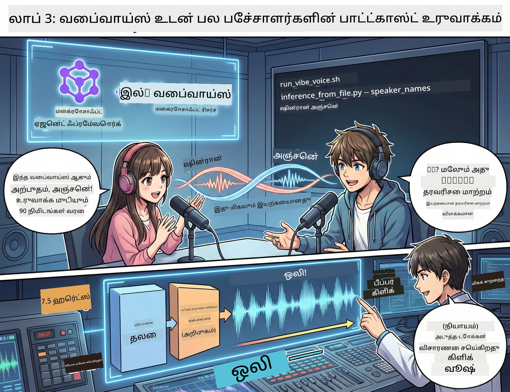

# மூன்றாவது அங்கம்: உங்கள் போட்காஸ்டை உயிருடன் உணருங்கள் 🎤



## பெரிய முடிவு

நீங்கள் தலைப்பை ஆராய்ந்து முடித்துள்ளீர்கள். நீங்கள் திரைக்கதை எழுதிவிட்டீர்கள். இப்போது சிறந்தது: உங்கள் எழுத்துக்களை உண்மையான போட்காஸ்ட் ஆடியோவாக மாற்றுங்கள்!

நுழைவோம் **VibeVoice** – மைக்ரோசாப்ட் ஆராய்ச்சி நிறுவனர் திறந்த மூல TTS (எழுத்து முதல் செவியிலான மொழி வடிவம்) மாயாஜாலம், இது உருவாக்குகிறது:
- 🎭 இயல்பான மற்றும் மென்மையான உரையாடல்
- 👥 பல பேச்சாளர்கள் (அதிகபட்சம் 4 பேர்!)
- ⏱️ நீண்ட வடிவ ஆடியோ (அதிகபட்சம் 90 நிமிடங்கள்!)
- 🎵 கருத்து நிறைந்த வழங்கல் (ரோபோட் குரல் அல்ல!)

இது ஒருங்கிணைக்கப்பட்ட போட்காஸ்ட் உருவாக்கத்தின் தொழில்நுட்பம். ஐயோ, உங்களுடையது தயாரிப்போம்!

## VibeVoice என்றால் என்ன? (புகழ் பெறும் விஷயம்)

VibeVoice என்பது மைக்ரோசாப்ட் ஆராய்ச்சி நிறுவனம் உலகிற்கு அளிக்கும் பரிசு. இது போட்காஸ்ட் பாணியில் உரையாடல் ஆடியோவுக்காக சிறப்பாக வடிவமைக்கப்பட்டுள்ளது.

### இது ஏன் சிறந்தது 🔥

* **⏱️ நீண்ட உரையாடல்**: தொடர்ந்து 90 நிமிடங்கள் வரை பேச்சை உருவாக்கும் (முழு ஒரு போட்காஸ்ட் எபிசோடு!)
* **👥 பன்முக பேச்சாளர் மாயாஜாலம்**: அதிகபட்சம் 4 வித்தியாசமான குரல்கள், ஒரே தனித்துவத்துடன்
* **⚡ மிகவும் வேகமானது**: கணக்கீடு திறனை சேமிக்க 7.5 ஹெர்ட்ஸ் குறைந்த கட்டமைப்பை பயன்படுத்துகிறது
* **🧠 புத்திசாலி ஆடியோ**: LLM-ஐ (வாசல்_Context புரிதல்) மற்றும் diffusion மாடலை (உண்மையான ஆடியோ உருவாக்கம்) ஒருங்கிணைக்கும்
* **🎭 இயல்பான மற்றும் மென்மையான**: உருமாற்ற உரையாடல், இடையூறுகள் மற்றும் உரையாடல் வேகங்களை தானாக கையாள்கிறது

**மொழிபெயர்ப்பு**: VibeVoice உங்கள் திரைக்கதையை வெறும் வாசிப்பதல்ல - அது அந்தக் கதையை *நடிப்பது* போல உள்ளது.

---

## தொடங்கமுன் 🚀

**என்ன வேண்டும்**:

* 🐍 **Python 3.10+** (நீங்கள் மூன்றாவது மற்றும் இரண்டாவது அங்கத்தில் இதை ஏற்கெனவே பெற்றுள்ளீர்கள்)
* 🚀 **uv** (ஒரு வேகமான Python பாக்ஸ் நிர்வாகி – அதை நிறுவப்போகிறோம்)
* 📝 **உங்கள் திரைக்கதை**: இரண்டாவது அங்கத்தில் இருந்து `podcast.txt` கோப்பு (`../03.Application/` வழியில்)

**திறமை அறிவிப்பு**: இந்த படி முன்னமைக்கப்பட்ட மாடல்களை பதிவிறக்க நல்ல இணைய இணைப்பை தேவைப்படுத்தும். ஒரு காபி குடிக்கவும்!☕

---

## வருவோம்! எளிய வழி 🎬

நாம் இதை மிக எளிதாக்கியுள்ளோம். ஒரு shell ஸ்கிரிப்ட் அனைத்தையும் செய்கிறது.

### செயல்முறை

1. **இதை இயக்கு அனுமதிப்பது**:
```bash
chmod +x run_vibe_voice.sh
```

2. **இதை இயக்கவும்**:
```bash
./run_vibe_voice.sh
```

3. **மாயாஜாலத்துக்காக காத்திருங்கள்** (முதல் இயக்கும் பொழுது சில நிமிடங்கள் தேவைப்படலாம்)

### பின்னணி நிகழ்வு 🎭

ஸ்கிரிப்ட் அடிப்படையில் உங்கள் தானியங்கி சப்த பொறியாளர்தான்:

1. **📥 VibeVoice பதிவிறக்கம்**: GitHub இல் இருந்து அதிகாரப்பூர்வ களஞ்சியத்தை கிளோன் செய்கிறது
2. **📦 சார்புகளை நிறுவல்**: `uv pip` மூலம் விரைவு பாக்ஸ் நிறுவல் செய்கிறது
3. **🎬 ஆடியோ உருவாக்கம்**:推理 ஸ்கிரிப்டை இயக்குகிறது, பயன்படுத்துகிறது:
   * `--model_path`: முன் பயிற்சி பெற்ற VibeVoice-7B மாதிரியை
   * `--txt_path`: உங்கள் `podcast.txt` திரைக்கதை
   * `--speaker_names`: குரல்களை ஒதுக்குகிறது (இயல்பு Xinran மற்றும் Anchen)

**வழிபாடு**: உங்கள் திரைக்கதை உண்மையான போட்காஸ்ட் தொடர் ஆக மாறுகிறது! 🎉

---

## உங்கள் பணி 🎯

இதை நம்மால் தான் சுவாரஸ்யமாக்குவோம்:

### பணி 1: உள்ளடக்கத்தை உருவாக்கு
இரு நபர்களுக்கிடையேயான உரையாடலை கொண்டு `../03.Application/podcast.txt` கோப்பை தொகுக்கவும். அது தொழில்நுட்பம், பொழுதுபோக்கு, எதுவும் சரி! ஆனால் உரையாடல் வடிவில் இருக்க வேண்டும்.

**வடிவமைப்பு உதாரணம்**:
```
说话人 1：嘿！你听说新的 AI 模型了吗？
说话人 2：不会吧！告诉我更多！
说话人 1：它叫...
```

### பணி 2: ஆடியோ உருவாக்கு
ஸ்கிரிப்டைப் இயக்கவும், மாயாஜால் நிகழ்கிறது பாருங்கள். முதல் முறையாக அது நீண்ட நேரம் எடுக்கும் (மாடல்கள் பதிவிறக்கம் ஆகும்).

### பணி 3: கேளுங்கள் மற்றும் பகுத்தறியுங்கள்
- இயல்பாக இருக்கிறதா?
- பேச்சாளர்களுக்கு வேறுபட்ட குரல்கள் உள்ளனவா?
- உரையாடல் முயற்சி சீராக நடக்கிறதா?
- ரோபோட் குரல் நொறுக்கங்களுண்டா?

### பணி 4: தேர்வு (திட்டமிட்டு செய்யும் நபர்களுக்கு)
`run_vibe_voice.sh` ஐ தொகுக்கவும், `--speaker_names` மாற்றி வேறுபட்ட குரல் கலவைகளை முயற்சி செய்யவும். VibeVoice பல முன்னமைக்கப்பட்ட குரலுகள் கொண்டது!

**விடுகை சவால்**: 3 பேச்சாளர்களின் உரையாடலை முயற்சி செய்து பாருங்கள்! 🎆

---

## மேலும் அறிய 📚

* **🏠 திட்ட முகப்பு**: [VibeVoice அதிகாரப்பூர்வ தளம்](https://microsoft.github.io/VibeVoice/)
* **🤗 முன்பயிற்சி பெற்ற மாதிரி**: [Hugging Face - VibeVoice-7B](https://huggingface.co/vibevoice/VibeVoice-7B)
* **📖 ஆராய்ச்சி கட்டுரை**: தொழில்நுட்பத்தை ஆழமாக அறிய (உங்களுக்கு நன்றாக இருந்தால்)

> **⚠️ பொறுப்பான AI நினைவூட்டல்**: VibeVoice மிக வலுவானது. ஒழுங்காக பயன்படுத்தவும்! ஆழமான கலைப்பொய் அல்லது தவறான தகவலை உருவாக்க வேண்டாம். மக்களுக்கு உதவும் அற்புதமானதை உருவாக்குங்கள்.🙏

---

## 🏆 வாழ்த்துக்கள்! நீங்கள் செய்துவிட்டீர்கள்!

நீங்கள் முழு செயல்முறையையும் கையாள்ந்துள்ளீர்கள்:
1. ✅ **முதல் அங்கம்**: தனிப்பயன் கருவிகள் கொண்டு AI உயிரினம் உருவாக்கல்
2. ✅ **இரண்டாம் அங்கம்**: பன்முக AI உயிரின வேலைநிறுத்தல் அமைத்தல்
3. ✅ **மூன்றாம் அங்கம்**: உண்மையான போட்காஸ்ட் ஆடியோ உருவாக்கம்

**நீங்கள் இப்போது பெற்றுள்ளீர்கள்**:
- ஒரு திறமையான AI ஆராய்ச்சி உதவியாளர்
- ஒரு முழுமையான போட்காஸ்ட் தயாரிப்பு வேலைநிரல்
- பகிரக்கூடிய, உண்மையான ஆடியோ கோப்பு

### அடுத்த படி? 🚀

**உங்கள் போட்காஸ்டை வெளியிடுங்கள்!**
- போட்காஸ்ட் தளங்களுக்கு ஏற்றுக
- சமூக ஊடகங்களில் பகிரவும்
- திருத்தி மேம்படுத்தவும்

**தொடர்ந்து உருவாக்குங்கள்!**
- பகுதிகளை மாற்றி முயற்சிக்கவும்
- அதிக பேச்சாளர்களுடன் முயற்சி செய்யவும்
- பின்னணி இசையை சேர்க்கவும்
- வெப் இடைமுகம் உருவாக்கவும்
- முழு செயல்முறையை தானியக்கப்படுத்தவும்

**உங்கள் படைப்புகளை பகிரவும்!**
எங்களை குறி அனுப்புங்கள்! உங்கள் கட்டமைத்ததை உலகுக்கு காட்டு. AI போட்காஸ்ட் புரட்சி உங்களிடத்தில் துவங்குகிறது.🎙️

---

**கேள்விகள்? கருத்துக்கள்? வெற்றி கதை?** பணிக்கூட்ட உரையாடலில் பதிவு செய்யுங்கள்!

**உள்ளடக்க உருவாக்கத்தின் எதிர்காலத்திற்கு வரவேற்கிறோம்.** 🌟

---

<!-- CO-OP TRANSLATOR DISCLAIMER START -->
**அறிவுறுத்தல்**:
இந்த ஆவகம் AI மொழிபெயர்ப்பு சேவை [Co-op Translator](https://github.com/Azure/co-op-translator) மூலம் மொழிபெயர்க்கப்பட்டுள்ளது. நாங்கள் துல்லியத்திற்காக முயலினாலும், தானாக செய்யப்பட்ட மொழிபெயர்ப்புகளில் தவறுகள் அல்லது நிக்கர்ச்சிகள் இருக்க வாய்ப்பு உள்ளது என்பதை தயவுசெய்து கவனத்தில் கொள்ளவும். அசல் ஆவகம் அதன் சொந்த மொழியில் அங்கீகாரமான மூலமாக கருதப்பட வேண்டும். முக்கியத் தகவல்களுக்கு, தொழில்முறை மனித மொழிபெயர்ப்பு பரிந்துரைக்கப்படுகிறது. இந்த மொழிபெயர்ப்பு பயன்படுத்தியதனால் ஏற்படும் எந்தவொரு தவறான புரிந்துகொள்ளல்கள் அல்லது தவறான விளக்கங்களுக்கும் நாங்கள் பொறுப்பு வாங்குவதில்லை.
<!-- CO-OP TRANSLATOR DISCLAIMER END -->