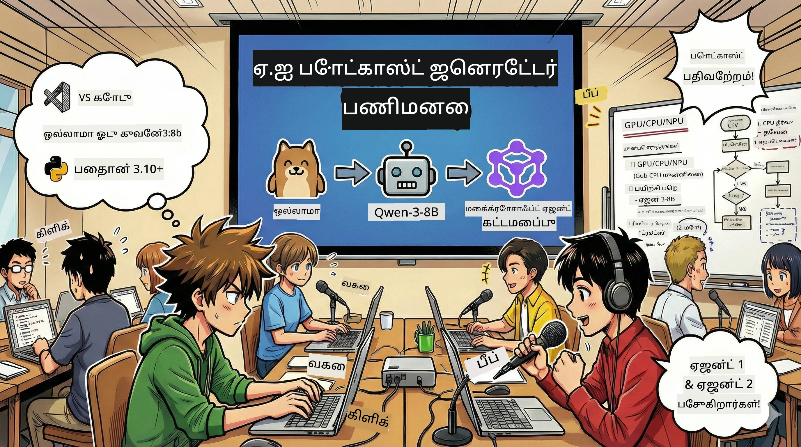

# 🎙️ AI போட்காஸ்ட் ஸ்டுடியோ வேலைசாலை



## உங்கள் பணி

**AI போட்காஸ்ட் ஸ்டுடியோ**-க்கு வரவேற்கிறோம்! நீங்கள் உங்கள் சொந்த தொழில்நுட்ப போட்காஸ்ட் “எதிரி பைட்” வை வெளியிடப் போகிறீர்கள் — ஆனால் இங்கு ஒரு திருப்பம் உள்ளது: நீங்கள் அதை உருவாக்க உதவ ஒரு AI இயக்கப்படும் தயாரிப்பு குழுவை உருவாக்கப்போகிறீர்கள். முடிவில்லா ஆராய்ச்சி, கதை எழுதுதல், ஆடியோ திருத்தல் தேவையில்லை. அதற்கு பதிலாக, நீங்கள் நிரலாக்கத்தின் மூலம் AI சூப்பர் சக்தி உள்ள ஒருச் போட்காஸ்ட் தயாரிப்பாளராக மாறப்போகிறீர்கள்.

## பின்னணி கதை

நீங்கள் உங்கள் நண்பர்களுடன் மிகவும் கூலான தொழில்நுட்ப போக்குகளைப் பற்றி போட்காஸ்டை ஆரம்பிக்க விரும்புகிறீர்கள் என்று கற்பனை செய்க — ஆனால் ஒவ்வொருவரும் படிப்பு, வேலை அல்லது வாழ்க்கையால் பிஸியாக உள்ளனர். ஒரு AI நுண்ணறிவு குழுவை கட்டியமைக்க முடியுமானால் அது கடினமான பணிகளை செய்ய? ஒரு நுண்ணறிவு ஏஜென்ட் ஒரு தலைப்பை ஆராய, மற்றொன்று கதை எழுத, மூன்றாவது ஒருவர் உரையை இயற்கையான மற்றும் ஓட்டமாகிய உரையாடலாக மாற்றுகிறான். இது அறிவியல் புனைவரசா? அதை நிஜமாக மாற்றுவோம்.

## நீங்கள் கற்றுக்கொள்ளப்போகிறீர்கள்

இந்த வேலைசாலை முடிந்தவுடன், நீங்கள் எப்படி செய்வதை தெரிந்து கொள்வீர்கள்:
- 🤖 உங்கள் சொந்த உள்ளூர் AI மாதிரியை அமல்படுத்தவும் (API கட்டணம் இல்லாமல், மேக ஆதரவு இல்லாமல்!)
- 🔧 நடைமுறை சமயத்தில் கூட்டு வேலை செய்யக்கூடிய வல்லுநர் AI நுண்ணறிவு ஏஜென்ட்களை உருவாக்கவும்
- 🎬 ஆராய்ச்சியிலிருந்து ஆடியோ வரை முழுமையான போட்காஸ்ட் தயாரிப்பு ஒழுங்குகளை உருவாக்கவும்

## உங்கள் பயணம்: மூன்று நாடகங்கள்

எந்த சிறந்த கதையினிலும் போல், நமக்கு மூன்று நாடகங்கள் உள்ளன. ஒவ்வொரு நாடகமும் உங்கள் AI போட்காஸ்ட் ஸ்டுடியோவை படிப்படியாக கட்டிக்கொள்வான்:

| அத்தியாயம் | உங்கள் பணி | என்ன நடக்கும் | திறன்களை திறக்கிறது |
|---------|-----------|--------------|----------------|
| **முதல் நாடகம்** | [உங்கள் AI உதவியாளரை அறிமுகப்படுத்துதல்](01.BuildAIAgentWithSLM.md) | உரையாடக்கூடிய, இணையத்தை தேடும், பிரச்னைகள் தீர்க்கக்கூடிய AI நுண்ணறிவு ஏஜென்ட்களை எப்படி உருவாக்குவது என்றதை கண்டுபிடிப்பீர்கள். அவற்றை ஒருபோதும் தூங்காமல் ஆராயும் உதவியாளர்கள் என நினைத்துக் கொள்ளுங்கள். | 🎯 உங்கள் முதல் ஏஜென்டை உருவாக்குதல்<br>🛠️ அதற்கு சூப்பர்சக்திகளை (கருவிகள்!) வழங்குதல்<br>🧠 சிந்திக்க கற்றுத்தருதல்<br>🌐 இணையத்துடன் இணைத்தல் |
| **இரண்டாவது நாடகம்** | [உங்கள் தயாரிப்பு குழுவை உருவாக்குதல்](02.AIAgentOrchestrationAndWorkflows.md) | இப்போது விஷயங்கள் சுவாரசியமாகிறது! பல AI நுண்ணறிவு ஏஜென்ட்கள் உண்மையான போட்காஸ்ட் குழுவ போல இணைந்து வேலை செய்ய நீங்கள் ஒழுங்குபடுத்துவீர்கள். ஒரு ஆராய்ச்சி செய்கிறான், மற்றொன்று எழுதுகிறான், நீங்கள் அங்கீகாரம் அளிப்பீர்கள் — குழு சேர்ந்து கனவுகளை நிறைவேற்றுகிறது. | 🎭 பல ஏஜென்ட்களை ஒருங்கிணைத்தல்<br>🔄 அங்கீகாரம் செய்யும் வேலைப்பாயை உருவாக்குதல்<br>🖥️ DevUI முகப்பை பயன்படுத்தி சோதனை செய்தல்<br>✋ மனித கட்டுப்பாட்டை பராமரித்தல் |
| **மூன்றாவது நாடகம்** | [உங்கள் போட்காஸ்டை உயிர்ப்பிக்கவும்](03.Multi-SpeakerPodcastGenerationWithVibeVoice.md) | கடைசி அத்தியாயம்! உங்கள் உரை கதையை இயற்கையான உரையாடலுடன் உண்மையான போட்காஸ்ட் ஆடியோவாக மாற்றுங்கள். உங்கள் “எதிரி பைட்” போட்காஸ்ட் வெளியீட்டுக்கு தயாராக உள்ளது! | 🎤 உரையை குரலாக்கும் வல்ல்மலம்<br>👥 பல பேச்சாளர் குரல்கள்<br>⏱️ நீண்ட வடிவம் ஆடியோ<br>🚀 முழுமையாக தானியங்கியமை |

ஒவ்வொரு நாடகமும் புதிய திறன்களை திறக்கிறது. நீங்கள் தைரியமாக இருந்தால் தற்செயலாக அணுகலாம், ஆனால் இடைவேளைகளுக்கு படிப்பது பரிந்துரைக்கப்படுகிறது!

## சூழல் தேவைகள்

இந்த வேலைசாலை பல்வேறு ஹார்ட்வேர் சூழல்களை ஆதரிக்கிறது:
- **CPU**: சோதனை மற்றும் சிறிய அளவு பயன்பாட்டிற்குப் பொருத்தமானது
- **GPU**: உற்பத்தி சூழலுக்கு பரிந்துரைக்கப்படுகிறது, கணிப்பு வேகத்தை எதிவர அதிகரிக்கிறது
- **NPU**: அடுத்த தலைமுறை நரம்பியல் செயலியில் விரைவாக்கத்தை ஆதரிக்கிறது

## என்னென்ன தேவை

### மென்பொருள் பட்டியல் ✅
- **Python 3.10+** (உங்கள் நிரலாக்க மொழி)
- **Ollama** (உங்கள் இயந்திரத்தில் AI மாதிரியை இயக்க)
- **VS Code** (உங்கள் குறியீட்டு தொகுப்பி)
- **Python விரிவாக்கம்** (VS Code-ஐ இன்னும் சித்தமிக்க செய்ய)
- **Git** (குறியீட்டை பெற)

### ஹார்ட்வேர் சரிபார்ப்பு 💻
- **நான் இயங்கவா?**: 8GB மெமரி, 10GB கிடைக்கும் இடம் (இயங்கக்கூடியது, ஆனாலும் கொஞ்சம் மெதுவாக இருக்கலாம்)
- **இடமையான அமைப்பு**: 16GB+ மெமரி, நல்ல GPU (மென்மையாக இயங்கி விடும்!)
- **NPU உண்டா?**: அது மிகச் சிறந்தது! அடுத்த தலைமுறை செயல்திறனை திறக்கிறது 🚀

## உங்கள் ஸ்டுடியோவை கட்டவும் 🎬

### படி 1: Python மேம்படுத்தல்

Python 3.10 அல்லது அதற்கு மேற்பட்ட பதிப்பு உள்ளதா என்பதை உறுதி செய்யுங்கள்:

```bash
python --version
# பைதான் 3.10.x அல்லது அதற்கு மேற்பட்ட பதிப்பை காண்பிக்க வேண்டும்
```

Python இல்லையா? [python.org](https://python.org) இருந்து பெறுங்கள் — அது இலவசம்!

### படி 2: Ollama (உங்கள் AI மாதிரி இயக்கி) பெறுதல்

உங்கள் OS க்கு பொருத்தமான Ollama-வை பதிவிறக்கம் செய்ய [ollama.ai](https://ollama.ai) செல். உள்ளூர் AI மாதிரியை இயக்கும் இயந்திரமாக அதை நினைத்துக் கொள்ளுங்கள்.

தயாரா என்று பார்க்க:

```bash
ollama --version
```

### படி 3: உங்கள் AI மூளை பதிவிறக்கம் 🧠

Qwen-3-8B மாதிரியைப் பெற நேரம் வந்துவிட்டது (உங்கள் முதல் AI உதவியாளரை வேலைக்கு வாங்குவது போல):

```bash
ollama pull qwen3:8b
```

*இதற்கு சில நிமிடங்கள் ஆகலாம். சிறந்த காபி நேரம்! ☕*

### படி 4: VS Code அமைக்கல்

இன்னும் இதை இல்லையெனில், [Visual Studio Code](https://code.visualstudio.com/) ஐப் பெறுங்கள். இது சிறந்த குறியீட்டு தொகுப்பி (ஏன் எனில் எதிர்ப்பார்க்க முடியாது 😄).

### படி 5: Python விரிவாக்கம்

VS Code-ல்:
1. `Ctrl+Shift+X` அழுத்தவும் (`Mac`ல் `Cmd+Shift+X`)
2. "Python" ஐ தேடவும்
3. Microsoft Python விரிவாக்கத்தை நிறுவவும்

### படி 6: வெற்றி! 🎉

உண்மையாக, நீங்கள் தயார். AI மீது சில மாயாஜாலங்களை உருவாக்கலாம்!

### படி 7: Microsoft Agent Framework மற்றும் தொடர்புடைய பக்கேஜ்கள் நிறுவல் 📦

வேலைசாலைக்கு தேவையான அனைத்து சார்ந்த நிரலை நிறுவுங்கள்:

```bash
pip install -r ./Installations/requirements.txt -U
```

*இது Microsoft Agent Framework மற்றும் அனைத்து தேவையான பக்கேஜ்களையும் நிறுவும். ஒரு காபி குடித்துக்கொள்ளுங்கள் — முதல்கட்ட நிறுவல் சில நிமிடங்கள் எடுக்கலாம்! ☕*

## வேலைசாலை வழிகாட்டி

உயர்நிலைத் திட்ட அமைப்பு, அமைப்பு படிகள் மற்றும் செயலாக்க முறை வேலைசாலை நேரத்தில் விரிவாக விளக்கப்படும்.

## பிழை சரி செய்வது (பிரச்சினைகள் எழுந்தால்)🔧

### "வேலை, மாதிரி பதிவிறக்கம் மிகவும் மெதுவாக இருக்கு!"
**தீர்வு**: VPN பயன்படுத்தவும் அல்லது Ollama க்கான மிரிரர் மூலங்களை அமைக்கவும். சில நேரங்களில் இணையம் வெகுவாக சரியில்லை.

### "எனது கணினி சரிந்து போறதாய்ச் சொல்றது! மெமரி குறைவு!"
**தீர்வு**: குறைவான மாதிரிக்கு மாற்றவும் அல்லது `num_ctx` அமைப்பைக் குறைக்கவும். உங்கள் AI-க்கு ஓர் குறைந்த உணவு மாதிரியாக நினைக்கவும்.

### "GPU-யை வைத்து வேகமாக்கலாமா?"
**தீர்வு**: Ollama automático GPU கண்டறியும்! உங்கள் GPU டிரைவர் புதுப்பித்திருப்பதை உறுதி பண்ணுங்கள். இலவச வேக வளர்ச்சி! 🏎️

## கூடுதல் வளங்கள் (ஆர்வலோர் க்கானவை)📚

- [Ollama ஆவணங்கள்](https://github.com/ollama/ollama) — உள்ளூர் AI மாதிரிகள் குறித்து ஆழமாக அறிந்து கொள்ள
- [Microsoft Agent Framework](https://microsoft.github.io/autogen/) — நுண்ணறிவு ஏஜென்ட் குழு கட்டமைப்பைப் பற்றி கூடுதல் தகவல்
- [Qwen மாதிரி தகவல்](https://qwenlm.github.io/) — உங்கள் AI உதவியாளரின் மூளை பற்றி அறிய

## உரிமம்

MIT உரிமம் — அருமையானவைகளை உருவாக்க, பகிர்ந்து, உலகத்தை சிறந்தது ஆக்குங்கள்! 🌍

## பங்களிக்க விரும்புகிறீர்களா?

பிழைகளை கண்டுபிடித்தீர்களா? ஐடியாக்கள் உள்ளனவா? Issue அல்லது PR சமர்ப்பிக்கவும்! நாங்கள் சமுதாயத்தை விரும்புகிறோம். ✨

---

<!-- CO-OP TRANSLATOR DISCLAIMER START -->
**புறக்கணிப்பு**:
இந்த ஆவணம் AI மொழி மாற்ற சேவை [Co-op Translator](https://github.com/Azure/co-op-translator) மூலம் மொழிபெயர்க்கப்பட்டுள்ளது. நாங்கள் துல்லியத்திற்காக முயற்சித்தாலும், தானாக மாறும் மொழிபெயர்ப்பு சில தவறுகள் அல்லது விளக்க வகையின்மை கொண்டிருக்கலாம் என்பதற்காக தயவுசெய்து கவனமாக இருக்கவும். தாய் மொழியில் உள்ள செம்மையான ஆவணம் அதிகாரப்பூர்வ ஆதாரமாகக் கருதப்பட வேண்டும். முக்கியமான தகவல்களுக்கு, தொழில்முறை மனித மொழிபெயர்ப்பு பரிந்துரைக்கப்படுகிறது. இந்த மொழி மாற்றத்தினால் ஏற்படும் எந்தவொரு தவறான புரிதலுக்கும் நாங்கள் பொறுப்பேற்க மாட்டோம்.
<!-- CO-OP TRANSLATOR DISCLAIMER END -->