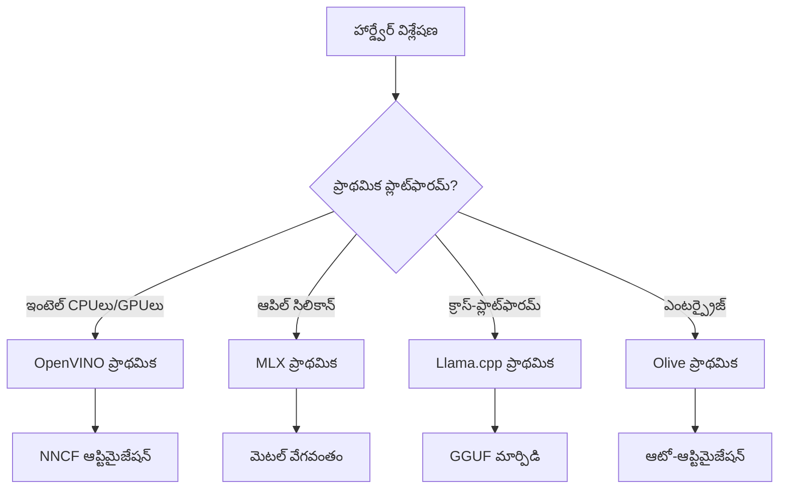
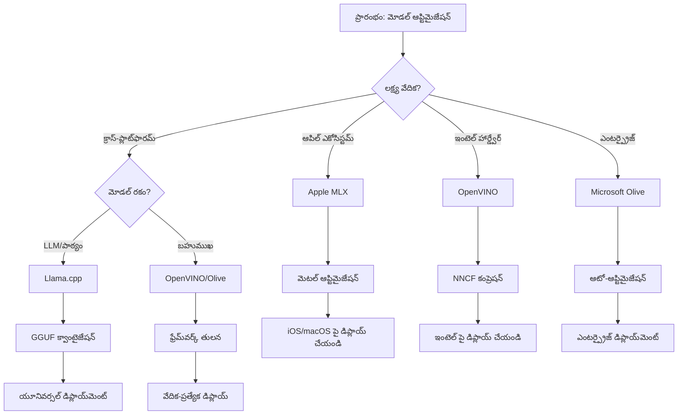
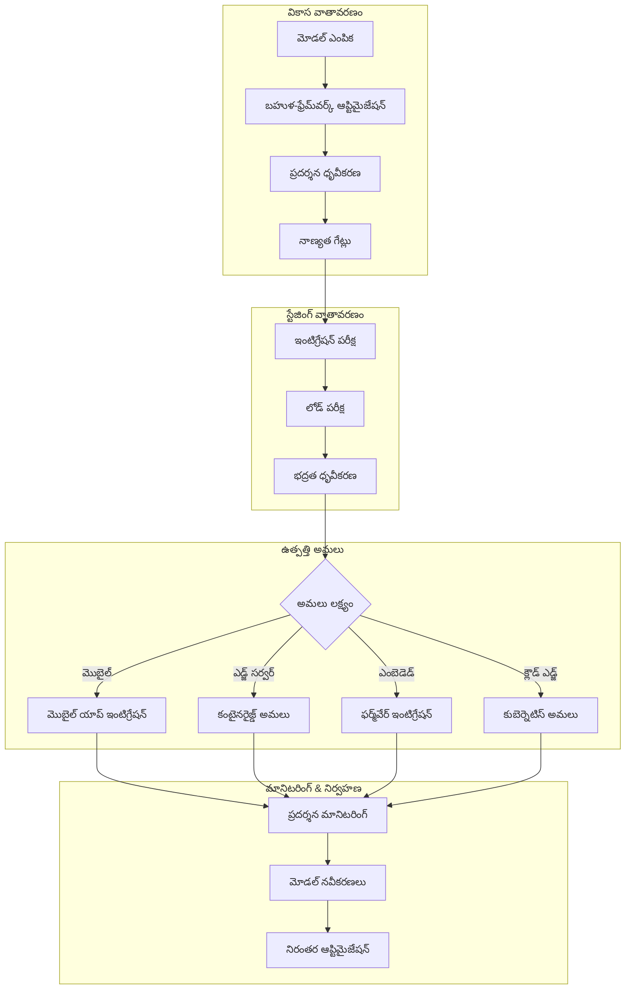

<!--
CO_OP_TRANSLATOR_METADATA:
{
  "original_hash": "6fbccc3e9d5911e3df32090724daac13",
  "translation_date": "2025-12-15T23:43:27+00:00",
  "source_file": "Module04/06.workflow-synthesis.md",
  "language_code": "te"
}
-->
# Section 6: ఎడ్జ్ AI అభివృద్ధి వర్క్‌ఫ్లో సింథసిస్

## Table of Contents
1. [పరిచయం](../../../Module04)
2. [అధ్యయన లక్ష్యాలు](../../../Module04)
3. [ఒకీకృత వర్క్‌ఫ్లో అవలోకనం](../../../Module04)
4. [ఫ్రేమ్‌వర్క్ ఎంపిక మ్యాట్రిక్స్](../../../Module04)
5. [ఉత్తమ ఆచారాలు సింథసిస్](../../../Module04)
6. [డిప్లాయ్‌మెంట్ వ్యూహ మార్గదర్శకం](../../../Module04)
7. [పనితీరు ఆప్టిమైజేషన్ వర్క్‌ఫ్లో](../../../Module04)
8. [ఉత్పత్తి సిద్ధత చెక్లిస్ట్](../../../Module04)
9. [సమస్య పరిష్కారం మరియు మానిటరింగ్](../../../Module04)
10. [మీ ఎడ్జ్ AI పైప్‌లైన్ భవిష్యత్ నిరోధకత](../../../Module04)

## పరిచయం

ఎడ్జ్ AI అభివృద్ధి అనేది అనేక ఆప్టిమైజేషన్ ఫ్రేమ్‌వర్క్‌లు, డిప్లాయ్‌మెంట్ వ్యూహాలు, మరియు హార్డ్‌వేర్ పరిగణనలపై సవాలుతో కూడుకున్న అవగాహనను అవసరం చేస్తుంది. ఈ సమగ్ర సింథసిస్ Llama.cpp, Microsoft Olive, OpenVINO, మరియు Apple MLX నుండి జ్ఞానాన్ని కలిపి, సామర్థ్యాన్ని గరిష్టం చేసే, నాణ్యతను నిలబెట్టుకునే, మరియు విజయవంతమైన ఉత్పత్తి డిప్లాయ్‌మెంట్‌ను నిర్ధారించే ఒక ఏకీకృత వర్క్‌ఫ్లోని సృష్టిస్తుంది.

ఈ కోర్సు మొత్తం, మేము వ్యక్తిగత ఆప్టిమైజేషన్ ఫ్రేమ్‌వర్క్‌లను పరిశీలించాము, ప్రతి ఒక్కటి ప్రత్యేక బలాలు మరియు ప్రత్యేక ఉపయోగాల కేసులతో. అయితే, వాస్తవ ప్రపంచ ఎడ్జ్ AI ప్రాజెక్టులు తరచుగా అనేక ఫ్రేమ్‌వర్క్‌ల నుండి సాంకేతికతలను కలిపి ఉపయోగించాల్సి ఉంటుంది లేదా నిర్దిష్ట పరిమితులు మరియు అవసరాలకు ఉత్తమ ఫలితాలను అందించే దృక్పథాన్ని ఎంచుకోవాల్సి ఉంటుంది.

ఈ విభాగం అన్ని ఫ్రేమ్‌వర్క్‌ల నుండి సేకరించిన జ్ఞానాన్ని కార్యాచరణ వర్క్‌ఫ్లోలు, నిర్ణయ వృక్షాలు, మరియు ఉత్తమ ఆచారాలుగా సింథసైజ్ చేస్తుంది, తద్వారా మీరు ఉత్పత్తి సిద్ధమైన ఎడ్జ్ AI పరిష్కారాలను సమర్థవంతంగా మరియు ప్రభావవంతంగా నిర్మించగలుగుతారు. మీరు మొబైల్ పరికరాలు, ఎంబెడ్డెడ్ సిస్టమ్స్, లేదా ఎడ్జ్ సర్వర్ల కోసం ఆప్టిమైజ్ చేస్తున్నా, ఈ మార్గదర్శకం మీ అభివృద్ధి జీవనచక్రం అంతటా సమాచారపూర్వక నిర్ణయాలు తీసుకోవడానికి వ్యూహాత్మక ఫ్రేమ్‌వర్క్‌ను అందిస్తుంది.

## అధ్యయన లక్ష్యాలు

ఈ విభాగం ముగిసే వరకు, మీరు చేయగలుగుతారు:

### వ్యూహాత్మక నిర్ణయాలు తీసుకోవడం
- ప్రాజెక్ట్ అవసరాలు, హార్డ్‌వేర్ పరిమితులు, మరియు డిప్లాయ్‌మెంట్ పరిస్థితుల ఆధారంగా ఉత్తమ ఆప్టిమైజేషన్ ఫ్రేమ్‌వర్క్‌ను **అంచనా వేసి ఎంచుకోవడం**
- గరిష్ట సామర్థ్యానికి అనేక ఆప్టిమైజేషన్ సాంకేతికతలను **ఒకీకృత వర్క్‌ఫ్లోలుగా రూపకల్పన చేయడం**
- వివిధ ఫ్రేమ్‌వర్క్‌లలో మోడల్ ఖచ్చితత్వం, ఇన్ఫరెన్స్ వేగం, మెమరీ వినియోగం, మరియు డిప్లాయ్‌మెంట్ సంక్లిష్టత మధ్య **వ్యాపారాలు అంచనా వేయడం**

### వర్క్‌ఫ్లో సమగ్రత
- అనేక ఆప్టిమైజేషన్ ఫ్రేమ్‌వర్క్‌ల బలాలను ఉపయోగించే **ఒకీకృత అభివృద్ధి పైప్‌లైన్లను అమలు చేయడం**
- వివిధ వాతావరణాలలో స్థిరమైన మోడల్ ఆప్టిమైజేషన్ మరియు డిప్లాయ్‌మెంట్ కోసం **పునరుత్పాదక వర్క్‌ఫ్లోలను సృష్టించడం**
- ఆప్టిమైజ్ చేసిన మోడల్స్ ఉత్పత్తి అవసరాలను తీరుస్తున్నాయని నిర్ధారించడానికి **నాణ్యత గేట్లు మరియు ధృవీకరణ ప్రక్రియలను స్థాపించడం**

### పనితీరు ఆప్టిమైజేషన్
- క్వాంటైజేషన్, ప్రూనింగ్, మరియు హార్డ్‌వేర్-ప్రత్యేక వేగవంతీకరణ సాంకేతికతలను ఉపయోగించి **వ్యవస్థాత్మక ఆప్టిమైజేషన్ వ్యూహాలను వర్తించడం**
- వివిధ ఆప్టిమైజేషన్ స్థాయిలు మరియు డిప్లాయ్‌మెంట్ లక్ష్యాలపై మోడల్ పనితీరును **మానిటర్ చేసి బెంచ్‌మార్క్ చేయడం**
- CPU, GPU, NPU, మరియు ప్రత్యేక ఎడ్జ్ వేగవంతీకరణ పరికరాలను సహా **నిర్దిష్ట హార్డ్‌వేర్ ప్లాట్‌ఫారమ్‌ల కోసం ఆప్టిమైజ్ చేయడం**

### ఉత్పత్తి డిప్లాయ్‌మెంట్
- అనేక మోడల్ ఫార్మాట్లు మరియు ఇన్ఫరెన్స్ ఇంజన్లను అనుకూలించే **స్కేలబుల్ డిప్లాయ్‌మెంట్ ఆర్కిటెక్చర్లను రూపకల్పన చేయడం**
- ఉత్పత్తి వాతావరణాలలో ఎడ్జ్ AI అనువర్తనాల కోసం **మానిటరింగ్ మరియు ఆబ్జర్వబిలిటీని అమలు చేయడం**
- మోడల్ నవీకరణలు, పనితీరు మానిటరింగ్, మరియు సిస్టమ్ ఆప్టిమైజేషన్ కోసం **నిరంతర నిర్వహణ వర్క్‌ఫ్లోలను స్థాపించడం**

### క్రాస్-ప్లాట్‌ఫారమ్ ఉత్తమత
- వివిధ హార్డ్‌వేర్ ప్లాట్‌ఫారమ్‌లపై **ఆప్టిమైజ్ చేసిన మోడల్స్‌ను డిప్లాయ్ చేయడం** మరియు స్థిరమైన పనితీరును నిలబెట్టుకోవడం
- Windows, macOS, Linux, మొబైల్, మరియు ఎంబెడ్డెడ్ సిస్టమ్స్ కోసం **ప్లాట్‌ఫారమ్-ప్రత్యేక ఆప్టిమైజేషన్లను నిర్వహించడం**
- వివిధ ఎడ్జ్ వాతావరణాలలో సులభంగా డిప్లాయ్‌మెంట్ కోసం **అబ్స్ట్రాక్షన్ లేయర్లను సృష్టించడం**

## ఒకీకృత వర్క్‌ఫ్లో అవలోకనం

### దశ 1: అవసరాల విశ్లేషణ మరియు ఫ్రేమ్‌వర్క్ ఎంపిక

విజయవంతమైన ఎడ్జ్ AI డిప్లాయ్‌మెంట్ యొక్క పునాది, ఫ్రేమ్‌వర్క్ ఎంపిక మరియు ఆప్టిమైజేషన్ వ్యూహాన్ని సూచించే సమగ్ర అవసరాల విశ్లేషణతో ప్రారంభమవుతుంది.

#### 1.1 హార్డ్‌వేర్ అంచనా

**ప్రధాన పరిగణనలు:**
- **CPU ఆర్కిటెక్చర్**: x86, ARM, Apple Silicon సామర్థ్యాలు
- **వేగవంతీకరణ అందుబాటు**: GPU, NPU, VPU, ప్రత్యేక AI చిప్స్
- **మెమరీ పరిమితులు**: RAM పరిమితులు, నిల్వ సామర్థ్యం
- **పవర్ బడ్జెట్**: బ్యాటరీ జీవితం, థర్మల్ పరిమితులు
- **కనెక్టివిటీ**: ఆఫ్‌లైన్ అవసరాలు, బ్యాండ్‌విడ్ పరిమితులు

#### 1.2 అప్లికేషన్ అవసరాల మ్యాట్రిక్స్

| అవసరం | Llama.cpp | Microsoft Olive | OpenVINO | Apple MLX |
|-------------|-----------|-----------------|----------|-----------|
| క్రాస్-ప్లాట్‌ఫారమ్ | ✅ అద్భుతం | ⚡ మంచి | ⚡ మంచి | ❌ కేవలం ఆపిల్ |
| ఎంటర్ప్రైజ్ ఇంటిగ్రేషన్ | ⚡ ప్రాథమికం | ✅ అద్భుతం | ✅ అద్భుతం | ⚡ పరిమితం |
| మొబైల్ డిప్లాయ్‌మెంట్ | ✅ అద్భుతం | ⚡ మంచి | ⚡ మంచి | ✅ iOS అద్భుతం |
| రియల్-టైమ్ ఇన్ఫరెన్స్ | ✅ అద్భుతం | ✅ అద్భుతం | ✅ అద్భుతం | ✅ అద్భుతం |
| మోడల్ వైవిధ్యం | ✅ LLM ఫోకస్ | ✅ అన్ని మోడల్స్ | ✅ అన్ని మోడల్స్ | ✅ LLM ఫోకస్ |
| ఉపయోగంలో సౌలభ్యం | ✅ సులభం | ✅ ఆటోమేటెడ్ | ⚡ మోస్తరు | ✅ సులభం |

### దశ 2: మోడల్ సిద్ధం మరియు ఆప్టిమైజేషన్

#### 2.1 యూనివర్సల్ మోడల్ అంచనా పైప్‌లైన్

```python
# విశ్వవ్యాప్త మోడల్ అంచనా ఫ్రేమ్‌వర్క్
class EdgeAIModelAssessment:
    def __init__(self, model_path, target_hardware):
        self.model_path = model_path
        self.target_hardware = target_hardware
        self.optimization_frameworks = []
        
    def assess_model_characteristics(self):
        """Analyze model size, architecture, and complexity"""
        return {
            'model_size': self.get_model_size(),
            'parameter_count': self.get_parameter_count(),
            'architecture_type': self.detect_architecture(),
            'quantization_compatibility': self.check_quantization_support()
        }
    
    def recommend_optimization_strategy(self):
        """Recommend optimal frameworks and techniques"""
        characteristics = self.assess_model_characteristics()
        
        if self.target_hardware.startswith('apple'):
            return self.mlx_optimization_strategy(characteristics)
        elif self.target_hardware.startswith('intel'):
            return self.openvino_optimization_strategy(characteristics)
        elif characteristics['model_size'] > 7_000_000_000:  # 7B+ పారామితులు
            return self.enterprise_optimization_strategy(characteristics)
        else:
            return self.lightweight_optimization_strategy(characteristics)
```

#### 2.2 బహుళ-ఫ్రేమ్‌వర్క్ ఆప్టిమైజేషన్ పైప్‌లైన్

**క్రమబద్ధమైన ఆప్టిమైజేషన్ దృక్పథం:**
1. **ప్రాథమిక మార్పిడి**: మధ్యవర్తి ఫార్మాట్‌కు మార్పిడి (సాధ్యమైనప్పుడు ONNX)
2. **ఫ్రేమ్‌వర్క్-ప్రత్యేక ఆప్టిమైజేషన్**: ప్రత్యేక సాంకేతికతలను వర్తించడం
3. **క్రాస్-వాలిడేషన్**: లక్ష్య ప్లాట్‌ఫారమ్‌లపై పనితీరును ధృవీకరించడం
4. **చివరి ప్యాకేజింగ్**: డిప్లాయ్‌మెంట్ కోసం సిద్ధం చేయడం

```bash
# బహుళ-ఫ్రేమ్‌వర్క్ ఆప్టిమైజేషన్ స్క్రిప్ట్
#!/bin/bash

MODEL_NAME="phi-3-mini"
BASE_MODEL="microsoft/Phi-3-mini-4k-instruct"

# దశ 1: ONNX మార్పిడి (సార్వత్రిక)
python convert_to_onnx.py --model $BASE_MODEL --output models/onnx/

# దశ 2: ప్లాట్‌ఫారమ్-ప్రత్యేక ఆప్టిమైజేషన్
if [[ "$TARGET_PLATFORM" == "intel" ]]; then
    # OpenVINO ఆప్టిమైజేషన్
    python optimize_openvino.py --input models/onnx/ --output models/openvino/
elif [[ "$TARGET_PLATFORM" == "apple" ]]; then
    # MLX ఆప్టిమైజేషన్
    python optimize_mlx.py --input $BASE_MODEL --output models/mlx/
elif [[ "$TARGET_PLATFORM" == "cross" ]]; then
    # Llama.cpp ఆప్టిమైజేషన్
    python convert_to_gguf.py --input models/onnx/ --output models/gguf/
fi

# దశ 3: ధృవీకరణ
python validate_optimization.py --original $BASE_MODEL --optimized models/$TARGET_PLATFORM/
```

### దశ 3: పనితీరు ధృవీకరణ మరియు బెంచ్‌మార్కింగ్

#### 3.1 సమగ్ర బెంచ్‌మార్కింగ్ ఫ్రేమ్‌వర్క్

```python
class EdgeAIBenchmark:
    def __init__(self, optimized_models):
        self.models = optimized_models
        self.metrics = {
            'inference_time': [],
            'memory_usage': [],
            'accuracy_score': [],
            'throughput': [],
            'energy_consumption': []
        }
    
    def run_comprehensive_benchmark(self):
        """Execute standardized benchmarks across all optimized models"""
        test_inputs = self.generate_test_inputs()
        
        for model_framework, model_path in self.models.items():
            print(f"Benchmarking {model_framework}...")
            
            # ఆలస్యం పరీక్ష
            latency = self.measure_inference_latency(model_path, test_inputs)
            
            # మెమరీ ప్రొఫైలింగ్
            memory = self.profile_memory_usage(model_path)
            
            # ఖచ్చితత్వం ధృవీకరణ
            accuracy = self.validate_model_accuracy(model_path, test_inputs)
            
            # ఉత్పత్తి విశ్లేషణ
            throughput = self.measure_throughput(model_path)
            
            self.record_metrics(model_framework, latency, memory, accuracy, throughput)
    
    def generate_optimization_report(self):
        """Create comprehensive comparison report"""
        report = {
            'recommendations': self.analyze_performance_trade_offs(),
            'deployment_guidance': self.generate_deployment_recommendations(),
            'monitoring_requirements': self.define_monitoring_metrics()
        }
        return report
```

## ఫ్రేమ్‌వర్క్ ఎంపిక మ్యాట్రిక్స్

### ఫ్రేమ్‌వర్క్ ఎంపిక కోసం నిర్ణయ వృక్షం


### సమగ్ర ఎంపిక ప్రమాణాలు

#### 1. ప్రాథమిక ఉపయోగ కేసు సరిపోలిక

**లార్జ్ లాంగ్వేజ్ మోడల్స్ (LLMs):**
- **Llama.cpp**: CPU-కేంద్రీకృత, క్రాస్-ప్లాట్‌ఫారమ్ డిప్లాయ్‌మెంట్‌కు ఉత్తమం
- **Apple MLX**: యూనిఫైడ్ మెమరీతో ఆపిల్ సిలికాన్‌కు ఆప్టిమల్
- **OpenVINO**: NNCF ఆప్టిమైజేషన్‌తో ఇంటెల్ హార్డ్‌వేర్‌కు అద్భుతం
- **Microsoft Olive**: ఆటోమేషన్‌తో ఎంటర్ప్రైజ్ వర్క్‌ఫ్లోలకు సరైనది

**బహుళ-మోడ్ మోడల్స్:**
- **OpenVINO**: విజన్, ఆడియో, మరియు టెక్స్ట్‌కు సమగ్ర మద్దతు
- **Microsoft Olive**: సంక్లిష్ట పైప్‌లైన్ల కోసం ఎంటర్ప్రైజ్-గ్రేడ్ ఆప్టిమైజేషన్
- **Llama.cpp**: టెక్స్ట్-ఆధారిత మోడల్స్‌కు పరిమితం
- **Apple MLX**: బహుళ-మోడ్ అనువర్తనాల కోసం పెరుగుతున్న మద్దతు

#### 2. హార్డ్‌వేర్ ప్లాట్‌ఫారమ్ మ్యాట్రిక్స్

| ప్లాట్‌ఫారమ్ | ప్రాథమిక ఫ్రేమ్‌వర్క్ | ద్వితీయ ఎంపిక | ప్రత్యేక లక్షణాలు |
|----------|------------------|------------------|---------------------|
| ఇంటెల్ CPU/GPU | OpenVINO | Microsoft Olive | NNCF కంప్రెషన్, ఇంటెల్ ఆప్టిమైజేషన్ |
| NVIDIA GPU | Microsoft Olive | OpenVINO | CUDA వేగవంతీకరణ, ఎంటర్ప్రైజ్ ఫీచర్లు |
| ఆపిల్ సిలికాన్ | Apple MLX | Llama.cpp | మెటల్ షేడర్స్, యూనిఫైడ్ మెమరీ |
| ARM మొబైల్ | Llama.cpp | OpenVINO | క్రాస్-ప్లాట్‌ఫారమ్, కనిష్ట ఆధారాలు |
| ఎడ్జ్ TPU | OpenVINO | Microsoft Olive | ప్రత్యేక వేగవంతీకరణ మద్దతు |
| ఎంబెడ్డెడ్ ARM | Llama.cpp | OpenVINO | కనిష్ట ఫుట్‌ప్రింట్, సమర్థవంతమైన ఇన్ఫరెన్స్ |

#### 3. అభివృద్ధి వర్క్‌ఫ్లో ప్రాధాన్యతలు

**త్వరిత ప్రోటోటైపింగ్:**
1. **Llama.cpp**: అత్యంత వేగవంతమైన సెటప్, తక్షణ ఫలితాలు
2. **Apple MLX**: సులభమైన Python API, త్వరిత పునరావృతం
3. **Microsoft Olive**: ఆటోమేటెడ్ ఆప్టిమైజేషన్, కనిష్ట కాన్ఫిగరేషన్
4. **OpenVINO**: మరింత సంక్లిష్ట సెటప్, సమగ్ర ఫీచర్లు

**ఎంటర్ప్రైజ్ ఉత్పత్తి:**
1. **Microsoft Olive**: ఎంటర్ప్రైజ్ ఫీచర్లు, Azure ఇంటిగ్రేషన్
2. **OpenVINO**: ఇంటెల్ ఎకోసిస్టమ్, సమగ్ర టూల్స్
3. **Apple MLX**: ఆపిల్-ప్రత్యేక ఎంటర్ప్రైజ్ అనువర్తనాలు
4. **Llama.cpp**: సులభమైన డిప్లాయ్‌మెంట్, పరిమిత ఎంటర్ప్రైజ్ ఫీచర్లు

## ఉత్తమ ఆచారాలు సింథసిస్

### యూనివర్సల్ ఆప్టిమైజేషన్ సూత్రాలు

#### 1. ప్రగతిశీల ఆప్టిమైజేషన్ వ్యూహం

```python
class ProgressiveOptimization:
    def __init__(self, base_model):
        self.base_model = base_model
        self.optimization_stages = [
            'baseline_measurement',
            'format_conversion',
            'quantization_optimization',
            'hardware_acceleration',
            'production_validation'
        ]
    
    def execute_progressive_optimization(self):
        """Apply optimization techniques incrementally"""
        
        # దశ 1: ప్రాథమిక కొలత
        baseline_metrics = self.measure_baseline_performance()
        
        # దశ 2: ఫార్మాట్ మార్పిడి
        converted_model = self.convert_to_optimal_format()
        conversion_metrics = self.measure_performance(converted_model)
        
        # దశ 3: పరిమాణీకరణ
        quantized_model = self.apply_quantization(converted_model)
        quantization_metrics = self.measure_performance(quantized_model)
        
        # దశ 4: హార్డ్‌వేర్ వేగవంతం
        accelerated_model = self.enable_hardware_acceleration(quantized_model)
        acceleration_metrics = self.measure_performance(accelerated_model)
        
        # దశ 5: ధృవీకరణ
        production_ready = self.validate_for_production(accelerated_model)
        
        return self.compile_optimization_report(
            baseline_metrics, conversion_metrics, 
            quantization_metrics, acceleration_metrics
        )
```

#### 2. నాణ్యత గేట్ అమలు

**ఖచ్చితత్వ పరిరక్షణ గేట్లు:**
- అసలు మోడల్ ఖచ్చితత్వం >95% నిలుపుకోవడం
- ప్రాతినిధ్యాత్మక పరీక్ష డేటాసెట్‌లపై ధృవీకరణ
- ఉత్పత్తి ధృవీకరణ కోసం A/B పరీక్షలు అమలు

**పనితీరు మెరుగుదల గేట్లు:**
- కనీసం 2x వేగం మెరుగుదల సాధించడం
- మెమరీ ఫుట్‌ప్రింట్‌ను కనీసం 50% తగ్గించడం
- ఇన్ఫరెన్స్ సమయ స్థిరత్వాన్ని ధృవీకరించడం

**ఉత్పత్తి సిద్ధత గేట్లు:**
- లోడ్ కింద స్ట్రెస్ టెస్టింగ్ పాస్ అవడం
- సమయానుకూలంగా స్థిరమైన పనితీరు ప్రదర్శించడం
- భద్రత మరియు గోప్యతా అవసరాలను ధృవీకరించడం

### ఫ్రేమ్‌వర్క్-ప్రత్యేక ఉత్తమ ఆచారాల సమగ్రత

#### 1. క్వాంటైజేషన్ వ్యూహ సింథసిస్

```python
# ఏకీకృత పరిమాణీకరణ దృష్టికోణం
class UnifiedQuantizationStrategy:
    def __init__(self, model, target_platform):
        self.model = model
        self.platform = target_platform
        
    def select_optimal_quantization(self):
        """Choose best quantization based on platform and requirements"""
        
        if self.platform == 'apple_silicon':
            return self.mlx_quantization_strategy()
        elif self.platform == 'intel_hardware':
            return self.openvino_quantization_strategy()
        elif self.platform == 'cross_platform':
            return self.llamacpp_quantization_strategy()
        else:
            return self.olive_quantization_strategy()
    
    def mlx_quantization_strategy(self):
        """Apple MLX-specific quantization"""
        return {
            'method': 'mlx_quantize',
            'precision': 'int4',
            'group_size': 64,
            'optimization_target': 'unified_memory'
        }
    
    def openvino_quantization_strategy(self):
        """OpenVINO NNCF quantization"""
        return {
            'method': 'nncf_quantize',
            'precision': 'int8',
            'calibration_method': 'post_training',
            'optimization_target': 'intel_hardware'
        }
```

#### 2. హార్డ్‌వేర్ వేగవంతీకరణ ఆప్టిమైజేషన్

**CPU ఆప్టిమైజేషన్ సింథసిస్:**
- **SIMD సూచనలు**: ఫ్రేమ్‌వర్క్‌లలో ఆప్టిమైజ్డ్ కర్నెల్‌లను ఉపయోగించడం
- **మెమరీ బ్యాండ్‌విడ్**: క్యాష్ సామర్థ్యానికి డేటా లేఅవుట్‌లను ఆప్టిమైజ్ చేయడం
- **థ్రెడింగ్**: వనరుల పరిమితులతో సమతుల్యతగా ప్యారలలిజం నిర్వహించడం

**GPU వేగవంతీకరణ ఉత్తమ ఆచారాలు:**
- **బ్యాచ్ ప్రాసెసింగ్**: సరైన బ్యాచ్ పరిమాణాలతో గరిష్ట థ్రూపుట్ సాధించడం
- **మెమరీ నిర్వహణ**: GPU మెమరీ కేటాయింపు మరియు ట్రాన్స్ఫర్‌లను ఆప్టిమైజ్ చేయడం
- **ఖచ్చితత్వం**: మెరుగైన పనితీరు కోసం FP16 ఉపయోగించడం (మద్దతు ఉన్నప్పుడు)

**NPU/ప్రత్యేక వేగవంతీకరణ ఆప్టిమైజేషన్:**
- **మోడల్ ఆర్కిటెక్చర్**: వేగవంతీకరణ సామర్థ్యాలకు అనుగుణంగా ఉండటం
- **డేటా ఫ్లో**: వేగవంతీకరణ సామర్థ్యానికి ఇన్పుట్/అవుట్పుట్ పైప్‌లైన్లను ఆప్టిమైజ్ చేయడం
- **ఫాల్‌బ్యాక్ వ్యూహాలు**: మద్దతు లేని ఆపరేషన్ల కోసం CPU ఫాల్‌బ్యాక్ అమలు

## డిప్లాయ్‌మెంట్ వ్యూహ మార్గదర్శకం

### యూనివర్సల్ డిప్లాయ్‌మెంట్ ఆర్కిటెక్చర్


### ప్లాట్‌ఫారమ్-ప్రత్యేక డిప్లాయ్‌మెంట్ నమూనాలు

#### 1. మొబైల్ డిప్లాయ్‌మెంట్ వ్యూహం

```yaml
# Mobile Deployment Configuration
mobile_deployment:
  ios:
    framework: apple_mlx
    optimization:
      quantization: int4
      memory_mapping: true
      background_execution: limited
    packaging:
      format: mlx
      bundle_size: <50MB
      
  android:
    framework: llama_cpp
    optimization:
      quantization: q4_k_m
      threading: android_optimized
      memory_management: conservative
    packaging:
      format: gguf
      apk_size: <100MB
      
  cross_platform:
    framework: onnx_runtime
    optimization:
      quantization: int8
      execution_provider: cpu
    packaging:
      format: onnx
      shared_libraries: minimal
```

#### 2. ఎడ్జ్ సర్వర్ డిప్లాయ్‌మెంట్

```yaml
# Edge Server Deployment Configuration
edge_server:
  intel_based:
    framework: openvino
    optimization:
      quantization: int8
      acceleration: cpu_gpu_auto
      batch_processing: dynamic
    deployment:
      container: openvino_runtime
      orchestration: kubernetes
      scaling: horizontal
      
  nvidia_based:
    framework: microsoft_olive
    optimization:
      quantization: int4
      acceleration: cuda
      tensor_parallelism: true
    deployment:
      container: nvidia_triton
      orchestration: kubernetes
      scaling: gpu_aware
```

### కంటైనరైజేషన్ ఉత్తమ ఆచారాలు

```dockerfile
# Multi-Framework Edge AI Container
FROM ubuntu:22.04 as base

# Install common dependencies
RUN apt-get update && apt-get install -y \
    python3 \
    python3-pip \
    build-essential \
    cmake \
    && rm -rf /var/lib/apt/lists/*

# Framework-specific stages
FROM base as openvino
RUN pip install openvino nncf optimum[intel]

FROM base as llamacpp
RUN git clone https://github.com/ggerganov/llama.cpp.git \
    && cd llama.cpp && make LLAMA_OPENBLAS=1

FROM base as olive
RUN pip install olive-ai[auto-opt] onnxruntime-genai

# Production stage with selected framework
FROM openvino as production
COPY models/ /app/models/
COPY src/ /app/src/
WORKDIR /app

EXPOSE 8080
CMD ["python3", "src/inference_server.py"]
```

## పనితీరు ఆప్టిమైజేషన్ వర్క్‌ఫ్లో

### వ్యవస్థాత్మక పనితీరు ట్యూనింగ్

#### 1. పనితీరు ప్రొఫైలింగ్ పైప్‌లైన్

```python
class EdgeAIPerformanceProfiler:
    def __init__(self, model_path, framework):
        self.model_path = model_path
        self.framework = framework
        self.profiling_results = {}
    
    def comprehensive_profiling(self):
        """Execute comprehensive performance analysis"""
        
        # CPU ప్రొఫైలింగ్
        cpu_profile = self.profile_cpu_usage()
        
        # మెమరీ ప్రొఫైలింగ్
        memory_profile = self.profile_memory_usage()
        
        # ఇన్ఫరెన్స్ లేటెన్సీ
        latency_profile = self.profile_inference_latency()
        
        # థ్రూపుట్ విశ్లేషణ
        throughput_profile = self.profile_throughput()
        
        # శక్తి వినియోగం (ఉపలబ్ధి ఉన్న చోట)
        energy_profile = self.profile_energy_consumption()
        
        return self.compile_performance_report(
            cpu_profile, memory_profile, latency_profile,
            throughput_profile, energy_profile
        )
    
    def identify_bottlenecks(self):
        """Automatically identify performance bottlenecks"""
        bottlenecks = []
        
        if self.profiling_results['cpu_utilization'] > 80:
            bottlenecks.append('cpu_bound')
        
        if self.profiling_results['memory_usage'] > 90:
            bottlenecks.append('memory_bound')
        
        if self.profiling_results['inference_variance'] > 20:
            bottlenecks.append('inconsistent_performance')
        
        return self.generate_optimization_recommendations(bottlenecks)
```

#### 2. ఆటోమేటెడ్ ఆప్టిమైజేషన్ పైప్‌లైన్

```python
class AutomatedOptimizationPipeline:
    def __init__(self, base_model, target_constraints):
        self.base_model = base_model
        self.constraints = target_constraints
        self.optimization_history = []
    
    def execute_optimization_search(self):
        """Systematically search optimization space"""
        
        optimization_candidates = [
            {'quantization': 'int8', 'pruning': 0.1},
            {'quantization': 'int4', 'pruning': 0.2},
            {'quantization': 'int8', 'acceleration': 'gpu'},
            {'quantization': 'int4', 'acceleration': 'npu'}
        ]
        
        best_configuration = None
        best_score = 0
        
        for config in optimization_candidates:
            optimized_model = self.apply_optimization(config)
            score = self.evaluate_optimization(optimized_model)
            
            if score > best_score and self.meets_constraints(optimized_model):
                best_score = score
                best_configuration = config
            
            self.optimization_history.append({
                'config': config,
                'score': score,
                'model': optimized_model
            })
        
        return best_configuration, self.optimization_history
```

### బహుళ-లక్ష్య ఆప్టిమైజేషన్

#### 1. ఎడ్జ్ AI కోసం పారెటో ఆప్టిమైజేషన్

```python
class ParetoOptimization:
    def __init__(self, objectives=['speed', 'accuracy', 'memory']):
        self.objectives = objectives
        self.pareto_frontier = []
    
    def find_pareto_optimal_solutions(self, optimization_results):
        """Identify Pareto-optimal configurations"""
        
        for result in optimization_results:
            is_dominated = False
            
            for frontier_point in self.pareto_frontier:
                if self.dominates(frontier_point, result):
                    is_dominated = True
                    break
            
            if not is_dominated:
                # ఫ్రంట్‌లైన్ నుండి ఆధిపత్యం ఉన్న పాయింట్లను తీసివేయండి
                self.pareto_frontier = [
                    point for point in self.pareto_frontier 
                    if not self.dominates(result, point)
                ]
                
                self.pareto_frontier.append(result)
        
        return self.pareto_frontier
    
    def recommend_configuration(self, user_preferences):
        """Recommend configuration based on user preferences"""
        
        weighted_scores = []
        for config in self.pareto_frontier:
            score = sum(
                user_preferences[obj] * config['metrics'][obj] 
                for obj in self.objectives
            )
            weighted_scores.append((score, config))
        
        return max(weighted_scores, key=lambda x: x[0])[1]
```

## ఉత్పత్తి సిద్ధత చెక్లిస్ట్

### సమగ్ర ఉత్పత్తి ధృవీకరణ

#### 1. మోడల్ నాణ్యత హామీ

```python
class ProductionReadinessValidator:
    def __init__(self, optimized_model, production_requirements):
        self.model = optimized_model
        self.requirements = production_requirements
        self.validation_results = {}
    
    def validate_model_quality(self):
        """Comprehensive model quality validation"""
        
        # ఖచ్చితత్వం ధృవీకరణ
        accuracy_result = self.validate_accuracy()
        
        # పనితీరు ధృవీకరణ
        performance_result = self.validate_performance()
        
        # దృఢత్వం పరీక్ష
        robustness_result = self.validate_robustness()
        
        # భద్రతా మూల్యాంకనం
        security_result = self.validate_security()
        
        # అనుగుణత నిర్ధారణ
        compliance_result = self.validate_compliance()
        
        return self.compile_validation_report(
            accuracy_result, performance_result, robustness_result,
            security_result, compliance_result
        )
    
    def generate_certification_report(self):
        """Generate production certification report"""
        return {
            'model_signature': self.generate_model_signature(),
            'validation_timestamp': datetime.now(),
            'validation_results': self.validation_results,
            'deployment_approval': self.check_deployment_approval(),
            'monitoring_requirements': self.define_monitoring_requirements()
        }
```

#### 2. ఉత్పత్తి డిప్లాయ్‌మెంట్ చెక్లిస్ట్

**డిప్లాయ్‌మెంట్ ముందు ధృవీకరణ:**
- [ ] మోడల్ ఖచ్చితత్వం కనీస అవసరాలు తీరుస్తోంది (>95% బేస్‌లైన్)
- [ ] పనితీరు లక్ష్యాలు సాధించబడ్డాయి (లేటెన్సీ, థ్రూపుట్, మెమరీ)
- [ ] భద్రతా లోపాలు అంచనా వేసి పరిష్కరించబడ్డాయి
- [ ] అంచనా వేసిన లోడ్ కింద స్ట్రెస్ టెస్టింగ్ పూర్తయింది
- [ ] వైఫల్య పరిస్థితులు పరీక్షించబడ్డాయి మరియు పునరుద్ధరణ ప్రక్రియలు ధృవీకరించబడ్డాయి
- [ ] మానిటరింగ్ మరియు అలర్టింగ్ సిస్టమ్స్ కాన్ఫిగర్ చేయబడ్డాయి
- [ ] రోల్‌బ్యాక్ ప్రక్రియలు పరీక్షించబడ్డాయి మరియు డాక్యుమెంట్ చేయబడ్డాయి

**డిప్లాయ్‌మెంట్ ప్రక్రియ:**
- [ ] బ్లూ-గ్రీన్ డిప్లాయ్‌మెంట్ వ్యూహం అమలు చేయబడింది
- [ ] మెల్లగా ట్రాఫిక్ పెంపు కాన్ఫిగర్ చేయబడింది
- [ ] రియల్-టైమ్ మానిటరింగ్ డాష్‌బోర్డ్లు సక్రియంగా ఉన్నాయి
- [ ] పనితీరు బేస్‌లైన్లు స్థాపించబడ్డాయి
- [ ] లోపాల రేటు పరిమితులు నిర్వచించబడ్డాయి
- [ ] ఆటోమేటెడ్ రోల్‌బ్యాక్ ట్రిగ్గర్లు కాన్ఫిగర్ చేయబడ్డాయి

**డిప్లాయ్‌మెంట్ తర్వాత మానిటరింగ్:**
- [ ] మోడల్ డ్రిఫ్ట్ గుర్తింపు సక్రియంగా ఉంది
- [ ] పనితీరు తగ్గుదల అలర్ట్లు కాన్ఫిగర్ చేయబడ్డాయి
- [ ] వనరు వినియోగం మానిటరింగ్ ప్రారంభించబడింది
- [ ] వినియోగదారు అనుభవ మెట్రిక్స్ ట్రాక్ చేయబడుతున్నాయి
- [ ] మోడల్ వెర్షనింగ్ మరియు లినియేజ్ నిర్వహించబడుతోంది
- [ ] నియమిత మోడల్ పనితీరు సమీక్షలు షెడ్యూల్ చేయబడ్డాయి

### నిరంతర ఇంటిగ్రేషన్/నిరంతర డిప్లాయ్‌మెంట్ (CI/CD)

```yaml
# Edge AI CI/CD Pipeline Configuration
edge_ai_pipeline:
  stages:
    - model_validation
    - optimization
    - testing
    - staging_deployment
    - production_deployment
    - monitoring
  
  model_validation:
    accuracy_threshold: 0.95
    performance_baseline: required
    security_scan: enabled
    
  optimization:
    frameworks:
      - llama_cpp
      - openvino
      - microsoft_olive
    validation:
      cross_validation: enabled
      performance_comparison: required
      
  testing:
    unit_tests: comprehensive
    integration_tests: full_pipeline
    load_tests: production_scale
    security_tests: comprehensive
    
  deployment:
    strategy: blue_green
    traffic_ramping: gradual
    rollback: automatic
    monitoring: real_time
```

## సమస్య పరిష్కారం మరియు మానిటరింగ్

### యూనివర్సల్ సమస్య పరిష్కారం ఫ్రేమ్‌వర్క్

#### 1. సాధారణ సమస్యలు మరియు పరిష్కారాలు

**పనితీరు సమస్యలు:**
```python
class PerformanceTroubleshooter:
    def __init__(self, model_metrics):
        self.metrics = model_metrics
        
    def diagnose_performance_issues(self):
        """Systematic performance issue diagnosis"""
        
        issues = []
        
        # అధిక ఆలస్యం నిర్ధారణ
        if self.metrics['avg_latency'] > self.metrics['target_latency']:
            issues.append(self.diagnose_latency_issues())
        
        # మెమొరీ వినియోగ నిర్ధారణ
        if self.metrics['memory_usage'] > self.metrics['memory_limit']:
            issues.append(self.diagnose_memory_issues())
        
        # థ్రూపుట్ నిర్ధారణ
        if self.metrics['throughput'] < self.metrics['target_throughput']:
            issues.append(self.diagnose_throughput_issues())
        
        return self.generate_resolution_plan(issues)
    
    def diagnose_latency_issues(self):
        """Specific latency troubleshooting"""
        potential_causes = []
        
        if self.metrics['cpu_utilization'] > 80:
            potential_causes.append('cpu_bottleneck')
        
        if self.metrics['memory_bandwidth'] > 90:
            potential_causes.append('memory_bandwidth_limit')
        
        if self.metrics['model_size'] > self.metrics['optimal_size']:
            potential_causes.append('model_too_large')
        
        return {
            'issue': 'high_latency',
            'causes': potential_causes,
            'solutions': self.generate_latency_solutions(potential_causes)
        }
```

**ఫ్రేమ్‌వర్క్-ప్రత్యేక సమస్య పరిష్కారం:**

| సమస్య | Llama.cpp | Microsoft Olive | OpenVINO | Apple MLX |
|-------|-----------|-----------------|----------|-----------|
| మెమరీ సమస్యలు | కాంటెక్స్ట్ పొడవును తగ్గించండి | బ్యాచ్ పరిమాణం తగ్గించండి | క్యాచింగ్ ఎనేబుల్ చేయండి | మెమరీ మ్యాపింగ్ ఉపయోగించండి |
| నెమ్మదిగా ఇన్ఫరెన్స్ | SIMD ఎనేబుల్ చేయండి | క్వాంటైజేషన్ తనిఖీ చేయండి | థ్రెడింగ్ ఆప్టిమైజ్ చేయండి | మెటల్ ఎనేబుల్ చేయండి |
| ఖచ్చితత్వ నష్టం | అధిక క్వాంటైజేషన్ | QAT తో మళ్లీ శిక్షణ ఇవ్వండి | కాలిబ్రేషన్ పెంచండి | పోస్ట్-క్వాంటైజేషన్ ఫైన్-ట్యూన్ చేయండి |
| అనుకూలత | మోడల్ ఫార్మాట్ తనిఖీ చేయండి | ఫ్రేమ్‌వర్క్ వెర్షన్ తనిఖీ చేయండి | డ్రైవర్‌లను నవీకరించండి | macOS వెర్షన్ తనిఖీ చేయండి |

#### 2. ఉత్పత్తి మానిటరింగ్ వ్యూహం

```python
class EdgeAIMonitoring:
    def __init__(self, deployment_config):
        self.config = deployment_config
        self.metrics_collectors = []
        self.alerting_rules = []
    
    def setup_comprehensive_monitoring(self):
        """Configure comprehensive monitoring for Edge AI deployment"""
        
        # మోడల్ పనితీరు పర్యవేక్షణ
        self.setup_model_performance_monitoring()
        
        # మౌలిక సదుపాయాల పర్యవేక్షణ
        self.setup_infrastructure_monitoring()
        
        # వ్యాపార ప్రమాణాల పర్యవేక్షణ
        self.setup_business_metrics_monitoring()
        
        # భద్రతా పర్యవేక్షణ
        self.setup_security_monitoring()
    
    def setup_model_performance_monitoring(self):
        """Model-specific performance monitoring"""
        metrics = [
            'inference_latency_p50',
            'inference_latency_p95',
            'inference_latency_p99',
            'model_accuracy_drift',
            'prediction_confidence_distribution',
            'error_rate',
            'throughput_requests_per_second'
        ]
        
        for metric in metrics:
            self.add_metric_collector(metric)
            self.add_alerting_rule(metric)
    
    def detect_model_drift(self):
        """Automated model drift detection"""
        drift_indicators = [
            self.statistical_drift_detection(),
            self.performance_drift_detection(),
            self.data_distribution_shift_detection()
        ]
        
        return self.aggregate_drift_signals(drift_indicators)
```

### ఆటోమేటెడ్ సమస్య పరిష్కారం

```python
class AutomatedIssueResolution:
    def __init__(self, monitoring_system):
        self.monitoring = monitoring_system
        self.resolution_strategies = {}
    
    def handle_performance_degradation(self, alert):
        """Automated performance issue resolution"""
        
        if alert['type'] == 'high_latency':
            return self.resolve_latency_issue(alert)
        elif alert['type'] == 'high_memory_usage':
            return self.resolve_memory_issue(alert)
        elif alert['type'] == 'accuracy_drift':
            return self.resolve_accuracy_issue(alert)
        
    def resolve_latency_issue(self, alert):
        """Automated latency issue resolution"""
        resolution_steps = [
            'increase_cpu_allocation',
            'enable_model_caching',
            'reduce_batch_size',
            'switch_to_quantized_model'
        ]
        
        for step in resolution_steps:
            if self.apply_resolution_step(step):
                return f"Resolved latency issue with: {step}"
        
        return "Escalating to human operator"
```

## మీ ఎడ్జ్ AI పైప్‌లైన్ భవిష్యత్ నిరోధకత

### అభివృద్ధి చెందుతున్న సాంకేతికతల సమగ్రత

#### 1. తదుపరి తరం హార్డ్‌వేర్ మద్దతు

```python
class FutureHardwareIntegration:
    def __init__(self):
        self.supported_accelerators = [
            'npu_next_gen',
            'quantum_processors',
            'neuromorphic_chips',
            'optical_processors'
        ]
    
    def design_adaptive_pipeline(self):
        """Create hardware-agnostic optimization pipeline"""
        
        pipeline = {
            'model_preparation': self.universal_model_preparation(),
            'hardware_detection': self.dynamic_hardware_detection(),
            'optimization_selection': self.adaptive_optimization_selection(),
            'performance_validation': self.hardware_agnostic_validation()
        }
        
        return pipeline
    
    def adaptive_optimization_selection(self):
        """Dynamically select optimization based on available hardware"""
        
        def optimize_for_hardware(model, available_hardware):
            if 'npu' in available_hardware:
                return self.npu_optimization(model)
            elif 'quantum' in available_hardware:
                return self.quantum_optimization(model)
            elif 'neuromorphic' in available_hardware:
                return self.neuromorphic_optimization(model)
            else:
                return self.fallback_optimization(model)
        
        return optimize_for_hardware
```

#### 2. మోడల్ ఆర్కిటెక్చర్ పరిణామం

**అభివృద్ధి చెందుతున్న ఆర్కిటెక్చర్లకు మద్దతు:**
- **మిక్చర్ ఆఫ్ ఎక్స్‌పర్ట్స్ (MoE)**: సామర్థ్యానికి స్పార్స్ మోడల్ ఆర్కిటెక్చర్లు
- **రిట్రీవల్-ఆగ్మెంటెడ్ జనరేషన్**: హైబ్రిడ్ మోడల్ + జ్ఞాన ఆధారిత వ్యవస్థలు
- **బహుళ-మోడ్ మోడల్స్**: విజన్ + భాష + ఆడియో సమగ్రత
- **ఫెడరేటెడ్ లెర్నింగ్**: పంపిణీ శిక్షణ మరియు ఆప్టిమైజేషన్

```python
class NextGenModelSupport:
    def __init__(self):
        self.architecture_handlers = {
            'moe': self.handle_mixture_of_experts,
            'rag': self.handle_retrieval_augmented,
            'multimodal': self.handle_multimodal,
            'federated': self.handle_federated_learning
        }
    
    def handle_mixture_of_experts(self, model):
        """Optimize Mixture of Experts models for edge deployment"""
        optimization_strategy = {
            'expert_pruning': True,
            'routing_optimization': True,
            'expert_quantization': 'per_expert',
            'load_balancing': 'dynamic'
        }
        return self.apply_moe_optimization(model, optimization_strategy)
```

### నిరంతర అభ్యాసం మరియు అనుకూలత

#### 1. ఆన్‌లైన్ లెర్నింగ్ సమగ్రత

```python
class EdgeOnlineLearning:
    def __init__(self, base_model, learning_rate=0.001):
        self.base_model = base_model
        self.learning_rate = learning_rate
        self.adaptation_buffer = []
    
    def continuous_adaptation(self, new_data, feedback):
        """Continuously adapt model based on edge data"""
        
        # గోప్యతను కాపాడే స్థానిక అనుకూలీకరణ
        local_updates = self.compute_local_gradients(new_data, feedback)
        
        # పరిమితులతో నవీకరణలను వర్తింపజేయండి
        adapted_model = self.apply_constrained_updates(
            self.base_model, local_updates
        )
        
        # అనుకూలీకరణ నాణ్యతను ధృవీకరించండి
        if self.validate_adaptation(adapted_model):
            self.base_model = adapted_model
            return True
        
        return False
    
    def federated_learning_participation(self):
        """Participate in federated learning while preserving privacy"""
        
        # స్థానిక మోడల్ నవీకరణలను లెక్కించండి
        local_updates = self.compute_private_updates()
        
        # వ్యత్యాస గోప్యత రక్షణ
        private_updates = self.apply_differential_privacy(local_updates)
        
        # ఫెడరేటెడ్ లెర్నింగ్ సమన్వయకర్తతో పంచుకోండి
        return self.share_updates(private_updates)
```

#### 2. సస్టెయినబిలిటీ మరియు గ్రీన్ AI

```python
class GreenEdgeAI:
    def __init__(self, sustainability_targets):
        self.targets = sustainability_targets
        self.energy_monitor = EnergyMonitor()
    
    def optimize_for_sustainability(self, model):
        """Optimize model for minimal environmental impact"""
        
        optimization_objectives = [
            'minimize_energy_consumption',
            'maximize_hardware_utilization',
            'reduce_model_training_cost',
            'extend_device_lifetime'
        ]
        
        return self.multi_objective_green_optimization(
            model, optimization_objectives
        )
    
    def carbon_aware_deployment(self):
        """Deploy models considering carbon footprint"""
        
        deployment_strategy = {
            'prefer_renewable_energy_regions': True,
            'optimize_for_energy_efficiency': True,
            'minimize_data_transfer': True,
            'lifecycle_carbon_accounting': True
        }
        
        return deployment_strategy
```

## ముగింపు

ఈ సమగ్ర వర్క్‌ఫ్లో సింథసిస్ ఎడ్జ్ AI ఆప్టిమైజేషన్ జ్ఞానానికి శిఖరం, అన్ని ప్రధాన ఆప్టిమైజేషన్ ఫ్రేమ్‌వర్క్‌ల నుండి ఉత్తమ ఆచారాలను ఒక ఏకీకృత, ఉత్పత్తి సిద్ధమైన దృక్పథంలో కలిపి అందిస్తుంది. ఈ మార్గదర్శకాలను అనుసరించడం ద్వారా, మీరు:

**ఉత్తమ పనితీరు సాధించగలుగుతారు**: వ్యవస్థాత్మక ఫ్రేమ్‌వర్క్ ఎంపిక, ప్రగతిశీల ఆప్టిమైజేషన్, మరియు సమగ్ర ధృవీకరణ ద్వారా, మీ ఎడ్జ్ AI అనువర్తనాలు గరిష్ట సామర్థ్యాన్ని అందిస్తాయి.

**ఉత్పత్తి సిద్ధతను నిర్ధారించగలుగుతారు**: విస్తృత పరీక్షలు, మానిటరింగ్, మరియు నాణ్యత గేట్లతో, వాస్తవ ప్రపంచ వాతావరణాలలో నమ్మకమైన డిప్లాయ్‌మెంట్ మరియు ఆపరేషన్‌ను హామీ చేస్తుంది.

**దీర్ఘకాలిక విజయాన్ని నిలబెట్టుకోగలుగుతారు**: నిరంతర మానిటరింగ్, ఆటోమేటెడ్ సమస్య పరిష్కారం, మరియు అనుకూలత వ్యూహాల ద్వారా, మీ ఎడ్జ్ AI పరిష్కారాలు పనితీరు మరియు ప్రాముఖ్యతను నిలబెట్టుకుంటాయి.

**మీ పెట్టుబడిని భవిష్యత్ నిరోధకంగా మార్చుకోగలుగుతారు**: అభివృద్ధి చెందుతున్న సాంకేతికతలు మరియు అవసరాలతో అభివృద్ధి చెందగల సౌలభ్యవంతమైన, హార్డ్‌వేర్-నిరపేక్ష పైప్‌లైన్లను రూపకల్పన చేయడం ద్వారా.

ఎడ్జ్ AI పరిసరాలు వేగంగా అభివృద్ధి చెందుతున్నాయి, కొత్త హార్డ్‌వేర్ ప్లాట్‌ఫారమ్‌లు, ఆప్టిమైజేషన్ సాంకేతికతలు, మరియు డిప్లాయ్‌మెంట్ వ్యూహాలు తరచూ వెలువడుతున్నాయి. ఈ సింథసిస్ ఈ సంక్లిష్టతను నావిగేట్ చేయడానికి పునాది అందిస్తుంది, మరియు ఉత్పత్తి వాతావరణాలలో నిజమైన విలువను అందించే బలమైన, సమర్థవంతమైన, మరియు నిర్వహించదగిన ఎడ్జ్ AI పరిష్కారాలను నిర్మించడంలో సహాయపడుతుంది.
మీ నిర్దిష్ట అవసరాలను తీర్చే మరియు ఆ అవసరాలు మారుతున్నప్పుడు అనుకూలించుకునే సౌలభ్యాన్ని నిలుపుకునే ఉత్తమ ఆప్టిమైజేషన్ వ్యూహం అని గుర్తుంచుకోండి. ఈ మార్గదర్శకాన్ని సమాచారపూర్వక నిర్ణయాలు తీసుకోవడానికి ఒక ఫ్రేమ్‌వర్క్‌గా ఉపయోగించండి, కానీ ఎప్పుడూ మీ ఎంపికలను ప్రయోగాత్మక పరీక్ష మరియు వాస్తవ ప్రపంచ అమలులో అనుభవం ద్వారా ధృవీకరించండి.

## ➡️ తదుపరి ఏమిటి

- [07: Qualcomm QNN Framework Deep Dive](./07.QualcommQNN.md)

---

<!-- CO-OP TRANSLATOR DISCLAIMER START -->
**అస్పష్టత**:  
ఈ పత్రాన్ని AI అనువాద సేవ [Co-op Translator](https://github.com/Azure/co-op-translator) ఉపయోగించి అనువదించబడింది. మేము ఖచ్చితత్వానికి ప్రయత్నించినప్పటికీ, ఆటోమేటెడ్ అనువాదాల్లో పొరపాట్లు లేదా తప్పిదాలు ఉండవచ్చు. అసలు పత్రం దాని స్వదేశీ భాషలోనే అధికారిక మూలంగా పరిగణించాలి. ముఖ్యమైన సమాచారానికి, ప్రొఫెషనల్ మానవ అనువాదం సిఫార్సు చేయబడుతుంది. ఈ అనువాదం వాడకంలో ఏర్పడిన ఏవైనా అపార్థాలు లేదా తప్పుదారితీసే అర్థాలు కోసం మేము బాధ్యత వహించము.
<!-- CO-OP TRANSLATOR DISCLAIMER END -->