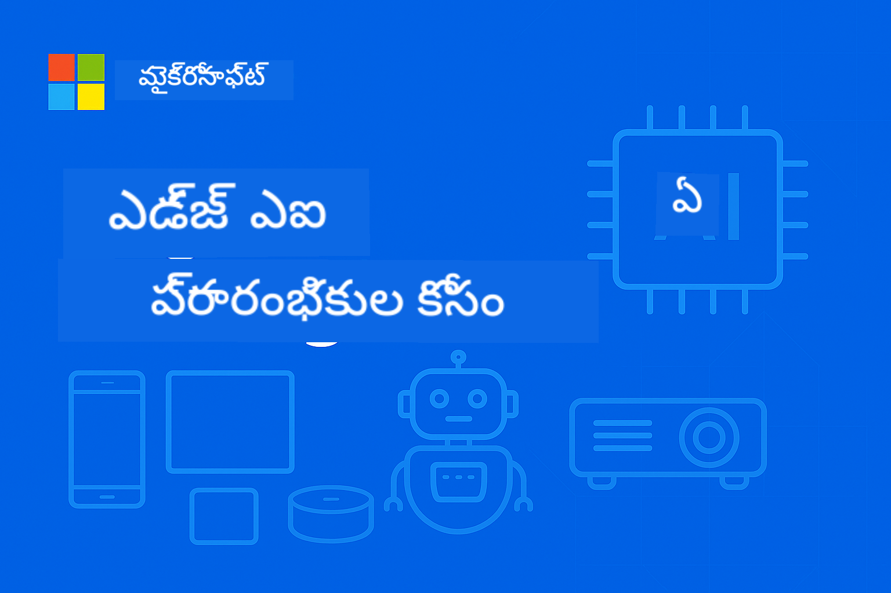

<!--
CO_OP_TRANSLATOR_METADATA:
{
  "original_hash": "54e710bc249e2d2943e8c01b16b3cee7",
  "translation_date": "2025-12-19T10:13:37+00:00",
  "source_file": "README.md",
  "language_code": "te"
}
-->
# EdgeAI ప్రారంభికులకు




[](https://GitHub.com/microsoft/edgeai-for-beginners/graphs/contributors)
[](https://GitHub.com/microsoft/edgeai-for-beginners/issues)
[](https://GitHub.com/microsoft/edgeai-for-beginners/pulls)
[](http://makeapullrequest.com)

[](https://GitHub.com/microsoft/edgeai-for-beginners/watchers)
[](https://GitHub.com/microsoft/edgeai-for-beginners/fork)
[](https://GitHub.com/microsoft/edgeai-for-beginners/stargazers)


[](https://discord.gg/nTYy5BXMWG)

ఈ వనరులను ఉపయోగించడం ప్రారంభించడానికి ఈ దశలను అనుసరించండి:

1. **రిపాజిటరీని ఫోర్క్ చేయండి**: క్లిక్ చేయండి [](https://GitHub.com/microsoft/edgeai-for-beginners/fork)
2. **రిపాజిటరీని క్లోన్ చేయండి**:   `git clone https://github.com/microsoft/edgeai-for-beginners.git`
3. [**Azure AI Foundry Discordలో చేరండి మరియు నిపుణులు మరియు సహ డెవలపర్లను కలుసుకోండి**](https://discord.com/invite/ByRwuEEgH4)


### 🌐 బహుభాషా మద్దతు

#### GitHub Action ద్వారా మద్దతు (ఆటోమేటెడ్ & ఎప్పుడూ తాజా)

<!-- CO-OP TRANSLATOR LANGUAGES TABLE START -->
[Arabic](../ar/README.md) | [Bengali](../bn/README.md) | [Bulgarian](../bg/README.md) | [Burmese (Myanmar)](../my/README.md) | [Chinese (Simplified)](../zh/README.md) | [Chinese (Traditional, Hong Kong)](../hk/README.md) | [Chinese (Traditional, Macau)](../mo/README.md) | [Chinese (Traditional, Taiwan)](../tw/README.md) | [Croatian](../hr/README.md) | [Czech](../cs/README.md) | [Danish](../da/README.md) | [Dutch](../nl/README.md) | [Estonian](../et/README.md) | [Finnish](../fi/README.md) | [French](../fr/README.md) | [German](../de/README.md) | [Greek](../el/README.md) | [Hebrew](../he/README.md) | [Hindi](../hi/README.md) | [Hungarian](../hu/README.md) | [Indonesian](../id/README.md) | [Italian](../it/README.md) | [Japanese](../ja/README.md) | [Kannada](../kn/README.md) | [Korean](../ko/README.md) | [Lithuanian](../lt/README.md) | [Malay](../ms/README.md) | [Malayalam](../ml/README.md) | [Marathi](../mr/README.md) | [Nepali](../ne/README.md) | [Nigerian Pidgin](../pcm/README.md) | [Norwegian](../no/README.md) | [Persian (Farsi)](../fa/README.md) | [Polish](../pl/README.md) | [Portuguese (Brazil)](../br/README.md) | [Portuguese (Portugal)](../pt/README.md) | [Punjabi (Gurmukhi)](../pa/README.md) | [Romanian](../ro/README.md) | [Russian](../ru/README.md) | [Serbian (Cyrillic)](../sr/README.md) | [Slovak](../sk/README.md) | [Slovenian](../sl/README.md) | [Spanish](../es/README.md) | [Swahili](../sw/README.md) | [Swedish](../sv/README.md) | [Tagalog (Filipino)](../tl/README.md) | [Tamil](../ta/README.md) | [Telugu](./README.md) | [Thai](../th/README.md) | [Turkish](../tr/README.md) | [Ukrainian](../uk/README.md) | [Urdu](../ur/README.md) | [Vietnamese](../vi/README.md)
<!-- CO-OP TRANSLATOR LANGUAGES TABLE END -->

**మీకు అదనపు అనువాద భాషలు కావాలనుకుంటే అవి ఇక్కడ [here](https://github.com/Azure/co-op-translator/blob/main/getting_started/supported-languages.md) జాబితా చేయబడ్డాయి**
## పరిచయం

**EdgeAI for Beginners** కు స్వాగతం – ఎడ్జ్ ఆర్టిఫిషియల్ ఇంటెలిజెన్స్ యొక్క మార్పిడి ప్రపంచంలో మీ సమగ్ర ప్రయాణం. ఈ కోర్సు శక్తివంతమైన AI సామర్థ్యాలు మరియు ఎడ్జ్ పరికరాలపై ప్రాక్టికల్, వాస్తవ ప్రపంచ అమలును కలుపుతుంది, డేటా ఉత్పత్తి అయ్యే మరియు నిర్ణయాలు తీసుకోవాల్సిన చోట AI యొక్క సామర్థ్యాన్ని నేరుగా ఉపయోగించడానికి మీకు శక్తిని ఇస్తుంది.

### మీరు నేర్చుకునేది

ఈ కోర్సు మౌలిక సూత్రాల నుండి ఉత్పత్తి-సిద్ధ అమలుల వరకు తీసుకువెళ్తుంది, కవర్ చేస్తుంది:
- **ఎడ్జ్ అమలుకు ఆప్టిమైజ్ చేసిన చిన్న భాషా మోడల్స్ (SLMs)**
- **వివిధ ప్లాట్‌ఫారమ్‌లపై హార్డ్‌వేర్-అవేర్ ఆప్టిమైజేషన్**
- **ప్రైవసీ-రక్షణ సామర్థ్యాలతో రియల్-టైమ్ ఇన్ఫరెన్స్**
- **ఎంటర్ప్రైజ్ అప్లికేషన్ల కోసం ఉత్పత్తి అమలు వ్యూహాలు**

### EdgeAI ఎందుకు ముఖ్యం

ఎడ్జ్ AI ఒక పారడైమ్ షిఫ్ట్‌ను సూచిస్తుంది, ఇది ఆధునిక కీలక సవాళ్లను పరిష్కరిస్తుంది:
- **గోప్యత & భద్రత**: క్లౌడ్ ఎక్స్‌పోజర్ లేకుండా సున్నితమైన డేటాను స్థానికంగా ప్రాసెస్ చేయండి
- **రియల్-టైమ్ పనితీరు**: సమయ-సంక్షిప్త అప్లికేషన్ల కోసం నెట్‌వర్క్ లేటెన్సీని తొలగించండి
- **ఖర్చు సామర్థ్యం**: బ్యాండ్‌విడ్త్ మరియు క్లౌడ్ కంప్యూటింగ్ ఖర్చులను తగ్గించండి
- **స్థిరమైన ఆపరేషన్లు**: నెట్‌వర్క్ అవుటేజీల సమయంలో ఫంక్షనాలిటీని నిర్వహించండి
- **నియంత్రణ అనుగుణత**: డేటా సార్వభౌమత్వ అవసరాలను తీర్చండి

### ఎడ్జ్ AI

ఎడ్జ్ AI అనగా AI అల్గోరిథమ్స్ మరియు భాషా మోడల్స్‌ను స్థానికంగా హార్డ్‌వేర్‌పై నడపడం, డేటా ఉత్పత్తి అయ్యే దగ్గరగా, ఇన్ఫరెన్స్ కోసం క్లౌడ్ వనరులపై ఆధారపడకుండా. ఇది లేటెన్సీని తగ్గిస్తుంది, గోప్యతను పెంచుతుంది, మరియు రియల్-టైమ్ నిర్ణయాలను సాధ్యమవుతుంది.

### ప్రాథమిక సూత్రాలు:
- **పరికరంపై ఇన్ఫరెన్స్**: AI మోడల్స్ ఎడ్జ్ పరికరాలపై నడుస్తాయి (ఫోన్లు, రౌటర్లు, మైక్రోకంట్రోలర్లు, ఇండస్ట్రియల్ PCs)
- **ఆఫ్‌లైన్ సామర్థ్యం**: నిరంతర ఇంటర్నెట్ కనెక్టివిటీ లేకుండా పనిచేస్తుంది
- **తక్కువ లేటెన్సీ**: రియల్-టైమ్ సిస్టమ్స్‌కు తక్షణ స్పందనలు
- **డేటా సార్వభౌమత్వం**: సున్నితమైన డేటాను స్థానికంగా ఉంచి భద్రత మరియు అనుగుణతను మెరుగుపరుస్తుంది

### చిన్న భాషా మోడల్స్ (SLMs)

Phi-4, Mistral-7B, మరియు Gemma వంటి SLMs పెద్ద LLMs యొక్క ఆప్టిమైజ్ చేసిన వెర్షన్లు—శిక్షణ పొందిన లేదా డిస్టిల్ చేసినవి:
- **తగ్గిన మెమరీ ఫుట్‌ప్రింట్**: పరిమిత ఎడ్జ్ పరికర మెమరీని సమర్థవంతంగా ఉపయోగించడం
- **తక్కువ కంప్యూట్ డిమాండ్**: CPU మరియు ఎడ్జ్ GPU పనితీరుకు ఆప్టిమైజ్ చేయబడింది
- **వేగవంతమైన స్టార్ట్‌అప్ సమయాలు**: స్పందనాత్మక అప్లికేషన్ల కోసం త్వరిత ప్రారంభం

వీటి ద్వారా శక్తివంతమైన NLP సామర్థ్యాలు అందుబాటులోకి వస్తాయి, క్రింది పరిమితులను తీర్చుకుంటూ:
- **ఎంబెడ్డెడ్ సిస్టమ్స్**: IoT పరికరాలు మరియు ఇండస్ట్రియల్ కంట్రోలర్లు
- **మొబైల్ పరికరాలు**: ఆఫ్‌లైన్ సామర్థ్యాలతో స్మార్ట్‌ఫోన్లు మరియు టాబ్లెట్లు
- **IoT పరికరాలు**: పరిమిత వనరులతో సెన్సార్లు మరియు స్మార్ట్ పరికరాలు
- **ఎడ్జ్ సర్వర్లు**: పరిమిత GPU వనరులతో స్థానిక ప్రాసెసింగ్ యూనిట్లు
- **పర్సనల్ కంప్యూటర్లు**: డెస్క్‌టాప్ మరియు ల్యాప్‌టాప్ అమలుల సందర్భాలు

## కోర్సు మాడ్యూల్స్ & నావిగేషన్

| మాడ్యూల్ | విషయం | ఫోకస్ ఏరియా | ముఖ్య కంటెంట్ | స్థాయి | వ్యవధి |
|--------|-------|------------|-------------|--------|----------|
| [📖 00 ](./introduction.md) | [EdgeAI పరిచయం](./introduction.md) | పునాది & సందర్భం | EdgeAI అవలోకనం • పరిశ్రమ అప్లికేషన్లు • SLM పరిచయం • నేర్చుకునే లక్ష్యాలు | ప్రారంభికుడు | 1-2 గంటలు |
| [📚 01](../../Module01) | [EdgeAI ప్రాథమికాలు](./Module01/README.md) | క్లౌడ్ vs ఎడ్జ్ AI తులన | EdgeAI ప్రాథమికాలు • వాస్తవ ప్రపంచ కేస్ స్టడీస్ • అమలు మార్గదర్శకం • ఎడ్జ్ అమలు | ప్రారంభికుడు | 3-4 గంటలు |
| [🧠 02](../../Module02) | [SLM మోడల్ ప్రాథమికాలు](./Module02/README.md) | మోడల్ కుటుంబాలు & నిర్మాణం | Phi కుటుంబం • Qwen కుటుంబం • Gemma కుటుంబం • BitNET • μModel • Phi-Silica | ప్రారంభికుడు | 4-5 గంటలు |
| [🚀 03](../../Module03) | [SLM అమలు ప్రాక్టీస్](./Module03/README.md) | స్థానిక & క్లౌడ్ అమలు | అధునాతన నేర్చుకోవడం • స్థానిక వాతావరణం • క్లౌడ్ అమలు | మధ్యస్థ | 4-5 గంటలు |
| [⚙️ 04](../../Module04) | [మోడల్ ఆప్టిమైజేషన్ టూల్‌కిట్](./Module04/README.md) | క్రాస్-ప్లాట్‌ఫారమ్ ఆప్టిమైజేషన్ | పరిచయం • Llama.cpp • Microsoft Olive • OpenVINO • Apple MLX • వర్క్‌ఫ్లో సింథసిస్ | మధ్యస్థ | 5-6 గంటలు |
| [🔧 05](../../Module05) | [SLMOps ఉత్పత్తి](./Module05/README.md) | ఉత్పత్తి ఆపరేషన్లు | SLMOps పరిచయం • మోడల్ డిస్టిలేషన్ • ఫైన్-ట్యూనింగ్ • ఉత్పత్తి అమలు | అధునాతన | 5-6 గంటలు |
| [🤖 06](../../Module06) | [AI ఏజెంట్లు & ఫంక్షన్ కాలింగ్](./Module06/README.md) | ఏజెంట్ ఫ్రేమ్‌వర్క్స్ & MCP | ఏజెంట్ పరిచయం • ఫంక్షన్ కాలింగ్ • మోడల్ కాంటెక్స్ట్ ప్రోటోకాల్ | అధునాతన | 4-5 గంటలు |
| [💻 07](../../Module07) | [ప్లాట్‌ఫారమ్ అమలు](./Module07/README.md) | క్రాస్-ప్లాట్‌ఫారమ్ నమూనాలు | AI టూల్‌కిట్ • Foundry Local • Windows డెవలప్‌మెంట్ | అధునాతన | 3-4 గంటలు |
| [🏭 08](../../Module08) | [Foundry Local టూల్‌కిట్](./Module08/README.md) | ఉత్పత్తి-సిద్ధ నమూనాలు | నమూనా అప్లికేషన్లు (కింద వివరాలు చూడండి) | నిపుణుడు | 8-10 గంటలు |

### 🏭 **మాడ్యూల్ 08: నమూనా అప్లికేషన్లు**

- [01: REST చాట్ క్విక్‌స్టార్ట్](./Module08/samples/01/README.md)
- [02: OpenAI SDK ఇంటిగ్రేషన్](./Module08/samples/02/README.md)
- [03: మోడల్ డిస్కవరీ & బెంచ్‌మార్కింగ్](./Module08/samples/03/README.md)
- [04: Chainlit RAG అప్లికేషన్](./Module08/samples/04/README.md)
- [05: మల్టీ-ఏజెంట్ ఆర్కెస్ట్రేషన్](./Module08/samples/05/README.md)
- [06: మోడల్స్-అస్-టూల్స్ రౌటర్](./Module08/samples/06/README.md)
- [07: డైరెక్ట్ API క్లయింట్](./Module08/samples/07/README.md)
- [08: Windows 11 చాట్ యాప్](./Module08/samples/08/README.md)
- [09: అధునాతన మల్టీ-ఏజెంట్ సిస్టమ్](./Module08/samples/09/README.md)
- [10: Foundry టూల్స్ ఫ్రేమ్‌వర్క్](./Module08/samples/10/README.md)

### 🎓 **వర్క్‌షాప్: హ్యాండ్స్-ఆన్ లెర్నింగ్ పాత్**

ఉత్పత్తి-సిద్ధ అమలులతో సమగ్ర హ్యాండ్స్-ఆన్ వర్క్‌షాప్ మెటీరియల్స్:

- **[వర్క్‌షాప్ గైడ్](./Workshop/Readme.md)** - పూర్తి నేర్చుకునే లక్ష్యాలు, ఫలితాలు, మరియు వనరు నావిగేషన్
- **Python నమూనాలు** (6 సెషన్లు) - ఉత్తమ పద్ధతులు, లోపాల నిర్వహణ, మరియు సమగ్ర డాక్యుమెంటేషన్‌తో నవీకరించబడింది
- **Jupyter నోట్బుక్స్** (8 ఇంటరాక్టివ్) - బెంచ్‌మార్క్‌లు మరియు పనితీరు మానిటరింగ్‌తో దశల వారీ ట్యుటోరియల్స్
- **సెషన్ గైడ్స్** - ప్రతి వర్క్‌షాప్ సెషన్ కోసం వివరమైన మార్క్డౌన్ గైడ్స్
- **వాలిడేషన్ టూల్స్** - కోడ్ నాణ్యతను ధృవీకరించడానికి మరియు స్మోక్ టెస్టులు నిర్వహించడానికి స్క్రిప్టులు

**మీరు నిర్మించేది:**
- స్ట్రీమింగ్ మద్దతుతో స్థానిక AI చాట్ అప్లికేషన్లు
- నాణ్యత మూల్యాంకనంతో RAG పైప్లైన్లు (RAGAS)
- మల్టీ-మోడల్ బెంచ్‌మార్కింగ్ మరియు తులనాత్మక టూల్స్
- మల్టీ-ఏజెంట్ ఆర్కెస్ట్రేషన్ సిస్టమ్స్
- టాస్క్-ఆధారిత ఎంపికతో తెలివైన మోడల్ రౌటింగ్

### 📊 **లెర్నింగ్ పాత్ సారాంశం**
- **మొత్తం వ్యవధి**: 36-45 గంటలు
- **ప్రారంభికుడు పాత్**: మాడ్యూల్స్ 01-02 (7-9 గంటలు)  
- **మధ్యస్థ పాత్**: మాడ్యూల్స్ 03-04 (9-11 గంటలు)
- **అధునాతన పాత్**: మాడ్యూల్స్ 05-07 (12-15 గంటలు)
- **నిపుణుడు పాత్**: మాడ్యూల్ 08 (8-10 గంటలు)

## మీరు నిర్మించేది

### 🎯 ప్రాథమిక నైపుణ్యాలు
- **ఎడ్జ్ AI ఆర్కిటెక్చర్**: క్లౌడ్ ఇంటిగ్రేషన్‌తో స్థానిక-మొదటి AI సిస్టమ్స్ డిజైన్ చేయండి
- **మోడల్ ఆప్టిమైజేషన్**: ఎడ్జ్ డిప్లాయ్‌మెంట్ కోసం మోడల్స్‌ను క్వాంటైజ్ చేసి కంప్రెస్ చేయడం (85% వేగం పెరుగుదల, 75% పరిమాణం తగ్గింపు)
- **బహుళ-ప్లాట్‌ఫారమ్ డిప్లాయ్‌మెంట్**: విండోస్, మొబైల్, ఎంబెడెడ్, మరియు క్లౌడ్-ఎడ్జ్ హైబ్రిడ్ సిస్టమ్స్
- **ప్రొడక్షన్ ఆపరేషన్స్**: ఎడ్జ్ AIని ప్రొడక్షన్‌లో మానిటరింగ్, స్కేలింగ్, మరియు నిర్వహణ

### 🏗️ ప్రాక్టికల్ ప్రాజెక్ట్స్
- **ఫౌండ్రి లోకల్ చాట్ యాప్స్**: మోడల్ స్విచ్చింగ్‌తో విండోస్ 11 స్థానిక అప్లికేషన్
- **బహుళ-ఏజెంట్ సిస్టమ్స్**: సంక్లిష్ట వర్క్‌ఫ్లోల కోసం స్పెషలిస్ట్ ఏజెంట్లతో కోఆర్డినేటర్  
- **RAG అప్లికేషన్స్**: వెక్టర్ సెర్చ్‌తో స్థానిక డాక్యుమెంట్ ప్రాసెసింగ్
- **మోడల్ రౌటర్స్**: టాస్క్ విశ్లేషణ ఆధారంగా మోడల్స్ మధ్య తెలివైన ఎంపిక
- **API ఫ్రేమ్‌వర్క్స్**: స్ట్రీమింగ్ మరియు హెల్త్ మానిటరింగ్‌తో ప్రొడక్షన్-రెడీ క్లయింట్లు
- **క్రాస్-ప్లాట్‌ఫారమ్ టూల్స్**: LangChain/Semantic Kernel ఇంటిగ్రేషన్ ప్యాటర్న్స్

### 🏢 పరిశ్రమ అప్లికేషన్స్
**మాన్యుఫ్యాక్చరింగ్** • **హెల్త్‌కేర్** • **ఆటోనమస్ వాహనాలు** • **స్మార్ట్ సిటీస్** • **మొబైల్ యాప్స్**

## త్వరిత ప్రారంభం

**సిఫార్సు చేయబడిన అభ్యాస మార్గం** (మొత్తం 20-30 గంటలు):

0. **📖 పరిచయం** ([Introduction.md](./introduction.md)): ఎడ్జ్AI పునాది + పరిశ్రమ సందర్భం + అభ్యాస ఫ్రేమ్‌వర్క్  
1. **📚 పునాది** (మాడ్యూల్స్ 01-02): ఎడ్జ్AI కాన్సెప్ట్‌లు + SLM మోడల్ కుటుంబాలు  
2. **⚙️ ఆప్టిమైజేషన్** (మాడ్యూల్స్ 03-04): డిప్లాయ్‌మెంట్ + క్వాంటైజేషన్ ఫ్రేమ్‌వర్క్స్  
3. **🚀 ప్రొడక్షన్** (మాడ్యూల్స్ 05-06): SLMOps + AI ఏజెంట్లు + ఫంక్షన్ కాలింగ్  
4. **💻 అమలు** (మాడ్యూల్స్ 07-08): ప్లాట్‌ఫారమ్ నమూనాలు + ఫౌండ్రి లోకల్ టూల్‌కిట్

ప్రతి మాడ్యూల్‌లో సిద్ధాంతం, ప్రాక్టికల్ వ్యాయామాలు, మరియు ప్రొడక్షన్-రెడీ కోడ్ నమూనాలు ఉంటాయి.

## కెరీర్ ప్రభావం

**సాంకేతిక పాత్రలు**: ఎడ్జ్AI సొల్యూషన్స్ ఆర్కిటెక్ట్ • ML ఇంజనీర్ (ఎడ్జ్) • IoT AI డెవలపర్ • మొబైల్ AI డెవలపర్

**పరిశ్రమ విభాగాలు**: మాన్యుఫ్యాక్చరింగ్ 4.0 • హెల్త్‌కేర్ టెక్ • ఆటోనమస్ సిస్టమ్స్ • ఫిన్‌టెక్ • కస్టమర్ ఎలక్ట్రానిక్స్

**పోర్ట్‌ఫోలియో ప్రాజెక్ట్స్**: బహుళ-ఏజెంట్ సిస్టమ్స్ • ప్రొడక్షన్ RAG యాప్స్ • క్రాస్-ప్లాట్‌ఫారమ్ డిప్లాయ్‌మెంట్ • పనితీరు ఆప్టిమైజేషన్

## రిపాజిటరీ నిర్మాణం

```
edgeai-for-beginners/
├── 📖 introduction.md  # Foundation: EdgeAI Overview & Learning Framework
├── 📚 Module01-04/     # Fundamentals → SLMs → Deployment → Optimization  
├── 🔧 Module05-06/     # SLMOps → AI Agents → Function Calling
├── 💻 Module07/        # Platform Samples (VS Code, Windows, Jetson, Mobile)
├── 🏭 Module08/        # Foundry Local Toolkit + 10 Comprehensive Samples
│   ├── samples/01-06/  # Foundation: REST, SDK, RAG, Agents, Routing
│   └── samples/07-10/  # Advanced: API Client, Windows App, Enterprise Agents, Tools
├── 🌐 translations/    # Multi-language support (8+ languages)
└── 📋 STUDY_GUIDE.md   # Structured learning paths & time allocation
```

## కోర్సు ముఖ్యాంశాలు

✅ **ప్రోగ్రెసివ్ లెర్నింగ్**: సిద్ధాంతం → ప్రాక్టీస్ → ప్రొడక్షన్ డిప్లాయ్‌మెంట్  
✅ **నిజమైన కేసు అధ్యయనాలు**: మైక్రోసాఫ్ట్, జపాన్ ఎయిర్‌లైన్స్, ఎంటర్ప్రైజ్ అమలు  
✅ **ప్రాక్టికల్ నమూనాలు**: 50+ ఉదాహరణలు, 10 సమగ్ర ఫౌండ్రి లోకల్ డెమోలు  
✅ **పనితీరు దృష్టి**: 85% వేగం మెరుగుదలలు, 75% పరిమాణం తగ్గింపులు  
✅ **బహుళ-ప్లాట్‌ఫారమ్**: విండోస్, మొబైల్, ఎంబెడెడ్, క్లౌడ్-ఎడ్జ్ హైబ్రిడ్  
✅ **ప్రొడక్షన్ రెడీ**: మానిటరింగ్, స్కేలింగ్, భద్రత, కంప్లయిన్స్ ఫ్రేమ్‌వర్క్స్

📖 **[అభ్యాస గైడ్ అందుబాటులో ఉంది](STUDY_GUIDE.md)**: సమయ కేటాయింపు మార్గదర్శకత్వం మరియు స్వీయ-అంచనా సాధనాలతో 20 గంటల నిర్మిత అభ్యాస మార్గం.

---

**ఎడ్జ్AI అనేది AI డిప్లాయ్‌మెంట్ యొక్క భవిష్యత్తు**: స్థానిక-మొదటి, గోప్యతా పరిరక్షణ, మరియు సమర్థవంతమైనది. ఈ నైపుణ్యాలను నేర్చుకుని తదుపరి తరం తెలివైన అప్లికేషన్లను నిర్మించండి.

## ఇతర కోర్సులు

మా బృందం ఇతర కోర్సులు కూడా తయారు చేస్తోంది! చూడండి:

<!-- CO-OP TRANSLATOR OTHER COURSES START -->
### LangChain
[](https://aka.ms/langchain4j-for-beginners)
[](https://aka.ms/langchainjs-for-beginners?WT.mc_id=m365-94501-dwahlin)

---

### Azure / Edge / MCP / Agents
[](https://github.com/microsoft/AZD-for-beginners?WT.mc_id=academic-105485-koreyst)
[](https://github.com/microsoft/edgeai-for-beginners?WT.mc_id=academic-105485-koreyst)
[](https://github.com/microsoft/mcp-for-beginners?WT.mc_id=academic-105485-koreyst)
[](https://github.com/microsoft/ai-agents-for-beginners?WT.mc_id=academic-105485-koreyst)

---
 
### Generative AI Series
[](https://github.com/microsoft/generative-ai-for-beginners?WT.mc_id=academic-105485-koreyst)
[-9333EA?style=for-the-badge&labelColor=E5E7EB&color=9333EA)](https://github.com/microsoft/Generative-AI-for-beginners-dotnet?WT.mc_id=academic-105485-koreyst)
[-C084FC?style=for-the-badge&labelColor=E5E7EB&color=C084FC)](https://github.com/microsoft/generative-ai-for-beginners-java?WT.mc_id=academic-105485-koreyst)
[-E879F9?style=for-the-badge&labelColor=E5E7EB&color=E879F9)](https://github.com/microsoft/generative-ai-with-javascript?WT.mc_id=academic-105485-koreyst)

---
 
### కోర్ లెర్నింగ్
[](https://aka.ms/ml-beginners?WT.mc_id=academic-105485-koreyst)
[](https://aka.ms/datascience-beginners?WT.mc_id=academic-105485-koreyst)
[](https://aka.ms/ai-beginners?WT.mc_id=academic-105485-koreyst)
[](https://github.com/microsoft/Security-101?WT.mc_id=academic-96948-sayoung)
[](https://aka.ms/webdev-beginners?WT.mc_id=academic-105485-koreyst)
[](https://aka.ms/iot-beginners?WT.mc_id=academic-105485-koreyst)
[](https://github.com/microsoft/xr-development-for-beginners?WT.mc_id=academic-105485-koreyst)

---
 
### కోపైలట్ సిరీస్
[](https://aka.ms/GitHubCopilotAI?WT.mc_id=academic-105485-koreyst)
[](https://github.com/microsoft/mastering-github-copilot-for-dotnet-csharp-developers?WT.mc_id=academic-105485-koreyst)
[](https://github.com/microsoft/CopilotAdventures?WT.mc_id=academic-105485-koreyst)
<!-- CO-OP TRANSLATOR OTHER COURSES END -->

## సహాయం పొందడం

మీరు అడ్డుకుపోతే లేదా AI యాప్స్ నిర్మాణం గురించి ఏవైనా ప్రశ్నలు ఉంటే, చేరండి:

[](https://discord.gg/nTYy5BXMWG)

మీకు ఉత్పత్తి అభిప్రాయం లేదా నిర్మాణ సమయంలో లోపాలు ఉంటే సందర్శించండి:

[](https://aka.ms/foundry/forum)

---

<!-- CO-OP TRANSLATOR DISCLAIMER START -->
**అస్పష్టత**:  
ఈ పత్రాన్ని AI అనువాద సేవ [Co-op Translator](https://github.com/Azure/co-op-translator) ఉపయోగించి అనువదించబడింది. మేము ఖచ్చితత్వానికి ప్రయత్నించినప్పటికీ, ఆటోమేటెడ్ అనువాదాల్లో పొరపాట్లు లేదా తప్పిదాలు ఉండవచ్చు. మూల పత్రం దాని స్వదేశీ భాషలో అధికారిక మూలంగా పరిగణించాలి. ముఖ్యమైన సమాచారానికి, ప్రొఫెషనల్ మానవ అనువాదం సిఫార్సు చేయబడుతుంది. ఈ అనువాదం వాడకంలో ఏర్పడిన ఏవైనా అపార్థాలు లేదా తప్పుదారుల కోసం మేము బాధ్యత వహించము.
<!-- CO-OP TRANSLATOR DISCLAIMER END -->