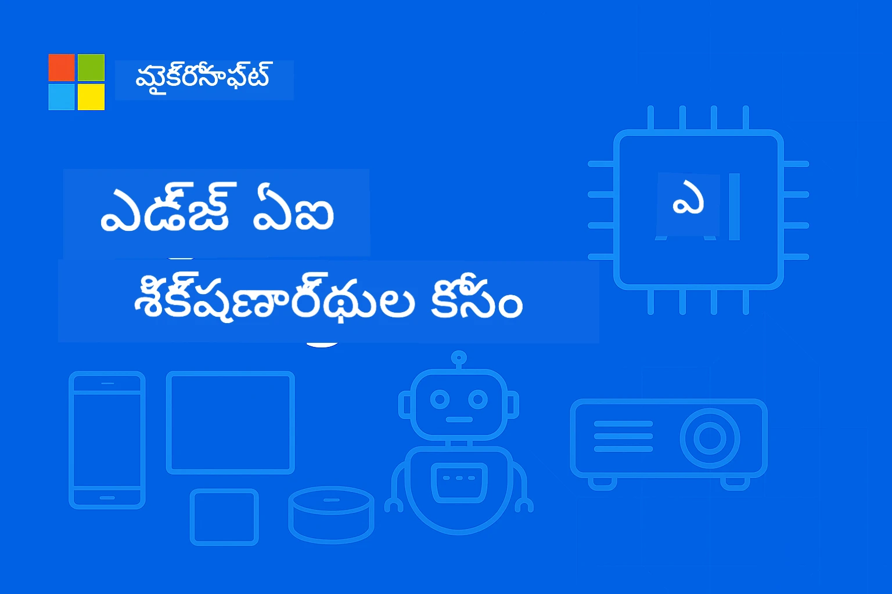

# EdgeAI ప్రారంభకుల కోసం




[](https://GitHub.com/microsoft/edgeai-for-beginners/graphs/contributors)
[](https://GitHub.com/microsoft/edgeai-for-beginners/issues)
[](https://GitHub.com/microsoft/edgeai-for-beginners/pulls)
[](http://makeapullrequest.com)

[](https://GitHub.com/microsoft/edgeai-for-beginners/watchers)
[](https://GitHub.com/microsoft/edgeai-for-beginners/fork)
[](https://GitHub.com/microsoft/edgeai-for-beginners/stargazers)


[](https://discord.gg/nTYy5BXMWG)

ఈ వనరులను ఉపయోగించడం మొదలుపెట్టడానికి ఈ దశలను అనుసరించండి:

1. **రిపోజిటరీని Fork చేసుకోండి**: క్లిక్ చేయండి [](https://GitHub.com/microsoft/edgeai-for-beginners/fork)
2. **రిపోజిటరీని Clone చేసుకోండి**:   `git clone https://github.com/microsoft/edgeai-for-beginners.git`
3. [**Azure AI Foundry Discord కి చేరండి మరియు నిపుణులు మరియు ఇతర డెవలపర్లను కలుసుకోండి**](https://discord.com/invite/ByRwuEEgH4)


### 🌐 బహుభాషా మద్దతు

#### GitHub Action ద్వారా మద్దతు (స్వయంచాలకంగా & ఎప్పుడూ నవీకరించబడుతుంది)

<!-- CO-OP TRANSLATOR LANGUAGES TABLE START -->
[Arabic](../ar/README.md) | [Bengali](../bn/README.md) | [Bulgarian](../bg/README.md) | [Burmese (Myanmar)](../my/README.md) | [Chinese (Simplified)](../zh-CN/README.md) | [Chinese (Traditional, Hong Kong)](../zh-HK/README.md) | [Chinese (Traditional, Macau)](../zh-MO/README.md) | [Chinese (Traditional, Taiwan)](../zh-TW/README.md) | [Croatian](../hr/README.md) | [Czech](../cs/README.md) | [Danish](../da/README.md) | [Dutch](../nl/README.md) | [Estonian](../et/README.md) | [Finnish](../fi/README.md) | [French](../fr/README.md) | [German](../de/README.md) | [Greek](../el/README.md) | [Hebrew](../he/README.md) | [Hindi](../hi/README.md) | [Hungarian](../hu/README.md) | [Indonesian](../id/README.md) | [Italian](../it/README.md) | [Japanese](../ja/README.md) | [Kannada](../kn/README.md) | [Korean](../ko/README.md) | [Lithuanian](../lt/README.md) | [Malay](../ms/README.md) | [Malayalam](../ml/README.md) | [Marathi](../mr/README.md) | [Nepali](../ne/README.md) | [Nigerian Pidgin](../pcm/README.md) | [Norwegian](../no/README.md) | [Persian (Farsi)](../fa/README.md) | [Polish](../pl/README.md) | [Portuguese (Brazil)](../pt-BR/README.md) | [Portuguese (Portugal)](../pt-PT/README.md) | [Punjabi (Gurmukhi)](../pa/README.md) | [Romanian](../ro/README.md) | [Russian](../ru/README.md) | [Serbian (Cyrillic)](../sr/README.md) | [Slovak](../sk/README.md) | [Slovenian](../sl/README.md) | [Spanish](../es/README.md) | [Swahili](../sw/README.md) | [Swedish](../sv/README.md) | [Tagalog (Filipino)](../tl/README.md) | [Tamil](../ta/README.md) | [Telugu](./README.md) | [Thai](../th/README.md) | [Turkish](../tr/README.md) | [Ukrainian](../uk/README.md) | [Urdu](../ur/README.md) | [Vietnamese](../vi/README.md)

> **స్థానికంగా క్లోన్ చేయాలనుకుంటున్నారా?**

> ఈ రిపోజిటరీలో 50+ భాషా అనువాదాలు ఉన్నాయి, ఇవి డౌన్లోడ్ పరిమాణాన్ని భారీగా పెంచుతాయి. అనువాదాలు లేకుండా క్లోన్ చేయడానికి sparse checkout ఉపయోగించండి:
> ```bash
> git clone --filter=blob:none --sparse https://github.com/microsoft/edgeai-for-beginners.git
> cd edgeai-for-beginners
> git sparse-checkout set --no-cone '/*' '!translations' '!translated_images'
> ```
> ఇది కోర్స్ పూర్తి చేసేందుకు అవసరమైన అన్ని విషయాలను తక్కువ సమయంలో పొందేందుకు సహాయపడుతుంది.
<!-- CO-OP TRANSLATOR LANGUAGES TABLE END -->

**మీకు అదనపు అనువాద భాషా మద్దతులు కావాలయితే అవి [ఇక్కడ](https://github.com/Azure/co-op-translator/blob/main/getting_started/supported-languages.md) లిష్టయుగా ఉన్నాయి**
## పరిచయం

స్వాగతం **EdgeAI for Beginners** కి – ఇది ఎడ్జ్ ఆర్టిఫిషియల్ ఇంటెలిజెన్స్ ప్రపంచంలో మీ సమగ్ర ప్రయాణం. ఈ కోర్స్ శక్తివంతమైన AI సామర్థ్యాలు మరియు ఎడ్జ్ పరికరాలపై నేరుగా ప్రాక్టికల్, వాస్తవ ప్రపంచ అమలు మధ్యని అంతరం తగ్గిస్తుంది, డేటా ఉత్పత్తిచేసే మరియు నిర్ణయాలు తీసుకోవాల్సిన చోట AI శక్తిని మీరు ఉపయోగించటానికి వీలు కల్పిస్తుంది.

### మీరు నేర్చుకునే అంశాలు

ఈ కోర్స్ ఆధారాలు నుండి ఉత్పత్తి-సిద్ధ అమలు వరకు వెళ్లిపోతుంది, ఇవి కవర్ చేస్తుంది:
- **ఎడ్జ్ అమరిక కోసం ఇష్టమైన చిన్న భాషా నమూనాలు (SLMs)**
- **వివిధ ప్లాట్‌ఫారమ్‌లపై హార్డ్వేర్-అవేరైన ఆప్టిమైజేషన్**
- **ప్రైవసీ రక్షణతో రియల్-టైమ్ ఇన్ఫెరెన్స్**
- **ఎంటర్‌ప్రైజ్ అప్లికేషన్ల కోసం ఉత్పత్తి ప్రతిష్టాపన వ్యూహాలు**

### ఎందుకు EdgeAI ముఖ్యం

Edge AI కీలక ఆధునిక సవాళ్లను పరిష్కరించే ఒక ప్యారడైమ్ మార్పు సూచిస్తుంది:
- **గోప్యత & భద్రత**: క్లౌడ్ ఎక్స్‌పోజర్ లేకుండా సున్నితమైన డేటాను స్థానికంగా ప్రాసెస్ చేయండి
- **తక్షణ కార్యనిర్వాహణ**: సమయ-సున్నితమైన అప్లికేషన్ల కోసం నెట్‌వర్క్ లేటెన్సీ తొలగించండి
- **ఖర్చు సామర్థ్యం**: బ్యాండ్‌విడ్త్ మరియు క్లౌడ్ కంప్యూటింగ్ వ్యయాలను తగ్గించు
- **బలమైన ఆపరేషన్లు**: నెట్‌వర్క్ అవుటేజ్‌ల సమయంలో పనితీరు నిలుపుకోండి
- **నియంత్రణ అనుగుణత**: డేటా సావ్యత అవసరాలను తీర్చండి

### Edge AI

Edge AI అనగా డేటా ఉత్పత్తి అయ్యే ప్రదేశానికి సన్నిహితంగా ఉన్న హార్డ్వేర్‌లో AI అల్గోరిథమ్స్, భాషా నమూనాలను నేరుగా నడపడం, ఇన్ఫెరెన్స్ కోసం క్లౌడ్ వనరులపై ఆధారపడకుండా ఉండటం. ఇది లేటెన్సీ తగ్గిస్తుంది, గోప్యతను మెరుగుపరుస్తుంది, మరియు రియల్-టైమ్ నిర్ణయాలు తీసుకోవడానికి సామర్థ్యాన్ని ఇస్తుంది.

### ప్రాథమిక సూత్రాలు:
- **పరికరంపై ఇన్ఫెరెన్స్**: AI నమూనాలు ఎడ్జ్ పరికరాల్లో (ఫోన్లు, రౌటర్లు, మైక్రోకంట్రోలర్లు, ఇండు స్ట్రియల్ PCs) నడుస్తాయి
- **ఆఫ్‌లైన్ సామర్థ్యము**: స్థిరమైన ఇంటర్నెట్ కనెక్షన్ ఉన్నా లేకపోయినా పనిచేస్తుంది
- **తక్కువ లేటెన్సీ**: రియల్-టైమ్ వ్యవస్థలకు తక్షణ ప్రతిస్పందనలు
- **డేటా సావ్యత**: సున్నితమైన డేటాను స్థానికంగా ఉంచి భద్రత మరియు అనుగుణత మెరుగుపరుస్తుంది

### చిన్న భాషా నమూనాలు (SLMs)

Phi-4, Mistral-7B, Gemma వంటి SLMs పెద్ద LLMల ఈశ్వర రూపాలు — శిక్షణ లేదా డిస్టిల్లేషన్ చేయబడి ఉంటాయి:
- **కొత్త మెమరీ ఫుట్‌ప్రింట్**: పరిమిత ఎడ్జ్ పరికరాల మెమరీ సమర్థవంతమైన ఉపయోగం
- **తక్కువ కంప్యూట్ డిమాండ్**: CPU మరియు ఎడ్జ్ GPU పనితీర్పుకు అనుకూలం
- **త్వరిత స్టార్ట్-అప్ సమయాలు**: ప్రతిస్పందించే అప్లికేషన్ల కోసం త్వరిత ప్రారంభం

వీటి వల్ల శక్తివంతమైన NLP సామర్థ్యాలు లభిస్తాయి, మరియు క్రింది పరిమితులకు సరిపోతాయి:
- **ఎంబెడ్డెడ్ సిస్టమ్స్**: IoT పరికరాలు మరియు ఇండస్ట్రియల్ కంట్రోలర్లు
- **మొబైల్ పరికరాలు**: ఆన్‌లైన్ లేనిప్పుడు కూడా పని చేసే సమర్థవంతమైన ఫోన్లు, టాబ్లెట్లు
- **IoT పరికరాలు**: పరిమిత వనరుల సెన్సార్లు మరియు స్మార్ట్ పరికరాలు
- **ఎడ్జ్ సర్వర్లు**: పరిమిత GPU వనరులతో స్థానిక ప్రాసెసింగ్ యూనిట్లు
- **వ్యక్తిగత కంప్యూటర్లు**: డెస్క్‌టాప్ మరియు ల్యాప్టాప్ పర్యావరణాలు

## కోర్స్ మాడ్యూల్స్ & నావిగేషన్

| మాడ్యూల్ | టాపిక్ | ఫోకస్ ఏరియా | ప్రధాన విషయం | స్థాయిని | వ్యవధి |
|--------|-------|------------|-------------|--------|----------|
| [📖 00 ](./introduction.md) | [EdgeAI పరిచయం](./introduction.md) | పునాది & సందర్భం | EdgeAI అవలోకనం • పరిశ్రమ అనువర్తనాలు • SLM పరిచయం • నేర్చుకునే లక్ష్యాలు | ఆరవేయు | 1-2 గంటలు |
| [📚 01](../../Module01) | [EdgeAI ప్రాథమికాలు](./Module01/README.md) | క్లౌడ్ vs ఎడ్జ్ AI తులన | EdgeAI ప్రాథమికాలు • వాస్తవ ప్రపంచ కేసు అధ్యయనాలు • అమలుచేసే గైడ్ • ఎడ్జ్ ప్రతిష్టాపన | ఆరవేయు | 3-4 గంటలు |
| [🧠 02](../../Module02) | [SLM మోడల్ పునాది](./Module02/README.md) | మోడల్ కుటుంబాలు & నిర్మాణం | Phi కుటుంబం • Qwen కుటుంబం • Gemma కుటుంబం • BitNET • μModel • Phi-Silica | ఆరవేయు | 4-5 గంటలు |
| [🚀 03](../../Module03) | [SLM అమలుపరచడం ఆచరణ](./Module03/README.md) | స్థానిక & క్లౌడ్ అమలు | అధునాతన అధ్యయనం • స్థానిక వాతావరణం • క్లౌడ్ అమలు | మధ్యవర్తి | 4-5 గంటలు |
| [⚙️ 04](../../Module04) | [మోడల్ ఆప్టిమైజేషన్ పనిముట్ల వాడు](./Module04/README.md) | క్రాస్-ప్లాట్‌ఫారమ్ ఆప్టిమైజేషన్ | పరిచయం • Llama.cpp • Microsoft Olive • OpenVINO • Apple MLX • వర్క్‌ఫ్లో సింథసిస్ | మధ్యవర్తి | 5-6 గంటలు |
| [🔧 05](../../Module05) | [SLMOps ఉత్పత్తి](./Module05/README.md) | ఉత్పత్తి ఆపరేషన్లు | SLMOps పరిచయం • మోడల్ డిస్టిల్లేషన్ • ఫైన్-ట్యూనింగ్ • ఉత్పత్తి అమలు | అధునాతన | 5-6 గంటలు |
| [🤖 06](../../Module06) | [AI ఏజెంట్లు & ఫంక్షన్ కాలింగ్](./Module06/README.md) | ఏజెంట్ ఫ్రేమ్‌వర్క్లు & MCP | ఏజెంట్ పరిచయం • ఫంక్షన్ కాలింగ్ • మోడల్ కాంటెక్స్ట్ ప్రోటోకాల్ | అధునాతన | 4-5 గంటలు |
| [💻 07](../../Module07) | [ప్లాట్‌ఫారమ్ అమలు](./Module07/README.md) | క్రాస్-ప్లాట్‌ఫారమ్ సాంపిల్స్ | AI పనిముట్లు • Foundry Local • Windows డెవలప్మెంట్ | అధునాతన | 3-4 గంటలు |
| [🏭 08](../../Module08) | [Foundry Local పనిముట్లు](./Module08/README.md) | ఉత్పత్తి-సిద్ధ సాంపిల్స్ | సాంపిల్ అప్లికేషన్లు (క్రింద వివరాలు చూడండి) | నిపుణుడు | 8-10 గంటలు |

### 🏭 **మాడ్యూల్ 08: సాంపిల్ అప్లికేషన్లు**

- [01: REST చాట్ త్వరితప్రారంభం](./Module08/samples/01/README.md)
- [02: OpenAI SDK ఇంటిగ్రేషన్](./Module08/samples/02/README.md)
- [03: మోడల్ డిస్కవరీ & బెంచ్‌మార్కింగ్](./Module08/samples/03/README.md)
- [04: Chainlit RAG అప్లికేషన్](./Module08/samples/04/README.md)
- [05: బహుఎజెంట్ సమన్వయం](./Module08/samples/05/README.md)
- [06: మోడల్స్-జయింట్-టూల్స్ రౌటర్](./Module08/samples/06/README.md)
- [07: డైరెక్ట్ API క్లయింట్](./Module08/samples/07/README.md)
- [08: Windows 11 చాట్ యాప్](./Module08/samples/08/README.md)
- [09: అధునాతన బహుఎజెంట్ వ్యవస్థ](./Module08/samples/09/README.md)
- [10: Foundry టూల్స్ ఫ్రేమ్‌వర్క్](./Module08/samples/10/README.md)

### 🎓 **వర్క్‌షాప్: హ్యాండ్స్-ఆన్ లెర్నింగ్ పాత్**

ఉత్పత్తి-సిద్ధ అమలులతో కూడిన సమగ్ర హ్యాండ్స్-ఆన్ వర్క్‌షాప్ మెటీరియల్స్:

- **[వర్క్‌షాప్ గైడ్](./Workshop/Readme.md)** - పూర్తిగా నేర్చుకునే లక్ష్యాలు, ఫలితాలు మరియు వనరు నావిగేషన్
- **Python నమూనాలు** (6 సెషన్లు) - ఉత్తమ పద్ధతులు, లోపాల నిర్వహణ, సమగ్రమైన డాక్యుమెంటేషన్‌తో నవీకరించబడినవి
- **Jupyter నోట్‌బుక్స్** (8 ఇంటరాక్టివ్) - దశలవారీ ట్యుటోరియల్స్, బెంచ్‌మార్కులు మరియు పనితీరు పర్యవేక్షణ
- **సెషన్ గైడ్స్** - ప్రతి వర్క్‌షాప్ సెషన్ కోసం సంక్లిష్టమైన మార్క్డౌన్ గైడ్స్
- **వాలిడేషన్ టూల్స్** - కోడ్ నాణ్యతని ధృవీకరించడానికి మరియు స్మోక్ టెస్టులు నిర్వహించడానికి స్క్రిప్టులు

**మీరు నిర్మించేది:**
- స్ట్రీమింగ్ మద్దతుతో స్థానిక AI చాట్ అప్లికేషన్లు
- నాణ్యత మూల్యాంకనంతో RAG పైప్‌లైన్లు (RAGAS)
- బహుళ-మోడల్ బెంచ్‌మార్కింగ్ మరియు తులన టూల్స్
- బహుళ-ఏజెంట్ సమన్వయ వ్యవస్థలు
- టాస్క్-ఆధారిత ఎంపికతో తెలివైన మోడల్ రౌటింగ్

### 🎙️ **ఏజెంటిక్ కోసం వర్క్‌షాప్: హ్యాండ్స్-ఆన్ - AI పోడ్కాస్ట్ స్టూడియో**

మూత పాయింట్ నుంచి AI ఆధారిత పోడ్కాస్ట్ ఉత్పత్తి పైప్‌లైన్‌ను నిర్మించండి! ఈ ఇమ్మెర్సివ్ వర్క్‌షాప్ మీకు ఐడియాలను ప్రొఫెషనల్ పోడ్కాస్ట్ ఎపిసోడ్‌లుగా మారుస్తూ సంపూర్ణ బహుళ-ఏజెంట్ వ్యవస్థను సృష్టించడం నేర్పిస్తుంది.
**[🎬 AI పోडकాస్ట్ స్టూడియో వర్క్‌షాప్ ప్రారంభించండి](./WorkshopForAgentic/README.md)**

**మీ మిషన్**: "Future Bytes" అనే టెక్ పోडकాస్ట్‌ను పూర్తిగా మీరు స్వయంగా నిర్మించే AI ఏజెంట్లతో ప్రారంభించండి. ఎటువంటి క్లౌడ్ ఆధారిత సేవలు లేకుండా, ఎటువంటి API ఖర్చులు లేకుండా — అన్నీ మీ యంత్రంపైనే స్థానికంగా నడుస్తాయి.

**ఇది ప్రత్యేకమైనది ఎందుకు:**
- **🤖 నిజమైన బహుళ ఏజెంట్ సమన్వయం** - పరిశోధన, రచన, ఆడియో ఉత్పత్తికి ప్రత్యేక AI ఏజెంట్లను నిర్మించండి
- **🎯 పూర్తి ఉత్పత్తి పైప్‌లైన్** - విషయం ఎంపిక నుండి తుది పోडकాస్ట్ ఆడియో అవుట్‌పుట్ వరకు  
- **💻 100% స్థానిక అమలు** - Ollama మరియు స్థానిక మోడల్స్ (Qwen-3-8B) ద్వారా పూర్తి గోప్యత మరియు నియంత్రణ
- **🎤 టెక్స్ట్-టు-స్పీచ్ సమీకరణ** - స్క్రిప్ట్‌లను సహజమైన పలురోజుల సంభాషణల్లో మార్చండి  
- **✋ మానవ-ఇన్-ది-లూప్ వర్క్‌ఫ్లోలు** - ఆమోద గేట్లు నాణ్యతను నిర్ధారించునట్లు ఆటోమేషన్ కొనసాగిస్తుంది

**మూడు ప్రదర్శన లెర్నింగ్ ప్రయాణం:**

| ప్రదర్శన | దృష్టి | కీలక నైపుణ్యాలు | వ్యవధి |
|-----|-------|------------|----------|
| **[ప్రదర్శన 1: మీ AI అసిస్టెంట్లను కలవండి](./WorkshopForAgentic/md/01.BuildAIAgentWithSLM.md)** | మీ మొదటి AI ఏజెంట్‌ను నిర్మించండి | టూల్ సమీకరణ • వెబ్ శోధన • సమస్య పరిష్కారం • ఏజెంటిక్ తార్కికత | 2-3 గంటలు |
| **[ప్రదర్శన 2: మీ ఉత్పత్తి జట్టును కూర్చండి](./WorkshopForAgentic/md/02.AIAgentOrchestrationAndWorkflows.md)** | బహుళ ఏజెంట్లను సమన్వయపరచండి | జట్టు సమన్వయం • ఆమోద వర్క్‌ఫ్లోలు • DevUI ఇంటర్‌ఫేస్ • మానవ పర్యవేక్షణ | 3-4 గంటలు |
| **[ప్రదర్శన 3: మీ పోडकాస్ట్‌ను జీవితం తీసుకొండి](./WorkshopForAgentic/md/03.Multi-SpeakerPodcastGenerationWithVibeVoice.md)** | పోडकాస్ట్ ఆడియోను ఉత్పత్తి చేయండి | టెక్స్ట్-టు-స్పీచ్ • పలురోజుల సంశ్లేషణ • దీర్ఘ-ఆకారం ఆడియో • పూర్తి ఆటోమేషన్ | 2-3 గంటలు |

**వినియోగించిన సాంకేతికతలు:**
- **Microsoft ఏజెంట్ ఫ్రేమ్‌వర్క్** - బహుళ ఏజెంట్ సమన్వయం మరియు కోఆర్డినేషన్  
- **Ollama** - స్థానిక AI మోడల్ రన్‌టైమ్ (క్లౌడ్ అవసరం లేదు)  
- **Qwen-3-8B** - ఏజెంటిక్ పనుల కోసం ఆప్టిమైజ్ చేసిన ఓపెన్-సోర్స్ భాషా మోడల్  
- **టెక్స్ట్-టు-స్పీచ్ APIలు** - పోडकాస్ట్ తయారీలో సహజమైన శ్రవణ అనుకరణ

**హార్డ్వేర్ మద్దతు:**
- ✅ **CPU మోడ్** - ఏ ఆధునిక కంప్యూటర్ (8GB+ RAM సిఫార్సు) పై పనిచేస్తుంది  
- 🚀 **GPU వేగవంతం** - NVIDIA/AMD GPUలతో గణనీయంగా వేగవంతమైన ఫలితం  
- ⚡ **NPU మద్దతు** - తదుపరి తరం న్యూరల్ ప్రాసెసింగ్ యూనిట్ వేగవంతం

**సరిగ్గా సరిపోతుంది:**
- బహుళ ఏజెంట్ AI సిస్టమ్స్ నేర్చుకోవాలనుకునేవారికి  
- AI ఆటోమేషన్ మరియు వర్క్‌ఫ్లోల్లో ఆసక్తి ఉన్న వారికీ  
- AI-సహాయంతో ఉత్పత్తి చేసే కంటెంట్ సృష్టికర్తలకు  
- ఆచరణాత్మక AI సమన్వయం నమూనాలు చదువుతున్న విద్యార్థులకు

**నిర్మాణం ప్రారంభించండి**: [🎙️ AI పోडकాస్ట్ స్టూడియో వర్క్‌షాప్ →](./WorkshopForAgentic/README.md)

### 📊 **లెర్నింగ్ పాథ్ సారాంశం**
- **మొత్తం వ్యవధి**: 36-45 గంటలు  
- **ప్రారంభ స్థాయి మార్గం**: మాడ్యూల్స్ 01-02 (7-9 గంటలు)  
- **మధ్యస్థ స్థాయి మార్గం**: మాడ్యూల్స్ 03-04 (9-11 గంటలు)  
- **అధునాతన స్థాయి మార్గం**: మాడ్యూల్స్ 05-07 (12-15 గంటలు)  
- **నిపుణుల స్థాయి మార్గం**: మాడ్యూల్ 08 (8-10 గంటలు)

## మీరు ఏమి నిర్మించబోతున్నారు  

### 🎯 ప్రధాన నైపుణ్యాలు  
- **ఎడ్జ్ AI నిర్మాణం**: క్లౌడ్ సమీకరణతో స్థానిక-మొదటి AI సిస్టమ్స్‌ని డిజైన్ చేయండి  
- **మోడల్ ఆప్టిమైజేషన్**: ఎడ్జ్ అమర్చుకుటకు మోడల్స్‌ను క్వాంటైజ్ చేసి కంప్రెస్ చేయండి (85% వేగం పెరుగుదలు, 75% పరిమాణం తగ్గింపు)  
- **బహు-ప్లాట్‌ఫారం అమలు**: విండోస్, మొబైల్, ఎంబెద్దెడ్ మరియు క్లౌడ్-ఎడ్జ్ హైబ్రిడ్ సిస్టమ్స్  
- **ఉత్పత్తి ఆపరేషన్స్**: ఎడ్జ్ AIని ఉత్పత్తిలో పర్యవేక్షణ, స్కేలింగ్, నిర్వహణ

### 🏗️ ఆచరణాత్మక ప్రాజెక్టులు  
- **Foundry స్థానిక చాట్ యాప్స్**: మోడల్ మార్పుతో విండోస్ 11 స్థానిక అప్లికేషన్  
- **బహుళ ఏజెంట్ సిస్టమ్స్**: క్లిష్ట వర్క్‌ఫ్లోల కోసం సమన్వయ అధికారి తో ప్రత్యేక ఏజెంట్లు  
- **RAG అప్లికేషన్స్**: స్థానిక డాక్యుమెంట్ ప్రాసెస్సింగ్ మరియు వెక్టర్ శోధన  
- **మోడల్ రౌటర్స్**: పనివైపు విశ్లేషణ ఆధారంగా మోడల్స్‌ను తెలివిగా ఎంపిక చేసుకోవడం  
- **API ఫ్రేమ్‌వర్క్స్**: హెల్త్ మానిటరింగ్ మరియు స్ట్రీమింగ్ ఉన్న ఉత్పత్తి-సిద్ధ క్లయింట్లు  
- **క్రాస్-ప్లాట్‌ఫారం టూల్స్**: LangChain/Semantic Kernel సమీకరణ నమూనాలు

### 🏢 పరిశ్రమ అనువర్తనాలు  
**ఉత్పత్తి** • **ఆరోగ్యం** • **స్వీయ నాయకత్వ వాహనాలు** • **స్మార్ట్ సిటీలు** • **మొబైల్ యాప్స్**

## వేగవంతమైన ప్రారంభం  

**శిఫార్సు చేసిన లెర్నింగ్ పాథ్** (మొత్తం 20-30 గంటలు):

0. **📖 పరిచయం** ([Introduction.md](./introduction.md)): EdgeAI పునాది + పరిశ్రమ నేపథ్యం + లెర్నింగ్ ఫ్రేమ్‌వర్క్  
1. **📚 పునాది** (మాడ్యూల్స్ 01-02): EdgeAI సంకల్పాలు + SLM మోడల్ కుటుంబాలు  
2. **⚙️ ఆప్టిమైజేషన్** (మాడ్యూల్స్ 03-04): అమలు + క్వాంటైజేషన్ ఫ్రేమ్‌వర్క్స్  
3. **🚀 ఉత్పత్తి** (మాడ్యూల్స్ 05-06): SLMOps + AI ఏజెంట్లు + ఫంక్షన్‌కాలింగ్  
4. **💻 అమలు** (మాడ్యూల్స్ 07-08): ప్లాట్‌ఫారం సాంపిల్స్ + Foundry స్థానిక టూల్‌కిట్

ప్రతి మాడ్యూల్ సిద్ధాంతం, అనుభవ ఆధారిత వ్యాయామాలు మరియు ఉత్పత్తి-సిద్ధ కోడ్ నమూనాలు కలిగి ఉంటుంది.

## కెరీర్ ప్రభావం

**సాంకేతిక పాత్రలు**: EdgeAI సొల్యూషన్స్ ఆర్కిటెక్ట్ • ML ఇంజనీర్ (ఎడ్జ్) • IoT AI డెవలపర్ • మొబైల్ AI డెవలపర్

**పరిశ్రమ రంగాలు**: ఉత్పత్తి 4.0 • ఆరోగ్య సాంకేతికత • స్వీయ నాయకత్వ వ్యవస్థలు • ఫిన్‌టెక్ • వినియోగ ఎలక్ట్రానిక్స్

**పోర్ట్‌ఫోలియో ప్రాజెక్టులు**: బహుళ ఏజెంట్ సిస్టమ్స్ • ఉత్పత్తి RAG యాప్స్ • క్రాస్-ప్లాట్‌ఫారం అమలు • పనితీరు ఆప్టిమైజేషన్

## రిపాజిటరీ నిర్మాణం  

```
edgeai-for-beginners/
├── 📖 introduction.md  # Foundation: EdgeAI Overview & Learning Framework
├── 📚 Module01-04/     # Fundamentals → SLMs → Deployment → Optimization  
├── 🔧 Module05-06/     # SLMOps → AI Agents → Function Calling
├── 💻 Module07/        # Platform Samples (VS Code, Windows, Jetson, Mobile)
├── 🏭 Module08/        # Foundry Local Toolkit + 10 Comprehensive Samples
│   ├── samples/01-06/  # Foundation: REST, SDK, RAG, Agents, Routing
│   └── samples/07-10/  # Advanced: API Client, Windows App, Enterprise Agents, Tools
├── 🌐 translations/    # Multi-language support (8+ languages)
└── 📋 STUDY_GUIDE.md   # Structured learning paths & time allocation
```

## కోర్సు ముఖ్యాంశాలు

✅ **ప్రగతిశీల విద్య**: సిద్ధాంతం → ప్రాక్టీస్ → ఉత్పత్తి అమలు  
✅ **నిజమైన కేసు అధ్యయనాలు**: Microsoft, Japan Airlines, సంస్థల అమలు  
✅ **అనుభవ-ఆధారిత నమూనాలు**: 50+ ఉదాహరణలు, 10 సమగ్ర Foundry స్థానిక డెమోలు  
✅ **పనితీరు దృష్టి**: 85% వేగం పెరిగింది, 75% పరిమాణం తగ్గింది  
✅ **బహు-ప్లాట్‌ఫారం**: విండోస్, మొబైల్, ఎంబెద్దెడ్, క్లౌడ్-ఎడ్జ్ హైబ్రిడ్  
✅ **ఉత్పత్తి సిద్ధం**: పర్యవేక్షణ, స్కేలింగ్, భద్రత, అనుగుణత ఫ్రేమ్‌వర్క్స్

📖 **[స్టడీ గైడ్ అందుబాటులో ఉంది](STUDY_GUIDE.md)**: సమయ కేటాయింపు మార్గనిర్దేశం మరియు స్వీయ-అసెస్‌మెంట్ సాధనాలతో 20 గంటల క్రమబద్ధమైన విద్యా మార్గం.

---

**EdgeAI అనేది AI అమలును భవిష్యత్తులో ప్రాతినిథ్యం వహిస్తుంది**: స్థానిక-మొదటి, గోప్యతతో కూడిన, సమర్ధవంతమైన. ఈ నైపుణ్యాలను నేర్చుకుని ఇంటెలిజెంట్ అప్లికేషన్ల తదుపరి తరం నిర్మించండి.

## ఇతర కోర్సులు  

మా బృందం ఇతర కోర్సులను తయారు చేస్తుంది! చూడండి:

<!-- CO-OP TRANSLATOR OTHER COURSES START -->
### LangChain  
[](https://aka.ms/langchain4j-for-beginners)  
[](https://aka.ms/langchainjs-for-beginners?WT.mc_id=m365-94501-dwahlin)

---

### Azure / Edge / MCP / Agents  
[](https://github.com/microsoft/AZD-for-beginners?WT.mc_id=academic-105485-koreyst)  
[](https://github.com/microsoft/edgeai-for-beginners?WT.mc_id=academic-105485-koreyst)  
[](https://github.com/microsoft/mcp-for-beginners?WT.mc_id=academic-105485-koreyst)  
[](https://github.com/microsoft/ai-agents-for-beginners?WT.mc_id=academic-105485-koreyst)

---

### జెనరేటివ్ AI సిరీస్  
[](https://github.com/microsoft/generative-ai-for-beginners?WT.mc_id=academic-105485-koreyst)  
[-9333EA?style=for-the-badge&labelColor=E5E7EB&color=9333EA)](https://github.com/microsoft/Generative-AI-for-beginners-dotnet?WT.mc_id=academic-105485-koreyst)  
[-C084FC?style=for-the-badge&labelColor=E5E7EB&color=C084FC)](https://github.com/microsoft/generative-ai-for-beginners-java?WT.mc_id=academic-105485-koreyst)  
[-E879F9?style=for-the-badge&labelColor=E5E7EB&color=E879F9)](https://github.com/microsoft/generative-ai-with-javascript?WT.mc_id=academic-105485-koreyst)

---

### కోర్ లెర్నింగ్  
[](https://aka.ms/ml-beginners?WT.mc_id=academic-105485-koreyst)  
[](https://aka.ms/datascience-beginners?WT.mc_id=academic-105485-koreyst)  
[](https://aka.ms/ai-beginners?WT.mc_id=academic-105485-koreyst)  
[](https://github.com/microsoft/Security-101?WT.mc_id=academic-96948-sayoung)  
[](https://aka.ms/webdev-beginners?WT.mc_id=academic-105485-koreyst)  
[](https://aka.ms/iot-beginners?WT.mc_id=academic-105485-koreyst)  
[](https://github.com/microsoft/xr-development-for-beginners?WT.mc_id=academic-105485-koreyst)

---

### కోపిలట్ సిరీస్  
[](https://aka.ms/GitHubCopilotAI?WT.mc_id=academic-105485-koreyst)
[](https://github.com/microsoft/mastering-github-copilot-for-dotnet-csharp-developers?WT.mc_id=academic-105485-koreyst)
[](https://github.com/microsoft/CopilotAdventures?WT.mc_id=academic-105485-koreyst)
<!-- CO-OP TRANSLATOR OTHER COURSES END -->

## సహాయం పొందడం

మీరు ఆగిపోయినట్లయితే లేదా AI అప్లికేషన్లను నిర్మించడంపై ఎలాంటి ప్రశ్నలు ఉన్నట్లయితే, చేరండి:

[](https://discord.gg/nTYy5BXMWG)

మీకు ఉత్పత్తి అభిప్రాయం లేదా నిర్మాణ సమయంలో లోపాలు ఉంటే సందర్శించండి:

[](https://aka.ms/foundry/forum)

---

<!-- CO-OP TRANSLATOR DISCLAIMER START -->
**ముఖ్య సందేశం**:  
ఈ దస్త్రాన్ని AI అనువాద సేవ [Co-op Translator](https://github.com/Azure/co-op-translator) ఉపయోగించి అనువదించారు. మనం సరిగా అనువదించేందుకు ప్రయత్నించినప్పటికీ, ఆటోమేటెడ్ అనువాదాల్లో పొరపాట్లు లేదా లోపాలు ఉండే అవకాశం ఉంది. మూల భాషలో ఉన్న అగ్రక్రమ దస్త్రాన్ని కీలకమైన ప్రామాణిక మూలంగా పరిగణించాలి. అత్యవసరమైన సమాచారం కోసం, ప్రొఫెషనల్ మానవ అనువాదాన్ని సిఫార్సు చేస్తున్నాము. ఈ అనువాదం వలన సంభవించే ఏవైనా అపార్థాలు లేదా తప్పుదోవలపాటు గురించి మేము బాధ్యత వహించము.
<!-- CO-OP TRANSLATOR DISCLAIMER END -->