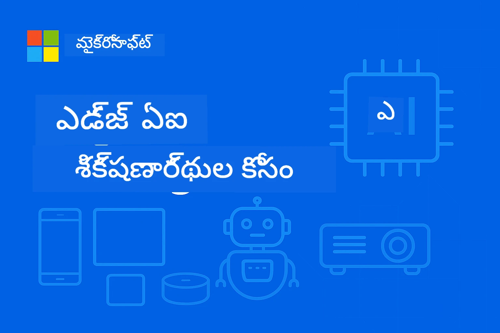

# EdgeAI for Beginners 




[](https://GitHub.com/microsoft/edgeai-for-beginners/graphs/contributors)
[](https://GitHub.com/microsoft/edgeai-for-beginners/issues)
[](https://GitHub.com/microsoft/edgeai-for-beginners/pulls)
[](http://makeapullrequest.com)

[](https://GitHub.com/microsoft/edgeai-for-beginners/watchers)
[](https://GitHub.com/microsoft/edgeai-for-beginners/fork)
[](https://GitHub.com/microsoft/edgeai-for-beginners/stargazers)


[](https://discord.gg/nTYy5BXMWG)

ఈ వనరులను ఉపయోగించడం ప్రారంభించడానికి ఈ దశలను అనుసరించండి:

1. **రిపాజిటరీ‌ను ఫోర్క్ చేయండి**: Click [](https://GitHub.com/microsoft/edgeai-for-beginners/fork)
2. **రిపాజిటరీని క్లోన్ చేయండి**:   `git clone https://github.com/microsoft/edgeai-for-beginners.git`
3. [**Azure AI Foundry Discord లో చేరండి మరియు నిపుణులు మరియు ఇతర డెవలపర్లను కలుసుకోండి**](https://discord.com/invite/ByRwuEEgH4)


### 🌐 బహుభాషా మద్దతు

#### GitHub Action ద్వారా మద్దతు (ఆటమేటెడ్ & ఎప్పుడూ నవీకరణ)

<!-- CO-OP TRANSLATOR LANGUAGES TABLE START -->
[Arabic](../ar/README.md) | [Bengali](../bn/README.md) | [Bulgarian](../bg/README.md) | [Burmese (Myanmar)](../my/README.md) | [Chinese (Simplified)](../zh-CN/README.md) | [Chinese (Traditional, Hong Kong)](../zh-HK/README.md) | [Chinese (Traditional, Macau)](../zh-MO/README.md) | [Chinese (Traditional, Taiwan)](../zh-TW/README.md) | [Croatian](../hr/README.md) | [Czech](../cs/README.md) | [Danish](../da/README.md) | [Dutch](../nl/README.md) | [Estonian](../et/README.md) | [Finnish](../fi/README.md) | [French](../fr/README.md) | [German](../de/README.md) | [Greek](../el/README.md) | [Hebrew](../he/README.md) | [Hindi](../hi/README.md) | [Hungarian](../hu/README.md) | [Indonesian](../id/README.md) | [Italian](../it/README.md) | [Japanese](../ja/README.md) | [Kannada](../kn/README.md) | [Khmer](../km/README.md) | [Korean](../ko/README.md) | [Lithuanian](../lt/README.md) | [Malay](../ms/README.md) | [Malayalam](../ml/README.md) | [Marathi](../mr/README.md) | [Nepali](../ne/README.md) | [Nigerian Pidgin](../pcm/README.md) | [Norwegian](../no/README.md) | [Persian (Farsi)](../fa/README.md) | [Polish](../pl/README.md) | [Portuguese (Brazil)](../pt-BR/README.md) | [Portuguese (Portugal)](../pt-PT/README.md) | [Punjabi (Gurmukhi)](../pa/README.md) | [Romanian](../ro/README.md) | [Russian](../ru/README.md) | [Serbian (Cyrillic)](../sr/README.md) | [Slovak](../sk/README.md) | [Slovenian](../sl/README.md) | [Spanish](../es/README.md) | [Swahili](../sw/README.md) | [Swedish](../sv/README.md) | [Tagalog (Filipino)](../tl/README.md) | [Tamil](../ta/README.md) | [Telugu](./README.md) | [Thai](../th/README.md) | [Turkish](../tr/README.md) | [Ukrainian](../uk/README.md) | [Urdu](../ur/README.md) | [Vietnamese](../vi/README.md)

> **ప్రాథమికంగా లొకల్‌గా క్లోన్ చెయ్యాలనుకుంటున్నారా?**
>
> ఈ రిపాజిటరీలో 50+ భాషల అనువాదాలు ఉన్నందున డౌన్లోడ్ పరిమాణం గణనీయంగా పెరుగుతుంది. అనువాదాలు లేకుండా క్లోన్ చేయడానికి sparse checkout ఉపయోగించండి:
>
> **Bash / macOS / Linux:**
> ```bash
> git clone --filter=blob:none --sparse https://github.com/microsoft/edgeai-for-beginners.git
> cd edgeai-for-beginners
> git sparse-checkout set --no-cone '/*' '!translations' '!translated_images'
> ```
>
> **CMD (Windows):**
> ```cmd
> git clone --filter=blob:none --sparse https://github.com/microsoft/edgeai-for-beginners.git
> cd edgeai-for-beginners
> git sparse-checkout set --no-cone "/*" "!translations" "!translated_images"
> ```
>
> ఇది కోర్సును పూర్తిచేయడానికి అవసరమైన అన్ని ఫైళ్లను మీరు వేగవంతంగా డౌన్లోడ్ చేసుకోవడానికి ఇస్తుంది.
<!-- CO-OP TRANSLATOR LANGUAGES TABLE END -->

**మీరు అదనపు అనువాద భాషలను మద్దతు ఇవ్వాలని కోరుకుంటే అవి [ఇక్కడ](https://github.com/Azure/co-op-translator/blob/main/getting_started/supported-languages.md) పొందుపర్చబడ్డాయి**
## పరిచయం

**EdgeAI for Beginners** కి స్వాగతం – ఇది ఎడ్జ్ ఆర్టిఫిషియల్ ఇంటెలిజెన్స్ ప్రపంచంలో మీ సమగ్ర ప్రయాణం. ఈ కోర్సు శక్తివంతమైన AI సామర్థ్యాలను మరియు ఎడ్జ్ పరికరాల్లో వాస్తవ ప్రపంచంలో అమలు మధ్య తేడాను భర్తీ చేస్తుంది, ఫలితంగా డేటా ఉత్పత్తి అయ్యే ప్రదేశంలోనే మరియు నిర్ణయాలు తీసుకోవలసిన చోటనే AI శక్తిని వినియోగించుకోవడాన్ని సాధ్యం చేస్తుంది.

### మీరు నేర్చుకోబోయే విషయాలు

ఈ కోర్సు మౌలిక సూత్రాల నుండి ఉత్పత్తి కు సిద్ధమైన అమలుల వరకు takes you:
- ఎడ్జ్ అమరికల కోసం ఆప్టిమైజ్ చేసిన **స్మాల్ లాంగ్వేజ్ మోడల్స్ (SLMs)**
- విభిన్న వేదికలపై **హార్డ్వేర్-అవేర్ ఆప్టిమైజేషన్**
- **ప్రైవసీ రక్షణతో రియల్-టైమ్ ఇన్ఫరెన్స్**
- సంస్థల అప్లికేషన్ల కొరకు **ఉత్పత్తి అమలు** వ్యూహాలు

### EdgeAI ఎందుకు ముఖ్యమైంది

ఎడ్జ్ AI ఆధునిక సవాళ్లను పరిష్కరించే ఒక విప్లవాత్మక దశ:
- **గోప్యత & భద్రత**: క్లౌడ్ ప్రదర్శన లేకుండా స్థానికంగా సున్నితమైన డేటాను ప్రాసెస్ చేయండి
- **తక్షణ పనితీరు**: సమయ-సంక్రమిత అప్లికేషన్లకు నెట్‌వర్క్ ఆలస్యం తొలగించండి
- **ఖర్చుల సదుపాయం**: బ్యాండ్‌విడ్త్ మరియు క్లౌడ్ కంప్యూటింగ్ ఖర్చుల తగ్గింపు
- **స్థిరమైన ఆపరేషన్లు**: నెట్‌వర్క్ అవుటేజీల సమయంలో పని కొనసాగింపు
- **నియంత్రణలు పాటించడం**: డేటా సార్వభౌమాధికార అవసరాలను తీరుస్తుంది

### ఎడ్జ్ AI

ఎడ్జ్ AI అనేది AI అల్గోరిథంలు మరియు భాషా నమూనాలనూ స్థానికంగా హార్డ్వేర్‌పై నడిపించడం, డేటా ఉత్పత్తి చోట సమీపంలోనే క్లౌడ్ संसाधనాలపై ఆధారపడకుండా. ఇది ఆలస్యం తగ్గిస్తుంది, గోప్యత పెరుగుతుంది మరియు తక్షణ నిర్ణయాలు తీసుకోవటానికి సహాయపడుతుంది.

### ముఖ్య సూత్రాలు:
- **పరికరంపై ఇన్ఫరెన్స్**: AI మోడల్స్ ఎడ్జ్ పరికరాలపై నడుస్తాయి (ఫోన్లు, రౌటర్లు, మైక్రోకంట్రోలర్స్, ఇండస్ట్రియల్ PCs)
- **ఆఫ్‌లైన్ సామర్థ్యం**: సతత ఇంటర్నెట్ కనెక్టివిటీ లేకుండానే పనిచేస్తుంది
- **తక్కువ ఆలస్యం**: రియల్-టైమ్ సిస్టమ్లకు తగిన వెంటనే స్పందనలు
- **డేటా సార్వభౌమాధికారం**: సున్నితమైన డేటాను స్థానికంగా ఉంచటం, భద్రత మరియు నియంత్రణ మెరుగుపరచటం

### స్మాల్ లాంగ్వేజ్ మోడల్స్ (SLMs)

Phi-4, Mistral-7B, Gemma వంటి SLMs పెద్ద LLM లను తగ్గించిన లేదా ప్రత్యేకంగా శిక్షణ పొందిన ఆప్టిమైజ్డ్ వర్షన్స్:
- **తక్కువ స్మృతి వాడకం**: పరిమిత ఎడ్జ్ డివైస్ మెమొరీని సమర్థవంతంగా ఉపయోగించడం
- **తక్కువ కంప్యూటింగ్ డిమాండ్**: CPU మరియు ఎడ్జ్ GPU పనితీరుకు అనుగుణంగా ఆప్టిమైజ్ చేయబడినవి
- **త్వరిత స్టార్ట్‌అప్ టైమ్స్**: స్పందనీయతతో అప్లికేషన్లకు వేగవంతమైన ప్రారంభం

వీటితో మీరు శక్తివంతమైన NLP సామర్థ్యాలను పొందవచ్చు, ఇదే constraints తో:
- **ఎంబెడెడ్ సిస్టమ్స్**: IoT పరికరాలు మరియు ఇండస్ట్రియల్ కంట్రోలర్లు
- **మొబైల్ పరికరాలు**: ఆఫ్‌లైన్ సామర్థ్యాలతో స్మార్ట్‌ఫోన్లు మరియు టాబ్లెట్లు
- **IoT పరికరాలు**: పరిమిత వనరులతో సెన్సార్లు మరియు స్మార్ట్ డివైసులు
- **ఎడ్జ్ సర్వర్లు**: పరిమిత GPU వనరులతో స్థానిక ప్రాసెసింగ్ యూనిట్లు
- **వ్యక్తిగత కంప్యూటర్లు**: డెస్క్‌టాప్ మరియు ల్యాప్‌టాప్ అమలు పరిస్థితులు

## కోర్సు మాడ్యూల్స్ & నావిగేషన్

| మాడ్యూల్ | విషయం | ఫోకస్ ఏరియా | ముఖ్య కంటెంట్ | స్థాయి | వ్యవధి |
|--------|-------|------------|-------------|--------|----------|
| [📖 00 ](./introduction.md) | [ఎడ్జ్AIకి పరిచయం](./introduction.md) | ప్రాథమికం & సందర్భం | ఎడ్జ్AI అవలోకనం • పరిశ్రమ దరఖాస్తులు • SLM పరిచయం • నేర్చుకునే లక్ష్యాలు | ప్రారంభకుడు | 1-2 గంటలు |
| [📚 01](../../Module01) | [ఎడ్జ్AI ప్రాథమికాలు](./Module01/README.md) | క్లౌడ్ vs ఎడ్జ్ AI పోలిక | ఎడ్జ్AI ప్రాథమికాలు • వాస్తవ ప్రపంచ కేస్ స్టడీస్ • అమలు గైడ్ • ఎడ్జ్ అమలు | ప్రారంభకుడు | 3-4 గంటలు |
| [🧠 02](../../Module02) | [SLM మోడల్ బేసిక్స్](./Module02/README.md) | మోడల్ కుటుంబాలు & నిర్మాణం | Phi ఫ్యామిలీ • Qwen ఫ్యామిలీ • Gemma ఫ్యామిలీ • BitNET • μModel • Phi-Silica | ప్రారంభకుడు | 4-5 గంటలు |
| [🚀 03](../../Module03) | [SLM అమలు ప్రాక్టీస్](./Module03/README.md) | స్థానిక & క్లౌడ్ అమలు | ప్రగతిశీల అభ్యాసం • స్థానిక పరిసరాలు • క్లౌడ్ అమలు | మధ్యస్థాయి | 4-5 గంటలు |
| [⚙️ 04](../../Module04) | [మోడల్ ఆప్టిమైజేషన్ టూల్‌కిట్](./Module04/README.md) | క్రాస్-ప్లాట్‌ఫాం ఆప్టిమైజేషన్ | పరిచయం • Llama.cpp • Microsoft Olive • OpenVINO • Apple MLX • workflow సంకలనం | మధ్యస్థాయి | 5-6 గంటలు |
| [🔧 05](../../Module05) | [SLMOps ఉత్పత్తి](./Module05/README.md) | ఉత్పత్తి కార్యకలాపాలు | SLMOps పరిచయం • మోడల్ డిస్టిలేషన్ • ఫైన్-ట్యూనింగ్ • ఉత్పత్తి అమలు | ఉన్నత స్థాయి | 5-6 గంటలు |
| [🤖 06](../../Module06) | [AI ఏజెంట్లు & ఫంక్షన్ కాలింగ్](./Module06/README.md) | ఏజెంట్ ఫ్రేమ్‌వర్క్‌లు & MCP | ఏజెంట్ పరిచయం • ఫంక్షన్ కాలింగ్ • మోడల్ కాంటెక్స్ట్ ప్రోటోకాల్ | ఉన్నత స్థాయి | 4-5 గంటలు |
| [💻 07](../../Module07) | [వేదిక అమలు](./Module07/README.md) | క్రాస్-ప్లాట్‌ఫాం నమూనాలు | AI టూల్‌కిట్ • Foundry లోకల్ • Windows డెవలప్‌మెంట్ | ఉన్నత స్థాయి | 3-4 గంటలు |
| [🏭 08](../../Module08) | [Foundry లోకల్ టూల్‌కిట్](./Module08/README.md) | ఉత్పత్తి-సిద్ధ నమూనాలు | నమూనా అప్లికేషన్స్ (కింద్లో వివరాలు చూడండి) | నిపుణులు | 8-10 గంటలు |

### 🏭 **మాడ్యూల్ 08: నమూనా అప్లికేషన్స్**

- [01: REST చాట్ క్విక్‌స్టార్ట్](./Module08/samples/01/README.md)
- [02: OpenAI SDK ఇంటిగ్రేషన్](./Module08/samples/02/README.md)
- [03: మోడల్ డిస్కవరీ & బెంచ్‌మార్కింగ్](./Module08/samples/03/README.md)
- [04: Chainlit RAG అప్లికేషన్](./Module08/samples/04/README.md)
- [05: మల్టీ-ఏజెంట్ ఆర్కెస్ట్రేషన్](./Module08/samples/05/README.md)
- [06: మోడల్స్-అస్-టూల్స్ రౌటర్](./Module08/samples/06/README.md)
- [07: డైరెక్ట్ API క్లయింట్](./Module08/samples/07/README.md)
- [08: విండోస్ 11 చాట్ యాప్](./Module08/samples/08/README.md)
- [09: అధునాతన మల్టీ-ఏజెంట్ సిస్టమ్](./Module08/samples/09/README.md)
- [10: Foundry టూల్స్ ఫ్రేమ్‌వర్క్](./Module08/samples/10/README.md)

### 🎓 **వర్క్‌షాప్: హ్యాండ్స్-ఆన్ లెర్నింగ్ పాత్**

ఉత్పత్తి సిద్దమైన అమలుతో సహా సమగ్ర హ్యాండ్స్-ఆన్ వర్క్‌షాప్ మెటీరియల్స్:

- **[వర్క్‌షాప్ గైడ్](./Workshop/Readme.md)** - పూర్తి నేర్చుకునే లక్ష్యాలు, ఫలితాలు, వనరు నావిగేషన్
- **Python నమూనాలు** (6 సెషన్లు) - ఉత్తమ పద్ధతులు, లోపాల నిర్వహణ, సమగ్రమైన డాక్యూమెంటేషన్ తో నవీకరించబడ్డాయి
- **Jupyter నోట్‌బుక్లు** (8 ఇంటరాక్టివ్) - అడుగు వారీ ట్యుటోరియల్స్ బెంచ్మార్క్లు మరియు పనితీరు పరిశీలనతో
- **సెషన్ గైడ్లు** - ప్రతి వర్క్‌షాప్ సెషన్ కొరకు వివరమైన మార్క్‌డౌన్ గైడ్లు
- **వెలిడేషన్ టూల్స్** - కోడ్ నాణ్యతను ధృవీకరించటానికీ మరియు స్మోక్ టెస్టులు నిర్వహించటానికి స్క్రిప్టులు

**మీరు తయారు చేసేది:**
- స్ట్రీమింగ్ మద్దతుతో స్థానిక AI చాట్ అప్లికేషన్లు
- RAG పైప్లైన్లు గుణాత్తమ పరీక్షతో (RAGAS)
- బహు-మోడల్ బెంచ్మార్కింగ్ మరియు సరిపోలిక టూల్స్
- బహు-ఏజెంట్ ఆర్కెస్ట్రేషన్ సిస్టమ్స్
- కార్యంపై ఆధారపడి మోడల్ రౌటింగ్‌తో తెలివైన వ్యవస్థలు

### 🎙️ **ఏజెంటిక్ కోసం వర్క్‌షాప్: హ్యాండ్స్-ఆన్ - ది AI పాట్‌కాస్ట్ స్టూడియో**
తొలి నుండి AI శక్తితో పనిచేసే పోडकాస్ట్ ఉత్పత్తి పైప్‌లైన్‌ను నిర్మించండి! ఈ అంతర్లీన వర్క్‌షాప్ మీకు ఒక పూర్తి బహుళ-ఏజెంట్ వ్యవస్థను సృష్టించడాన్ని నేర్పిస్తుంది, ఇది ఆలోచనలను ప్రొఫెషనల్ పోडकాస్ట్ ఎపిసోడ్‌లుగా మార్చుతుంది.

**[🎬 AI పోडकాస్ట్ స్టూడియో వర్క్‌షాప్ ప్రారంభించండి](./WorkshopForAgentic/README.md)**

**మీ మిషన్**: "Future Bytes" — మీరు స్వయంగా నిర్మించే AI ఏజెంట్ల ద్వారా పూర్తిగా నడిచే టెక్నాలజీ పోडकాస్ట్ ప్రారంభించండి. క్లౌడ్ ఆధారిత సేవలు లేదా API ఖర్చులు లేవు — అన్ని మీ మషీన్‌లో లోకల్‌గా నడుస్తాయి.

**ఇది ప్రత్యేకం చేసేది:**
- **🤖 నిజమైన బహుళ-ఏజెంట్ సమన్వయం** - పరిశోధన చేస్తా, రాయటం, ఆడియో ఉత్పత్తి చేసే ప్రత్యేక AI ఏజెంట్లను నిర్మించండి
- **🎯 పూర్తి ఉత్పత్తి పైప్‌లైన్** - విషయ ఎంపిక నుండి తుది పోडकాస్ట్ ఆడియో అవుట్‌పుట్ వరకు
- **💻 100% లోకల్ డిప్లాయ్‌మెంట్** - పూర్తిచూ గోప్యత మరియు నియంత్రణ కోసం Ollama మరియు లోకల్ మోడల్స్ (Qwen-3-8B) ఉపయోగిస్తుంది
- **🎤 టెక్స్ట్-టు-స్పీచ్ సమీకరణ** - స్క్రిప్ట్స్ ను సహజ శబ్దాల బహుళ-వక్తల సంభాషణలుగా మార్చండి
- **✋ హ్యూమన్-ఇన్-ది-లూప్ వర్క్‌ఫ్లోస్** - ఆమోద గేట్లు ఆటోమేషన్‌ని కొనసాగిస్తూ నాణ్యతను నిర్ధారిస్తాయి

**మూడు అంకాల శిక్షణ ప్రయాణం:**

| అంకం | దృష్టి | ప్రాథమిక నైపుణ్యాలు | వ్యవధి |
|-----|-------|------------|----------|
| **[అంకం 1: మీ AI సహాయకులను కలుసుకొండి](./WorkshopForAgentic/md/01.BuildAIAgentWithSLM.md)** | మీ మొదటి AI ఏజెంట్ నిర్మించండి | టూల్ ఇంటిగ్రేషన్ • వెబ్ శోధన • సమస్య పరిష్కారం • ఏజెంటిక్ తర్కం | 2-3 గంటలు |
| **[అంకం 2: మీ ఉత్పత్తి బృందాన్ని సమకూర్చండి](./WorkshopForAgentic/md/02.AIAgentOrchestrationAndWorkflows.md)** | బహుళ ఏజెంట్లను సమన్వయం చేయండి | బృంద సమన్వయం • ఆమోద వర్క్‌ఫ్లోస్ • DevUI ఇంటర్‌ఫేస్ • మానవ పర్యవేక్షణ | 3-4 గంటలు |
| **[అంకం 3: మీ పోडकాస్ట్‌ను జీవింప చేయండి](./WorkshopForAgentic/md/03.Multi-SpeakerPodcastGenerationWithVibeVoice.md)** | పోडकాస్ట్ ఆడియో ఉత్పత్తి చేయండి | టెక్స్ట్-టు-స్పీచ్ • బహుళ-వక్తల సంశ్లేషణ • దీర్ఘ-ఆకారం ఆడియో • పూర్తి ఆటోమేషన్ | 2-3 గంటలు |

**ఉపయోగించిన సాంకేతికతలు:**
- **Microsoft Agent Framework** - బహుళ ఏజెంట్ సమన్వయం మరియు అన్వయము
- **Ollama** - లోకల్ AI మోడల్ రన్‌టైమ్ (క్లౌడ్ అవసరం లేదు)
- **Qwen-3-8B** - ఏజెంటిక్ పనుల కోసం ఆప్టిమైజ్ చేసిన ఓపెన్-సోర్స్ భాషా మోడల్
- **టెక్స్ట్-టు-స్పీచ్ APIs** - పోडकాస్ట్ ఉత్పత్తి కోసం సహజ శబ్దం సంశ్లేషణ

**హార్డు‌వేర్ మద్దతు:**
- ✅ **CPU మోడ్** - ఏ ఆధునిక కంప్యూటర్ మీదనైనా పని చేస్తుంది (8GB+ RAM సిఫార్సు)
- 🚀 **GPU శక్తివంతత** - NVIDIA/AMD GPUలతో గణనీయంగా వేగవంతమైన పరిశీలన
- ⚡ **NPU మద్దతు** - తదుపరి తరహా న్యూరల్ ప్రాసెసింగ్ యూనిట్ మద్దతు

**ఇది ప్రత్యేకంగా అనువైనవారి కోసం:**
- బహుళ ఏజెంట్ AI సిస్టమ్స్ నేర్చుకునే అభివృద్ధి కర్తలు
- AI ఆటోమేషన్ మరియు వర్క్‌ఫ్లోస్ లో ఆసక్తి ఉన్న ప్రతి ఒక్కరూ
- AI సహాయంతో ఉత్పత్తిని అన్వేషించే కంటెంట్ సృష్టికర్తలు
- ఆచరణాత్మక AI సమన్వయం నమూనాలను అధ్యయనం చేసే విద్యార్థులు

**నిర్మాణం ప్రారంభించండి**: [🎙️ AI పోडकాస్ట్ స్టూడియో వర్క్‌షాప్ →](./WorkshopForAgentic/README.md)

### 📊 **అభ్యాస మార్గం సారాంశం**
- **మొత్తం వ్యవధి**: 36-45 గంటలు
- **ప్రాథమిక మార్గం**: మాడ్యూల్స్ 01-02 (7-9 గంటలు)  
- **మధ్యస్థ మార్గం**: మాడ్యూల్స్ 03-04 (9-11 గంటలు)
- **అధికస్థాయి మార్గం**: మాడ్యూల్స్ 05-07 (12-15 గంటలు)
- **నిపుణుల మార్గం**: మాడ్యూల్ 08 (8-10 గంటలు)

## మీరు నిర్మించనున్నది

### 🎯 ముఖ్య నైపుణ్యాలు
- **ఎడ్జ్ AI ఆర్కిటెక్చర్**: లోకల్-ఫస్ట్ AI సిస్టమ్స్ క్లౌడ్ సమన్వయంతో డిజైన్ చేయండి
- **మోడల్ ఆప్టిమైజేషన్**: ఎడ్జ్ డిప్లాయ్‌మెంట్ కోసం మోడల్స్‌ను క్వాంటైజ్ చేసి కుదించండి (85% వేగవంతత, 75% పరిమాణం తగ్గింపు)
- **బహుళ-ప్లాట్‌ఫాం డిప్లాయ్‌మెంట్**: విండోస్, మొబైల్, ఎంబెడ్డెడ్, మరియు క్లౌడ్-ఎడ్జ్ హైబ్రిడ్ సిస్టమ్స్
- **ఉత్పత్తి ఆపరేషన్స్**: ఎడ్జ్ AI ప్రొడక్షన్‌లో మానిటరింగ్, స్కేలింగ్ మరియు నిర్వహణ

### 🏗️ ప్రాక్టికల్ ప్రాజెక్టులు
- **Foundry లోకల్ చాట్ యాప్స్**: విండోస్ 11 స్వదేశీ యాప్ మోడల్ స్విచింగ్‌తో
- **బహుళ-ఏజెంట్ సిస్టమ్స్**: క్లిష్ట వర్క్‌ఫ్లోస్‌ల కోసం సమన్వయకర్తతో నిపుణ ఏజెంట్లు  
- **RAG అప్లికేషన్‌లు**: లోకల్ డాక్యుమెంట్ ప్రాసెసింగ్ వెక్టర్ శోధనతో
- **మోడల్ రౌటర్స్**: పనితీరు విశ్లేషణ ఆధారంగా మోడల్స్ మధ్య నైపుణ్య పూర్వక ఎంపిక
- **API ఫ్రేమ్‌వర్క్స్**: ప్రొడక్షన్-సన్నద్ధ క్లయింట్లు స్ట్రీమింగ్ మరియు ఆరోగ్య పరిశీలనతో
- **క్రాస్-ప్లాట్‌ఫార్మ్ టూల్స్**: LangChain/Semantic Kernel సమీకరణ నమూనాలు

### 🏢 పరిశ్రమ అప్లికేషన్లు
**తయారీ** • **ఆరోగ్య పరిరక్షణ** • **స్వీయాచలన వాహనాలు** • **స్మార్ట్ నగరాలు** • **మొబైల్ యాప్స్**

## తొందరగా ప్రారంభించండి

**సిఫార్సు చేయబడిన అభ్యాస మార్గం** (మొత్తం 20-30 గంటలు):

0. **📖 పరిచయం** ([Introduction.md](./introduction.md)): EdgeAI ప్రకారం + పరిశ్రమ నేపథ్యం + అభ్యాస ఫ్రేమ్‌వర్క్
1. **📚 స్థాపనా** (మాడ్యూల్స్ 01-02): EdgeAI సూత్రాలు + SLM మోడల్ కుటుంబాలు
2. **⚙️ ఆప్టిమైజేషన్** (మాడ్యూల్స్ 03-04): డిప్లాయ్‌మెంట్ + క్వాంటైజేషన్ ఫ్రేమ్‌వర్క్స్  
3. **🚀 ఉత్పత్తి** (మాడ్యూల్స్ 05-06): SLMOps + AI ఏజెంట్లు + ఫంక్షన్ కాల్లింగ్
4. **💻 అమలు** (మాడ్యూల్స్ 07-08): ప్లాట్‌ఫార్మ్ నమూనాలు + Foundry లోకల్ టూల్‌కిట్

ప్రతి మాడ్యూల్‌లో సిద్ధాంతం, హ్యాండ్స్-ఆన్ వ్యాయామాలు, ఉత్పత్తి-సన్నద్ధ కోడ్ నమూనాలు ఉంటాయి.

## వృత్తి ప్రభావం

**సాంకేతిక పాత్రలు**: EdgeAI సొల్యూషన్స్ ఆర్కిటెక్ట్ • ML ఇంజనీర్ (ఎడ్జ్) • IoT AI డెవలపర్ • మొబైల్ AI డెవలపర్

**ఇండస్ట్రీ రంగాలు**: మాన్యుఫ్యాక్చరింగ్ 4.0 • ఆరోగ్య సాంకేతికత • స్వీయాచలన సిస్టమ్స్ • ఫిన్‌టెక్ • వినియోగ ఎలక్ట్రానిక్స్

**పోర్ట్‌ఫోలియో ప్రాజెక్టులు**: బహుళ-ఏజెంట్ సిస్టమ్లు • ప్రొడక్షన్ RAG యాప్స్ • క్రాస్-ప్లాట్‌ఫార్మ్ డిప్లాయ్‌మెంట్ • పనితీరు ఆప్టిమైజేషన్

## రేపోజిటరీ నిర్మాణం

```
edgeai-for-beginners/
├── 📖 introduction.md  # Foundation: EdgeAI Overview & Learning Framework
├── 📚 Module01-04/     # Fundamentals → SLMs → Deployment → Optimization  
├── 🔧 Module05-06/     # SLMOps → AI Agents → Function Calling
├── 💻 Module07/        # Platform Samples (VS Code, Windows, Jetson, Mobile)
├── 🏭 Module08/        # Foundry Local Toolkit + 10 Comprehensive Samples
│   ├── samples/01-06/  # Foundation: REST, SDK, RAG, Agents, Routing
│   └── samples/07-10/  # Advanced: API Client, Windows App, Enterprise Agents, Tools
├── 🌐 translations/    # Multi-language support (8+ languages)
└── 📋 STUDY_GUIDE.md   # Structured learning paths & time allocation
```

## కోర్సు హైలైట్స్

✅ **ప్రగతిశీల అభ్యాసం**: సిద్ధాంతం → అనুশీలనం → ఉత్పత్తి డిప్లాయ్‌మెంట్  
✅ **నిజమైన కేసు అధ్యయనాలు**: Microsoft, జపాన్ ఎయిర్లైన్స్, సంస్థా అమలు  
✅ **హ్యాండ్స్-ఆన్ నమూనాలు**: 50+ ఉదాహరణలు, 10 మొత్తం Foundry లోకల్ డెమోలు  
✅ **పనితీరు దృష్టి**: 85% వేగం పెంపు, 75% పరిమాణం తగ్గింపు  
✅ **బహుళ-ప్లాట్‌ఫార్మ్**: విండోస్, మొబైల్, ఎంబెడ్డెడ్, క్లౌడ్-ఎడ్జ్ హైబ్రిడ్  
✅ **ప్రొడక్షన్ సన్నద్ధం**: మానిటరింగ్, స్కేలింగ్, భద్రత, కంప్లయెన్స్ ఫ్రేమ్‌వర్క్స్

📖 **[స్టడీ గైడ్ అందుబాటులో ఉంది](STUDY_GUIDE.md)**: సమయ కేటాయింపు మార్గదర్శకం మరియు స్వీయ-అంచనా పరికరాలతో 20 గంటల నిర్మాణాత్మక అభ్యాస మార్గం.

---

**EdgeAI అనేది AI డిప్లాయ్‌మెంట్ యొక్క భవిష్యత్తును ప్రతిబింబిస్తుంది**: లోకల్-ఫస్ట్, గోప్యతా పరిరక్షణతో మరియు సమర్థవంతంగా. తదుపరి తరం తెలివైన అనువర్తనాలను నిర్మించేందుకు ఈ నైపుణ్యాలను అభ్యసించండి.

## ఇతర కోర్సులు

మా బృందం ఇతర కోర్సులు కూడా తయారు చేస్తోంది! చూసుకోండి:

<!-- CO-OP TRANSLATOR OTHER COURSES START -->
### LangChain
[](https://aka.ms/langchain4j-for-beginners)
[](https://aka.ms/langchainjs-for-beginners?WT.mc_id=m365-94501-dwahlin)
[](https://github.com/microsoft/langchain-for-beginners?WT.mc_id=m365-94501-dwahlin)
---

### Azure / Edge / MCP / Agents
[](https://github.com/microsoft/AZD-for-beginners?WT.mc_id=academic-105485-koreyst)
[](https://github.com/microsoft/edgeai-for-beginners?WT.mc_id=academic-105485-koreyst)
[](https://github.com/microsoft/mcp-for-beginners?WT.mc_id=academic-105485-koreyst)
[](https://github.com/microsoft/ai-agents-for-beginners?WT.mc_id=academic-105485-koreyst)

---
 
### జనరేటివ్ AI సిరీస్
[](https://github.com/microsoft/generative-ai-for-beginners?WT.mc_id=academic-105485-koreyst)
[-9333EA?style=for-the-badge&labelColor=E5E7EB&color=9333EA)](https://github.com/microsoft/Generative-AI-for-beginners-dotnet?WT.mc_id=academic-105485-koreyst)
[-C084FC?style=for-the-badge&labelColor=E5E7EB&color=C084FC)](https://github.com/microsoft/generative-ai-for-beginners-java?WT.mc_id=academic-105485-koreyst)
[-E879F9?style=for-the-badge&labelColor=E5E7EB&color=E879F9)](https://github.com/microsoft/generative-ai-with-javascript?WT.mc_id=academic-105485-koreyst)

---
 
### ప్రాధమిక అభ్యాసం
[](https://aka.ms/ml-beginners?WT.mc_id=academic-105485-koreyst)
[](https://aka.ms/datascience-beginners?WT.mc_id=academic-105485-koreyst)
[](https://aka.ms/ai-beginners?WT.mc_id=academic-105485-koreyst)
[](https://github.com/microsoft/Security-101?WT.mc_id=academic-96948-sayoung)
[](https://aka.ms/webdev-beginners?WT.mc_id=academic-105485-koreyst)
[](https://aka.ms/iot-beginners?WT.mc_id=academic-105485-koreyst)
[](https://github.com/microsoft/xr-development-for-beginners?WT.mc_id=academic-105485-koreyst)

---
 
### కోపైలట్ సిరీస్

[](https://aka.ms/GitHubCopilotAI?WT.mc_id=academic-105485-koreyst)
[](https://github.com/microsoft/mastering-github-copilot-for-dotnet-csharp-developers?WT.mc_id=academic-105485-koreyst)
[](https://github.com/microsoft/CopilotAdventures?WT.mc_id=academic-105485-koreyst)
<!-- CO-OP TRANSLATOR OTHER COURSES END -->

## సహాయం పొందడం

మీరు చిక్కులలో పడితే లేదా AI యాప్స్ నిర్మించడం గురించి ఏవైనా ప్రశ్నలు ఉంటే, చేరండి:

[](https://discord.gg/nTYy5BXMWG)

మీకు ఉత్పత్తి అభిప్రాయం లేక పొరపాట్లు ఉంటే, నిర్మాణ సమయంలో సందర్శించండి:

[](https://aka.ms/foundry/forum)

---

<!-- CO-OP TRANSLATOR DISCLAIMER START -->
**అస్పష్టత**:  
ఈ డాక్యుమెంట్ AI అనువాద సేవ [Co-op Translator](https://github.com/Azure/co-op-translator) ఉపయోగించి అనువదించబడింది. మనం ఖచ్చితత్వానికి శ్రమిస్తున్నప్పటికీ, ఆటోమేటెడ్ అనువాదాలలో లోపాలు లేదా తప్పులు ఉండవచ్చు అని దయచేసి గమనించండి. అసలు డాక్యుమెంట్ యొక్క స్థానిక భాషలో ఉన్న అనేది అధికారిక మూలంగా భావించాలి. కీలక సమాచారం కోసం, నైపుణ్యం కలిగిన మానవ అనువాదం సిఫార్సు చేయబడుతుంది. ఈ అనువాదం వలన వచ్చే ఏదైనా తప్పు అర్ధాల దోషాలు లేదా అపార్థాలకు మేము బాధ్యత వహించము.
<!-- CO-OP TRANSLATOR DISCLAIMER END -->