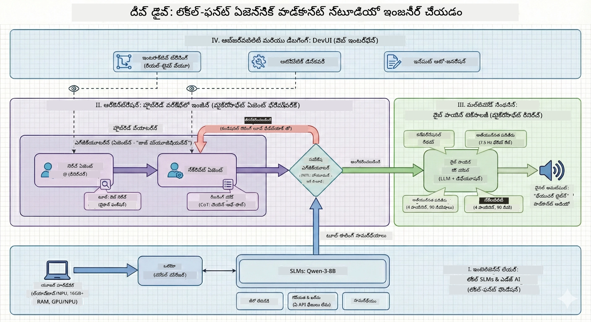

<!--
CO_OP_TRANSLATOR_METADATA:
{
  "original_hash": "f94e745264597bc5d8df967ead2eff97",
  "translation_date": "2026-01-05T11:02:28+00:00",
  "source_file": "WorkshopForAgentic/README.md",
  "language_code": "te"
}
-->
# 🎙️ ది ఎ ఐ పోडकాస్ట్ స్టూడియో వర్క్‌షాప్

> 🌏 [中文版 (చైనీస్ వెర్షన్)](translation/zh-cn/README.md)


## మీ మిషన్

**ది ఎ ఐ పోडकాస్ట్ స్టూడియో**కి స్వాగతం! మీరు "Future Bytes" అనే మీ సొంత టెక్ పోडकాస్ట్ ప్రారంభించబోతున్నారు — కానీ ఇక్కడ ఒక టwist ఉంది: మీరు దీన్ని సృష్టించడానికి AI-చే బాధ్యత వహించే ఉత్పత్తి టీం నిర్మించబోతున్నారు. మరిన్ని గంటల పాటు పరిశోధన, స్క్రిప్ట్ రచనా, ఆడియో ఎడిటింగ్ అవసరం లేదు. బదులు, మీరు AI సూపర్‌పవర్స్‌తో పోडकాస్ట్ నిర్మాతగా మారేందుకు కోడింగ్ చేయబోతున్నారు.

## కథ

కల్పన చేయండి: మీరు మరియు మీ స్నేహితులు చాలా చల్లని టెక్ ట్రెండ్ల గురించి పోडकాస్ట్ ప్రారంభించాలనుకుంటున్నారు, కానీ అందరూ పాఠశాల, పని, లేదా జీవితం కారణంగా బిజీగా ఉన్నారు. మీరు భారీ పనులు చేయడానికి ఒక AI ఏజెంట్ల టీం నిర్మించి ఉంటే? ఒక ఏజెంట్ విషయాలు పరిశోధిస్తాడు, మరొకటి ఆకర్షణీయమైన స్క్రిప్ట్‌లు రాస్తాడు, మూడవది టెక్స్ట్‌ను సహజ శబ్ద సంభాషణలుగా మారుస్తుంది. సైన్స్-ఫిక్షన్‌గా అనిపిస్తుందా? దాన్ని నిజం చేద్దాం.

## మీరు ఏమి నేర్చుకుంటారు

ఈ వర్క్‌షాప్ చివరిలో, మీరు ఎలా చేయాలో తెలుసుకోవచ్చు:
- 🤖 మీ సొంత లోకల్ AI మోడల్‌ను ప్రవేశపెట్టడం (ఏ API ఖర్చులు లేవు, క్లౌడ్ ఆధారితత లేదు!)
- 🔧 నిజంగా కలిసి పనిచేసే ప్రత్యేక AI ఏజెంట్లను నిర్మించడం
- 🎬 ఆలోచన నుండి ఆడియో దాకా సంపూర్ణ పోडकాస్ట్ ఉత్పత్తి పైప్‌లైన్ సృష్టించడం

## మీ ప్రయాణం: మూడు సంఘటనలు



ఏ మంచి కథలా, మాకు మూడు సంఘటనలు ఉన్నాయి. ప్రతి దశ AI పోडकాస్ట్ స్టూడియోను ముక్కలవారీగా నిర్మిస్తుంది:

| ఎపిసోడ్ | మీ కార్యం | ఏమి జరుగుతుంది | నేర్చుకునే నైపుణ్యాలు |
|---------|-----------|--------------|----------------|
| **సంఘటన 1** | [మీ AI సహాయకులను కలవండి](md/01.BuildAIAgentWithSLM.md) | మీరు చాటింగ్ చేయగల, వెబ్ శోధన చేసే, సమస్యలు పరిష్కరించే AI ఏజెంట్లను సృష్టించడం ఎలా అనేది తెలుసుకుంటారు. వీరు ఎప్పుడూ నిద్రపోనివారు కనిపించే పరిశోధనా ఇంటర్న్స్ లా భావించండి. | 🎯 మీ మొదటి ఏజెంట్‌ని నిర్మించండి<br>🛠️ దానికి సూపర్పవర్స్ ఇవ్వండి (సాధనాలు!)<br>🧠 ఆలోచించడం నేర్పించండి<br>🌐 దీనిని ఇంటర్నెట్‌తో కలపండి |
| **సంఘటన 2** | [మీ ఉత్పత్తి టీమ్‌ను ఏర్పరచండి](md/02.AIAgentOrchestrationAndWorkflows.md) | ఇప్పుడు మా విషయంలో հետաքրքించనివి! మీరు ఒకటి కంటే ఎక్కువ AI ఏజెంట్లను కలిసి పనిచేయించేలా సమన్వయం చేస్తారు. ఒక వ్యక్తి పరిశోధన చేస్తాడు, మరొకరు రాస్తారు, మీరు ఆమోదిస్తారు — టీమ్‌వర్క్‌తో కలసి స్వప్నం నెరవేర్చుతారు. | 🎭 బహుళ ఏజెంట్లను సమన్వయం చేయండి<br>🔄 ఆమోద ప్రవర్తనలు నిర్మించండి<br>🖥️ DevUI ఇంటర్‌ఫేస్‌తో పరీక్షించండి<br>✋ మానవులను నియంత్రణలో ఉంచండి |
| **సంఘటన 3** | [మీ పోडकాస్ట్‌కు జీవితం తెచ్చండి](md/03.Multi-SpeakerPodcastGenerationWithVibeVoice.md) | ఫైనల్! మీ టెక్స్ట్ స్క్రిప్ట్‌లను వాస్తవ పోडकాస్ట్ ఆడియోగా మార్చండి, సహజ సంభాషణలతో మరియు నిజమైన గొప్ప స్వరాలతో. మీ "Future Bytes" పోडकాస్ట్ విడుదలకు సిద్ధం! | 🎤 టెక్స్ట్-టు-స్పీచ్ మాయం<br>👥 బహుళ స్పీకర్ స్వరాలు<br>⏱️ దీర్ఘఫార్మ్ ఆడియో<br>🚀 పూర్తి ఆటోమేషన్ |

ప్రతి సంఘటన కొత్త సామర్ధ్యాలను అందిస్తుంది. ధైర్యముంటే ముందుకు వెళ్లండి, కానీ కథను అనుసరించడం మేలుగా ఉంటుంది!

## పరిసర అవసరాలు

ఈ వర్క్‌షాప్ వివిధ హార్డ్‌వేర్ పరిసరాలను మద్దతిస్తుంది:
- **CPU**: పరిశీలన మరియు చిన్న ప్రామాణిక వినియోగానికి అనుకూలం
- **GPU**: ఉత్పత్తి పరిసరాలకు సిఫార్సు చేయబడింది, ఇన్‌ఫరెన్స్ వేగాన్ని గణనీయంగా పెంచుతుంది
- **NPU**: తదుపరి తరం న్యూరల్ ప్రాసెసింగ్ యూనిట్ వేగవంతकरणకు మద్దతు ఇస్తుంది

## మీకు ఏం అవసరం

### సాఫ్ట్‌వేర్ చెక్‌లిస్ట్ ✅
- **Python 3.10+** (మీ కోడింగ్ భాష)
- **Ollama** (మీ యంత్రంలో AI మోడల్స్ నడపడానికి)
- **VS Code** (మీ కోడ్ ఎడిటర్)
- **Python ఎక్స్‌టెన్షన్** (VS Codeని ఎక్కువ చతురంగా మార్చుతుంది)
- **Git** (కోడ్ తీసుకోవడానికి)

### హార్డ్‌వేర్ చెక్ 💻
- **ఇది నడపగలనా?**: 8GB RAM, 10GB ఉచిత స్థలం (పని చేస్తుంది, కానీ కొద్దీ మందగిస్తుంది)
- **ఇష్టమైన సెట్టింగ్**: 16GB+ RAM, మంచి GPU (స్కూతర్ల వంటిది!)
- **NPU ఉందా?**: ఇంకా బెటర్! తదుపరి తరం పనితీరు అందుబాటులో 🚀

## మీ స్టూడియోను సెటప్ చేయండి 🎬

### దశ 1: Python శక్తి

Python 3.10 లేదా పై ఉన్నదనికి ఖచ్చితంగా చూసుకోండి:

```bash
python --version
# పాటించవలసింది Python 3.10.x లేదా అంతకంటే పైగా
```

Python లేనట్లయితే? [python.org](https://python.org) నుండి తీసుకోండి — ఇది ఉచితం!

### దశ 2: Ollama (మీ AI మోడల్ రన్నర్) పొందండి

మీ OS కోసం Ollamaని [ollama.ai](https://ollama.ai) నుండి డౌన్లోడ్ చేసుకోండి. ఇది మీ AI మోడల్స్‌ను లోకల్‌గా నడిపించే ఇంజిన్ లాంటిది.

సిద్ధమో లేదో చెక్ చేయండి:

```bash
ollama --version
```

### దశ 3: మీ AI మెదడు డౌన్లోడ్ చేసుకోండి 🧠

Qwen-3-8B మోడల్‌ను అందుకోడానికి సమయం వచ్చింది (ముందటి AI సహాయకుడిని నియామనం చేయడం వంటి):

```bash
ollama pull qwen3:8b
```

*ఇది కొన్ని నిమిషాలు పట్టవచ్చు. కాఫీ విరామానికి సమయం! ☕*

### దశ 4: VS Code సెటప్ చేయండి

[Visual Studio Code](https://code.visualstudio.com/) లేకపోతే, దాన్ని గడిపుకోండి. ఇది ఉత్తమ కోడ్ ఎడిటర్ (నన్ను లేటి 😄).

### దశ 5: Python ఎక్స్‌టెన్షన్

VS Codeలో:
1. `Ctrl+Shift+X` (లేదా Macలో `Cmd+Shift+X`) నొక్కండి
2. "Python" అని వెతకండి
3. అధికార Microsoft Python ఎక్స్‌టెన్షన్ ను ఇన్‌స్టాల్ చేయండి

### దశ 6: మీరు పూర్తయారు! 🎉

సీరియస్‌గా, మీరు సిద్ధంగా ఉన్నారు. కొన్ని AI మాయ జాదూ చేద్దాం!

### దశ 7: Microsoft Agent Framework మరియు సంబంధిత ప్యాకేజీలను ఇన్‌స్టాల్ చేయండి 📦

వర్క్‌షాప్ కోసం అవసరమైన అన్ని డిపెండెన్సీలు ఇన్‌స్టాల్ చేయండి:

```bash
pip install -r ./Installations/requirements.txt -U
```

*ఇది Microsoft Agent Framework మరియు అన్ని అవసరమైన ప్యాకేజీలను ఇన్‌స్టాల్ చేస్తుంది. కాఫీ తాగండి — మొదటి సారి సెటప్ కొంతసేపు పడవచ్చు! ☕*

## వర్క్‌షాప్ సూచనలు

వివరమైన ప్రాజెక్ట్ నిర్మాణం, కాన్ఫిగరేషన్ దశలు, మరియు అమలు విధానాలు వర్క్‌షాప్ సమయంలో దశలవారీగా వివరించబడతాయి.

## సమస్యలకు పరిష్కారాలు (పరిస్థితులు తప్పినప్పుడు) 🔧

### "అయ్యో, మోడల్ డౌన్లోడ్ చాలా సేపు పడుతుంది!"
**పరిష్కారం**: VPN ఉపయోగించండి లేదా Ollamaని మిర్రర్ సోర్స్‌తో కాన్ఫిగర్ చేయండి. కొన్ని సార్లు ఇంటర్నెట్ మన వదిలిపెట్టదు.

### "నా కంప్యూటర్ కూల్చుకుంటోంది! మెమొరీ పూర్తయ్యింది!"
**పరిష్కారం**: చిన్న మోడల్‌కు మారండి లేదా `num_ctx` సెట్టింగ్‌ను తగ్గించండి. మీ AIకి డైట్ పెట్టడంలా భావించండి.

### "GPUతో ఇది వేగంగా చేయాల్సింది?"
**పరిష్కారం**: Ollama GPUలను ఆటో-డిటెక్ట్ చేస్తుంది! మీ GPU డ్రైవర్లు తాజా ఉన్నాయేమో చూడండి. ఉచిత వెగం బూస్ట్! 🏎️

## అదనపు వనరులు (ఆసక్తికరులకు) 📚

- [Ollama డాక్యుమెంట్‌లు](https://github.com/ollama/ollama) — లోకల్ AI మోడల్స్ లో గాఢంగా తెలుసుకోండి
- [Microsoft Agent Framework](https://microsoft.github.io/autogen/) — ఏజెంట్ టీమ్‌లను నిర్మించడం గురించి మరింత తెలుసుకోండి
- [Qwen మోడల్ సమాచారం](https://qwenlm.github.io/) — మీ AI సహాయకుని మెదడును పరిచయం చేసుకోండి

## లైసెన్సు

MIT లైసెన్సు — మేటి వస్తువులు నిర్మించండి, పంచుకోండి, ప్రపంచాన్ని మెరుగుపరచండి! 🌍

## కాంట్రిబ్యూట్ చేయాలనుకుంటున్నారా?

బగ్ దొరికినట్లయితే? ఐడియా ఉన్నదా? ఇష్యూ లేదా PR వేసేయండి! మేము కమ్యూనిటీ వాతావరణాన్ని ఇష్టపడతాము. ✨

---

<!-- CO-OP TRANSLATOR DISCLAIMER START -->
**డిస్క్లెయిమర్**:  
ఈ డాక్యూమెంట్‌ను AI అనువాద సేవ [Co-op Translator](https://github.com/Azure/co-op-translator) ఉపయోగించి అనువదించబడింది. మేము సరైన అనువాదానికి శ్రమిస్తామని ఆశిస్తున్నప్పటికీ, ఆప్రమేయ అనువాదాల్లో లోపాలు లేదా పొరపాట్లు ఉండవచ్చు. స్వదేశీ భాషలో ఉన్న ఆర్ల డాక్యూమెంట్‌ను సర్వాధికారిక ఆధారంగా పరిగణించాలి. ముఖ్యమైన సమాచారానికి, వృత్తిపరమైన మానవ అనువాదం సూచించబడుతుంది. ఈ అనువాదం వాడుక నుండి సృష్టించే ఏవైనా భ్రమలు లేదా తప్పు అర్థం చేసుకోవడంపై మేము బాధ్యత ఉండము.
<!-- CO-OP TRANSLATOR DISCLAIMER END -->