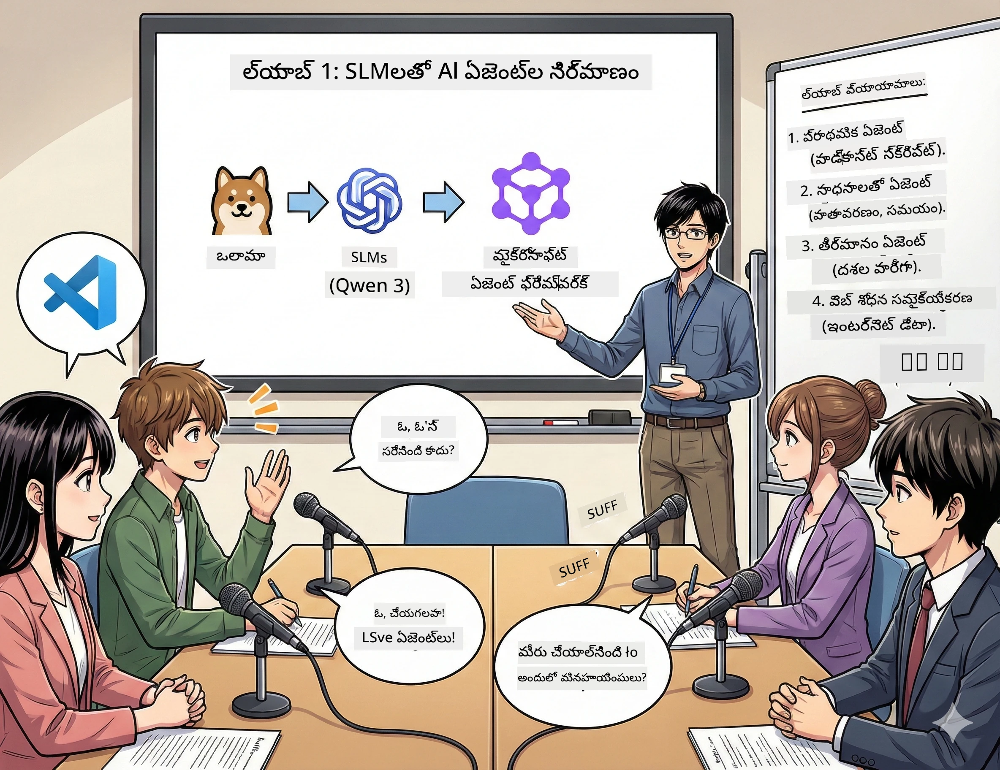

<!--
CO_OP_TRANSLATOR_METADATA:
{
  "original_hash": "7868fa418386aa7167bea3ff5ba8390b",
  "translation_date": "2026-01-05T13:29:12+00:00",
  "source_file": "WorkshopForAgentic/md/01.BuildAIAgentWithSLM.md",
  "language_code": "te"
}
-->
# పాఠం 1: మీ AI పరిశోధనా సహాయకుడిని కలవండి 🤖



## సవాలు

మీరు "Future Bytes" అనే కొత్త టెక్ పోडकాస్ట్‌ను ప్రారంభించుతున్నారు. ఎపిసోడ్ 1 తాజా AI అగ్రగామి గురించి, కానీ మీకు 24 గంటలు మాత్రమే ఉన్నాయి:
1. విషయం బట్టి పరిశోధన చేయడం
2. విశ్వసనీయ మూలాలను కనుగొనడం
3. ఆకట్టుకునే స్క్రిప్ట్ రాయడం
4. సహజంగా శబ్దం రావడం

**కథానక మార్పు**: మీరు ఒకరుగా చేయాల్సిన అవసరం లేదు. మీరు మీ మొదటి AI సహాయకుడిని నిర్మించబోతున్నారు, అతను ఈ అన్నింటికీ సహాయం చేస్తాడు. వారి పేరును అలెక్స్ అని పెట్టుకుందాం — ఎప్పుడూ నిద్రపోని మీ అమిత పరిశోధనా భాగస్వామి.

## చిన్న భాషా మోడల్స్ ఎందుకు? (స్పాయిలర్: అవి అద్భుతం)

చిన్న భాషా మోడల్స్ (SLMs) అనేవి *మీ* కంప్యూటరులో నిమగ్నమైన వ్యక్తిగత AIగా భావించండి. క్లౌడ్ లేదు, నెలవారీ ఛార్జీలు లేవు, డేటా పంచుకునే ప్రమాదాలు లేవు.

**SLMs ఎందుకు 🔥:**
- **🏠 మీ యంత్రంపై నడుస్తుంది**: ల్యాప్‌టాప్, డెస్క్‌టాప్, లేదా బలమైన Raspberry Pi కూడా
- **💸 గడువైన ఖర్చులు లేకుండా**: API ఫీజులు మీ కి బజెట్ తినవు
- **🔒 గోప్యతా ప్రథమం**: మీ డేటా మీ పరికరం దాటి బయటకు పోదు
- **⚡ వేగంగా**: ఇంటర్నెట్ లాగ్ లేకుండా, వెంటనే స్పందనలు
- **🪦 తేలికపాటి**: 1B-10B పరిమాణాల ప్యారామీటర్లతో పెద్ద మోడల్స్ (100B+) తులన థు తేలికైనవి

**ప్రసిద్ధ SLMలు**: Qwen 3, Phi-4, Gemma 3 (మనం ఈ వర్క్‌షాప్‌కి Qwen ఉపయోగిస్తున్నాం)

## మీ పనిముట్లు

### Ollama: మీ AI మోడల్ మేనేజర్

[Ollama](https://ollama.com/) అనేది AI మోడల్స్ కోసం Steam లాంటిది. మోడల్స్‌ను డౌన్లోడ్ చేసి నడపగలదు, సులభ ఆదేశాలతో నిర్వహించవచ్చు.

**దీన్ని ప్రత్యేకం చేసే అంశాలు:**
- ఏదైనా మోడల్ ఒక ఆదేశంతో డౌన్లోడ్ చేసి నడిపించుకోండి
- Mac, Windows, Linuxపై పనిచేస్తుంది
- మీకు GPU ఉంటే ఆటోమేటిక్‌గా ఉపయోగిస్తుంది
- మెమరీ-సమర్థవంతమైన

### Microsoft Agent Framework: మాంత్రికత ఇక్కడ జరుగుతుంది

[Microsoft Agent Framework](https://github.com/microsoft/agent-framework) అనేది మీరు AI ఏజెంట్లను రాబట్టే ప్రదేశం, వీటివి చేయగలవు:

- 💬 చాటింగ్ చేసి మీరు చెప్పినదాన్ని గుర్తుంచుకోవడం
- 🛠️ ప్రత్యేక టూల్స్ ఉపయోగించడం (వెబ్ సెర్చ్ చేసి వాతావరణం తెలుసుకోవడం)
- 🧠 క్లిష్టమైన సమస్యలను దశల వారీగా ఆలోచించడం
- 🤝 ఇతర ఏజెంట్లతో సమూహంగా పని చేయడం
- 🔌 వేర్వేరు AI ప్రొవైడర్ల (OpenAI, Ollama, Azure)తో కనెక్ట్ కావడం

**నిర్మాణ భాగాలు:**
- **ఏజెంట్లు**: కూలుగా బజారు పనిచేసే AI సహాయకులు
- **టూల్స్**: మీరు వారికి ఇచ్చే ప్రత్యేక సామర్థ్యాలు
- **మెమరీ**: సంభాషణలను మరవకుండా సేవ్ చేయడం
- **రిజనింగ్**: వారు ఆలోచించగలగడం నేర్పించడం, కేవలం స్పందించడమే కాదు

## మీ శిక్షణ మాంటేజ్: 4 మిషన్లు

### మిషన్ 1: మీ మొదటి ఏజెంట్ సృష్టించండి

📓 [నోట్‌బుక్ తెరిచండి](../code/01.BasicAgent/00.BasicAgent-agent.ipynb)

**లక్ష్యం**: అలెక్స్ అనే మీ పోडकాస్ట్ స్క్రిప్ట్ రచయిత AIని తయారు చేయండి. అలెక్స్ రెండు హోస్ట్స్ మధ్య టెక్నాలజీ గురించి సంభాషణను సృష్టించాలి.

**మీరు నేర్చుకుంటారు**:
- AI ఏజెంట్‌ను wakker చేయటంః సోమవారం ఉదయం లా కాదు, ఇంకా సులభం
- వ్యక్తిత్వం మరియు సూచనలు ఇవ్వడం
- నిజమైన పోडकాస్ట్ స్క్రిప్టులు రూపొందించడం
- అలెక్స్ మనకు ఏమి చెప్తున్నాడో అర్థం చేసుకోవడం

**విజయం పరిస్థితి**: అలెక్స్ మీ "Future Bytes" ప్రాధమిక ఎపిసోడ్ గురించి స్క్రిప్ట్ తయారుచేస్తుంది! 🎯

### మిషన్ 2: అలెక్స్కి సూపర్ పవర్లు ఇచ్చండి (టూల్స్!)

📓 [నోట్‌బుక్ తెరవండి](../code/01.BasicAgent/01.BasicAgent-tools.ipynb)

**లక్ష్యం**: అలెక్స్ చక్కటి తెలివైన AI, కానీ వాతావరణం లేదా సమయం తెలియదు. టూల్స్ ఇచ్చి దీనిని పరిష్కరిద్దాం!

**మీరు నేర్చుకుంటారు**:
- "టూల్స్" గా కస్టమ్ పైనథాన్ ఫంక్షన్లు సృష్టించడం
- అలెక్స్ ఎప్పుడు ఏ టూల్ను ఉపయోగించాలో నిర్ణయించుకునేలా చేయడం
- స్వావలంబిగా సమస్యలు పరిష్కరించడం చూడడం
- క్లిష్టమైన పనులకు బహుళ టూల్స్ యోజించడం

**విజయం పరిస్థితి**: "టోక్యోలో వాతావరణం ఎలా ఉంది?" అని అడగండి, అలెక్స్ ఒరిజినల్‌గా ఫలితాలు తెస్తూ కనిపిస్తుంది! ☁️

### మిషన్ 3: అలెక్స్కి ఆలోచించడం నేర్పించండి

📓 [నోట్‌బుక్ తెరవండి](../code/01.BasicAgent/02.BasicAgent-reasoning.ipynb)

**లక్ష్యం**: సమస్యలు పరిష్కరించేటప్పుడు అలెక్స్ ఎలా ఆలోచిస్తున్నాడో చూపించవలెను, కేవలం ఫలితం కాదు.

**మీరు నేర్చుకుంటారు**:
- "ఆలోచనా మోడ్"ను ప్రారంభించడం (ఇది గణితం తరగతి లో పని చూపించడంలా)
- అలెక్స్ దశల వారీగా ఎలా ఆలోచిస్తోందో చూడటం
- చైన్-ఆఫ్-థాట్స్ ప్రాంప్టింగ్ అర్థం చేసుకోవడం
- అలెక్స్ గందరగోళానికి లోనైతే డీబగ్ చేయడం

**విజయం పరిస్థితి**: క్లిష్టమైన గణిత సమస్య అడగండి, అలెక్స్ దాన్ని ఆలోచిస్తోంది చూడండి! 🧠

### మిషన్ 4: అలెక్స్కి ఇంటర్నెట్ తో జత చేయండి

📓 [నోట్‌బుక్ తెరవండి](../code/01.BasicAgent/03.BasicAgent-websearch.ipynb)

**లక్ష్యం**: అలెక్స్ జ్ఞానం ఒక కట్ ఆఫ్ డేట్ వరకు మాత్రమే ఉంది. వాస్తవ సమయ సమాచారం కోసం వీటిని వెబ్‌తో కనెక్ట్ చేద్దాం!

**మీరు నేర్చుకుంటారు**:
- కస్టమ్ వెబ్ సెర్చ్ టూల్ తయారుచేయడం
- బయటి APIలను ఇంటిగ్రేట్ చేయడం
- నెట్వర్క్ లోపాలను సజావుగా హ్యాండిల్ చేయడం
- అలెక్స్ శిక్షణ డేటా మించిన సమాచారాన్ని పొందడం

**విజయం పరిస్థితి**: నేటి టెక్ న్యూస్ గురించి అడగండి, తాజా ఫలితాలు పొందండి! 📰

## మీరు ప్రారంభించడానికి ముందు 🚀

**అవసరమైన ఉపకరణాలు**:
- Python 3.10+ ఇన్స్టాల్ అయ్యి ఉండాలి
- Ollama నడుస్తోంది (```ollama --version``` తో తనిఖీ చేయండి)
- VS Code తో Python ఎక్స్‌టెన్షన్
- కనీసం 8GB RAM (రెండు సాఫ్టుగా నడుచుకోవాలంటే 16GB)

## మిషన్ క్రమం

పూర్తి కథ కోసం నోట్బుక్స్‌ను ఈ క్రమంలో అనుసరించండి:

1. [00.BasicAgent-agent.ipynb](../code/01.BasicAgent/00.BasicAgent-agent.ipynb) — అలెక్స్ ను కలవండి (మీ మొదటి ఏజెంట్)
2. [01.BasicAgent-tools.ipynb](../code/01.BasicAgent/01.BasicAgent-tools.ipynb) — శక్తివంతం చేయండి!
3. [02.BasicAgent-reasoning.ipynb](../code/01.BasicAgent/02.BasicAgent-reasoning.ipynb) — అలెక్స్కి ఆలోచించడం నేర్పండి
4. [03.BasicAgent-websearch.ipynb](../code/01.BasicAgent/03.BasicAgent-websearch.ipynb) — ఇంటర్నెట్ యాక్సెస్ అన్‌లాక్!

## మీరు నేర్చుకునే దేమి

పాఠం 1 తర్వాత, మీరు చేయగలుగుతారు:

- ✅ మీ స్వంత హార్డ్వేర్‌పై AI మోడల్స్ నడిపించండి (క్లౌడ్ అవసరం లేదు!)
- ✅ ఏజెంట్లను కస్టమ్ వ్యక్తిత్వాలతో మరియు నైపుణ్యాలతో నిర్మించండి
- ✅ ఏజెంట్లకు సాధనాలు ఇస్తూ నిజమైన ప్రపంచ సమస్యలను పరిష్కరించండి
- ✅ ఏజెంట్లు తమ ఆలోచనా ప్రక్రియను చూపించగలుగుతాయి
- ✅ ఏజెంట్లను బయటి డేటా వనరులకు కనెక్ట్ చేయండి
- ✅ సమస్య వచ్చినప్పుడు డీబగ్ చేయండి

## సమస్యలు వచ్చినప్పుడు (మరియు ఎలా సరి చేయాలి) 🔧

### "అలెక్స్ లోడ్ కావడం లేదు! మెమరీ తక్కువ!"
**సరిపర్చడం**: మీ కంప్యూటర్ బర‌విగా ఉంది. ఇతర యాప్స్ మూసివేయండి, లేక చిన్న మోడల్ కి స్విచ్ అవ్వండి. కనీసం 8GB RAM అవసరం.

### "అలెక్స్ చాలా స్లో"
**సరిపర్చడం**: Ollama సెట్టింగ్‌లలో GPU యాక్సిలరేషన్ యాక్టివేట్ చేయండి. లేక కాంటెక్స్ట్ విండో పరిమాణం తగ్గించండి. వేగవంతమైన వ్యవస్థ ప్రోషల్ ఆన్! 🏎️

### "టూల్స్ పని చేయడం లేదు!"
**సరిపర్చడం**: మీ ఫంక్షన్ సిగ్నేచర్లను మళ్లీ తనిఖీ చేయండి. అలెక్స్ టూల్ ఏం చేస్తున్నదో అర్థం చేసుకోవడానికి సరైన టైప్ హింట్స్ అవసరం. ఇది స్పష్టమైన సూచనలు ఇవ్వడం లాగా.

## సహాయక లింకులు 🔗

- [Agent Framework Docs](https://github.com/microsoft/agent-framework) — అధికారిక గైడ్లు మరియు ఉదాహరణలు
- [Ollama Model Library](https://ollama.com/library) — అందుబాటులో ఉన్న మోడల్స్‌ను బ్రౌజ్ చేయండి
- [Qwen Model](https://ollama.com/library/qwen3) — మీ AI మేధస్సును కలవండి
- [Code Examples](https://github.com/microsoft/agent-framework/tree/main/python/samples) — ఇక్కడి నుంచి ఆలోచనలను దొంగిలించుకోండి

## తరువాత: పాఠం 2 🎬

మీ దగ్గర ఒక ఏజెంట్ ఉంది. కానీ మీరు *టీమ్* ఏజెంట్లు కలిసి పనిచేస్తే? పాఠం 2లో, మీరు మీ పూర్తి పోडकాస్ట్ ప్రొడక్షన్ క్రూకి తయారు చేయబోతున్నారు:
- **పరిశోధన ఏజెంట్**: ఉత్తమ మూలాలను కనుగొంటాడు
- **రచయిత ఏజెంట్**: చక్కటి స్క్రిప్ట్ తయారు చేస్తాడు  
- **ఎడిటర్ (మీరు!)**: అంగీకరించు లేదా మార్పులు కోరుతాడు

AI మాంత్రికతను నిర్వహించండి! → [Act 2: Assemble Your Production Team](02.AIAgentOrchestrationAndWorkflows.md)

---

**ముగిసింది?** వర్క్‌షాప్ సమయంలో ప్రశ్నలు అడగండి. మనం అందరం కలిసి నేర్చుకుంటున్నాం! 🙌

---

<!-- CO-OP TRANSLATOR DISCLAIMER START -->
**తప్పింపు**:
ఈ పత్రాన్ని AI అనువాద సేవ [Co-op Translator](https://github.com/Azure/co-op-translator) ఉపయోగించి అనువదించబడింది. మేము సరిదిద్దటానికి ప్రయత్నిస్తాము కానీ ఆటోమేటెడ్ అనువాదాల్లో పొరపాట్లు లేదా తప్పిదాలు ఉండవచ్చని గమనించాలి. దయచేసి మూల పత్రం స్థానిక భాషలోనే నిఖార్సైన మూలంగా పరిగణించాలి. ముఖ్యమైన సమాచారానికి, నిపుణుల చేత మానవ అనువాదాన్ని సిఫారసు చేస్తున్నాము. ఈ అనువాదం వలన ఉత్పన్నమయ్యే ఏదైనా అవగాహన లోపం లేదా తప్పుదోవలకు మేము బాధ్యత వహించము.
<!-- CO-OP TRANSLATOR DISCLAIMER END -->