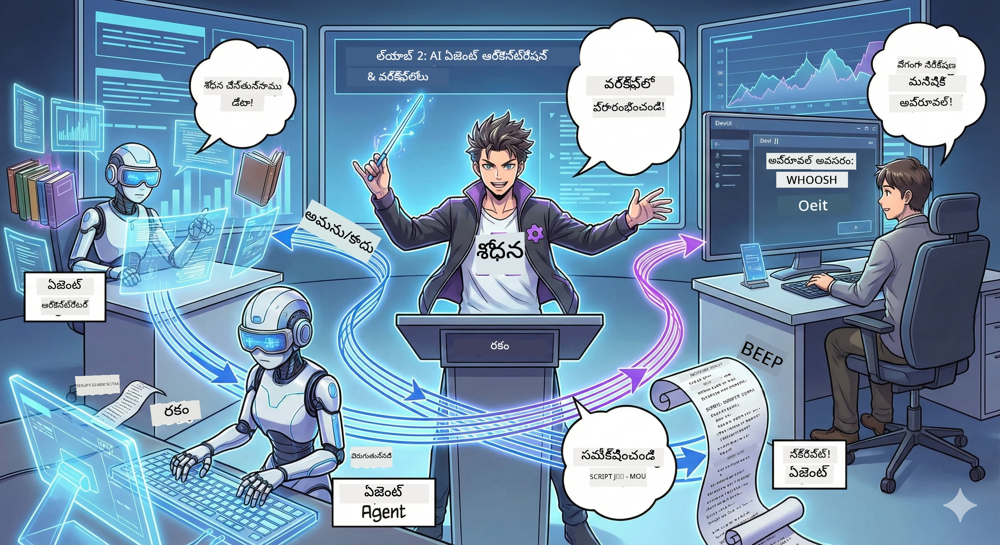

# చర్య 2: మీ పోडकాస్ట్ ఉత్పత్తి బృందాన్ని కలిపి తయారు చేసుకోండి 🎬



## కథ మరింత కలుపైనది

అలెక్స్ (చర్య 1 నుండి మీ AI సహాయకుడు) అద్భుతుడే, కానీ ఒక ఏజెంట్ ఒక్కటిగానే మొత్తం పోडकాస్ట్ స్టూడియోను నడిపించలేడు. మీకు ఓ *టീమ్* అవసరం:
- 🔍 ** పరిశోధనా ఏజెంట్ **: ఇంటర్నెట్‌లో కొత్త సమాచారం కోసం వెతుకుతుంది
- ✍️ ** స్క్రిప్ట్ ఏజెంట్ **: పరిశోధనను ఆకర్షణీయ సంభాషణగా మార్చడం
- 👤 ** మీరు (ఎడిటర్) **: స్క్రిప్టులను ఆమోదిస్తారు లేక తిరిగి రాయమని పంపిస్తారు

స్వాగతం **AI ఏజెంట్ ఆర్చెస్ట్రేషన్**కి — ఇక్కడ మీరు మీ స్వంత AI టీమ్ డైరెక్టర్ అవుతారు. అవెంజర్స్ ఆలోచన వంటిది, కానీ పోडकాస్ట్ ఉత్పత్తి కోసం.

## ఏజెంట్ ఆర్చెస్ట్రేషన్ అంటే ఏమిటి? (సాదా వెర్షన్)

మీరు ఓ రెస్టారెంట్ నడుపుతున్నట్లు ఊహించుకోండి. మీరు అన్నిటినీ తానే చేయరు కదా? మీ వద్ద ఉంటారు:
- 🍳 వంటకారుడు వంటగాడు
- 👨‍🍳 సూప్ వంటకారుడు అతని సహాయకుడు
- 👩‍🍳 సర్వర్ డెలివరీ చేస్తుంది

ఏజెంట్ ఆర్చెస్ట్రేషన్ కూడా అదే ఆలోచన, కానీ AIతో. ప్రతి ఏజెంట్‌కు ఒక ప్రత్యేకత ఉంటుంది, మీరు వారిని సమన్వయిం చి పెద్ద లక్ష్యాలను సాధిస్తారు. ఒక్క ఏజెంట్ చాలా భారపడదు, పని త్వరగా పూర్తి అవుతుంది.

### బ్యాండ్ తులన 🎸

మీ AI ఏజెంట్లు బ్యాండ్ లాగా ఉంటారు:
- **లీడ్ గాయకుడు**: కస్టమర్-ఫేసింగ్ పనులను నిర్వహించేటటు ప్రధాన ఏజెంట్
- **డ్రమర్**: రిథమ్ ఉంచుతుంది, బ్యాక్‌గ్రౌండ్ ప్రాసెసింగ్ చేస్తుంది  
- **బాస్ ప్లేయర్**: అందరికి మద్దతు ఇస్తుంది, డేటాను తెచ్చిస్తుంది
- **మీరు (బ్యాండ్ మేనేజర్)**: అందన్నీ సమన్వయం చేస్తారు!

సమన్వయం లేకపోతే? కేవలం శబ్దం. సమన్వయంతో? అందమైన సంగీతం.

### ఇది ఎందుకు ముఖ్యం

ఒక్క AI ఏజెంట్ అన్నిటినీ చేయడానికి ప్రయత్నిస్తే = ప్రదర్శనగొంతుకు వచ్చేది. ప్రత్యేక ఏజెంట్లు కలిసి పనిచేస్తే = సమర్థత పెరుగుతుంది! 🚀

**సవాలుతో నిజం**: మనం పోडकాస్ట్ కోసం పరిశోధన, రచన, ఎడిటింగ్ మొత్తాన్ని ఒంటరిగా చేయాలని ప్రయత్నించగా ఎలా ఒత్తిడికి గురవుతామో గుర్తు ఉంది కదా? సమన్వయంతో, ప్రతి ఏజెంట్ తన ప్రత్యేకతలో పనిచేస్తుంది. చివరి నిర్ణయాలు మీరు తీసుకుంటారు.

**నిజ జీవితం ఉదాహరణ**: చెల్లింపు, సాంకేతిక సమస్యలు వేరుగా ఏ సమయంలో మానవ సహాయం కోరాలో తెలిస్తే కస్టమర్ సహాయం బాట్స్. అదే ఆర్చెస్ట్రేషన్!

## ఏజెంట్ vs. వర్క్‌ఫ్లో: తేడా ఏమిటి?

ఇలా ఆలోచించండి:

### 🤖 AI ఏజెంట్ = జాజ్ సంగీతకారుడు
- **జరిగే ప్రకారం నిర్ణయాలు తీసుకుంటుంది**
- **తన సాధనాలతో ఆ Improvises చేస్తుంది**
- **LLM మెదడు తో ఆలోచిస్తుంది**
- **మీ ఎలాంటి పనికైనా అనుకూలంగా ఉంటుంది**

### 🎵 వర్క్‌ఫ్లో = శాస్త్రీయ సంగీతం ఆడే ఆర్కెస్ట్రా  
- **స్కోర్ ను అనుసరిస్తుంది** (పూర్వనిర్దేశిత దశలు)
- **గమనించదగ్గ అమలు మార్గం**
- **అన్ని ఏజెంట్లు, మానవులు, సిస్టమ్స్ ను సమన్వయిస్తుంది**
- **రెసిపీ లాగా నిర్మితమైంది**

**మాయాజాలం**: వర్క్‌ఫ్లోలు ఏజెంట్లను *ఆర్చెస్ట్రేట్* చేస్తాయి! మీరు ఏజెంట్లకు ఎప్పుడు వారి భాగం ఆడాలో చెప్పే వర్క్‌ఫ్లోని తయారు చేస్తారు. రెండింటి మేలైన వలయము. 🎭

## మీ AI బృందాన్ని సమన్వయం చేయడానికి మూడు సరళ మార్గాలు

### 1. 🎯 కేంద్రీకృత (మీరు బాస్)

ఒక ప్రధాన ఏజెంట్ అన్ని నిర్ణయాలను తీసుకుంటుంది. ఒక టీమ్ మీకు ఉండి మీరు ఎవరు ఏ పని చేయాలో నిర్ణయించుకునేటట్టు అనుకోండి.

**ప్రయోజనాలు**:
- ✅ స్పష్టమైన నాయకత్వం (సందేహాలు లేవు)
- ✅ నిర్ణయాలు స్థిరంగా ఉంటాయి
- ✅ సులభంగా డీబగ్ చేయడం

**దీనిని ఉపయోగించండి**:
- కస్టమర్ సర్వీస్ రౌటింగ్ ("ఇది చెల్లింపు కాదా? లేదా టెక్ సపోర్ట్ కాదా?")
- కంటెంట్ ఆమోద వర్క్‌ఫ్లోలు ("ఈ స్క్రిప్ట్ ఉత్తీర్ణమయ్యిందా?")
- పోडकాస్ట్ ఉత్పత్తి (మనం నిర్మిస్తున్నది!)

### 2. 🤝 విస్తృత (ఏజెంట్లు స్వయంగా సమన్వయం చేయటం)

ఏజెంట్లు పరస్పరం నేరుగా మాట్లాడి ఆ వివరాల మీద కలిసి నిర్ణయిస్తారు. ఒక గ్రూప్ చాట్ లాగా.

**ప్రయోజనాలు**:
- ✅ సులభంగా విస్తరించుకోవచ్చు (ఎప్పుడు కావలసినంత ఏజెంట్లు జతచేయండి)
- ✅ ఒక్క ఏజెంట్ తప్పు కూడా మొత్తం వ్యవస్థ కూల్చలేడు
- ✅ ఏజెంట్లు సహకరంగా పని చేస్తాయి

**దీనిని ఉపయోగించండి**:
- పరిశోధనా టీమ్స్ (ప్రతి ఏజెంట్ వేరే వేరే మూలాలన్వేషిస్తుంది)
- ఆలోచనల పంచుకునే సమావేశాలు
- పంపిణీ చేసిన సమస్య పరిష్కారం

### 3. 🔀 హైబ్రిడ్ (రెండింటి సంయోజనం)

సాధారణ మార్గదర్శకత్వం మీరు ఇస్తారు, కాని ఏజెంట్లకు స్వాతంత్ర్యం ఉండి పని బాస్‌లా స్వంత నిర్ణయాలు తీసుకుంటారు. CEO లాగా తన టీమును భరోసా ఉంచడం.

**సరైనది**: నియంత్రణ మరియు సరళత రెండూ కావలసిన క్లిష్ట ప్రాజెక్ట్స్ కోసం.

## మైక్రోసాఫ్ట్ ఏజెంట్ ఫ్రేమ్‌వర్క్: మీ ఆర్చెస్ట్రేషన్ టూల్‌సెట్ 🧰

ఇప్పుడే నిర్మించడం మొదలు పెట్టండి! మీరు ఉపయోగించే అంశాలు:

### నిర్మాణ అంశాలు

#### 1. 🧱 ఎగ్జిక్యూటర్లు (మీ పని దారు)
- **వీరు ఎవరు**: వ్యక్తిగత ప్రాసెసింగ్ యూనిట్లు — ఏజెంట్లు లేదా కస్టమ్ లాజిక్
- **వారేన్ చేస్తారు**: ఇన్‌పుట్ తీసుకుని పని చేసి అవుట్‌పుట్ ఇస్తారు
- **ఇలా ఆలోచించండి**: అసెంబ్లీ లైన్‌లో స్టేషన్లు

#### 2. ➡️ ఎడ్జులు (కనెక్షన్స్)
- **వీరు ఎవరు**: ఎగ్జిక్యూటర్ల మధ్య మార్గాలు
- **వారేన్ చేస్తారు**: సందేశ ప్రవాహాన్ని నియంత్రిస్తారు ("Aకి తర్వాత Bకి వెళ్ళు")
- **ఇలా ఆలోచించండి**: ఒక ఫ్లోచార్ట్ పై అంకెలు

#### 3. 🗺️ వర్క్‌ఫ్లోలు (మాస్టర్ ప్లాన్)
- **వీరు ఎవరు**: ఎగ్జిక్యూటర్లు + ఎడ్జులను కలిపి సంపూర్ణ గ్రాఫ్
- **వారేన్ చేస్తారు**: ప్రారంభం నుండి ముగింపు వరకు మొత్తం ప్రక్రియా నిర్వచిస్తారు
- **ఇలా ఆలోచించండి**: మీ ఉత్పత్తి పైప్‌లైన్ బ్లూప్రింట్

### మీరు ఇష్టపడే అద్భుత ఫీచర్లు

**🛡️ టైప్ సేఫ్టి**: ఏజెంట్ల మధ్య సందేశాలు టైప్ చెక్ చేయబడతాయి. "అయ్యో, తప్పు డేటా టైప్" వంటి అనుకోని పొరపాట్లు లేవు.

**🔀 ఫ్లెక్సిబుల్ రౌటింగ్**: 
- షరతుపూర్వక మార్గాలు ("ఆమోదమైతే ప్రచురించు; కాదు అంటే తిరిగి రాయించు")
- సమాంతర ప్రాసెసింగ్ (పలు ఏజెంట్లు ఒకేసారి పని)
- డైనమిక్ మార్గాలు (ఫలితాల ఆధారంగా వర్క్‌ఫ్లో అనుగుణంగా మారుతుంది)

**🔌 బయటి ఇంటిగ్రేషన్**:
- APIsతో కనెక్ట్ అవ్వడం
- మానవ-ఇన్-ది-లూప్ చెక్వాయింట్లు (మీ ఆమోదం కోసం)
- రిక్వెస్ట్/రిస్పాన్స్ ఫ్లోలు నిర్మించడం

**💾 చెక్పాయింటింగ్**: పురోగతిని సేవ్ చేయండి! ఏదైనా క్రాష్ అయితే మళ్లీ అక్కడ నుండే మొదలు పెట్టండి.

**🤝 మల్టీ-ఏజెంట్ సమన్వయం**:
- ఏజెంట్లను వరుసగా నడిపించు (A → B → C)
- వాటిని సమాంతరంగా నడిపించు (A + B + C ఒకేసారి)
- ఏజెంట్‌ల మధ్య హ్యాండ్ ఆఫ్
- సహకార ప్రాసెసింగ్

## బెస్ట్ ప్రాక్టీసెస్ (ప్రో సూచనలు) 🎯

### 1. మాడ్యులర్‌గా ఉంచండి
ప్రతి ఏజెంట్ ఒకటి పని చాలా బాగా చేయాలి. "సూపర్ ఏజెంట్" తయారుచేయవద్దు – డీబగ్గింగ్ సమయంలో మీరు న్యూఇన్ అవుతారు.

### 2. వైఫల్యాల కోసం ప్రణాళిక వేయండి
ఏజెంట్లు తప్పులు చేస్తారు. నెట్‌వర్క్ ఫెయిలవుతుంది. లోపాలను నిర్వహించడం, బ్యాకప్ ప్లాన్లు తయారు చేయడం ముఖ్యం. మీ భవిష్యత్తు స్వయం మీకు కృతజ్ఞత తెలియజేస్తుంది.

### 3. ప్రతీదీ పర్యవేక్షించండి
మీ ఏజెంట్లు చేస్తున్న పనిని ట్రాక్ చేయండి. DevUI ఉపయోగించి వర్క్‌ఫ్లోలను ప్రత్యక్షంగా చూడండి.

### 4. సందేశపు పరిమాణాన్ని సరిచూడండి
పెద్ద ఫైళ్ళను ఏజెంట్ల మధ్య పంపవద్దు. సందేశాలను తేలికగా, వేగంగా ఉంచండి.

### 5. సరైన నమూనా ఎంచుకోండి
నియంత్రణ అవసరమా? కేంద్రీకృతంగా వెళ్లండి. విస్తరణ కావాలా? విస్తృతంగా పోవండి. నిర్ణయం తీసుకోలేకపోతే? హైబ్రిడ్.

## DevUI: మీ వర్క్‌ఫ్లో డీబగ్గర్ 🔍

### DevUI అంటే ఏమిటి?

DevUI అనేది మీ ఏజెంట్లు మరియు వర్క్‌ఫ్లోలను పరీక్షించే ప్లేగ్రౌండ్ లాంటిది. ఇది ఓ వెబ్ ఇంటర్ఫేస్, ఇక్కడ మీరు:
- 👀 మీ వర్క్‌ఫ్లో పనిచేస్తున్నట్లు చూడవచ్చు
- 💬 ఏజెంట్లతో నేరుగా సంభాషించవచ్చు
- 🔍 సమస్యలు వస్తే డీబగ్ చేయవచ్చు
- 📊 ట్రేసులు, పనితీరు మెట్రిక్స్ చూడవచ్చు

> **గൗరవించాలి**: DevUI అభివృద్ధి కోసం మాత్రమే! ప్రొడక్షన్‌లో ఉపయోగించకూడదు. ఇది మీ స్థానిక పరీక్ష వాతావరణం.

### ఇది ఎందుకు అద్భుతం

- **🖥️ అంతర్యాక్టివ్ వెబ్ UI**: క్లిక్ చేసి, టైప్ చేసి, పరీక్షించండి — కమాండ్ లైన్లు అవసరం లేదు
- **📁 డ్రాగ్-అండ్-డ్రాప్ సిద్ధం**: ఫైల్స్ అప్లోడ్ చేసి, విభిన్న ఇన్‌పుట్స్ తో పరీక్షించండి
- **📂 ఆటో-డిస్కవరీ**: ఒక ఫోల్డర్ దిశగా చూపిన వెంటనే అన్ని ఏజెంట్లను కనుగొంటుంది
- **📋 సెటప్ లేని మోడ్**: కోడ్‌లో ఏజెంట్లను రిజిస్టర్ చేయండి, ఫోల్డర్ నిర్మాణం అవసరం లేదు
- **🔌 OpenAI అనుకూలం**: OpenAI SDK తో పనిచేస్తుంది (అనుకూలత కొరకు!)
- **👁️ ట్రేసింగ్ ఇన్‌బిల్ట్**: ఏజెంట్లు ఏం చేస్తున్నాయో ఖచ్చితంగా చూడండి

### ఇన్‌పుట్ ఎలా పనిచేస్తుంది

DevUI ఇన్‌పుట్‌ల విషయంలో తెలివిగా ఉంటుంది:

- **ఏజెంట్లను పరీక్షిస్తున్నారా?** టెక్స్ట్ బాక్స్‌లు, ఫైల్ అప్లోడ్ బటన్లు ఉంటాయి
- **వర్క్‌ఫ్లోలను పరీక్షిస్తున్నారా?** వర్క్‌ఫ్లో ఆశించే దానిపై ఆధారపడి UI ఇన్‌పుట్ ఫీల్డ్స్ ఆటోమేటిగ్గా సృష్టిస్తుంది

ఇది మాంత్రికం కాదు, ఇలా ప్రోగ్రామింగ్ బాగా ఉన్నాడు. ✨

## మీ మిషన్స్: పోडकాస్ట్ స్టూడియో నిర్మించండి 🎬

### మిషన్ 1: DevUIతో ఒక ఏజెంట్ సృష్టించండి

📂 [01.AgentDevUI](../../../../WorkshopForAgentic/code/02.Workflow/01.AgentDevUI)

**సవాలు**: పూర్తి టీమ్ ని నిర్మించకముందు, DevUIతో ఒక ఏజెంట్ ని పరీక్షించండి: ఒక వెబ్సెర్చ్ నిపుణుడు.

**మీరు తయారు చేస్తూన్నది**:
ఇంటర్నెట్‌లో పోडकాస్ట్ విషయాల కోసం వెతుకే ఒక పరిశోధన ఏజెంట్. దీన్ని DevUI వెబ్ ఇంటర్‌ఫేస్‌లో `http://localhost:8090` వద్ద పరీక్షిస్తారు.

**మీరు నేర్చుకుంటున్న స్కిల్స్**:
- 🚀 DevUIలో ఏజెంట్లను ప్రారంభించడం
- 🔍 ఏజెంట్ సাড়া ని రియల్ టైం లో పరీక్షించడం
- 🛠️ కస్టమ్ సాధనాలు (web search) తయారు చేయడం
- 📊 సమస్యల్ని డీబగ్ చేయడానికి ట్రేస్ సక్రియం చేయడం
- 🖥️ అంతర్యాక్టివ్ వెబ్ UI ఉపయోగించడం

**కోడ్**:
- `agent.py`: web search సూపర్ పవర్లతో SearchAgent
- OllamaChatClient ఉపయోగించి Qwen తో కనెక్ట్ అవుతుంది
- `web_search()` టూల్ ఫంక్షన్ అమలు
- `serve()` ద్వారా DevUI రూపంలో ప్రారంభించబడుతుంది

**విజయం ప్రమాణం**: "AIలో యేమి ట్రెండింగ్ అవుతున్నది?" అని అడిగి ఆజెంట్ ఇంటర్నెట్‌లో వెతుకుతుందో చూడండి! 🎉

### మిషన్ 2: బహుఏజెంట్ వర్క్‌ఫ్లోను నిర్మించండి

📂 [02.WorkflowDevUI](../../../../WorkshopForAgentic/code/02.Workflow/02.WorkflowDevUI)

**సవాలు**: ఇప్పుడే అసలు సరదా వస్తోంది! ఈ విధంగా ఒక సంపూర్ణ పోडकాస్ట్ ఉత్పత్తి వర్క్‌ఫ్లోను తయారు చేయండి:
1. 🔍 **సెర్చ్ ఏజెంట్** → మీ విషయం మీద పరిశోధన చేస్తుంది
2. ✍️ **స్క్రిప్ట్ ఏజెంట్** → ఆ విషయం మీద ఇద్దరు హోస్ట్ల సంభాషణను చైనా భాషలో రాస్తుంది
3. 👤 **రివ్యూ ఎగ్జిక్యూటర్** → మీరు ఆ స్క్రిప్ట్‌ని ఆమోదిస్తుంది లేదా తిరస్కరించవచ్చు
4. 🔄 **లూప్ బ్యాక్** → తిరస్కరించబడితే, మీ అభిప్రాయం ఆధారంగా స్క్రిప్ట్ మళ్లీ రాయబడుతుంది

**మీరు నేర్చుకునే స్కిల్స్**:
- 🧱 విభిన్న పనుల కోసం ప్రత్యేక ఏజెంట్లు సృష్టించడం
- 🔗 WorkflowBuilderతో ఏజెంట్లను కలపడం
- 🔀 ఆమోదపు లూపుల అమలు (హ్యూమన్-ఇన్-ది-లూప్!)
- 🚦 షరతు ఆధారిత మార్గాలు (ఆమోదమైతే / తిరస్కరిస్తే)
- 🔧 వ్యాపార లాజిక్ కోసం కస్టమ్ ఎగ్జిక్యూటర్ల రూపకల్పన

**వర్క్‌ఫ్లో**:
```
SearchAgent → ScriptAgent → ReviewExecutor
                             ↑          ↓ (if rejected)
                             ←─────────
```

**కోడ్**:
- `search_agent/agent.py`: మీ పరిశోధనా నిపుణుడు
- `generate_script_agent/agent.py`: మీ స్క్రిప్ట్ రైటర్ (చైనా భాషలో)
- `workflow/workflow.py`: ఆర్చెస్ట్రేషన్ మేజిక్ ఇక్కడ జరుగుతుంది
- `main.py`: ప్రతీదీ DevUIలో ప్రారంభిస్తుంది

**విజయం ప్రమాణం**: ఒక విషయం ఇవ్వండి, స్క్రిప్ట్ సమీక్షించండి, ఒకసారి తిరస్కరించి లూప్ పరీక్షించండి, ఆరున తర్వాత ఆమోదించండి! 🎉

### మిషన్ 3: కన్సోల్ యాప్‌ను నిర్మించండి

📂 [03.Application](../../../../WorkshopForAgentic/code/02.Workflow/03.Application)

**సవాలు**: DevUI నుండి మీ వర్క్‌ఫ్లోను తీసుకుని, రంగురంగుల అవుట్పుట్, లోడింగ్ స్పిన్నర్లు, ఫైళ్ల సేవ్ చేయడం తో ఒక స్టయిలిష్ టెర్మినల్ యాప్ గా మార్చండి. ఇది ప్రొడక్షన్-రెడీ!

**మీరు నేర్చుకునే స్కిల్స్**:
- ⚡ ప్రోగ్రామేటిక్‌గా వర్క్‌ఫ్లోలను నడపడం (DevUI అవసరం లేదు)
- 📡 ఈవెంట్-డ్రివెన్ ఆర్కిటెక్చర్ స్ట్రీమింగ్‌తో
- 🎨 అందమైన టెర్మినల్ UIలు సృష్టించడం (రంగులు, స్పిన్నర్లు, ప్రోగ్రెస్ బార్లు)
- 💾 ఫైనల్ స్క్రిప్టులను ఫైళ్లుగా సేవ్ చేయడం
- 🔄 Python asyncioతో అసింక్ వర్క్‌ఫ్లోల నిర్వహణ

**ఇది చేస్తుంది**:
1. మీకు పోडकాస్ట్ టాపిక్ అడుగుతుంది
2. నిజకాల పురోగతిని చూపిస్తుంది ("Search Agent పని చేస్తోంది...")
3. రంగులతో స్క్రిప్ట్ ప్రదర్శిస్తుంది
4. మీ ఆమోదాన్ని అడుగుతుంది
5. ఆమోదించిన స్క్రిప్టును `podcast.txt` లో సేవ్ చేస్తుంది

**కోడ్**:
- `podcast_app.py`: ఈవెంట్ హ్యాండ్లింగ్‌తో ప్రధాన యాప్
- `workflow.py`: మిషన్ 2 నుండి వర్క్‌ఫ్లోను పునర్వినియోగం చేస్తుంది
- ఈవెంట్లను హ్యాండిల్ చేస్తుంది: `AgentRunUpdateEvent`, `RequestInfoEvent`, `WorkflowOutputEvent`
- టెర్మినల్ స్టైలింగ్ కోసం ANSI రంగులు ఉపయోగిస్తుంది

**విజయం ప్రమాణం**: యాప్ నడిపించండి, పోडकాస్ట్ స్క్రిప్ట్ తయారు చేయండి, సేవ్ అయ్యిందో చూడండి! మీరు నిజమైన టూల్‌ను తయారుచేశారు. 🚀

## మీరు ఆర్జించుకున్నది 🏆

చర్య 2 తర్వాత, మీరు చేయగలరు:

- ✅ బహుఏజెంట్ AI టీమ్‌ను బాస్ లాగ గైడ్ చేయడం
- ✅ వరుస మరియు షరతు లాజిక్ తో వర్క్‌ఫ్లోలను నిర్మించడం
- ✅ మానవ ఆమోద చెక్వాయింట్లను జోడించడం
- ✅ DevUIను ఉపయోగించి వర్క్‌ఫ్లోలను పరీక్షించడం, డీబగ్గింగ్ చేయడం
- ✅ ప్రొడక్షన్-రెడీ కన్సోల్ అప్లికేషన్లను సృష్టించడం
- ✅ క్లిష్ట సిస్టమ్లలో లోపాలను సులభంగా నిర్వహించడం
- ✅ ఏ ప్రాజెక్ట్ కోసం సరైన ఆర్చెస్ట్రేషన్ నమూనా ఎంచుకోవడం

## సమస్యలు వచ్చినప్పుడు 🔧

### "నా వర్క్‌ఫ్లో చాలా క్లిష్టంగా ఉంది!"
**పరిష్కారం**: దానిని చిన్న చిన్న సబ్-వర్క్‌ఫ్లోలుగా విభజించండి. ఒక్క ఒక్క వర్క్‌ఫ్లో ఒకటిమే బాగా చేయాలి. అవసరమైతే వాటిని చైన్ చేయండి.

### "ఏం జరుగుతుందో నేను ట్రాక్ చేయలేవు!"
**పరిష్కారం**: వర్క్‌ఫ్లో చెక్పాయింటింగ్ ఉపయోగించి స్థితిని సేవ్ చేయండి. DevUIలో ట్రేసింగ్ సక్రియంగా ఉంచి ప్రతి దశను చూడండి.

### "ఒక ఏజెంట్ లోపం మొత్తం సిస్టమ్‌ని కూల్చేస్తోంది!"
**పరిష్కారం**: లోపాల సరిహద్దులు జోడించండి. ప్రతి ఏజెంట్ తాను చేసే తప్పులను స్వయంగా నిర్వహించాలి, మరియు బ్యాకప్ ప్రవర్తన ఉండాలి.

### "ఇది చాలా మందగించిపోయింది"
**పరిష్కారం**: ఏజెంట్లు గ్రహాంతరంలో (పారలల్‌గా) నడపగలవా చూడండి? వరుసగా నడిచే వర్క్‌ఫ్లోలు సులభమైనవి కానీ మందగించేవి. సమాంతర అవకాశాలను అన్వేషించండి!

## సహాయక వనరులు 🔗

- [Workflow డాక్యుమెంటేషన్](https://learn.microsoft.com/en-us/agent-framework/user-guide/workflows/overview) — అధికారిక మైక్రోసాఫ్ట్ గైడ్లు  
- [ఆర్చెస్ట్రేషన్ నమూనాలు](https://www.ibm.com/think/topics/ai-agent-orchestration) — IBM దృష్టికోణం  
- [Agent Framework GitHub](https://github.com/microsoft/agent-framework) — సోర్స్ కోడ్ 浏览  

- [కోడ్ ఉదాహరణలు](https://github.com/microsoft/agent-framework/tree/main/python/samples) — ఇక్కడినుండి నమూనాలను దోచుకోండి

---

**ఫైనల్‌కు సిద్ధమా?** మీకు స్క్రిప్ట్ సిద్ధమే. ఇప్పుడు దాన్ని నిజమైన ఆడియోగా మార్చుకుందాం! → [అధ్యాయం 3: మీ పోडकాస్ట్‌ను ప్రాణం పోసండి](03.Multi-SpeakerPodcastGenerationWithVibeVoice.md) 🎤

---

**అడ్డుకున్నారా? గందరగోళంగా ఉందా? ఉత్సాహంగా ఉన్నారా?** వర్క్‌షాప్ చాట్‌లో పంచుకోండి! మనమందరం కలిసి నేర్చుకుంటున్నాం. 🚀

---

<!-- CO-OP TRANSLATOR DISCLAIMER START -->
**జ్ఞాపకం**:  
ఈ దస్త్రాన్ని AI అనువాద సేవ [Co-op Translator](https://github.com/Azure/co-op-translator) ఉపయోగించి అనువదించబడింది. మనం ఖచ్చితత్వాన్ని సాధించడానికి ప్రయత్నిస్తున్నప్పటికీ, ఆటోమేటెడ్ అనువాదాల్లో పొరపాట్లు లేదా తప్పుదోషాలు ఉండవచ్చు. అసలైన భాషలో ఉన్న మూల దస్త్రాన్ని అధికారిక మూలంగా తీసుకోవాలి. ముఖ్యమైన సమాచారానికి, ప్రొఫెషనల్ మానవ అనువాదాన్ని సిఫార్సు చేస్తాము. ఈ అనువాదం వాడకం వల్ల కలిగే ఏనేపు అవగాహనా తప్పులు లేదా విపర్యాసాల కోసం మేము బాధ్యులే కాదు.
<!-- CO-OP TRANSLATOR DISCLAIMER END -->