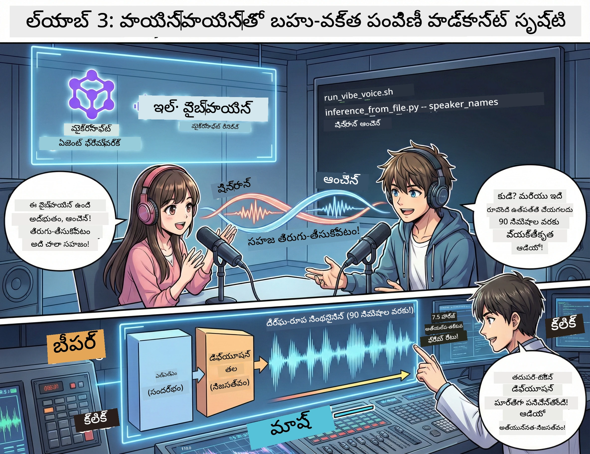

<!--
CO_OP_TRANSLATOR_METADATA:
{
  "original_hash": "bb2a3cf5ebd0ec8211af960a004fc23d",
  "translation_date": "2026-01-05T12:35:01+00:00",
  "source_file": "WorkshopForAgentic/md/03.Multi-SpeakerPodcastGenerationWithVibeVoice.md",
  "language_code": "te"
}
-->
# గ్రహణం 3: మీ పోడ్కాస్ట్‌కి ప్రాణం పోసెయ్యండి 🎤



## గ్రాండ్ ఫైనల్

మీరు విషయాలపై పరిశోధన చేయాలనుకున్నారు. మీరు స్క్రిప్ట్‌లు రాయికొనేశారు. ఇప్పుడు తలపై చెర్రీ: మీరు రాసిన టెక్స్ట్‌ని వాస్తవిక వాటితో ఉన్న పోడ్కాస్ట్ ఆడియోగా మార్చడం!

ఇక్కడ **VibeVoice** — మైక్రోసాఫ్ట్ రీసెర్చ్ యొక్క ఓపెన్-సోర్స్ TTS (టెక్స్ట్-టు-స్పీచ్) మాంత్రికత ఇది సృష్టిస్తుంది:
- 🎭 సహజంగా శబ్దించే సంభాషణలు
- 👥 బహుళ వక్తలు (గరిష్టంగా 4!)
- ⏱️ దీర్ఘకాలిక ఆడియో (గరిష్టంగా 90 నిమిషాలు!)
- 🎵 భావప్రకటనతో కూడిన డెలివరీ (రోబోట్లు కాదు!)

ఇది కృత్రిమ పోడ్కాస్ట్‌ల వెనుక టెక్నాలజీ. మీదిని చేద్దాం!

## VibeVoice అంటే ఏమిటి? (కూల్ విషయం)

VibeVoice మైక్రోసాఫ్ట్ రీసెర్చ్ ప్రపంచానికి ఇచ్చిన కానుక. ఇది ప్రత్యేకంగా పోడ్కాస్ట్ శైలిలో సంభాషణాత్మక ఆడియో కోసం రూపొందించబడింది.

### ఇది ఎందుకు అద్భుతం 🔥

* **⏱️ మరాథాన్ సెషన్స్**: 90 నిమిషాల పాటు నిరంతర ప్రసంగాన్ని సృష్టిస్తుంది (అంటే పూర్తిస్థాయిలో ఒక పోడ్కాస్ట్ ఎపిసోడ్!)
* **👥 బహుళ వక్త మాంత్రికత**: 4 భిన్న వాయిస్లతో సుసంస్కృత వ్యక్తిత్వాలు
* **⚡ అద్భుతంగా సమర్థవంతం**: 7.5 Hz ఫ్రేమ్ రేట్‌ను ఉపయోగించి కంప్యూట్ శక్తిని ఆదా చేస్తుంది
* **🧠 స్మార్ట్ ఆడియో**: LLM (సందర్భాన్ని అర్థం చేసుకునే) మరియు డిఫ్యూషన్ మోడల్ (వాస్తవిక ఆడియో సృష్టించే) ఒకటిగా కలిపి
* **🎭 సహజ ప్రవాహం**: తిరుగుబాట్లు, విరామాలు, సంభాషణ రిథమ్‌ని ఆటోమేటిక్‌గా నిర్వహిస్తుంది

**భాషాంతరం**: VibeVoice మీ స్క్రిప్ట్‌ని కేవలం చదవదు — అది *నటిస్తుంది* అంటే నిజమైన ప్రజలు మాట్లాడుతున్నట్లుగానే ప్రదర్శిస్తుందిఇ.

---

## మీరు ప్రారంభించే ముందు 🚀

**మీకు కావలసినవి**:

* 🐍 **Python 3.10+** (మీకు Acts 1 & 2 నుండి ఇప్పటికే ఉంది)
* 🚀 **uv** (పెద్ద వేగంతో పని చేస్తే Python ప్యాకేజ్ మేనేజర్ — మేము ఇన్స్టాల్ చేస్తాము)
* 📝 **మీ స్క్రిప్ట్**: Act 2 నుండి `podcast.txt` ఫైల్ (`../03.Application/`లో)

**ప్రొ టిప్**: ఈ దశకు ముందుగా శిక్షణ పొందిన మోడల్ డౌన్లోడ్ చేయడానికి మంచి ఇంటర్నెట్ కనెక్షన్ అవసరం. ఒక కాఫీకి సిద్ధంగా ఉండండి! ☕

---

## చెలామణి చేద్దాం! సులభ మార్గం 🎬

మేము దీన్ని చాలా సరళంగా చేశాము. ఒకే షెల్ స్క్రిప్ట్ అన్ని పనులను చేస్తుంది.

### ప్రాసెస్

1. **దీనిని ఎగ్జిక్యూటబుల్‌గా మార్చండి**:
```bash
chmod +x run_vibe_voice.sh
```

2. **దీనిని రన్ చేయండి**:
```bash
./run_vibe_voice.sh
```

3. **మాంత్రికత కోసం వేచి ఉండండి** (మొదటి సారి కొద్దిసేపు పట్టవచ్చు)

### వెనుకరవడిలో నేమి జరుగుతోంది 🎭

షెల్ స్క్రిప్ట్ మీ ఆటోమేటెడ్ సౌండ్ ఇంజనీర్ లాంటిది:

1. **📥 VibeVoice డౌన్లోడ్ చేస్తుంది**: గిథబ్ నుండి అధికారిక రేపో క్లోన్ చేస్తుంది
2. **📦 డిపెండెన్సీలు ఇన్స్టాల్ చేస్తుంది**: `uv pip` ఉపయోగించి జోరుగా ప్యాకేజీలు ఇన్స్టాల్ చేస్తుంది
3. **🎬 ఆడియో సృష్టిస్తుంది**: ఇన్‌ఫరెన్స్ స్క్రిప్ట్‌ని ఈ ఆర్గ్యుమెంట్లతో నడిపిస్తుంది:
   * `--model_path`: ముందుగా శిక్షణ పొందిన VibeVoice-7B మోడల్
   * `--txt_path`: మీ `podcast.txt` స్క్రిప్ట్
   * `--speaker_names`: వాయిస్‌లను కేటాయిస్తుంది (డిఫాల్ట్ రీతిలో Xinran & Anchen)

**ఫలితం**: మీ స్క్రిప్ట్ నిజమైన పోడ్కాస్ట్ ఎపిసోడ్ అవుతుంది! 🎉

---

## మీ మిషన్ 🎯

ఇది ఆసక్తికరంగా చేద్దాం:

### టాస్క్ 1: కంటెంట్ సృష్టించండి
`../03.Application/podcast.txt` ఫైల్‌లో ఇద్దరు వ్యక్తుల సంభాషణను ఎడిట్ చేయండి. టెక్నాలజీ, హాబీలు, వేరేచోట ఏదైనా! ఇది సంభాషణాత్మకం అయి ఉండాలి.

**ఫార్మాట్ ఉదాహరణ**:
```
Speaker 1: Hey! Did you hear about the new AI model?
Speaker 2: No way! Tell me more!
Speaker 1: It's called...
```

### టాస్క్ 2: ఆడియో రూపొందించండి
షెల్ స్క్రిప్ట్ రన్ చేసి మాంత్రికతను చూడండి. మొదటి సారి మోడల్ డౌన్లోడ్ కారణంగా ఎక్కువ సమయం పడుతుంది.

### టాస్క్ 3: వినండి & విశ్లేషించండి
- ఇది సహజంగా వినిపిస్తుందా?
- వక్తల వాయిస్‌లు ప్రత్యేకంగా ఉన్నాయా?
- టర్న్-టేకింగ్ సజావుగా ఉందా?
- ఏ రోబోటిక్ మమెంట్స్ ఉన్నాయా?

### టాస్క్ 4: ప్రయోగం చేయండి (ధైర్యవంతులకు)
`run_vibe_voice.sh` ఎడిట్ చేసి `--speaker_names` మార్చి వేర్వేరు వాయిస్‌లు ప్రయత్నించండి. VibeVoice వద్ద అనేక ప్రి-ట్రెయిన్ చేసిన వాయిస్‌లు ఉన్నాయి!

**బోనస్ ఛాలెంజ్**: 3-వక్తల సంభాషణ ప్రయత్నించండి! 🎆

---

## మరింత తెలుసుకోండి 📚

* **🏠 ప్రాజెక్ట్ హోమ్‌పేజీ**: [VibeVoice అధికారిక сайт](https://microsoft.github.io/VibeVoice/)
* **🤗 ప్రీ-ట్రెయిన్ మోడల్**: [Hugging Face - VibeVoice-7B](https://huggingface.co/vibevoice/VibeVoice-7B)
* **📖 పరిశోధనా పేపర్**: ఆటొమేటిక్‌గా ఆడుకోవాలంటే ఇష్టపడితే లోతుగా అధ్యయనం చేయండి

> **⚠️ బాధ్యతాయుత AI గుర్తుచూపు**: VibeVoice శక్తివంతమైనది. దీనిని నైతికంగా ఉపయోగించండి! డీప్‌ఫేక్‌లు లేదా తప్పుదారి చూపించే కంటెంట్ సృష్టించకండి. ప్రజలకు సహాయపడే అద్భుతమైన సమగ్రత సృష్టించండి. 🙏

---

## 🏆 అభినందనలు! మీరు పూర్తి చేసారు!

మీరు పూర్తి పైప్‌లైన్ పూర్తి చేయగా:
1. ✅ **Act 1**: కస్టమ్ టూల్స్‌తో AI ఏజెంట్లను నిర్మించారు
2. ✅ **Act 2**: బహుళ ఏజెంట్ల వర్క్ఫ్లో నిర్వహించారు
3. ✅ **Act 3**: వాస్తవ పోడ్కాస్ట్ ఆడియో రూపొందించారు

**మీ దగ్గర ఇప్పుడు ఉంది**:
- పనిచేసే AI రీసెర్చ్ అసిస్టెంట్
- పూర్తి పోడ్కాస్ట్ ప్రొడక్షన్ వర్క్ఫ్లో
- పంచుకునే వాస్తవ ఆడియో ఫైల్

### తదుపరి ఏమిటి? 🚀

**మీ పోడ్కాస్ట్‌ను ప్రారంభించండి!**
- పోడ్కాస్ట్ ప్లాట్‌ఫారమ్‌లకు అప్లోడ్ చేయండి
- సోషల్ మీడియా లో పంచుకోండి
- పునరావృతం చేసి మెరుగుపరుచుకోండి

**నిర్మాణం కొనసాగించండి!**
- వేర్వేరు విషయాలు ప్రయత్నించండి
- మరిన్ని వక్తలను ప్రయోగించండి
- బ్యాక్‌గ్రౌండ్ మ్యూజిక్ జోడించండి
- వెబ్ ఇంటర్‌ఫేస్ నిర్మించండి
- మొత్తం ప్రక్రియను ఆటోమేట్ చేయండి

**మీ పని పంచుకోండి!**
మమ్మల్ని ట్యాగ్ చేయండి! మీరు నిర్మించినది ప్రపంచానికి చూపండి. AI పోడ్కాస్ట్ విప్లవం మీతో ప్రారంభమవుతుంది. 🎙️

---

**ప్రశ్నలు? ఆలోచనలు? విజయం కథానాయకాలు?** వాటిని వర్క్షాప్ చాట్‌లో పంచుకోండి!

**కంటెంట్ సృష్టన భవిష్యత్తుకు స్వాగతం.** 🌟

---

<!-- CO-OP TRANSLATOR DISCLAIMER START -->
**నిర్ధారణా ప్రకటన**:
ఈ పత్రాన్ని AI అనువాద సేవ [Co-op Translator](https://github.com/Azure/co-op-translator) ఉపయోగించి అనువదించబడింది. మనం శుద్ధత్వానికి ప్రయత్నించినప్పటికీ, ఆటోమేటెడ్ అనువాదాల్లో పొరపాట్లు లేదా అసత్యతలు ఉండవచ్చునని దయచేసి గమనించండి. మూల పత్రం దాని స్వదేశ భాష లోనే అధికారిక మూలంగా పరిగణించబడాలి. కీలక సమాచారానికి, వృత్తిపరమైన మానవ అనువాదం సిఫార్సు చేయబడుతుంది. ఈ అనువాదాన్ని ఉపయోగించటం వల్ల ఎదురయ్యే ఏదైన అపార్థాలు లేదా తప్పు వ్యాఖ్యల గురించి మేము బాధ్యత వహించము.
<!-- CO-OP TRANSLATOR DISCLAIMER END -->