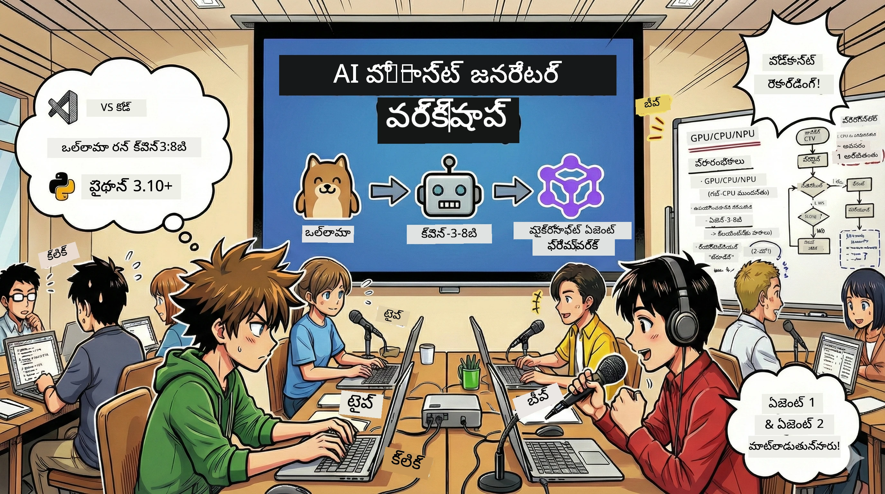

# 🎙️ AI పోडकాస్ట్ స్టూడియో వర్క్‌షాప్



## మీ పనిని

**AI పోडकాస్ట్ స్టూడియోకు** స్వాగతం! మీరు మీ సాంకేతిక పోडकాస్ట్ "భవిష్యత్ బైట్" ప్రారంభించబోతున్నారు — కానీ ఒక మలుపు ఉంది: మీరు దీన్ని సృష్టించడానికి సహాయపడే AI ఆధారిత ప్రొడక్షన్ టీమ్‌ను నిర్మించబోతున్నారు. ఇక ఎటువంటి ముగింపులేని రీసెర్చ్, స్క్రిప్ట్ రైటింగ్ మరియు ఆడియో ఎడిటింగ్ అవసరం లేదు. బదులుగా, మీరు ప్రోగ్రామింగ్ ద్వారా AI అద్భుత శక్తులతో ఒక పోडकాస్ట్ निर्माता అవుతారు.

## కథ నేపథ్యం

గమనించండి: మీరు మరియు మీ స్నేహితులు coolest సాంకేతిక ధోరణులపై పోडकాస్ట్ ప్రారంభించాలని అనుకుంటున్నారు, కానీ ప్రతి ఒక్కరూ చదువు, పని లేదా జీవితం వల్ల బిజీగా ఉన్నారు. మీరు ఒక AI ఏజెంట్ టీమ్‌ను నిర్మించి కష్టమైన పనిని పూర్తి చేయిస్తే ఎలా ఉంటుంది? ఒక ఏజెంట్ టాపిక్‌ను పరిశీలిస్తాడు, మరొకడు ఆకట్టుకునే స్క్రిప్ట్ రాస్తాడు, మూడవవారు టెక్స్ట్‌ను సహజమైన సంభాషణకు మారుస్తారు. ఇది సైన్స్ ఫిక్షన్ వంటిదేనా? మనం దీన్ని నిజమే చేస్తాము.

## మీరు నేర్చుకునేది

ఈ వర్క్‌షాప్ ముగునప్పుడు మీరు తెలుసుకుంటారు:
- 🤖 మీ స్వంత స్థానిక AI మోడల్‌ను డిప్లాయ్ చేయడం (ఏ API చార్జీలు లేదా క్లౌడ్ ఆధార్యత లేదు!)
- 🔧 ప్రాక్టికల్, సహకార AI ఏజెంట్లను రూపొందించడం
- 🎬 ఆలోచన నుంచి ఆడియోవరకు పూర్తిస్థాయి పోडकాస్ట్ ప్రొడక్షన్ ఫ్లో సృష్టించడం

## మీ ప్రయాణం: మూడు చర్యలు

ఏ మంచి కథలాగా, మాకు మూడు చర్యలు ఉన్నాయి. ప్రతి చర్య మీ AI పోडकాస్ట్ స్టూడియోను దశల వారీగా నిర్మిస్తుంది:

| అధ్యాయం | మీ పనిని | జరిగేది | అన్లాక్ స్కిల్స్ |
|---------|-----------|--------------|----------------|
| **మొదటి చర్య** | [మీ AI సహాయకుడిని పరిచయం](01.BuildAIAgentWithSLM.md) | చాట్లు చేయగల, వెబ్ శోధన, మరియు సమస్యలు పరిష్కరించగల AI ఏజెంట్‌లను మీరు ఎలా సృష్టించాలో తెలుసుకుంటారు. వారిని ఎప్పుడూ నిద్రపోని రీసెర్చ్ ఇంటర్న్స్‌లుగా ఊహించండి. | 🎯 మీ మొదటి ఏజెంట్ నిర్మాణం<br>🛠️ దానికి పవర్(టూల్స్!) ఇవ్వడం<br>🧠 ఆలోచించడం నేర్పించడం<br>🌐 ఇంటర్నెట్‌కు కనెక్ట్ చేయడం |
| **రెండవ చర్య** | [మీ ప్రొడక్షన్ టీమ్‌ను ఏర్పాటు చేయండి](02.AIAgentOrchestrationAndWorkflows.md) | ఇప్పుడు మజా మొదలవుతుంది! మీరు అనేక AI ఏజెంట్లను నిజమైన పోडकాస్ట్ టీమ్ లాగా సహకరించేటట్లు కోఆర్డినేట్ చేస్తారు. ఒకరు పరిశోధన చేస్తారు, ఇంకొకరు రాస్తారు, మీరు అప్రూవ్ చేస్తారు — జట్టు కలిసి కలలను నెరవేర్చుతుంది. | 🎭 అనేక ఏజెంట్‌లను సమన్వయం చేయడం<br>🔄 అప్రూవల్ వర్క్‌ఫ్లో నిర్మించడం<br>🖥️ DevUI ఇంటర్‌ఫేస్ ఉపయోగించి పరీక్షించడం<br>✋ మానవ నియంత్రణను మెయింటైన్ చేయడం |
| **మూడవ చర్య** | [మీ పోडकాస్ట్‌కు ప్రాణం పోసుకోండి](03.Multi-SpeakerPodcastGenerationWithVibeVoice.md) | గ్రాండ్ ఫినాలే! మీ టెక్స్ట్ స్క్రిప్ట్‌ను ప్రామాణిక ధ్వనులు మరియు సహజ సంభాషణలతో వాస్తవ పోडकాస్త్ ఆడియోగా మార్చండి. మీ "భవిష్యత్ బైట్" పోडकాస్ట్ విడుదలకు సిద్ధంగా ఉంది! | 🎤 టెక్స్ట్ నుంచి వాయిస్ మాయాజాలం<br>👥 బహుళ వక్తధ్వనులు<br>⏱️ పొడవైన ఫార్మాట్ ఆడియో<br>🚀 పూర్తిగా ఆటోమేటెడ్ |

ప్రతి చర్య కొత్త సామర్థులను అన్లాక్ చేస్తుంది. మీరు ధైర్యంగా ఉంటే స్కిప్ చేసి చూడవచ్చు, కానీ మేము మీకు క్రమం తప్పకుండా నేర్చుకోవాలని సూచిస్తాము!

## పరి​సర అవసరాలు

ఈ వర్క్‌షాప్ వివిధ హార్డ్వేర్ పరి​సరాలను మద్దతు ఇస్తుంది:
- **CPU**: టెస్టింగ్ మరియు చిన్న స్కేల్ ఉపయోగానికి అనుకూలం
- **GPU**: ఉత్పత్తి పరి​సరానికి సిఫార్సు చేయబడింది, కీలకంగా推理 వేగాన్ని పెంచుతుంది
- **NPU**: కొత్త తరం న్యూరల్ ప్రాసెసింగ్ యూనిట్ యాక్సలరేషన్ మద్దతు

## మీకు ఏమి అవసరం

### సాఫ్ట్‌వేర్ జాబితా ✅
- **Python 3.10+** (మీ ప్రోగ్రామింగ్ భాష)
- **Ollama** (మీ మెషీన్‌పై AI మోడల్ నడిపించేందుకు)
- **VS Code** (మీ కోడ్ ఎడిటర్)
- **Python విస్తరణ** (VS Code మరింత స్మార్ట్ చేయడం కోసం)
- **Git** (కోడ్ పొందడానికి)

### హార్డ్వేర్ చెక్ 💻
- **నేను నడిపించగలనా?**: 8GB ర్యామ్, 10GB ఖాళీ స్పేస్ (నడుస్తుంది కానీ కొంచెం మెల్లగా ఉండవచ్చు)
- **సూచి కాన్ఫిగర్**: 16GB+ ర్యామ్, మంచి GPU (స్మూత్ రన్!)
- **NPU ఉందా?**: అది మరిన్ని ప్రయోజనాలను తెస్తుంది! తదుపరి తరం పనితీరు 🚀

## మీ స్టూడియోని ఏర్పాటు చేయండి 🎬

### దశ 1: Python అప్డేట్

Python 3.10 లేదా కొత్త వెర్షన్ ఉందో చూడండి:

```bash
python --version
# Python 3.10.x లేదా అంతకు పైగా సంచికను చూపించాలి
```
  
Python లేదు? [python.org](https://python.org) నుండి పొందండి— ఇది ఉచితం!

### దశ 2: Ollama పొందండి (మీ AI మోడల్ రన్నర్)

మీ ఆపరేటింగ్ సిస్టమ్‌కు తగిన Ollama ని [ollama.ai](https://ollama.ai) నుండి డౌన్లోడ్ చేయండి. ఇది స్థానికంగా AI మోడల్ను నడిపించే ఇంజిన్ లాంటిది.

సిద్ధమై ఉందా అని చెక్ చేయండి:

```bash
ollama --version
```
  
### దశ 3: మీ AI మెదడును పొందండి 🧠

Qwen-3-8B మోడల్ను డౌన్లోడ్ చేసే సమయం వచ్చింది (మీ మొదటి AI సహాయకుడిని నియమించుకోవడం వంటిది):

```bash
ollama pull qwen3:8b
```
  
*ఇది కొద్దిసేపు పట్టవచ్చు. కాఫీ టైమ్!☕*

### దశ 4: VS Code సెటప్ చేయండి

మీ దగ్గర లేనివాలిగానీ, [Visual Studio Code](https://code.visualstudio.com/) పొందండి. ఇది ఉత్తమ కోడ్ ఎడిటర్ (సందేహముంటే చర్చించండి 😄).

### దశ 5: Python ఎక్స్‌టెన్షన్

VS Code లో:
1. `Ctrl+Shift+X` నొక్కండి (Macలో `Cmd+Shift+X`)
2. "Python" కోసం శోధించండి
3. Microsoft యొక్క అధికారిక Python ఎక్స్‌టెన్షన్ ఇన్స్టాల్ చేయండి

### దశ 6: పూర్తయింది! 🎉

సత్యంగా, మీరు రెడీ! కాబట్టి, AI మ్యాజిక్‌ను నిర్మించుకుందాం!

### దశ 7: Microsoft Agent Framework మరియు అవసరమైన ప్యాకేజీలు ఇన్స్టాల్ చేయండి 📦

వర్క్‌షాప్ కావలసిన అన్ని డిపెండెన్సీలను ఇన్స్టాల్ చేయండి:

```bash
pip install -r ./Installations/requirements.txt -U
```
  
*ఇది Microsoft Agent Framework మరియు అన్ని అవసరమైన ప్యాకేజీలను ఇన్స్టాల్ చేస్తుంది. కాఫీ పిండి తాగండి — మొదటి సారి ఇన్స్టాల్ కొద్దిసేపు పడుతుంది!☕*

## వర్క్‌షాప్ గైడ్

వర్క్‌షాప్ సమయంలో ప్రాజెక్ట్ స్ట్రక్చర్, సెటప్, అమలు వివరాలు క్ర‌మం వారీగా చెప్పబడతాయి.

## డీబగ్ చేయడం (ఎప్పుడైతే సమస్య వస్తే) 🔧

### "అయ్యో, మోడల్ డౌన్లోడ్ చాలా మందగిస్తుంది!"
**పరిష్కారం**: VPN ఉపయోగించండి లేదా Ollama మిర్రర్ సోర్స్‌ని కాన్ఫిగర్ చేయండి. కొన్నిసార్లు నెట్ వర్క్ మంచి వేగం ఇవ్వదు.

### "నా కంప్యూటర్ ఫ్రీజ్ అవుతుంది! ర్యామ్ తక్కువగా ఉంది!"
**పరిష్కారం**: చిన్న మోడల్‌కు మారండి లేదా `num_ctx` సెట్టింగ్‌ను తగ్గించుకోండి. దీన్ని మీ AI కి డైట్ ఇచ్చేలా భావించండి.

### "నేను GPUతో వేగంగా నడుపగలనా?"
**పరిష్కారం**: Ollama ఆటోమేటిగ్గా GPU గుర్తిస్తుంది! మీ GPU డ్రైవర్ తాజా ఉందనే విషయాన్ని నిర్ధారించండి. ఉచిత వేగ వృద్ధి!🏎️

## అదనపు వనరులు (కుటి ఉత్సాహులకు) 📚

- [Ollama డాక్యుమెంటేషన్](https://github.com/ollama/ollama) — స్థానిక AI మోడల్స్ గురించి లోతైన అవగాహన
- [Microsoft Agent Framework](https://microsoft.github.io/autogen/) — ఏజెంట్ టీమ్ నిర్మాణంపై మరిన్ని వివరాలు
- [Qwen మోడల్ సమాచారం](https://qwenlm.github.io/) — మీ AI సహాయకుడి మెదడు ని తెలుసుకోండి

## లైసెన్స్

MIT లైసెన్స్ — అద్భుతమైన దానిని నిర్మించండి, పంచుకోండి, ప్రపంచాన్ని అందంగా మార్చండి!🌍

## సహకారం కావాలా?

బగ్ కనుగొన్నారు? ఆలోచన ఏదైనా ఉందా? Issue లేదా PR సమర్పించండి! మేము కమ్యూనిటీ స్పిరిట్‌ని ఇష్టపడతాము.✨

---

<!-- CO-OP TRANSLATOR DISCLAIMER START -->
**విజ్ఞప్తి**:  
ఈ డాక్యుమెంట్ AI అనువాద సేవ [Co-op Translator](https://github.com/Azure/co-op-translator) ఉపయోగించి అనువాదం చేయబడింది. మేము ఖచ్చితత్వం కోసం ప్రయత్నిస్తూనే ఉన్నప్పటికీ, ఆటోమేటెడ్ అనువాదాల్లో లోపాలు లేదా పొరపాట్లు ఉండవచ్చు. మౌలిక భాషలో ఉన్న అసలు డాక్యుమెంట్ ను అధికారిక మూలంగా పరిగణించాలి. గంభీరమైన సమాచారం కోసం, ప్రొఫెషనల్ మానవ అనువాదాన్ని సూచిస్తాము. ఈ అనువాదం వాడకం వల్ల కలిగే ఏవైనా తార్కిక భ్రమలు లేదా తప్పుగా అర్థం చేసుకోతలకుగాను మేము బాధ్యత వహించము.
<!-- CO-OP TRANSLATOR DISCLAIMER END -->