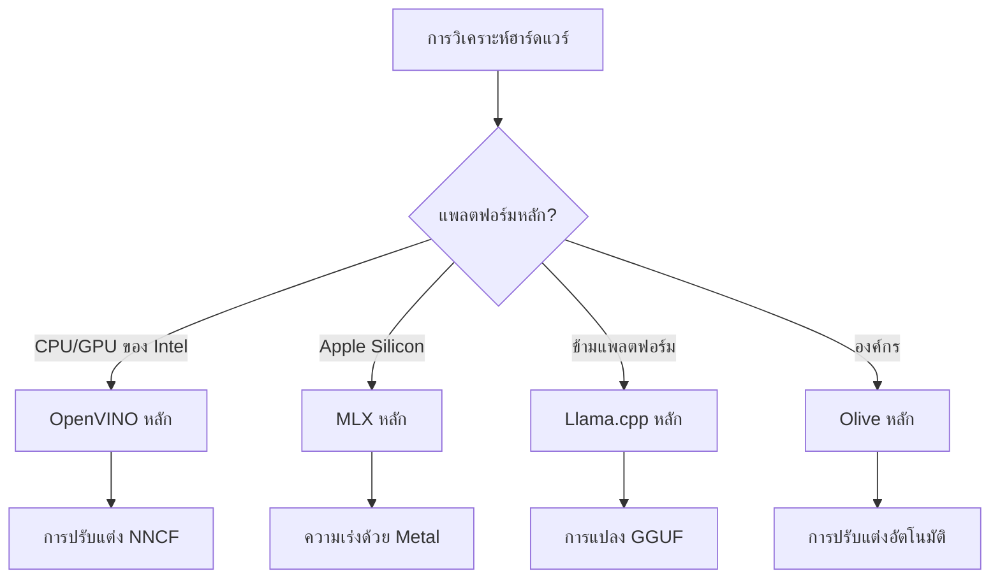
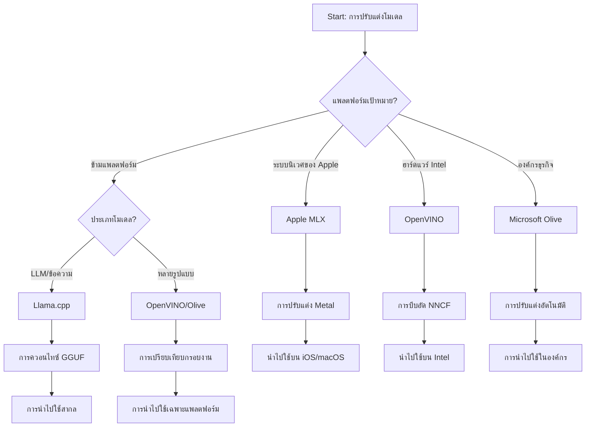
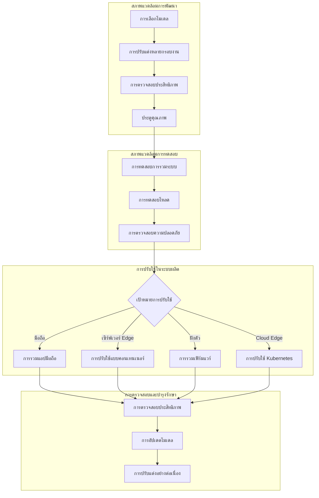

# ส่วนที่ 6: การสังเคราะห์ขั้นตอนการพัฒนา Edge AI

## สารบัญ
1. [บทนำ](#บทนำ)
2. [วัตถุประสงค์การเรียนรู้](#วัตถุประสงค์การเรียนรู้)
3. [ภาพรวมขั้นตอนการทำงานแบบรวมศูนย์](#ภาพรวมขั้นตอนการทำงานแบบรวมศูนย์)
4. [เมทริกซ์การเลือกเฟรมเวิร์ก](#เมทริกซ์การเลือกเฟรมเวิร์ก)
5. [การสังเคราะห์แนวปฏิบัติที่ดีที่สุด](#การสังเคราะห์แนวปฏิบัติที่ดีที่สุด)
6. [คู่มือกลยุทธ์การปรับใช้](#คู่มือกลยุทธ์การปรับใช้)
7. [ขั้นตอนการปรับประสิทธิภาพการทำงาน](#ขั้นตอนการปรับประสิทธิภาพการทำงาน)
8. [รายการตรวจสอบความพร้อมสำหรับการผลิต](#รายการตรวจสอบความพร้อมสำหรับการผลิต)
9. [การแก้ไขปัญหาและการตรวจสอบ](#การแก้ไขปัญหาและการตรวจสอบ)
10. [การปกป้องความพร้อมใช้งานในอนาคตของสายงาน Edge AI](#การปกป้องสายงาน-edge-ai-ของคุณในอนาคต)

## บทนำ

การพัฒนา Edge AI ต้องการความเข้าใจที่ซับซ้อนเกี่ยวกับเฟรมเวิร์กการปรับแต่งหลายรูปแบบ กลยุทธ์การปรับใช้ และการพิจารณาฮาร์ดแวร์ การสังเคราะห์อย่างครบถ้วนนี้รวบรวมความรู้จาก Llama.cpp, Microsoft Olive, OpenVINO, และ Apple MLX เพื่อสร้างขั้นตอนการทำงานแบบรวมศูนย์ที่เพิ่มประสิทธิภาพสูงสุด รักษาคุณภาพ และรับประกันการปรับใช้ในผลิตภัณฑ์ที่ประสบความสำเร็จ

ตลอดหลักสูตรนี้ เราได้สำรวจเฟรมเวิร์กการปรับแต่งแต่ละชุดที่มีจุดแข็งเฉพาะและกรณีการใช้งานเฉพาะตัว อย่างไรก็ตาม โครงการ Edge AI จริงมักต้องรวมเทคนิคจากหลายเฟรมเวิร์กเข้าด้วยกัน หรือตัดสินใจเชิงกลยุทธ์ว่าแนวทางใดจะให้ผลลัพธ์ที่ดีที่สุดตามข้อจำกัดและความต้องการเฉพาะ

ส่วนนี้สังเคราะห์ปัญญาร่วมจากทุกเฟรมเวิร์กเป็นขั้นตอนการทำงานที่ปฏิบัติได้จริง ต้นไม้การตัดสินใจ และแนวปฏิบัติที่ดีที่สุดซึ่งช่วยให้คุณสร้างโซลูชัน Edge AI ที่พร้อมผลิตได้อย่างมีประสิทธิภาพและประสิทธิผล ไม่ว่าคุณจะปรับแต่งสำหรับอุปกรณ์มือถือ ระบบฝังตัว หรือเซิร์ฟเวอร์ขอบ คู่มือนี้จัดเตรียมกรอบเชิงกลยุทธ์สำหรับการตัดสินใจอย่างมีข้อมูลตลอดวงจรชีวิตการพัฒนาของคุณ

## วัตถุประสงค์การเรียนรู้

ภายในสิ้นส่วนนี้ คุณจะสามารถ:

### การตัดสินใจเชิงกลยุทธ์
- **ประเมินและเลือก** เฟรมเวิร์กการปรับแต่งที่เหมาะสมที่สุดโดยพิจารณาจากข้อกำหนดโครงการ ข้อจำกัดฮาร์ดแวร์ และสถานการณ์การปรับใช้
- **ออกแบบขั้นตอนการทำงานที่ครอบคลุม** ซึ่งรวมหลายเทคนิคการปรับแต่งเพื่อประสิทธิภาพสูงสุด
- **ประเมินการแลกเปลี่ยน** ระหว่างความแม่นยำของโมเดล ความเร็วการอนุมาน การใช้หน่วยความจำ และความซับซ้อนของการปรับใช้ในเฟรมเวิร์กต่าง ๆ

### การรวมขั้นตอนการทำงาน
- **นำไปใช้สายงานพัฒนารวมศูนย์** ที่ใช้จุดแข็งของหลายเฟรมเวิร์กการปรับแต่ง
- **สร้างขั้นตอนการทำงานที่ทำซ้ำได้** สำหรับการปรับแต่งและปรับใช้โมเดลอย่างสม่ำเสมอในสภาพแวดล้อมต่าง ๆ
- **ตั้งประตูคุณภาพ** และกระบวนการตรวจสอบเพื่อให้แน่ใจว่าโมเดลที่ปรับแต่งตรงตามข้อกำหนดการผลิต

### การปรับประสิทธิภาพ
- **ใช้กลยุทธ์การปรับแต่งอย่างเป็นระบบ** โดยใช้การควอนติเซชัน การตัดแต่ง และเทคนิคเร่งความเร็วเฉพาะฮาร์ดแวร์
- **ตรวจสอบและเปรียบเทียบประสิทธิภาพ** ของโมเดลในระดับการปรับแต่งและเป้าหมายการปรับใช้ที่แตกต่างกัน
- **ปรับแต่งสำหรับแพลตฟอร์มฮาร์ดแวร์เฉพาะ** ได้แก่ CPU, GPU, NPU และตัวเร่งความเร็ว edge เฉพาะ

### การปรับใช้ในผลิตภัณฑ์
- **ออกแบบสถาปัตยกรรมการปรับใช้ที่ปรับขนาดได้** ซึ่งรองรับรูปแบบโมเดลและเครื่องยนต์การอนุมานหลายรูปแบบ
- **นำระบบตรวจสอบและมองเห็นได้** ไปใช้สำหรับแอปพลิเคชัน Edge AI ในสภาพแวดล้อมการผลิต
- **จัดตั้งขั้นตอนการบำรุงรักษา** สำหรับการอัปเดตโมเดล การตรวจสอบประสิทธิภาพ และการปรับแต่งระบบ

### ความเป็นเลิศข้ามแพลตฟอร์ม
- **ปรับใช้โมเดลที่ปรับแต่งแล้ว** บนแพลตฟอร์มฮาร์ดแวร์หลากหลายในขณะที่รักษาประสิทธิภาพที่สม่ำเสมอ
- **จัดการการปรับแต่งเฉพาะแพลตฟอร์ม** สำหรับ Windows, macOS, Linux, มือถือ และระบบฝังตัว
- **สร้างเลเยอร์นามธรรม** ที่ช่วยให้การปรับใช้บนสภาพแวดล้อม edge ต่าง ๆ เป็นไปอย่างราบรื่น

## ภาพรวมขั้นตอนการทำงานแบบรวมศูนย์

### ระยะที่ 1: การวิเคราะห์ความต้องการและการเลือกเฟรมเวิร์ก

รากฐานของความสำเร็จในการปรับใช้ Edge AI เริ่มต้นด้วยการวิเคราะห์ความต้องการอย่างละเอียดที่เป็นแนวทางในการเลือกเฟรมเวิร์กและกลยุทธ์การปรับแต่ง

#### 1.1 การประเมินฮาร์ดแวร์


**ประเด็นสำคัญที่ต้องพิจารณา:**
- **สถาปัตยกรรม CPU**: ความสามารถของ x86, ARM, Apple Silicon
- **ความพร้อมใช้งานของตัวเร่งความเร็ว**: GPU, NPU, VPU, ชิป AI เฉพาะ
- **ข้อจำกัดหน่วยความจำ**: ข้อจำกัด RAM, ความจุจัดเก็บ
- **งบประมาณพลังงาน**: อายุการใช้งานแบตเตอรี่, ข้อจำกัดความร้อน
- **การเชื่อมต่อ**: ความต้องการแบบออฟไลน์, ข้อจำกัดแบนด์วิธ

#### 1.2 เมทริกซ์ความต้องการแอปพลิเคชัน

| ความต้องการ | Llama.cpp | Microsoft Olive | OpenVINO | Apple MLX |
|-------------|-----------|-----------------|----------|-----------|
| ข้ามแพลตฟอร์ม | ✅ เยี่ยม | ⚡ ดี | ⚡ ดี | ❌ เฉพาะ Apple |
| การผสานระบบองค์กร | ⚡ พื้นฐาน | ✅ เยี่ยม | ✅ เยี่ยม | ⚡ จำกัด |
| การปรับใช้บนมือถือ | ✅ เยี่ยม | ⚡ ดี | ⚡ ดี | ✅ เยี่ยมสำหรับ iOS |
| การอนุมานแบบเรียลไทม์ | ✅ เยี่ยม | ✅ เยี่ยม | ✅ เยี่ยม | ✅ เยี่ยม |
| ความหลากหลายของโมเดล | ✅ เน้น LLM | ✅ ทุกโมเดล | ✅ ทุกโมเดล | ✅ เน้น LLM |
| ความง่ายในการใช้งาน | ✅ ง่าย | ✅ อัตโนมัติ | ⚡ ปานกลาง | ✅ ง่าย |

### ระยะที่ 2: การเตรียมโมเดลและการปรับแต่ง

#### 2.1 สายงานการประเมินโมเดลสากล

```python
# กรอบการประเมินโมเดลสากล
class EdgeAIModelAssessment:
    def __init__(self, model_path, target_hardware):
        self.model_path = model_path
        self.target_hardware = target_hardware
        self.optimization_frameworks = []
        
    def assess_model_characteristics(self):
        """Analyze model size, architecture, and complexity"""
        return {
            'model_size': self.get_model_size(),
            'parameter_count': self.get_parameter_count(),
            'architecture_type': self.detect_architecture(),
            'quantization_compatibility': self.check_quantization_support()
        }
    
    def recommend_optimization_strategy(self):
        """Recommend optimal frameworks and techniques"""
        characteristics = self.assess_model_characteristics()
        
        if self.target_hardware.startswith('apple'):
            return self.mlx_optimization_strategy(characteristics)
        elif self.target_hardware.startswith('intel'):
            return self.openvino_optimization_strategy(characteristics)
        elif characteristics['model_size'] > 7_000_000_000:  # พารามิเตอร์มากกว่า 7 พันล้าน
            return self.enterprise_optimization_strategy(characteristics)
        else:
            return self.lightweight_optimization_strategy(characteristics)
```

#### 2.2 สายงานการปรับแต่งหลายเฟรมเวิร์ก

**แนวทางการปรับแต่งเป็นลำดับ:**
1. **การแปลงเริ่มต้น**: แปลงเป็นรูปแบบกลาง (เช่น ONNX เมื่อเป็นไปได้)
2. **การปรับแต่งเฉพาะเฟรมเวิร์ก**: ใช้เทคนิคเฉพาะ
3. **การตรวจสอบข้าม**: ยืนยันประสิทธิภาพในแพลตฟอร์มเป้าหมาย
4. **การบรรจุขั้นสุดท้าย**: เตรียมสำหรับการปรับใช้

```bash
# สคริปต์การปรับแต่งหลายเฟรมเวิร์ก
#!/bin/bash

MODEL_NAME="phi-3-mini"
BASE_MODEL="microsoft/Phi-3-mini-4k-instruct"

# ขั้นตอนที่ 1: การแปลง ONNX (สากล)
python convert_to_onnx.py --model $BASE_MODEL --output models/onnx/

# ขั้นตอนที่ 2: การปรับแต่งเฉพาะแพลตฟอร์ม
if [[ "$TARGET_PLATFORM" == "intel" ]]; then
    # การปรับแต่ง OpenVINO
    python optimize_openvino.py --input models/onnx/ --output models/openvino/
elif [[ "$TARGET_PLATFORM" == "apple" ]]; then
    # การปรับแต่ง MLX
    python optimize_mlx.py --input $BASE_MODEL --output models/mlx/
elif [[ "$TARGET_PLATFORM" == "cross" ]]; then
    # การปรับแต่ง Llama.cpp
    python convert_to_gguf.py --input models/onnx/ --output models/gguf/
fi

# ขั้นตอนที่ 3: การตรวจสอบความถูกต้อง
python validate_optimization.py --original $BASE_MODEL --optimized models/$TARGET_PLATFORM/
```

### ระยะที่ 3: การตรวจสอบประสิทธิภาพและการวัดมาตรฐาน

#### 3.1 เฟรมเวิร์กการวัดมาตรฐานอย่างครบถ้วน

```python
class EdgeAIBenchmark:
    def __init__(self, optimized_models):
        self.models = optimized_models
        self.metrics = {
            'inference_time': [],
            'memory_usage': [],
            'accuracy_score': [],
            'throughput': [],
            'energy_consumption': []
        }
    
    def run_comprehensive_benchmark(self):
        """Execute standardized benchmarks across all optimized models"""
        test_inputs = self.generate_test_inputs()
        
        for model_framework, model_path in self.models.items():
            print(f"Benchmarking {model_framework}...")
            
            # การทดสอบความหน่วง
            latency = self.measure_inference_latency(model_path, test_inputs)
            
            # การวิเคราะห์หน่วยความจำ
            memory = self.profile_memory_usage(model_path)
            
            # การตรวจสอบความแม่นยำ
            accuracy = self.validate_model_accuracy(model_path, test_inputs)
            
            # การวิเคราะห์อัตราการประมวลผล
            throughput = self.measure_throughput(model_path)
            
            self.record_metrics(model_framework, latency, memory, accuracy, throughput)
    
    def generate_optimization_report(self):
        """Create comprehensive comparison report"""
        report = {
            'recommendations': self.analyze_performance_trade_offs(),
            'deployment_guidance': self.generate_deployment_recommendations(),
            'monitoring_requirements': self.define_monitoring_metrics()
        }
        return report
```

## เมทริกซ์การเลือกเฟรมเวิร์ก

### ต้นไม้การตัดสินใจสำหรับการเลือกเฟรมเวิร์ก



### เกณฑ์การเลือกอย่างครบถ้วน

#### 1. การสอดคล้องกับกรณีการใช้งานหลัก

**โมเดลภาษาใหญ่ (LLMs):**
- **Llama.cpp**: เหมาะสำหรับการปรับใช้บน CPU ข้ามแพลตฟอร์ม
- **Apple MLX**: เหมาะสำหรับ Apple Silicon ที่มีหน่วยความจำรวม
- **OpenVINO**: เยี่ยมสำหรับฮาร์ดแวร์ Intel พร้อมการปรับแต่ง NNCF
- **Microsoft Olive**: เหมาะสำหรับเวิร์กโฟลว์องค์กรที่มีระบบอัตโนมัติ

**โมเดลมัลติ-โหมดัล:**
- **OpenVINO**: รองรับครบถ้วนสำหรับภาพ เสียง และข้อความ
- **Microsoft Olive**: การปรับแต่งระดับองค์กรสำหรับสายงานที่ซับซ้อน
- **Llama.cpp**: จำกัดเฉพาะโมเดลข้อความ
- **Apple MLX**: การสนับสนุนแอปพลิเคชันมัลติ-โหมดัลที่กำลังเติบโต

#### 2. เมทริกซ์แพลตฟอร์มฮาร์ดแวร์

| แพลตฟอร์ม | เฟรมเวิร์กหลัก | ตัวเลือกรอง | คุณสมบัติพิเศษ |
|----------|------------------|------------------|---------------------|
| Intel CPU/GPU | OpenVINO | Microsoft Olive | การบีบอัด NNCF, การปรับแต่ง Intel |
| NVIDIA GPU | Microsoft Olive | OpenVINO | การเร่ง CUDA, ฟีเจอร์องค์กร |
| Apple Silicon | Apple MLX | Llama.cpp | shaders Metal, หน่วยความจำรวม |
| ARM Mobile | Llama.cpp | OpenVINO | ข้ามแพลตฟอร์ม, ขึ้นกับน้อยที่สุด |
| Edge TPU | OpenVINO | Microsoft Olive | การสนับสนุนตัวเร่งเฉพาะ |
| Embedded ARM | Llama.cpp | OpenVINO | ขนาดเล็ก, การอนุมานประสิทธิภาพสูง |

#### 3. ความชอบสายงานพัฒนา

**ต้นแบบรวดเร็ว:**
1. **Llama.cpp**: การตั้งค่าที่เร็วที่สุด ผลลัพธ์ทันที
2. **Apple MLX**: API Python ง่าย การวนรอบเร็ว
3. **Microsoft Olive**: ปรับแต่งอัตโนมัติ กำหนดค่าน้อย
4. **OpenVINO**: การตั้งค่าซับซ้อนขึ้น คุณสมบัติครบถ้วน

**การผลิตระดับองค์กร:**
1. **Microsoft Olive**: ฟีเจอร์องค์กร การผสาน Azure
2. **OpenVINO**: ระบบนิเวศ Intel เครื่องมือครบถ้วน
3. **Apple MLX**: แอปองค์กรเฉพาะ Apple
4. **Llama.cpp**: การปรับใช้ง่าย ฟีเจอร์องค์กรจำกัด

## การสังเคราะห์แนวปฏิบัติที่ดีที่สุด

### หลักการปรับแต่งสากล

#### 1. กลยุทธ์การปรับแต่งก้าวหน้า

```python
class ProgressiveOptimization:
    def __init__(self, base_model):
        self.base_model = base_model
        self.optimization_stages = [
            'baseline_measurement',
            'format_conversion',
            'quantization_optimization',
            'hardware_acceleration',
            'production_validation'
        ]
    
    def execute_progressive_optimization(self):
        """Apply optimization techniques incrementally"""
        
        # ขั้นตอนที่ 1: การวัดพื้นฐาน
        baseline_metrics = self.measure_baseline_performance()
        
        # ขั้นตอนที่ 2: การแปลงรูปแบบ
        converted_model = self.convert_to_optimal_format()
        conversion_metrics = self.measure_performance(converted_model)
        
        # ขั้นตอนที่ 3: การทำปริมาณรหัส
        quantized_model = self.apply_quantization(converted_model)
        quantization_metrics = self.measure_performance(quantized_model)
        
        # ขั้นตอนที่ 4: การเร่งฮาร์ดแวร์
        accelerated_model = self.enable_hardware_acceleration(quantized_model)
        acceleration_metrics = self.measure_performance(accelerated_model)
        
        # ขั้นตอนที่ 5: การตรวจสอบความถูกต้อง
        production_ready = self.validate_for_production(accelerated_model)
        
        return self.compile_optimization_report(
            baseline_metrics, conversion_metrics, 
            quantization_metrics, acceleration_metrics
        )
```

#### 2. การนำประตูคุณภาพไปใช้

**ประตูรักษาความแม่นยำ:**
- รักษาความแม่นยำโมเดล >95% ของต้นฉบับ
- ตรวจสอบกับชุดข้อมูลทดสอบที่เป็นตัวแทน
- นำ A/B testing ไปใช้เพื่อยืนยันสำหรับการผลิต

**ประตูปรับปรุงประสิทธิภาพ:**
- บรรลุการปรับปรุงความเร็วอย่างน้อย 2 เท่า
- ลดการใช้หน่วยความจำอย่างน้อย 50%
- ตรวจสอบความสม่ำเสมอของเวลาอนุมาน

**ประตูความพร้อมสำหรับการผลิต:**
- ผ่านการทดสอบความเครียดภายใต้ภาระงาน
- แสดงประสิทธิภาพที่มั่นคงตลอดเวลา
- ตรวจสอบความปลอดภัยและความเป็นส่วนตัว

### การผสานแนวปฏิบัติที่ดีที่สุดเฉพาะเฟรมเวิร์ก

#### 1. การสังเคราะห์กลยุทธ์ควอนติเซชัน

```python
# วิธีการควอนไทเซชันรวม
class UnifiedQuantizationStrategy:
    def __init__(self, model, target_platform):
        self.model = model
        self.platform = target_platform
        
    def select_optimal_quantization(self):
        """Choose best quantization based on platform and requirements"""
        
        if self.platform == 'apple_silicon':
            return self.mlx_quantization_strategy()
        elif self.platform == 'intel_hardware':
            return self.openvino_quantization_strategy()
        elif self.platform == 'cross_platform':
            return self.llamacpp_quantization_strategy()
        else:
            return self.olive_quantization_strategy()
    
    def mlx_quantization_strategy(self):
        """Apple MLX-specific quantization"""
        return {
            'method': 'mlx_quantize',
            'precision': 'int4',
            'group_size': 64,
            'optimization_target': 'unified_memory'
        }
    
    def openvino_quantization_strategy(self):
        """OpenVINO NNCF quantization"""
        return {
            'method': 'nncf_quantize',
            'precision': 'int8',
            'calibration_method': 'post_training',
            'optimization_target': 'intel_hardware'
        }
```

#### 2. การปรับแต่งการเร่งความเร็วฮาร์ดแวร์

**การสังเคราะห์การปรับแต่ง CPU:**
- **คำสั่ง SIMD**: ใช้เคอร์เนลที่ปรับแต่งแล้วในเฟรมเวิร์กต่างๆ
- **แบนด์วิดท์หน่วยความจำ**: ปรับโครงสร้างข้อมูลเพื่อเพิ่มประสิทธิภาพแคช
- **การจัดการเธรด**: สมดุลระหว่างความขนานกับข้อจำกัดทรัพยากร

**แนวปฏิบัติการเร่งความเร็ว GPU:**
- **การประมวลผลแบบกลุ่ม**: เพิ่มปริมาณงานผ่านขนาดกลุ่มที่เหมาะสม
- **การจัดการหน่วยความจำ**: ปรับแต่งการจัดสรรและการโอนย้ายหน่วยความจำ GPU
- **ความแม่นยำ**: ใช้ FP16 เมื่อรองรับเพื่อประสิทธิภาพที่ดีขึ้น

**การปรับแต่งการเร่งความเร็ว NPU/ตัวเร่งเฉพาะ:**
- **สถาปัตยกรรมโมเดล**: ให้แน่ใจว่ารองรับความสามารถของตัวเร่ง
- **การไหลของข้อมูล**: ปรับเส้นทางข้อมูลเข้า/ออกเพื่อประสิทธิภาพตัวเร่ง
- **กลยุทธ์การสำรอง**: ใช้การสำรอง CPU สำหรับการดำเนินการที่ไม่รองรับ

## คู่มือกลยุทธ์การปรับใช้

### สถาปัตยกรรมการปรับใช้สากล



### รูปแบบการปรับใช้เฉพาะแพลตฟอร์ม

#### 1. กลยุทธ์การปรับใช้บนมือถือ

```yaml
# Mobile Deployment Configuration
mobile_deployment:
  ios:
    framework: apple_mlx
    optimization:
      quantization: int4
      memory_mapping: true
      background_execution: limited
    packaging:
      format: mlx
      bundle_size: <50MB
      
  android:
    framework: llama_cpp
    optimization:
      quantization: q4_k_m
      threading: android_optimized
      memory_management: conservative
    packaging:
      format: gguf
      apk_size: <100MB
      
  cross_platform:
    framework: onnx_runtime
    optimization:
      quantization: int8
      execution_provider: cpu
    packaging:
      format: onnx
      shared_libraries: minimal
```

#### 2. การปรับใช้บนเซิร์ฟเวอร์ขอบ

```yaml
# Edge Server Deployment Configuration
edge_server:
  intel_based:
    framework: openvino
    optimization:
      quantization: int8
      acceleration: cpu_gpu_auto
      batch_processing: dynamic
    deployment:
      container: openvino_runtime
      orchestration: kubernetes
      scaling: horizontal
      
  nvidia_based:
    framework: microsoft_olive
    optimization:
      quantization: int4
      acceleration: cuda
      tensor_parallelism: true
    deployment:
      container: nvidia_triton
      orchestration: kubernetes
      scaling: gpu_aware
```

### แนวปฏิบัติที่ดีที่สุดสำหรับการใช้คอนเทนเนอร์

```dockerfile
# Multi-Framework Edge AI Container
FROM ubuntu:22.04 as base

# Install common dependencies
RUN apt-get update && apt-get install -y \
    python3 \
    python3-pip \
    build-essential \
    cmake \
    && rm -rf /var/lib/apt/lists/*

# Framework-specific stages
FROM base as openvino
RUN pip install openvino nncf optimum[intel]

FROM base as llamacpp
RUN git clone https://github.com/ggerganov/llama.cpp.git \
    && cd llama.cpp && make LLAMA_OPENBLAS=1

FROM base as olive
RUN pip install olive-ai[auto-opt] onnxruntime-genai

# Production stage with selected framework
FROM openvino as production
COPY models/ /app/models/
COPY src/ /app/src/
WORKDIR /app

EXPOSE 8080
CMD ["python3", "src/inference_server.py"]
```

## ขั้นตอนการปรับประสิทธิภาพการทำงาน

### การปรับจูนประสิทธิภาพอย่างเป็นระบบ

#### 1. สายงานการทำโปรไฟล์ประสิทธิภาพ

```python
class EdgeAIPerformanceProfiler:
    def __init__(self, model_path, framework):
        self.model_path = model_path
        self.framework = framework
        self.profiling_results = {}
    
    def comprehensive_profiling(self):
        """Execute comprehensive performance analysis"""
        
        # การวิเคราะห์ประสิทธิภาพ CPU
        cpu_profile = self.profile_cpu_usage()
        
        # การวิเคราะห์ประสิทธิภาพหน่วยความจำ
        memory_profile = self.profile_memory_usage()
        
        # ความหน่วงของการคาดการณ์
        latency_profile = self.profile_inference_latency()
        
        # การวิเคราะห์ปริมาณงาน
        throughput_profile = self.profile_throughput()
        
        # การใช้พลังงาน (ถ้ามี)
        energy_profile = self.profile_energy_consumption()
        
        return self.compile_performance_report(
            cpu_profile, memory_profile, latency_profile,
            throughput_profile, energy_profile
        )
    
    def identify_bottlenecks(self):
        """Automatically identify performance bottlenecks"""
        bottlenecks = []
        
        if self.profiling_results['cpu_utilization'] > 80:
            bottlenecks.append('cpu_bound')
        
        if self.profiling_results['memory_usage'] > 90:
            bottlenecks.append('memory_bound')
        
        if self.profiling_results['inference_variance'] > 20:
            bottlenecks.append('inconsistent_performance')
        
        return self.generate_optimization_recommendations(bottlenecks)
```

#### 2. สายงานการปรับแต่งอัตโนมัติ

```python
class AutomatedOptimizationPipeline:
    def __init__(self, base_model, target_constraints):
        self.base_model = base_model
        self.constraints = target_constraints
        self.optimization_history = []
    
    def execute_optimization_search(self):
        """Systematically search optimization space"""
        
        optimization_candidates = [
            {'quantization': 'int8', 'pruning': 0.1},
            {'quantization': 'int4', 'pruning': 0.2},
            {'quantization': 'int8', 'acceleration': 'gpu'},
            {'quantization': 'int4', 'acceleration': 'npu'}
        ]
        
        best_configuration = None
        best_score = 0
        
        for config in optimization_candidates:
            optimized_model = self.apply_optimization(config)
            score = self.evaluate_optimization(optimized_model)
            
            if score > best_score and self.meets_constraints(optimized_model):
                best_score = score
                best_configuration = config
            
            self.optimization_history.append({
                'config': config,
                'score': score,
                'model': optimized_model
            })
        
        return best_configuration, self.optimization_history
```

### การปรับแต่งหลายวัตถุประสงค์

#### 1. การปรับแต่งแบบ Pareto สำหรับ Edge AI

```python
class ParetoOptimization:
    def __init__(self, objectives=['speed', 'accuracy', 'memory']):
        self.objectives = objectives
        self.pareto_frontier = []
    
    def find_pareto_optimal_solutions(self, optimization_results):
        """Identify Pareto-optimal configurations"""
        
        for result in optimization_results:
            is_dominated = False
            
            for frontier_point in self.pareto_frontier:
                if self.dominates(frontier_point, result):
                    is_dominated = True
                    break
            
            if not is_dominated:
                # ลบจุดที่ถูกครอบงำออกจากเส้นพรมแดน
                self.pareto_frontier = [
                    point for point in self.pareto_frontier 
                    if not self.dominates(result, point)
                ]
                
                self.pareto_frontier.append(result)
        
        return self.pareto_frontier
    
    def recommend_configuration(self, user_preferences):
        """Recommend configuration based on user preferences"""
        
        weighted_scores = []
        for config in self.pareto_frontier:
            score = sum(
                user_preferences[obj] * config['metrics'][obj] 
                for obj in self.objectives
            )
            weighted_scores.append((score, config))
        
        return max(weighted_scores, key=lambda x: x[0])[1]
```

## รายการตรวจสอบความพร้อมสำหรับการผลิต

### การตรวจสอบความถูกต้องอย่างครบถ้วนสำหรับการผลิต

#### 1. การรับประกันคุณภาพโมเดล

```python
class ProductionReadinessValidator:
    def __init__(self, optimized_model, production_requirements):
        self.model = optimized_model
        self.requirements = production_requirements
        self.validation_results = {}
    
    def validate_model_quality(self):
        """Comprehensive model quality validation"""
        
        # การตรวจสอบความถูกต้อง
        accuracy_result = self.validate_accuracy()
        
        # การตรวจสอบประสิทธิภาพ
        performance_result = self.validate_performance()
        
        # การทดสอบความทนทาน
        robustness_result = self.validate_robustness()
        
        # การประเมินความปลอดภัย
        security_result = self.validate_security()
        
        # การตรวจสอบความสอดคล้อง
        compliance_result = self.validate_compliance()
        
        return self.compile_validation_report(
            accuracy_result, performance_result, robustness_result,
            security_result, compliance_result
        )
    
    def generate_certification_report(self):
        """Generate production certification report"""
        return {
            'model_signature': self.generate_model_signature(),
            'validation_timestamp': datetime.now(),
            'validation_results': self.validation_results,
            'deployment_approval': self.check_deployment_approval(),
            'monitoring_requirements': self.define_monitoring_requirements()
        }
```

#### 2. รายการตรวจสอบการปรับใช้ในผลิตภัณฑ์

**การตรวจสอบล่วงหน้าการปรับใช้:**
- [ ] ความแม่นยำของโมเดลตรงตามข้อกำหนดขั้นต่ำ (>95% ของฐาน)
- [ ] บรรลุเป้าหมายประสิทธิภาพ (เวลาแฝง, ปริมาณงาน, หน่วยความจำ)
- [ ] ประเมินและบรรเทาช่องโหว่ด้านความปลอดภัย
- [ ] ทดสอบความทนทานภายใต้ภาระงานที่คาดหวัง
- [ ] ทดสอบสถานการณ์ล้มเหลวและตรวจสอบวิธีการกู้คืน
- [ ] ตั้งค่าระบบตรวจสอบและแจ้งเตือน
- [ ] ทดสอบและจัดทำเอกสารขั้นตอนการย้อนกลับ

**กระบวนการปรับใช้:**
- [ ] ใช้กลยุทธ์การปรับใช้แบบ blue-green
- [ ] ตั้งค่าการเพิ่มปริมาณทราฟฟิกอย่างค่อยเป็นค่อยไป
- [ ] เปิดใช้งานแดชบอร์ดตรวจสอบแบบเรียลไทม์
- [ ] ตั้งค่ามาตรฐานประสิทธิภาพ
- [ ] กำหนดเกณฑ์อัตราข้อผิดพลาด
- [ ] ตั้งค่าตัวทริกเกอร์ย้อนกลับอัตโนมัติ

**การตรวจสอบหลังปรับใช้:**
- [ ] เปิดใช้งานการตรวจจับการเปลี่ยนแปลงโมเดล
- [ ] ตั้งค่าการแจ้งเตือนการเสื่อมประสิทธิภาพ
- [ ] เปิดใช้งานการตรวจสอบการใช้ทรัพยากร
- [ ] ติดตามตัวชี้วัดประสบการณ์ผู้ใช้
- [ ] บำรุงรักษาการจัดการเวอร์ชันและประวัติของโมเดล
- [ ] กำหนดเวลาการทบทวนประสิทธิภาพโมเดลอย่างสม่ำเสมอ

### การบูรณาการ/ปรับใช้ต่อเนื่อง (CI/CD)

```yaml
# Edge AI CI/CD Pipeline Configuration
edge_ai_pipeline:
  stages:
    - model_validation
    - optimization
    - testing
    - staging_deployment
    - production_deployment
    - monitoring
  
  model_validation:
    accuracy_threshold: 0.95
    performance_baseline: required
    security_scan: enabled
    
  optimization:
    frameworks:
      - llama_cpp
      - openvino
      - microsoft_olive
    validation:
      cross_validation: enabled
      performance_comparison: required
      
  testing:
    unit_tests: comprehensive
    integration_tests: full_pipeline
    load_tests: production_scale
    security_tests: comprehensive
    
  deployment:
    strategy: blue_green
    traffic_ramping: gradual
    rollback: automatic
    monitoring: real_time
```

## การแก้ไขปัญหาและการตรวจสอบ

### เฟรมเวิร์กการแก้ไขปัญหาแบบสากล

#### 1. ปัญหาทั่วไปและแนวทางแก้ไข

**ปัญหาด้านประสิทธิภาพ:**
```python
class PerformanceTroubleshooter:
    def __init__(self, model_metrics):
        self.metrics = model_metrics
        
    def diagnose_performance_issues(self):
        """Systematic performance issue diagnosis"""
        
        issues = []
        
        # การวินิจฉัยความหน่วงสูง
        if self.metrics['avg_latency'] > self.metrics['target_latency']:
            issues.append(self.diagnose_latency_issues())
        
        # การวินิจฉัยการใช้งานหน่วยความจำ
        if self.metrics['memory_usage'] > self.metrics['memory_limit']:
            issues.append(self.diagnose_memory_issues())
        
        # การวินิจฉัยอัตราการส่งข้อมูล
        if self.metrics['throughput'] < self.metrics['target_throughput']:
            issues.append(self.diagnose_throughput_issues())
        
        return self.generate_resolution_plan(issues)
    
    def diagnose_latency_issues(self):
        """Specific latency troubleshooting"""
        potential_causes = []
        
        if self.metrics['cpu_utilization'] > 80:
            potential_causes.append('cpu_bottleneck')
        
        if self.metrics['memory_bandwidth'] > 90:
            potential_causes.append('memory_bandwidth_limit')
        
        if self.metrics['model_size'] > self.metrics['optimal_size']:
            potential_causes.append('model_too_large')
        
        return {
            'issue': 'high_latency',
            'causes': potential_causes,
            'solutions': self.generate_latency_solutions(potential_causes)
        }
```

**การแก้ไขปัญหาเฉพาะเฟรมเวิร์ก:**

| ปัญหา | Llama.cpp | Microsoft Olive | OpenVINO | Apple MLX |
|-------|-----------|-----------------|----------|-----------|
| ปัญหาหน่วยความจำ | ลดความยาวบริบท | ลดขนาดกลุ่ม | เปิดใช้งานแคช | ใช้การแมปหน่วยความจำ |
| การอนุมานช้า | เปิดใช้งาน SIMD | ตรวจสอบควอนติเซชัน | ปรับแต่งเธรด | เปิดใช้งาน Metal |
| สูญเสียความแม่นยำ | ควอนติเซชันสูงขึ้น | ฝึกซ้ำด้วย QAT | เพิ่มการปรับเทียบ | ปรับแต่งหลังควอนติเซชัน |
| ความเข้ากันได้ | ตรวจสอบรูปแบบโมเดล | ยืนยันเวอร์ชันเฟรมเวิร์ก | อัปเดตไดรเวอร์ | ตรวจสอบเวอร์ชัน macOS |

#### 2. กลยุทธ์การตรวจสอบผลิตภัณฑ์

```python
class EdgeAIMonitoring:
    def __init__(self, deployment_config):
        self.config = deployment_config
        self.metrics_collectors = []
        self.alerting_rules = []
    
    def setup_comprehensive_monitoring(self):
        """Configure comprehensive monitoring for Edge AI deployment"""
        
        # การตรวจสอบประสิทธิภาพของโมเดล
        self.setup_model_performance_monitoring()
        
        # การตรวจสอบโครงสร้างพื้นฐาน
        self.setup_infrastructure_monitoring()
        
        # การตรวจสอบตัวชี้วัดทางธุรกิจ
        self.setup_business_metrics_monitoring()
        
        # การตรวจสอบความปลอดภัย
        self.setup_security_monitoring()
    
    def setup_model_performance_monitoring(self):
        """Model-specific performance monitoring"""
        metrics = [
            'inference_latency_p50',
            'inference_latency_p95',
            'inference_latency_p99',
            'model_accuracy_drift',
            'prediction_confidence_distribution',
            'error_rate',
            'throughput_requests_per_second'
        ]
        
        for metric in metrics:
            self.add_metric_collector(metric)
            self.add_alerting_rule(metric)
    
    def detect_model_drift(self):
        """Automated model drift detection"""
        drift_indicators = [
            self.statistical_drift_detection(),
            self.performance_drift_detection(),
            self.data_distribution_shift_detection()
        ]
        
        return self.aggregate_drift_signals(drift_indicators)
```

### การแก้ไขปัญหาอัตโนมัติ

```python
class AutomatedIssueResolution:
    def __init__(self, monitoring_system):
        self.monitoring = monitoring_system
        self.resolution_strategies = {}
    
    def handle_performance_degradation(self, alert):
        """Automated performance issue resolution"""
        
        if alert['type'] == 'high_latency':
            return self.resolve_latency_issue(alert)
        elif alert['type'] == 'high_memory_usage':
            return self.resolve_memory_issue(alert)
        elif alert['type'] == 'accuracy_drift':
            return self.resolve_accuracy_issue(alert)
        
    def resolve_latency_issue(self, alert):
        """Automated latency issue resolution"""
        resolution_steps = [
            'increase_cpu_allocation',
            'enable_model_caching',
            'reduce_batch_size',
            'switch_to_quantized_model'
        ]
        
        for step in resolution_steps:
            if self.apply_resolution_step(step):
                return f"Resolved latency issue with: {step}"
        
        return "Escalating to human operator"
```

## การปกป้องสายงาน Edge AI ของคุณในอนาคต

### การรวมเทคโนโลยีเกิดใหม่

#### 1. การสนับสนุนฮาร์ดแวร์รุ่นถัดไป

```python
class FutureHardwareIntegration:
    def __init__(self):
        self.supported_accelerators = [
            'npu_next_gen',
            'quantum_processors',
            'neuromorphic_chips',
            'optical_processors'
        ]
    
    def design_adaptive_pipeline(self):
        """Create hardware-agnostic optimization pipeline"""
        
        pipeline = {
            'model_preparation': self.universal_model_preparation(),
            'hardware_detection': self.dynamic_hardware_detection(),
            'optimization_selection': self.adaptive_optimization_selection(),
            'performance_validation': self.hardware_agnostic_validation()
        }
        
        return pipeline
    
    def adaptive_optimization_selection(self):
        """Dynamically select optimization based on available hardware"""
        
        def optimize_for_hardware(model, available_hardware):
            if 'npu' in available_hardware:
                return self.npu_optimization(model)
            elif 'quantum' in available_hardware:
                return self.quantum_optimization(model)
            elif 'neuromorphic' in available_hardware:
                return self.neuromorphic_optimization(model)
            else:
                return self.fallback_optimization(model)
        
        return optimize_for_hardware
```

#### 2. การพัฒนาสถาปัตยกรรมโมเดล

**การสนับสนุนสำหรับสถาปัตยกรรมกำลังเกิดขึ้น:**
- **Mixture of Experts (MoE)**: สถาปัตยกรรมโมเดลแบบกระจายเพื่อประสิทธิภาพ
- **Retrieval-Augmented Generation**: ระบบผสมโมเดล + ฐานความรู้
- **โมเดลมัลติ-โหมดัล**: การรวมภาพ + ภาษา + เสียง
- **Federated Learning**: การฝึกและปรับแต่งแบบกระจาย

```python
class NextGenModelSupport:
    def __init__(self):
        self.architecture_handlers = {
            'moe': self.handle_mixture_of_experts,
            'rag': self.handle_retrieval_augmented,
            'multimodal': self.handle_multimodal,
            'federated': self.handle_federated_learning
        }
    
    def handle_mixture_of_experts(self, model):
        """Optimize Mixture of Experts models for edge deployment"""
        optimization_strategy = {
            'expert_pruning': True,
            'routing_optimization': True,
            'expert_quantization': 'per_expert',
            'load_balancing': 'dynamic'
        }
        return self.apply_moe_optimization(model, optimization_strategy)
```

### การเรียนรู้อย่างต่อเนื่องและการปรับตัว

#### 1. การบูรณาการการเรียนรู้ออนไลน์

```python
class EdgeOnlineLearning:
    def __init__(self, base_model, learning_rate=0.001):
        self.base_model = base_model
        self.learning_rate = learning_rate
        self.adaptation_buffer = []
    
    def continuous_adaptation(self, new_data, feedback):
        """Continuously adapt model based on edge data"""
        
        # การปรับแต่งท้องถิ่นที่รักษาความเป็นส่วนตัว
        local_updates = self.compute_local_gradients(new_data, feedback)
        
        # ใช้อัปเดตพร้อมข้อจำกัด
        adapted_model = self.apply_constrained_updates(
            self.base_model, local_updates
        )
        
        # ตรวจสอบคุณภาพการปรับแต่ง
        if self.validate_adaptation(adapted_model):
            self.base_model = adapted_model
            return True
        
        return False
    
    def federated_learning_participation(self):
        """Participate in federated learning while preserving privacy"""
        
        # คำนวณการอัปเดตโมเดลในพื้นที่
        local_updates = self.compute_private_updates()
        
        # การป้องกันความเป็นส่วนตัวแบบดิฟเฟอเรนเชียล
        private_updates = self.apply_differential_privacy(local_updates)
        
        # แชร์กับผู้ประสานงานการเรียนรู้แบบรวมกลุ่ม
        return self.share_updates(private_updates)
```

#### 2. ความยั่งยืนและ Green AI

```python
class GreenEdgeAI:
    def __init__(self, sustainability_targets):
        self.targets = sustainability_targets
        self.energy_monitor = EnergyMonitor()
    
    def optimize_for_sustainability(self, model):
        """Optimize model for minimal environmental impact"""
        
        optimization_objectives = [
            'minimize_energy_consumption',
            'maximize_hardware_utilization',
            'reduce_model_training_cost',
            'extend_device_lifetime'
        ]
        
        return self.multi_objective_green_optimization(
            model, optimization_objectives
        )
    
    def carbon_aware_deployment(self):
        """Deploy models considering carbon footprint"""
        
        deployment_strategy = {
            'prefer_renewable_energy_regions': True,
            'optimize_for_energy_efficiency': True,
            'minimize_data_transfer': True,
            'lifecycle_carbon_accounting': True
        }
        
        return deployment_strategy
```

## บทสรุป

การสังเคราะห์ขั้นตอนการทำงานอย่างครบถ้วนนี้แสดงถึงจุดสูงสุดของความรู้การปรับแต่ง EdgeAI โดยรวบรวมแนวปฏิบัติที่ดีที่สุดจากเฟรมเวิร์กการปรับแต่งหลักทั้งหมดเป็นแนวทางรวมศูนย์ที่พร้อมสำหรับการผลิต โดยปฏิบัติตามแนวทางเหล่านี้ คุณจะสามารถ:

**บรรลุประสิทธิภาพสูงสุด**: ผ่านการเลือกเฟรมเวิร์กอย่างเป็นระบบ การปรับแต่งก้าวหน้า และการตรวจสอบอย่างครบถ้วน เพื่อให้แอป Edge AI ของคุณทำงานได้อย่างมีประสิทธิภาพสูงสุด

**รับประกันความพร้อมสำหรับการผลิต**: ด้วยการทดสอบอย่างละเอียด การตรวจสอบ และประตูคุณภาพที่รับประกันการปรับใช้และการดำเนินงานที่เชื่อถือได้ในสภาพแวดล้อมจริง

**รักษาความสำเร็จในระยะยาว**: ผ่านการตรวจสอบอย่างต่อเนื่อง การแก้ไขปัญหาอัตโนมัติ และกลยุทธ์การปรับตัวที่ทำให้โซลูชัน Edge AI ของคุณมีประสิทธิภาพและสอดคล้องกับสถานการณ์ปัจจุบัน

**ปกป้องการลงทุนของคุณในอนาคต**: โดยการออกแบบสายงานที่ยืดหยุ่นและไม่ขึ้นกับฮาร์ดแวร์ที่สามารถพัฒนาตามเทคโนโลยีและข้อกำหนดที่เกิดขึ้นใหม่

ภูมิทัศน์ของ Edge AI ยังคงพัฒนาอย่างรวดเร็วพร้อมกับแพลตฟอร์มฮาร์ดแวร์ใหม่ ๆ เทคนิคการปรับแต่ง และกลยุทธ์การปรับใช้ที่เกิดขึ้นประจำ การสังเคราะห์นี้ให้พื้นฐานสำหรับการนำทางความซับซ้อนนี้ในขณะที่สร้างโซลูชัน Edge AI ที่แข็งแกร่ง มีประสิทธิภาพ และง่ายต่อการบำรุงรักษาที่ส่งมอบคุณค่าในสภาพแวดล้อมการผลิตจริง

โปรดจำไว้ว่ากลยุทธ์การปรับแต่งที่ดีที่สุดคือตัวที่ตอบสนองความต้องการเฉพาะของคุณในขณะที่รักษาความยืดหยุ่นที่จะปรับตัวตามความต้องการเหล่านั้นเมื่อพัฒนา ใช้คู่มือนี้เป็นกรอบทำงานสำหรับการตัดสินใจที่มีข้อมูล แต่จงยืนยันทางเลือกของคุณผ่านการทดสอบจริงและประสบการณ์จากการปรับใช้จริงเสมอ

## ➡️ ต่อไปคืออะไร


- [07: เจาะลึก Qualcomm QNN Framework](./07.QualcommQNN.md)

---

<!-- CO-OP TRANSLATOR DISCLAIMER START -->
**ปฏิเสธความรับผิดชอบ**:
เอกสารนี้ได้รับการแปลโดยใช้บริการแปลภาษา AI [Co-op Translator](https://github.com/Azure/co-op-translator) ขณะที่เราพยายามให้ความถูกต้อง โปรดทราบว่าการแปลโดยอัตโนมัติอาจมีข้อผิดพลาดหรือความไม่ถูกต้อง เอกสารต้นฉบับในภาษาต้นทางควรถูกพิจารณาเป็นแหล่งข้อมูลที่เชื่อถือได้ สำหรับข้อมูลที่สำคัญ แนะนำให้ใช้การแปลโดยมนุษย์มืออาชีพ เราไม่รับผิดชอบต่อความเข้าใจผิดหรือการตีความที่ผิดพลาดที่เกิดขึ้นจากการใช้การแปลนี้
<!-- CO-OP TRANSLATOR DISCLAIMER END -->