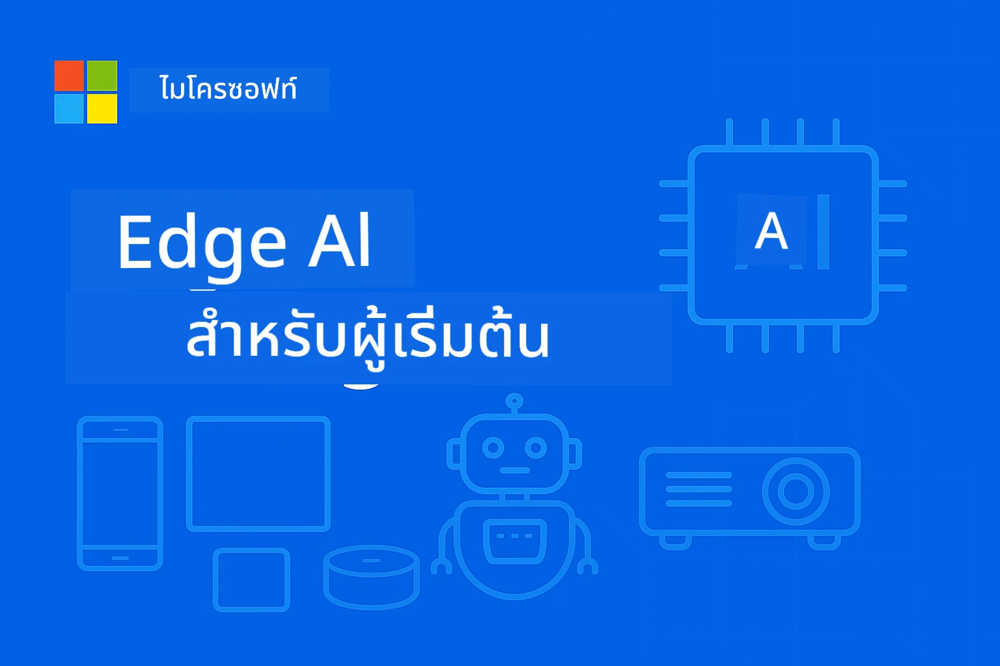

<!--
CO_OP_TRANSLATOR_METADATA:
{
  "original_hash": "ac31463ae3ed21a0ce83b0a351c23dd4",
  "translation_date": "2026-01-05T09:27:38+00:00",
  "source_file": "README.md",
  "language_code": "th"
}
-->
# EdgeAI สำหรับผู้เริ่มต้น




[](https://GitHub.com/microsoft/edgeai-for-beginners/graphs/contributors)
[](https://GitHub.com/microsoft/edgeai-for-beginners/issues)
[](https://GitHub.com/microsoft/edgeai-for-beginners/pulls)
[](http://makeapullrequest.com)

[](https://GitHub.com/microsoft/edgeai-for-beginners/watchers)
[](https://GitHub.com/microsoft/edgeai-for-beginners/fork)
[](https://GitHub.com/microsoft/edgeai-for-beginners/stargazers)


[](https://discord.gg/nTYy5BXMWG)

ทำตามขั้นตอนเหล่านี้เพื่อเริ่มต้นใช้งานทรัพยากรเหล่านี้:

1. **โคลนที่เก็บนี้**: คลิก [](https://GitHub.com/microsoft/edgeai-for-beginners/fork)
2. **โคลนที่เก็บนี้**:   `git clone https://github.com/microsoft/edgeai-for-beginners.git`
3. [**เข้าร่วม Azure AI Foundry Discord และพบปะผู้เชี่ยวชาญและนักพัฒนาร่วมกัน**](https://discord.com/invite/ByRwuEEgH4)


### 🌐 รองรับหลายภาษา

#### รองรับผ่าน GitHub Action (อัตโนมัติ & อัปเดตเสมอ)

<!-- CO-OP TRANSLATOR LANGUAGES TABLE START -->
[อารบิก](../ar/README.md) | [เบงกาลี](../bn/README.md) | [บัลแกเรียน](../bg/README.md) | [ภาษาพม่า (เมียนมา)](../my/README.md) | [จีน (ตัวย่อ)](../zh/README.md) | [จีน (ตัวเต็ม, ฮ่องกง)](../hk/README.md) | [จีน (ตัวเต็ม, มาเก๊า)](../mo/README.md) | [จีน (ตัวเต็ม, ไต้หวัน)](../tw/README.md) | [โครเอเชีย](../hr/README.md) | [เช็ก](../cs/README.md) | [เดนมาร์ก](../da/README.md) | [ดัตช์](../nl/README.md) | [เอสโตเนีย](../et/README.md) | [ฟินแลนด์](../fi/README.md) | [ฝรั่งเศส](../fr/README.md) | [เยอรมัน](../de/README.md) | [กรีก](../el/README.md) | [ฮิบรู](../he/README.md) | [ฮินดี](../hi/README.md) | [ฮังการี](../hu/README.md) | [อินโดนีเซีย](../id/README.md) | [อิตาลี](../it/README.md) | [ญี่ปุ่น](../ja/README.md) | [กันนาดา](../kn/README.md) | [เกาหลี](../ko/README.md) | [ลิทัวเนีย](../lt/README.md) | [มลายู](../ms/README.md) | [มาแลยาลัม](../ml/README.md) | [มราฐี](../mr/README.md) | [เนปาล](../ne/README.md) | [นีจีเรีย พิดจิน](../pcm/README.md) | [นอร์เวย์](../no/README.md) | [เปอร์เซีย (ฟาร์ซี)](../fa/README.md) | [โปแลนด์](../pl/README.md) | [โปรตุเกส (บราซิล)](../br/README.md) | [โปรตุเกส (โปรตุเกส)](../pt/README.md) | [ปัญจาบ (กูรมุขี)](../pa/README.md) | [โรมาเนีย](../ro/README.md) | [รัสเซีย](../ru/README.md) | [เซอร์เบีย (ซีริลลิก)](../sr/README.md) | [สโลวัก](../sk/README.md) | [สโลวีเนีย](../sl/README.md) | [สเปน](../es/README.md) | [สวาฮิลี](../sw/README.md) | [สวีเดน](../sv/README.md) | [ตากาล็อก (ฟิลิปปินส์)](../tl/README.md) | [ทมิฬ](../ta/README.md) | [เทลูกู](../te/README.md) | [ไทย](./README.md) | [ตุรกี](../tr/README.md) | [ยูเครน](../uk/README.md) | [อูรดู](../ur/README.md) | [เวียดนาม](../vi/README.md)

> **ชอบโคลนแบบโลคัล?**

> ที่เก็บนี้รวมการแปลมากกว่า 50 ภาษา ซึ่งเพิ่มขนาดในการดาวน์โหลดอย่างมาก หากต้องการโคลนโดยไม่ต้องมีการแปล ให้ใช้ sparse checkout:
> ```bash
> git clone --filter=blob:none --sparse https://github.com/microsoft/edgeai-for-beginners.git
> cd edgeai-for-beginners
> git sparse-checkout set --no-cone '/*' '!translations' '!translated_images'
> ```
> ซึ่งจะมอบทุกอย่างที่คุณต้องการเพื่อทำหลักสูตรให้เสร็จอย่างรวดเร็วขึ้นมาก
<!-- CO-OP TRANSLATOR LANGUAGES TABLE END -->

**หากคุณต้องการให้รองรับภาษาการแปลเพิ่มเติม รายการที่รองรับอยู่ที่ [ที่นี่](https://github.com/Azure/co-op-translator/blob/main/getting_started/supported-languages.md)**
## บทนำ

ยินดีต้อนรับสู่ **EdgeAI สำหรับผู้เริ่มต้น** – การเดินทางที่ครอบคลุมของคุณเข้าสู่โลกปฏิวัติของปัญญาประดิษฐ์ที่ปลายทางอุปกรณ์ หลักสูตรนี้เป็นสะพานเชื่อมระหว่างความสามารถ AI อันทรงพลังและการนำไปใช้จริงในโลกความเป็นจริงบนอุปกรณ์ขอบ ช่วยให้คุณควบคุมศักยภาพของ AI ได้โดยตรงในที่ซึ่งข้อมูลเกิดขึ้นและต้องตัดสินใจ

### สิ่งที่คุณจะเชี่ยวชาญ

หลักสูตรนี้พาคุณจากแนวคิดพื้นฐานสู่การใช้งานที่พร้อมสำหรับผลิตจริง ครอบคลุม:
- **โมเดลภาษาขนาดเล็ก (SLMs)** ที่ปรับแต่งสำหรับการนำไปใช้ที่ขอบ
- **การปรับแต่งที่ตระหนักถึงฮาร์ดแวร์** ในหลากหลายแพลตฟอร์ม
- **การอนุมานแบบเรียลไทม์** ที่รักษาความเป็นส่วนตัว
- **กลยุทธ์การนำไปใช้ในผลิตภัณฑ์** สำหรับแอปพลิเคชันในองค์กร

### ทำไม EdgeAI ถึงมีความสำคัญ

Edge AI แทนที่รูปแบบเดิม ๆ ด้วยการตอบโจทย์ความท้าทายสมัยใหม่ที่สำคัญ:
- **ความเป็นส่วนตัว & ความปลอดภัย**: ประมวลผลข้อมูลที่ละเอียดอ่อนในเครื่องโดยไม่ต้องเผยแพร่บนคลาวด์
- **ประสิทธิภาพแบบเรียลไทม์**: ขจัดความล่าช้าของเครือข่ายสำหรับแอปพลิเคชันที่ต้องใช้เวลารวดเร็ว
- **ประหยัดค่าใช้จ่าย**: ลดแบนด์วิดท์และค่าใช้จ่ายด้านการประมวลผลบนคลาวด์
- **การดำเนินงานที่ทนทาน**: รักษาการทำงานแม้เครือข่ายขัดข้อง
- **การปฏิบัติตามกฎระเบียบ**: ตอบสนองความต้องการเรื่องความเป็นเจ้าของข้อมูล

### Edge AI

Edge AI หมายถึงการรันอัลกอริธึม AI และโมเดลภาษาในเครื่องฮาร์ดแวร์ที่อยู่ใกล้กับสถานที่ที่ข้อมูลถูกสร้างขึ้น โดยไม่ต้องพึ่งพาทรัพยากรคลาวด์สำหรับการอนุมาน ช่วยลดความล่าช้า เพิ่มความเป็นส่วนตัว และเปิดใช้งานการตัดสินใจแบบทันที

### หลักการสำคัญ:
- **การอนุมานบนอุปกรณ์**: โมเดล AI ทำงานบนอุปกรณ์ปลายทาง (โทรศัพท์, เราเตอร์, ไมโครคอนโทรลเลอร์, พีซีอุตสาหกรรม)
- **ความสามารถออฟไลน์**: ทำงานได้โดยไม่ต้องเชื่อมต่ออินเทอร์เน็ตตลอดเวลา
- **ความหน่วงต่ำ**: ตอบสนองทันที เหมาะสำหรับระบบเวลาจริง
- **ความเป็นเจ้าของข้อมูล**: เก็บข้อมูลละเอียดอ่อนไว้ในเครื่อง เพิ่มความปลอดภัยและการปฏิบัติตาม

### โมเดลภาษาขนาดเล็ก (SLMs)

SLMs อย่าง Phi-4, Mistral-7B และ Gemma เป็นเวอร์ชันที่ปรับแต่งของ LLMs ขนาดใหญ่—ผ่านการฝึกหรือการกลั่นกรองเพื่อ:
- **ลดขนาดหน่วยความจำ**: ใช้หน่วยความจำของอุปกรณ์ขอบที่จำกัดอย่างมีประสิทธิภาพ
- **ความต้องการการประมวลผลต่ำกว่า**: ปรับแต่งให้เหมาะกับ CPU และ GPU ที่ขอบ
- **เวลาการเริ่มต้นที่รวดเร็วขึ้น**: การเริ่มต้นอย่างรวดเร็วสำหรับแอปพลิเคชันที่ตอบสนองทันที

โมเดลเหล่านี้ปลดล็อกความสามารถ NLP ที่ทรงพลังพร้อมรองรับข้อจำกัดของ:
- **ระบบฝังตัว**: อุปกรณ์ IoT และตัวควบคุมอุตสาหกรรม
- **อุปกรณ์เคลื่อนที่**: สมาร์ทโฟนและแท็บเล็ตที่สามารถใช้งานออฟไลน์ได้
- **อุปกรณ์ IoT**: เซ็นเซอร์และอุปกรณ์อัจฉริยะที่มีทรัพยากรจำกัด
- **เซิร์ฟเวอร์ขอบ**: หน่วยประมวลผลในพื้นที่ที่มี GPU จำกัด
- **คอมพิวเตอร์ส่วนบุคคล**: สถานการณ์การใช้งานบนเดสก์ท็อปและแล็ปท็อป

## โมดูลหลักสูตร & การนำทาง

| โมดูล | หัวข้อ | พื้นที่โฟกัส | เนื้อหาสำคัญ | ระดับ | ระยะเวลา |
|--------|-------|------------|-------------|--------|----------|
| [📖 00 ](./introduction.md) | [บทนำสู่ EdgeAI](./introduction.md) | พื้นฐาน & บริบท | ภาพรวม EdgeAI • การประยุกต์ใช้ในอุตสาหกรรม • บทนำ SLM • วัตถุประสงค์การเรียนรู้ | ผู้เริ่มต้น | 1-2 ชม. |
| [📚 01](../../Module01) | [พื้นฐาน EdgeAI](./Module01/README.md) | การเปรียบเทียบ Cloud vs Edge AI | พื้นฐาน EdgeAI • กรณีศึกษาในโลกจริง • คู่มือการใช้งาน • การนำไปใช้ที่ขอบ | ผู้เริ่มต้น | 3-4 ชม. |
| [🧠 02](../../Module02) | [รากฐานโมเดล SLM](./Module02/README.md) | ครอบครัวโมเดล & สถาปัตยกรรม | ครอบครัว Phi • ครอบครัว Qwen • ครอบครัว Gemma • BitNET • μModel • Phi-Silica | ผู้เริ่มต้น | 4-5 ชม. |
| [🚀 03](../../Module03) | [การฝึกปฏิบัติ SLM Deployment](./Module03/README.md) | การนำไปใช้ในเครื่อง & คลาวด์ | การเรียนรู้ขั้นสูง • สภาพแวดล้อมในเครื่อง • การนำไปใช้บนคลาวด์ | ขั้นกลาง | 4-5 ชม. |
| [⚙️ 04](../../Module04) | [ชุดเครื่องมือเพิ่มประสิทธิภาพโมเดล](./Module04/README.md) | การปรับแต่งข้ามแพลตฟอร์ม | บทนำ • Llama.cpp • Microsoft Olive • OpenVINO • Apple MLX • การสังเคราะห์เวิร์กโฟลว์ | ขั้นกลาง | 5-6 ชม. |
| [🔧 05](../../Module05) | [SLMOps ในการผลิต](./Module05/README.md) | การดำเนินงานผลิต | บทนำ SLMOps • การกลั่นกรองโมเดล • การปรับแต่ง • การนำไปใช้ในผลิต | ขั้นสูง | 5-6 ชม. |
| [🤖 06](../../Module06) | [AI Agents & การเรียกฟังก์ชัน](./Module06/README.md) | กรอบงานเอเจนต์ & MCP | บทนำเอเจนต์ • การเรียกฟังก์ชัน • โปรโตคอลบริบทของโมเดล | ขั้นสูง | 4-5 ชม. |
| [💻 07](../../Module07) | [การใช้งานแพลตฟอร์ม](./Module07/README.md) | ตัวอย่างข้ามแพลตฟอร์ม | ชุดเครื่องมือ AI • Foundry Local • การพัฒนา Windows | ขั้นสูง | 3-4 ชม. |
| [🏭 08](../../Module08) | [Foundry Local Toolkit](./Module08/README.md) | ตัวอย่างพร้อมสำหรับผลิตจริง | ตัวอย่างแอปพลิเคชัน (ดูรายละเอียดด้านล่าง) | ผู้เชี่ยวชาญ | 8-10 ชม. |

### 🏭 **โมดูล 08: ตัวอย่างแอปพลิเคชัน**

- [01: เริ่มต้นแชท REST](./Module08/samples/01/README.md)
- [02: การรวม SDK ของ OpenAI](./Module08/samples/02/README.md)
- [03: การค้นหาโมเดล & การวัดผล](./Module08/samples/03/README.md)
- [04: แอปพลิเคชัน Chainlit RAG](./Module08/samples/04/README.md)
- [05: การประสานงานมัลติเอเจนต์](./Module08/samples/05/README.md)
- [06: ตัวส่งผ่าน Models-as-Tools](./Module08/samples/06/README.md)
- [07: ลูกค้า API โดยตรง](./Module08/samples/07/README.md)
- [08: แอปแชท Windows 11](./Module08/samples/08/README.md)
- [09: ระบบมัลติเอเจนต์ขั้นสูง](./Module08/samples/09/README.md)
- [10: เฟรมเวิร์กเครื่องมือ Foundry](./Module08/samples/10/README.md)

### 🎓 **เวิร์กช็อป: เส้นทางการเรียนรู้แบบลงมือทำ**

เอกสารเวิร์กช็อปแบบครบถ้วน พร้อมการใช้งานจริงสำหรับผลิต:
- **[คู่มือเวิร์กช็อป](./Workshop/Readme.md)** - วัตถุประสงค์การเรียนรู้, ผลลัพธ์และเส้นทางการนำทางทรัพยากรครบถ้วน
- **ตัวอย่าง Python** (6 เซสชัน) - อัปเดตด้วยแนวทางปฏิบัติที่ดีที่สุด, การจัดการข้อผิดพลาด และเอกสารเต็มรูปแบบ
- **Jupyter Notebooks** (8 แบบโต้ตอบ) - สอนทีละขั้นตอนพร้อมเกณฑ์วัดและการติดตามประสิทธิภาพ
- **คู่มือเซสชัน** - คู่มือ markdown รายละเอียดสำหรับแต่ละเซสชันเวิร์กช็อป
- **เครื่องมือยืนยัน** - สคริปต์สำหรับตรวจสอบคุณภาพโค้ดและทดสอบเบื้องต้น

**สิ่งที่คุณจะพัฒนา:**
- แอปพลิเคชันแชท AI ในเครื่องพร้อมรองรับการสตรีม
- ท่อ RAG พร้อมการประเมินคุณภาพ (RAGAS)
- เครื่องมือวัดและเปรียบเทียบหลายโมเดล
- ระบบประสานงานมัลติเอเจนต์
- การส่งต่อโมเดลอัจฉริยะพร้อมการเลือกตามงาน

### 🎙️ **เวิร์กช็อปสำหรับ Agentic: ลงมือทำ - สตูดิโอพอดแคสต์ AI**

สร้างท่อผลิตพอดแคสต์ที่ขับเคลื่อนด้วย AI ตั้งแต่เริ่มต้น! เวิร์กช็อปการใช้งานนี้จะสอนให้คุณสร้างระบบมัลติเอเจนต์ครบวงจร ที่เปลี่ยนไอเดียเป็นตอนพอดแคสต์มืออาชีพ
**[🎬 เริ่มต้นเวิร์กช็อปสตูดิโอโปดคาสต์ AI](./WorkshopForAgentic/README.md)**

**ภารกิจของคุณ**: เปิดตัว "Future Bytes" — โปดคาสต์เทคโนโลยีที่ขับเคลื่อนโดยตัวแทน AI ที่คุณจะสร้างเองอย่างสมบูรณ์ ไม่มีการพึ่งพาคลาวด์ ไม่มีค่าใช้จ่าย API — ทุกอย่างทำงานแบบโลคอลบนเครื่องของคุณ

**สิ่งที่ทำให้โปรเจกต์นี้โดดเด่น:**
- **🤖 การประสานงานตัวแทน AI หลายตัวจริงจัง** - สร้างตัวแทน AI เฉพาะทางที่วิจัย เขียน และผลิตเสียง
- **🎯 กระบวนการผลิตครบวงจร** - ตั้งแต่การเลือกหัวข้อจนถึงการส่งออกเสียงโปดคาสต์ขั้นสุดท้าย
- **💻 การติดตั้งแบบ 100% ท้องถิ่น** - ใช้ Ollama และโมเดลท้องถิ่น (Qwen-3-8B) เพื่อความเป็นส่วนตัวและการควบคุมเต็มรูปแบบ
- **🎤 การรวมเทคโนโลยีแปลงข้อความเป็นเสียงพูด** - แปลงสคริปต์เป็นบทสนทนาเสียงหลายเสียงที่เป็นธรรมชาติ
- **✋ กระบวนการทำงานที่มีมนุษย์อยู่ในวงจร** - ประตูอนุมัติช่วยรับรองคุณภาพในขณะที่ยังรักษาการทำงานอัตโนมัติ

**เส้นทางการเรียนรู้สามบท:**

| บท  | เน้นเรื่อง | ทักษะหลัก | ระยะเวลา |
|-----|------------|------------|----------|
| **[บท 1: พบปะตัวช่วย AI ของคุณ](./WorkshopForAgentic/md/01.BuildAIAgentWithSLM.md)** | สร้างตัวแทน AI ตัวแรกของคุณ | การผสานเครื่องมือ • การค้นหาบนเว็บ • การแก้ปัญหา • การใช้เหตุผลตัวแทน | 2-3 ชม. |
| **[บท 2: ประกอบทีมผลิตของคุณ](./WorkshopForAgentic/md/02.AIAgentOrchestrationAndWorkflows.md)** | ประสานตัวแทนหลายตัว | การประสานงานทีม • กระบวนการอนุมัติ • อินเทอร์เฟซ DevUI • การดูแลของมนุษย์ | 3-4 ชม. |
| **[บท 3: สร้างชีวิตให้โปดคาสต์ของคุณ](./WorkshopForAgentic/md/03.Multi-SpeakerPodcastGenerationWithVibeVoice.md)** | สร้างเสียงโปดคาสต์ | แปลงข้อความเป็นเสียง • สังเคราะห์เสียงหลายคนพูด • เสียงหลายชั่วโมง • อัตโนมัติเต็มรูปแบบ | 2-3 ชม. |

**เทคโนโลยีที่ใช้:**
- **Microsoft Agent Framework** - การประสานงานและจัดการตัวแทนหลายตัว
- **Ollama** - รันไทม์โมเดล AI แบบท้องถิ่น (ไม่ต้องใช้คลาวด์)
- **Qwen-3-8B** - โมเดลภาษาที่เปิดเผยซอร์สและปรับแต่งสำหรับงานตัวแทน
- **API แปลงข้อความเป็นเสียงพูด** - สังเคราะห์เสียงที่เป็นธรรมชาติสำหรับการสร้างโปดคาสต์

**ฮาร์ดแวร์ที่รองรับ:**
- ✅ **โหมด CPU** - ใช้งานได้กับคอมพิวเตอร์ยุคใหม่ทุกเครื่อง (แนะนำ RAM 8GB ขึ้นไป)
- 🚀 **เร่งความเร็ว GPU** - การอนุมานที่รวดเร็วขึ้นอย่างมีนัยสำคัญด้วย GPU ของ NVIDIA/AMD
- ⚡ **รองรับ NPU** - การเร่งด้วยหน่วยประมวลผลประสาทเทียมรุ่นถัดไป

**เหมาะสำหรับ:**
- นักพัฒนาที่เรียนรู้ระบบ AI ตัวแทนหลายตัว
- ทุกคนที่สนใจในระบบอัตโนมัติ AI และกระบวนการทำงาน
- ผู้สร้างเนื้อหาที่สำรวจการผลิตด้วยความช่วยเหลือจาก AI
- นักเรียนที่ศึกษารูปแบบการประสานงาน AI ในทางปฏิบัติ

**เริ่มสร้างเลย**: [🎙️ เวิร์กช็อปสตูดิโอโปดคาสต์ AI →](./WorkshopForAgentic/README.md)

### 📊 **สรุปเส้นทางการเรียนรู้**
- **ระยะเวลารวม**: 36-45 ชั่วโมง
- **เส้นทางสำหรับผู้เริ่มต้น**: โมดูล 01-02 (7-9 ชั่วโมง)  
- **เส้นทางระดับกลาง**: โมดูล 03-04 (9-11 ชั่วโมง)
- **เส้นทางขั้นสูง**: โมดูล 05-07 (12-15 ชั่วโมง)
- **เส้นทางผู้เชี่ยวชาญ**: โมดูล 08 (8-10 ชั่วโมง)

## สิ่งที่คุณจะได้สร้าง

### 🎯 ทักษะหลัก
- **สถาปัตยกรรม Edge AI**: ออกแบบระบบ AI ที่เน้นท้องถิ่นก่อนและมีการผสานคลาวด์
- **การปรับแต่งโมเดล**: ควอนตีไรซ์และบีบอัดโมเดลสำหรับการติดตั้งที่ Edge (เพิ่มความเร็ว 85%, ลดขนาด 75%)
- **การติดตั้งหลายแพลตฟอร์ม**: Windows, มือถือ, อุปกรณ์ฝังตัว และระบบคลาวด์-Edge แบบผสมผสาน
- **การดำเนินงานเชิงผลิต**: ตรวจสอบ ติดตาม และบำรุงรักษา Edge AI ในการผลิต

### 🏗️ โครงการปฏิบัติ
- **แอปแชท Foundry Local**: แอป Windows 11 เนทีฟพร้อมสลับโมเดล
- **ระบบตัวแทนหลายตัว**: ผู้ประสานงานกับตัวแทนเฉพาะทางสำหรับกระบวนการทำงานซับซ้อน  
- **แอปรับข้อมูลตามคำถาม (RAG)**: ประมวลผลเอกสารท้องถิ่นกับการค้นหาเวกเตอร์
- **เราท์เตอร์โมเดล**: การเลือกโมเดลอย่างชาญฉลาดตามการวิเคราะห์งาน
- **กรอบ API**: ลูกค้าพร้อมผลิตด้วยการสตรีมและตรวจสอบสุขภาพ
- **เครื่องมือข้ามแพลตฟอร์ม**: แบบแผนการรวม LangChain/Semantic Kernel

### 🏢 การใช้งานในอุตสาหกรรม
**การผลิต** • **การดูแลสุขภาพ** • **ยานยนต์อัตโนมัติ** • **เมืองอัจฉริยะ** • **แอปมือถือ**

## เริ่มต้นด่วน

**เส้นทางแนะนำในการเรียนรู้** (รวม 20-30 ชั่วโมง):

0. **📖 แนะนำ** ([Introduction.md](./introduction.md)): รากฐาน Edge AI + บริบทอุตสาหกรรม + กรอบการเรียนรู้
1. **📚 รากฐาน** (โมดูล 01-02): แนวคิด Edge AI + ตระกูลโมเดล SLM
2. **⚙️ การปรับแต่ง** (โมดูล 03-04): การติดตั้ง + กรอบการควอนตีไรซ์  
3. **🚀 การผลิต** (โมดูล 05-06): SLMOps + ตัวแทน AI + การเรียกใช้งานฟังก์ชัน
4. **💻 การใช้งานจริง** (โมดูล 07-08): ตัวอย่างแพลตฟอร์ม + ชุดเครื่องมือ Foundry Local

แต่ละโมดูลประกอบด้วยทฤษฎี, การฝึกปฏิบัติ, และตัวอย่างโค้ดพร้อมใช้งานจริง

## ผลกระทบในอาชีพ

**บทบาททางเทคนิค**: สถาปนิกโซลูชัน Edge AI • วิศวกร ML (Edge) • นักพัฒนา AI IoT • นักพัฒนา AI มือถือ

**ภาคอุตสาหกรรม**: การผลิต 4.0 • เทคโนโลยีดูแลสุขภาพ • ระบบอัตโนมัติ • FinTech • อิเล็กทรอนิกส์สำหรับผู้บริโภค

**โปรเจกต์พอร์ตโฟลิโอ**: ระบบตัวแทนหลายตัว • แอปรับข้อมูลตามคำถามในผลิต • การติดตั้งข้ามแพลตฟอร์ม • การปรับแต่งประสิทธิภาพ

## โครงสร้างรีโพสิตอรี่

```
edgeai-for-beginners/
├── 📖 introduction.md  # Foundation: EdgeAI Overview & Learning Framework
├── 📚 Module01-04/     # Fundamentals → SLMs → Deployment → Optimization  
├── 🔧 Module05-06/     # SLMOps → AI Agents → Function Calling
├── 💻 Module07/        # Platform Samples (VS Code, Windows, Jetson, Mobile)
├── 🏭 Module08/        # Foundry Local Toolkit + 10 Comprehensive Samples
│   ├── samples/01-06/  # Foundation: REST, SDK, RAG, Agents, Routing
│   └── samples/07-10/  # Advanced: API Client, Windows App, Enterprise Agents, Tools
├── 🌐 translations/    # Multi-language support (8+ languages)
└── 📋 STUDY_GUIDE.md   # Structured learning paths & time allocation
```

## ไฮไลท์หลักของหลักสูตร

✅ **การเรียนรู้แบบก้าวหน้า**: ทฤษฎี → ปฏิบัติ → การติดตั้งใช้งานจริง  
✅ **กรณีศึกษาจริง**: Microsoft, Japan Airlines, การใช้งานในองค์กร  
✅ **ตัวอย่างฝึกปฏิบัติ**: มากกว่า 50 ตัวอย่าง, 10 เดโม Foundry Local ครบถ้วน  
✅ **เน้นประสิทธิภาพ**: ปรับปรุงความเร็ว 85%, ลดขนาด 75%  
✅ **หลายแพลตฟอร์ม**: Windows, มือถือ, ฝังตัว, คลาวด์-Edge แบบผสม  
✅ **พร้อมใช้งานในผลิต**: การตรวจสอบ, การปรับขนาด, ความปลอดภัย, กรอบปฏิบัติตามข้อกำหนด

📖 **[คู่มือการศึกษา](STUDY_GUIDE.md)**: เส้นทางการเรียนรู้ 20 ชั่วโมงที่จัดโครงสร้าง พร้อมคำแนะนำการจัดสรรเวลาและเครื่องมือประเมินตนเอง

---

**EdgeAI คืออนาคตของการติดตั้ง AI**: เน้นท้องถิ่นก่อน รักษาความเป็นส่วนตัว และมีประสิทธิภาพ เชี่ยวชาญทักษะเหล่านี้เพื่อสร้างแอปพลิเคชันอัจฉริยะยุคหน้า

## หลักสูตรอื่น ๆ

ทีมของเรามีหลักสูตรอื่น ๆ ให้เลือกชม! ดูได้ที่:

<!-- CO-OP TRANSLATOR OTHER COURSES START -->
### LangChain
[](https://aka.ms/langchain4j-for-beginners)
[](https://aka.ms/langchainjs-for-beginners?WT.mc_id=m365-94501-dwahlin)

---

### Azure / Edge / MCP / Agents
[](https://github.com/microsoft/AZD-for-beginners?WT.mc_id=academic-105485-koreyst)
[](https://github.com/microsoft/edgeai-for-beginners?WT.mc_id=academic-105485-koreyst)
[](https://github.com/microsoft/mcp-for-beginners?WT.mc_id=academic-105485-koreyst)
[](https://github.com/microsoft/ai-agents-for-beginners?WT.mc_id=academic-105485-koreyst)

---

### ชุด Generative AI
[](https://github.com/microsoft/generative-ai-for-beginners?WT.mc_id=academic-105485-koreyst)
[-9333EA?style=for-the-badge&labelColor=E5E7EB&color=9333EA)](https://github.com/microsoft/Generative-AI-for-beginners-dotnet?WT.mc_id=academic-105485-koreyst)
[-C084FC?style=for-the-badge&labelColor=E5E7EB&color=C084FC)](https://github.com/microsoft/generative-ai-for-beginners-java?WT.mc_id=academic-105485-koreyst)
[-E879F9?style=for-the-badge&labelColor=E5E7EB&color=E879F9)](https://github.com/microsoft/generative-ai-with-javascript?WT.mc_id=academic-105485-koreyst)

---

### การเรียนรู้แกนกลาง
[](https://aka.ms/ml-beginners?WT.mc_id=academic-105485-koreyst)
[](https://aka.ms/datascience-beginners?WT.mc_id=academic-105485-koreyst)
[](https://aka.ms/ai-beginners?WT.mc_id=academic-105485-koreyst)
[](https://github.com/microsoft/Security-101?WT.mc_id=academic-96948-sayoung)
[](https://aka.ms/webdev-beginners?WT.mc_id=academic-105485-koreyst)
[](https://aka.ms/iot-beginners?WT.mc_id=academic-105485-koreyst)
[](https://github.com/microsoft/xr-development-for-beginners?WT.mc_id=academic-105485-koreyst)

---

### ชุด Copilot
[](https://aka.ms/GitHubCopilotAI?WT.mc_id=academic-105485-koreyst)
[](https://github.com/microsoft/mastering-github-copilot-for-dotnet-csharp-developers?WT.mc_id=academic-105485-koreyst)
[](https://github.com/microsoft/CopilotAdventures?WT.mc_id=academic-105485-koreyst)
<!-- CO-OP TRANSLATOR OTHER COURSES END -->

## ขอความช่วยเหลือ

หากคุณติดขัดหรือต้องการสอบถามเกี่ยวกับการสร้างแอป AI เข้าร่วมที่:

[](https://discord.gg/nTYy5BXMWG)

หากคุณมีความคิดเห็นเกี่ยวกับผลิตภัณฑ์หรือพบข้อผิดพลาดขณะสร้าง โปรดเยี่ยมชม:

[](https://aka.ms/foundry/forum)

---

<!-- CO-OP TRANSLATOR DISCLAIMER START -->
**ข้อจำกัดความรับผิดชอบ**:  
เอกสารนี้ถูกแปลโดยใช้บริการแปลภาษา AI [Co-op Translator](https://github.com/Azure/co-op-translator) แม้เราจะพยายามให้ข้อมูลถูกต้อง แต่โปรดทราบว่าการแปลโดยอัตโนมัติอาจมีข้อผิดพลาดหรือความไม่ถูกต้อง เอกสารต้นฉบับในภาษาต้นฉบับถือเป็นแหล่งข้อมูลที่เชื่อถือได้ หากเป็นข้อมูลสำคัญแนะนำให้ใช้บริการแปลโดยผู้เชี่ยวชาญที่เป็นมนุษย์ เราไม่รับผิดชอบต่อความเข้าใจผิดหรือการตีความผิดที่เกิดขึ้นจากการใช้การแปลนี้
<!-- CO-OP TRANSLATOR DISCLAIMER END -->